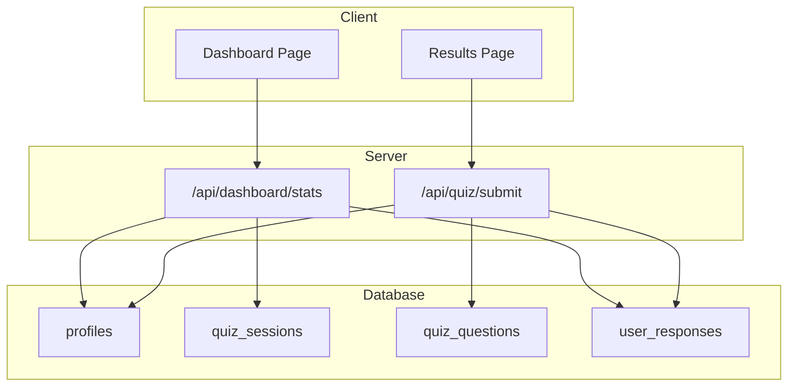
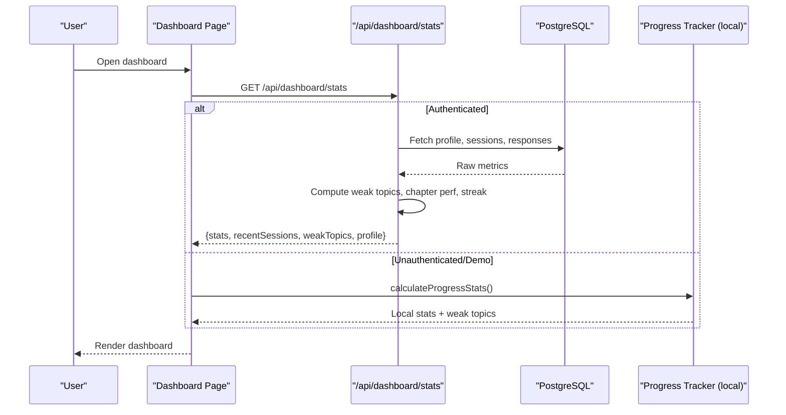
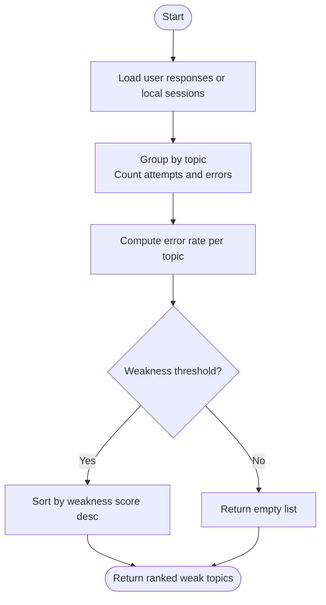
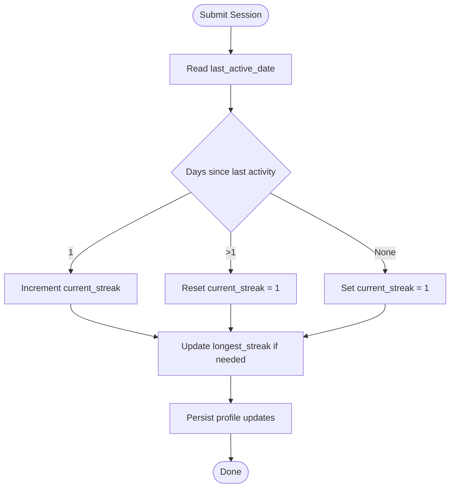
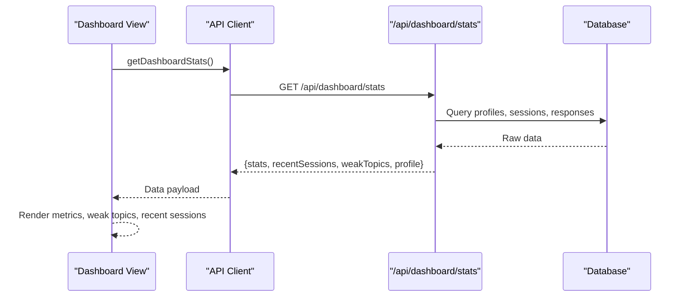
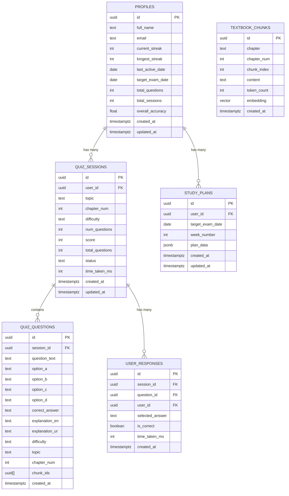
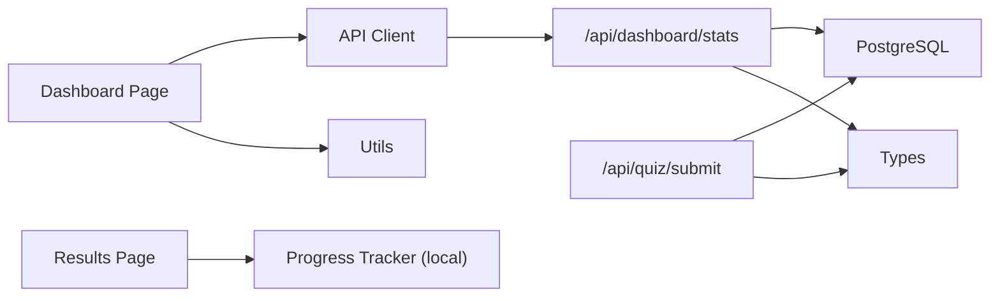

# Progress Tracking & Analytics

<cite>
**Referenced Files in This Document**
- [progress-tracker.ts](file://src/lib/progress-tracker.ts)
- [route.ts (dashboard stats)](file://src/app/api/dashboard/stats/route.ts)
- [route.ts (quiz submit)](file://src/app/api/quiz/submit/route.ts)
- [page.tsx (dashboard)](file://src/app/dashboard/page.tsx)
- [page.tsx (results)](file://src/app/results/[session]/page.tsx)
- [schema.sql](file://supabase/schema.sql)
- [quiz.ts (types)](file://src/types/quiz.ts)
- [api-client.ts](file://src/lib/api-client.ts)
- [utils.ts](file://src/lib/utils.ts)
- [mock-data.ts](file://src/lib/mock-data.ts)
</cite>

## Table of Contents
1. Introduction
2. Project Structure
3. Core Components
4. Architecture Overview
5. Detailed Component Analysis
6. Dependency Analysis
7. Performance Considerations
8. Troubleshooting Guide
9. Conclusion
10. Appendices

## Introduction
This document explains MedAce-AI’s progress tracking and analytics system that monitors student performance across multiple dimensions. It covers:
- Weak-spot identification algorithm that analyzes answer patterns to pinpoint topics where students struggle
- Study streak tracking system that encourages consistent learning habits and provides motivational feedback
- Dashboard implementation that visualizes performance metrics, chapter-wise analysis, and improvement trends
- Database schema design for storing quiz sessions, answer records, and performance metrics
- Educator use cases for identifying at-risk students and customizing interventions
- Real-time update considerations, data aggregation strategies, and privacy safeguards

## Project Structure
The analytics pipeline spans client UI, server routes, and a PostgreSQL-backed database with Row Level Security policies. Key areas:
- Client dashboard and results pages render metrics and session details
- API routes compute weak topics, recent sessions, and profile stats from the database
- A local progress tracker computes on-device stats when no backend data is available
- The database stores sessions, questions, responses, and user profiles with RLS policies

**Diagram sources**
- [page.tsx (dashboard):34-70](file://src/app/dashboard/page.tsx#L34-L70)
- [route.ts (dashboard stats):6-172](file://src/app/api/dashboard/stats/route.ts#L6-L172)
- [route.ts (quiz submit):6-132](file://src/app/api/quiz/submit/route.ts#L6-L132)
- [schema.sql:11-25](file://supabase/schema.sql#L11-L25)
- [schema.sql:47-60](file://supabase/schema.sql#L47-L60)
- [schema.sql:65-81](file://supabase/schema.sql#L65-L81)
- [schema.sql:86-95](file://supabase/schema.sql#L86-L95)

**Section sources**
- [page.tsx (dashboard):34-70](file://src/app/dashboard/page.tsx#L34-L70)
- [route.ts (dashboard stats):6-172](file://src/app/api/dashboard/stats/route.ts#L6-L172)
- [route.ts (quiz submit):6-132](file://src/app/api/quiz/submit/route.ts#L6-L132)
- [schema.sql:11-25](file://supabase/schema.sql#L11-L25)
- [schema.sql:47-60](file://supabase/schema.sql#L47-L60)
- [schema.sql:65-81](file://supabase/schema.sql#L65-L81)
- [schema.sql:86-95](file://supabase/schema.sql#L86-L95)

## Core Components
- Weak-spot identification: Aggregates per-topic error rates from user responses or local sessions to rank topics by weakness score
- Study streak tracking: Maintains current and longest streaks based on last active date and daily activity
- Dashboard visualization: Displays total questions, weekly volume, accuracy rate, sessions completed, streak, weak topics, and recent sessions
- Results view: Shows per-question correctness, explanations, average time, and filters by correct/wrong/skipped
- Data persistence: Stores sessions, answers, and profile metrics; enforces RLS for privacy

**Section sources**
- [progress-tracker.ts:37-191](file://src/lib/progress-tracker.ts#L37-L191)
- [route.ts (dashboard stats):85-149](file://src/app/api/dashboard/stats/route.ts#L85-L149)
- [route.ts (quiz submit):76-121](file://src/app/api/quiz/submit/route.ts#L76-L121)
- [page.tsx (dashboard):101-285](file://src/app/dashboard/page.tsx#L101-L285)
- [page.tsx (results):69-106](file://src/app/results/[session]/page.tsx#L69-L106)
- [schema.sql:11-25](file://supabase/schema.sql#L11-L25)
- [schema.sql:47-60](file://supabase/schema.sql#L47-L60)
- [schema.sql:86-95](file://supabase/schema.sql#L86-L95)

## Architecture Overview
The system follows a client-server model with server-side analytics and secure data access:
- The dashboard page requests aggregated stats via an API route
- The API route queries the database for sessions, responses, and profile data, then computes weak topics and chapter performance
- Quiz submission validates input, scores answers, persists responses, updates session status, and recalculates profile-level streaks and accuracy
- Local fallback uses localStorage-based history to compute stats when no authenticated data exists

**Diagram sources**
- [page.tsx (dashboard):47-70](file://src/app/dashboard/page.tsx#L47-L70)
- [route.ts (dashboard stats):6-172](file://src/app/api/dashboard/stats/route.ts#L6-L172)
- [progress-tracker.ts:37-191](file://src/lib/progress-tracker.ts#L37-L191)

## Detailed Component Analysis

### Weak-Spot Identification Algorithm
Purpose: Identify topics where students consistently perform poorly to guide targeted practice.

How it works:
- Server path: Aggregates per-topic attempt counts and error counts from user_responses joined with quiz_questions topic/chapter metadata. Computes error rate per topic and filters topics with significant weakness (e.g., threshold), then sorts descending by weakness score.
- Local path: Aggregates per-session topic totals and errors from local history, computes error rate per topic, and ranks by weakness score.

Complexity:
- Time: O(N) over responses or sessions to aggregate per topic
- Space: O(T) for topic map, where T is number of distinct topics

Optimization opportunities:
- Precompute topic aggregates in materialized views or scheduled jobs
- Cache computed weak topics per user with TTL
- Add weighting by recency or difficulty to refine weakness scoring

Error handling:
- Gracefully handles missing topic metadata and empty datasets
- Returns empty lists when no data is available

Privacy:
- Uses RLS policies to ensure users only see their own responses and sessions

**Diagram sources**
- [route.ts (dashboard stats):85-127](file://src/app/api/dashboard/stats/route.ts#L85-L127)
- [progress-tracker.ts:149-161](file://src/lib/progress-tracker.ts#L149-L161)

**Section sources**
- [route.ts (dashboard stats):85-127](file://src/app/api/dashboard/stats/route.ts#L85-L127)
- [progress-tracker.ts:149-161](file://src/lib/progress-tracker.ts#L149-L161)

### Study Streak Tracking System
Purpose: Encourage consistent daily practice by tracking consecutive days of activity and providing visible motivation.

How it works:
- On quiz submission, the system reads the user’s last active date and calculates the difference in days
- If the difference is exactly one day, increment current streak; otherwise reset to 1
- Update longest streak if current exceeds previous
- Persist updated streaks, last active date, total questions, total sessions, and overall accuracy in the profile table

Motivational feedback:
- Dashboard displays current streak prominently
- Results and practice flows can surface streak milestones and prompts to maintain consistency

Edge cases:
- First-time users start at streak 1
- Missed days reset streak to 1 on next activity

**Diagram sources**
- [route.ts (quiz submit):76-121](file://src/app/api/quiz/submit/route.ts#L76-L121)
- [schema.sql:11-25](file://supabase/schema.sql#L11-L25)

**Section sources**
- [route.ts (quiz submit):76-121](file://src/app/api/quiz/submit/route.ts#L76-L121)
- [schema.sql:11-25](file://supabase/schema.sql#L11-L25)

### Dashboard Implementation
Purpose: Visualize performance metrics, chapter-wise analysis, and recent sessions to help students understand progress and focus areas.

Key features:
- Metrics cards: Total questions, weekly volume, accuracy rate, sessions completed, study streak
- Weak spots panel: Ranked topics with progress bars indicating weakness severity
- Recent sessions list: Links to detailed results per session
- Fallback behavior: If no authenticated data, uses local progress calculation

Data flow:
- Dashboard calls getDashboardStats API
- API returns stats, recent sessions, weak topics, and profile
- If unavailable, dashboard falls back to local calculator

Accessibility:
- Clear labels and color-coded accuracy indicators
- Actionable links to practice and results

**Diagram sources**
- [page.tsx (dashboard):47-70](file://src/app/dashboard/page.tsx#L47-L70)
- [api-client.ts:100-117](file://src/lib/api-client.ts#L100-L117)
- [route.ts (dashboard stats):6-172](file://src/app/api/dashboard/stats/route.ts#L6-L172)

**Section sources**
- [page.tsx (dashboard):101-285](file://src/app/dashboard/page.tsx#L101-L285)
- [api-client.ts:100-117](file://src/lib/api-client.ts#L100-L117)
- [route.ts (dashboard stats):6-172](file://src/app/api/dashboard/stats/route.ts#L6-L172)

### Results Page and Improvement Trends
Purpose: Provide detailed per-session insights including correctness, explanations, and timing to support reflection and improvement.

Highlights:
- Score circle and grade label based on percentage
- Correct/Wrong/Skipped breakdown
- Average time per question
- Question review with toggleable Urdu explanations
- Filters by correctness to focus on weak areas

Trend signals:
- While not explicitly charted here, repeated sessions enable educators to observe improvement trends via cumulative accuracy and weak-spot progression

**Section sources**
- [page.tsx (results):69-106](file://src/app/results/[session]/page.tsx#L69-L106)
- [page.tsx (results):111-167](file://src/app/results/[session]/page.tsx#L111-L167)
- [page.tsx (results):214-350](file://src/app/results/[session]/page.tsx#L214-L350)

### Database Schema Design
Core tables:
- profiles: User metadata, streaks, last active date, totals, overall accuracy
- quiz_sessions: Session metadata, topic, difficulty, score, status, timestamps
- quiz_questions: Question content, options, correct answer, explanations, topic/chapter
- user_responses: Per-answer records with correctness and timing
- study_plans: JSONB plans per week/user
- textbook_chunks: RAG vector store with embeddings and indexes

Security:
- Row Level Security policies restrict access to user-specific data
- Public read access to textbook chunks for RAG

Indexes:
- HNSW index on embeddings for fast similarity search
- Standard indexes on user_id, session_id for efficient joins

**Diagram sources**
- [schema.sql:11-25](file://supabase/schema.sql#L11-L25)
- [schema.sql:47-60](file://supabase/schema.sql#L47-L60)
- [schema.sql:65-81](file://supabase/schema.sql#L65-L81)
- [schema.sql:86-95](file://supabase/schema.sql#L86-L95)
- [schema.sql:101-109](file://supabase/schema.sql#L101-L109)
- [schema.sql:27-44](file://supabase/schema.sql#L27-L44)

**Section sources**
- [schema.sql:11-25](file://supabase/schema.sql#L11-L25)
- [schema.sql:47-60](file://supabase/schema.sql#L47-L60)
- [schema.sql:65-81](file://supabase/schema.sql#L65-L81)
- [schema.sql:86-95](file://supabase/schema.sql#L86-L95)
- [schema.sql:101-109](file://supabase/schema.sql#L101-L109)
- [schema.sql:27-44](file://supabase/schema.sql#L27-L44)

## Dependency Analysis
Key dependencies and relationships:
- Dashboard depends on API client and server route for live data; falls back to local progress tracker
- Quiz submission depends on validation schemas, Supabase admin client, and database tables
- Types define contracts between frontend and backend payloads
- Utilities provide formatting helpers used across UI components

**Diagram sources**
- [page.tsx (dashboard):47-70](file://src/app/dashboard/page.tsx#L47-L70)
- [api-client.ts:100-117](file://src/lib/api-client.ts#L100-L117)
- [route.ts (dashboard stats):6-172](file://src/app/api/dashboard/stats/route.ts#L6-L172)
- [route.ts (quiz submit):6-132](file://src/app/api/quiz/submit/route.ts#L6-L132)
- [quiz.ts:1-107](file://src/types/quiz.ts#L1-L107)
- [utils.ts:8-33](file://src/lib/utils.ts#L8-L33)

**Section sources**
- [page.tsx (dashboard):47-70](file://src/app/dashboard/page.tsx#L47-L70)
- [api-client.ts:100-117](file://src/lib/api-client.ts#L100-L117)
- [route.ts (dashboard stats):6-172](file://src/app/api/dashboard/stats/route.ts#L6-L172)
- [route.ts (quiz submit):6-132](file://src/app/api/quiz/submit/route.ts#L6-L132)
- [quiz.ts:1-107](file://src/types/quiz.ts#L1-L107)
- [utils.ts:8-33](file://src/lib/utils.ts#L8-L33)

## Performance Considerations
- Aggregation efficiency: Topic aggregation runs in linear time over responses/sessions; consider caching or precomputing for large datasets
- Database indexing: Ensure indexes on user_id and session_id are utilized; HNSW index accelerates vector similarity searches for RAG
- Network latency: Batch queries where possible; minimize round trips by fetching related data together
- Client rendering: Use lazy loading and pagination for long session histories; avoid re-renders by memoizing derived data
- Streak calculations: Keep lightweight; avoid heavy computations on every load

[No sources needed since this section provides general guidance]

## Troubleshooting Guide
Common issues and resolutions:
- No dashboard data: Verify authentication state; if unauthenticated, the dashboard falls back to local stats
- Incorrect weak topics: Check that user_responses have correct topic mappings and that thresholds are appropriate
- Streak not updating: Confirm last_active_date logic and timezone handling; ensure submission completes successfully
- API errors: Inspect server logs for internal server errors; validate request payloads against schemas

**Section sources**
- [route.ts (dashboard stats):173-180](file://src/app/api/dashboard/stats/route.ts#L173-L180)
- [route.ts (quiz submit):133-140](file://src/app/api/quiz/submit/route.ts#L133-L140)
- [page.tsx (dashboard):47-70](file://src/app/dashboard/page.tsx#L47-L70)

## Conclusion
MedAce-AI’s analytics system combines robust server-side aggregation, secure data storage, and intuitive dashboards to help students and educators track progress and identify areas for improvement. The weak-spot algorithm and streak tracking foster focused practice and consistent habits, while the schema and RLS policies ensure privacy and scalability.

[No sources needed since this section summarizes without analyzing specific files]

## Appendices

### Educator Use Cases
- Identify at-risk students: Monitor low accuracy rates and high weakness scores across topics; flag students with declining streaks or prolonged gaps in activity
- Customize interventions: Recommend targeted practice sessions for weak topics; adjust difficulty levels based on performance trends
- Track improvement: Compare historical accuracy and weak-spot rankings to evaluate intervention effectiveness

[No sources needed since this section provides general guidance]

### Real-Time Updates
- Current implementation loads data on demand; to approximate real-time updates:
  - Poll the dashboard stats endpoint periodically or use WebSockets for live notifications
  - Debounce frequent submissions to avoid excessive writes
  - Cache computed metrics with short TTLs to reduce database load

[No sources needed since this section provides general guidance]

### Data Aggregation Strategies
- Server-side aggregation: Aggregate per-topic metrics from user_responses and quiz_questions
- Local fallback: Use localStorage history to compute stats when offline or unauthenticated
- Precomputation: Consider nightly jobs to compute rolling windows (weekly/monthly) for faster dashboard loads

[No sources needed since this section provides general guidance]

### Privacy Considerations
- Row Level Security: Enforce user-scoped access to profiles, sessions, responses, and study plans
- Minimal exposure: Only return necessary fields to clients; avoid exposing raw explanations unless requested
- Secure endpoints: Validate inputs and authenticate requests before processing sensitive data

**Section sources**
- [schema.sql:155-229](file://supabase/schema.sql#L155-L229)