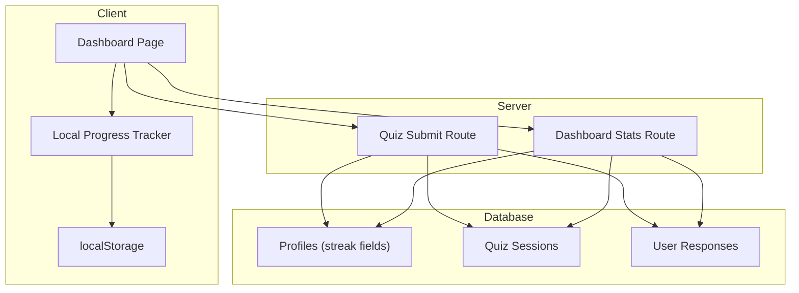
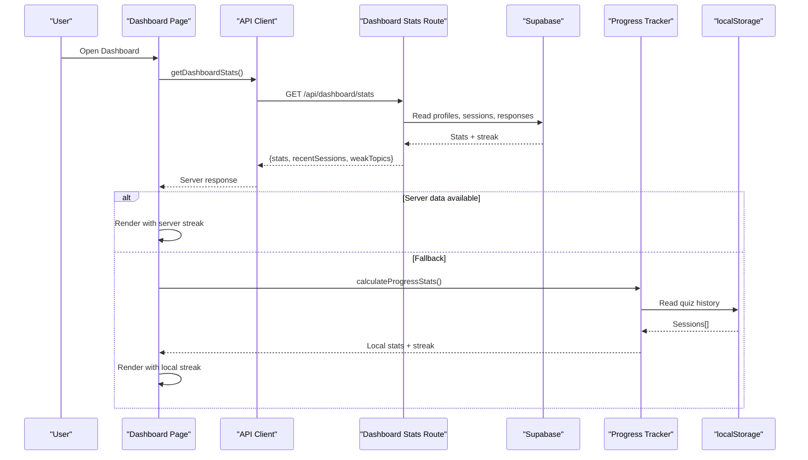
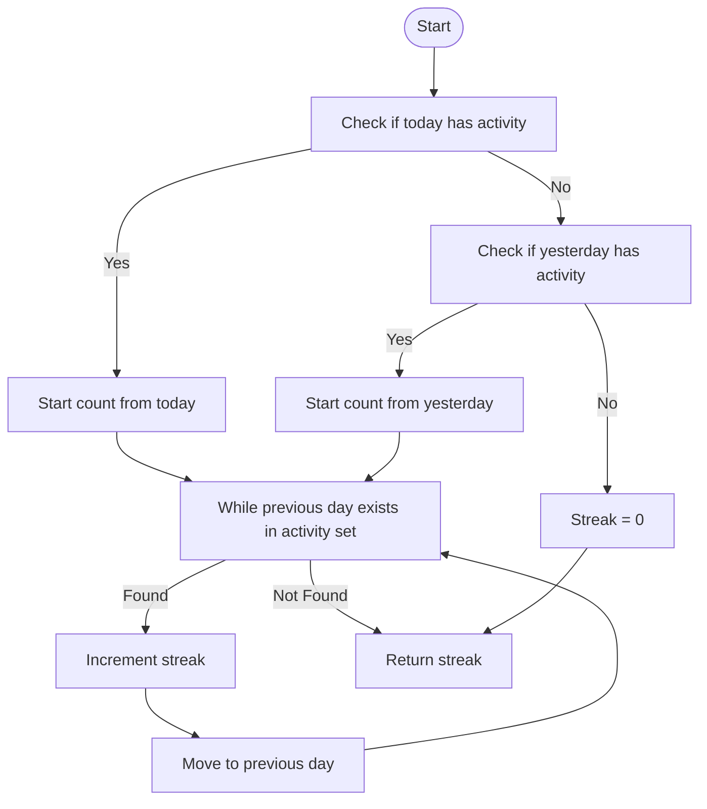
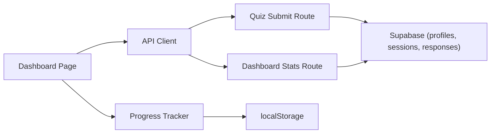

# Study Streak Tracking System

<cite>
**Referenced Files in This Document**
- [progress-tracker.ts](file://src/lib/progress-tracker.ts)
- [dashboard/page.tsx](file://src/app/dashboard/page.tsx)
- [quiz submit route](file://src/app/api/quiz/submit/route.ts)
- [dashboard stats route](file://src/app/api/dashboard/stats/route.ts)
- [api-client.ts](file://src/lib/api-client.ts)
- [utils.ts](file://src/lib/utils.ts)
- [quiz types](file://src/types/quiz.ts)
- [schema.sql](file://supabase/schema.sql)
</cite>

## Table of Contents
1. Introduction
2. Project Structure
3. Core Components
4. Architecture Overview
5. Detailed Component Analysis
6. Dependency Analysis
7. Performance Considerations
8. Troubleshooting Guide
9. Conclusion
10. Appendices

## Introduction
This document explains the study streak tracking system that motivates consistent learning by identifying consecutive days of quiz activity and maintaining motivational momentum. It covers:
- The streak calculation algorithm for both server-side (Supabase) and client-side (local storage) data sources
- Handling of date boundaries, timezone considerations, and streak resets when students miss days
- Integration with local storage to persist quiz history and compute streaks without server connectivity
- Dashboard visualization of streaks and how streak data influences engagement strategies
- Edge cases including first-time users, returning users after breaks, and multi-device synchronization

## Project Structure
The streak system spans UI, API routes, utilities, and database schema:
- Client-side progress tracker computes streaks from local storage when server data is unavailable
- Server-side submission route updates user profile streaks on each completed session
- Dashboard displays streaks and falls back to local calculations if needed
- Database schema stores streak-related fields and timestamps for accurate day-based logic

**Diagram sources**
- [dashboard/page.tsx:34-70](file://src/app/dashboard/page.tsx#L34-L70)
- [progress-tracker.ts:12-35](file://src/lib/progress-tracker.ts#L12-L35)
- [quiz submit route:6-123](file://src/app/api/quiz/submit/route.ts#L6-L123)
- [dashboard stats route:6-172](file://src/app/api/dashboard/stats/route.ts#L6-L172)
- [schema.sql:11-24](file://supabase/schema.sql#L11-L24)

**Section sources**
- [dashboard/page.tsx:34-70](file://src/app/dashboard/page.tsx#L34-L70)
- [progress-tracker.ts:12-35](file://src/lib/progress-tracker.ts#L12-L35)
- [quiz submit route:6-123](file://src/app/api/quiz/submit/route.ts#L6-L123)
- [dashboard stats route:6-172](file://src/app/api/dashboard/stats/route.ts#L6-L172)
- [schema.sql:11-24](file://supabase/schema.sql#L11-L24)

## Core Components
- Local progress tracker: reads/writes localStorage, calculates streaks from sessions, and provides dashboard-ready stats
- Quiz submission API: validates answers, records responses, updates session status, and increments streaks in profiles
- Dashboard stats API: aggregates recent sessions, weak topics, and returns streaks stored in profiles
- Dashboard UI: fetches server stats and falls back to local calculations; visualizes streak prominently

Key responsibilities:
- Accurate day-based streak computation using normalized dates
- Robust fallback to local storage for offline or unauthenticated usage
- Consistent update of streaks on the server upon session completion

**Section sources**
- [progress-tracker.ts:37-191](file://src/lib/progress-tracker.ts#L37-L191)
- [quiz submit route:6-123](file://src/app/api/quiz/submit/route.ts#L6-L123)
- [dashboard stats route:6-172](file://src/app/api/dashboard/stats/route.ts#L6-L172)
- [dashboard/page.tsx:34-70](file://src/app/dashboard/page.tsx#L34-L70)

## Architecture Overview
The system uses a dual-path approach:
- Online path: Dashboard requests stats from server; server reads profiles and sessions to return streaks and analytics
- Offline/local path: If server data is missing or empty, dashboard computes stats locally from localStorage

**Diagram sources**
- [dashboard/page.tsx:47-70](file://src/app/dashboard/page.tsx#L47-L70)
- [api-client.ts:100-117](file://src/lib/api-client.ts#L100-L117)
- [dashboard stats route:6-172](file://src/app/api/dashboard/stats/route.ts#L6-L172)
- [progress-tracker.ts:37-191](file://src/lib/progress-tracker.ts#L37-L191)

## Detailed Component Analysis

### Streak Calculation Algorithm
Two complementary implementations ensure continuity:

- Server-side (on session completion):
  - Computes today’s date string and compares with last_active_date
  - Increments streak if difference is exactly one day; resets to 1 if gap > 1 day; initializes to 1 if no prior activity
  - Updates longest_streak and overall accuracy based on cumulative totals

- Client-side (local fallback):
  - Extracts unique activity dates from local sessions using ISO date strings
  - Starts counting from today or yesterday if present
  - Walks backwards day-by-day, incrementing streak while consecutive dates exist

**Diagram sources**
- [progress-tracker.ts:108-139](file://src/lib/progress-tracker.ts#L108-L139)
- [quiz submit route:83-100](file://src/app/api/quiz/submit/route.ts#L83-L100)

**Section sources**
- [progress-tracker.ts:108-139](file://src/lib/progress-tracker.ts#L108-L139)
- [quiz submit route:83-100](file://src/app/api/quiz/submit/route.ts#L83-L100)

### Date Boundaries and Timezone Handling
- Dates are normalized to UTC-like strings via ISO formatting before comparison, ensuring consistent day boundaries regardless of local timezone
- Day differences are computed using millisecond deltas divided into full days to avoid DST edge effects
- When generating date strings for comparisons, the code uses current time consistently across client and server paths

Practical implications:
- A session completed late at night still counts toward the correct calendar day based on normalized date strings
- Cross-device sync relies on server-stored last_active_date and current_streak, avoiding drift caused by local clock differences

**Section sources**
- [progress-tracker.ts:113-120](file://src/lib/progress-tracker.ts#L113-L120)
- [quiz submit route:84-93](file://src/app/api/quiz/submit/route.ts#L84-L93)

### Streak Resets When Missing Days
- Server-side: If the gap between last_active_date and today exceeds one day, streak resets to 1 on next activity
- Client-side: The backward walk stops at the first missing day, so any break ends the streak

Edge case handling:
- First-time user: streak initialized to 1 on first activity
- Returning after a break: streak resets to 1 on next activity
- Multiple sessions per day: only counted once due to unique date deduplication

**Section sources**
- [quiz submit route:87-100](file://src/app/api/quiz/submit/route.ts#L87-L100)
- [progress-tracker.ts:108-139](file://src/lib/progress-tracker.ts#L108-L139)

### Local Storage Integration
- History key persists an array of quiz sessions in localStorage
- On save, duplicates are filtered by session ID to prevent double-counting
- Local stats include total questions, weekly questions, accuracy, sessions completed, and study streak

Behavior:
- If server stats are unavailable or empty, dashboard falls back to local calculations
- Local storage enables streak visibility even without network connectivity

**Section sources**
- [progress-tracker.ts:12-35](file://src/lib/progress-tracker.ts#L12-L35)
- [progress-tracker.ts:37-57](file://src/lib/progress-tracker.ts#L37-L57)
- [dashboard/page.tsx:47-70](file://src/app/dashboard/page.tsx#L47-L70)

### Dashboard Visualization and Engagement Strategies
- Prominent streak badge shows current consecutive days
- Stats cards display total questions, weekly activity, accuracy, and streak
- Weak topics and recent sessions guide focused practice
- Streak data can influence nudges such as “Keep your streak alive” prompts or targeted practice recommendations

Engagement hooks:
- Visual emphasis on streak encourages daily participation
- Weak topic insights direct attention to areas needing improvement
- Recent session list reinforces progress and motivates continuation

**Section sources**
- [dashboard/page.tsx:74-156](file://src/app/dashboard/page.tsx#L74-L156)
- [dashboard/page.tsx:158-285](file://src/app/dashboard/page.tsx#L158-L285)

### Data Models and Schema
- Profiles store current_streak, longest_streak, last_active_date, total_questions, total_sessions, overall_accuracy
- Quiz sessions track topic, difficulty, score, total_questions, status, timestamps
- User responses record correctness and timing per question

These structures support accurate streak computation and performance analytics.

**Section sources**
- [schema.sql:11-24](file://supabase/schema.sql#L11-L24)
- [schema.sql:47-60](file://supabase/schema.sql#L47-L60)
- [schema.sql:85-95](file://supabase/schema.sql#L85-L95)
- [quiz types:78-106](file://src/types/quiz.ts#L78-L106)

## Dependency Analysis
- Dashboard depends on API client to fetch stats and on progress tracker for local fallback
- API client calls dashboard stats and quiz submit endpoints
- Submit route depends on Supabase admin client to write responses and update profiles
- Stats route aggregates data from profiles, sessions, and responses
- Progress tracker depends on localStorage and type definitions

**Diagram sources**
- [dashboard/page.tsx:34-70](file://src/app/dashboard/page.tsx#L34-L70)
- [api-client.ts:45-132](file://src/lib/api-client.ts#L45-L132)
- [quiz submit route:6-123](file://src/app/api/quiz/submit/route.ts#L6-L123)
- [dashboard stats route:6-172](file://src/app/api/dashboard/stats/route.ts#L6-L172)
- [progress-tracker.ts:12-35](file://src/lib/progress-tracker.ts#L12-L35)

**Section sources**
- [api-client.ts:45-132](file://src/lib/api-client.ts#L45-L132)
- [dashboard/page.tsx:34-70](file://src/app/dashboard/page.tsx#L34-L70)
- [quiz submit route:6-123](file://src/app/api/quiz/submit/route.ts#L6-L123)
- [dashboard stats route:6-172](file://src/app/api/dashboard/stats/route.ts#L6-L172)
- [progress-tracker.ts:12-35](file://src/lib/progress-tracker.ts#L12-L35)

## Performance Considerations
- Local storage operations are lightweight but should avoid excessive writes; duplicate filtering prevents redundant entries
- Server queries limit recent sessions and aggregate efficiently using indexes defined in schema
- Streak calculation iterates over unique dates; deduplication reduces complexity
- Avoid frequent recalculations by caching results in component state until re-fetch

[No sources needed since this section provides general guidance]

## Troubleshooting Guide
Common issues and resolutions:
- Streak not updating online:
  - Verify quiz submission endpoint successfully updates profiles and sessions
  - Ensure last_active_date is set correctly and timezone normalization is applied
- Streak shows zero locally:
  - Confirm localStorage contains valid quiz sessions with createdAt timestamps
  - Check that dates normalize to expected ISO strings and uniqueness is preserved
- Inconsistent streak between devices:
  - Rely on server-stored streak and last_active_date for authoritative values
  - Use dashboard stats API as source of truth when authenticated

Validation points:
- Submit route error handling returns structured errors for debugging
- Stats route error handling logs and returns 500 on failures
- Local progress tracker catches and logs storage errors gracefully

**Section sources**
- [quiz submit route:133-140](file://src/app/api/quiz/submit/route.ts#L133-L140)
- [dashboard stats route:173-180](file://src/app/api/dashboard/stats/route.ts#L173-L180)
- [progress-tracker.ts:22-35](file://src/lib/progress-tracker.ts#L22-L35)

## Conclusion
The study streak tracking system combines robust server-side updates with resilient local fallbacks to maintain accurate streaks under varying connectivity conditions. By normalizing dates, handling boundary conditions, and providing clear dashboard visuals, it supports consistent learning habits and informed engagement strategies. For multi-device scenarios, server-stored streaks serve as the canonical source, while local storage ensures immediate feedback and continuity.

[No sources needed since this section summarizes without analyzing specific files]

## Appendices

### API Contracts Summary
- Submit quiz:
  - Input: sessionId, answers, optional timeTakenMs
  - Output: sessionId, score, totalQuestions, accuracy, status, timeTakenMs
- Dashboard stats:
  - Input: none (auth-aware)
  - Output: stats, recentSessions, weakTopics, profile

**Section sources**
- [api-client.ts:60-80](file://src/lib/api-client.ts#L60-L80)
- [api-client.ts:100-117](file://src/lib/api-client.ts#L100-L117)

### Utility Functions Used
- formatDate: formats dates for display
- getScoreColor: selects color based on score thresholds

**Section sources**
- [utils.ts:8-15](file://src/lib/utils.ts#L8-L15)
- [utils.ts:23-27](file://src/lib/utils.ts#L23-L27)