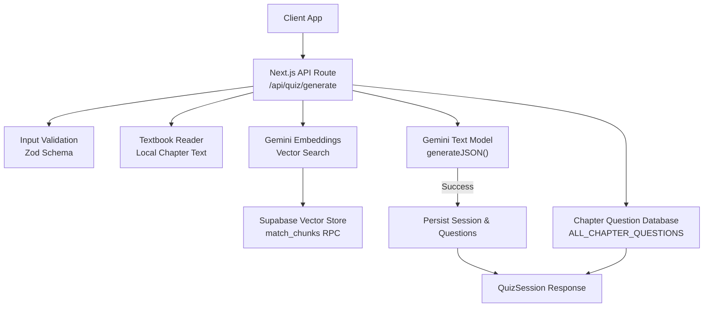
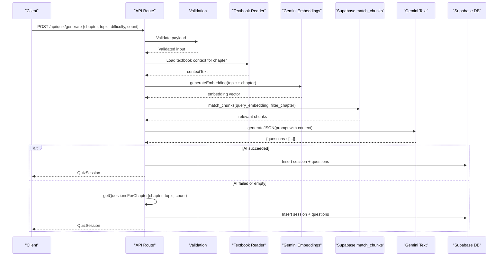
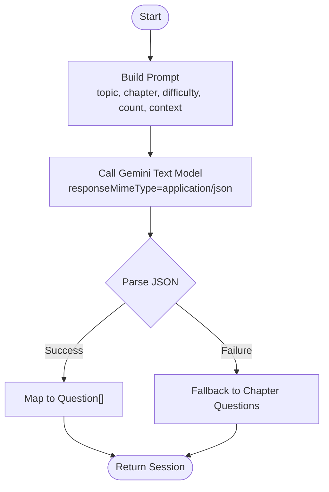
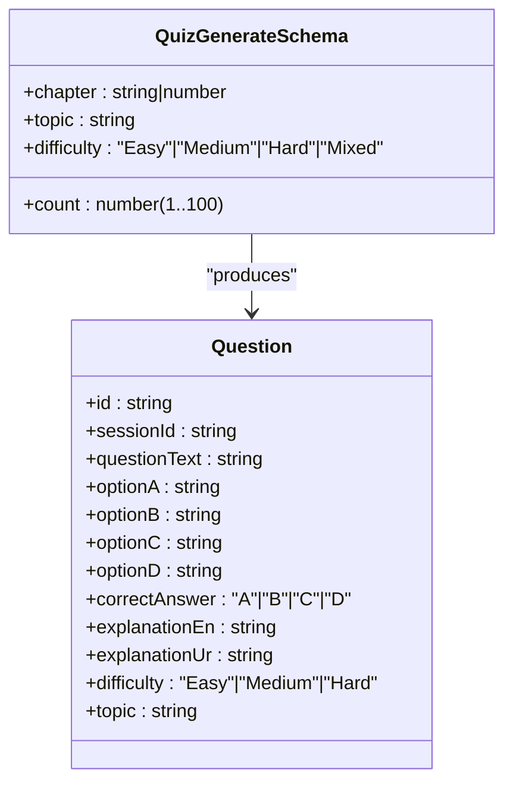
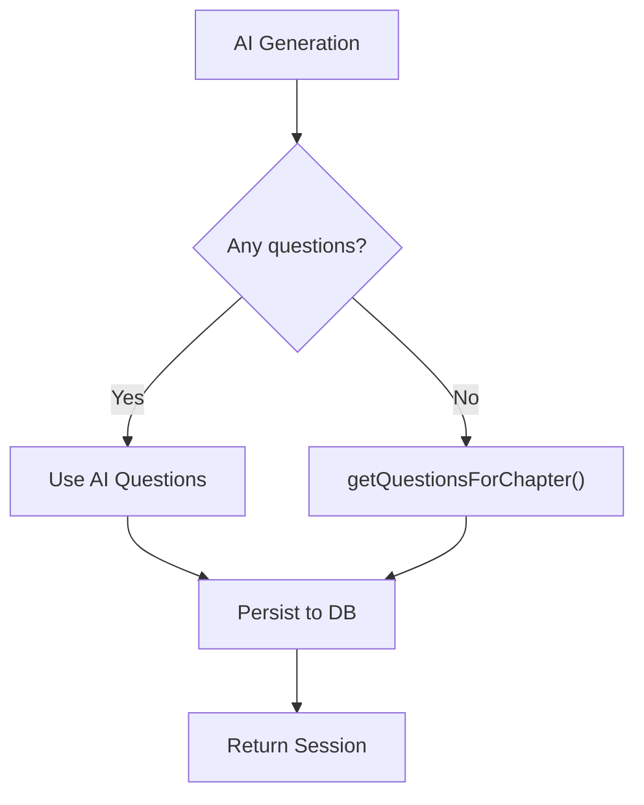
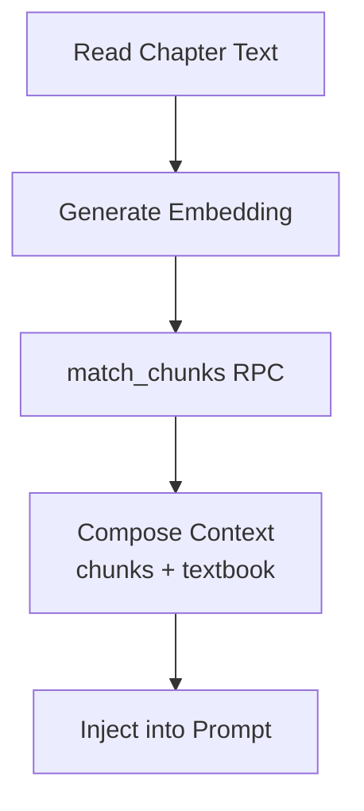
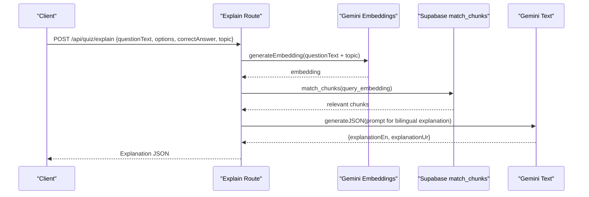
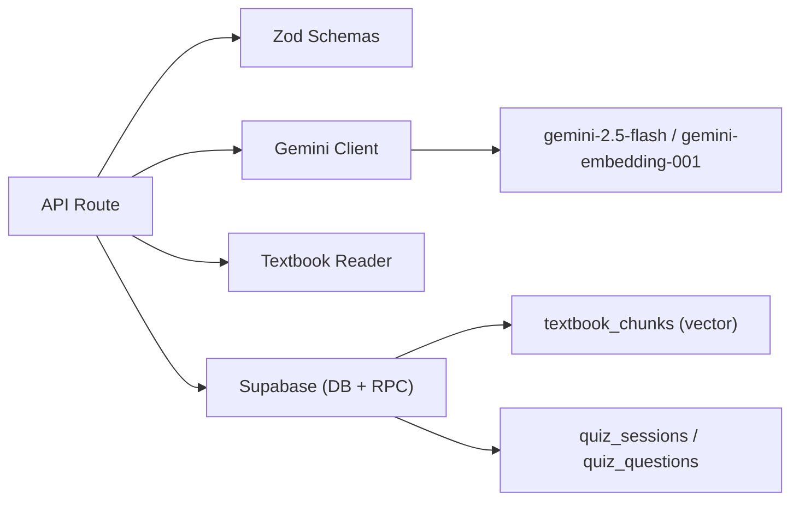

# AI Integration Engine

<cite>
**Referenced Files in This Document**
- [route.ts](file://src/app/api/quiz/generate/route.ts)
- [gemini.ts](file://src/lib/ai/gemini.ts)
- [schemas.ts](file://src/lib/validations/schemas.ts)
- [chapter-questions.ts](file://src/lib/chapter-questions.ts)
- [textbook-reader.ts](file://src/lib/textbook-reader.ts)
- [schema.sql](file://supabase/schema.sql)
- [quiz.ts](file://src/types/quiz.ts)
- [api-client.ts](file://src/lib/api-client.ts)
- [explain route.ts](file://src/app/api/quiz/explain/route.ts)
</cite>

## Table of Contents
1. [Introduction](#introduction)
2. [Project Structure](#project-structure)
3. [Core Components](#core-components)
4. [Architecture Overview](#architecture-overview)
5. [Detailed Component Analysis](#detailed-component-analysis)
6. [Dependency Analysis](#dependency-analysis)
7. [Performance Considerations](#performance-considerations)
8. [Troubleshooting Guide](#troubleshooting-guide)
9. [Conclusion](#conclusion)

## Introduction
This document explains MedAce-AI’s AI integration engine that powers intelligent, high-yield MDCAT question generation. It covers the Gemini API integration (model configuration, prompt engineering, and response processing), a sophisticated prompt template system for generating bilingual explanations (English and Urdu), a fallback mechanism to a local chapter question database when AI services are unavailable or rate-limited, JSON schema validation for consistent outputs, error handling strategies, retry considerations, and performance optimization techniques. It also documents how AI generation integrates with local databases while maintaining educational standards.

## Project Structure
The AI integration spans serverless API routes, an AI client library, validation schemas, textbook context retrieval, and a vector-enabled Supabase backend. The key flow is:
- Client calls /api/quiz/generate with validated parameters.
- Server loads textbook context and optionally enriches it via vector RAG.
- Server prompts Gemini to generate structured JSON questions.
- If AI fails or returns no content, the system falls back to a curated chapter question set.
- Session and questions are persisted to Supabase; results are returned to the client.

**Diagram sources**
- [route.ts:10-187](file://src/app/api/quiz/generate/route.ts#L10-L187)
- [gemini.ts:10-59](file://src/lib/ai/gemini.ts#L10-L59)
- [textbook-reader.ts:9-45](file://src/lib/textbook-reader.ts#L9-L45)
- [schema.sql:116-150](file://supabase/schema.sql#L116-L150)
- [chapter-questions.ts:14-101](file://src/lib/chapter-questions.ts#L14-L101)

**Section sources**
- [route.ts:10-187](file://src/app/api/quiz/generate/route.ts#L10-L187)
- [gemini.ts:10-59](file://src/lib/ai/gemini.ts#L10-L59)
- [textbook-reader.ts:9-45](file://src/lib/textbook-reader.ts#L9-L45)
- [schema.sql:116-150](file://supabase/schema.sql#L116-L150)
- [chapter-questions.ts:14-101](file://src/lib/chapter-questions.ts#L14-L101)

## Core Components
- API route orchestrator: Validates input, builds context, invokes AI, handles fallback, persists data, and returns a session object.
- Gemini client: Configures models, generates embeddings, and produces typed JSON responses from prompts.
- Validation layer: Enforces request shape and constraints using Zod schemas.
- Context retrieval: Reads chapter-specific textbook text and optionally augments via vector similarity search.
- Fallback generator: Supplies pre-authored questions per chapter when AI is unavailable or returns empty results.
- Data persistence: Stores sessions and questions in Supabase with vector-backed chunk references.

**Section sources**
- [route.ts:10-187](file://src/app/api/quiz/generate/route.ts#L10-L187)
- [gemini.ts:10-59](file://src/lib/ai/gemini.ts#L10-L59)
- [schemas.ts:3-8](file://src/lib/validations/schemas.ts#L3-L8)
- [textbook-reader.ts:9-45](file://src/lib/textbook-reader.ts#L9-L45)
- [chapter-questions.ts:14-101](file://src/lib/chapter-questions.ts#L14-L101)
- [schema.sql:46-83](file://supabase/schema.sql#L46-L83)

## Architecture Overview
The system combines deterministic resources (textbooks, curated questions) with generative AI to produce exam-grade questions. A vector search step enhances relevance by retrieving relevant textbook chunks. The AI model is instructed to return strict JSON conforming to a defined schema, which is then mapped into the application’s domain types.

**Diagram sources**
- [route.ts:10-187](file://src/app/api/quiz/generate/route.ts#L10-L187)
- [gemini.ts:29-59](file://src/lib/ai/gemini.ts#L29-L59)
- [schema.sql:116-150](file://supabase/schema.sql#L116-L150)

## Detailed Component Analysis

### Gemini API Integration
- Model configuration:
  - Text model: gemini-2.5-flash used for content generation.
  - Embedding model: gemini-embedding-001 used for vector search.
- JSON mode:
  - The text model is configured with responseMimeType set to application/json to enforce structured output.
- Prompt-driven generation:
  - The route composes a detailed prompt including topic, chapter number, difficulty, count, and reference textbook content.
  - The prompt instructs the model to return a specific JSON structure with options, correct answer, and bilingual explanations.
- Response processing:
  - The client parses the raw response text, stripping markdown fences if present, and deserializes to the expected TypeScript type.
  - Errors during parsing trigger fallback behavior at the route level.

**Diagram sources**
- [gemini.ts:10-59](file://src/lib/ai/gemini.ts#L10-L59)
- [route.ts:55-127](file://src/app/api/quiz/generate/route.ts#L55-L127)

**Section sources**
- [gemini.ts:1-61](file://src/lib/ai/gemini.ts#L1-L61)
- [route.ts:55-127](file://src/app/api/quiz/generate/route.ts#L55-L127)

### Prompt Engineering Strategies
- Role and audience:
  - The prompt establishes the role as an expert medical educator targeting MDCAT candidates.
- Content grounding:
  - Reference textbook content is injected to constrain generation to syllabus-aligned material.
- Difficulty control:
  - The requested difficulty (Easy, Medium, Hard, Mixed) guides question complexity and explanation depth.
- Output schema enforcement:
  - The prompt explicitly defines the JSON schema, ensuring consistent fields for options, correct answer, and bilingual explanations.
- Bilingual explanations:
  - English explanation (explanationEn) and Urdu explanation (explanationUr) are required for each question.

Example prompt structures by difficulty:
- Easy: Focus on foundational facts and direct recall from the provided textbook excerpt.
- Medium: Require synthesis across subtopics within the chapter, with clear reasoning.
- Hard: Emphasize nuanced physiological mechanisms, clinical correlations, and multi-step reasoning.

Topic-specific configurations:
- Topic and chapter are embedded into the prompt to ensure precise alignment with the intended subject area.
- When available, vector-similarity retrieved chunks are prepended to the textbook context to further tailor content.

**Section sources**
- [route.ts:55-127](file://src/app/api/quiz/generate/route.ts#L55-L127)
- [explain route.ts:37-65](file://src/app/api/quiz/explain/route.ts#L37-L65)

### JSON Schema Validation and Consistency
- Input validation:
  - The request body is validated against a Zod schema that enforces chapter, topic, difficulty enum, and count bounds.
- Output validation:
  - The Gemini client requests JSON mode and attempts to parse the response directly; if fenced, it strips markdown and retries parsing.
- Type mapping:
  - Parsed JSON is cast to a strongly-typed structure matching the Question interface, ensuring downstream consistency.

**Diagram sources**
- [schemas.ts:3-8](file://src/lib/validations/schemas.ts#L3-L8)
- [quiz.ts:15-28](file://src/types/quiz.ts#L15-L28)

**Section sources**
- [schemas.ts:3-8](file://src/lib/validations/schemas.ts#L3-L8)
- [quiz.ts:15-28](file://src/types/quiz.ts#L15-L28)
- [gemini.ts:45-59](file://src/lib/ai/gemini.ts#L45-L59)

### Fallback Mechanism to Chapter Question Database
- Trigger conditions:
  - If AI generation throws an error or returns no questions, the system automatically switches to the local chapter question generator.
- Behavior:
  - The fallback retrieves a curated set of questions for the specified chapter and topic, preserving session metadata.
- Educational continuity:
  - Ensures users always receive valid, syllabus-aligned questions even when AI services are down or rate-limited.

**Diagram sources**
- [route.ts:109-135](file://src/app/api/quiz/generate/route.ts#L109-L135)
- [chapter-questions.ts:14-101](file://src/lib/chapter-questions.ts#L14-L101)

**Section sources**
- [route.ts:109-135](file://src/app/api/quiz/generate/route.ts#L109-L135)
- [chapter-questions.ts:14-101](file://src/lib/chapter-questions.ts#L14-L101)

### Textbook Context and Vector RAG Integration
- Local textbook reading:
  - The reader locates and reads the extracted textbook file for the given chapter, returning a bounded snippet to fit within token limits.
- Optional vector enrichment:
  - An embedding is generated for the query (topic + chapter), and a Supabase RPC performs cosine similarity search to retrieve relevant chunks.
- Context composition:
  - Retrieved chunks are concatenated with the textbook snippet to form a rich context for prompting.

**Diagram sources**
- [textbook-reader.ts:9-45](file://src/lib/textbook-reader.ts#L9-L45)
- [gemini.ts:29-43](file://src/lib/ai/gemini.ts#L29-L43)
- [schema.sql:116-150](file://supabase/schema.sql#L116-L150)
- [route.ts:29-49](file://src/app/api/quiz/generate/route.ts#L29-L49)

**Section sources**
- [textbook-reader.ts:9-45](file://src/lib/textbook-reader.ts#L9-L45)
- [gemini.ts:29-43](file://src/lib/ai/gemini.ts#L29-L43)
- [schema.sql:116-150](file://supabase/schema.sql#L116-L150)
- [route.ts:29-49](file://src/app/api/quiz/generate/route.ts#L29-L49)

### Bilingual Explanation Pipeline (Explain Endpoint)
- Purpose:
  - Provides detailed English and Urdu explanations for any question, grounded in textbook context when available.
- Flow:
  - Validates input, generates an embedding, retrieves similar chunks, constructs a prompt requesting bilingual output, and returns structured JSON.

**Diagram sources**
- [explain route.ts:6-79](file://src/app/api/quiz/explain/route.ts#L6-L79)
- [gemini.ts:29-59](file://src/lib/ai/gemini.ts#L29-L59)
- [schema.sql:116-150](file://supabase/schema.sql#L116-L150)

**Section sources**
- [explain route.ts:6-79](file://src/app/api/quiz/explain/route.ts#L6-L79)

### Error Handling Strategies
- Input errors:
  - Invalid payloads return a 400 status with details from the validation schema.
- AI errors:
  - Missing API key or API failures throw errors; the route catches them and logs warnings before falling back to the chapter database.
- Parsing errors:
  - If Gemini returns non-JSON or malformed content, the client strips markdown fences and retries parsing; failure triggers fallback.
- Persistence errors:
  - Unauthenticated users skip session persistence; authenticated users have their sessions and questions stored.

**Section sources**
- [route.ts:11-20](file://src/app/api/quiz/generate/route.ts#L11-L20)
- [route.ts:125-135](file://src/app/api/quiz/generate/route.ts#L125-L135)
- [gemini.ts:6-8](file://src/lib/ai/gemini.ts#L6-L8)
- [gemini.ts:45-59](file://src/lib/ai/gemini.ts#L45-L59)

### Retry Mechanisms and Resilience
- Current state:
  - No explicit retry logic is implemented in the AI client or route.
- Recommended approach:
  - Implement exponential backoff with jitter for transient network errors and rate-limit responses.
  - Add circuit breaker patterns to avoid cascading failures under sustained outages.
  - Cache recent successful generations keyed by (chapter, topic, difficulty, count) to reduce redundant calls.

[No sources needed since this section provides general guidance]

### Performance Optimization Techniques
- Context window management:
  - Limit injected textbook content to a fixed character window to control token usage and latency.
- Vector search tuning:
  - Adjust match_threshold and match_count to balance relevance and cost.
- Model selection:
  - Use gemini-2.5-flash for faster inference suitable for quiz generation.
- Batch operations:
  - Persist multiple questions in a single insert operation to reduce database round-trips.
- Caching:
  - Consider caching embeddings or frequently requested contexts to minimize repeated API calls.

**Section sources**
- [route.ts:29-49](file://src/app/api/quiz/generate/route.ts#L29-L49)
- [gemini.ts:1-61](file://src/lib/ai/gemini.ts#L1-L61)
- [schema.sql:38-44](file://supabase/schema.sql#L38-L44)

## Dependency Analysis
The AI integration depends on:
- Next.js API routes for orchestration.
- Zod for input validation.
- Google Generative AI SDK for model access and JSON mode.
- Supabase for vector storage and relational persistence.
- Local filesystem for textbook excerpts.

**Diagram sources**
- [route.ts:10-187](file://src/app/api/quiz/generate/route.ts#L10-L187)
- [schemas.ts:3-8](file://src/lib/validations/schemas.ts#L3-L8)
- [gemini.ts:1-61](file://src/lib/ai/gemini.ts#L1-L61)
- [schema.sql:26-83](file://supabase/schema.sql#L26-L83)

**Section sources**
- [route.ts:10-187](file://src/app/api/quiz/generate/route.ts#L10-L187)
- [schemas.ts:3-8](file://src/lib/validations/schemas.ts#L3-L8)
- [gemini.ts:1-61](file://src/lib/ai/gemini.ts#L1-L61)
- [schema.sql:26-83](file://supabase/schema.sql#L26-L83)

## Performance Considerations
- Token budgeting:
  - Keep context snippets concise; prioritize high-signal textbook passages and top-ranked vector matches.
- Latency:
  - Prefer streaming or asynchronous UI feedback where possible to mask AI latency.
- Cost control:
  - Tune match_count and maxChars to limit expensive operations.
- Concurrency:
  - Ensure Supabase RPC calls and AI calls are not bottlenecked by sequential dependencies unless necessary.

[No sources needed since this section provides general guidance]

## Troubleshooting Guide
- Missing API key:
  - If GEMINI_API_KEY is not set, both embedding and generation functions throw descriptive errors.
- Rate limiting:
  - Handle HTTP-level rate-limit responses with retries/backoff; fall back to chapter questions if persistent.
- Malformed AI output:
  - The client strips markdown fences and retries parsing; if still invalid, fallback ensures continuity.
- Vector search issues:
  - If match_chunks returns no results, the system continues with textbook-only context.
- Database write failures:
  - Unauthenticated users skip persistence; authenticated users should verify RLS policies and indexes.

**Section sources**
- [gemini.ts:6-8](file://src/lib/ai/gemini.ts#L6-L8)
- [gemini.ts:29-43](file://src/lib/ai/gemini.ts#L29-L43)
- [gemini.ts:45-59](file://src/lib/ai/gemini.ts#L45-L59)
- [route.ts:125-135](file://src/app/api/quiz/generate/route.ts#L125-L135)
- [schema.sql:152-229](file://supabase/schema.sql#L152-L229)

## Conclusion
MedAce-AI’s AI integration engine combines robust prompt engineering, structured JSON outputs, and resilient fallbacks to deliver reliable, syllabus-aligned MDCAT questions. By grounding generation in textbook content and optional vector similarity search, it maintains educational quality while leveraging AI capabilities. The design emphasizes validation, error handling, and performance tuning to ensure consistent user experiences even under service constraints.