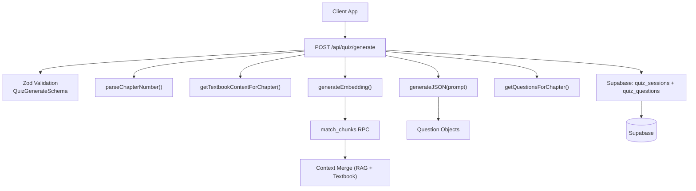
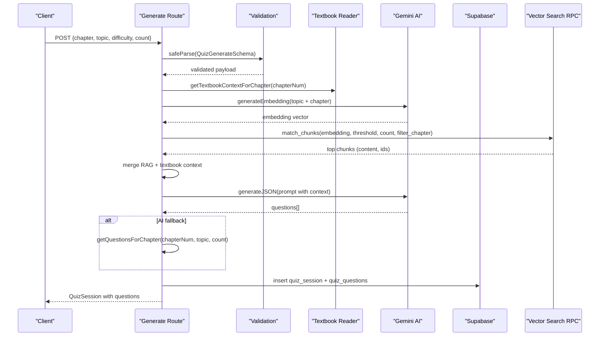
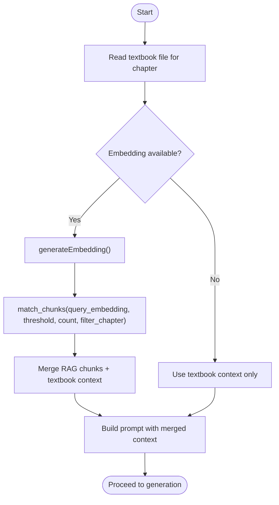
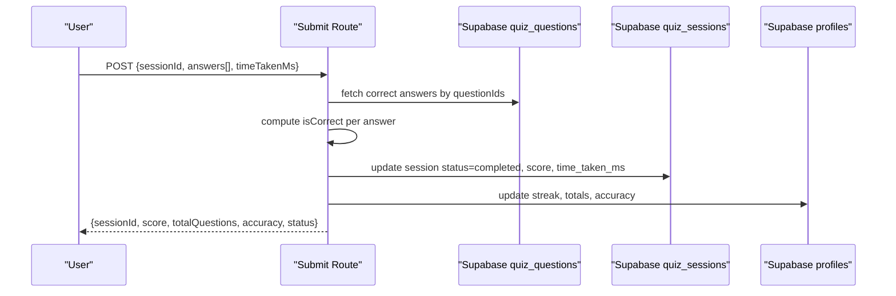
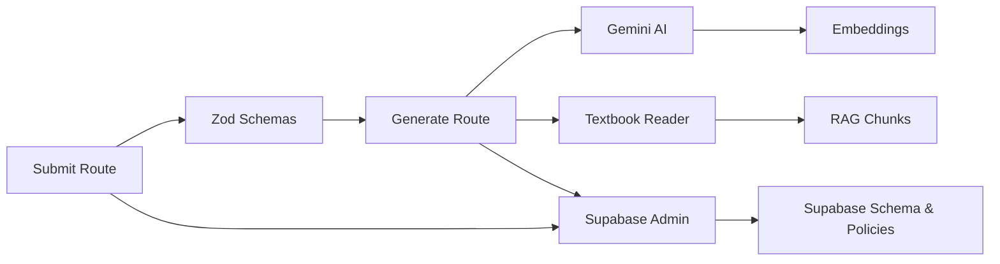
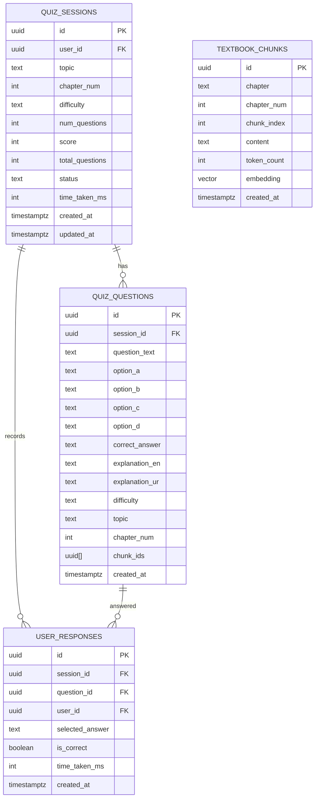

# Question Generation Engine

<cite>
**Referenced Files in This Document**
- [route.ts](file://src/app/api/quiz/generate/route.ts)
- [schemas.ts](file://src/lib/validations/schemas.ts)
- [chapter-questions.ts](file://src/lib/chapter-questions.ts)
- [textbook-reader.ts](file://src/lib/textbook-reader.ts)
- [gemini.ts](file://src/lib/ai/gemini.ts)
- [admin.ts](file://src/lib/supabase/admin.ts)
- [server.ts](file://src/lib/supabase/server.ts)
- [schema.sql](file://supabase/schema.sql)
- [quiz.ts](file://src/types/quiz.ts)
- [submit route.ts](file://src/app/api/quiz/submit/route.ts)
- [dashboard stats route.ts](file://src/app/api/dashboard/stats/route.ts)
- [progress-tracker.ts](file://src/lib/progress-tracker.ts)
</cite>

## Table of Contents
1. [Introduction](#introduction)
2. [Project Structure](#project-structure)
3. [Core Components](#core-components)
4. [Architecture Overview](#architecture-overview)
5. [Detailed Component Analysis](#detailed-component-analysis)
6. [Dependency Analysis](#dependency-analysis)
7. [Performance Considerations](#performance-considerations)
8. [Troubleshooting Guide](#troubleshooting-guide)
9. [Conclusion](#conclusion)
10. [Appendices](#appendices)

## Introduction
This document explains MedAce-AI’s question generation engine that orchestrates the end-to-end quiz creation workflow. It covers request validation, topic and chapter parsing, difficulty assignment, question synthesis using AI with optional vector RAG enrichment, fallback to a curated question bank, session persistence via Supabase, and analytics-ready metadata enrichment. It also documents the validation schema system, session lifecycle management, performance metrics tracking, and scalability considerations for concurrent requests and caching strategies.

## Project Structure
The engine is implemented as Next.js API routes backed by TypeScript types, Zod schemas, local textbook content, Gemini-based AI generation, and Supabase for persistent storage and vector search.

**Diagram sources**
- [route.ts:10-187](file://src/app/api/quiz/generate/route.ts#L10-L187)
- [schemas.ts:3-8](file://src/lib/validations/schemas.ts#L3-L8)
- [chapter-questions.ts:7-12](file://src/lib/chapter-questions.ts#L7-L12)
- [textbook-reader.ts:9-45](file://src/lib/textbook-reader.ts#L9-L45)
- [gemini.ts:29-59](file://src/lib/ai/gemini.ts#L29-L59)
- [schema.sql:116-150](file://supabase/schema.sql#L116-L150)

**Section sources**
- [route.ts:10-187](file://src/app/api/quiz/generate/route.ts#L10-L187)
- [schemas.ts:3-8](file://src/lib/validations/schemas.ts#L3-L8)

## Core Components
- Request validation: Enforces chapter, topic, difficulty, and count constraints before processing.
- Chapter/topic parsing: Normalizes chapter identifiers and selects relevant textbook context.
- Context enrichment: Combines local textbook excerpts with vector-similarity RAG chunks when available.
- Question synthesis: Uses Gemini JSON mode to generate structured questions; falls back to a curated bank if needed.
- Session persistence: Creates a quiz session and persists questions with metadata for analytics.
- Submission and scoring: Validates answers, computes correctness, updates session status, and aggregates user profile metrics.
- Progress tracking: Computes dashboard statistics, weak topics, streaks, and recent sessions from local or server data.

**Section sources**
- [schemas.ts:3-8](file://src/lib/validations/schemas.ts#L3-L8)
- [chapter-questions.ts:7-12](file://src/lib/chapter-questions.ts#L7-L12)
- [route.ts:22-187](file://src/app/api/quiz/generate/route.ts#L22-L187)
- [submit route.ts:6-132](file://src/app/api/quiz/submit/route.ts#L6-L132)
- [progress-tracker.ts:12-191](file://src/lib/progress-tracker.ts#L12-L191)

## Architecture Overview
The engine follows a multi-stage pipeline:

**Diagram sources**
- [route.ts:10-187](file://src/app/api/quiz/generate/route.ts#L10-L187)
- [gemini.ts:29-59](file://src/lib/ai/gemini.ts#L29-L59)
- [schema.sql:116-150](file://supabase/schema.sql#L116-L150)

## Detailed Component Analysis

### Request Validation System (QuizGenerateSchema)
- Enforces:
  - chapter: string or number
  - topic: non-empty string
  - difficulty: enum Easy/Medium/Hard/Mixed with default Mixed
  - count: integer between 1 and 100 with default 20
- Returns structured errors on invalid payloads to ensure robust downstream processing.

Practical examples:
- Valid: chapter=3, topic="Respiratory System", difficulty="Medium", count=10
- Invalid: missing topic or count > 100

**Section sources**
- [schemas.ts:3-8](file://src/lib/validations/schemas.ts#L3-L8)
- [route.ts:10-23](file://src/app/api/quiz/generate/route.ts#L10-L23)

### Topic Parsing and Chapter Selection
- parseChapterNumber normalizes inputs like "ch1", "Chapter 5", or numeric values to an integer chapter index.
- Used to select textbook files and filter vector search results by chapter.

**Section sources**
- [chapter-questions.ts:7-12](file://src/lib/chapter-questions.ts#L7-L12)
- [route.ts:22-24](file://src/app/api/quiz/generate/route.ts#L22-L24)

### Context Enrichment (Local Textbook + Vector RAG)
- Reads chapter-specific textbook text from rag/textbooks with a bounded window.
- Optionally generates embeddings and queries similar chunks via SupRPC match_chunks, merging results into context.
- Captures chunk IDs for traceability and analytics.

**Diagram sources**
- [textbook-reader.ts:9-45](file://src/lib/textbook-reader.ts#L9-L45)
- [gemini.ts:29-43](file://src/lib/ai/gemini.ts#L29-L43)
- [schema.sql:116-150](file://supabase/schema.sql#L116-L150)
- [route.ts:29-49](file://src/app/api/quiz/generate/route.ts#L29-L49)

**Section sources**
- [textbook-reader.ts:9-45](file://src/lib/textbook-reader.ts#L9-L45)
- [route.ts:29-49](file://src/app/api/quiz/generate/route.ts#L29-L49)

### Question Synthesis and Diversity
- Constructs a strict prompt specifying topic, chapter, difficulty, and count, requesting exactly count unique multiple-choice questions with four options, correct answer, and bilingual explanations.
- Maps AI output to internal Question type, ensuring required fields and consistent difficulty.
- If AI fails or returns no questions, falls back to a curated question bank per chapter filtered by topic and count.

Diversity mechanisms:
- Prompt enforces distinct subtopics and concepts per question.
- Fallback bank provides pre-vetted, high-yield questions across chapters.

**Section sources**
- [route.ts:55-135](file://src/app/api/quiz/generate/route.ts#L55-L135)
- [chapter-questions.ts:14-800](file://src/lib/chapter-questions.ts#L14-L800)

### Difficulty Level Assignment
- Accepts Easy/Medium/Hard/Mixed.
- For Mixed, assigns alternating Easy/Medium across generated questions to balance difficulty distribution.

**Section sources**
- [schemas.ts:3-8](file://src/lib/validations/schemas.ts#L3-L8)
- [route.ts:121-123](file://src/app/api/quiz/generate/route.ts#L121-L123)

### Session Management and Persistence
- Generates a unique sessionId and constructs a QuizSession object with status in-progress.
- Persists session and questions to Supabase when authenticated, including topic, chapter_num, difficulty, counts, and chunk_ids for analytics.
- On submission, updates session status to completed, records score and time_taken_ms, and updates user profile metrics.

**Diagram sources**
- [submit route.ts:6-132](file://src/app/api/quiz/submit/route.ts#L6-L132)
- [schema.sql:47-83](file://supabase/schema.sql#L47-L83)

**Section sources**
- [route.ts:137-187](file://src/app/api/quiz/generate/route.ts#L137-L187)
- [submit route.ts:6-132](file://src/app/api/quiz/submit/route.ts#L6-L132)
- [schema.sql:47-83](file://supabase/schema.sql#L47-L83)

### Analytics Metadata and Question Enrichment
- Each persisted question includes:
  - topic classification
  - difficulty rating
  - chapter_num
  - chunk_ids (vector RAG references)
- Enables analytics on topic performance, difficulty distribution, and source provenance.

**Section sources**
- [route.ts:153-170](file://src/app/api/quiz/generate/route.ts#L153-L170)
- [schema.sql:65-83](file://supabase/schema.sql#L65-L83)

### Progress Tracking and Dashboard Metrics
- Local progress tracker computes:
  - Total questions, weekly volume, accuracy rate
  - Study streak calculation based on active days
  - Weak topics by error rate
  - Chapter performance and best/worst topics
- Server-side dashboard endpoint aggregates recent sessions, weak topics from responses, and profile stats.

**Section sources**
- [progress-tracker.ts:12-191](file://src/lib/progress-tracker.ts#L12-L191)
- [dashboard stats route.ts:6-172](file://src/app/api/dashboard/stats/route.ts#L6-L172)

## Dependency Analysis
Key runtime dependencies and their roles:
- Zod schemas enforce input contracts for generation and submission.
- Gemini integration provides embeddings and JSON-mode question generation.
- Supabase admin client performs privileged writes; server client handles auth-aware reads/writes.
- Textbook reader supplies deterministic context; vector search augments with semantic similarity.

**Diagram sources**
- [schemas.ts:3-8](file://src/lib/validations/schemas.ts#L3-L8)
- [gemini.ts:29-59](file://src/lib/ai/gemini.ts#L29-L59)
- [admin.ts:1-22](file://src/lib/supabase/admin.ts#L1-L22)
- [server.ts:1-28](file://src/lib/supabase/server.ts#L1-L28)
- [schema.sql:155-229](file://supabase/schema.sql#L155-L229)

**Section sources**
- [schemas.ts:3-8](file://src/lib/validations/schemas.ts#L3-L8)
- [gemini.ts:29-59](file://src/lib/ai/gemini.ts#L29-L59)
- [admin.ts:1-22](file://src/lib/supabase/admin.ts#L1-L22)
- [server.ts:1-28](file://src/lib/supabase/server.ts#L1-L28)
- [schema.sql:155-229](file://supabase/schema.sql#L155-L229)

## Performance Considerations
- Concurrency:
  - Each request is stateless at the API layer; session IDs are generated per request to avoid contention.
  - Supabase admin operations are batched where possible (e.g., inserting multiple questions).
- Caching strategies:
  - Cache textbook content per chapter in memory during a request cycle to avoid repeated disk reads.
  - Consider caching frequent RAG query results (topic+chapter pairs) with short TTLs to reduce embedding/vector search overhead.
  - Debounce or coalesce identical generation requests within a small time window to limit redundant AI calls.
- Database efficiency:
  - Use indexes defined in schema (user_id, session_id, chapter_num) for fast lookups.
  - Batch inserts for questions and responses to minimize round trips.
- AI cost control:
  - Limit context size to prevent oversized prompts.
  - Use fallback bank when API key is missing or failures occur to maintain availability.

[No sources needed since this section provides general guidance]

## Troubleshooting Guide
Common issues and resolutions:
- Missing Gemini API key:
  - Symptom: Embedding or JSON generation fails.
  - Resolution: Configure environment variable for the Gemini API key; fallback to curated question bank still works.
- No textbook file found:
  - Symptom: Empty context returned.
  - Resolution: Ensure rag/textbooks contains the expected chapter file naming pattern; engine will still proceed with minimal context.
- Vector search errors:
  - Symptom: RPC match_chunks fails or returns no chunks.
  - Resolution: Verify extension and index existence; fallback to textbook-only context is handled gracefully.
- Submission validation errors:
  - Symptom: 400 response with details.
  - Resolution: Ensure answers array conforms to schema and sessionId exists.
- Session not persisted:
  - Symptom: No quiz_sessions or quiz_questions rows.
  - Resolution: Confirm authentication; persistence occurs only for authenticated users.

**Section sources**
- [gemini.ts:6-8](file://src/lib/ai/gemini.ts#L6-L8)
- [textbook-reader.ts:9-45](file://src/lib/textbook-reader.ts#L9-L45)
- [route.ts:10-23](file://src/app/api/quiz/generate/route.ts#L10-L23)
- [submit route.ts:6-16](file://src/app/api/quiz/submit/route.ts#L6-L16)

## Conclusion
MedAce-AI’s question generation engine combines robust validation, flexible chapter/topic parsing, enriched context via textbook reading and vector RAG, and reliable AI-driven synthesis with a resilient fallback. Sessions are persisted with rich metadata for analytics, while submission flows compute scores and update user profiles. The design supports scalable operation through batching, indexing, and optional caching, ensuring responsive quiz generation under load.

[No sources needed since this section summarizes without analyzing specific files]

## Appendices

### Data Models and Relationships

**Diagram sources**
- [schema.sql:27-99](file://supabase/schema.sql#L27-L99)

### Practical Examples of Quiz Configurations
- Example 1: High-yield practice
  - chapter: 3, topic: "Respiratory System of Man", difficulty: "Medium", count: 10
  - Expected outcome: Exactly 10 questions focused on respiratory physiology, balanced difficulty, bilingual explanations, persisted with chunk references.
- Example 2: Mixed difficulty review
  - chapter: 5, topic: "Nervous System of Man", difficulty: "Mixed", count: 20
  - Expected outcome: Alternating Easy/Medium questions covering diverse nervous system subtopics.
- Example 3: Targeted weak area
  - chapter: 9, topic: "Immunity", difficulty: "Hard", count: 15
  - Expected outcome: Advanced-level questions emphasizing immunology mechanisms, suitable for deep review.

[No sources needed since this section provides conceptual usage examples]