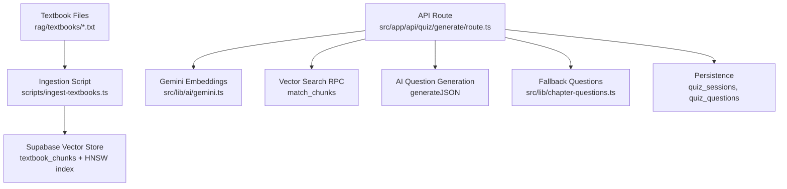
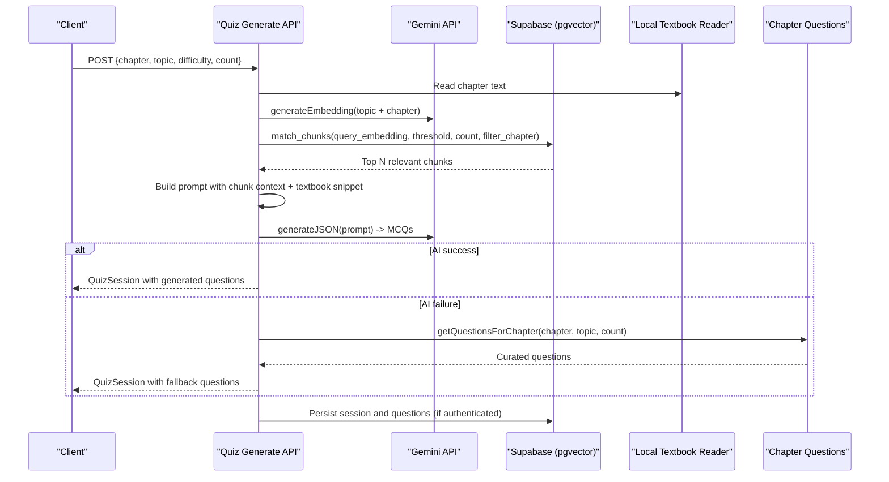
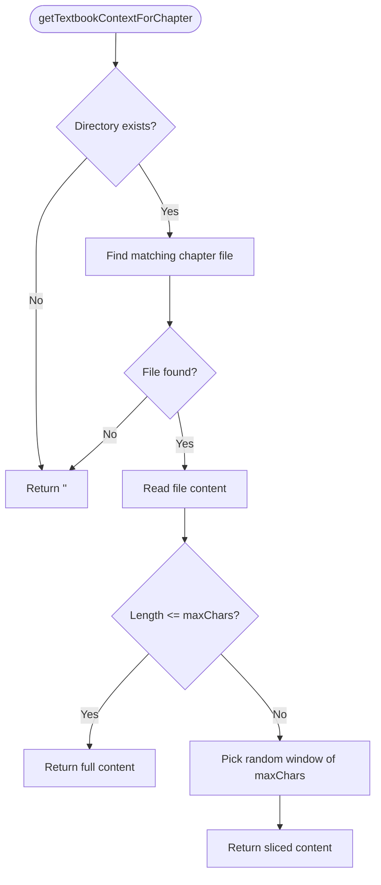
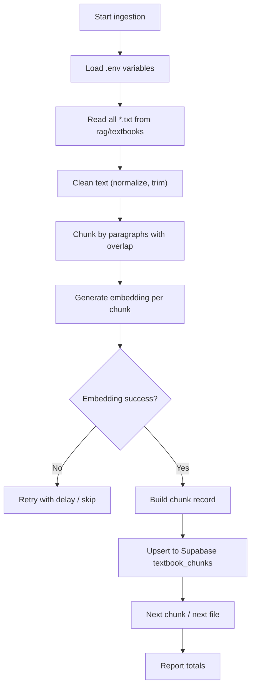
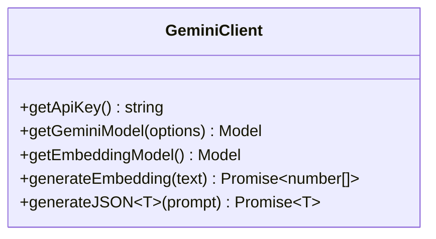
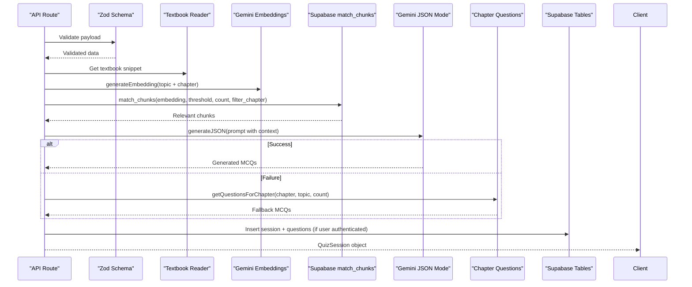
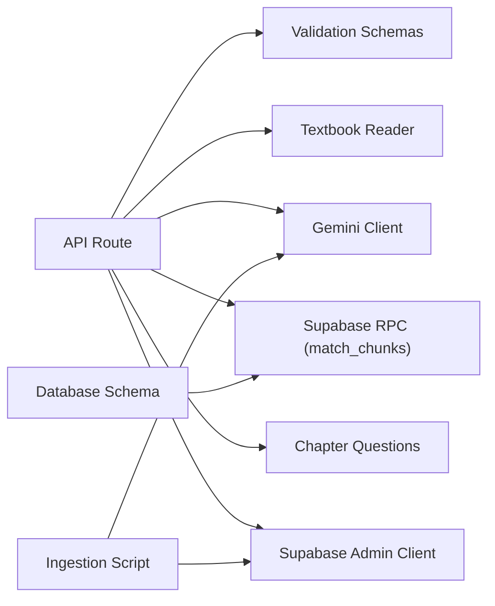

# Quiz Generation System

<cite>
**Referenced Files in This Document**
- [route.ts](file://src/app/api/quiz/generate/route.ts)
- [gemini.ts](file://src/lib/ai/gemini.ts)
- [textbook-reader.ts](file://src/lib/textbook-reader.ts)
- [ingest-textbooks.ts](file://scripts/ingest-textbooks.ts)
- [chapter-questions.ts](file://src/lib/chapter-questions.ts)
- [schemas.ts](file://src/lib/validations/schemas.ts)
- [quiz.ts](file://src/types/quiz.ts)
- [schema.sql](file://supabase/schema.sql)
- [README.md](file://README.md)
</cite>

## Table of Contents
1. [Introduction](#introduction)
2. [Project Structure](#project-structure)
3. [Core Components](#core-components)
4. [Architecture Overview](#architecture-overview)
5. [Detailed Component Analysis](#detailed-component-analysis)
6. [Dependency Analysis](#dependency-analysis)
7. [Performance Considerations](#performance-considerations)
8. [Troubleshooting Guide](#troubleshooting-guide)
9. [Conclusion](#conclusion)
10. [Appendices](#appendices)

## Introduction
This document explains MedAce-AI’s RAG-powered quiz generation system that transforms textbook content into high-quality, syllabus-aligned multiple-choice questions (MCQs). The pipeline ingests chapter texts, chunks them by meaningful boundaries, generates vector embeddings with Google Gemini, and performs semantic similarity search to retrieve relevant context for question generation. When AI services are unavailable or fail, the system falls back to a curated chapter question bank to ensure continuity.

The system supports configuration for difficulty levels, topic selection, and question counts, while maintaining educational standards through structured prompts and validation. It integrates with Supabase PostgreSQL and pgvector for vector storage and retrieval, and persists quiz sessions and questions for user progress tracking.

## Project Structure
At a high level:
- Textbook content is stored as extracted text files per chapter under rag/textbooks.
- A CLI script ingests these texts, chunks them, embeds via Gemini, and stores vectors in Supabase.
- At runtime, the API route orchestrates RAG retrieval and AI-based MCQ generation, with fallbacks and persistence.
- Validation schemas enforce input contracts; TypeScript types define data models.

**Diagram sources**
- [ingest-textbooks.ts:97-183](file://scripts/ingest-textbooks.ts#L97-L183)
- [schema.sql:26-44](file://supabase/schema.sql#L26-L44)
- [route.ts:29-49](file://src/app/api/quiz/generate/route.ts#L29-L49)
- [gemini.ts:29-59](file://src/lib/ai/gemini.ts#L29-L59)
- [chapter-questions.ts:14-101](file://src/lib/chapter-questions.ts#L14-L101)

**Section sources**
- [README.md:84-127](file://README.md#L84-L127)
- [schema.sql:26-44](file://supabase/schema.sql#L26-L44)

## Core Components
- Textbook Reader: Reads chapter-specific text from rag/textbooks and returns a bounded window of content for prompt context.
- Ingestion Pipeline: Cleans text, chunks by paragraph boundaries with overlap, generates embeddings, and upserts into Supabase.
- AI Integration: Provides embedding generation and JSON-mode LLM calls to Gemini for MCQ creation.
- API Route: Orchestrates validation, RAG retrieval, AI generation, fallback logic, and database persistence.
- Chapter Question Bank: Static, high-yield MCQs per chapter used as fallback when AI is unavailable.
- Validation Schemas: Enforce request payloads for quiz generation and other endpoints.
- Data Models: Strongly typed interfaces for questions, sessions, answers, and related entities.

**Section sources**
- [textbook-reader.ts:6-45](file://src/lib/textbook-reader.ts#L6-L45)
- [ingest-textbooks.ts:38-75](file://scripts/ingest-textbooks.ts#L38-L75)
- [gemini.ts:1-59](file://src/lib/ai/gemini.ts#L1-L59)
- [route.ts:10-195](file://src/app/api/quiz/generate/route.ts#L10-L195)
- [chapter-questions.ts:14-101](file://src/lib/chapter-questions.ts#L14-L101)
- [schemas.ts:3-8](file://src/lib/validations/schemas.ts#L3-L8)
- [quiz.ts:15-50](file://src/types/quiz.ts#L15-L50)

## Architecture Overview
The end-to-end flow combines local textbook context with vector-based retrieval and AI generation:

**Diagram sources**
- [route.ts:22-135](file://src/app/api/quiz/generate/route.ts#L22-L135)
- [gemini.ts:29-59](file://src/lib/ai/gemini.ts#L29-L59)
- [schema.sql:116-150](file://supabase/schema.sql#L116-L150)
- [textbook-reader.ts:9-45](file://src/lib/textbook-reader.ts#L9-L45)
- [chapter-questions.ts:14-101](file://src/lib/chapter-questions.ts#L14-L101)

## Detailed Component Analysis

### Textbook Reader
- Purpose: Retrieve a relevant slice of chapter text for immediate prompt context.
- Behavior: Scans rag/textbooks for files matching the chapter number pattern, reads content, and returns either full content or a random window capped at a maximum character size to fit within token limits.
- Error Handling: Returns empty string on missing directory or file errors, ensuring downstream logic can handle absence gracefully.

**Diagram sources**
- [textbook-reader.ts:9-45](file://src/lib/textbook-reader.ts#L9-L45)

**Section sources**
- [textbook-reader.ts:6-45](file://src/lib/textbook-reader.ts#L6-L45)

### Ingestion Pipeline (Chunking, Embedding, Storage)
- Cleaning: Normalizes line endings, collapses whitespace, and trims paragraphs.
- Chunking: Splits by double newline (paragraph boundaries), accumulates until target chunk size, then emits chunk with overlap tail to preserve context across boundaries.
- Embedding: Calls Gemini embedding model to produce 768-dim vectors per chunk. Includes retry logic for rate limits and delays to respect free-tier constraints.
- Storage: Upserts chunk records into Supabase textbook_chunks table with chapter metadata and token estimates.

**Diagram sources**
- [ingest-textbooks.ts:38-75](file://scripts/ingest-textbooks.ts#L38-L75)
- [ingest-textbooks.ts:129-165](file://scripts/ingest-textbooks.ts#L129-L165)
- [schema.sql:26-44](file://supabase/schema.sql#L26-L44)

**Section sources**
- [ingest-textbooks.ts:38-75](file://scripts/ingest-textbooks.ts#L38-L75)
- [ingest-textbooks.ts:97-183](file://scripts/ingest-textbooks.ts#L97-L183)
- [schema.sql:26-44](file://supabase/schema.sql#L26-L44)

### AI Integration (Gemini)
- Embeddings: Uses gemini-embedding-001 to produce 768-dim vectors for both ingestion and query-time retrieval.
- Generation: Uses gemini-2.5-flash in JSON mode to return structured MCQ objects aligned with a strict schema.
- Error Handling: Throws descriptive errors if API key is missing or response parsing fails; callers implement fallback strategies.

**Diagram sources**
- [gemini.ts:1-59](file://src/lib/ai/gemini.ts#L1-L59)

**Section sources**
- [gemini.ts:1-59](file://src/lib/ai/gemini.ts#L1-L59)

### API Route: RAG-Powered Quiz Generation
- Input Validation: Validates chapter, topic, difficulty, and count using Zod schema.
- Context Assembly:
  - Loads local textbook snippet for the chapter.
  - Generates an embedding for “topic + chapter” and queries Supabase via match_chunks RPC to retrieve top similar chunks.
  - Combines retrieved chunk content with local snippet to build a rich prompt.
- AI Generation: Sends a detailed prompt instructing Gemini to produce exactly the requested number of unique, high-yield MCQs with four options each, correct answer, English explanation, and Urdu explanation.
- Fallback Mechanism: If AI generation fails or returns no questions, uses the chapter question bank to provide a valid set.
- Persistence: Creates a quiz session and inserts questions into the database for authenticated users, including chunk IDs for traceability.

**Diagram sources**
- [route.ts:10-195](file://src/app/api/quiz/generate/route.ts#L10-L195)
- [schemas.ts:3-8](file://src/lib/validations/schemas.ts#L3-L8)
- [textbook-reader.ts:9-45](file://src/lib/textbook-reader.ts#L9-L45)
- [gemini.ts:29-59](file://src/lib/ai/gemini.ts#L29-L59)
- [schema.sql:116-150](file://supabase/schema.sql#L116-L150)
- [chapter-questions.ts:14-101](file://src/lib/chapter-questions.ts#L14-L101)

**Section sources**
- [route.ts:10-195](file://src/app/api/quiz/generate/route.ts#L10-L195)
- [schemas.ts:3-8](file://src/lib/validations/schemas.ts#L3-L8)

### Chapter Question Bank (Fallback)
- Purpose: Provide reliable, curriculum-aligned MCQs when AI generation is not possible.
- Coverage: Contains multiple chapters of high-yield questions with explanations in English and Urdu, covering topics such as Human Physiology, Modern Topics, and Pharmacology.
- Usage: Called by the API route to map chapter numbers and topics to a set of questions when needed.

**Section sources**
- [chapter-questions.ts:14-101](file://src/lib/chapter-questions.ts#L14-L101)

### Configuration Options
- Difficulty Levels: Easy, Medium, Hard, Mixed. Mixed maps to alternating Easy/Medium during generation when AI does not specify difficulty.
- Topic Selection: Free-form topic string combined with chapter number to guide retrieval and generation.
- Question Count: Between 1 and 100, default 20.
- Prompt Constraints: Strict schema enforcement ensures consistent output structure and bilingual explanations.

**Section sources**
- [schemas.ts:3-8](file://src/lib/validations/schemas.ts#L3-L8)
- [route.ts:57-124](file://src/app/api/quiz/generate/route.ts#L57-L124)
- [quiz.ts:15-50](file://src/types/quiz.ts#L15-L50)

## Dependency Analysis
Key dependencies and relationships:
- API Route depends on:
  - Validation schemas for input safety.
  - Textbook reader for local context.
  - Gemini client for embeddings and generation.
  - Supabase RPC for vector similarity search.
  - Chapter question bank for fallback.
  - Database clients for persistence.
- Ingestion script depends on:
  - File system for reading textbooks.
  - Gemini client for embeddings.
  - Supabase admin client for upserting chunks.
- Database schema defines:
  - Vector store table with HNSW index for fast cosine similarity.
  - Quiz sessions and questions tables with foreign keys and constraints.
  - Row-level security policies for access control.

**Diagram sources**
- [route.ts:1-195](file://src/app/api/quiz/generate/route.ts#L1-L195)
- [ingest-textbooks.ts:1-189](file://scripts/ingest-textbooks.ts#L1-L189)
- [schema.sql:26-150](file://supabase/schema.sql#L26-L150)

**Section sources**
- [route.ts:1-195](file://src/app/api/quiz/generate/route.ts#L1-L195)
- [ingest-textbooks.ts:1-189](file://scripts/ingest-textbooks.ts#L1-L189)
- [schema.sql:26-150](file://supabase/schema.sql#L26-L150)

## Performance Considerations
- Chunk Size and Overlap: Paragraph-based chunking with overlap preserves context across boundaries, balancing retrieval quality and token usage.
- Vector Indexing: HNSW index on embeddings enables fast cosine similarity searches, critical for low-latency RAG retrieval.
- Rate Limiting: Ingestion includes retries and delays to respect Gemini API quotas and avoid throttling.
- Prompt Length: Local textbook snippets are truncated to fit within model context windows; vector retrieval augments relevance without exceeding limits.
- Fallback Efficiency: Chapter question bank provides instant responses when AI services are down, minimizing downtime.

[No sources needed since this section provides general guidance]

## Troubleshooting Guide
Common issues and resolutions:
- Missing Gemini API Key:
  - Symptom: Embedding or generation functions throw environment variable errors.
  - Resolution: Ensure GEMINI_API_KEY is configured in environment variables.
- No Textbook Content Found:
  - Symptom: Empty context returned by textbook reader.
  - Resolution: Verify rag/textbooks contains correctly named chapter files and that the chapter number matches the filename pattern.
- Vector Search Returns No Results:
  - Symptom: match_chunks returns empty chunks.
  - Resolution: Confirm ingestion completed successfully and HNSW index exists; adjust match_threshold or increase match_count.
- AI Generation Fails:
  - Symptom: No questions generated by Gemini.
  - Resolution: Check network connectivity and API quotas; rely on fallback chapter questions which will be served automatically.
- Database Write Failures:
  - Symptom: Session or questions not persisted.
  - Resolution: Verify Supabase credentials and row-level security policies; check authentication status before writes.

**Section sources**
- [gemini.ts:6-8](file://src/lib/ai/gemini.ts#L6-L8)
- [textbook-reader.ts:10-45](file://src/lib/textbook-reader.ts#L10-L45)
- [schema.sql:116-150](file://supabase/schema.sql#L116-L150)
- [route.ts:125-171](file://src/app/api/quiz/generate/route.ts#L125-L171)

## Conclusion
MedAce-AI’s quiz generation system combines robust textbook processing, vector-based retrieval, and AI-driven question creation to deliver syllabus-aligned MCQs. The pipeline ensures reliability through fallback mechanisms and maintains educational standards via structured prompts and validation. With configurable difficulty, topic selection, and question counts, it adapts to diverse learning needs while leveraging Supabase and Gemini for scalable performance.

[No sources needed since this section summarizes without analyzing specific files]

## Appendices

### Example Workflows by Subject Area
- Biology (Human Physiology):
  - Chapters cover digestive, circulatory, respiratory, urinary, nervous, endocrine, skeletal systems, thermoregulation, and immunity.
  - Retrieval focuses on physiology concepts; generation emphasizes mechanism-based questions with clear explanations.
- Modern Topics (Biotechnology, Biostatistics, Structural & Computational Biology, Climate Change, Selected Topics):
  - Retrieval targets modern interdisciplinary themes; generation produces questions spanning techniques, data analysis, and environmental science.
- Pharmacology:
  - Retrieval centers on drug classes and mechanisms; generation yields clinically relevant MCQs with precise terminology.

These examples illustrate how topic strings and chapter filters guide vector search and prompt construction, ensuring subject-specific relevance and diversity in question types.

[No sources needed since this section doesn't analyze specific files]