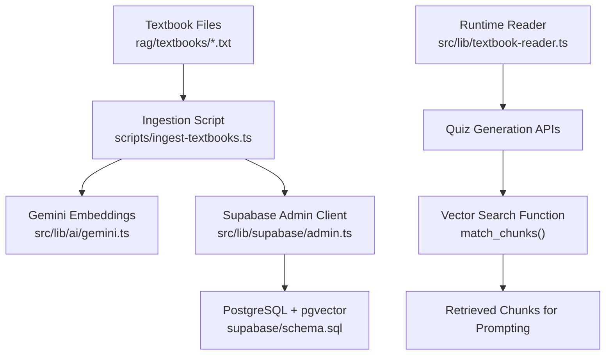
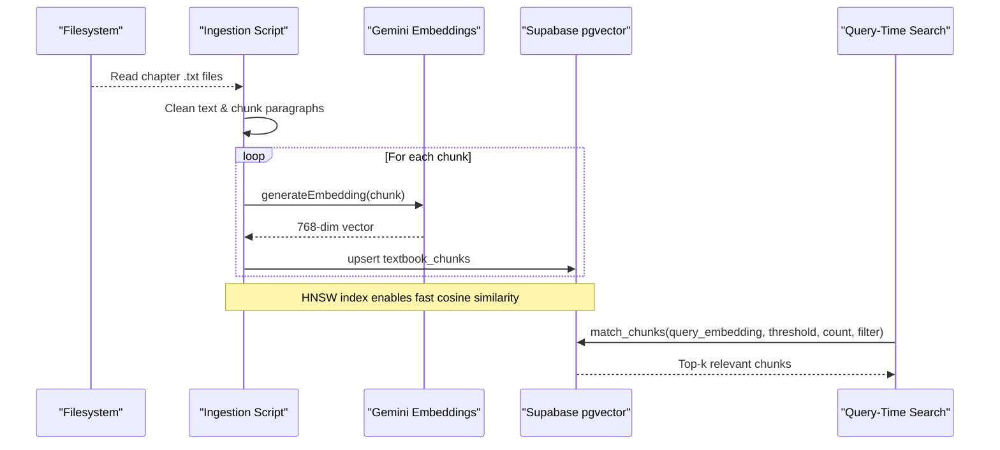
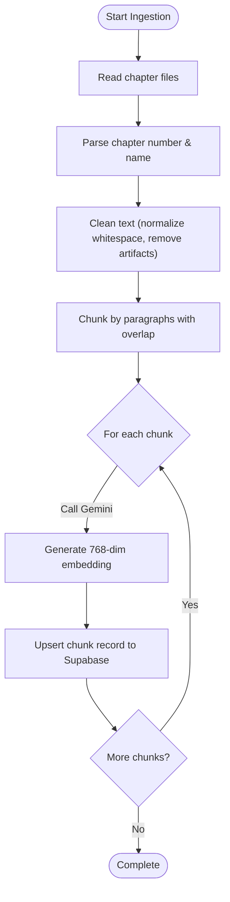
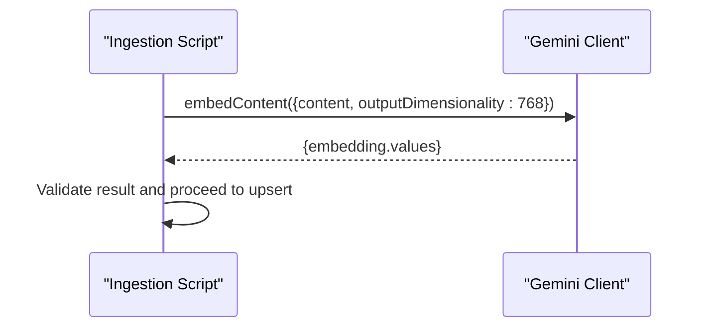
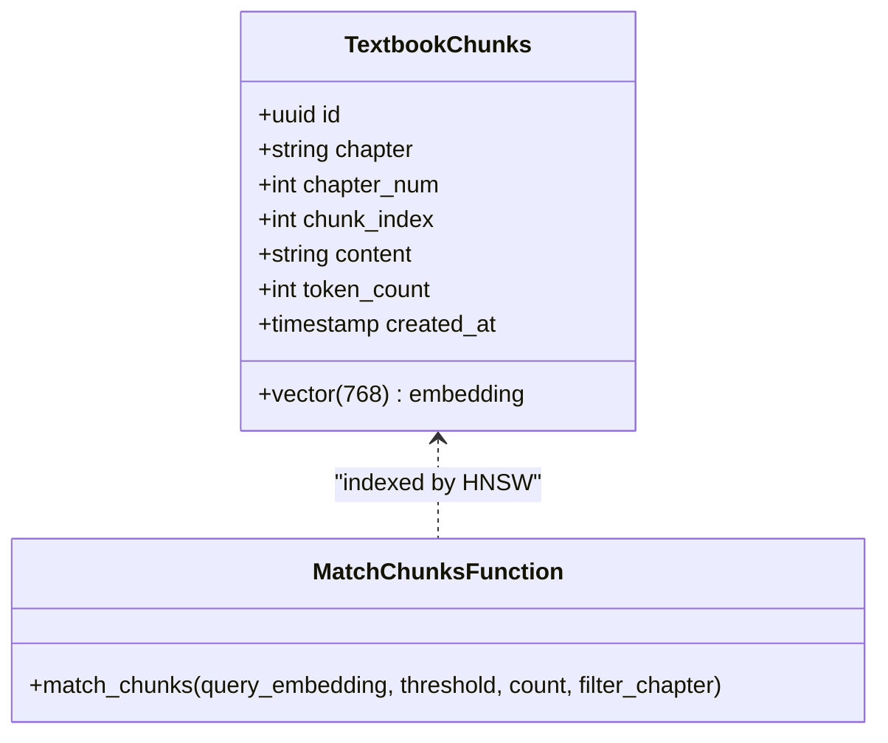
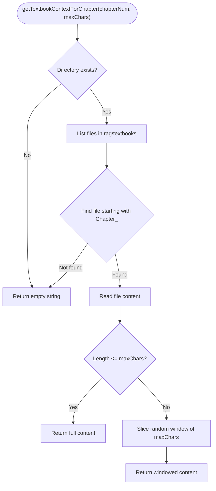
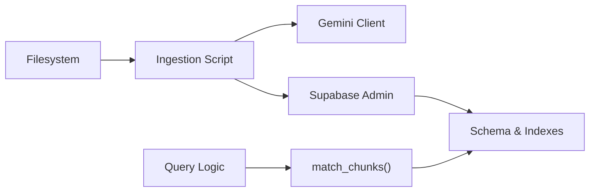

# Textbook Processing Pipeline

<cite>
**Referenced Files in This Document**
- [ingest-textbooks.ts](file://scripts/ingest-textbooks.ts)
- [check-chunks.ts](file://scripts/check-chunks.ts)
- [gemini.ts](file://src/lib/ai/gemini.ts)
- [textbook-reader.ts](file://src/lib/textbook-reader.ts)
- [admin.ts](file://src/lib/supabase/admin.ts)
- [schema.sql](file://supabase/schema.sql)
- [Chapter_1_Digestive_System_of_Man_extracted.txt](file://rag/textbooks/Chapter_1_Digestive_System_of_Man_extracted.txt)
- [Chapter_2_Blood_Circulatory_System_of_Man_extracted.txt](file://rag/textbooks/Chapter_2_Blood_Circulatory_System_of_Man_extracted.txt)
- [README.md](file://README.md)
</cite>

## Table of Contents
1. [Introduction](#introduction)
2. [Project Structure](#project-structure)
3. [Core Components](#core-components)
4. [Architecture Overview](#architecture-overview)
5. [Detailed Component Analysis](#detailed-component-analysis)
6. [Dependency Analysis](#dependency-analysis)
7. [Performance Considerations](#performance-considerations)
8. [Troubleshooting Guide](#troubleshooting-guide)
9. [Conclusion](#conclusion)
10. [Appendices](#appendices)

## Introduction
This document explains MedAce-AI’s Retrieval-Augmented Generation (RAG) pipeline for processing educational textbook content. It covers how raw textbook files are ingested, chunked with context-preserving strategies, embedded using Google Gemini API, and stored in Supabase PostgreSQL with the pgvector extension for efficient semantic search. The pipeline supports quiz generation by retrieving relevant textbook chunks at query time to ground AI-generated questions in accurate curriculum content.

## Project Structure
The RAG pipeline spans data ingestion scripts, AI integration utilities, database schema, and a textbook reader used during runtime. Key directories and files:
- rag/textbooks: Raw chapter text files (e.g., Biology Digestive System, Blood Circulatory System).
- scripts: Ingestion and verification scripts that orchestrate chunking, embedding, and storage.
- src/lib/ai/gemini.ts: Gemini client configuration and embedding generation.
- src/lib/supabase/admin.ts: Admin client for server-side writes to Supabase.
- supabase/schema.sql: Database schema including vector table and similarity search function.
- README.md: High-level architecture and RAG pipeline overview.

**Diagram sources**
- [ingest-textbooks.ts:97-183](file://scripts/ingest-textbooks.ts#L97-L183)
- [gemini.ts:29-43](file://src/lib/ai/gemini.ts#L29-L43)
- [admin.ts:1-22](file://src/lib/supabase/admin.ts#L1-L22)
- [schema.sql:27-44](file://supabase/schema.sql#L27-L44)
- [schema.sql:116-150](file://supabase/schema.sql#L116-L150)
- [textbook-reader.ts:1-46](file://src/lib/textbook-reader.ts#L1-L46)

**Section sources**
- [README.md:84-127](file://README.md#L84-L127)
- [README.md:170-253](file://README.md#L170-L253)

## Core Components
- Ingestion script: Reads chapter files, cleans text, splits into chunks, generates embeddings via Gemini, and upserts records into Supabase.
- Gemini integration: Provides embedding model configuration and generateEmbedding utility.
- Supabase admin client: Server-side client for writing to the vector store.
- Database schema: Defines textbook_chunks table, HNSW index, and match_chunks function for cosine similarity retrieval.
- Textbook reader: Runtime helper to fetch chapter content for prompt building.

Key responsibilities:
- Data cleaning and normalization to remove OCR artifacts and normalize whitespace.
- Chunking strategy that preserves paragraph boundaries and overlaps to maintain context.
- Robust embedding calls with rate-limit handling and retries.
- Vector indexing and SQL-based similarity search optimized for performance.

**Section sources**
- [ingest-textbooks.ts:38-75](file://scripts/ingest-textbooks.ts#L38-L75)
- [ingest-textbooks.ts:97-183](file://scripts/ingest-textbooks.ts#L97-L183)
- [gemini.ts:21-43](file://src/lib/ai/gemini.ts#L21-L43)
- [admin.ts:1-22](file://src/lib/supabase/admin.ts#L1-L22)
- [schema.sql:27-44](file://supabase/schema.sql#L27-L44)
- [schema.sql:116-150](file://supabase/schema.sql#L116-L150)
- [textbook-reader.ts:1-46](file://src/lib/textbook-reader.ts#L1-L46)

## Architecture Overview
The RAG system consists of two main phases:
- Build-time indexing: Ingest textbooks, clean, chunk, embed, and store vectors.
- Query-time retrieval: Generate embeddings for queries, perform vector similarity search, and use retrieved chunks to ground LLM responses.

**Diagram sources**
- [ingest-textbooks.ts:97-183](file://scripts/ingest-textbooks.ts#L97-L183)
- [gemini.ts:29-43](file://src/lib/ai/gemini.ts#L29-L43)
- [schema.sql:27-44](file://supabase/schema.sql#L27-L44)
- [schema.sql:116-150](file://supabase/schema.sql#L116-L150)

## Detailed Component Analysis

### Ingestion Pipeline (Chunking, Embedding, Storage)
The ingestion script orchestrates the full flow:
- File discovery and parsing: Scans rag/textbooks for .txt files and extracts chapter metadata from filenames.
- Text cleaning: Normalizes line endings, collapses whitespace, and removes excessive blank lines.
- Chunking: Splits content by paragraph boundaries with configurable target size and overlap to preserve context across chunk boundaries.
- Embedding generation: Calls Gemini embedding model with retry logic and rate-limit backoff.
- Database upsert: Inserts or updates textbook_chunks records with chapter info, chunk index, content, approximate token count, and vector embedding.

**Diagram sources**
- [ingest-textbooks.ts:38-75](file://scripts/ingest-textbooks.ts#L38-L75)
- [ingest-textbooks.ts:97-183](file://scripts/ingest-textbooks.ts#L97-L183)

**Section sources**
- [ingest-textbooks.ts:38-75](file://scripts/ingest-textbooks.ts#L38-L75)
- [ingest-textbooks.ts:97-183](file://scripts/ingest-textbooks.ts#L97-L183)

### Gemini Embedding Integration
- Model selection: Uses Gemini embedding model configured for 768-dimensional outputs.
- Error handling: Validates environment variables and response structure; throws descriptive errors on failure.
- Usage in ingestion: Called per chunk with retry and delay to respect API limits.

**Diagram sources**
- [gemini.ts:21-43](file://src/lib/ai/gemini.ts#L21-L43)
- [ingest-textbooks.ts:129-165](file://scripts/ingest-textbooks.ts#L129-L165)

**Section sources**
- [gemini.ts:21-43](file://src/lib/ai/gemini.ts#L21-L43)
- [ingest-textbooks.ts:129-165](file://scripts/ingest-textbooks.ts#L129-L165)

### Supabase Vector Store and Similarity Search
- Schema: textbook_chunks stores chapter metadata, chunk content, token count, and vector(768).
- Indexing: HNSW index on embedding with cosine operations for fast similarity search.
- Retrieval function: match_chunks performs cosine similarity filtering and ranking with optional chapter filters.

**Diagram sources**
- [schema.sql:27-44](file://supabase/schema.sql#L27-L44)
- [schema.sql:116-150](file://supabase/schema.sql#L116-L150)

**Section sources**
- [schema.sql:27-44](file://supabase/schema.sql#L27-L44)
- [schema.sql:116-150](file://supabase/schema.sql#L116-L150)

### Textbook Reader (Runtime Context Loader)
- Purpose: Retrieves chapter-specific textbook content for prompt construction during quiz generation.
- Behavior: Locates matching file by chapter number, reads content, and returns a bounded window of text to fit context constraints.
- Use case: Supports dynamic topic selection and ensures relevant content is included when generating questions.

**Diagram sources**
- [textbook-reader.ts:1-46](file://src/lib/textbook-reader.ts#L1-L46)

**Section sources**
- [textbook-reader.ts:1-46](file://src/lib/textbook-reader.ts#L1-L46)

### Practical Examples: Subject Chapters
- Biology Digestive System (Chapter 1):
  - Ingestion: File parsed, cleaned, chunked by paragraphs with overlap, embedded, and stored.
  - Retrieval: Queries about digestion processes retrieve relevant chunks via cosine similarity.
- Blood Circulatory System (Chapter 2):
  - Ingestion: Same pipeline applies; heart anatomy and circulation topics become searchable segments.
  - Retrieval: Topic-specific queries return precise anatomical and physiological details.

These examples demonstrate consistent processing across chapters, enabling reliable retrieval for quiz generation.

**Section sources**
- [Chapter_1_Digestive_System_of_Man_extracted.txt:1-200](file://rag/textbooks/Chapter_1_Digestive_System_of_Man_extracted.txt#L1-L200)
- [Chapter_2_Blood_Circulatory_System_of_Man_extracted.txt:1-200](file://rag/textbooks/Chapter_2_Blood_Circulatory_System_of_Man_extracted.txt#L1-L200)
- [ingest-textbooks.ts:97-183](file://scripts/ingest-textbooks.ts#L97-L183)

## Dependency Analysis
The pipeline components depend on each other as follows:
- Ingestion script depends on filesystem access, Gemini embedding service, and Supabase admin client.
- Gemini client depends on environment configuration for API key.
- Supabase schema provides vector storage and similarity search capabilities consumed by query-time logic.
- Textbook reader depends on filesystem layout and naming conventions for chapter files.

**Diagram sources**
- [ingest-textbooks.ts:97-183](file://scripts/ingest-textbooks.ts#L97-L183)
- [gemini.ts:21-43](file://src/lib/ai/gemini.ts#L21-L43)
- [admin.ts:1-22](file://src/lib/supabase/admin.ts#L1-L22)
- [schema.sql:27-44](file://supabase/schema.sql#L27-L44)
- [schema.sql:116-150](file://supabase/schema.sql#L116-L150)

**Section sources**
- [ingest-textbooks.ts:97-183](file://scripts/ingest-textbooks.ts#L97-L183)
- [gemini.ts:21-43](file://src/lib/ai/gemini.ts#L21-L43)
- [admin.ts:1-22](file://src/lib/supabase/admin.ts#L1-L22)
- [schema.sql:27-44](file://supabase/schema.sql#L27-L44)
- [schema.sql:116-150](file://supabase/schema.sql#L116-L150)

## Performance Considerations
- Chunk size and overlap: Paragraph-aware chunking with overlap improves recall while keeping chunks manageable for embedding and retrieval.
- HNSW indexing: Cosine similarity with HNSW index accelerates top-k retrieval for large corpora.
- Rate limiting: Built-in delays and retries protect against API throttling during ingestion.
- Token estimation: Approximate token counts help monitor chunk sizes and optimize downstream prompting.

[No sources needed since this section provides general guidance]

## Troubleshooting Guide
Common issues and resolutions:
- Missing or invalid Gemini API key: Ensure GEMINI_API_KEY is set; embedding generation will throw an error if absent.
- Rate limit errors (429): Ingestion includes retry logic with exponential backoff; consider increasing delays or batching.
- No chunks found: Verify textbook files exist and follow expected naming patterns; use check-chunks script to verify database counts.
- Poor retrieval quality: Adjust chunk size/overlap thresholds and similarity thresholds in match_chunks; refine filters by chapter.

**Section sources**
- [gemini.ts:29-43](file://src/lib/ai/gemini.ts#L29-L43)
- [ingest-textbooks.ts:129-165](file://scripts/ingest-textbooks.ts#L129-L165)
- [check-chunks.ts:20-29](file://scripts/check-chunks.ts#L20-L29)
- [schema.sql:116-150](file://supabase/schema.sql#L116-L150)

## Conclusion
MedAce-AI’s RAG pipeline transforms raw textbook chapters into searchable, semantically indexed content using Gemini embeddings and Supabase pgvector. The ingestion process ensures robust cleaning, context-preserving chunking, and resilient embedding generation. At query time, the match_chunks function enables fast, accurate retrieval to ground AI-generated quizzes in verified curriculum content. This design balances performance, reliability, and educational fidelity across diverse subjects like Biology, Chemistry, and Physics.

[No sources needed since this section summarizes without analyzing specific files]

## Appendices
- Environment setup: Configure NEXT_PUBLIC_SUPABASE_URL, SUPABASE_SERVICE_ROLE_KEY, and GEMINI_API_KEY before running ingestion.
- Running ingestion: Execute the ingestion script to populate textbook_chunks; verify with the check-chunks script.
- Extending to new subjects: Place chapter files in rag/textbooks following naming conventions; re-run ingestion to index new content.

**Section sources**
- [README.md:255-271](file://README.md#L255-L271)
- [README.md:414-433](file://README.md#L414-L433)
- [check-chunks.ts:20-29](file://scripts/check-chunks.ts#L20-L29)