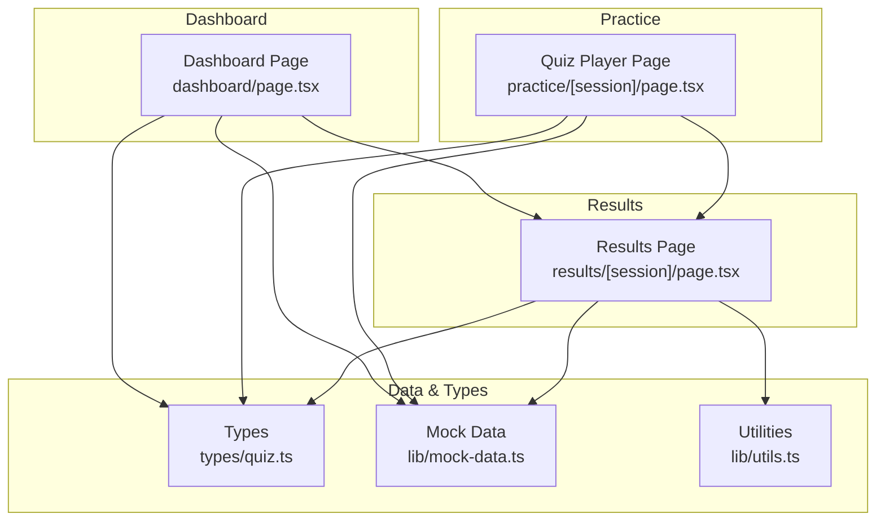
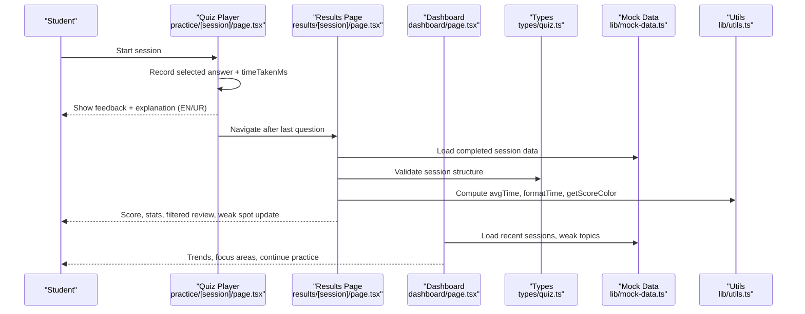
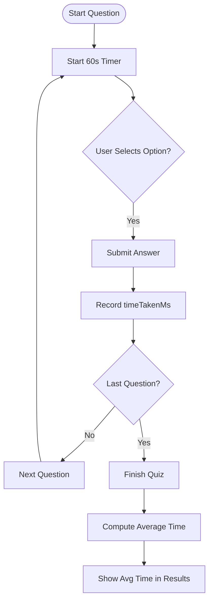
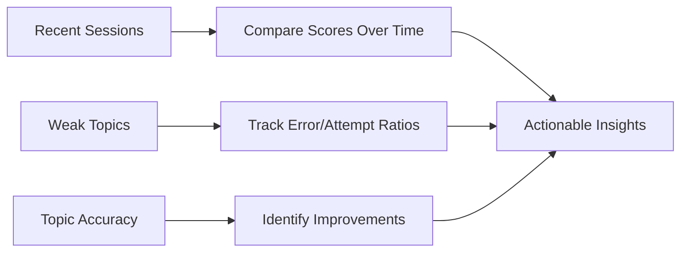
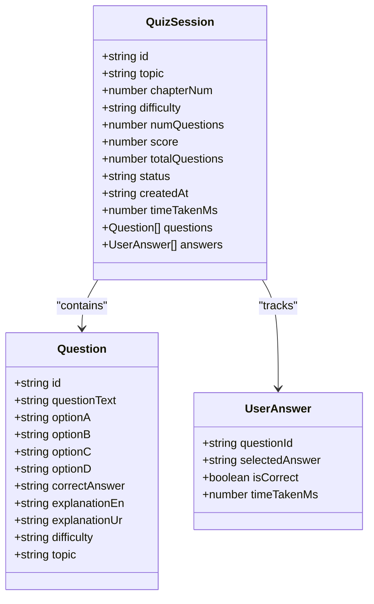
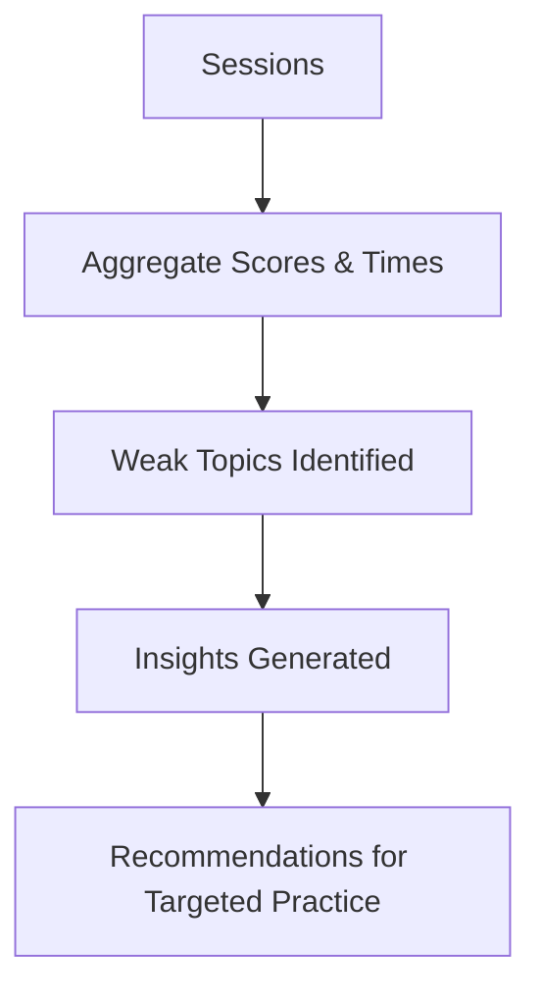
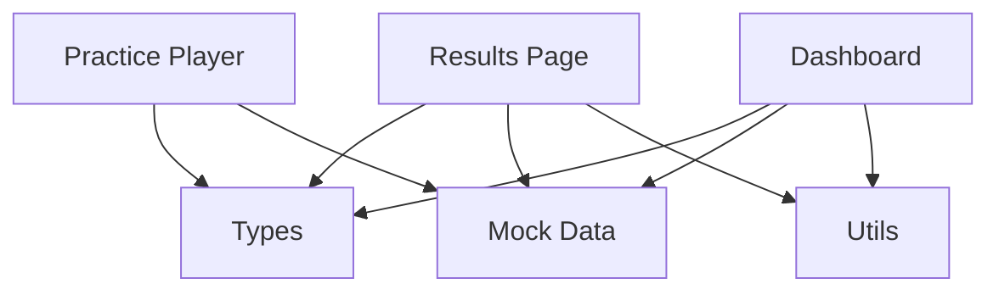

# Results Analysis

<cite>
**Referenced Files in This Document**
- [page.tsx](file://src/app/results/[session]/page.tsx)
- [quiz.ts](file://src/types/quiz.ts)
- [mock-data.ts](file://src/lib/mock-data.ts)
- [utils.ts](file://src/lib/utils.ts)
- [page.tsx](file://src/app/practice/[session]/page.tsx)
- [page.tsx](file://src/app/dashboard/page.tsx)
</cite>

## Table of Contents
1. Introduction
2. Project Structure
3. Core Components
4. Architecture Overview
5. Detailed Component Analysis
6. Dependency Analysis
7. Performance Considerations
8. Troubleshooting Guide
9. Conclusion
10. Appendices

## Introduction
This document explains the comprehensive results analysis system for practice sessions. It covers:
- Session review interface with detailed breakdown per question
- Time analysis features that track response times and highlight slow-performing topics
- Improvement tracking with comparative analytics across sessions
- Explanation system providing reasoning for correct and incorrect answers in English and Urdu
- Performance trend analysis, skill gap identification, and recommendations for targeted practice
- Export capabilities to share results with tutors or parents

The system is implemented as a Next.js client application using React components, TypeScript types, and mock data to demonstrate end-to-end functionality.

## Project Structure
The results analysis spans several key files:
- Results page renders session score, stats, weak spot updates, and per-question review with filtering and bilingual explanations
- Practice player captures answers, tracks time per question, and navigates to results upon completion
- Dashboard shows recent sessions, weak topics, and progress indicators
- Types define the data model for questions, answers, sessions, and performance metrics
- Utilities provide formatting helpers for time and score colors
- Mock data provides realistic sample sessions and questions

**Diagram sources**
- [page.tsx](file://src/app/results/[session]/page.tsx)
- [page.tsx](file://src/app/practice/[session]/page.tsx)
- [page.tsx](file://src/app/dashboard/page.tsx)
- [quiz.ts](file://src/types/quiz.ts)
- [mock-data.ts](file://src/lib/mock-data.ts)
- [utils.ts](file://src/lib/utils.ts)

**Section sources**
- [page.tsx](file://src/app/results/[session]/page.tsx)
- [page.tsx](file://src/app/practice/[session]/page.tsx)
- [page.tsx](file://src/app/dashboard/page.tsx)
- [quiz.ts](file://src/types/quiz.ts)
- [mock-data.ts](file://src/lib/mock-data.ts)
- [utils.ts](file://src/lib/utils.ts)

## Core Components
- Results Page: Displays overall score, grade label, average time, weak spot update, and filtered question review with bilingual explanations
- Quiz Player: Captures user answers, enforces per-question timer, and routes to results on completion
- Dashboard: Shows recent sessions, weak topics, and quick-start cards for continued practice
- Types: Define Question, UserAnswer, QuizSession, WeakTopic, and related models
- Utilities: Format time and derive score-based color classes
- Mock Data: Provide completed session, questions, weak topics, and dashboard stats

Key responsibilities:
- Compute aggregate metrics (score, percentage, average time)
- Filter questions by correctness status
- Toggle bilingual explanations (English/Urdu)
- Track per-question timing and compute averages
- Present actionable insights (weak spots, next steps)

**Section sources**
- [page.tsx](file://src/app/results/[session]/page.tsx)
- [page.tsx](file://src/app/practice/[session]/page.tsx)
- [page.tsx](file://src/app/dashboard/page.tsx)
- [quiz.ts](file://src/types/quiz.ts)
- [mock-data.ts](file://src/lib/mock-data.ts)
- [utils.ts](file://src/lib/utils.ts)

## Architecture Overview
The results analysis flow connects practice, results, and dashboard through shared data models and utilities. The quiz player records answers and timing; the results page aggregates and visualizes them; the dashboard surfaces trends and weak areas.

**Diagram sources**
- [page.tsx](file://src/app/practice/[session]/page.tsx)
- [page.tsx](file://src/app/results/[session]/page.tsx)
- [page.tsx](file://src/app/dashboard/page.tsx)
- [quiz.ts](file://src/types/quiz.ts)
- [mock-data.ts](file://src/lib/mock-data.ts)
- [utils.ts](file://src/lib/utils.ts)

## Detailed Component Analysis

### Session Review Interface
- Score header with circular progress and grade label based on percentage thresholds
- Stats row showing counts of correct, wrong, and average time per question
- Weak spot update card indicating improvement and linking back to practice
- Question review with tabs to filter All, Correct, Wrong, Skipped
- Expandable question details showing options, correct/wrong highlighting, and bilingual explanations
- Action buttons to practice again, try weakest topic, or return to dashboard

Implementation highlights:
- Computes average time from per-answer durations
- Filters questions by tab selection
- Toggles Urdu explanation visibility per question
- Uses utility functions for consistent styling and formatting

**Section sources**
- [page.tsx](file://src/app/results/[session]/page.tsx)
- [utils.ts](file://src/lib/utils.ts)

### Time Analysis Features
- Per-question timer during practice with countdown and visual urgency
- Tracks timeTakenMs per answer and computes session average time
- Highlights slow responses via average time display and potential future alerts
- Supports identifying slow-performing topics by aggregating time per topic across sessions

**Diagram sources**
- [page.tsx](file://src/app/practice/[session]/page.tsx)
- [page.tsx](file://src/app/results/[session]/page.tsx)
- [mock-data.ts](file://src/lib/mock-data.ts)

**Section sources**
- [page.tsx](file://src/app/practice/[session]/page.tsx)
- [page.tsx](file://src/app/results/[session]/page.tsx)
- [mock-data.ts](file://src/lib/mock-data.ts)

### Improvement Tracking System
- Dashboard displays recent sessions with scores and dates, enabling comparative analytics over time
- Weak topics list shows error counts and attempt counts, with progress bars indicating weakness severity
- Topic accuracy percentages help identify long-term improvements or regressions
- Links to results pages allow deep dives into specific sessions

**Diagram sources**
- [page.tsx](file://src/app/dashboard/page.tsx)
- [mock-data.ts](file://src/lib/mock-data.ts)

**Section sources**
- [page.tsx](file://src/app/dashboard/page.tsx)
- [mock-data.ts](file://src/lib/mock-data.ts)

### Explanation System (English and Urdu)
- Each question includes bilingual explanations stored in the data model
- During practice, users can toggle Urdu explanations for immediate learning support
- In results, each expanded question shows English explanation by default and an optional Urdu explanation toggle
- Consistent UI patterns ensure clarity and accessibility

**Diagram sources**
- [quiz.ts](file://src/types/quiz.ts)
- [mock-data.ts](file://src/lib/mock-data.ts)

**Section sources**
- [quiz.ts](file://src/types/quiz.ts)
- [mock-data.ts](file://src/lib/mock-data.ts)
- [page.tsx](file://src/app/results/[session]/page.tsx)
- [page.tsx](file://src/app/practice/[session]/page.tsx)

### Performance Trend Analysis and Skill Gap Identification
- Aggregates per-session scores and times to reveal trends
- Identifies weak topics via error counts and weakness scores
- Provides insights such as “Nervous System needs the most attention” and “improved X% in Y”
- Recommends focused practice on weakest areas

**Diagram sources**
- [mock-data.ts](file://src/lib/mock-data.ts)
- [page.tsx](file://src/app/dashboard/page.tsx)

**Section sources**
- [mock-data.ts](file://src/lib/mock-data.ts)
- [page.tsx](file://src/app/dashboard/page.tsx)

### Recommendations for Targeted Practice
- “Try Weakest Topic” action directs students to focused practice
- Weak spot update card encourages continued practice on improved areas
- Dashboard links to practice pages for immediate action

**Section sources**
- [page.tsx](file://src/app/results/[session]/page.tsx)
- [page.tsx](file://src/app/dashboard/page.tsx)

### Export Capabilities
- No explicit export or sharing implementation is present in the analyzed files
- To enable sharing results with tutors or parents, consider adding:
  - PDF generation of session summary (score, weak topics, explanations)
  - CSV export of session answers and timings
  - Shareable link with read-only view of results
  - Email integration to send summaries

[No sources needed since this section proposes enhancements not currently implemented]

## Dependency Analysis
- Results page depends on:
  - Types for data validation
  - Mock data for session content
  - Utilities for formatting and styling
- Practice player depends on:
  - Types and mock data
  - Router navigation to results
- Dashboard depends on:
  - Mock data for weak topics and recent sessions
  - Utilities for date formatting and score coloring

**Diagram sources**
- [page.tsx](file://src/app/results/[session]/page.tsx)
- [page.tsx](file://src/app/practice/[session]/page.tsx)
- [page.tsx](file://src/app/dashboard/page.tsx)
- [quiz.ts](file://src/types/quiz.ts)
- [mock-data.ts](file://src/lib/mock-data.ts)
- [utils.ts](file://src/lib/utils.ts)

**Section sources**
- [page.tsx](file://src/app/results/[session]/page.tsx)
- [page.tsx](file://src/app/practice/[session]/page.tsx)
- [page.tsx](file://src/app/dashboard/page.tsx)
- [quiz.ts](file://src/types/quiz.ts)
- [mock-data.ts](file://src/lib/mock-data.ts)
- [utils.ts](file://src/lib/utils.ts)

## Performance Considerations
- Efficient filtering of questions by correctness reduces rendering overhead
- Computing average time uses linear reduction over answers; acceptable for typical session sizes
- Avoid unnecessary re-renders by memoizing expensive computations if sessions grow larger
- Consider caching session data locally to reduce load times when revisiting results

[No sources needed since this section provides general guidance]

## Troubleshooting Guide
Common issues and resolutions:
- Missing answers mapping: Ensure each question has a corresponding UserAnswer; otherwise filters may misclassify skipped vs wrong
- Incorrect average time: Verify timeTakenMs units are milliseconds and conversion to seconds is applied consistently
- Urdu toggle not working: Confirm state management for showUrdu per question and proper conditional rendering
- Navigation to results: Ensure final question triggers route change to results path

**Section sources**
- [page.tsx](file://src/app/results/[session]/page.tsx)
- [page.tsx](file://src/app/practice/[session]/page.tsx)

## Conclusion
The results analysis system provides a robust session review interface with detailed per-question breakdowns, time analysis, improvement tracking, and bilingual explanations. It identifies weak topics and offers actionable recommendations for targeted practice. While export capabilities are not yet implemented, the architecture supports future enhancements for sharing results with tutors or parents.

[No sources needed since this section summarizes without analyzing specific files]

## Appendices

### Data Models Summary
- Question: Contains text, options, correct answer, bilingual explanations, difficulty, and topic
- UserAnswer: Records selected answer, correctness, and time taken
- QuizSession: Aggregates questions, answers, score, timing, and metadata
- WeakTopic: Tracks weakness score, error count, and attempts for targeted focus

**Section sources**
- [quiz.ts](file://src/types/quiz.ts)
- [mock-data.ts](file://src/lib/mock-data.ts)