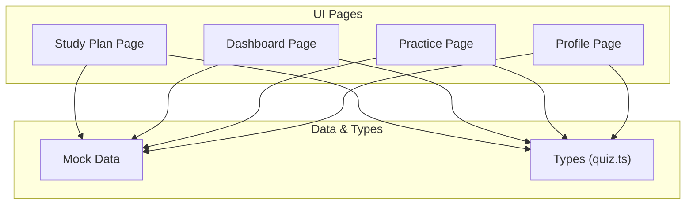
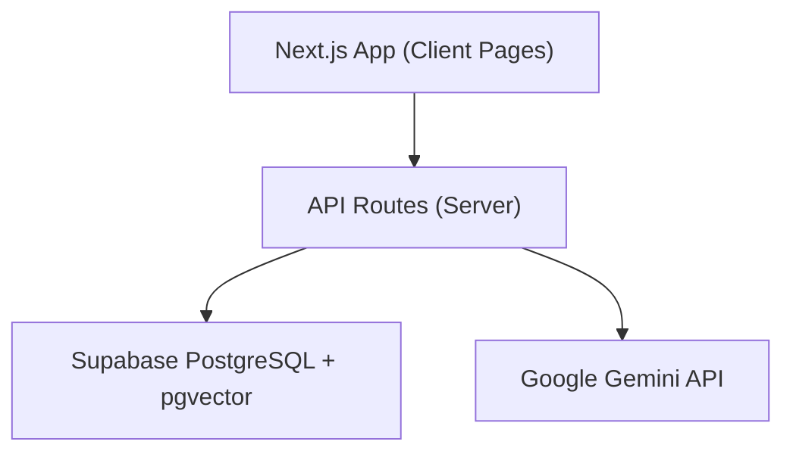
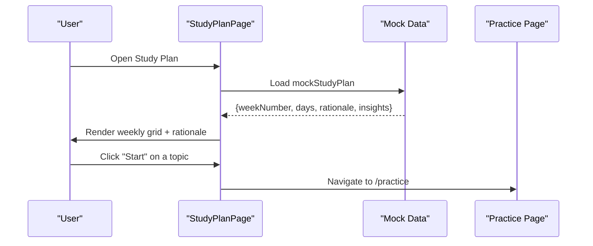
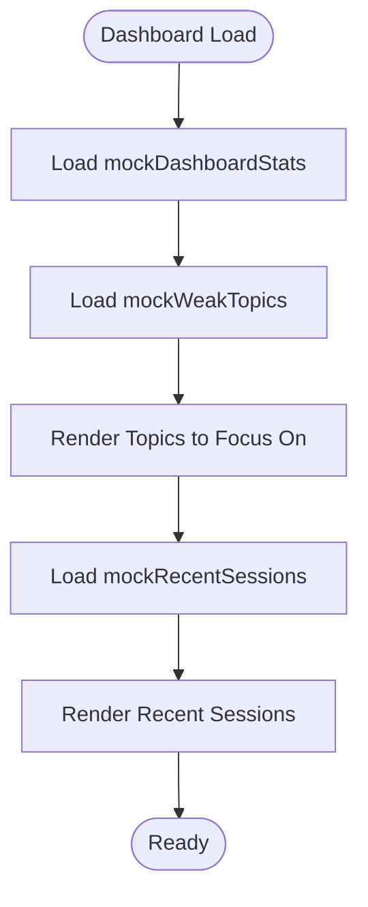
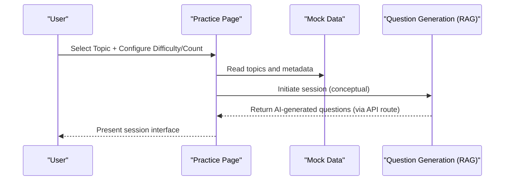
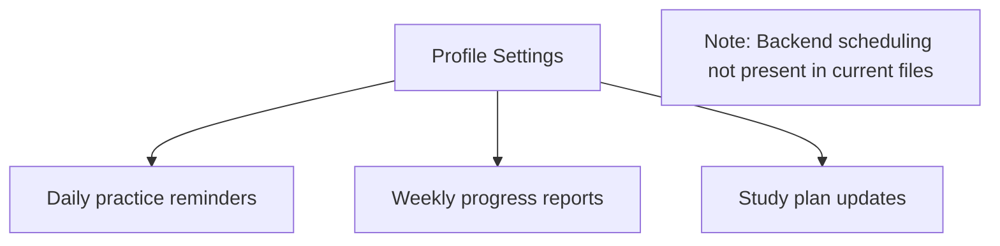
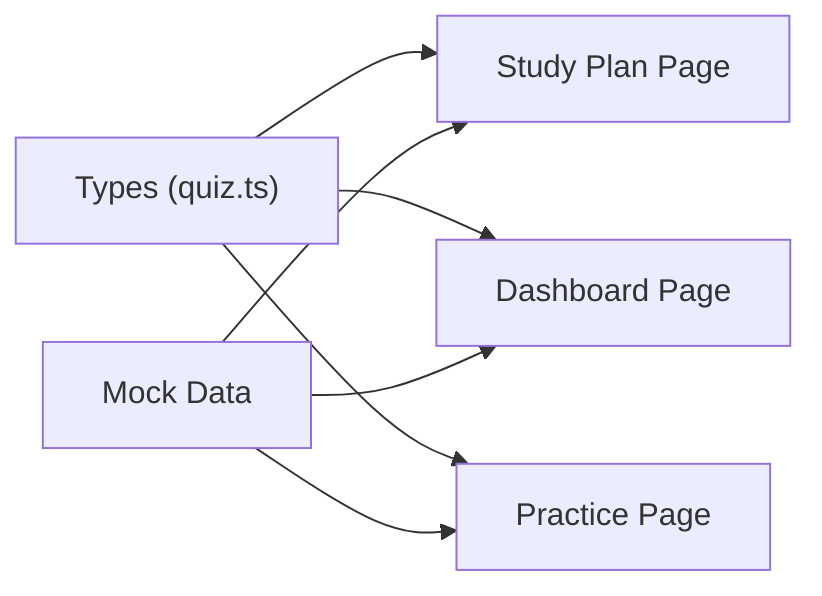

# Study Plan Generator

<cite>
**Referenced Files in This Document**
- [README.md](file://README.md)
- [src/app/study-plan/page.tsx](file://src/app/study-plan/page.tsx)
- [src/app/dashboard/page.tsx](file://src/app/dashboard/page.tsx)
- [src/app/practice/page.tsx](file://src/app/practice/page.tsx)
- [src/app/profile/page.tsx](file://src/app/profile/page.tsx)
- [src/lib/mock-data.ts](file://src/lib/mock-data.ts)
- [src/types/quiz.ts](file://src/types/quiz.ts)
</cite>

## Table of Contents
1. Introduction
2. Project Structure
3. Core Components
4. Architecture Overview
5. Detailed Component Analysis
6. Dependency Analysis
7. Performance Considerations
8. Troubleshooting Guide
9. Conclusion

## Introduction
This document explains the personalized study plan generator for MedAce AI, an adaptive MDCAT prep coach. It covers how weekly schedules are created based on individual learning patterns, weak spots, and performance history; how the system adapts plans over time; how topics are distributed across the week to balance difficulty; how the practice engine integrates with identified weak areas; and how calendar integration, reminders, progress monitoring, and customization options are implemented or exposed in the current codebase.

The study plan is currently rendered from mock data and UI components, while the broader architecture (including API routes and database schema) indicates where server-side generation and persistence will live.

## Project Structure
At a high level:
- The study plan UI lives under src/app/study-plan/page.tsx and consumes a structured plan object.
- Weak-spot identification and recent performance are surfaced in the dashboard.
- Practice sessions are initiated from the practice page and can be configured by difficulty and question count.
- User settings include notification toggles that support reminders and progress reports.
- Types define the shape of study plans, days, and related entities.
- Mock data provides sample topics, weak topics, stats, and a full weekly plan used by the UI.

**Diagram sources**
- [src/app/study-plan/page.tsx:1-192](file://src/app/study-plan/page.tsx#L1-L192)
- [src/app/dashboard/page.tsx:1-239](file://src/app/dashboard/page.tsx#L1-L239)
- [src/app/practice/page.tsx:1-196](file://src/app/practice/page.tsx#L1-L196)
- [src/app/profile/page.tsx:1-224](file://src/app/profile/page.tsx#L1-L224)
- [src/lib/mock-data.ts:1-313](file://src/lib/mock-data.ts#L1-L313)
- [src/types/quiz.ts:1-107](file://src/types/quiz.ts#L1-L107)

**Section sources**
- [README.md:23-78](file://README.md#L23-L78)
- [src/app/study-plan/page.tsx:1-192](file://src/app/study-plan/page.tsx#L1-L192)
- [src/lib/mock-data.ts:258-281](file://src/lib/mock-data.ts#L258-L281)
- [src/types/quiz.ts:60-76](file://src/types/quiz.ts#L60-L76)

## Core Components
- Study Plan Page: Displays a weekly schedule, highlights today’s tasks, shows completed items, and explains rationale and insights behind the plan.
- Dashboard: Surfaces weak topics, recent sessions, and quick-start links to practice.
- Practice Page: Allows topic selection, difficulty configuration, and session sizing; includes an AI note indicating RAG-powered question generation.
- Profile Page: Provides user settings including notification toggles for daily reminders, weekly reports, and study plan updates.
- Types and Mock Data: Define the structure of study plans, days, topics, weak topics, and provide sample data used by the UI.

Key responsibilities:
- Presenting a clear weekly view with status indicators (today, completed, upcoming).
- Linking planned topics directly to the practice engine via navigation.
- Showing rationale and insights to help users understand why certain topics are prioritized.
- Exposing customization through session configuration and notification preferences.

**Section sources**
- [src/app/study-plan/page.tsx:18-191](file://src/app/study-plan/page.tsx#L18-L191)
- [src/app/dashboard/page.tsx:21-239](file://src/app/dashboard/page.tsx#L21-L239)
- [src/app/practice/page.tsx:18-196](file://src/app/practice/page.tsx#L18-L196)
- [src/app/profile/page.tsx:130-174](file://src/app/profile/page.tsx#L130-L174)
- [src/lib/mock-data.ts:258-281](file://src/lib/mock-data.ts#L258-L281)
- [src/types/quiz.ts:60-76](file://src/types/quiz.ts#L60-L76)

## Architecture Overview
The current implementation uses client-side pages that render mock data. The README documents the intended backend architecture, including API routes for study plan generation, Supabase storage, and Gemini-based generation. The database schema includes a study_plans table to persist generated plans per user and week.

**Diagram sources**
- [README.md:23-78](file://README.md#L23-L78)
- [README.md:124-161](file://README.md#L124-L161)

**Section sources**
- [README.md:23-78](file://README.md#L23-L78)
- [README.md:124-161](file://README.md#L124-L161)

## Detailed Component Analysis

### Study Plan Page
- Renders a weekly grid showing each day’s date, topics, estimated minutes, and status badges (Today, Completed).
- Filters days into “today” and “completed” to show focused task lists.
- Links each planned topic to the practice page for immediate execution.
- Shows rationale and insights explaining why the plan was generated this way.

**Diagram sources**
- [src/app/study-plan/page.tsx:18-191](file://src/app/study-plan/page.tsx#L18-L191)
- [src/lib/mock-data.ts:258-281](file://src/lib/mock-data.ts#L258-L281)
- [src/app/practice/page.tsx:18-196](file://src/app/practice/page.tsx#L18-L196)

**Section sources**
- [src/app/study-plan/page.tsx:18-191](file://src/app/study-plan/page.tsx#L18-L191)
- [src/lib/mock-data.ts:258-281](file://src/lib/mock-data.ts#L258-L281)

### Dashboard and Weak-Spot Tracking
- Displays weak topics with weakness scores, error counts, and attempt counts.
- Shows recent sessions with scores and dates.
- Provides quick links to practice and results.

**Diagram sources**
- [src/app/dashboard/page.tsx:21-239](file://src/app/dashboard/page.tsx#L21-L239)
- [src/lib/mock-data.ts:36-64](file://src/lib/mock-data.ts#L36-L64)

**Section sources**
- [src/app/dashboard/page.tsx:21-239](file://src/app/dashboard/page.tsx#L21-L239)
- [src/lib/mock-data.ts:36-64](file://src/lib/mock-data.ts#L36-L64)

### Practice Engine Integration
- Users select a topic and configure difficulty and number of questions.
- An AI note indicates that questions are generated using RAG retrieval from textbook content.
- The practice page supports categories, search, and weak-topic highlighting.

**Diagram sources**
- [src/app/practice/page.tsx:18-196](file://src/app/practice/page.tsx#L18-L196)
- [README.md:79-122](file://README.md#L79-L122)

**Section sources**
- [src/app/practice/page.tsx:18-196](file://src/app/practice/page.tsx#L18-L196)
- [README.md:79-122](file://README.md#L79-L122)

### Calendar Integration, Reminders, and Progress Monitoring
- Calendar integration: The study plan displays dates and statuses but does not integrate with external calendars in the current UI.
- Reminders: Profile settings expose toggles for daily practice reminders, weekly progress reports, and study plan updates. These are UI controls; backend scheduling is not shown in the provided files.
- Progress monitoring: Dashboard and profile pages display accuracy, streaks, chapter performance, and recent sessions.

**Diagram sources**
- [src/app/profile/page.tsx:130-174](file://src/app/profile/page.tsx#L130-L174)

**Section sources**
- [src/app/profile/page.tsx:130-174](file://src/app/profile/page.tsx#L130-L174)

### Customization Options
- Session configuration: Users can choose difficulty and number of questions before starting a practice session.
- Plan regeneration: The study plan page includes a “Regenerate Plan” button to refresh the weekly schedule.
- Notifications: Toggleable reminders and reports allow users to tailor their engagement cadence.

**Section sources**
- [src/app/study-plan/page.tsx:33-36](file://src/app/study-plan/page.tsx#L33-L36)
- [src/app/practice/page.tsx:137-161](file://src/app/practice/page.tsx#L137-L161)
- [src/app/profile/page.tsx:144-172](file://src/app/profile/page.tsx#L144-L172)

## Dependency Analysis
- Study Plan Page depends on mock data for plan structure and types for validation.
- Dashboard depends on mock weak topics and recent sessions to inform focus areas.
- Practice Page depends on topic metadata and supports configuration inputs.
- Types enforce consistent shapes for study plans, days, and related entities.

**Diagram sources**
- [src/types/quiz.ts:60-76](file://src/types/quiz.ts#L60-L76)
- [src/lib/mock-data.ts:258-281](file://src/lib/mock-data.ts#L258-L281)
- [src/app/study-plan/page.tsx:18-191](file://src/app/study-plan/page.tsx#L18-L191)
- [src/app/dashboard/page.tsx:21-239](file://src/app/dashboard/page.tsx#L21-L239)
- [src/app/practice/page.tsx:18-196](file://src/app/practice/page.tsx#L18-L196)

**Section sources**
- [src/types/quiz.ts:60-76](file://src/types/quiz.ts#L60-L76)
- [src/lib/mock-data.ts:258-281](file://src/lib/mock-data.ts#L258-L281)
- [src/app/study-plan/page.tsx:18-191](file://src/app/study-plan/page.tsx#L18-L191)
- [src/app/dashboard/page.tsx:21-239](file://src/app/dashboard/page.tsx#L21-L239)
- [src/app/practice/page.tsx:18-196](file://src/app/practice/page.tsx#L18-L196)

## Performance Considerations
- Rendering efficiency: The study plan page filters days into “today” and “completed” sets for focused views; ensure list rendering remains efficient as weeks grow.
- Data loading: Currently using static mock data; when moving to server-side generation, consider caching strategies and pagination for large datasets.
- Network calls: Practice session generation relies on RAG and Gemini; implement retries, timeouts, and progressive loading to maintain responsiveness.

[No sources needed since this section provides general guidance]

## Troubleshooting Guide
- Missing plan data: If the study plan page shows no content, verify that mock data is loaded and that the plan structure matches expected types.
- Incorrect status labels: Ensure day status values match the allowed enum (“completed”, “today”, “upcoming”) to avoid misrendered badges.
- Navigation issues: Confirm that links to the practice page are correctly routed and that topic names align with available topics.

**Section sources**
- [src/types/quiz.ts:60-76](file://src/types/quiz.ts#L60-L76)
- [src/app/study-plan/page.tsx:18-191](file://src/app/study-plan/page.tsx#L18-L191)

## Conclusion
The personalized study plan generator presents a clear weekly schedule tailored to weak areas and performance history, with direct links to the practice engine for immediate action. While the current UI renders mock data, the documented architecture supports server-side generation, persistence, and AI-driven content creation. Notification toggles enable reminder and progress reporting preferences, and session configuration allows customization. Future enhancements should connect the UI to backend APIs for dynamic plan generation, calendar integrations, and robust reminder scheduling.