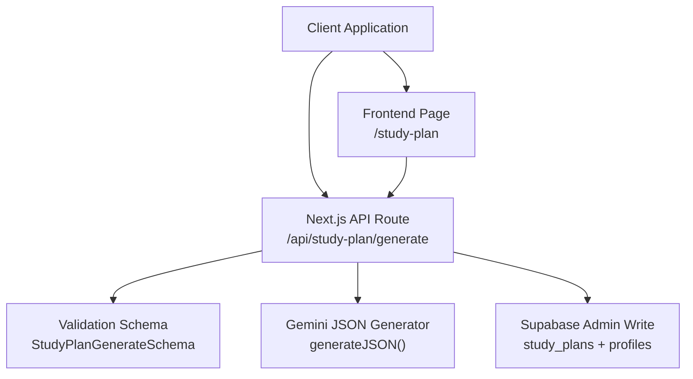
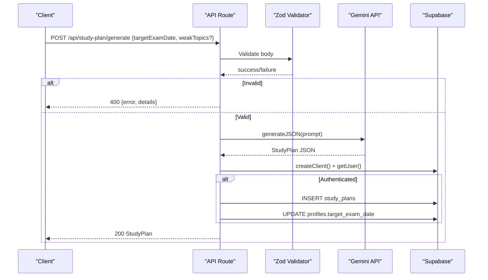
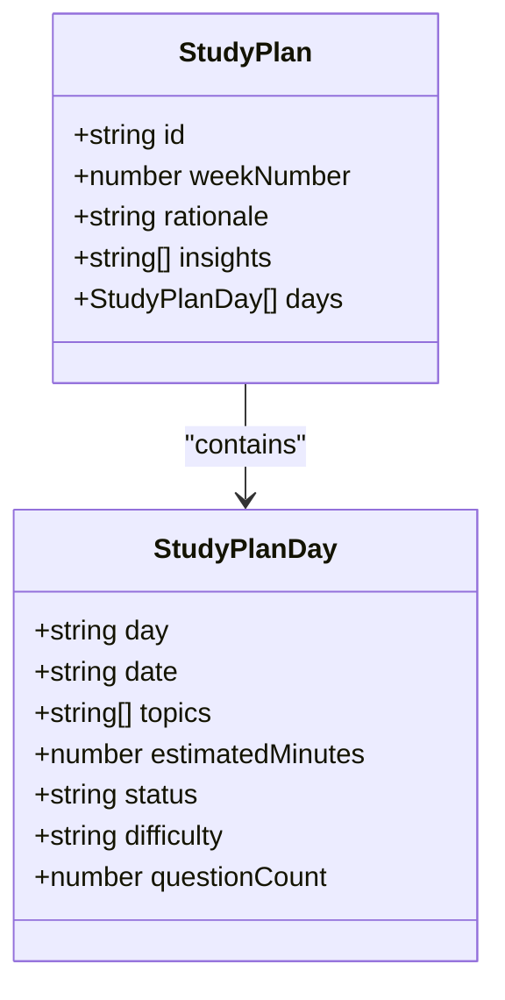
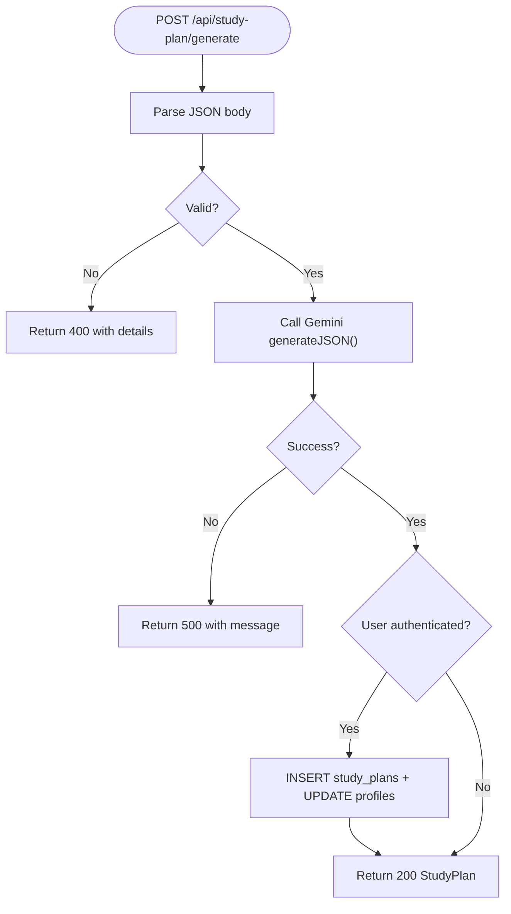
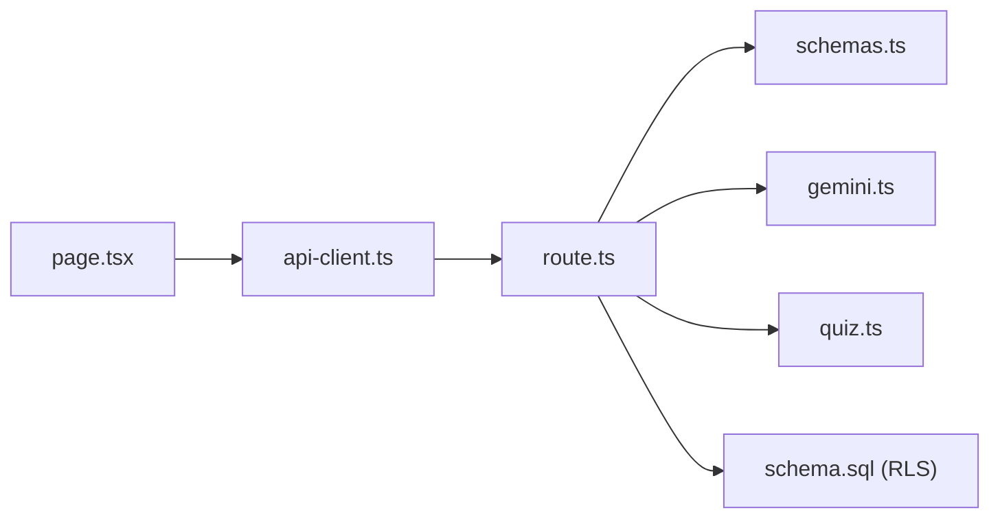

# API Endpoints

<cite>
**Referenced Files in This Document**
- [route.ts](file://src/app/api/study-plan/generate/route.ts)
- [schemas.ts](file://src/lib/validations/schemas.ts)
- [gemini.ts](file://src/lib/ai/gemini.ts)
- [quiz.ts](file://src/types/quiz.ts)
- [schema.sql](file://supabase/schema.sql)
- [api-client.ts](file://src/lib/api-client.ts)
- [page.tsx](file://src/app/study-plan/page.tsx)
</cite>

## Table of Contents
1. [Introduction](#introduction)
2. [Project Structure](#project-structure)
3. [Core Components](#core-components)
4. [Architecture Overview](#architecture-overview)
5. [Detailed Component Analysis](#detailed-component-analysis)
6. [Dependency Analysis](#dependency-analysis)
7. [Performance Considerations](#performance-considerations)
8. [Troubleshooting Guide](#troubleshooting-guide)
9. [Conclusion](#conclusion)

## Introduction
This document provides API documentation for the study plan generation endpoint that creates personalized 7-day MDCAT study schedules. It covers HTTP methods, request parameters, response schemas, authentication and authorization behavior, error handling patterns, client usage examples, rate limiting considerations, and caching strategies.

## Project Structure
The study plan generation feature is implemented as a Next.js App Router API route with server-side validation, AI-driven content generation, and optional persistence to Supabase. The frontend invokes the API via a typed client helper.

**Diagram sources**
- [route.ts:8-122](file://src/app/api/study-plan/generate/route.ts#L8-L122)
- [schemas.ts:42-45](file://src/lib/validations/schemas.ts#L42-L45)
- [gemini.ts:45-59](file://src/lib/ai/gemini.ts#L45-L59)
- [schema.sql:100-111](file://supabase/schema.sql#L100-L111)

**Section sources**
- [route.ts:1-122](file://src/app/api/study-plan/generate/route.ts#L1-L122)
- [schemas.ts:42-45](file://src/lib/validations/schemas.ts#L42-L45)
- [gemini.ts:1-61](file://src/lib/ai/gemini.ts#L1-L61)
- [schema.sql:100-111](file://supabase/schema.sql#L100-L111)

## Core Components
- API Route: POST /api/study-plan/generate
  - Validates input using a Zod schema.
  - Builds an AI prompt with target exam date and weak topics (or defaults).
  - Calls Gemini to generate a structured JSON study plan.
  - Persists the plan to Supabase if the user is authenticated; updates profile target exam date.
  - Returns the generated StudyPlan object.

- Validation Schema: StudyPlanGenerateSchema
  - Requires targetExamDate in YYYY-MM-DD format.
  - Optional weakTopics array of strings.

- AI Service: generateJSON
  - Uses Google Generative AI in JSON mode to return typed objects.
  - Throws errors when API key is missing or parsing fails.

- Data Model: StudyPlan and StudyPlanDay
  - Defines weekNumber, rationale, insights, and days array with daily schedule fields.

- Database Schema: study_plans table
  - Stores id, user_id, target_exam_date, week_number, and plan_data JSONB.

- Client Helper: generateStudyPlan
  - Typed fetch wrapper to call the API and handle non-OK responses.

**Section sources**
- [route.ts:8-122](file://src/app/api/study-plan/generate/route.ts#L8-L122)
- [schemas.ts:42-45](file://src/lib/validations/schemas.ts#L42-L45)
- [gemini.ts:45-59](file://src/lib/ai/gemini.ts#L45-L59)
- [quiz.ts:60-76](file://src/types/quiz.ts#L60-L76)
- [schema.sql:100-111](file://supabase/schema.sql#L100-L111)
- [api-client.ts:119-132](file://src/lib/api-client.ts#L119-L132)

## Architecture Overview
The endpoint orchestrates validation, AI generation, and optional database writes. Authentication is checked at runtime to decide whether to persist the plan and update the user’s target exam date.

**Diagram sources**
- [route.ts:8-122](file://src/app/api/study-plan/generate/route.ts#L8-L122)
- [schemas.ts:42-45](file://src/lib/validations/schemas.ts#L42-L45)
- [gemini.ts:45-59](file://src/lib/ai/gemini.ts#L45-L59)
- [schema.sql:100-111](file://supabase/schema.sql#L100-L111)

## Detailed Component Analysis

### Endpoint: POST /api/study-plan/generate
- Purpose: Generate a personalized 7-day study plan based on target exam date and optional weak topics.
- Authentication:
  - The route checks for an authenticated user to persist data. If no user session exists, it still returns a plan but does not write to the database.
  - Authorization for reading/writing study plans is enforced by Row Level Security policies on the study_plans table.
- Request:
  - Method: POST
  - Content-Type: application/json
  - Body schema: See Request Parameters below.
- Response:
  - Success: 200 OK with StudyPlan object.
  - Validation failure: 400 Bad Request with error and details.
  - Server error: 500 Internal Server Error with message.

#### Request Parameters
- targetExamDate: string, required, format YYYY-MM-DD.
- weakTopics: string[], optional. If omitted or empty, default focus topics are used internally.

#### Response Schema
- StudyPlan
  - id: string
  - weekNumber: number
  - rationale: string
  - insights: string[]
  - days: StudyPlanDay[]
- StudyPlanDay
  - day: string (e.g., "Day 1")
  - date: string (YYYY-MM-DD)
  - topics: string[]
  - estimatedMinutes: number
  - status: "today" | "upcoming" | "completed"
  - difficulty: "Easy" | "Medium" | "Hard" | "Mixed"
  - questionCount: number

**Diagram sources**
- [quiz.ts:60-76](file://src/types/quiz.ts#L60-L76)

**Section sources**
- [route.ts:8-122](file://src/app/api/study-plan/generate/route.ts#L8-L122)
- [schemas.ts:42-45](file://src/lib/validations/schemas.ts#L42-L45)
- [quiz.ts:60-76](file://src/types/quiz.ts#L60-L76)
- [schema.sql:153-229](file://supabase/schema.sql#L153-L229)

### Authentication and Authorization
- Authentication check:
  - The route uses a Supabase client to get the current user. If present, it persists the plan and updates the user’s target exam date.
- Authorization:
  - Row Level Security policies ensure users can only access their own study_plans records.

**Section sources**
- [route.ts:94-112](file://src/app/api/study-plan/generate/route.ts#L94-L112)
- [schema.sql:153-229](file://supabase/schema.sql#L153-L229)

### Error Handling Patterns
- Validation error:
  - 400 Bad Request with { error: "Invalid study plan request", details: [...] }.
- AI service error:
  - Missing API key or parse failures propagate as exceptions and result in 500 Internal Server Error with a message field.
- Database write error:
  - Any exception during Supabase operations results in 500 Internal Server Error.

**Diagram sources**
- [route.ts:8-122](file://src/app/api/study-plan/generate/route.ts#L8-L122)
- [gemini.ts:45-59](file://src/lib/ai/gemini.ts#L45-L59)

**Section sources**
- [route.ts:13-18](file://src/app/api/study-plan/generate/route.ts#L13-L18)
- [route.ts:115-121](file://src/app/api/study-plan/generate/route.ts#L115-L121)
- [gemini.ts:45-59](file://src/lib/ai/gemini.ts#L45-L59)

### Client Usage Examples
- Using the provided client helper:
  - Import generateStudyPlan from the API client.
  - Call with { targetExamDate, weakTopics? }.
  - Handle Promise rejection for network or server errors.
- Direct fetch example pattern:
  - POST to /api/study-plan/generate with JSON body.
  - Check res.ok; on failure, read error JSON.

Note: For exact implementation details, see the client helper and page usage.

**Section sources**
- [api-client.ts:119-132](file://src/lib/api-client.ts#L119-L132)
- [page.tsx:67-90](file://src/app/study-plan/page.tsx#L67-L90)

## Dependency Analysis
- API route depends on:
  - Validation schema for request parsing.
  - AI service for generating structured JSON.
  - Supabase client for auth and admin writes.
  - Type definitions for consistent response modeling.
- Frontend depends on:
  - API client helper for typed calls.
  - Local storage utilities for fallback plan generation.

**Diagram sources**
- [route.ts:1-122](file://src/app/api/study-plan/generate/route.ts#L1-L122)
- [schemas.ts:42-45](file://src/lib/validations/schemas.ts#L42-L45)
- [gemini.ts:45-59](file://src/lib/ai/gemini.ts#L45-L59)
- [quiz.ts:60-76](file://src/types/quiz.ts#L60-L76)
- [schema.sql:153-229](file://supabase/schema.sql#L153-L229)
- [api-client.ts:119-132](file://src/lib/api-client.ts#L119-L132)
- [page.tsx:67-90](file://src/app/study-plan/page.tsx#L67-L90)

**Section sources**
- [route.ts:1-122](file://src/app/api/study-plan/generate/route.ts#L1-L122)
- [api-client.ts:119-132](file://src/lib/api-client.ts#L119-L132)
- [page.tsx:67-90](file://src/app/study-plan/page.tsx#L67-L90)

## Performance Considerations
- Rate limiting:
  - Not implemented in the current codebase. Consider adding middleware or a gateway-level rate limiter to protect against excessive requests to the AI endpoint.
- Caching strategies:
  - Client-side caching: Store generated plans in localStorage to avoid repeated regeneration for the same target date and weak topics.
  - Server-side caching: Cache AI responses keyed by normalized inputs (targetExamDate, sorted weakTopics) to reduce Gemini calls.
  - Database writes: Batch or debounce updates to profiles if multiple plans are generated rapidly.
- AI cost and latency:
  - Minimize redundant prompts by deduplicating identical requests.
  - Use smaller models or shorter prompts where feasible to reduce latency and cost.

[No sources needed since this section provides general guidance]

## Troubleshooting Guide
- 400 Invalid study plan request:
  - Ensure targetExamDate matches YYYY-MM-DD.
  - Verify weakTopics is an array of strings if provided.
- 500 Internal Server Error:
  - Check GEMINI_API_KEY environment variable configuration.
  - Inspect logs for AI parsing failures or network errors.
  - Validate Supabase credentials and permissions for admin writes.
- Plan not persisted:
  - Confirm user is authenticated before calling the endpoint.
  - Verify Row Level Security policies allow inserts/updates for the user.

**Section sources**
- [route.ts:13-18](file://src/app/api/study-plan/generate/route.ts#L13-L18)
- [route.ts:115-121](file://src/app/api/study-plan/generate/route.ts#L115-L121)
- [gemini.ts:45-59](file://src/lib/ai/gemini.ts#L45-L59)
- [schema.sql:153-229](file://supabase/schema.sql#L153-L229)

## Conclusion
The study plan generation endpoint provides a robust, validated, and AI-powered way to create personalized weekly study schedules. It integrates authentication-aware persistence and follows clear error-handling patterns. For production deployments, consider adding rate limiting and caching to improve performance and control costs.