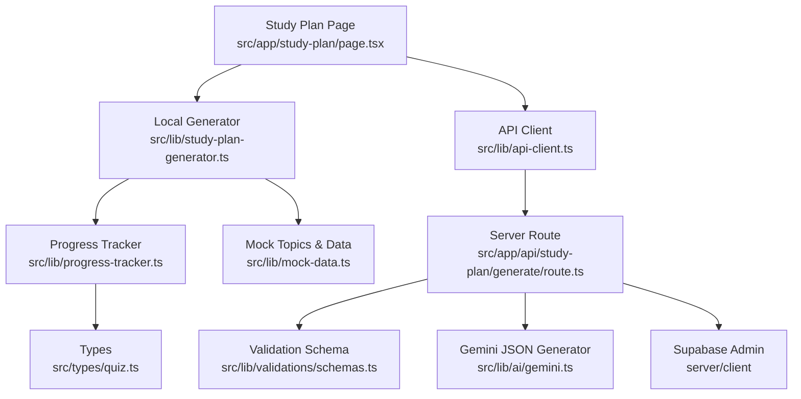
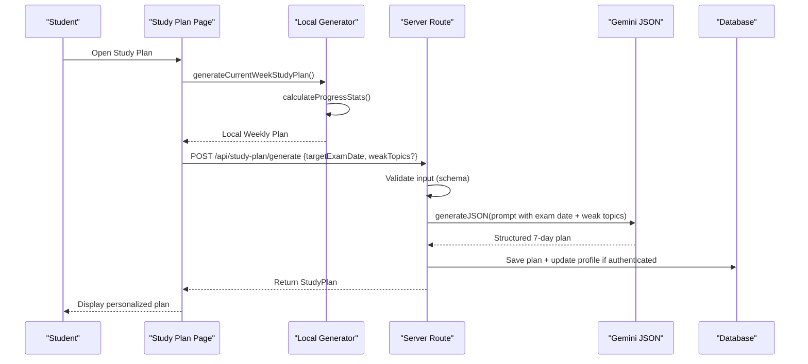
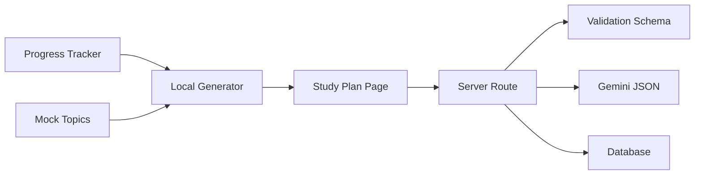
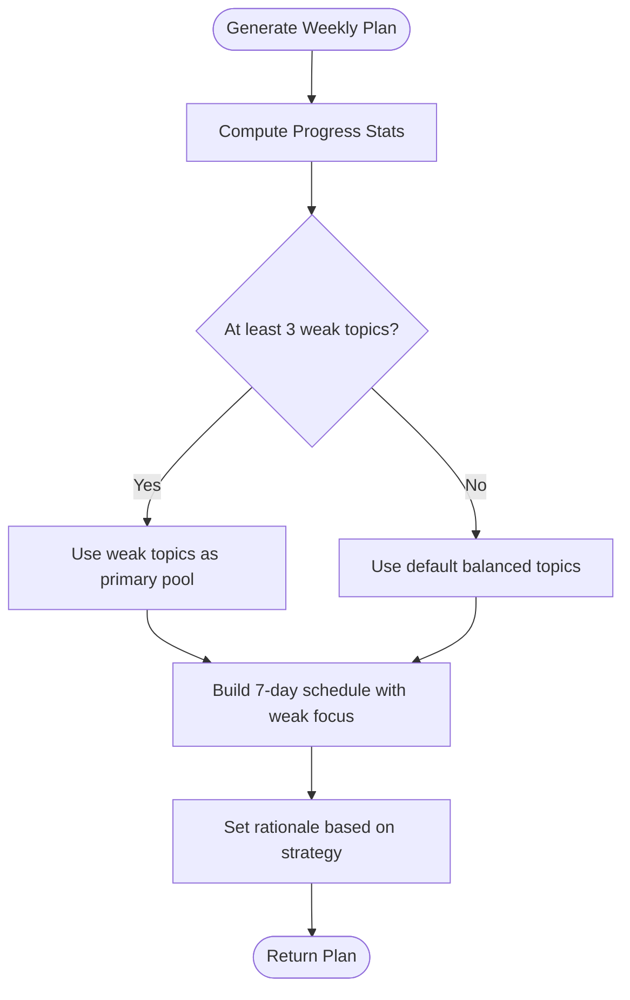

# Personalization Engine

<cite>
**Referenced Files in This Document**
- [study-plan-generator.ts](file://src/lib/study-plan-generator.ts)
- [progress-tracker.ts](file://src/lib/progress-tracker.ts)
- [route.ts](file://src/app/api/study-plan/generate/route.ts)
- [gemini.ts](file://src/lib/ai/gemini.ts)
- [schemas.ts](file://src/lib/validations/schemas.ts)
- [quiz.ts](file://src/types/quiz.ts)
- [mock-data.ts](file://src/lib/mock-data.ts)
- [chapter-questions.ts](file://src/lib/chapter-questions.ts)
- [api-client.ts](file://src/lib/api-client.ts)
- [page.tsx](file://src/app/study-plan/page.tsx)
</cite>

## Table of Contents
1. Introduction
2. Project Structure
3. Core Components
4. Architecture Overview
5. Detailed Component Analysis
6. Dependency Analysis
7. Performance Considerations
8. Troubleshooting Guide
9. Conclusion
10. Appendices

## Introduction
This document explains the personalization engine that customizes weekly study plans based on individual student performance data. It details how the system integrates with the progress tracker to identify weak topics, how it decides between a “weak topic focus” versus a “balanced coverage” approach, and how it generates clear rationales for each week’s selections. It also covers edge cases such as new users without history or uniform performance across topics, and provides scenario-based examples for different learner profiles.

## Project Structure
The personalization engine spans client-side logic (local generation), server-side API (AI-driven generation), and shared utilities (progress tracking, types, validations). The key files are:
- Local generator: builds a current-week plan using local history and mock topics
- Progress tracker: computes stats, weak topics, and chapter performance from quiz sessions
- Server route: validates input, calls AI to generate a 7-day plan, persists to database
- AI integration: structured JSON generation via Gemini
- Types and schemas: enforce contracts for sessions, plans, and inputs
- Mock data and question banks: provide topics and content for planning and practice



**Diagram sources**
- [page.tsx:40-95](file://src/app/study-plan/page.tsx#L40-L95)
- [study-plan-generator.ts:26-101](file://src/lib/study-plan-generator.ts#L26-L101)
- [api-client.ts:119-132](file://src/lib/api-client.ts#L119-L132)
- [route.ts:8-122](file://src/app/api/study-plan/generate/route.ts#L8-L122)
- [schemas.ts:42-47](file://src/lib/validations/schemas.ts#L42-L47)
- [gemini.ts:45-59](file://src/lib/ai/gemini.ts#L45-L59)
- [progress-tracker.ts:37-191](file://src/lib/progress-tracker.ts#L37-L191)
- [quiz.ts:37-76](file://src/types/quiz.ts#L37-L76)
- [mock-data.ts:15-31](file://src/lib/mock-data.ts#L15-L31)

**Section sources**
- [study-plan-generator.ts:26-101](file://src/lib/study-plan-generator.ts#L26-L101)
- [progress-tracker.ts:37-191](file://src/lib/progress-tracker.ts#L37-L191)
- [route.ts:8-122](file://src/app/api/study-plan/generate/route.ts#L8-L122)
- [schemas.ts:42-47](file://src/lib/validations/schemas.ts#L42-L47)
- [gemini.ts:45-59](file://src/lib/ai/gemini.ts#L45-L59)
- [quiz.ts:37-76](file://src/types/quiz.ts#L37-L76)
- [mock-data.ts:15-31](file://src/lib/mock-data.ts#L15-L31)
- [api-client.ts:119-132](file://src/lib/api-client.ts#L119-L132)
- [page.tsx:40-95](file://src/app/study-plan/page.tsx#L40-L95)

## Core Components
- Progress Tracker: Aggregates quiz sessions into dashboard stats, identifies weak topics by error rate, and ranks chapter performance.
- Local Study Plan Generator: Builds a current-week schedule using local storage history and mock topics; selects weak topics when sufficient data exists, otherwise uses a default balanced set.
- Server Study Plan API: Validates request, constructs an AI prompt with target exam date and weak topics, returns a structured 7-day plan, and persists to database when authenticated.
- AI Integration: Uses Gemini in JSON mode to produce a deterministic schema-compliant plan including rationale and insights.
- Types and Schemas: Define contracts for sessions, weak topics, study plans, and input validation for robustness.

Key responsibilities:
- Identify weak topics from session accuracy/error rates
- Decide focus strategy (weak vs balanced)
- Generate day-by-day topics, difficulty, time estimates, and question counts
- Provide rationale and actionable insights per week
- Persist plans and update user profile metadata

**Section sources**
- [progress-tracker.ts:37-191](file://src/lib/progress-tracker.ts#L37-L191)
- [study-plan-generator.ts:26-101](file://src/lib/study-plan-generator.ts#L26-L101)
- [route.ts:8-122](file://src/app/api/study-plan/generate/route.ts#L8-L122)
- [gemini.ts:45-59](file://src/lib/ai/gemini.ts#L45-L59)
- [quiz.ts:37-76](file://src/types/quiz.ts#L37-L76)
- [schemas.ts:42-47](file://src/lib/validations/schemas.ts#L42-L47)

## Architecture Overview
The personalization engine operates through two complementary paths:
- Client-side path: Immediate plan generation using local history and defaults
- Server-side path: AI-enhanced plan generation with explicit target exam date and optional weak topics



**Diagram sources**
- [page.tsx:40-95](file://src/app/study-plan/page.tsx#L40-L95)
- [study-plan-generator.ts:26-101](file://src/lib/study-plan-generator.ts#L26-L101)
- [route.ts:8-122](file://src/app/api/study-plan/generate/route.ts#L8-L122)
- [gemini.ts:45-59](file://src/lib/ai/gemini.ts#L45-L59)

## Detailed Component Analysis

### Progress Tracker: Weak Topic Identification
- Aggregates all quiz sessions to compute total questions, weekly volume, overall accuracy, and streak
- Groups performance by topic, computing error rates and ranking weak topics by highest error rate
- Produces chapter performance metrics and best/worst topics for context
- Handles empty histories gracefully by returning baseline stats and no weak topics

Decision logic highlights:
- Weak topics are derived from error rate per topic
- If no sessions exist, returns clean initial baseline and empty weak topics list

Performance considerations:
- O(n) over sessions to aggregate totals and errors
- Sorting weak topics is O(m log m) where m is number of unique topics

Edge case handling:
- New users with no sessions receive zeroed stats and no weak topics
- Sessions without explicit topic default to a general category

**Section sources**
- [progress-tracker.ts:37-191](file://src/lib/progress-tracker.ts#L37-L191)

### Local Study Plan Generator: Current Week Planning
- Computes stats via progress tracker to extract weak topics
- Selects a topic pool:
  - If at least three weak topics exist, use them
  - Otherwise, fall back to a curated default set covering core Human Physiology and Modern Topics
- Generates seven days (Monday–Sunday) with:
  - One or two distinct topics per day
  - Estimated minutes increasing cyclically
  - Difficulty cycling across Easy/Medium/Hard
  - Question count scaling slightly per day
- Produces rationale text reflecting whether weak areas are prioritized or foundation building is emphasized
- Persists generated plan locally for immediate availability

Decision logic highlights:
- Threshold for switching to weak-topic focus is three or more identified weak topics
- Rationale adapts to reflect strategy used

**Section sources**
- [study-plan-generator.ts:26-101](file://src/lib/study-plan-generator.ts#L26-L101)
- [mock-data.ts:15-31](file://src/lib/mock-data.ts#L15-L31)

### Server Study Plan API: AI-Driven Personalization
- Validates input using schema requiring target exam date and optional weak topics
- Constructs a detailed prompt including:
  - Target exam date
  - Identified weak topics (or a default set if none provided)
  - Requirements for exactly seven daily entries with specific fields
  - Expectation for rationale and insights
- Calls Gemini in JSON mode to return a structured plan
- Creates a unique plan ID and maps AI output to StudyPlan type
- Persists plan to database and updates user profile target exam date when authenticated
- Returns standardized response or error

Decision logic highlights:
- If weak topics are absent, defaults to a high-yield set for MDCAT preparation
- AI prompt explicitly instructs balancing weak topic improvement with core chapter pacing

Error handling:
- Input validation failures return 400 with details
- Runtime errors return 500 with message

**Section sources**
- [route.ts:8-122](file://src/app/api/study-plan/generate/route.ts#L8-L122)
- [schemas.ts:42-47](file://src/lib/validations/schemas.ts#L42-L47)
- [gemini.ts:45-59](file://src/lib/ai/gemini.ts#L45-L59)

### AI Integration: Structured Plan Generation
- Configures Gemini model with JSON mode to ensure schema compliance
- Parses raw response, stripping markdown fences if present
- Throws descriptive errors if API key missing or embedding fails

Reliability notes:
- JSON parsing fallback improves resilience against varied LLM formatting
- Environment configuration required for API access

**Section sources**
- [gemini.ts:1-61](file://src/lib/ai/gemini.ts#L1-L61)

### Types and Schemas: Contracts and Validation
- Defines interfaces for QuizSession, WeakTopic, StudyPlan, DashboardStats, RecentSession, UserProfile
- Enforces input shape for study plan generation:
  - targetExamDate must be YYYY-MM-DD
  - weakTopics is an optional array of strings

Benefits:
- Strong typing reduces runtime errors
- Clear contracts improve maintainability and testability

**Section sources**
- [quiz.ts:37-76](file://src/types/quiz.ts#L37-L76)
- [schemas.ts:42-47](file://src/lib/validations/schemas.ts#L42-L47)

### Data Models and Relationships
```mermaid
classDiagram
class QuizSession {
+string id
+string topic
+number chapterNum
+string difficulty
+number numQuestions
+number score
+number totalQuestions
+string status
+string createdAt
+number timeTakenMs
+Question[] questions
+UserAnswer[] answers
}
class WeakTopic {
+string topic
+number chapterNum
+number weaknessScore
+number errorCount
+number attemptCount
}
class StudyPlan {
+string id
+number weekNumber
+StudyPlanDay[] days
+string rationale
+string[] insights
}
class StudyPlanDay {
+string day
+string date
+string[] topics
+number estimatedMinutes
+string status
+string difficulty
+number questionCount
}
class DashboardStats {
+number totalQuestions
+number questionsThisWeek
+number accuracyRate
+number sessionsCompleted
+number studyStreak
}
class RecentSession {
+string id
+string topic
+number score
+number totalQuestions
+string date
}
class UserProfile {
+string id
+string fullName
+string email
+string memberSince
+number totalQuestions
+number totalSessions
+number overallAccuracy
+string bestTopic
+string worstTopic
+number longestStreak
+{chapter : string, accuracy : number}[] chapterPerformance
}
QuizSession --> WeakTopic : "used to derive"
StudyPlan --> StudyPlanDay : "contains"
DashboardStats --> RecentSession : "includes recent"
UserProfile --> DashboardStats : "reflects"
```

**Diagram sources**
- [quiz.ts:37-76](file://src/types/quiz.ts#L37-L76)

## Dependency Analysis
- Local generator depends on progress tracker for stats and weak topics, and on mock topics for fallback selection
- Server route depends on validation schema, AI module, and Supabase admin for persistence
- UI page orchestrates both local and server flows, falling back to local generation if server call fails
- Types and schemas underpin consistency across modules



**Diagram sources**
- [study-plan-generator.ts:26-101](file://src/lib/study-plan-generator.ts#L26-L101)
- [progress-tracker.ts:37-191](file://src/lib/progress-tracker.ts#L37-L191)
- [route.ts:8-122](file://src/app/api/study-plan/generate/route.ts#L8-L122)
- [schemas.ts:42-47](file://src/lib/validations/schemas.ts#L42-L47)
- [gemini.ts:45-59](file://src/lib/ai/gemini.ts#L45-L59)
- [page.tsx:40-95](file://src/app/study-plan/page.tsx#L40-L95)

**Section sources**
- [study-plan-generator.ts:26-101](file://src/lib/study-plan-generator.ts#L26-L101)
- [progress-tracker.ts:37-191](file://src/lib/progress-tracker.ts#L37-L191)
- [route.ts:8-122](file://src/app/api/study-plan/generate/route.ts#L8-L122)
- [schemas.ts:42-47](file://src/lib/validations/schemas.ts#L42-L47)
- [gemini.ts:45-59](file://src/lib/ai/gemini.ts#L45-L59)
- [page.tsx:40-95](file://src/app/study-plan/page.tsx#L40-L95)

## Performance Considerations
- Local generation is lightweight and fast, suitable for immediate feedback
- Server-side AI generation introduces latency; consider caching or debouncing regeneration requests
- Progress tracker aggregates sessions in linear time; large session histories may benefit from pagination or precomputation
- Database writes occur only when authenticated; avoid unnecessary writes by batching or throttling

[No sources needed since this section provides general guidance]

## Troubleshooting Guide
Common issues and resolutions:
- Missing API key: Ensure GEMINI_API_KEY is configured; otherwise, JSON generation will fail
- Invalid input: Check that targetExamDate matches YYYY-MM-DD format; weakTopics should be an array of strings
- No weak topics detected: If no sessions exist or performance is uniform, the system falls back to balanced coverage; add more sessions to enable weak-topic focus
- Authentication failures: Database persistence requires an authenticated user; plan generation still works without auth but won’t save to DB

Operational checks:
- Verify schema validation errors returned by the server route
- Inspect console logs for localStorage read/write errors in local generator
- Confirm Supabase admin permissions for writing study_plans and updating profiles

**Section sources**
- [route.ts:8-122](file://src/app/api/study-plan/generate/route.ts#L8-L122)
- [gemini.ts:1-61](file://src/lib/ai/gemini.ts#L1-L61)
- [schemas.ts:42-47](file://src/lib/validations/schemas.ts#L42-L47)
- [study-plan-generator.ts:26-101](file://src/lib/study-plan-generator.ts#L26-L101)

## Conclusion
The personalization engine combines local analytics and AI-driven scheduling to deliver tailored weekly study plans. It identifies weak topics from quiz performance, switches between focused and balanced strategies based on available data, and produces clear rationales and insights. Edge cases like new users or uniform performance are handled gracefully with sensible defaults. The dual-path architecture ensures responsiveness while leveraging AI for richer personalization when needed.

[No sources needed since this section summarizes without analyzing specific files]

## Appendices

### Decision Logic Flow: Weak Focus vs Balanced Coverage


**Diagram sources**
- [study-plan-generator.ts:26-101](file://src/lib/study-plan-generator.ts#L26-L101)
- [progress-tracker.ts:37-191](file://src/lib/progress-tracker.ts#L37-L191)

### Scenario Examples
- Strong weak areas: When multiple topics show high error rates, the local generator prioritizes those topics in the weekly schedule and the rationale emphasizes targeted improvement.
- Foundational review: With no or minimal history, the system uses a balanced set of core chapters to build a strong foundation and sets a rationale explaining the foundational approach.
- Exam-critical timelines: The server route accepts a target exam date and instructs the AI to pace weak topic improvement while maintaining core chapter review, producing a rationale aligned with the countdown.

Implementation references:
- Weak topic threshold and fallback behavior: [study-plan-generator.ts:26-101](file://src/lib/study-plan-generator.ts#L26-L101)
- AI prompt includes target exam date and weak topics: [route.ts:26-64](file://src/app/api/study-plan/generate/route.ts#L26-L64)
- Rationale generation reflects strategy: [study-plan-generator.ts:81-83](file://src/lib/study-plan-generator.ts#L81-L83)

**Section sources**
- [study-plan-generator.ts:26-101](file://src/lib/study-plan-generator.ts#L26-L101)
- [route.ts:26-64](file://src/app/api/study-plan/generate/route.ts#L26-L64)

### API Contract for Study Plan Generation
- Endpoint: POST /api/study-plan/generate
- Request body:
  - targetExamDate: string in YYYY-MM-DD format
  - weakTopics: optional array of strings
- Response: StudyPlan object with weekNumber, rationale, insights, and days array

Validation and persistence:
- Input validated via schema; invalid requests return 400
- Authenticated users have plans saved to database and profile updated

**Section sources**
- [schemas.ts:42-47](file://src/lib/validations/schemas.ts#L42-L47)
- [route.ts:8-122](file://src/app/api/study-plan/generate/route.ts#L8-L122)

### Data Sources and Content
- Topics and categories: Defined in mock data for fallback and planning
- Chapter questions: Provide content for practice sessions tied to topics
- Session history: Stored locally and used to compute progress and weak topics

**Section sources**
- [mock-data.ts:15-31](file://src/lib/mock-data.ts#L15-L31)
- [chapter-questions.ts:1-800](file://src/lib/chapter-questions.ts#L1-L800)
- [progress-tracker.ts:12-35](file://src/lib/progress-tracker.ts#L12-L35)