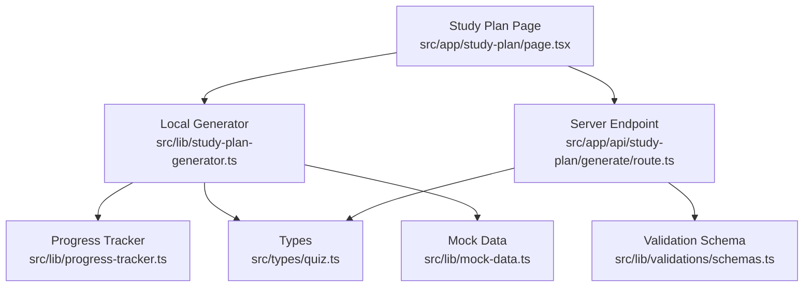
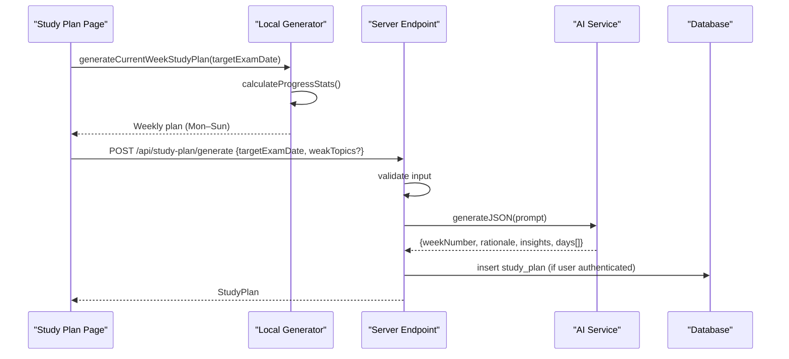
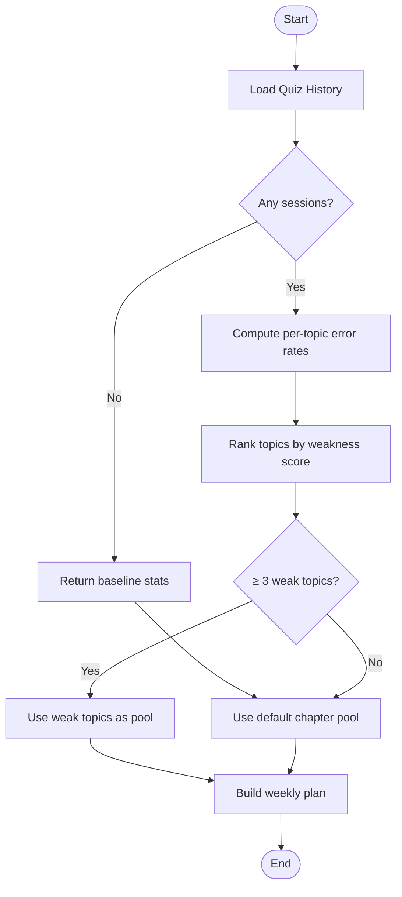
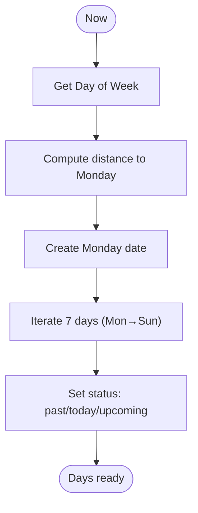
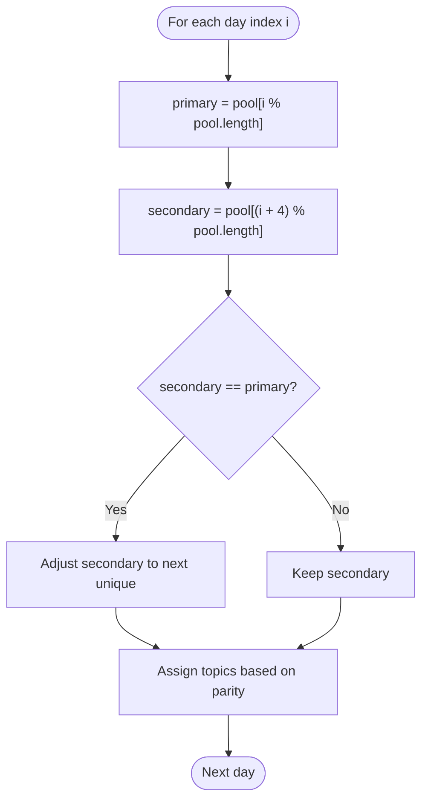
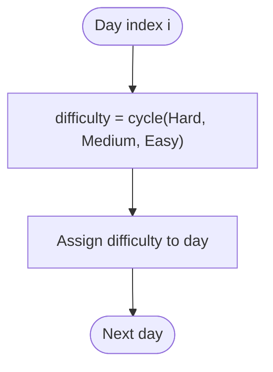
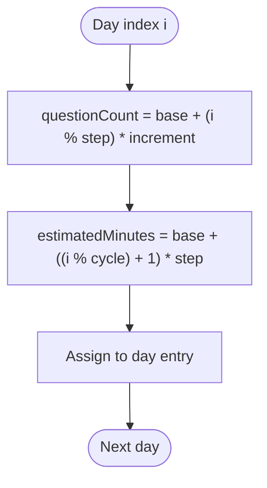
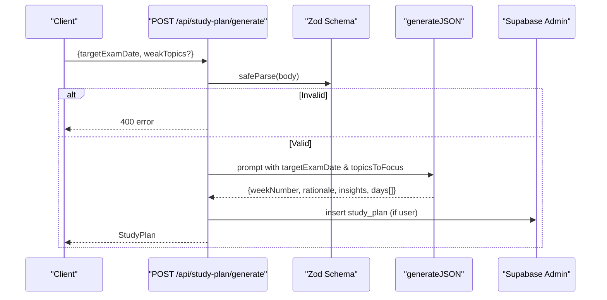
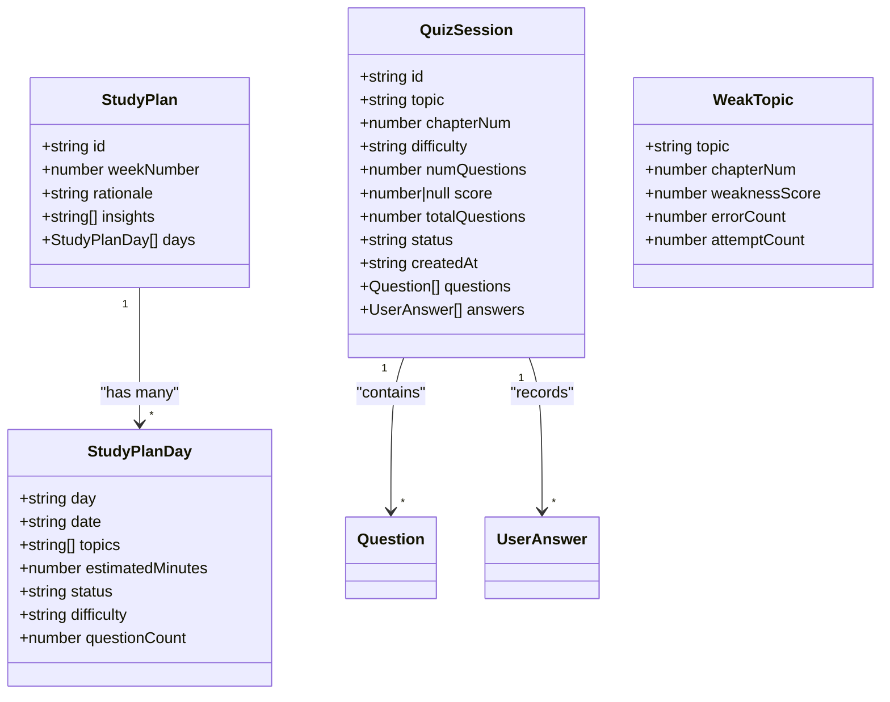
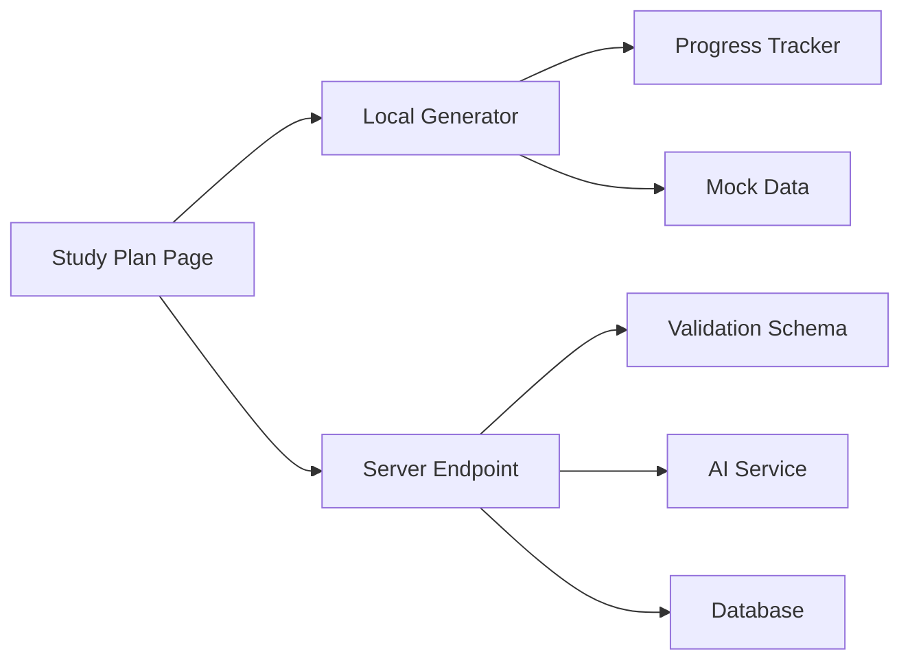

# Scheduling Algorithms

<cite>
**Referenced Files in This Document**
- [study-plan-generator.ts](file://src/lib/study-plan-generator.ts)
- [progress-tracker.ts](file://src/lib/progress-tracker.ts)
- [route.ts](file://src/app/api/study-plan/generate/route.ts)
- [quiz.ts](file://src/types/quiz.ts)
- [mock-data.ts](file://src/lib/mock-data.ts)
- [schemas.ts](file://src/lib/validations/schemas.ts)
- [page.tsx](file://src/app/study-plan/page.tsx)
</cite>

## Table of Contents
1. [Introduction](#introduction)
2. [Project Structure](#project-structure)
3. [Core Components](#core-components)
4. [Architecture Overview](#architecture-overview)
5. [Detailed Component Analysis](#detailed-component-analysis)
6. [Dependency Analysis](#dependency-analysis)
7. [Performance Considerations](#performance-considerations)
8. [Troubleshooting Guide](#troubleshooting-guide)
9. [Conclusion](#conclusion)

## Introduction
This document explains the study plan scheduling algorithms that generate personalized weekly schedules for MDCAT preparation. It covers how topic prioritization is derived from weak areas identified via progress tracking, the fallback mechanism when insufficient data exists, date calculation logic for Monday-to-Sunday week boundaries, topic distribution across days, difficulty balancing across Easy/Medium/Hard sessions, question count allocation strategy, and estimated time calculations per day. Two generation paths are supported: a deterministic local generator and an AI-assisted server endpoint.

## Project Structure
The scheduling system spans client-side logic, server API, types, and mock data:
- Client-side generator computes a current-week plan using local progress and deterministic rules.
- Server API generates a 7-day plan via an AI prompt with validation and optional database persistence.
- Progress tracker aggregates quiz history to identify weak topics and compute stats.
- Types define the shared schema for plans, days, and session data.
- Mock data provides default chapters and sample structures.
- Validation schemas enforce request formats for the API.

**Diagram sources**
- [page.tsx:40-83](file://src/app/study-plan/page.tsx#L40-L83)
- [study-plan-generator.ts:26-101](file://src/lib/study-plan-generator.ts#L26-L101)
- [route.ts:8-122](file://src/app/api/study-plan/generate/route.ts#L8-L122)
- [progress-tracker.ts:37-191](file://src/lib/progress-tracker.ts#L37-L191)
- [schemas.ts:42-45](file://src/lib/validations/schemas.ts#L42-L45)
- [quiz.ts:60-76](file://src/types/quiz.ts#L60-L76)
- [mock-data.ts:15-31](file://src/lib/mock-data.ts#L15-L31)

**Section sources**
- [study-plan-generator.ts:26-101](file://src/lib/study-plan-generator.ts#L26-L101)
- [route.ts:8-122](file://src/app/api/study-plan/generate/route.ts#L8-L122)
- [progress-tracker.ts:37-191](file://src/lib/progress-tracker.ts#L37-L191)
- [schemas.ts:42-45](file://src/lib/validations/schemas.ts#L42-L45)
- [quiz.ts:60-76](file://src/types/quiz.ts#L60-L76)
- [mock-data.ts:15-31](file://src/lib/mock-data.ts#L15-L31)
- [page.tsx:40-83](file://src/app/study-plan/page.tsx#L40-L83)

## Core Components
- Local weekly planner: Computes a Monday-to-Sunday schedule using weak topics or default chapters, assigns difficulty, question counts, and estimated minutes per day.
- Progress tracker: Aggregates quiz sessions to compute accuracy, streaks, and weak topics by error rate.
- Server API: Validates inputs, builds an AI prompt focused on target exam date and weak topics, returns a structured 7-day plan, and persists it for authenticated users.
- Types and schemas: Define StudyPlan, StudyPlanDay, QuizSession, WeakTopic, and input validation constraints.

Key responsibilities:
- Topic prioritization: Based on weakest topics (highest error rates), with fallback to core MDCAT chapters.
- Date logic: Derive Monday start and iterate through Sunday; mark today/past/upcoming.
- Difficulty balancing: Alternate Hard/Medium/Easy across days to modulate intensity.
- Question allocation: Incremental question counts per day based on index modulo.
- Time estimation: Linear progression of estimated minutes across the week.

**Section sources**
- [study-plan-generator.ts:26-101](file://src/lib/study-plan-generator.ts#L26-L101)
- [progress-tracker.ts:37-191](file://src/lib/progress-tracker.ts#L37-L191)
- [route.ts:8-122](file://src/app/api/study-plan/generate/route.ts#L8-L122)
- [quiz.ts:60-76](file://src/types/quiz.ts#L60-L76)
- [schemas.ts:42-45](file://src/lib/validations/schemas.ts#L42-L45)

## Architecture Overview
Two complementary generation flows:

1) Deterministic local generator
- Reads local quiz history, computes weak topics, selects topic pool, calculates Monday-to-Sunday dates, distributes topics, sets difficulty, question counts, and estimated minutes, then stores locally.

2) AI-assisted server endpoint
- Validates request, constructs a prompt with target exam date and weak topics, calls AI to return a 7-day plan, and optionally saves to database.

**Diagram sources**
- [study-plan-generator.ts:26-101](file://src/lib/study-plan-generator.ts#L26-L101)
- [route.ts:8-122](file://src/app/api/study-plan/generate/route.ts#L8-L122)
- [page.tsx:40-83](file://src/app/study-plan/page.tsx#L40-L83)

## Detailed Component Analysis

### Topic Prioritization and Fallback Mechanism
- Weak topics identification: The progress tracker aggregates all quiz sessions, computes per-topic error rates, and sorts them to produce a ranked list of weak topics.
- Pool selection: If at least three weak topics exist, they form the topic pool; otherwise, a default set of core MDCAT chapters is used.
- Rationale text adapts to whether weak topics were found.

**Diagram sources**
- [progress-tracker.ts:37-191](file://src/lib/progress-tracker.ts#L37-L191)
- [study-plan-generator.ts:26-41](file://src/lib/study-plan-generator.ts#L26-L41)

**Section sources**
- [progress-tracker.ts:37-191](file://src/lib/progress-tracker.ts#L37-L191)
- [study-plan-generator.ts:26-41](file://src/lib/study-plan-generator.ts#L26-L41)

### Date Calculation Logic (Monday-to-Sunday)
- Current day-of-week is computed; distance to Monday is calculated so that Monday becomes the first day of the week.
- A Monday date is created and iterated to build seven entries (Monday through Sunday).
- Each day’s label includes a short formatted date string; status is set to “completed” for past days, “today” for the current day, and “upcoming” for future days.

**Diagram sources**
- [study-plan-generator.ts:43-79](file://src/lib/study-plan-generator.ts#L43-L79)

**Section sources**
- [study-plan-generator.ts:43-79](file://src/lib/study-plan-generator.ts#L43-L79)

### Topic Distribution Across Days
- Primary topic selection cycles through the topic pool by index modulo pool length.
- Secondary topic selection uses a different offset to ensure variety; duplicates are removed.
- Odd/even day logic determines whether one or two topics are assigned per day.

**Diagram sources**
- [study-plan-generator.ts:61-69](file://src/lib/study-plan-generator.ts#L61-L69)

**Section sources**
- [study-plan-generator.ts:61-69](file://src/lib/study-plan-generator.ts#L61-L69)

### Difficulty Balancing Algorithm
- Difficulty alternates across days using modulo operations to create a pattern of Hard, Medium, and Easy sessions.
- This maintains optimal learning intensity by varying cognitive load throughout the week.

**Diagram sources**
- [study-plan-generator.ts:76-76](file://src/lib/study-plan-generator.ts#L76-L76)

**Section sources**
- [study-plan-generator.ts:76-76](file://src/lib/study-plan-generator.ts#L76-L76)

### Question Count Allocation Strategy and Estimated Time
- Question count increases incrementally per day using a modulo-based formula to vary workload.
- Estimated minutes increase in steps across the week to reflect progressive practice volume.

**Diagram sources**
- [study-plan-generator.ts:74-78](file://src/lib/study-plan-generator.ts#L74-L78)

**Section sources**
- [study-plan-generator.ts:74-78](file://src/lib/study-plan-generator.ts#L74-L78)

### AI-Assisted Generation Flow
- Input validation ensures a valid target exam date and optional weak topics array.
- A prompt is constructed with the target exam date and selected focus topics (weak topics if available, else defaults).
- The AI returns a structured 7-day plan; the server wraps it into a StudyPlan object and persists it for authenticated users.

**Diagram sources**
- [route.ts:8-122](file://src/app/api/study-plan/generate/route.ts#L8-L122)
- [schemas.ts:42-45](file://src/lib/validations/schemas.ts#L42-L45)

**Section sources**
- [route.ts:8-122](file://src/app/api/study-plan/generate/route.ts#L8-L122)
- [schemas.ts:42-45](file://src/lib/validations/schemas.ts#L42-L45)

### Examples: Adapting to Specific Weak Topics vs Default Coverage
- With specific weak topics: The local generator uses the top weak topics (when ≥3) to drive daily topics; rationale highlights those areas.
- Without sufficient data: The generator falls back to a curated set of core MDCAT chapters to ensure balanced coverage.

Behavior mapping:
- Weak topics present: Topic pool equals weak topics; rationale references them explicitly.
- Insufficient data: Topic pool equals default chapters; rationale describes foundational coverage.

**Section sources**
- [study-plan-generator.ts:26-41](file://src/lib/study-plan-generator.ts#L26-L41)
- [study-plan-generator.ts:81-83](file://src/lib/study-plan-generator.ts#L81-L83)

### Data Models and Relationships

**Diagram sources**
- [quiz.ts:60-76](file://src/types/quiz.ts#L60-L76)
- [quiz.ts:37-50](file://src/types/quiz.ts#L37-L50)
- [quiz.ts:52-58](file://src/types/quiz.ts#L52-L58)

**Section sources**
- [quiz.ts:37-76](file://src/types/quiz.ts#L37-L76)

## Dependency Analysis
- Local generator depends on:
  - Progress tracker for weak topics and stats.
  - Mock data for default chapters when needed.
  - Types for consistent plan structure.
- Server endpoint depends on:
  - Validation schema for input integrity.
  - AI service for generating structured plans.
  - Database client for persistence when authenticated.
- UI page orchestrates both flows: loads stored plan or generates new one locally, and can regenerate via API.

**Diagram sources**
- [page.tsx:40-83](file://src/app/study-plan/page.tsx#L40-L83)
- [study-plan-generator.ts:26-101](file://src/lib/study-plan-generator.ts#L26-L101)
- [route.ts:8-122](file://src/app/api/study-plan/generate/route.ts#L8-L122)
- [progress-tracker.ts:37-191](file://src/lib/progress-tracker.ts#L37-L191)
- [schemas.ts:42-45](file://src/lib/validations/schemas.ts#L42-L45)

**Section sources**
- [page.tsx:40-83](file://src/app/study-plan/page.tsx#L40-L83)
- [study-plan-generator.ts:26-101](file://src/lib/study-plan-generator.ts#L26-L101)
- [route.ts:8-122](file://src/app/api/study-plan/generate/route.ts#L8-L122)
- [progress-tracker.ts:37-191](file://src/lib/progress-tracker.ts#L37-L191)
- [schemas.ts:42-45](file://src/lib/validations/schemas.ts#L42-L45)

## Performance Considerations
- Local generation is lightweight and runs in-memory; suitable for immediate feedback without network latency.
- AI-assisted generation introduces network overhead and depends on external service availability; caching or debouncing regeneration may reduce redundant calls.
- Progress aggregation scales linearly with number of sessions; consider pagination or indexing if session history grows significantly.

[No sources needed since this section provides general guidance]

## Troubleshooting Guide
- No sessions recorded: Progress tracker returns baseline stats; local generator falls back to default chapters. Ensure quiz sessions are saved to local history before expecting weak topics.
- Invalid API request: Validation errors return 400 with details; verify targetExamDate format and weakTopics array type.
- Storage issues: Local storage failures are caught and logged; check browser storage permissions and quotas.
- Authentication-dependent persistence: Database writes occur only for authenticated users; guest users will still receive plans but not persisted.

**Section sources**
- [progress-tracker.ts:12-35](file://src/lib/progress-tracker.ts#L12-L35)
- [route.ts:8-18](file://src/app/api/study-plan/generate/route.ts#L8-L18)
- [study-plan-generator.ts:7-24](file://src/lib/study-plan-generator.ts#L7-L24)

## Conclusion
The scheduling system combines deterministic local planning with AI-assisted generation to deliver personalized weekly study plans. Topic prioritization is driven by weak areas identified through progress tracking, with robust fallbacks ensuring balanced coverage. Date logic anchors weeks to Monday, distributing topics across days while alternating difficulty to maintain optimal learning intensity. Question counts and estimated minutes scale progressively to support sustained practice. Together, these components provide a flexible, adaptive scheduling engine tailored to individual learner needs.

[No sources needed since this section summarizes without analyzing specific files]