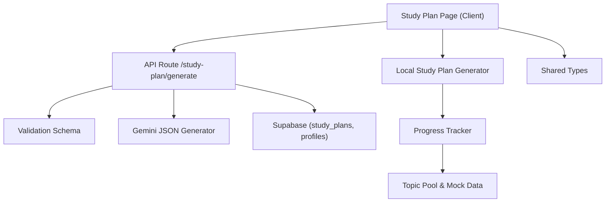
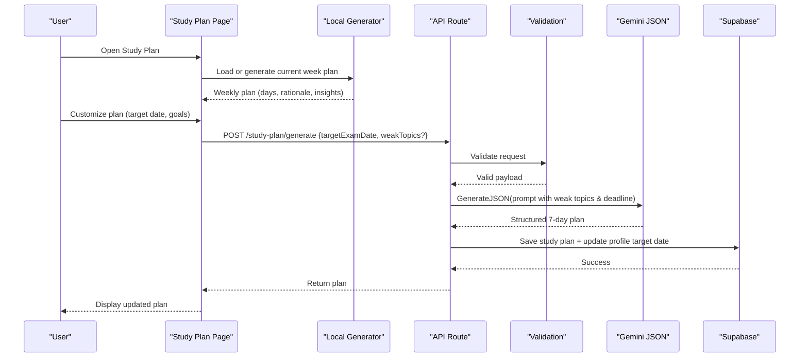
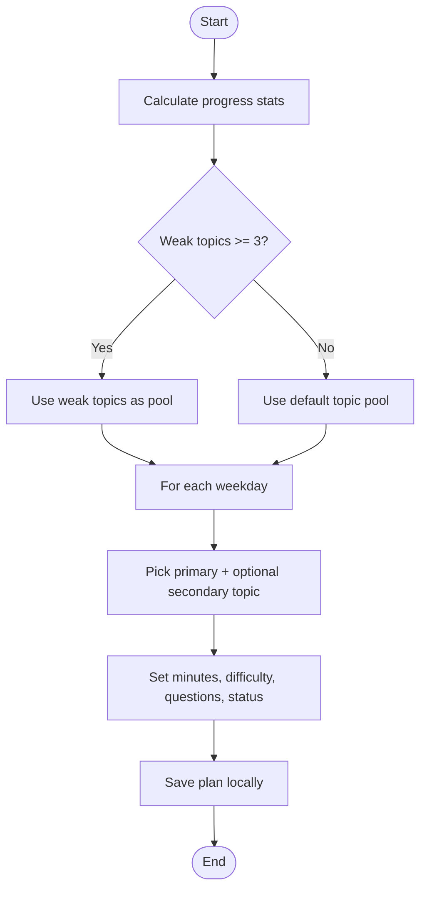
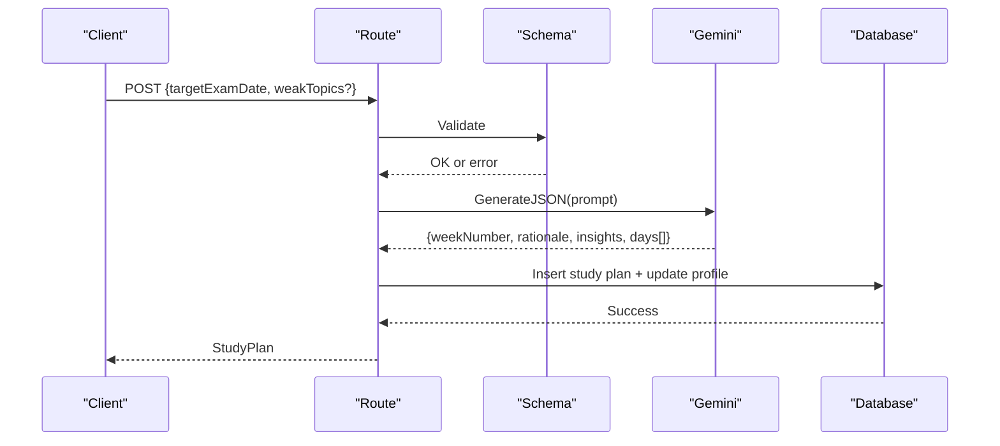
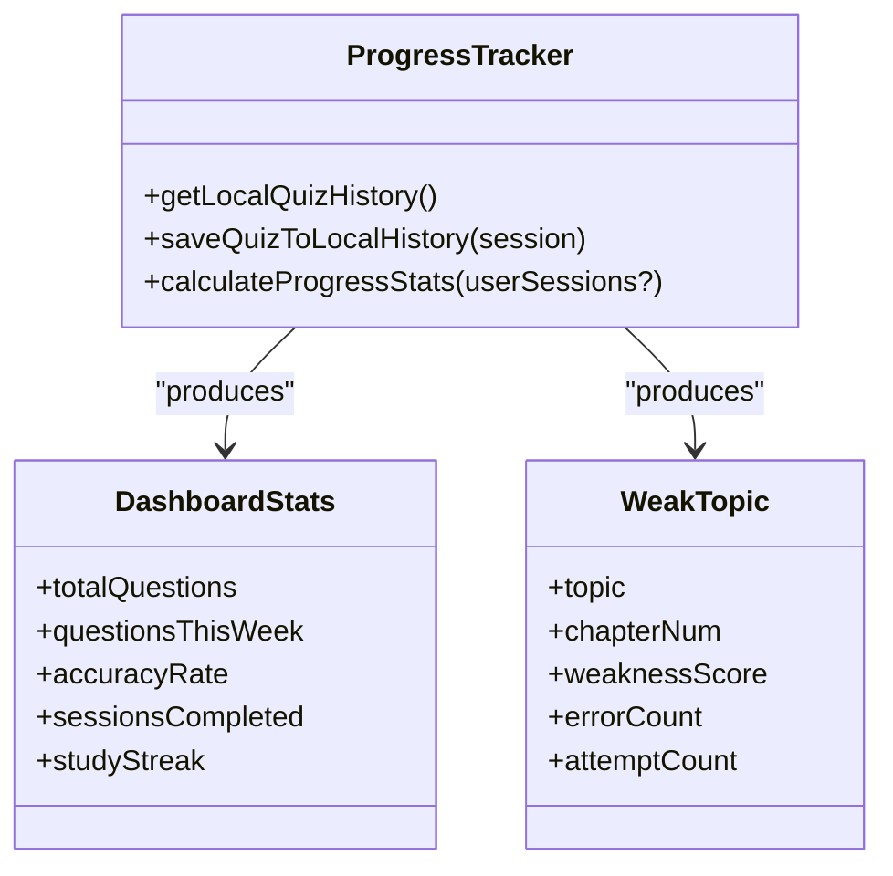
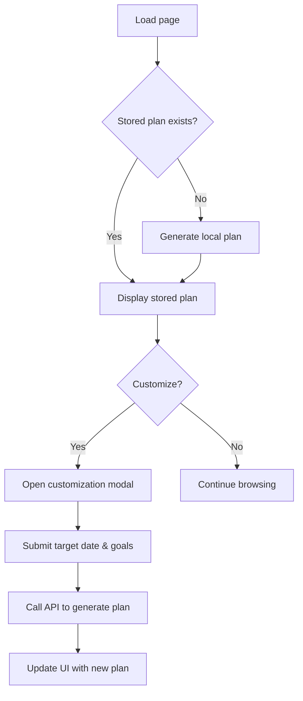
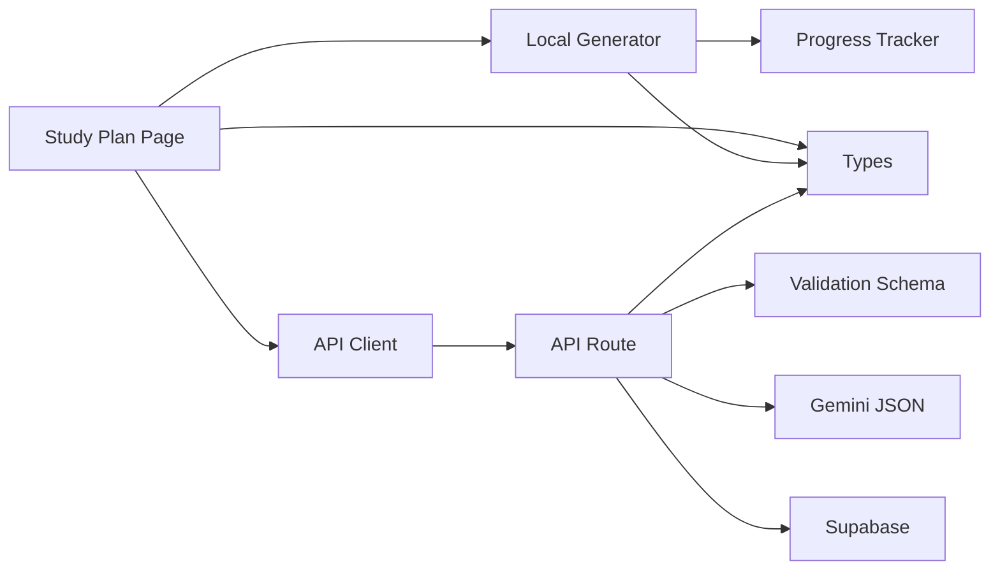

# Study Plan Generator

<cite>
**Referenced Files in This Document**
- [study-plan-generator.ts](file://src/lib/study-plan-generator.ts)
- [route.ts](file://src/app/api/study-plan/generate/route.ts)
- [progress-tracker.ts](file://src/lib/progress-tracker.ts)
- [page.tsx](file://src/app/study-plan/page.tsx)
- [api-client.ts](file://src/lib/api-client.ts)
- [quiz.ts](file://src/types/quiz.ts)
- [mock-data.ts](file://src/lib/mock-data.ts)
- [schemas.ts](file://src/lib/validations/schemas.ts)
- [gemini.ts](file://src/lib/ai/gemini.ts)
</cite>

## Table of Contents
1. [Introduction](#introduction)
2. [Project Structure](#project-structure)
3. [Core Components](#core-components)
4. [Architecture Overview](#architecture-overview)
5. [Detailed Component Analysis](#detailed-component-analysis)
6. [Dependency Analysis](#dependency-analysis)
7. [Performance Considerations](#performance-considerations)
8. [Troubleshooting Guide](#troubleshooting-guide)
9. [Conclusion](#conclusion)
10. [Appendices](#appendices)

## Introduction
This document explains MedAce-AI’s AI-powered study plan generator that creates personalized weekly schedules for MDCAT preparation. It prioritizes weak topics while maintaining balanced coverage across all subjects, adapts to progress tracking data and exam deadlines, and integrates with the progress tracker to automatically adjust priorities and difficulty levels. The user interface supports plan customization, progress monitoring, and manual adjustments. Examples are provided for different student profiles (remediation-focused, enrichment-focused, and exam-critical timelines), along with conflict resolution strategies for overlapping commitments or changing priorities.

## Project Structure
The study plan feature spans client-side UI, local generation logic, server-side API, validation schemas, AI integration, and progress analytics:

- Client UI: Displays weekly schedule, countdown, customization modal, and day-level focus cards.
- Local generator: Builds a current-week plan using progress stats and topic pools.
- Server API: Validates input, calls AI to generate a structured 7-day plan, persists it, and updates profile data.
- Progress tracker: Computes weak topics, accuracy, streaks, and chapter performance from quiz sessions.
- Types and mock data: Define shared interfaces and sample content for topics and plans.
- Validation schemas: Enforce request structure for study plan generation.
- AI integration: Generates JSON-structured plans via Gemini with strict schema constraints.

**Diagram sources**
- [page.tsx:30-95](file://src/app/study-plan/page.tsx#L30-L95)
- [route.ts:8-114](file://src/app/api/study-plan/generate/route.ts#L8-L114)
- [study-plan-generator.ts:26-101](file://src/lib/study-plan-generator.ts#L26-L101)
- [progress-tracker.ts:37-191](file://src/lib/progress-tracker.ts#L37-L191)
- [schemas.ts:42-47](file://src/lib/validations/schemas.ts#L42-L47)
- [gemini.ts:45-59](file://src/lib/ai/gemini.ts#L45-L59)

**Section sources**
- [page.tsx:30-95](file://src/app/study-plan/page.tsx#L30-L95)
- [route.ts:8-114](file://src/app/api/study-plan/generate/route.ts#L8-L114)
- [study-plan-generator.ts:26-101](file://src/lib/study-plan-generator.ts#L26-L101)
- [progress-tracker.ts:37-191](file://src/lib/progress-tracker.ts#L37-L191)
- [schemas.ts:42-47](file://src/lib/validations/schemas.ts#L42-L47)
- [gemini.ts:45-59](file://src/lib/ai/gemini.ts#L45-L59)

## Core Components
- Local study plan generator: Produces a current-week plan based on weak topics derived from progress stats; falls back to default topics if insufficient data.
- API route: Validates inputs, constructs an AI prompt with target exam date and weak topics, generates a 7-day plan as JSON, saves to database, and updates profile target exam date.
- Progress tracker: Aggregates quiz session history to compute overall stats, weekly activity, weak topics by error rate, chapter performance, best/worst topics, and recent sessions.
- UI page: Loads stored or generated plan, shows weekly calendar wheel, selected day focus, AI insights, countdown, and customization modal to regenerate plan with new parameters.
- Shared types and mock data: Define structures for StudyPlan, StudyPlanDay, WeakTopic, QuizSession, and provide topic lists and example plans.
- Validation schemas: Ensure correct date format and optional weak topics array for plan generation requests.
- AI integration: Uses Gemini to produce structured JSON adhering to a strict schema, with fallback parsing for markdown-wrapped outputs.

**Section sources**
- [study-plan-generator.ts:26-101](file://src/lib/study-plan-generator.ts#L26-L101)
- [route.ts:8-114](file://src/app/api/study-plan/generate/route.ts#L8-L114)
- [progress-tracker.ts:37-191](file://src/lib/progress-tracker.ts#L37-L191)
- [page.tsx:30-95](file://src/app/study-plan/page.tsx#L30-L95)
- [quiz.ts:60-76](file://src/types/quiz.ts#L60-L76)
- [mock-data.ts:15-31](file://src/lib/mock-data.ts#L15-L31)
- [schemas.ts:42-47](file://src/lib/validations/schemas.ts#L42-L47)
- [gemini.ts:45-59](file://src/lib/ai/gemini.ts#L45-L59)

## Architecture Overview
The system combines deterministic local generation with AI-driven personalization. When a user opens the study plan page, the app loads any stored plan or generates one locally using progress stats. If the user customizes the plan, the UI sends a request to the server API, which validates inputs, prompts the AI model to return a structured 7-day plan, persists it, and updates the user’s profile target exam date.

**Diagram sources**
- [page.tsx:67-90](file://src/app/study-plan/page.tsx#L67-L90)
- [route.ts:8-114](file://src/app/api/study-plan/generate/route.ts#L8-L114)
- [schemas.ts:42-47](file://src/lib/validations/schemas.ts#L42-L47)
- [gemini.ts:45-59](file://src/lib/ai/gemini.ts#L45-L59)

## Detailed Component Analysis

### Local Study Plan Generator
- Purpose: Build a current-week plan without network calls, using progress stats to prioritize weak topics.
- Algorithm highlights:
  - Fetches progress stats to identify weak topics.
  - Selects a topic pool: uses weak topics when available (≥3), otherwise defaults to core Human Physiology and Modern Topics.
  - Assigns each weekday a primary and optional secondary topic, ensuring variety and avoiding duplicates.
  - Sets estimated minutes, difficulty, question count, and status based on current date vs. planned days.
  - Persists plan locally for quick access.
- Complexity: O(7) per call for generating seven days; minimal overhead.
- Error handling: Graceful fallback to default topics and safe localStorage operations.

**Diagram sources**
- [study-plan-generator.ts:26-101](file://src/lib/study-plan-generator.ts#L26-L101)

**Section sources**
- [study-plan-generator.ts:26-101](file://src/lib/study-plan-generator.ts#L26-L101)

### API Route for AI-Generated Plans
- Purpose: Accept customized parameters, validate them, call AI to generate a structured plan, persist results, and update profile.
- Flow:
  - Parse and validate request body against schema (date format and optional weak topics).
  - Construct a detailed prompt including target exam date and weak topics.
  - Call Gemini to generate JSON conforming to a strict schema.
  - Wrap result into StudyPlan object with fallback values.
  - If authenticated, save plan to database and update user’s target exam date.
- Error handling: Returns 400 for invalid input, 500 for internal errors with message details.

**Diagram sources**
- [route.ts:8-114](file://src/app/api/study-plan/generate/route.ts#L8-L114)
- [schemas.ts:42-47](file://src/lib/validations/schemas.ts#L42-L47)
- [gemini.ts:45-59](file://src/lib/ai/gemini.ts#L45-L59)

**Section sources**
- [route.ts:8-114](file://src/app/api/study-plan/generate/route.ts#L8-L114)
- [schemas.ts:42-47](file://src/lib/validations/schemas.ts#L42-L47)
- [gemini.ts:45-59](file://src/lib/ai/gemini.ts#L45-L59)

### Progress Tracker Integration
- Purpose: Compute metrics that drive plan personalization.
- Key computations:
  - Overall stats: total questions, weekly questions, accuracy rate, sessions completed, study streak.
  - Weak topics: aggregated by topic with error rates, sorted highest weakness first.
  - Chapter performance: per-topic accuracy for best/worst identification.
  - Recent sessions: last five entries with dates and scores.
- Usage: Local generator consumes weak topics to build the topic pool; UI can display insights and recommendations.

**Diagram sources**
- [progress-tracker.ts:37-191](file://src/lib/progress-tracker.ts#L37-L191)
- [quiz.ts:78-84](file://src/types/quiz.ts#L78-L84)
- [quiz.ts:52-58](file://src/types/quiz.ts#L52-L58)

**Section sources**
- [progress-tracker.ts:37-191](file://src/lib/progress-tracker.ts#L37-L191)
- [quiz.ts:78-84](file://src/types/quiz.ts#L78-L84)
- [quiz.ts:52-58](file://src/types/quiz.ts#L52-L58)

### User Interface for Plan Customization and Monitoring
- Features:
  - Weekly calendar wheel showing days, topics, time estimates, and statuses.
  - Selected day focus card with difficulty, time, and practice link.
  - AI advisor card displaying rationale and actionable insights.
  - Countdown badge indicating days remaining until target exam date.
  - Customization modal to set target exam date and daily study goal, then regenerate plan via API or fallback to local generation.
- Behavior:
  - On load, retrieves stored plan or generates current week plan.
  - Defaults selection to “today” if present.
  - Handles regeneration with loading states and error fallbacks.

**Diagram sources**
- [page.tsx:30-95](file://src/app/study-plan/page.tsx#L30-L95)
- [page.tsx:277-331](file://src/app/study-plan/page.tsx#L277-L331)

**Section sources**
- [page.tsx:30-95](file://src/app/study-plan/page.tsx#L30-L95)
- [page.tsx:277-331](file://src/app/study-plan/page.tsx#L277-L331)

### Data Models and Schemas
- StudyPlan and StudyPlanDay define the structure of generated plans, including days, rationale, insights, and per-day metadata.
- WeakTopic captures per-topic weakness metrics used to prioritize scheduling.
- QuizSession represents practice sessions consumed by the progress tracker.
- Validation schema enforces date format and optional weak topics for plan generation requests.

**Section sources**
- [quiz.ts:60-76](file://src/types/quiz.ts#L60-L76)
- [quiz.ts:52-58](file://src/types/quiz.ts#L52-L58)
- [quiz.ts:37-50](file://src/types/quiz.ts#L37-L50)
- [schemas.ts:42-47](file://src/lib/validations/schemas.ts#L42-L47)

## Dependency Analysis
- Client dependencies:
  - UI depends on local generator and API client for fetching dashboard stats and generating plans.
  - Local generator depends on progress tracker and mock topics for fallback content.
- Server dependencies:
  - API route depends on validation schema, AI gemini module, and Supabase clients for persistence and profile updates.
- Type sharing:
  - All components share types defined in the types module to ensure consistency.

**Diagram sources**
- [page.tsx:30-95](file://src/app/study-plan/page.tsx#L30-L95)
- [api-client.ts:119-132](file://src/lib/api-client.ts#L119-L132)
- [study-plan-generator.ts:26-101](file://src/lib/study-plan-generator.ts#L26-L101)
- [progress-tracker.ts:37-191](file://src/lib/progress-tracker.ts#L37-L191)
- [route.ts:8-114](file://src/app/api/study-plan/generate/route.ts#L8-L114)
- [schemas.ts:42-47](file://src/lib/validations/schemas.ts#L42-L47)
- [gemini.ts:45-59](file://src/lib/ai/gemini.ts#L45-L59)
- [quiz.ts:60-76](file://src/types/quiz.ts#L60-L76)

**Section sources**
- [api-client.ts:119-132](file://src/lib/api-client.ts#L119-L132)
- [route.ts:8-114](file://src/app/api/study-plan/generate/route.ts#L8-L114)
- [study-plan-generator.ts:26-101](file://src/lib/study-plan-generator.ts#L26-L101)
- [progress-tracker.ts:37-191](file://src/lib/progress-tracker.ts#L37-L191)
- [schemas.ts:42-47](file://src/lib/validations/schemas.ts#L42-L47)
- [gemini.ts:45-59](file://src/lib/ai/gemini.ts#L45-L59)
- [quiz.ts:60-76](file://src/types/quiz.ts#L60-L76)

## Performance Considerations
- Local generation is lightweight and runs synchronously; suitable for immediate feedback without network latency.
- AI-generated plans involve network calls and model inference; consider caching results and debouncing regeneration requests.
- Progress tracker aggregates session data; ensure efficient queries and avoid recomputation unless necessary.
- Database writes occur only for authenticated users; minimize redundant updates by checking existing target exam date before writing.

[No sources needed since this section provides general guidance]

## Troubleshooting Guide
- Invalid request payload:
  - Symptom: 400 response with validation details.
  - Cause: Incorrect date format or missing required fields.
  - Resolution: Ensure YYYY-MM-DD format and include target exam date; optionally provide weak topics array.
- Internal server error:
  - Symptom: 500 response with error message.
  - Cause: AI model failure, environment variable misconfiguration, or database write issues.
  - Resolution: Verify API key configuration, check Gemini availability, and inspect Supabase permissions.
- No plan displayed:
  - Symptom: Empty or undefined plan on load.
  - Cause: Missing stored plan and local generation fallback not triggered.
  - Resolution: Ensure local generator runs and sets a default plan; verify localStorage availability.
- Streak and weak topics not updating:
  - Symptom: Insights do not reflect recent practice.
  - Cause: Sessions not saved to local history or incorrect timestamps.
  - Resolution: Confirm session saving function is called and createdAt fields are valid.

**Section sources**
- [route.ts:115-121](file://src/app/api/study-plan/generate/route.ts#L115-L121)
- [schemas.ts:42-47](file://src/lib/validations/schemas.ts#L42-L47)
- [gemini.ts:45-59](file://src/lib/ai/gemini.ts#L45-L59)
- [progress-tracker.ts:22-35](file://src/lib/progress-tracker.ts#L22-L35)

## Conclusion
MedAce-AI’s study plan generator blends deterministic local scheduling with AI-driven personalization to deliver adaptive weekly plans focused on weak topics while preserving balanced coverage across MDCAT subjects. The system integrates tightly with progress tracking to inform priorities and difficulty levels, supports user customization through a clear UI, and persists plans for authenticated users. With robust validation, error handling, and fallback mechanisms, it provides a reliable foundation for ongoing adaptation as students’ performance and deadlines evolve.

[No sources needed since this section summarizes without analyzing specific files]

## Appendices

### Example Generated Plans by Student Profile
- Struggling student needing remediation:
  - Focus: High-priority weak topics identified by progress tracker (e.g., Nervous System, Pharmacological Drugs, Urinary System).
  - Strategy: Increase frequency of weak topics, assign higher difficulty early in the week, reduce volume on stronger areas.
  - Output: Days emphasize targeted practice blocks and review of explanations; insights highlight active recall and Urdu explanations for complex terms.
- Advanced student seeking enrichment:
  - Focus: Maintain strengths while introducing advanced subtopics and mixed-difficulty sessions.
  - Strategy: Spread core chapters evenly, add modern topics and integrative reviews; increase question counts for retention.
  - Output: Balanced days with occasional hard sessions; insights recommend timed blocks and cross-chapter synthesis.
- Exam-critical timeline:
  - Focus: Compress high-yield topics closer to the target exam date; allocate more time to weak areas as deadline approaches.
  - Strategy: Adjust estimated minutes upward near the exam; prioritize topics with highest error rates; include revision days.
  - Output: Rationale emphasizes pacing and review cadence; insights stress consistent daily practice and explanation review.

[No sources needed since this section provides conceptual examples]

### Conflict Resolution Strategies
- Overlapping commitments:
  - Reduce daily estimated minutes and question counts; shift heavy topics to lighter days.
  - Use secondary topics sparingly to avoid overload.
- Changing priorities:
  - Re-run plan generation with updated weak topics and target date; allow manual overrides via UI.
  - Persist new plan locally and update database for authenticated users.
- Deadline shifts:
  - Recalculate days remaining and adjust intensity; front-load critical topics and add consolidation days.

[No sources needed since this section provides conceptual guidance]