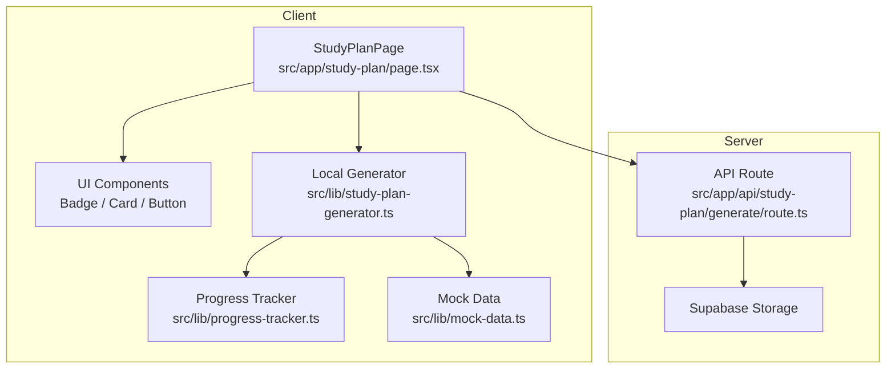
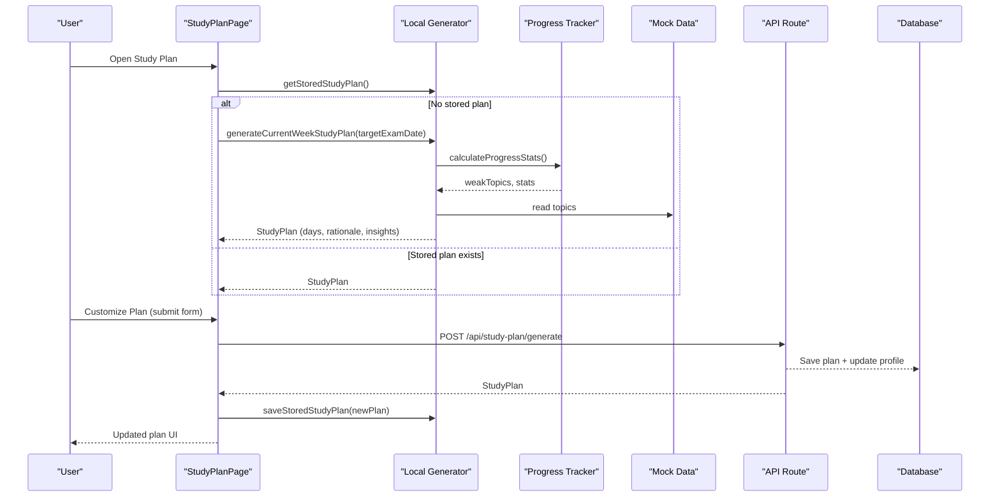
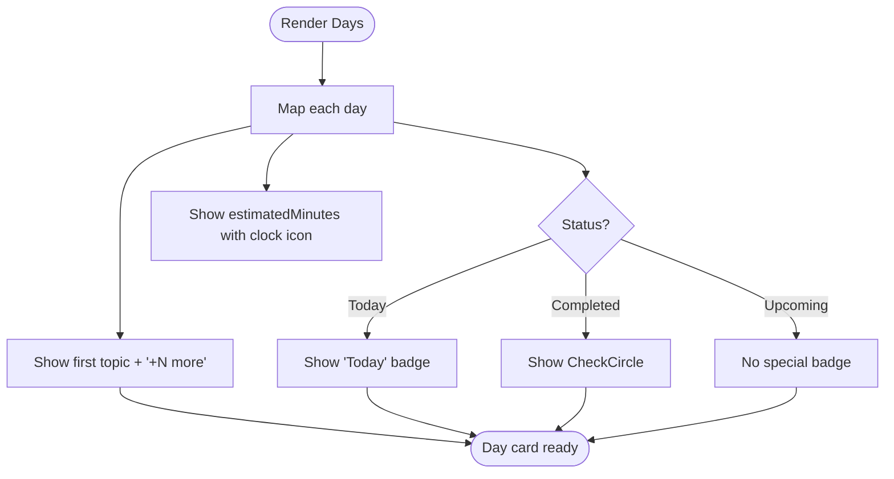
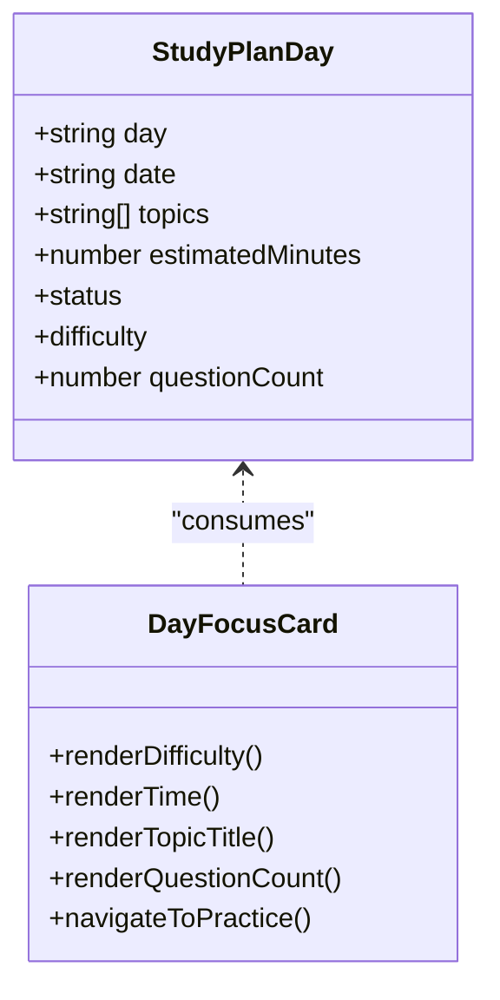
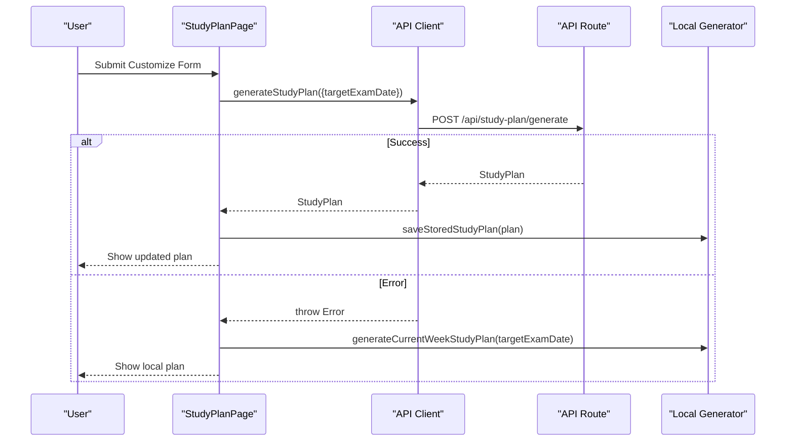
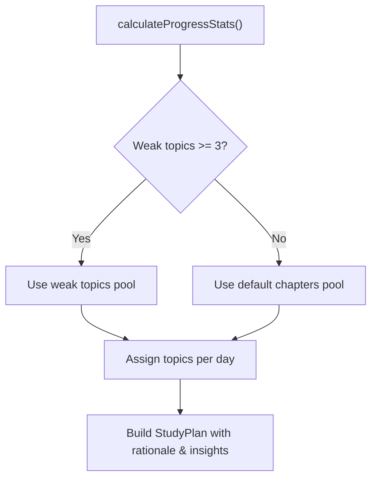
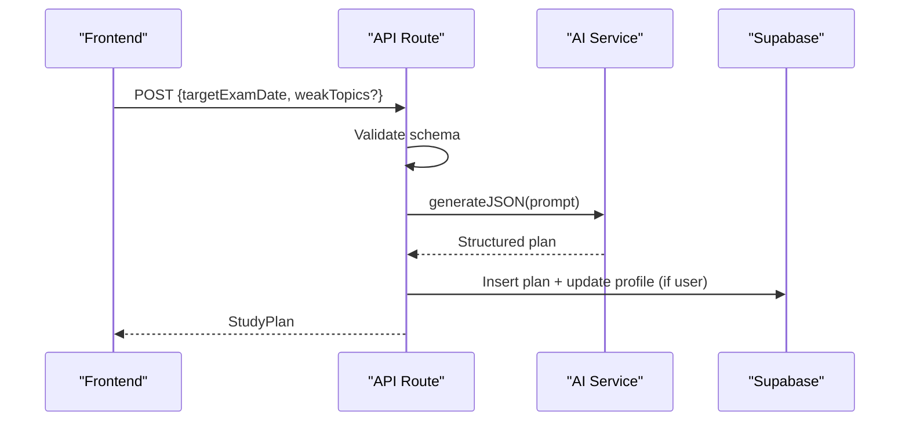
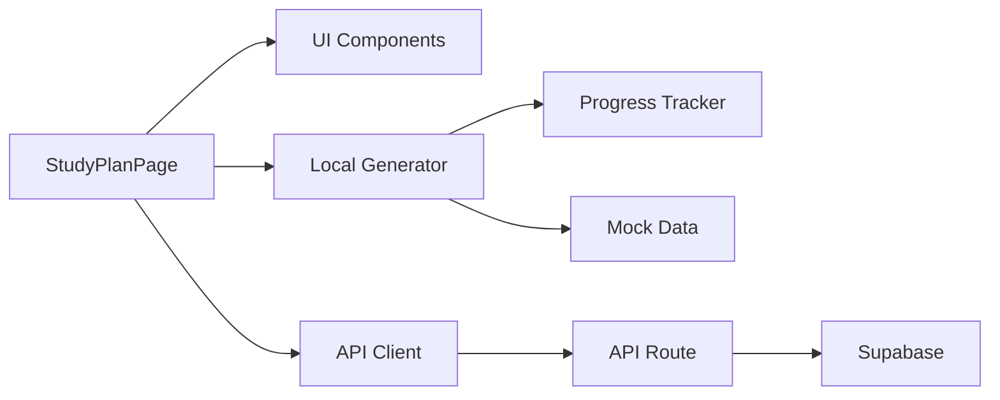

# User Interface

<cite>
**Referenced Files in This Document**
- [page.tsx](file://src/app/study-plan/page.tsx)
- [study-plan-generator.ts](file://src/lib/study-plan-generator.ts)
- [route.ts](file://src/app/api/study-plan/generate/route.ts)
- [progress-tracker.ts](file://src/lib/progress-tracker.ts)
- [api-client.ts](file://src/lib/api-client.ts)
- [quiz.ts](file://src/types/quiz.ts)
- [mock-data.ts](file://src/lib/mock-data.ts)
- [AppLayout.tsx](file://src/components/layout/AppLayout.tsx)
- [Badge.tsx](file://src/components/ui/Badge.tsx)
- [Card.tsx](file://src/components/ui/Card.tsx)
- [Button.tsx](file://src/components/ui/Button.tsx)
</cite>

## Table of Contents
1. [Introduction](#introduction)
2. [Project Structure](#project-structure)
3. [Core Components](#core-components)
4. [Architecture Overview](#architecture-overview)
5. [Detailed Component Analysis](#detailed-component-analysis)
6. [Dependency Analysis](#dependency-analysis)
7. [Performance Considerations](#performance-considerations)
8. [Troubleshooting Guide](#troubleshooting-guide)
9. [Conclusion](#conclusion)

## Introduction
This document describes the study plan user interface and its interactions for weekly MDCAT preparation. It explains the visual layout, day-by-day breakdowns, topic assignments, progress indicators, interactive elements (marking tasks complete, viewing estimated times, tracking completion), difficulty levels, question counts, week navigation, responsive design considerations, accessibility features, backend integration points, local storage persistence, and example UI states (loading, error handling, empty).

## Project Structure
The study plan feature is implemented as a Next.js client page that composes reusable UI components and integrates with both local logic and server APIs:
- Page component orchestrates state, rendering, and user interactions.
- Local generator builds a 7-day plan using progress data and mock topics when the API is unavailable or not used.
- Server route generates an AI-backed plan and persists it to the database for authenticated users.
- Types define the shape of plans and daily entries.
- Shared UI components provide consistent visuals and interactions.

**Diagram sources**
- [page.tsx:1-335](file://src/app/study-plan/page.tsx#L1-L335)
- [study-plan-generator.ts:1-102](file://src/lib/study-plan-generator.ts#L1-L102)
- [progress-tracker.ts:1-192](file://src/lib/progress-tracker.ts#L1-L192)
- [mock-data.ts:1-313](file://src/lib/mock-data.ts#L1-L313)
- [route.ts:1-123](file://src/app/api/study-plan/generate/route.ts#L1-L123)

**Section sources**
- [page.tsx:1-335](file://src/app/study-plan/page.tsx#L1-L335)
- [study-plan-generator.ts:1-102](file://src/lib/study-plan-generator.ts#L1-L102)
- [progress-tracker.ts:1-192](file://src/lib/progress-tracker.ts#L1-L192)
- [mock-data.ts:1-313](file://src/lib/mock-data.ts#L1-L313)
- [route.ts:1-123](file://src/app/api/study-plan/generate/route.ts#L1-L123)

## Core Components
- Study Plan Page: Displays header banner, weekly calendar wheel, selected day focus cards, AI advisor insights, and a customization modal. Manages loading states and fallbacks.
- Weekly Calendar Wheel: A grid of 7 days showing date, topics preview, estimated minutes, and status badges (Today, Completed). Clicking a day selects it for detailed view.
- Day Focus Cards: Show difficulty badge, estimated time, topic title, recommended question count, and a link to start practice.
- Customization Modal: Allows setting target exam date and daily goal; triggers plan regeneration via API or falls back to local generation.
- Layout Shell: AppLayout provides responsive navigation and content area.

Key responsibilities:
- Load existing plan from local storage or generate one for current week.
- Calculate countdown to exam date.
- Handle regeneration flow with loading and error fallbacks.
- Render responsive grids and accessible controls.

**Section sources**
- [page.tsx:30-335](file://src/app/study-plan/page.tsx#L30-L335)
- [AppLayout.tsx:29-90](file://src/components/layout/AppLayout.tsx#L29-L90)

## Architecture Overview
The UI follows a clear separation between presentation, local logic, and server-side generation:

**Diagram sources**
- [page.tsx:38-90](file://src/app/study-plan/page.tsx#L38-L90)
- [study-plan-generator.ts:7-101](file://src/lib/study-plan-generator.ts#L7-L101)
- [progress-tracker.ts:37-191](file://src/lib/progress-tracker.ts#L37-L191)
- [route.ts:8-114](file://src/app/api/study-plan/generate/route.ts#L8-L114)

## Detailed Component Analysis

### Weekly Calendar Wheel
- Visual layout: Responsive grid (2–7 columns) with animated day cards. Each card shows day name, formatted date, first topic preview, additional topic count, and estimated minutes. Status indicators include Today badge and Completed checkmark.
- Interactions: Clicking a day updates selection and renders the corresponding day’s details below.
- Accessibility: Buttons are keyboard-focusable; icons are decorative; text conveys meaning.

**Diagram sources**
- [page.tsx:129-200](file://src/app/study-plan/page.tsx#L129-L200)

**Section sources**
- [page.tsx:129-200](file://src/app/study-plan/page.tsx#L129-L200)

### Day Focus Cards
- Visual layout: For each unique topic on the selected day, a card displays difficulty badge, estimated time, topic title, recommended question count, and a “Start Practice” button linking to the practice page.
- Interactions: Navigation to practice session; no direct completion marking here.
- Accessibility: Links are clearly labeled with action and count; buttons have visible focus styles.

**Diagram sources**
- [quiz.ts:60-76](file://src/types/quiz.ts#L60-L76)
- [page.tsx:202-249](file://src/app/study-plan/page.tsx#L202-L249)

**Section sources**
- [page.tsx:202-249](file://src/app/study-plan/page.tsx#L202-L249)
- [quiz.ts:60-76](file://src/types/quiz.ts#L60-L76)

### Customization Modal and Regeneration Flow
- Inputs: Target exam date and daily study goal selector.
- Behavior: On submit, calls API to generate a new plan; if successful, saves to local storage and updates UI; on failure, falls back to local generation.
- States: Loading spinner during generation; modal closes after completion.

**Diagram sources**
- [page.tsx:67-90](file://src/app/study-plan/page.tsx#L67-L90)
- [api-client.ts:119-132](file://src/lib/api-client.ts#L119-L132)
- [route.ts:8-114](file://src/app/api/study-plan/generate/route.ts#L8-L114)
- [study-plan-generator.ts:26-101](file://src/lib/study-plan-generator.ts#L26-L101)

**Section sources**
- [page.tsx:67-90](file://src/app/study-plan/page.tsx#L67-L90)
- [api-client.ts:119-132](file://src/lib/api-client.ts#L119-L132)
- [route.ts:8-114](file://src/app/api/study-plan/generate/route.ts#L8-L114)
- [study-plan-generator.ts:26-101](file://src/lib/study-plan-generator.ts#L26-L101)

### Progress Integration and Weak Topic Prioritization
- The local generator uses progress tracker to identify weak topics and prioritizes them in the weekly plan. If insufficient weak topics exist, it falls back to default chapter topics.
- This ensures the UI reflects personalized focus areas based on quiz history.

**Diagram sources**
- [progress-tracker.ts:37-191](file://src/lib/progress-tracker.ts#L37-L191)
- [study-plan-generator.ts:26-101](file://src/lib/study-plan-generator.ts#L26-L101)

**Section sources**
- [progress-tracker.ts:37-191](file://src/lib/progress-tracker.ts#L37-L191)
- [study-plan-generator.ts:26-101](file://src/lib/study-plan-generator.ts#L26-L101)

### Backend Integration Points
- API Route: Validates input, constructs a prompt for AI-based plan generation, returns structured JSON, and persists plan to database for authenticated users. Also updates user profile target exam date.
- API Client: Provides typed function to call the endpoint and handle errors.

**Diagram sources**
- [route.ts:8-114](file://src/app/api/study-plan/generate/route.ts#L8-L114)
- [api-client.ts:119-132](file://src/lib/api-client.ts#L119-L132)

**Section sources**
- [route.ts:8-114](file://src/app/api/study-plan/generate/route.ts#L8-L114)
- [api-client.ts:119-132](file://src/lib/api-client.ts#L119-L132)

### Local Storage Persistence
- The local generator reads and writes the active study plan under a dedicated key. It also persists generated plans to ensure continuity across sessions.
- Errors during storage are caught and logged without breaking UI flow.

**Section sources**
- [study-plan-generator.ts:7-24](file://src/lib/study-plan-generator.ts#L7-L24)
- [study-plan-generator.ts:99-101](file://src/lib/study-plan-generator.ts#L99-L101)

### Example UI States

- Loading State:
  - During plan regeneration, the button shows a spinner and disabled state while the request is in flight.
  - The modal remains open until completion or fallback.

- Error Handling:
  - If the API call fails, the UI falls back to generating a local plan and continues without blocking the user.
  - Errors are surfaced by throwing descriptive messages from the API client.

- Empty State:
  - If no stored plan exists, the page initializes with a locally generated plan for the current week, ensuring immediate usability.

- Success State:
  - After successful regeneration, the updated plan is saved locally and displayed immediately.

**Section sources**
- [page.tsx:67-90](file://src/app/study-plan/page.tsx#L67-L90)
- [api-client.ts:119-132](file://src/lib/api-client.ts#L119-L132)
- [study-plan-generator.ts:7-24](file://src/lib/study-plan-generator.ts#L7-L24)

## Dependency Analysis
- Page depends on:
  - UI components (Button, Card, Badge, Modal, Input, Select)
  - Local generator and progress tracker
  - API client for remote plan generation
  - Types for plan structure
- Local generator depends on:
  - Progress tracker for weak topics
  - Mock data for topic names
- API route depends on:
  - Validation schemas
  - AI service for plan generation
  - Supabase client for persistence

**Diagram sources**
- [page.tsx:1-335](file://src/app/study-plan/page.tsx#L1-L335)
- [study-plan-generator.ts:1-102](file://src/lib/study-plan-generator.ts#L1-L102)
- [progress-tracker.ts:1-192](file://src/lib/progress-tracker.ts#L1-L192)
- [mock-data.ts:1-313](file://src/lib/mock-data.ts#L1-L313)
- [api-client.ts:1-133](file://src/lib/api-client.ts#L1-L133)
- [route.ts:1-123](file://src/app/api/study-plan/generate/route.ts#L1-L123)

**Section sources**
- [page.tsx:1-335](file://src/app/study-plan/page.tsx#L1-L335)
- [study-plan-generator.ts:1-102](file://src/lib/study-plan-generator.ts#L1-L102)
- [progress-tracker.ts:1-192](file://src/lib/progress-tracker.ts#L1-L192)
- [mock-data.ts:1-313](file://src/lib/mock-data.ts#L1-L313)
- [api-client.ts:1-133](file://src/lib/api-client.ts#L1-L133)
- [route.ts:1-123](file://src/app/api/study-plan/generate/route.ts#L1-L123)

## Performance Considerations
- Client-side rendering: Uses motion animations for staggered day cards; consider reducing animation complexity on low-end devices.
- Local generation: Lightweight and fast; avoids network latency when API is unavailable.
- API calls: Debounce regeneration requests if needed; cache results in local storage to prevent redundant calls.
- Memory usage: Keep plan objects minimal; avoid storing large payloads beyond necessary fields.

[No sources needed since this section provides general guidance]

## Troubleshooting Guide
- API failures:
  - Symptom: Regeneration does not update plan; fallback to local plan occurs.
  - Action: Check network connectivity and API availability; inspect thrown error messages from the API client.
- Local storage issues:
  - Symptom: Plan resets unexpectedly.
  - Action: Verify browser storage permissions and capacity; review error logs in the generator’s catch block.
- Incorrect dates or statuses:
  - Symptom: “Today” not highlighted or wrong dates shown.
  - Action: Ensure system date/time is correct; verify date calculations in the generator.

**Section sources**
- [api-client.ts:119-132](file://src/lib/api-client.ts#L119-L132)
- [study-plan-generator.ts:7-24](file://src/lib/study-plan-generator.ts#L7-L24)
- [study-plan-generator.ts:26-101](file://src/lib/study-plan-generator.ts#L26-L101)

## Conclusion
The study plan interface provides a clear, responsive, and interactive weekly schedule tailored to individual performance. It balances local generation with AI-powered customization, persists plans locally, and integrates with backend services for authenticated users. The UI communicates difficulty, estimated time, and question counts while guiding students toward focused practice. Robust error handling and fallbacks ensure reliability across environments.

[No sources needed since this section summarizes without analyzing specific files]