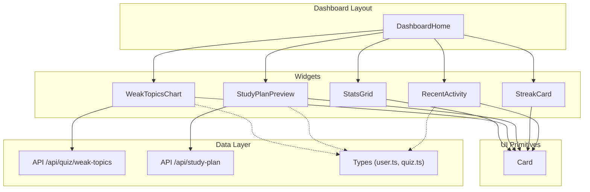
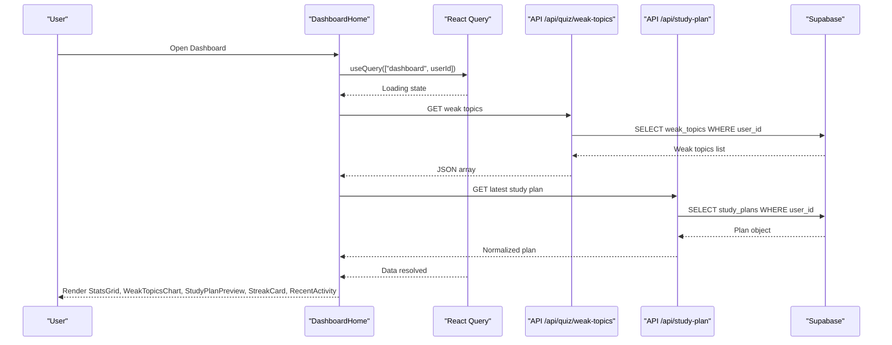
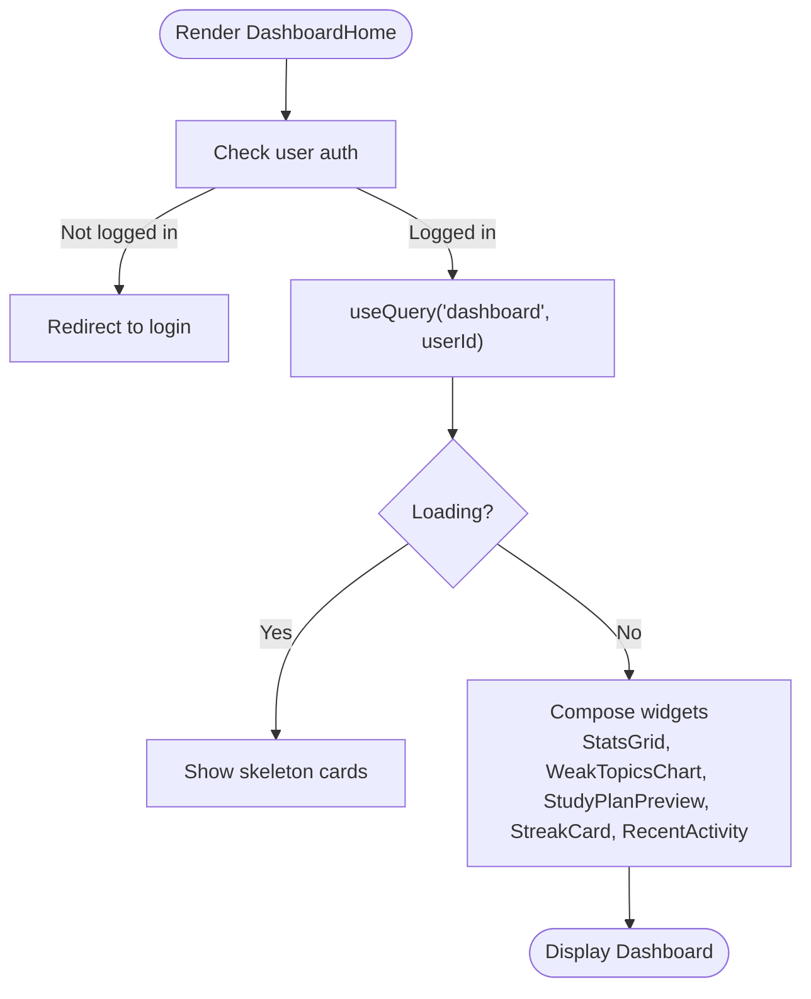
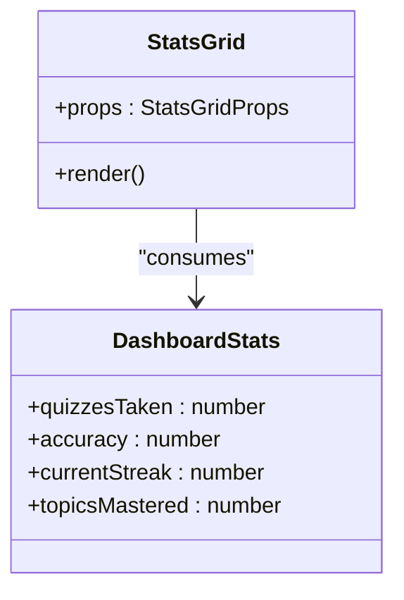
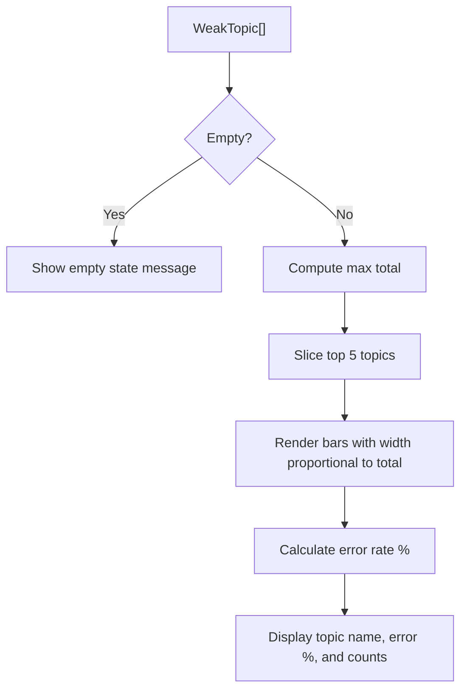
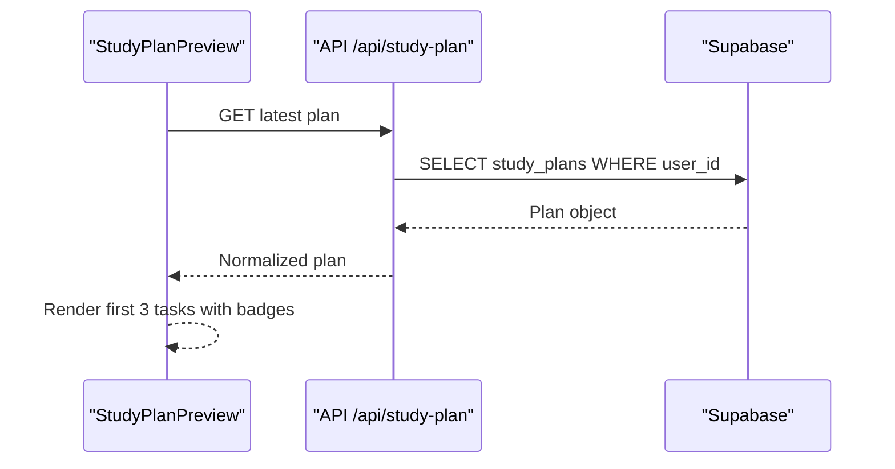
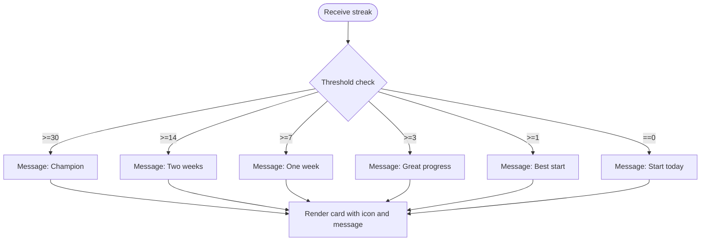
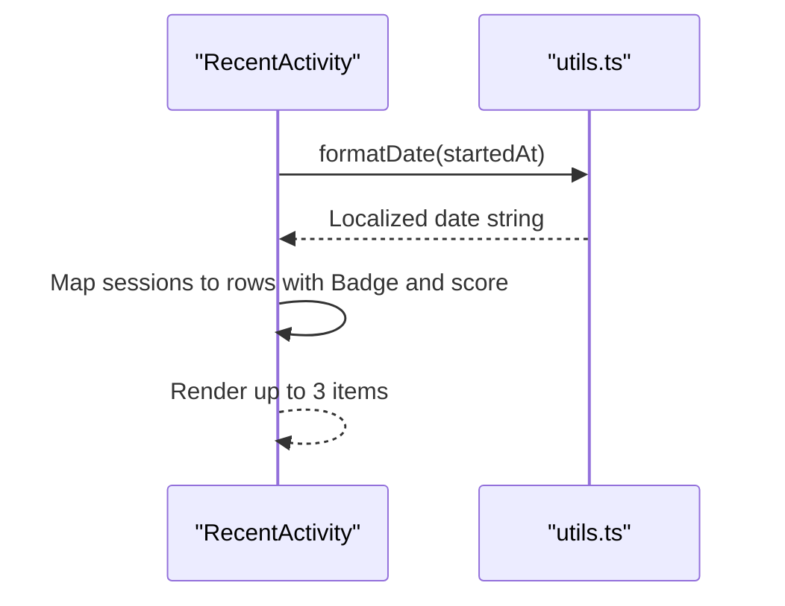
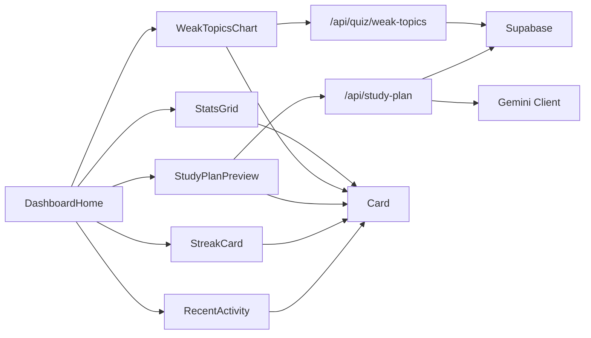

# Dashboard Features

<cite>
**Referenced Files in This Document**
- [DashboardHome.tsx](file://Next-app/src/components/DashboardHome.tsx)
- [StatsGrid.tsx](file://Next-app/src/components/dashboard/StatsGrid.tsx)
- [WeakTopicsChart.tsx](file://Next-app/src/components/dashboard/WeakTopicsChart.tsx)
- [StudyPlanPreview.tsx](file://Next-app/src/components/dashboard/StudyPlanPreview.tsx)
- [StreakCard.tsx](file://Next-app/src/components/dashboard/StreakCard.tsx)
- [RecentActivity.tsx](file://Next-app/src/components/dashboard/RecentActivity.tsx)
- [user.ts](file://Next-app/src/types/user.ts)
- [quiz.ts](file://Next-app/src/types/quiz.ts)
- [weak-topics/route.ts](file://Next-app/src/app/api/quiz/weak-topics/route.ts)
- [study-plan/route.ts](file://Next-app/src/app/api/study-plan/route.ts)
- [utils.ts](file://Next-app/src/lib/utils.ts)
- [Card.tsx](file://Next-app/src/components/ui/Card.tsx)
- [layout.tsx](file://Next-app/src/app/(dashboard)/layout.tsx)
</cite>

## Table of Contents
1. Introduction
2. Project Structure
3. Core Components
4. Architecture Overview
5. Detailed Component Analysis
6. Dependency Analysis
7. Performance Considerations
8. Troubleshooting Guide
9. Conclusion
10. Appendices

## Introduction
This document explains the dashboard features and analytics display for the application. It covers the DashboardHome component structure, StatsGrid for performance metrics, WeakTopicsChart for visualizing areas needing improvement, StudyPlanPreview for upcoming tasks, StreakCard for motivation tracking, and RecentActivity for user engagement insights. It also documents data visualization patterns, real-time update strategies, chart configurations, responsive design considerations, and how to extend or customize the dashboard with new widgets and backend integrations.

## Project Structure
The dashboard is implemented as a client-side Next.js page composed of reusable UI components:
- DashboardHome orchestrates data fetching and composes the layout of dashboard widgets.
- Each widget (StatsGrid, WeakTopicsChart, StudyPlanPreview, StreakCard, RecentActivity) is a self-contained component that renders specific analytics.
- Shared UI primitives like Card provide consistent styling and layout.
- API routes supply weak topics and study plan data from Supabase; types define contracts between frontend and backend.

**Diagram sources**
- [DashboardHome.tsx:33-88](file://Next-app/src/components/DashboardHome.tsx#L33-L88)
- [StatsGrid.tsx:47-71](file://Next-app/src/components/dashboard/StatsGrid.tsx#L47-L71)
- [WeakTopicsChart.tsx:8-51](file://Next-app/src/components/dashboard/WeakTopicsChart.tsx#L8-L51)
- [StudyPlanPreview.tsx:22-76](file://Next-app/src/components/dashboard/StudyPlanPreview.tsx#L22-L76)
- [StreakCard.tsx:26-48](file://Next-app/src/components/dashboard/StreakCard.tsx#L26-L48)
- [RecentActivity.tsx:11-67](file://Next-app/src/components/dashboard/RecentActivity.tsx#L11-L67)
- [Card.tsx:10-24](file://Next-app/src/components/ui/Card.tsx#L10-L24)
- [weak-topics/route.ts:4-32](file://Next-app/src/app/api/quiz/weak-topics/route.ts#L4-L32)
- [study-plan/route.ts:5-114](file://Next-app/src/app/api/study-plan/route.ts#L5-L114)
- [user.ts:8-39](file://Next-app/src/types/user.ts#L8-L39)
- [quiz.ts:18-27](file://Next-app/src/types/quiz.ts#L18-L27)

**Section sources**
- [DashboardHome.tsx:33-88](file://Next-app/src/components/DashboardHome.tsx#L33-L88)
- [layout.tsx:39-58](file://Next-app/src/app/(dashboard)/layout.tsx#L39-L58)

## Core Components
- DashboardHome: Orchestrates data fetching via React Query, composes the grid layout, and renders all dashboard widgets. It handles loading states with Skeleton placeholders and displays personalized greetings.
- StatsGrid: Renders four key performance indicators using a configuration-driven approach. Each stat card includes an icon, value, and label.
- WeakTopicsChart: Visualizes up to five weak topics with horizontal bars indicating total attempts and error rates.
- StudyPlanPreview: Shows upcoming study tasks for the current week, with activity badges and estimated durations. Links to the full study plan page.
- StreakCard: Displays current streak count with motivational messages based on thresholds.
- RecentActivity: Lists recent quiz sessions with accuracy badges and score summaries. Links to history when more than three sessions exist.

**Section sources**
- [DashboardHome.tsx:33-88](file://Next-app/src/components/DashboardHome.tsx#L33-L88)
- [StatsGrid.tsx:14-71](file://Next-app/src/components/dashboard/StatsGrid.tsx#L14-L71)
- [WeakTopicsChart.tsx:8-51](file://Next-app/src/components/dashboard/WeakTopicsChart.tsx#L8-L51)
- [StudyPlanPreview.tsx:22-76](file://Next-app/src/components/dashboard/StudyPlanPreview.tsx#L22-L76)
- [StreakCard.tsx:8-48](file://Next-app/src/components/dashboard/StreakCard.tsx#L8-L48)
- [RecentActivity.tsx:11-67](file://Next-app/src/components/dashboard/RecentActivity.tsx#L11-L67)

## Architecture Overview
The dashboard follows a client-first architecture:
- Data fetching is centralized in DashboardHome using React Query with a query key scoped to the authenticated user.
- Widgets consume typed data structures defined in user.ts and quiz.ts.
- Backend integration uses Next.js API routes to fetch weak topics and study plans from Supabase, enforcing authentication and returning normalized payloads.
- UI primitives ensure consistent card-based layouts across widgets.

**Diagram sources**
- [DashboardHome.tsx:22-39](file://Next-app/src/components/DashboardHome.tsx#L22-L39)
- [weak-topics/route.ts:4-32](file://Next-app/src/app/api/quiz/weak-topics/route.ts#L4-L32)
- [study-plan/route.ts:80-114](file://Next-app/src/app/api/study-plan/route.ts#L80-L114)

## Detailed Component Analysis

### DashboardHome
- Responsibilities: Fetch dashboard data, manage loading states, compose layout, and pass props to child widgets.
- Data flow: Uses a single query to fetch stats, weak topics, study plan, and recent sessions. Currently returns mock data but is structured to integrate with backend endpoints.
- Responsive behavior: Uses Tailwind grid classes to adapt from mobile to desktop layouts.

**Diagram sources**
- [DashboardHome.tsx:33-88](file://Next-app/src/components/DashboardHome.tsx#L33-L88)

**Section sources**
- [DashboardHome.tsx:22-88](file://Next-app/src/components/DashboardHome.tsx#L22-L88)

### StatsGrid
- Visualization pattern: Configuration-driven rendering of metric cards with icons, colors, and optional suffixes.
- Data contract: Expects DashboardStats with quizzesTaken, accuracy, currentStreak, topicsMastered.
- Extensibility: Add new stats by extending the configuration array with key, label, icon, color, bgColor, and optional suffix.

**Diagram sources**
- [StatsGrid.tsx:10-71](file://Next-app/src/components/dashboard/StatsGrid.tsx#L10-L71)
- [user.ts:34-39](file://Next-app/src/types/user.ts#L34-L39)

**Section sources**
- [StatsGrid.tsx:14-71](file://Next-app/src/components/dashboard/StatsGrid.tsx#L14-L71)
- [user.ts:34-39](file://Next-app/src/types/user.ts#L34-L39)

### WeakTopicsChart
- Visualization pattern: Horizontal bar chart showing topic totals and error rates; limited to top five topics for readability.
- Data contract: Array of WeakTopic with id, topic, wrongCount, totalCount, lastUpdated.
- Real-time updates: Can be refreshed by re-fetching weak topics via API and updating the topics prop.

**Diagram sources**
- [WeakTopicsChart.tsx:8-51](file://Next-app/src/components/dashboard/WeakTopicsChart.tsx#L8-L51)
- [user.ts:8-15](file://Next-app/src/types/user.ts#L8-L15)

**Section sources**
- [WeakTopicsChart.tsx:8-51](file://Next-app/src/components/dashboard/WeakTopicsChart.tsx#L8-L51)
- [user.ts:8-15](file://Next-app/src/types/user.ts#L8-L15)

### StudyPlanPreview
- Visualization pattern: List of upcoming tasks with day labels, topic names, activity badges, and estimated minutes.
- Data contract: StudyPlan with id, userId, weekStart, tasks[], generatedAt.
- Navigation: Links to full study plan page; shows empty state if no plan exists.

**Diagram sources**
- [StudyPlanPreview.tsx:22-76](file://Next-app/src/components/dashboard/StudyPlanPreview.tsx#L22-L76)
- [study-plan/route.ts:80-114](file://Next-app/src/app/api/study-plan/route.ts#L80-L114)

**Section sources**
- [StudyPlanPreview.tsx:22-76](file://Next-app/src/components/dashboard/StudyPlanPreview.tsx#L22-L76)
- [study-plan/route.ts:80-114](file://Next-app/src/app/api/study-plan/route.ts#L80-L114)
- [user.ts:17-32](file://Next-app/src/types/user.ts#L17-L32)

### StreakCard
- Visualization pattern: Gradient card with trophy or flame icon depending on streak length; dynamic motivational message based on thresholds.
- Data contract: Number representing current streak.
- Behavior: Updates message dynamically without network calls.

**Diagram sources**
- [StreakCard.tsx:8-48](file://Next-app/src/components/dashboard/StreakCard.tsx#L8-L48)

**Section sources**
- [StreakCard.tsx:8-48](file://Next-app/src/components/dashboard/StreakCard.tsx#L8-L48)

### RecentActivity
- Visualization pattern: List of recent quiz sessions with accuracy badges and score summaries; links to full history when applicable.
- Data contract: Array of QuizSession with id, topic, questionCount, score, accuracy, startedAt, completedAt.
- Utilities: Uses formatDate and calculateAccuracy helpers for display formatting.

**Diagram sources**
- [RecentActivity.tsx:11-67](file://Next-app/src/components/dashboard/RecentActivity.tsx#L11-L67)
- [utils.ts:8-26](file://Next-app/src/lib/utils.ts#L8-L26)
- [quiz.ts:18-27](file://Next-app/src/types/quiz.ts#L18-L27)

**Section sources**
- [RecentActivity.tsx:11-67](file://Next-app/src/components/dashboard/RecentActivity.tsx#L11-L67)
- [utils.ts:8-26](file://Next-app/src/lib/utils.ts#L8-L26)
- [quiz.ts:18-27](file://Next-app/src/types/quiz.ts#L18-L27)

## Dependency Analysis
- DashboardHome depends on:
  - React Query for data fetching and caching.
  - Auth hook for user context.
  - Child widgets for rendering analytics.
- Widgets depend on:
  - UI primitives (Card) for consistent styling.
  - Types (user.ts, quiz.ts) for data contracts.
  - API routes for live data where applicable.
- API routes depend on:
  - Supabase client for database access.
  - Gemini client for generating study plans.

**Diagram sources**
- [DashboardHome.tsx:33-88](file://Next-app/src/components/DashboardHome.tsx#L33-L88)
- [weak-topics/route.ts:4-32](file://Next-app/src/app/api/quiz/weak-topics/route.ts#L4-L32)
- [study-plan/route.ts:5-114](file://Next-app/src/app/api/study-plan/route.ts#L5-L114)
- [Card.tsx:10-24](file://Next-app/src/components/ui/Card.tsx#L10-L24)

**Section sources**
- [DashboardHome.tsx:33-88](file://Next-app/src/components/DashboardHome.tsx#L33-L88)
- [weak-topics/route.ts:4-32](file://Next-app/src/app/api/quiz/weak-topics/route.ts#L4-L32)
- [study-plan/route.ts:5-114](file://Next-app/src/app/api/study-plan/route.ts#L5-L114)

## Performance Considerations
- Data fetching:
  - Use React Query caching and refetch policies to minimize redundant requests.
  - Scope queries by user ID to avoid cross-user data leaks.
- Rendering:
  - Limit displayed items (e.g., top 5 weak topics, first 3 study tasks) to reduce DOM size.
  - Use skeleton loaders during loading states to improve perceived performance.
- Styling:
  - Leverage Tailwind utility classes for responsive grids and minimal custom CSS.
- Backend:
  - Ensure API routes return only necessary fields and limit result sets.
  - Cache frequent reads at the database level if needed.

[No sources needed since this section provides general guidance]

## Troubleshooting Guide
- Authentication errors:
  - API routes return unauthorized responses if no user is present. Verify auth state before calling endpoints.
- Data not loading:
  - Check React Query keys and enabled conditions; ensure user is available before fetching.
  - Inspect API route logs for database errors and normalize payloads consistently.
- Display issues:
  - Confirm types match expected shapes; mismatched fields can cause undefined values in UI.
  - Validate that weak topics and study plans are properly formatted before rendering.

**Section sources**
- [weak-topics/route.ts:4-32](file://Next-app/src/app/api/quiz/weak-topics/route.ts#L4-L32)
- [study-plan/route.ts:5-114](file://Next-app/src/app/api/study-plan/route.ts#L5-L114)
- [DashboardHome.tsx:22-39](file://Next-app/src/components/DashboardHome.tsx#L22-L39)

## Conclusion
The dashboard provides a cohesive analytics experience through modular widgets, typed data contracts, and robust data fetching patterns. The architecture supports easy extension with new widgets, customization of analytics displays, and seamless integration with backend services. Responsive design ensures usability across devices, while clear loading and empty states enhance user experience.

[No sources needed since this section summarizes without analyzing specific files]

## Appendices

### Adding a New Dashboard Widget
Steps:
- Define a new component under src/components/dashboard with its own props interface.
- Use Card for consistent styling and Tailwind utilities for layout.
- Integrate with existing types or create new ones in src/types if needed.
- Wire the component into DashboardHome’s layout and pass appropriate data.
- If data is remote, add or reuse API routes and fetch via React Query.

**Section sources**
- [DashboardHome.tsx:67-88](file://Next-app/src/components/DashboardHome.tsx#L67-L88)
- [Card.tsx:10-24](file://Next-app/src/components/ui/Card.tsx#L10-L24)

### Customizing Analytics Displays
- StatsGrid: Extend the configuration array to add new metrics with icons, colors, and suffixes.
- WeakTopicsChart: Adjust thresholds, sorting, or limits to highlight different aspects of performance.
- StudyPlanPreview: Customize badges, labels, and navigation links to align with product goals.
- RecentActivity: Modify accuracy thresholds or include additional session details.

**Section sources**
- [StatsGrid.tsx:14-71](file://Next-app/src/components/dashboard/StatsGrid.tsx#L14-L71)
- [WeakTopicsChart.tsx:8-51](file://Next-app/src/components/dashboard/WeakTopicsChart.tsx#L8-L51)
- [StudyPlanPreview.tsx:22-76](file://Next-app/src/components/dashboard/StudyPlanPreview.tsx#L22-L76)
- [RecentActivity.tsx:11-67](file://Next-app/src/components/dashboard/RecentActivity.tsx#L11-L67)

### Integrating with Backend Data Sources
- Weak Topics:
  - Use GET /api/quiz/weak-topics to retrieve user-specific weak topics ordered by error frequency.
- Study Plan:
  - Use POST /api/study-plan to generate and persist a plan based on weak topics and recent accuracy.
  - Use GET /api/study-plan to fetch the latest plan for the current user.
- Types:
  - Align frontend interfaces with backend schemas in user.ts and quiz.ts to prevent mismatches.

**Section sources**
- [weak-topics/route.ts:4-32](file://Next-app/src/app/api/quiz/weak-topics/route.ts#L4-L32)
- [study-plan/route.ts:5-114](file://Next-app/src/app/api/study-plan/route.ts#L5-L114)
- [user.ts:8-39](file://Next-app/src/types/user.ts#L8-L39)
- [quiz.ts:18-27](file://Next-app/src/types/quiz.ts#L18-L27)