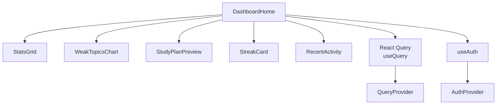
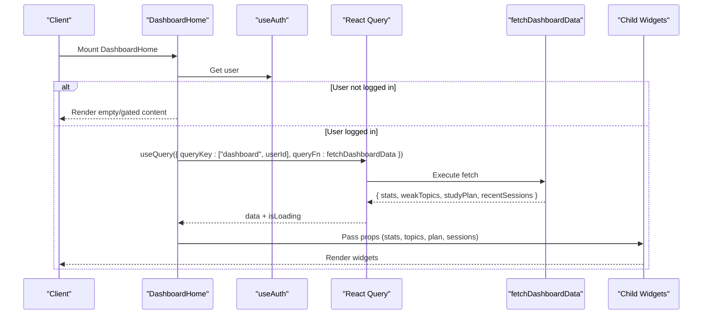
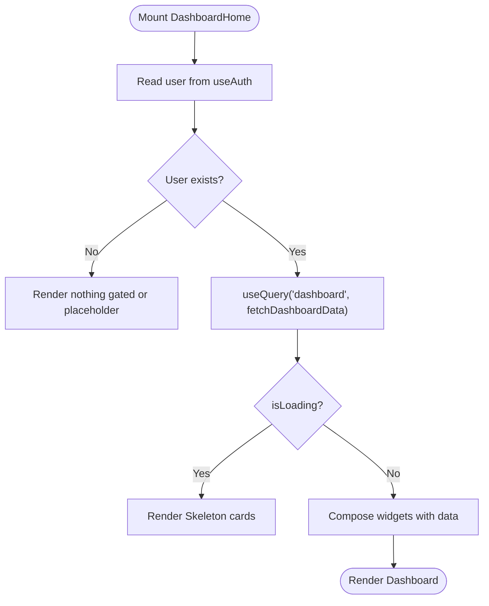
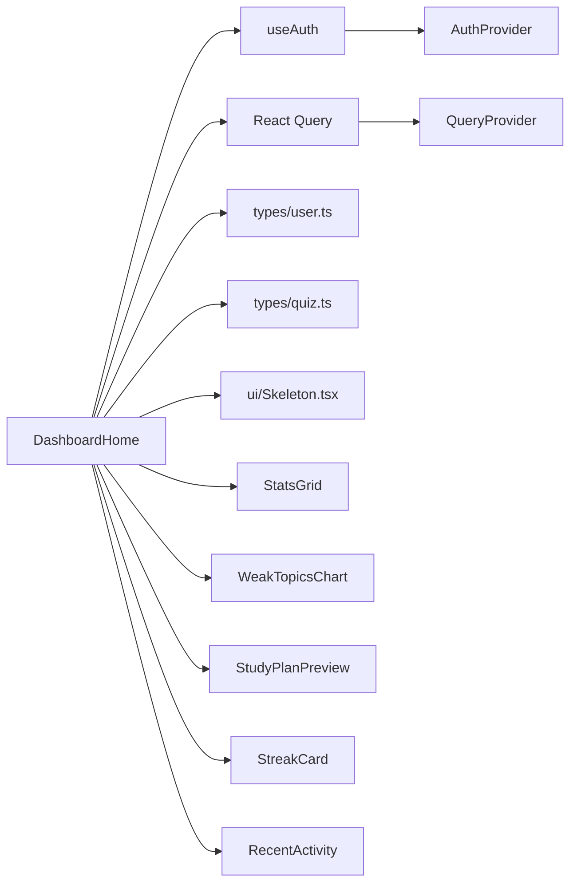

# Dashboard Home Component

<cite>
**Referenced Files in This Document**
- [DashboardHome.tsx](file://Next-app/src/components/DashboardHome.tsx)
- [StatsGrid.tsx](file://Next-app/src/components/dashboard/StatsGrid.tsx)
- [WeakTopicsChart.tsx](file://Next-app/src/components/dashboard/WeakTopicsChart.tsx)
- [StudyPlanPreview.tsx](file://Next-app/src/components/dashboard/StudyPlanPreview.tsx)
- [StreakCard.tsx](file://Next-app/src/components/dashboard/StreakCard.tsx)
- [RecentActivity.tsx](file://Next-app/src/components/dashboard/RecentActivity.tsx)
- [useAuth.ts](file://Next-app/src/lib/hooks/useAuth.ts)
- [AuthProvider.tsx](file://Next-app/src/providers/AuthProvider.tsx)
- [QueryProvider.tsx](file://Next-app/src/providers/QueryProvider.tsx)
- [Skeleton.tsx](file://Next-app/src/components/ui/Skeleton.tsx)
- [user.ts](file://Next-app/src/types/user.ts)
- [quiz.ts](file://Next-app/src/types/quiz.ts)
- [utils.ts](file://Next-app/src/lib/utils.ts)
</cite>

## Table of Contents
1. [Introduction](#introduction)
2. [Project Structure](#project-structure)
3. [Core Components](#core-components)
4. [Architecture Overview](#architecture-overview)
5. [Detailed Component Analysis](#detailed-component-analysis)
6. [Dependency Analysis](#dependency-analysis)
7. [Performance Considerations](#performance-considerations)
8. [Troubleshooting Guide](#troubleshooting-guide)
9. [Conclusion](#conclusion)
10. [Appendices](#appendices)

## Introduction
The DashboardHome component is the main dashboard container that orchestrates multiple widgets to present a personalized learning overview. It integrates authentication via useAuth, fetches dashboard data using React Query, and renders a responsive layout composed of StatsGrid, WeakTopicsChart, StudyPlanPreview, StreakCard, and RecentActivity. It manages loading states with skeleton components and coordinates data flow between child widgets.

## Project Structure
The dashboard is implemented as a client-side Next.js component that composes smaller, focused widgets. Data fetching is centralized in a single query function, while UI state and rendering are delegated to child components. The layout uses responsive Tailwind CSS grids to adapt across screen sizes.

**Diagram sources**
- [DashboardHome.tsx:1-90](file://Next-app/src/components/DashboardHome.tsx#L1-L90)
- [QueryProvider.tsx:1-24](file://Next-app/src/providers/QueryProvider.tsx#L1-L24)
- [AuthProvider.tsx:1-79](file://Next-app/src/providers/AuthProvider.tsx#L1-L79)

**Section sources**
- [DashboardHome.tsx:1-90](file://Next-app/src/components/DashboardHome.tsx#L1-L90)
- [QueryProvider.tsx:1-24](file://Next-app/src/providers/QueryProvider.tsx#L1-L24)
- [AuthProvider.tsx:1-79](file://Next-app/src/providers/AuthProvider.tsx#L1-L79)

## Core Components
- DashboardHome: Orchestrates data fetching and layout composition; gates queries on user presence; renders skeletons during loading; passes derived data to child widgets.
- StatsGrid: Displays key metrics (quizzes taken, accuracy, streak, topics mastered) in a responsive grid.
- WeakTopicsChart: Visualizes top weak topics with error rates and progress bars.
- StudyPlanPreview: Shows upcoming study plan tasks or prompts creation when none exists.
- StreakCard: Highlights current streak with contextual motivational messages.
- RecentActivity: Lists recent quiz sessions with performance badges and navigation to full history.

**Section sources**
- [DashboardHome.tsx:33-89](file://Next-app/src/components/DashboardHome.tsx#L33-L89)
- [StatsGrid.tsx:10-71](file://Next-app/src/components/dashboard/StatsGrid.tsx#L10-L71)
- [WeakTopicsChart.tsx:4-51](file://Next-app/src/components/dashboard/WeakTopicsChart.tsx#L4-L51)
- [StudyPlanPreview.tsx:6-76](file://Next-app/src/components/dashboard/StudyPlanPreview.tsx#L6-L76)
- [StreakCard.tsx:4-48](file://Next-app/src/components/dashboard/StreakCard.tsx#L4-L48)
- [RecentActivity.tsx:7-67](file://Next-app/src/components/dashboard/RecentActivity.tsx#L7-L67)

## Architecture Overview
DashboardHome uses React Query to fetch dashboard data once the user is authenticated. The query is enabled only when a user exists, ensuring safe access to user-specific data. Loading states are handled by Skeleton components for a smooth UX. Child components receive preprocessed data and render themselves accordingly.

**Diagram sources**
- [DashboardHome.tsx:22-39](file://Next-app/src/components/DashboardHome.tsx#L22-L39)
- [useAuth.ts:1-13](file://Next-app/src/lib/hooks/useAuth.ts#L1-L13)
- [QueryProvider.tsx:1-24](file://Next-app/src/providers/QueryProvider.tsx#L1-L24)

## Detailed Component Analysis

### DashboardHome
- Role: Main container that composes dashboard widgets and manages data fetching lifecycle.
- Authentication integration: Uses useAuth to obtain the current user; query is enabled only when user exists.
- Data fetching: Single query function aggregates stats, weak topics, study plan, and recent sessions; returns a tuple-like object typed with domain interfaces.
- State management: Relies on React Query’s data and isLoading flags; no local state beyond derived values like userName.
- Loading states: Renders a responsive skeleton grid matching the final layout shape.
- Error handling: No explicit try/catch in the component; errors bubble up to React Query’s error boundary if configured at a higher level. For robustness, consider adding an error branch to display user-friendly messages.
- Layout coordination: Uses responsive Tailwind grids to arrange widgets; ensures consistent spacing and alignment across breakpoints.

**Diagram sources**
- [DashboardHome.tsx:33-89](file://Next-app/src/components/DashboardHome.tsx#L33-L89)

**Section sources**
- [DashboardHome.tsx:1-90](file://Next-app/src/components/DashboardHome.tsx#L1-L90)
- [useAuth.ts:1-13](file://Next-app/src/lib/hooks/useAuth.ts#L1-L13)
- [QueryProvider.tsx:1-24](file://Next-app/src/providers/QueryProvider.tsx#L1-L24)
- [Skeleton.tsx:1-54](file://Next-app/src/components/ui/Skeleton.tsx#L1-L54)

### StatsGrid
- Purpose: Presents four core metrics in a responsive grid with icons and labels.
- Data contract: Expects a DashboardStats object with quizzesTaken, accuracy, currentStreak, topicsMastered.
- Rendering logic: Maps over a configuration array to render each stat card consistently.

**Section sources**
- [StatsGrid.tsx:10-71](file://Next-app/src/components/dashboard/StatsGrid.tsx#L10-L71)
- [user.ts:34-39](file://Next-app/src/types/user.ts#L34-L39)

### WeakTopicsChart
- Purpose: Visualizes the top weak topics based on incorrect counts and total attempts.
- Data contract: Receives an array of WeakTopic objects.
- Rendering logic: Computes error rate per topic and normalizes bar widths relative to the maximum total count; shows a friendly message when no topics exist.

**Section sources**
- [WeakTopicsChart.tsx:4-51](file://Next-app/src/components/dashboard/WeakTopicsChart.tsx#L4-L51)
- [user.ts:8-15](file://Next-app/src/types/user.ts#L8-L15)

### StudyPlanPreview
- Purpose: Shows upcoming study plan tasks or prompts creating a plan when none exists.
- Data contract: Accepts an optional StudyPlan object; displays first three tasks with activity badges and estimated time.
- Navigation: Links to the study plan page for full details.

**Section sources**
- [StudyPlanPreview.tsx:6-76](file://Next-app/src/components/dashboard/StudyPlanPreview.tsx#L6-L76)
- [user.ts:17-32](file://Next-app/src/types/user.ts#L17-L32)

### StreakCard
- Purpose: Highlights current streak with contextual motivational messages and visual cues.
- Logic: Selects a message based on streak thresholds; switches icon between flame and trophy for milestones.

**Section sources**
- [StreakCard.tsx:4-48](file://Next-app/src/components/dashboard/StreakCard.tsx#L4-L48)

### RecentActivity
- Purpose: Lists recent quiz sessions with accuracy badges and score summaries.
- Data contract: Receives QuizSession[]; formats dates and computes badge variants based on accuracy thresholds.
- Navigation: Provides a link to the full history when more than three sessions exist.

**Section sources**
- [RecentActivity.tsx:7-67](file://Next-app/src/components/dashboard/RecentActivity.tsx#L7-L67)
- [quiz.ts:18-27](file://Next-app/src/types/quiz.ts#L18-L27)
- [utils.ts:8-15](file://Next-app/src/lib/utils.ts#L8-L15)

## Dependency Analysis
DashboardHome depends on:
- Authentication context via useAuth to gate queries and personalize content.
- React Query via QueryProvider for caching, retries, and stale-time behavior.
- Domain types for strongly-typed data contracts.
- UI primitives (Card, Badge, Skeleton) for consistent presentation.

**Diagram sources**
- [DashboardHome.tsx:1-90](file://Next-app/src/components/DashboardHome.tsx#L1-L90)
- [useAuth.ts:1-13](file://Next-app/src/lib/hooks/useAuth.ts#L1-L13)
- [AuthProvider.tsx:1-79](file://Next-app/src/providers/AuthProvider.tsx#L1-L79)
- [QueryProvider.tsx:1-24](file://Next-app/src/providers/QueryProvider.tsx#L1-L24)
- [user.ts:1-40](file://Next-app/src/types/user.ts#L1-L40)
- [quiz.ts:1-47](file://Next-app/src/types/quiz.ts#L1-L47)
- [Skeleton.tsx:1-54](file://Next-app/src/components/ui/Skeleton.tsx#L1-L54)

**Section sources**
- [DashboardHome.tsx:1-90](file://Next-app/src/components/DashboardHome.tsx#L1-L90)
- [useAuth.ts:1-13](file://Next-app/src/lib/hooks/useAuth.ts#L1-L13)
- [AuthProvider.tsx:1-79](file://Next-app/src/providers/AuthProvider.tsx#L1-L79)
- [QueryProvider.tsx:1-24](file://Next-app/src/providers/QueryProvider.tsx#L1-L24)
- [user.ts:1-40](file://Next-app/src/types/user.ts#L1-L40)
- [quiz.ts:1-47](file://Next-app/src/types/quiz.ts#L1-L47)
- [Skeleton.tsx:1-54](file://Next-app/src/components/ui/Skeleton.tsx#L1-L54)

## Performance Considerations
- Query caching: QueryProvider sets a default staleTime of five minutes, reducing network calls for repeated visits.
- Conditional fetching: Queries are enabled only when a user exists, preventing unnecessary requests.
- Minimal re-renders: Each widget receives focused props; avoid lifting state into DashboardHome unless necessary.
- Skeleton efficiency: Skeletons match the final layout to prevent layout shifts and improve perceived performance.
- Data slicing: Widgets like WeakTopicsChart and RecentActivity slice arrays to limit rendering overhead.

[No sources needed since this section provides general guidance]

## Troubleshooting Guide
- Missing auth provider: If useAuth throws “must be used within an AuthProvider,” ensure the app tree wraps children with AuthProvider.
- Empty dashboard: When user is null, queries are disabled; verify authentication flow and session initialization in AuthProvider.
- No data returned: The current fetch function returns mock data; replace it with real API calls to populate widgets.
- Error visibility: Add error handling in DashboardHome to surface query errors to users (e.g., show a toast or inline message).
- Date formatting issues: Ensure locale settings are correct for formatDate; check browser environment if dates appear unexpected.

**Section sources**
- [useAuth.ts:6-11](file://Next-app/src/lib/hooks/useAuth.ts#L6-L11)
- [AuthProvider.tsx:27-79](file://Next-app/src/providers/AuthProvider.tsx#L27-L79)
- [DashboardHome.tsx:22-39](file://Next-app/src/components/DashboardHome.tsx#L22-L39)
- [utils.ts:8-15](file://Next-app/src/lib/utils.ts#L8-L15)

## Conclusion
DashboardHome serves as a cohesive entry point for the learner’s dashboard, integrating authentication, data fetching, and responsive layout orchestration. Its modular design allows easy customization, extension with new widgets, and real-time updates through React Query features. By following the patterns outlined here, you can confidently enhance the dashboard experience while maintaining clarity and performance.

[No sources needed since this section summarizes without analyzing specific files]

## Appendices

### Customizing the Dashboard Layout
- Adjust grid breakpoints and gaps in DashboardHome to change widget arrangement.
- Reorder or group widgets by modifying the JSX structure; for example, place StreakCard alongside StatsGrid for quick visibility.
- Use Skeleton types to match new widget shapes during loading.

**Section sources**
- [DashboardHome.tsx:44-89](file://Next-app/src/components/DashboardHome.tsx#L44-L89)
- [Skeleton.tsx:1-54](file://Next-app/src/components/ui/Skeleton.tsx#L1-L54)

### Adding a New Widget
- Create a new component under src/components/dashboard with a focused prop interface.
- Fetch or derive data in DashboardHome and pass it down as a prop.
- Integrate into the responsive grid layout and add corresponding skeleton placeholders.

**Section sources**
- [DashboardHome.tsx:67-89](file://Next-app/src/components/DashboardHome.tsx#L67-L89)
- [StatsGrid.tsx:14-71](file://Next-app/src/components/dashboard/StatsGrid.tsx#L14-L71)

### Implementing Real-Time Data Updates
- Use React Query refetchOnWindowFocus or polling to keep data fresh.
- Invalidate queries after mutations (e.g., completing a quiz) to refresh the dashboard.
- Consider optimistic updates for immediate UI feedback before server confirmation.

**Section sources**
- [QueryProvider.tsx:6-22](file://Next-app/src/providers/QueryProvider.tsx#L6-L22)
- [DashboardHome.tsx:33-39](file://Next-app/src/components/DashboardHome.tsx#L33-L39)