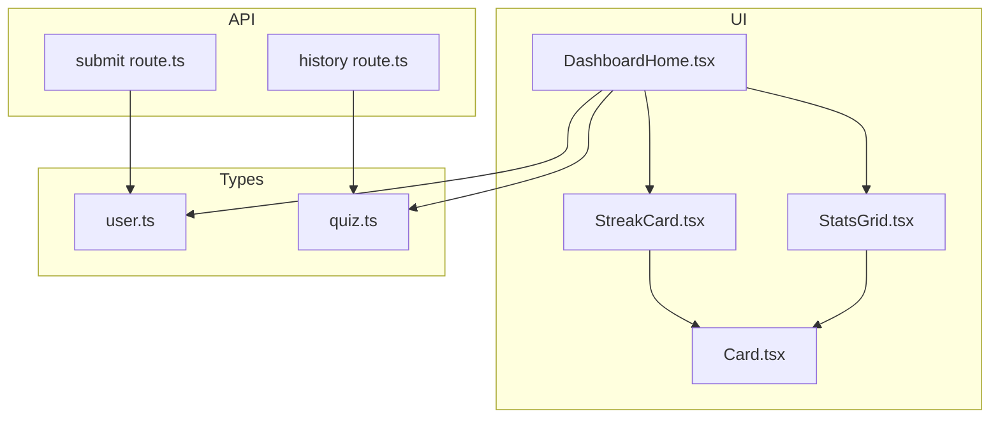
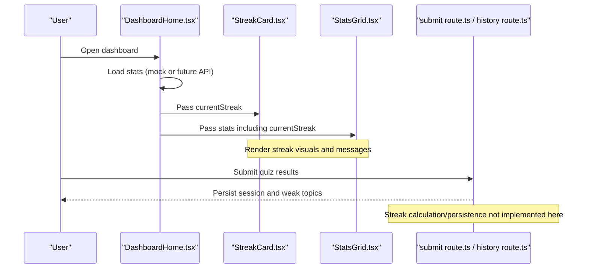
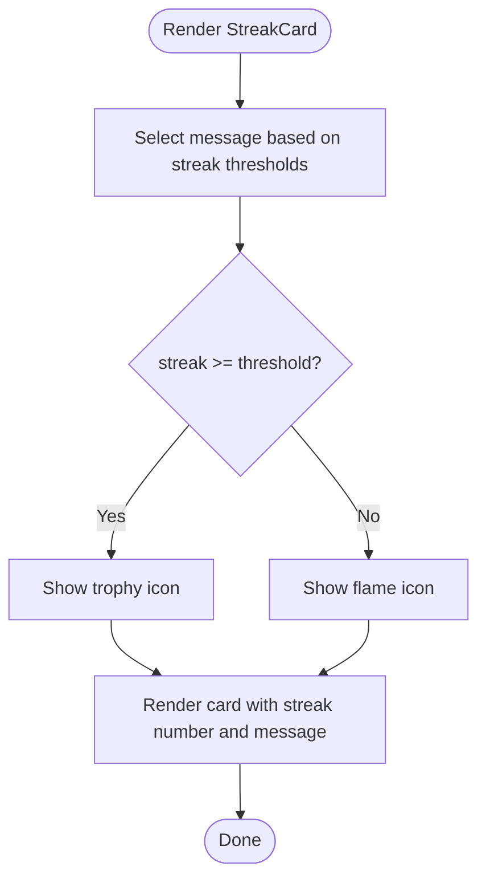
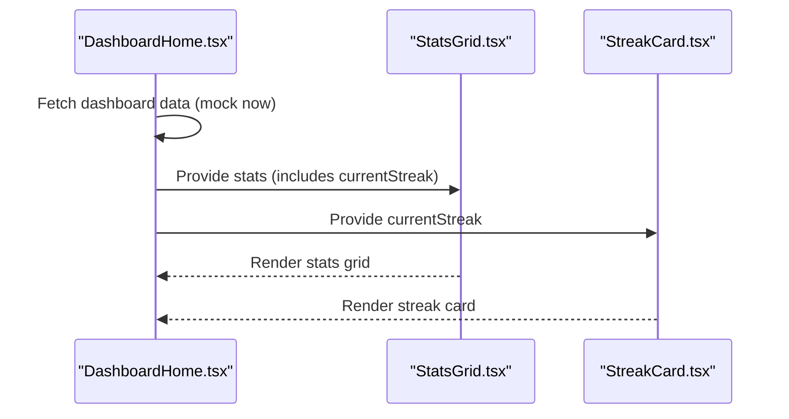
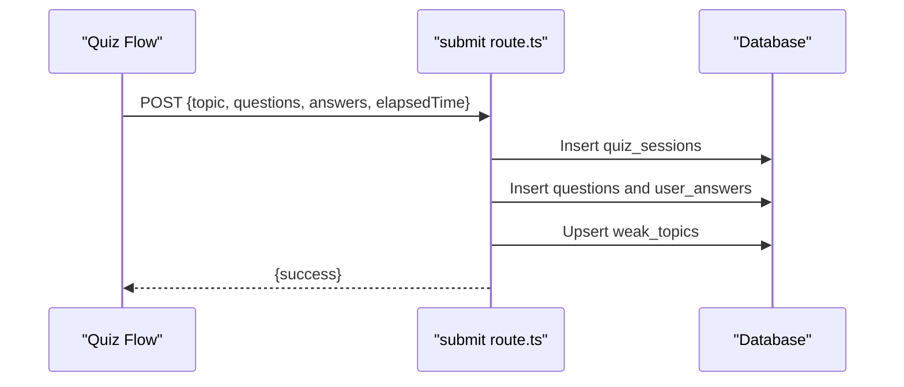
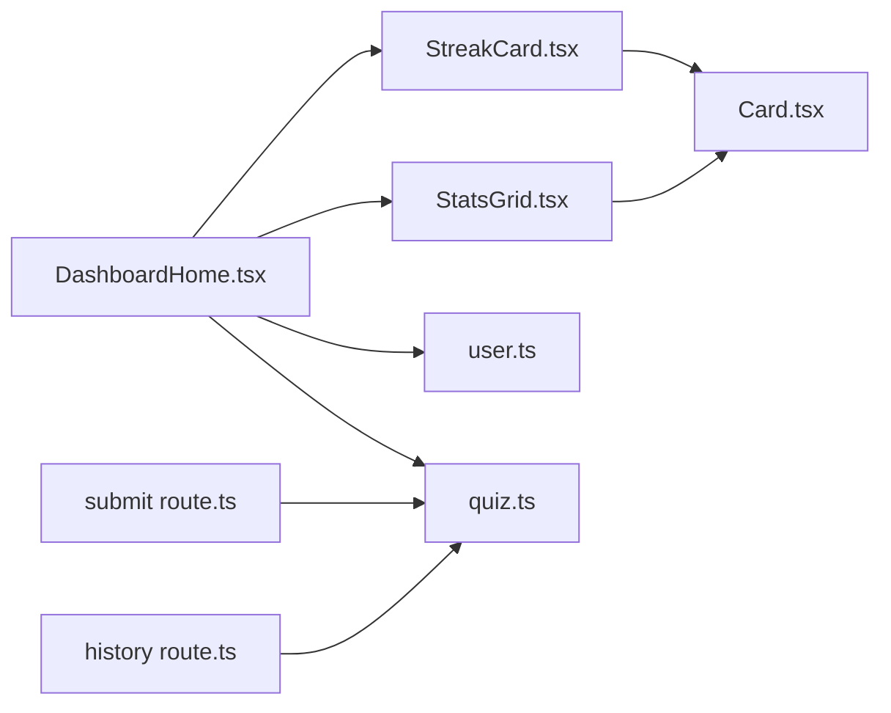

# Motivation Streak Tracker

<cite>
**Referenced Files in This Document**
- [StreakCard.tsx](file://Next-app/src/components/dashboard/StreakCard.tsx)
- [DashboardHome.tsx](file://Next-app/src/components/DashboardHome.tsx)
- [StatsGrid.tsx](file://Next-app/src/components/dashboard/StatsGrid.tsx)
- [Card.tsx](file://Next-app/src/components/ui/Card.tsx)
- [user.ts](file://Next-app/src/types/user.ts)
- [quiz.ts](file://Next-app/src/types/quiz.ts)
- [submit route.ts](file://Next-app/src/app/api/quiz/submit/route.ts)
- [history route.ts](file://Next-app/src/app/api/quiz/history/route.ts)
- [utils.ts](file://Next-app/src/lib/utils.ts)
</cite>

## Table of Contents
1. [Introduction](#introduction)
2. [Project Structure](#project-structure)
3. [Core Components](#core-components)
4. [Architecture Overview](#architecture-overview)
5. [Detailed Component Analysis](#detailed-component-analysis)
6. [Dependency Analysis](#dependency-analysis)
7. [Performance Considerations](#performance-considerations)
8. [Troubleshooting Guide](#troubleshooting-guide)
9. [Conclusion](#conclusion)
10. [Appendices](#appendices)

## Introduction
This document explains the StreakCard component that tracks and displays a user’s learning streak to motivate continued study. It covers how streaks are represented visually, how motivational messages adapt to milestones, how quiz session data integrates with the dashboard, where streak persistence is handled (or needs to be added), and how to customize themes and behavior. It also provides practical examples for extending functionality such as adding achievement badges, implementing social sharing, and customizing visuals.

## Project Structure
The streak feature spans UI components, types, and API routes:
- StreakCard renders the streak display and milestone messaging.
- DashboardHome composes the dashboard and passes current streak into StreakCard.
- StatsGrid shows a compact streak metric alongside other stats.
- Types define user stats and quiz sessions used across the app.
- API routes persist quiz sessions and can be extended to compute and store streaks.

**Diagram sources**
- [DashboardHome.tsx:1-90](file://Next-app/src/components/DashboardHome.tsx#L1-L90)
- [StreakCard.tsx:1-49](file://Next-app/src/components/dashboard/StreakCard.tsx#L1-L49)
- [StatsGrid.tsx:1-72](file://Next-app/src/components/dashboard/StatsGrid.tsx#L1-L72)
- [Card.tsx:1-25](file://Next-app/src/components/ui/Card.tsx#L1-L25)
- [user.ts:1-40](file://Next-app/src/types/user.ts#L1-L40)
- [quiz.ts:1-47](file://Next-app/src/types/quiz.ts#L1-L47)
- [submit route.ts:1-113](file://Next-app/src/app/api/quiz/submit/route.ts#L1-L113)
- [history route.ts:1-33](file://Next-app/src/app/api/quiz/history/route.ts#L1-L33)

**Section sources**
- [DashboardHome.tsx:1-90](file://Next-app/src/components/DashboardHome.tsx#L1-L90)
- [StreakCard.tsx:1-49](file://Next-app/src/components/dashboard/StreakCard.tsx#L1-L49)
- [StatsGrid.tsx:1-72](file://Next-app/src/components/dashboard/StatsGrid.tsx#L1-L72)
- [Card.tsx:1-25](file://Next-app/src/components/ui/Card.tsx#L1-L25)
- [user.ts:1-40](file://Next-app/src/types/user.ts#L1-L40)
- [quiz.ts:1-47](file://Next-app/src/types/quiz.ts#L1-L47)
- [submit route.ts:1-113](file://Next-app/src/app/api/quiz/submit/route.ts#L1-L113)
- [history route.ts:1-33](file://Next-app/src/app/api/quiz/history/route.ts#L1-L33)

## Core Components
- StreakCard: Displays the current streak count, milestone-based motivational message, and an icon that switches at a threshold.
- DashboardHome: Fetches dashboard data and passes currentStreak to StreakCard.
- StatsGrid: Shows currentStreak as part of a grid of key metrics.
- Card: Reusable container used by StreakCard and StatsGrid.
- Types: Define DashboardStats (including currentStreak) and QuizSession structures used throughout.

Key responsibilities:
- StreakCard focuses on presentation and milestone messaging only; it does not calculate streaks.
- DashboardHome orchestrates data flow and renders StreakCard with stats.currentStreak.
- StatsGrid presents streak alongside other stats for quick overview.

**Section sources**
- [StreakCard.tsx:1-49](file://Next-app/src/components/dashboard/StreakCard.tsx#L1-L49)
- [DashboardHome.tsx:1-90](file://Next-app/src/components/DashboardHome.tsx#L1-L90)
- [StatsGrid.tsx:1-72](file://Next-app/src/components/dashboard/StatsGrid.tsx#L1-L72)
- [Card.tsx:1-25](file://Next-app/src/components/ui/Card.tsx#L1-L25)
- [user.ts:1-40](file://Next-app/src/types/user.ts#L1-L40)

## Architecture Overview
At runtime:
- The dashboard fetches or uses mock data and renders StatsGrid and StreakCard.
- StreakCard receives a numeric streak and renders a gradient card with an icon and motivational message.
- Quiz submission persists session data; streak calculation and persistence are not implemented in the provided codebase.

**Diagram sources**
- [DashboardHome.tsx:1-90](file://Next-app/src/components/DashboardHome.tsx#L1-L90)
- [StreakCard.tsx:1-49](file://Next-app/src/components/dashboard/StreakCard.tsx#L1-L49)
- [StatsGrid.tsx:1-72](file://Next-app/src/components/dashboard/StatsGrid.tsx#L1-L72)
- [submit route.ts:1-113](file://Next-app/src/app/api/quiz/submit/route.ts#L1-L113)
- [history route.ts:1-33](file://Next-app/src/app/api/quiz/history/route.ts#L1-L33)

## Detailed Component Analysis

### StreakCard Component
Responsibilities:
- Accepts a numeric streak prop.
- Selects a milestone-based motivational message based on thresholds.
- Renders a gradient card with an icon that changes at a threshold.
- Displays the streak number with a localized unit label.

Visual representation:
- Gradient background and border styling via Tailwind classes.
- Icon selection: a flame icon for lower streaks and a trophy icon once a threshold is reached.
- Typography emphasizes the streak number and shows a contextual message below.

Milestone logic:
- Messages are chosen using a simple threshold function that maps ranges to predefined strings.
- Thresholds include early encouragement and longer-term achievements.

Integration points:
- Uses a shared Card component for consistent layout.
- Consumed by DashboardHome which supplies the current streak value.

Extensibility hooks:
- Add new thresholds and messages to expand milestone coverage.
- Swap icons or add animations when crossing thresholds.
- Integrate with theme tokens for colors and gradients.

**Diagram sources**
- [StreakCard.tsx:17-48](file://Next-app/src/components/dashboard/StreakCard.tsx#L17-L48)

**Section sources**
- [StreakCard.tsx:1-49](file://Next-app/src/components/dashboard/StreakCard.tsx#L1-L49)
- [Card.tsx:1-25](file://Next-app/src/components/ui/Card.tsx#L1-L25)

### Dashboard Integration
- DashboardHome composes the dashboard and passes stats.currentStreak to StreakCard.
- StatsGrid displays currentStreak as one of four primary metrics.
- Data fetching currently uses a placeholder function returning mock values; this is where real API integration would occur.

**Diagram sources**
- [DashboardHome.tsx:1-90](file://Next-app/src/components/DashboardHome.tsx#L1-L90)
- [StatsGrid.tsx:1-72](file://Next-app/src/components/dashboard/StatsGrid.tsx#L1-L72)
- [StreakCard.tsx:1-49](file://Next-app/src/components/dashboard/StreakCard.tsx#L1-L49)

**Section sources**
- [DashboardHome.tsx:1-90](file://Next-app/src/components/DashboardHome.tsx#L1-L90)
- [StatsGrid.tsx:1-72](file://Next-app/src/components/dashboard/StatsGrid.tsx#L1-L72)

### Quiz Session Data and Persistence
- Quiz submissions insert session records and answers into the database via the submit route.
- Weak topics are tracked per session.
- History retrieval returns recent sessions ordered by start time.
- Streak calculation and persistence are not present in the provided code; they should be added to the server-side logic after successful submissions or computed client-side from session history.

**Diagram sources**
- [submit route.ts:1-113](file://Next-app/src/app/api/quiz/submit/route.ts#L1-L113)

**Section sources**
- [submit route.ts:1-113](file://Next-app/src/app/api/quiz/submit/route.ts#L1-L113)
- [history route.ts:1-33](file://Next-app/src/app/api/quiz/history/route.ts#L1-L33)
- [quiz.ts:1-47](file://Next-app/src/types/quiz.ts#L1-L47)

### Types and Data Models
- DashboardStats includes currentStreak, quizzesTaken, accuracy, and topicsMastered.
- QuizSession captures session metadata like topic, questionCount, score, accuracy, and timestamps.
- These types guide how streak data flows through the application and what fields are available for computation.

**Section sources**
- [user.ts:1-40](file://Next-app/src/types/user.ts#L1-L40)
- [quiz.ts:1-47](file://Next-app/src/types/quiz.ts#L1-L47)

## Dependency Analysis
- StreakCard depends on:
  - Card for layout
  - Icons for visual cues
  - Props for streak value
- DashboardHome depends on:
  - StreakCard and StatsGrid for rendering
  - Types for data contracts
- API routes depend on:
  - Supabase client for persistence
  - Types for request/response shapes

**Diagram sources**
- [StreakCard.tsx:1-49](file://Next-app/src/components/dashboard/StreakCard.tsx#L1-L49)
- [DashboardHome.tsx:1-90](file://Next-app/src/components/DashboardHome.tsx#L1-L90)
- [StatsGrid.tsx:1-72](file://Next-app/src/components/dashboard/StatsGrid.tsx#L1-L72)
- [Card.tsx:1-25](file://Next-app/src/components/ui/Card.tsx#L1-L25)
- [user.ts:1-40](file://Next-app/src/types/user.ts#L1-L40)
- [quiz.ts:1-47](file://Next-app/src/types/quiz.ts#L1-L47)
- [submit route.ts:1-113](file://Next-app/src/app/api/quiz/submit/route.ts#L1-L113)
- [history route.ts:1-33](file://Next-app/src/app/api/quiz/history/route.ts#L1-L33)

**Section sources**
- [StreakCard.tsx:1-49](file://Next-app/src/components/dashboard/StreakCard.tsx#L1-L49)
- [DashboardHome.tsx:1-90](file://Next-app/src/components/DashboardHome.tsx#L1-L90)
- [StatsGrid.tsx:1-72](file://Next-app/src/components/dashboard/StatsGrid.tsx#L1-L72)
- [Card.tsx:1-25](file://Next-app/src/components/ui/Card.tsx#L1-L25)
- [user.ts:1-40](file://Next-app/src/types/user.ts#L1-L40)
- [quiz.ts:1-47](file://Next-app/src/types/quiz.ts#L1-L47)
- [submit route.ts:1-113](file://Next-app/src/app/api/quiz/submit/route.ts#L1-L113)
- [history route.ts:1-33](file://Next-app/src/app/api/quiz/history/route.ts#L1-L33)

## Performance Considerations
- StreakCard is lightweight and stateless; performance impact is minimal.
- Avoid heavy computations inside render paths; keep streak calculation on the server or in a memoized hook if moved client-side.
- Use efficient date comparisons and avoid unnecessary re-renders by stabilizing props and data fetching keys.
- Batch updates to streak-related state to prevent excessive UI refreshes.

[No sources needed since this section provides general guidance]

## Troubleshooting Guide
Common issues and resolutions:
- Streak not updating: Ensure the dashboard fetches real data and passes currentStreak correctly to StreakCard. Currently, the dashboard uses mock data; integrate with a backend to supply accurate stats.
- Incorrect milestone messages: Verify threshold logic and ensure new milestones are added consistently in both message mapping and any conditional rendering.
- Icon not switching: Confirm the threshold condition matches the intended milestone and that the correct icon is rendered for each range.
- Quiz submission errors: Check authentication and network responses from the submit route; review error handling and logging.

**Section sources**
- [DashboardHome.tsx:1-90](file://Next-app/src/components/DashboardHome.tsx#L1-L90)
- [StreakCard.tsx:1-49](file://Next-app/src/components/dashboard/StreakCard.tsx#L1-L49)
- [submit route.ts:1-113](file://Next-app/src/app/api/quiz/submit/route.ts#L1-L113)

## Conclusion
StreakCard provides a focused, motivational display of a user’s learning streak with milestone-based messages and adaptive icons. While the component itself is complete and clean, streak calculation and persistence are not implemented in the provided codebase. To fully realize the motivation tracker, extend the API layer to compute and store streaks based on quiz session history, and wire the dashboard to fetch and display updated streak values. With these additions, you can unlock advanced features like animations, badges, and social sharing.

[No sources needed since this section summarizes without analyzing specific files]

## Appendices

### How to Modify Streak Rules
- Add or adjust thresholds and messages in the component’s message mapping to reflect new milestone targets.
- Update icon thresholds to align with new rules.
- If moving calculation client-side, implement a function that computes consecutive active days from session history and exposes it as a prop.

**Section sources**
- [StreakCard.tsx:8-24](file://Next-app/src/components/dashboard/StreakCard.tsx#L8-L24)

### Adding Achievement Badges
- Extend the component to accept a list of earned milestones and render badge indicators beneath the streak number.
- Use existing UI primitives (e.g., Badge) to show completed milestones.
- Compute badges from streak thresholds or from explicit achievement events stored in the database.

[No sources needed since this section proposes enhancements without analyzing specific files]

### Implementing Social Sharing Features
- Add a share button that constructs a message including the current streak and a link to the dashboard.
- Use platform APIs (e.g., Web Share API) or generate shareable URLs with query parameters indicating streak achievements.
- Respect privacy settings and allow users to opt out of sharing.

[No sources needed since this section proposes enhancements without analyzing specific files]

### Customizing Visual Presentation
- Adjust gradient colors and borders via Tailwind classes to match brand themes.
- Replace icons with custom SVGs or use different icon sets.
- Introduce subtle animations (e.g., pulse or scale) when crossing milestones using CSS transitions or animation libraries.

**Section sources**
- [StreakCard.tsx:29-46](file://Next-app/src/components/dashboard/StreakCard.tsx#L29-L46)

### Integrating Streak Calculation with Quiz Sessions
- On successful quiz submission, record the date and mark the day as active.
- Compute the current streak by counting consecutive active days up to today.
- Store the computed streak in a user profile field or derive it from session history on read.
- Expose currentStreak in the dashboard stats so StreakCard can render accurately.

**Section sources**
- [submit route.ts:1-113](file://Next-app/src/app/api/quiz/submit/route.ts#L1-L113)
- [history route.ts:1-33](file://Next-app/src/app/api/quiz/history/route.ts#L1-L33)
- [user.ts:34-39](file://Next-app/src/types/user.ts#L34-L39)
- [quiz.ts:18-27](file://Next-app/src/types/quiz.ts#L18-L27)