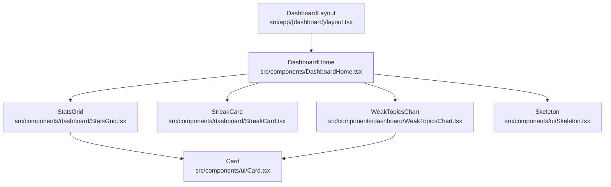
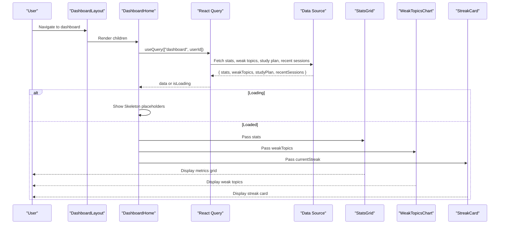
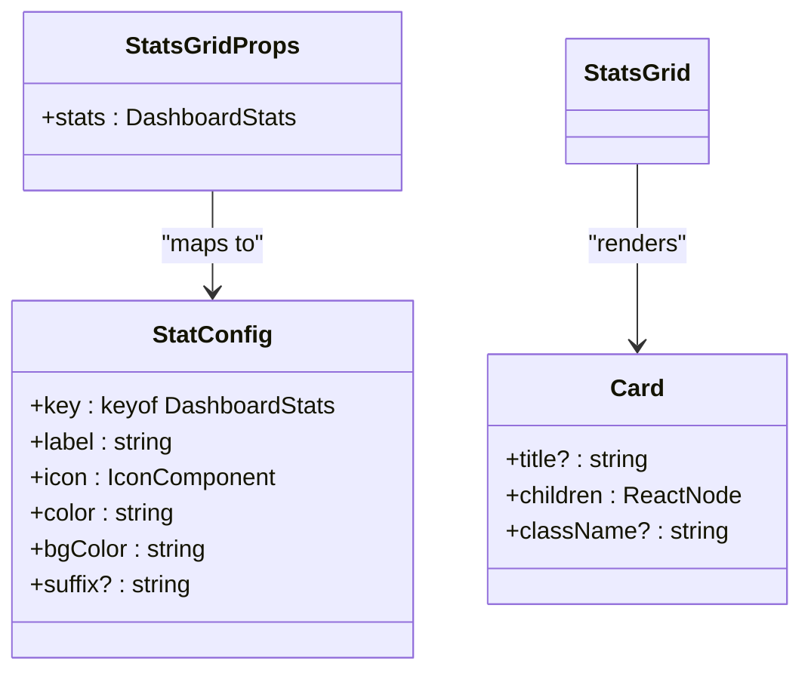
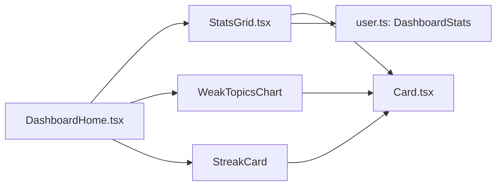

# Performance Metrics Grid

<cite>
**Referenced Files in This Document**
- [StatsGrid.tsx](file://src/components/dashboard/StatsGrid.tsx)
- [DashboardHome.tsx](file://src/components/DashboardHome.tsx)
- [user.ts](file://src/types/user.ts)
- [Card.tsx](file://src/components/ui/Card.tsx)
- [utils.ts](file://src/lib/utils.ts)
- [Progress.tsx](file://src/components/ui/Progress.tsx)
- [WeakTopicsChart.tsx](file://src/components/dashboard/WeakTopicsChart.tsx)
- [StreakCard.tsx](file://src/components/dashboard/StreakCard.tsx)
- [layout.tsx](file://src/app/(dashboard)/layout.tsx)
</cite>

## Table of Contents
1. [Introduction](#introduction)
2. [Project Structure](#project-structure)
3. [Core Components](#core-components)
4. [Architecture Overview](#architecture-overview)
5. [Detailed Component Analysis](#detailed-component-analysis)
6. [Dependency Analysis](#dependency-analysis)
7. [Performance Considerations](#performance-considerations)
8. [Troubleshooting Guide](#troubleshooting-guide)
9. [Conclusion](#conclusion)
10. [Appendices](#appendices)

## Introduction
This document provides comprehensive documentation for the StatsGrid component that displays key performance metrics on the dashboard: quizzes taken, accuracy percentage, current streak, and topics mastered. It explains the grid layout implementation, responsive design patterns, animation effects for metric updates, data visualization techniques, props interface, styling customization options, accessibility features, and integration with dashboard data sources. It also includes examples for adding new metric cards, customizing chart types, and implementing real-time metric updates.

## Project Structure
The StatsGrid is part of a Next.js application organized by feature directories. The dashboard page composes multiple components including StatsGrid, StreakCard, WeakTopicsChart, and StudyPlanPreview. Data is fetched via React Query and rendered conditionally with skeleton placeholders during loading.

**Diagram sources**
- [layout.tsx:12-62](file://src/app/(dashboard)/layout.tsx#L12-L62)
- [DashboardHome.tsx:33-89](file://src/components/DashboardHome.tsx#L33-L89)
- [StatsGrid.tsx:47-71](file://src/components/dashboard/StatsGrid.tsx#L47-L71)
- [Card.tsx:10-24](file://src/components/ui/Card.tsx#L10-L24)
- [WeakTopicsChart.tsx:8-50](file://src/components/dashboard/WeakTopicsChart.tsx#L8-L50)
- [StreakCard.tsx:26-48](file://src/components/dashboard/StreakCard.tsx#L26-L48)
- [Skeleton.tsx:9-54](file://src/components/ui/Skeleton.tsx#L9-L54)

**Section sources**
- [layout.tsx:12-62](file://src/app/(dashboard)/layout.tsx#L12-L62)
- [DashboardHome.tsx:33-89](file://src/components/DashboardHome.tsx#L33-L89)

## Core Components
- StatsGrid: Renders a responsive grid of metric cards using a configuration array to map keys, labels, icons, colors, and optional suffixes to the DashboardStats data.
- Card: Reusable container providing consistent padding, border, background, and shadow styles.
- DashboardHome: Orchestrates data fetching with React Query, shows skeletons while loading, and composes StatsGrid with other dashboard widgets.
- StreakCard: Displays current streak with contextual messages and conditional iconography.
- WeakTopicsChart: Visualizes weak topics as horizontal progress bars with error rates.
- Progress: Accessible progress bar with animated transitions and ARIA attributes.
- utils: Utility functions including calculateAccuracy for computing percentages.

Key responsibilities:
- StatsGrid focuses purely on presentation and mapping stats to UI.
- DashboardHome handles data flow and state (loading vs loaded).
- Card standardizes visual structure across metric cards.
- StreakCard and WeakTopicsChart provide complementary insights beyond the core metrics.

**Section sources**
- [StatsGrid.tsx:10-71](file://src/components/dashboard/StatsGrid.tsx#L10-L71)
- [Card.tsx:4-24](file://src/components/ui/Card.tsx#L4-L24)
- [DashboardHome.tsx:15-89](file://src/components/DashboardHome.tsx#L15-L89)
- [StreakCard.tsx:4-48](file://src/components/dashboard/StreakCard.tsx#L4-L48)
- [WeakTopicsChart.tsx:4-50](file://src/components/dashboard/WeakTopicsChart.tsx#L4-L50)
- [Progress.tsx:3-50](file://src/components/ui/Progress.tsx#L3-L50)
- [utils.ts:23-26](file://src/lib/utils.ts#L23-L26)

## Architecture Overview
The dashboard architecture follows a unidirectional data flow:
- Layout ensures authentication and renders main content area.
- DashboardHome fetches dashboard data using React Query and passes it down to child components.
- StatsGrid consumes DashboardStats and renders metric cards based on a static configuration.
- Supporting components visualize related information (streak, weak topics).

**Diagram sources**
- [layout.tsx:12-62](file://src/app/(dashboard)/layout.tsx#L12-L62)
- [DashboardHome.tsx:22-89](file://src/components/DashboardHome.tsx#L22-L89)
- [StatsGrid.tsx:47-71](file://src/components/dashboard/StatsGrid.tsx#L47-L71)
- [WeakTopicsChart.tsx:8-50](file://src/components/dashboard/WeakTopicsChart.tsx#L8-L50)
- [StreakCard.tsx:26-48](file://src/components/dashboard/StreakCard.tsx#L26-L48)

## Detailed Component Analysis

### StatsGrid Component
StatsGrid renders a responsive grid of metric cards derived from a configuration array. Each stat defines:
- key: maps to a field in DashboardStats
- label: localized display text
- icon: Lucide icon component
- color: text color class
- bgColor: icon background class
- suffix: optional unit string appended to the value

Layout and responsiveness:
- Uses CSS grid with two columns on small screens and four columns on large screens.
- Cards are flex containers aligning icon and text vertically centered.

Accessibility:
- Icons convey meaning but do not include aria-labels; consider adding descriptive labels for screen readers if needed.
- Values are plain text; ensure contrast ratios meet WCAG guidelines.

Animation:
- No built-in animations for metric updates; can be enhanced with transition utilities or libraries.

Integration:
- Consumes DashboardStats passed from DashboardHome.
- Relies on Card for consistent container styling.

Extensibility:
- Add new metrics by extending statConfig with a new entry and ensuring DashboardStats includes the corresponding field.

**Diagram sources**
- [StatsGrid.tsx:10-71](file://src/components/dashboard/StatsGrid.tsx#L10-L71)
- [Card.tsx:4-24](file://src/components/ui/Card.tsx#L4-L24)
- [user.ts:34-39](file://src/types/user.ts#L34-L39)

**Section sources**
- [StatsGrid.tsx:10-71](file://src/components/dashboard/StatsGrid.tsx#L10-L71)
- [Card.tsx:4-24](file://src/components/ui/Card.tsx#L4-L24)
- [user.ts:34-39](file://src/types/user.ts#L34-L39)

### DashboardHome Integration
DashboardHome:
- Uses React Query to fetch dashboard data keyed by user id.
- Shows skeleton placeholders while loading.
- Composes StatsGrid, WeakTopicsChart, StudyPlanPreview, and StreakCard.

Data flow:
- Mock data is used in the current implementation; replace with actual API calls to integrate backend data.

Loading states:
- Skeleton placeholders mimic the shape of the stats grid and charts to improve perceived performance.

**Section sources**
- [DashboardHome.tsx:15-89](file://src/components/DashboardHome.tsx#L15-L89)

### StreakCard
StreakCard:
- Displays current streak with contextual motivational messages based on thresholds.
- Switches between flame and trophy icons depending on streak length.

Customization:
- Messages are defined in a lookup table; extend thresholds and messages as needed.

**Section sources**
- [StreakCard.tsx:4-48](file://src/components/dashboard/StreakCard.tsx#L4-L48)

### WeakTopicsChart
WeakTopicsChart:
- Visualizes top weak topics with horizontal progress bars indicating total attempts relative to the maximum.
- Computes error rate per topic and displays incorrect counts.

Accessibility:
- Bars are visual indicators; consider adding ARIA roles and labels for assistive technologies if interactive.

**Section sources**
- [WeakTopicsChart.tsx:4-50](file://src/components/dashboard/WeakTopicsChart.tsx#L4-L50)

### Progress Component
Progress:
- Provides an accessible progress bar with smooth transitions and ARIA attributes.
- Can be reused to animate metric values or show completion status.

**Section sources**
- [Progress.tsx:3-50](file://src/components/ui/Progress.tsx#L3-L50)

### Utilities
calculateAccuracy:
- Computes percentage accuracy given correct and total counts.
- Useful for deriving accuracy metric when only raw counts are available.

**Section sources**
- [utils.ts:23-26](file://src/lib/utils.ts#L23-L26)

## Dependency Analysis
StatsGrid depends on:
- Card for container styling
- DashboardStats type for prop contract
- Lucide icons for visual cues
- Tailwind utility classes for layout and styling

DashboardHome depends on:
- React Query for data fetching and caching
- Auth hook for user context
- Other dashboard components for composition

**Diagram sources**
- [StatsGrid.tsx:1-71](file://src/components/dashboard/StatsGrid.tsx#L1-71)
- [DashboardHome.tsx:1-89](file://src/components/DashboardHome.tsx#L1-L89)
- [Card.tsx:1-24](file://src/components/ui/Card.tsx#L1-L24)
- [user.ts:34-39](file://src/types/user.ts#L34-L39)
- [WeakTopicsChart.tsx:1-50](file://src/components/dashboard/WeakTopicsChart.tsx#L1-L50)
- [StreakCard.tsx:1-48](file://src/components/dashboard/StreakCard.tsx#L1-L48)

**Section sources**
- [StatsGrid.tsx:1-71](file://src/components/dashboard/StatsGrid.tsx#L1-L71)
- [DashboardHome.tsx:1-89](file://src/components/DashboardHome.tsx#L1-L89)
- [Card.tsx:1-24](file://src/components/ui/Card.tsx#L1-L24)
- [user.ts:34-39](file://src/types/user.ts#L34-L39)

## Performance Considerations
- Rendering efficiency: StatsGrid uses a static configuration array to render cards, minimizing re-renders and keeping logic simple.
- Responsive layout: CSS grid adapts to screen size without JavaScript overhead.
- Loading experience: Skeleton placeholders reduce perceived latency during data fetch.
- Animations: Use lightweight CSS transitions (e.g., duration-500 ease-out) for value changes to avoid heavy animation libraries.
- Data fetching: React Query caches results; ensure query keys include user id to prevent stale data.

[No sources needed since this section provides general guidance]

## Troubleshooting Guide
Common issues and resolutions:
- Missing stats fields: Ensure DashboardStats includes all keys referenced in statConfig. If a field is undefined, the card will render empty; add default values or guard against undefined.
- Incorrect accuracy calculation: Use calculateAccuracy to derive accuracy from correct and total counts before passing to StatsGrid.
- Accessibility gaps: Add aria-labels to icons or wrap them in accessible containers if they convey essential information.
- Loading states: Verify that skeletons match the final layout to avoid layout shifts when data loads.

**Section sources**
- [StatsGrid.tsx:14-71](file://src/components/dashboard/StatsGrid.tsx#L14-L71)
- [utils.ts:23-26](file://src/lib/utils.ts#L23-L26)
- [DashboardHome.tsx:44-58](file://src/components/DashboardHome.tsx#L44-L58)

## Conclusion
StatsGrid provides a clean, configurable, and responsive way to present key performance metrics on the dashboard. Its design leverages a configuration-driven approach for easy extensibility, integrates seamlessly with shared UI primitives, and supports future enhancements such as animations and accessibility improvements. DashboardHome orchestrates data flow and composes related components to deliver a cohesive user experience.

[No sources needed since this section summarizes without analyzing specific files]

## Appendices

### Props Interface
StatsGrid accepts:
- stats: DashboardStats object containing quizzesTaken, accuracy, currentStreak, topicsMastered

DashboardStats fields:
- quizzesTaken: number
- accuracy: number
- currentStreak: number
- topicsMastered: number

**Section sources**
- [StatsGrid.tsx:10-12](file://src/components/dashboard/StatsGrid.tsx#L10-L12)
- [user.ts:34-39](file://src/types/user.ts#L34-L39)

### Adding a New Metric Card
Steps:
- Extend DashboardStats with a new numeric field.
- Add a new entry to statConfig in StatsGrid with key, label, icon, color, bgColor, and optional suffix.
- Update DashboardHome to include the new field in fetched data.

Example references:
- Extending config: [StatsGrid.tsx:14-45](file://src/components/dashboard/StatsGrid.tsx#L14-L45)
- Updating stats type: [user.ts:34-39](file://src/types/user.ts#L34-L39)
- Passing data: [DashboardHome.tsx:60-89](file://src/components/DashboardHome.tsx#L60-L89)

**Section sources**
- [StatsGrid.tsx:14-45](file://src/components/dashboard/StatsGrid.tsx#L14-L45)
- [user.ts:34-39](file://src/types/user.ts#L34-L39)
- [DashboardHome.tsx:60-89](file://src/components/DashboardHome.tsx#L60-L89)

### Customizing Chart Types
Options:
- Replace WeakTopicsChart with a different visualization (e.g., pie chart) by swapping the component in DashboardHome.
- Use Progress for simple linear indicators or build custom SVG-based charts.

References:
- Chart composition: [DashboardHome.tsx:78-85](file://src/components/DashboardHome.tsx#L78-L85)
- Progress usage: [Progress.tsx:3-50](file://src/components/ui/Progress.tsx#L3-L50)

**Section sources**
- [DashboardHome.tsx:78-85](file://src/components/DashboardHome.tsx#L78-L85)
- [Progress.tsx:3-50](file://src/components/ui/Progress.tsx#L3-L50)

### Implementing Real-Time Metric Updates
Approach:
- Use React Query polling or WebSocket subscriptions to refresh dashboard data periodically.
- Animate value changes using CSS transitions or lightweight animation libraries.
- Leverage Progress for smooth transitions when updating percentages.

References:
- Data fetching setup: [DashboardHome.tsx:33-39](file://src/components/DashboardHome.tsx#L33-L39)
- Animated progress: [Progress.tsx:28-42](file://src/components/ui/Progress.tsx#L28-L42)

**Section sources**
- [DashboardHome.tsx:33-39](file://src/components/DashboardHome.tsx#L33-L39)
- [Progress.tsx:28-42](file://src/components/ui/Progress.tsx#L28-L42)