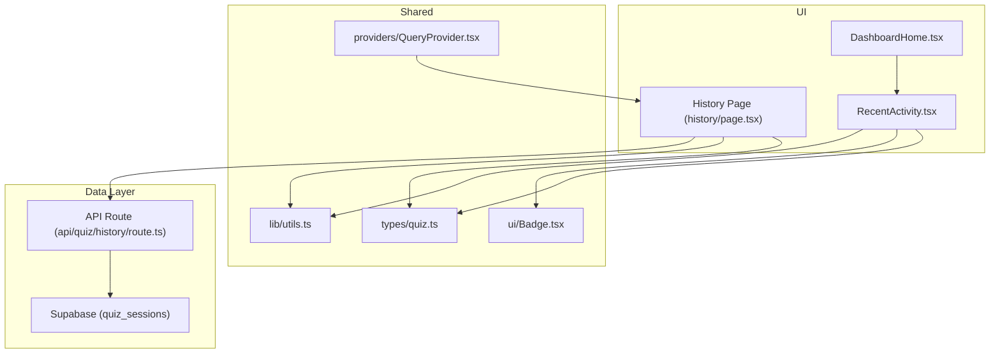
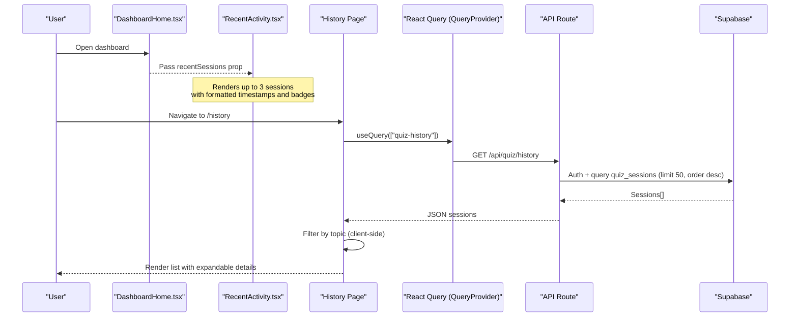
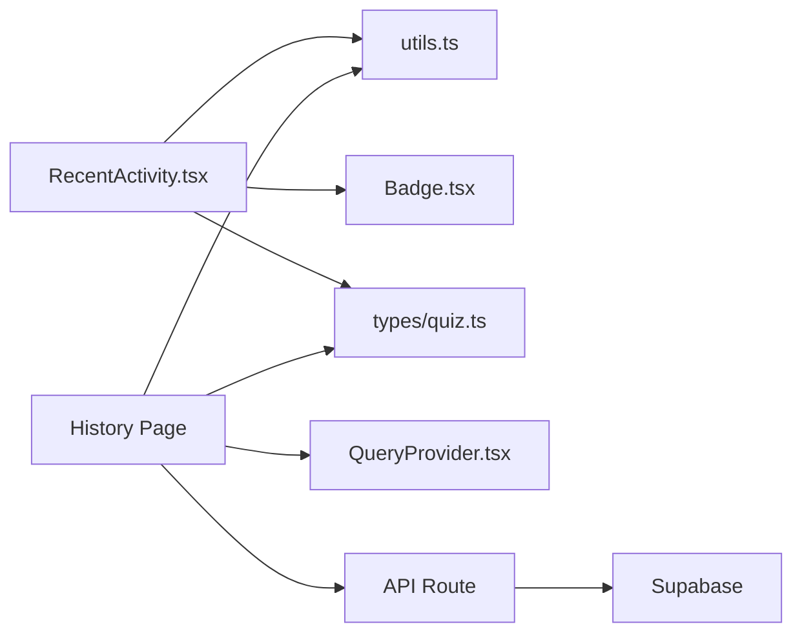

# Recent Activity Feed

<cite>
**Referenced Files in This Document**
- [RecentActivity.tsx](file://Next-app/src/components/dashboard/RecentActivity.tsx)
- [history page.tsx](file://Next-app/src/app/(dashboard)/history/page.tsx)
- [quiz history route.ts](file://Next-app/src/app/api/quiz/history/route.ts)
- [quiz types.ts](file://Next-app/src/types/quiz.ts)
- [utils.ts](file://Next-app/src/lib/utils.ts)
- [DashboardHome.tsx](file://Next-app/src/components/DashboardHome.tsx)
- [Badge.tsx](file://Next-app/src/components/ui/Badge.tsx)
- [QueryProvider.tsx](file://Next-app/src/providers/QueryProvider.tsx)
</cite>

## Table of Contents
1. [Introduction](#introduction)
2. [Project Structure](#project-structure)
3. [Core Components](#core-components)
4. [Architecture Overview](#architecture-overview)
5. [Detailed Component Analysis](#detailed-component-analysis)
6. [Dependency Analysis](#dependency-analysis)
7. [Performance Considerations](#performance-considerations)
8. [Troubleshooting Guide](#troubleshooting-guide)
9. [Conclusion](#conclusion)
10. [Appendices](#appendices)

## Introduction
This document explains the RecentActivity component and its surrounding data flow for displaying a user’s recent quiz sessions and activities. It covers how activity items are rendered, how timestamps are formatted, how performance-based categories are applied, and how navigation integrates with the full history view. It also documents current data fetching patterns, filtering options, search capabilities (or lack thereof), and provides guidance on extending the system to support pagination/infinite scroll, real-time updates, analytics tracking, and customizing item layouts.

## Project Structure
The RecentActivity feature spans a small set of focused files:
- A presentational component that renders a compact list of recent sessions
- A full history page that fetches, filters, and expands session details
- An API route that retrieves the authenticated user’s quiz sessions from the database
- Shared types and utilities for formatting and calculations
- A dashboard home that composes the RecentActivity component into the main layout

**Diagram sources**
- [DashboardHome.tsx:83-86](file://Next-app/src/components/DashboardHome.tsx#L83-L86)
- [RecentActivity.tsx:1-68](file://Next-app/src/components/dashboard/RecentActivity.tsx#L1-L68)
- [history page.tsx:16-29](file://Next-app/src/app/(dashboard)/history/page.tsx#L16-L29)
- [quiz history route.ts:4-20](file://Next-app/src/app/api/quiz/history/route.ts#L4-L20)
- [quiz types.ts:18-27](file://Next-app/src/types/quiz.ts#L18-L27)
- [utils.ts:8-15](file://Next-app/src/lib/utils.ts#L8-L15)
- [Badge.tsx:1-35](file://Next-app/src/components/ui/Badge.tsx#L1-L35)
- [QueryProvider.tsx:6-22](file://Next-app/src/providers/QueryProvider.tsx#L6-L22)

**Section sources**
- [DashboardHome.tsx:83-86](file://Next-app/src/components/DashboardHome.tsx#L83-L86)
- [RecentActivity.tsx:1-68](file://Next-app/src/components/dashboard/RecentActivity.tsx#L1-L68)
- [history page.tsx:16-29](file://Next-app/src/app/(dashboard)/history/page.tsx#L16-L29)
- [quiz history route.ts:4-20](file://Next-app/src/app/api/quiz/history/route.ts#L4-L20)
- [quiz types.ts:18-27](file://Next-app/src/types/quiz.ts#L18-L27)
- [utils.ts:8-15](file://Next-app/src/lib/utils.ts#L8-L15)
- [Badge.tsx:1-35](file://Next-app/src/components/ui/Badge.tsx#L1-L35)
- [QueryProvider.tsx:6-22](file://Next-app/src/providers/QueryProvider.tsx#L6-L22)

## Core Components
- RecentActivity: Renders up to three most recent quiz sessions with topic, timestamp, accuracy badge, and score summary. Provides a link to the full history when more than three sessions exist.
- History Page: Fetches all sessions via React Query, supports topic filtering, and allows expanding each session to show detailed metrics.
- API Route: Authenticates the user and returns their quiz sessions ordered by start time descending, limited to 50 records.
- Utilities and Types: Provide date formatting, accuracy calculation, and shared data structures for sessions.

Key behaviors:
- Activity feed rendering: Maps over a slice of sessions to render compact cards with consistent styling.
- Timestamp formatting: Uses a locale-aware formatter for human-readable dates.
- Activity type categorization: Applies success/warning/error variants based on accuracy thresholds.
- Navigation integration: Links to the full history page for deeper exploration.

**Section sources**
- [RecentActivity.tsx:11-67](file://Next-app/src/components/dashboard/RecentActivity.tsx#L11-L67)
- [history page.tsx:22-70](file://Next-app/src/app/(dashboard)/history/page.tsx#L22-L70)
- [quiz history route.ts:4-27](file://Next-app/src/app/api/quiz/history/route.ts#L4-L27)
- [utils.ts:8-26](file://Next-app/src/lib/utils.ts#L8-L26)
- [quiz types.ts:18-27](file://Next-app/src/types/quiz.ts#L18-L27)

## Architecture Overview
The data flow begins at the UI layer and ends at the database, with caching and authentication handled along the way.

**Diagram sources**
- [DashboardHome.tsx:83-86](file://Next-app/src/components/DashboardHome.tsx#L83-L86)
- [RecentActivity.tsx:31-64](file://Next-app/src/components/dashboard/RecentActivity.tsx#L31-L64)
- [history page.tsx:16-29](file://Next-app/src/app/(dashboard)/history/page.tsx#L16-L29)
- [quiz history route.ts:4-27](file://Next-app/src/app/api/quiz/history/route.ts#L4-L27)
- [QueryProvider.tsx:6-22](file://Next-app/src/providers/QueryProvider.tsx#L6-L22)

## Detailed Component Analysis

### RecentActivity Component
Responsibilities:
- Accepts an array of QuizSession objects
- Displays up to three most recent sessions
- Formats timestamps using a locale-aware utility
- Categorizes performance using accuracy thresholds and Badge variants
- Navigates to the full history when more than three sessions exist

Rendering logic:
- Empty state shows a call-to-action to take the first quiz
- Each session card shows topic, formatted start date, accuracy badge, and score summary
- When sessions.length > 3, a “View full history” link is shown

Categorization rules:
- Success: accuracy >= 70%
- Warning: 40% <= accuracy < 70%
- Error: accuracy < 40%

Navigation:
- Links to /history for full session list

Accessibility and UX:
- Consistent spacing and alignment
- Right-to-left content areas explicitly set to left-to-right for numeric values

Extensibility points:
- Add new activity types by introducing a new field in the session model and mapping it to Badge variants or icons
- Customize item layout by adjusting the card structure and styles within the map loop

**Section sources**
- [RecentActivity.tsx:7-67](file://Next-app/src/components/dashboard/RecentActivity.tsx#L7-L67)
- [utils.ts:8-15](file://Next-app/src/lib/utils.ts#L8-L15)
- [Badge.tsx:1-35](file://Next-app/src/components/ui/Badge.tsx#L1-L35)

### History Page
Responsibilities:
- Fetches all quiz sessions for the authenticated user
- Supports client-side filtering by topic
- Allows expanding individual sessions to view detailed metrics

Data fetching:
- Uses React Query with a stable query key to cache results
- Handles loading state with a spinner

Filtering:
- Builds a unique topics list from fetched sessions
- Filters sessions client-side based on selected topic

Expansion:
- Toggles expanded state per session to reveal additional stats like total questions, correct answers, and completion time

Search functionality:
- Not implemented; only topic filter exists

Pagination or infinite scroll:
- Not implemented; the API limits results to 50 rows

Real-time updates:
- Not implemented; relies on static queries

Analytics tracking:
- Not implemented in this page

**Section sources**
- [history page.tsx:16-70](file://Next-app/src/app/(dashboard)/history/page.tsx#L16-L70)
- [history page.tsx:72-175](file://Next-app/src/app/(dashboard)/history/page.tsx#L72-L175)

### API Route
Responsibilities:
- Authenticates the request using Supabase
- Retrieves the user’s quiz sessions, ordered by start time descending, limited to 50
- Returns an empty array on errors

Error handling:
- Unauthorized responses return a localized error message
- Database errors are logged and result in an empty array response

Security:
- Ensures only the authenticated user’s own sessions are returned

**Section sources**
- [quiz history route.ts:4-31](file://Next-app/src/app/api/quiz/history/route.ts#L4-L31)

### Data Models and Utilities
Types:
- QuizSession defines the shape of a session including id, userId, topic, questionCount, score, accuracy, startedAt, completedAt

Utilities:
- formatDate formats dates using a locale-aware method
- calculateAccuracy computes percentage from correct and total counts

Usage:
- RecentActivity and History Page both use formatDate for consistent display
- Accuracy thresholds drive Badge variant selection

**Section sources**
- [quiz types.ts:18-27](file://Next-app/src/types/quiz.ts#L18-L27)
- [utils.ts:8-26](file://Next-app/src/lib/utils.ts#L8-L26)

### Dashboard Integration
- DashboardHome composes RecentActivity into the main dashboard grid
- It currently uses mock data for recent sessions; replace with live data if needed

**Section sources**
- [DashboardHome.tsx:83-86](file://Next-app/src/components/DashboardHome.tsx#L83-L86)

## Dependency Analysis

**Diagram sources**
- [RecentActivity.tsx:1-68](file://Next-app/src/components/dashboard/RecentActivity.tsx#L1-L68)
- [history page.tsx:16-29](file://Next-app/src/app/(dashboard)/history/page.tsx#L16-L29)
- [quiz history route.ts:4-20](file://Next-app/src/app/api/quiz/history/route.ts#L4-L20)
- [utils.ts:8-26](file://Next-app/src/lib/utils.ts#L8-L26)
- [Badge.tsx:1-35](file://Next-app/src/components/ui/Badge.tsx#L1-L35)
- [quiz types.ts:18-27](file://Next-app/src/types/quiz.ts#L18-L27)
- [QueryProvider.tsx:6-22](file://Next-app/src/providers/QueryProvider.tsx#L6-L22)

**Section sources**
- [RecentActivity.tsx:1-68](file://Next-app/src/components/dashboard/RecentActivity.tsx#L1-L68)
- [history page.tsx:16-29](file://Next-app/src/app/(dashboard)/history/page.tsx#L16-L29)
- [quiz history route.ts:4-20](file://Next-app/src/app/api/quiz/history/route.ts#L4-L20)
- [utils.ts:8-26](file://Next-app/src/lib/utils.ts#L8-L26)
- [Badge.tsx:1-35](file://Next-app/src/components/ui/Badge.tsx#L1-L35)
- [quiz types.ts:18-27](file://Next-app/src/types/quiz.ts#L18-L27)
- [QueryProvider.tsx:6-22](file://Next-app/src/providers/QueryProvider.tsx#L6-L22)

## Performance Considerations
- Client-side slicing: RecentActivity displays only the first three sessions to minimize DOM size and improve initial render speed.
- Query caching: React Query caches results for five minutes, reducing network requests and improving perceived performance.
- API limit: The history endpoint caps results at 50 rows to prevent large payloads.
- Formatting overhead: Date formatting is lightweight and executed per item; consider memoization if session lists grow significantly.

[No sources needed since this section provides general guidance]

## Troubleshooting Guide
Common issues and resolutions:
- No sessions displayed:
  - Ensure the user is authenticated; the API route returns unauthorized if no user is present.
  - Verify the database contains quiz_sessions for the user.
- Incorrect timestamps:
  - Confirm that startedAt is a valid date string; the formatter expects a valid Date or ISO string.
- Wrong category colors:
  - Check accuracy values; thresholds are success >= 70%, warning >= 40%, error < 40%.
- Filtering not working:
  - Ensure the topic filter value matches exactly one of the session topics; filtering is case-sensitive and exact match.

**Section sources**
- [quiz history route.ts:4-13](file://Next-app/src/app/api/quiz/history/route.ts#L4-L13)
- [utils.ts:8-15](file://Next-app/src/lib/utils.ts#L8-L15)
- [history page.tsx:39-51](file://Next-app/src/app/(dashboard)/history/page.tsx#L39-L51)

## Conclusion
The RecentActivity component provides a concise, performant overview of a user’s latest quiz sessions, leveraging shared utilities and UI primitives for consistent presentation. The full history page complements it with filtering and detailed views. While pagination, search, real-time updates, and analytics are not currently implemented, the codebase is structured to accommodate these enhancements cleanly.

[No sources needed since this section summarizes without analyzing specific files]

## Appendices

### Extending Activity Types
To add a new activity type:
- Extend the session model to include a new discriminator field (for example, activityType).
- Update the UI to render different icons or labels based on the new field.
- Map the new type to appropriate Badge variants or visual indicators.

Implementation references:
- Session model definition: [quiz types.ts:18-27](file://Next-app/src/types/quiz.ts#L18-L27)
- Badge variants: [Badge.tsx:1-35](file://Next-app/src/components/ui/Badge.tsx#L1-L35)

### Customizing Activity Item Layouts
- Modify the map loop in RecentActivity to adjust layout, spacing, and content.
- Use existing Card and Badge components for consistency.
- Reference: [RecentActivity.tsx:31-64](file://Next-app/src/components/dashboard/RecentActivity.tsx#L31-L64)

### Implementing Pagination or Infinite Scroll
Current state:
- The API limits results to 50 rows; no client-side pagination is implemented.

Recommended approach:
- Add cursor or offset parameters to the API route.
- On the History Page, implement load-more behavior or virtualized lists for large datasets.
- Integrate with React Query’s refetch and staleTime settings for efficient caching.

References:
- API limit: [quiz history route.ts:15-20](file://Next-app/src/app/api/quiz/history/route.ts#L15-L20)
- Query caching: [QueryProvider.tsx:6-22](file://Next-app/src/providers/QueryProvider.tsx#L6-L22)

### Adding Search Functionality
Current state:
- Only topic filtering is available; no free-text search.

Recommended approach:
- Add a text input to the History Page.
- Implement client-side filtering across multiple fields (topic, date, score).
- Debounce input changes to optimize performance.

Reference:
- Topic filter pattern: [history page.tsx:39-70](file://Next-app/src/app/(dashboard)/history/page.tsx#L39-L70)

### Implementing Real-Time Updates
Current state:
- No real-time subscriptions are used; data is fetched on demand.

Recommended approach:
- Subscribe to changes in quiz_sessions for the current user via Supabase realtime.
- Invalidate or update the React Query cache when new sessions arrive.
- Optionally throttle updates to avoid excessive re-renders.

References:
- Query caching configuration: [QueryProvider.tsx:6-22](file://Next-app/src/providers/QueryProvider.tsx#L6-L22)
- Authentication context for user identity: [AuthProvider.tsx:48-78](file://Next-app/src/providers/AuthProvider.tsx#L48-L78)

### Integrating Analytics Tracking
Current state:
- No analytics events are tracked in the RecentActivity or History flows.

Recommended approach:
- Track interactions such as viewing history, expanding sessions, and navigating to quiz pages.
- Include event properties like topic, accuracy, and timestamp for richer insights.
- Centralize analytics calls to maintain consistency across the app.

References:
- Navigation links: [RecentActivity.tsx:56-64](file://Next-app/src/components/dashboard/RecentActivity.tsx#L56-L64)
- History page interactions: [history page.tsx:82-175](file://Next-app/src/app/(dashboard)/history/page.tsx#L82-L175)