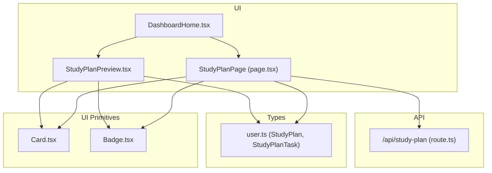
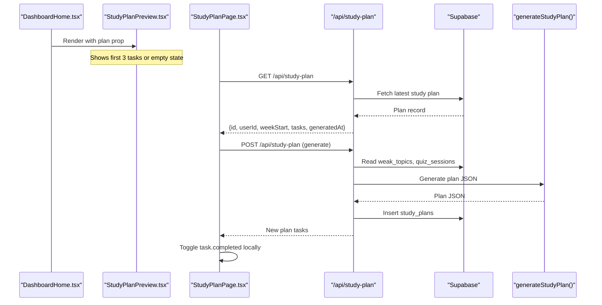
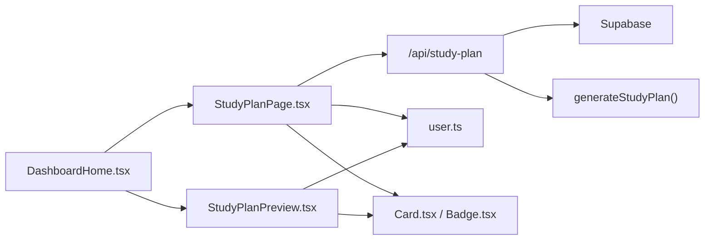

# Study Plan Preview Widget

<cite>
**Referenced Files in This Document**
- [StudyPlanPreview.tsx](file://Next-app/src/components/dashboard/StudyPlanPreview.tsx)
- [page.tsx](file://Next-app/src/app/(dashboard)/study-plan/page.tsx)
- [route.ts](file://Next-app/src/app/api/study-plan/route.ts)
- [user.ts](file://Next-app/src/types/user.ts)
- [Card.tsx](file://Next-app/src/components/ui/Card.tsx)
- [Badge.tsx](file://Next-app/src/components/ui/Badge.tsx)
- [DashboardHome.tsx](file://Next-app/src/components/DashboardHome.tsx)
- [utils.ts](file://Next-app/src/lib/utils.ts)
</cite>

## Table of Contents
1. [Introduction](#introduction)
2. [Project Structure](#project-structure)
3. [Core Components](#core-components)
4. [Architecture Overview](#architecture-overview)
5. [Detailed Component Analysis](#detailed-component-analysis)
6. [Dependency Analysis](#dependency-analysis)
7. [Performance Considerations](#performance-considerations)
8. [Troubleshooting Guide](#troubleshooting-guide)
9. [Conclusion](#conclusion)
10. [Appendices](#appendices)

## Introduction
This document provides comprehensive documentation for the StudyPlanPreview component and its surrounding study plan features. It explains how upcoming tasks are rendered, how progress is tracked visually, how due dates are handled, and how users interact with tasks to mark them complete. It also covers integration with study plan data structures, status indicators, priority sorting considerations, responsive design, and guidance for customization such as adding new task types or integrating with calendar systems.

## Project Structure
The StudyPlanPreview widget lives within the dashboard area and integrates with a dedicated study plan page and API route. The data model for study plans and tasks is defined centrally and consumed by both UI components and server routes.

**Diagram sources**
- [DashboardHome.tsx:6-8](file://Next-app/src/components/DashboardHome.tsx#L6-L8)
- [StudyPlanPreview.tsx:1-7](file://Next-app/src/components/dashboard/StudyPlanPreview.tsx#L1-L7)
- [page.tsx:1-8](file://Next-app/src/app/(dashboard)/study-plan/page.tsx#L1-L8)
- [route.ts:1-4](file://Next-app/src/app/api/study-plan/route.ts#L1-L4)
- [user.ts:17-32](file://Next-app/src/types/user.ts#L17-L32)
- [Card.tsx:1-25](file://Next-app/src/components/ui/Card.tsx#L1-L25)
- [Badge.tsx:1-36](file://Next-app/src/components/ui/Badge.tsx#L1-L36)

**Section sources**
- [DashboardHome.tsx:6-8](file://Next-app/src/components/DashboardHome.tsx#L6-L8)
- [StudyPlanPreview.tsx:1-7](file://Next-app/src/components/dashboard/StudyPlanPreview.tsx#L1-L7)
- [page.tsx:1-8](file://Next-app/src/app/(dashboard)/study-plan/page.tsx#L1-L8)
- [route.ts:1-4](file://Next-app/src/app/api/study-plan/route.ts#L1-L4)
- [user.ts:17-32](file://Next-app/src/types/user.ts#L17-L32)
- [Card.tsx:1-25](file://Next-app/src/components/ui/Card.tsx#L1-L25)
- [Badge.tsx:1-36](file://Next-app/src/components/ui/Badge.tsx#L1-L36)

## Core Components
- StudyPlanPreview: Displays a compact preview of upcoming tasks from the current week’s study plan. It shows up to three tasks with day, topic, activity badge, and estimated time. If no plan exists, it shows an empty state with a call-to-action link to create a plan.
- StudyPlanPage: Full view of the weekly plan with interactive completion toggles, AI-generated plan creation, and richer visual cues per activity type.
- API Route (/api/study-plan): Provides GET to fetch the latest plan and POST to generate a new plan using user weak topics and recent accuracy, then persists it.

Key responsibilities:
- Rendering task lists with activity badges and time estimates.
- Handling empty states and navigation to the full plan page.
- Managing local completion state on the full plan page.
- Fetching and generating plans via React Query and Next.js API routes.

**Section sources**
- [StudyPlanPreview.tsx:22-76](file://Next-app/src/components/dashboard/StudyPlanPreview.tsx#L22-L76)
- [page.tsx:22-70](file://Next-app/src/app/(dashboard)/study-plan/page.tsx#L22-L70)
- [route.ts:5-78](file://Next-app/src/app/api/study-plan/route.ts#L5-L78)
- [route.ts:80-114](file://Next-app/src/app/api/study-plan/route.ts#L80-L114)

## Architecture Overview
The widget integrates with a client-side query layer and a server-side API that orchestrates data retrieval and generation.

**Diagram sources**
- [DashboardHome.tsx:60-81](file://Next-app/src/components/DashboardHome.tsx#L60-L81)
- [StudyPlanPreview.tsx:22-76](file://Next-app/src/components/dashboard/StudyPlanPreview.tsx#L22-L76)
- [page.tsx:22-70](file://Next-app/src/app/(dashboard)/study-plan/page.tsx#L22-L70)
- [route.ts:5-78](file://Next-app/src/app/api/study-plan/route.ts#L5-L78)
- [route.ts:80-114](file://Next-app/src/app/api/study-plan/route.ts#L80-L114)

## Detailed Component Analysis

### StudyPlanPreview Component
- Purpose: Provide a concise overview of upcoming tasks for the current week.
- Task list rendering: Slices the first three tasks from the plan and renders each with day label, topic text, activity badge, and estimated minutes.
- Empty state: When no plan is provided, displays a message and a link to navigate to the study plan creation flow.
- Status indicators: Uses a Badge with variants mapped to activity types (read, quiz, review).
- Due date handling: Displays the task’s day field; does not implement due-date logic or overdue highlighting.
- Interaction patterns: No inline completion toggle in the preview; links to the full plan page for interactions.
- Responsive design: Uses Tailwind utility classes for spacing and layout; card-based container adapts across screen sizes.

Customization examples:
- Customize task display format: Adjust the mapping of activity labels and colors, or change the number of previewed tasks by modifying the slice length.
- Add new task types: Extend the activityLabels and activityColors mappings to support additional activities.
- Implement task completion workflows: Introduce a completion toggle in the preview similar to the full plan page if needed.
- Integrate with calendar systems: Use the day field and estimatedMinutes to export or sync events to external calendars.

**Section sources**
- [StudyPlanPreview.tsx:10-20](file://Next-app/src/components/dashboard/StudyPlanPreview.tsx#L10-L20)
- [StudyPlanPreview.tsx:22-76](file://Next-app/src/components/dashboard/StudyPlanPreview.tsx#L22-L76)

### StudyPlanPage (Full Plan View)
- Data fetching: Uses React Query to fetch the latest plan and a mutation to generate a new plan.
- Local completion state: Maintains a local array of tasks where toggling updates completed flags immediately in the UI.
- Activity configuration: Maps activity types to icons and color classes for richer visuals.
- Completion interaction: Each task has a checkbox button that toggles completion and applies visual changes (opacity, strikethrough).
- Empty state: Encourages users to generate a plan when none exist.

Progress tracking visualization:
- Completed tasks are visually distinct via opacity and strikethrough styling.
- Activity-specific icons and colored backgrounds help differentiate task types at a glance.

Due date handling:
- Displays the task’s day field; no explicit due date validation or overdue indicators are implemented here.

Priority sorting:
- Tasks are rendered in the order returned by the API; no explicit sorting by priority is applied.

**Section sources**
- [page.tsx:9-20](file://Next-app/src/app/(dashboard)/study-plan/page.tsx#L9-L20)
- [page.tsx:22-70](file://Next-app/src/app/(dashboard)/study-plan/page.tsx#L22-L70)
- [page.tsx:107-158](file://Next-app/src/app/(dashboard)/study-plan/page.tsx#L107-L158)

### API Route (/api/study-plan)
- GET: Retrieves the most recent study plan for the authenticated user and returns a normalized shape including id, userId, weekStart, tasks, and generatedAt.
- POST: Authenticates the user, fetches weak topics and recent quiz sessions, computes recent accuracy, generates a plan via an external service, parses the JSON response, calculates the current week start, persists the plan, and returns the tasks.

Error handling:
- Returns appropriate error responses for unauthorized access and internal errors during generation or fetching.

**Section sources**
- [route.ts:5-78](file://Next-app/src/app/api/study-plan/route.ts#L5-L78)
- [route.ts:80-114](file://Next-app/src/app/api/study-plan/route.ts#L80-L114)

### Data Model
- StudyPlanTask: Represents a single task with fields for day, topic, activity type, estimatedMinutes, completed flag, and optional summary.
- StudyPlan: Encompasses plan metadata and the array of tasks.

These types are used consistently across UI and API layers to ensure type safety and predictable rendering.

**Section sources**
- [user.ts:17-32](file://Next-app/src/types/user.ts#L17-L32)

### UI Primitives
- Card: Reusable container with optional title and consistent styling.
- Badge: Small status indicator with variant-based styling for different activity types.

These primitives are composed by both the preview and full plan views to maintain visual consistency.

**Section sources**
- [Card.tsx:1-25](file://Next-app/src/components/ui/Card.tsx#L1-L25)
- [Badge.tsx:1-36](file://Next-app/src/components/ui/Badge.tsx#L1-L36)

## Dependency Analysis
- DashboardHome composes StudyPlanPreview and passes the study plan data.
- StudyPlanPreview depends on types and UI primitives for rendering.
- StudyPlanPage depends on React Query for data fetching/mutation and interacts with the API route.
- API route depends on authentication, database queries, and an external generation function.

**Diagram sources**
- [DashboardHome.tsx:6-8](file://Next-app/src/components/DashboardHome.tsx#L6-L8)
- [StudyPlanPreview.tsx:1-7](file://Next-app/src/components/dashboard/StudyPlanPreview.tsx#L1-L7)
- [page.tsx:1-8](file://Next-app/src/app/(dashboard)/study-plan/page.tsx#L1-L8)
- [route.ts:1-4](file://Next-app/src/app/api/study-plan/route.ts#L1-L4)
- [user.ts:17-32](file://Next-app/src/types/user.ts#L17-L32)
- [Card.tsx:1-25](file://Next-app/src/components/ui/Card.tsx#L1-L25)
- [Badge.tsx:1-36](file://Next-app/src/components/ui/Badge.tsx#L1-L36)

**Section sources**
- [DashboardHome.tsx:60-81](file://Next-app/src/components/DashboardHome.tsx#L60-L81)
- [StudyPlanPreview.tsx:1-7](file://Next-app/src/components/dashboard/StudyPlanPreview.tsx#L1-L7)
- [page.tsx:1-8](file://Next-app/src/app/(dashboard)/study-plan/page.tsx#L1-L8)
- [route.ts:1-4](file://Next-app/src/app/api/study-plan/route.ts#L1-L4)
- [user.ts:17-32](file://Next-app/src/types/user.ts#L17-L32)

## Performance Considerations
- Preview limits rendering to three tasks to keep the dashboard lightweight.
- Local completion toggles avoid unnecessary network calls until persistence is added.
- React Query caches plan data and invalidates on mutations to reduce redundant requests.
- API route performs minimal queries and delegates heavy planning logic to an external service.

[No sources needed since this section provides general guidance]

## Troubleshooting Guide
Common issues and resolutions:
- No plan displayed: Ensure the API returns a valid plan object; check authentication and database records.
- Generation fails: Verify credentials and permissions for reading weak topics and quiz sessions; confirm the external generation service is reachable.
- Completion not persisting: Currently, completion toggles are local; add a backend endpoint to persist changes if required.
- Incorrect activity visuals: Confirm activity values match configured mappings in both preview and full plan pages.

**Section sources**
- [route.ts:5-78](file://Next-app/src/app/api/study-plan/route.ts#L5-L78)
- [route.ts:80-114](file://Next-app/src/app/api/study-plan/route.ts#L80-L114)
- [page.tsx:64-70](file://Next-app/src/app/(dashboard)/study-plan/page.tsx#L64-L70)

## Conclusion
The StudyPlanPreview component offers a focused, efficient way to show upcoming study tasks with clear activity indicators and time estimates. It integrates seamlessly with the full plan page and API for data fetching and generation. While due date handling and priority sorting are not implemented in the preview, the architecture supports easy extension. Local completion toggles provide immediate feedback, and the system can be extended to persist changes and integrate with calendar tools.

[No sources needed since this section summarizes without analyzing specific files]

## Appendices

### Customization Examples
- Customize task display formats: Modify activity labels and colors in the preview and full plan pages to align with branding or localization needs.
- Add new task types: Extend the activity mappings and UI configurations to support additional activities beyond read, quiz, and review.
- Implement task completion workflows: Persist completion state by adding a backend endpoint and updating the UI to reflect server state.
- Integrate with calendar systems: Use the day and estimatedMinutes fields to create calendar events or reminders through external APIs.

[No sources needed since this section provides general guidance]