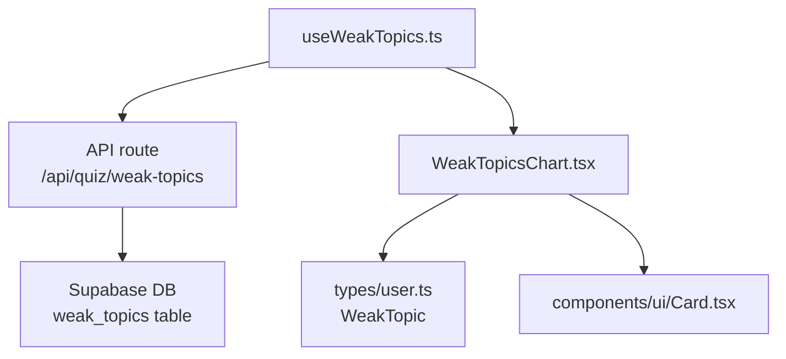
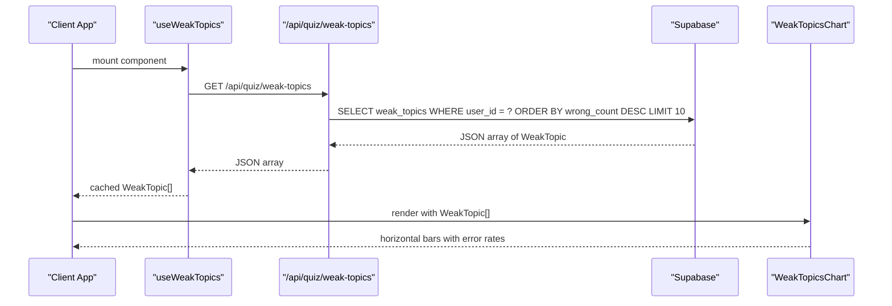
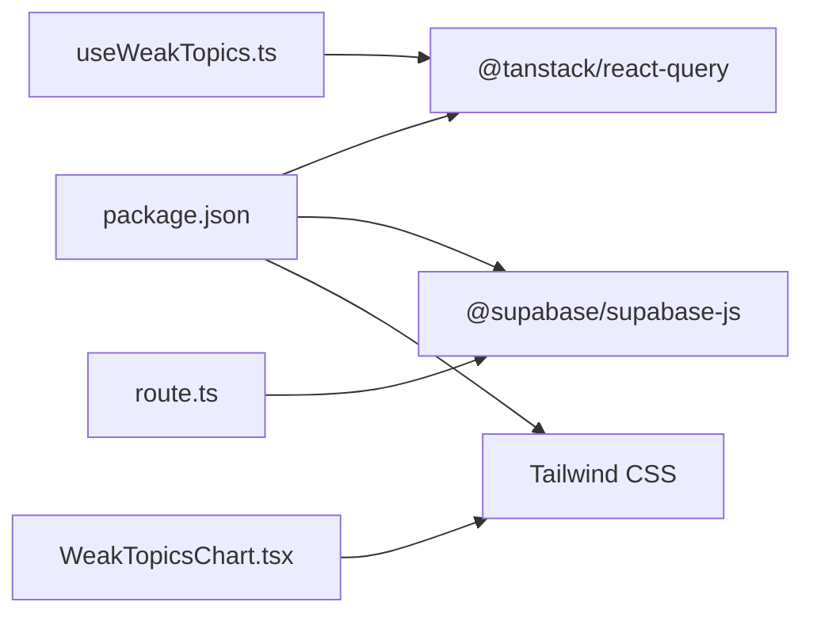
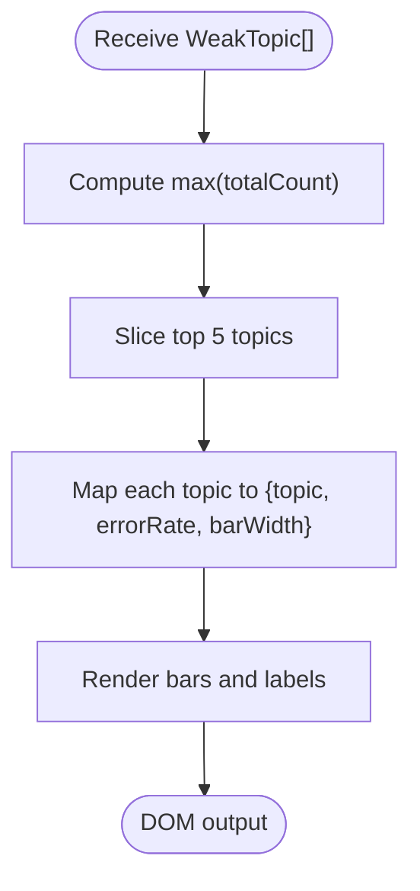

# Weak Topics Visualization

<cite>
**Referenced Files in This Document**
- [WeakTopicsChart.tsx](file://Next-app/src/components/dashboard/WeakTopicsChart.tsx)
- [user.ts](file://Next-app/src/types/user.ts)
- [route.ts](file://Next-app/src/app/api/quiz/weak-topics/route.ts)
- [useWeakTopics.ts](file://Next-app/src/lib/hooks/useWeakTopics.ts)
- [Card.tsx](file://Next-app/src/components/ui/Card.tsx)
- [package.json](file://Next-app/package.json)
</cite>

## Table of Contents
1. Introduction
2. Project Structure
3. Core Components
4. Architecture Overview
5. Detailed Component Analysis
6. Dependency Analysis
7. Performance Considerations
8. Troubleshooting Guide
9. Conclusion
10. Appendices

## Introduction
This document explains the WeakTopicsChart component that visualizes a user’s weak areas needing improvement. It covers chart configuration, data transformation from WeakTopic arrays to chart-compatible formats, color coding strategies for different difficulty levels, interactive features such as tooltips and drill-down capabilities, chart library integration (or lack thereof), responsive behavior, accessibility compliance, and performance optimization for large datasets. It also includes examples for customizing appearance, adding new topic categories, and implementing export functionality.

## Project Structure
The WeakTopics feature spans UI, types, hooks, and API layers:
- UI: WeakTopicsChart renders horizontal bars per topic with error rate and counts.
- Types: WeakTopic defines the shape of weak topic records.
- Hook: useWeakTopics fetches weak topics via React Query.
- API: GET /api/quiz/weak-topics returns the current user’s weak topics from Supabase.
- Shared UI: Card wraps content with consistent styling.

**Diagram sources**
- [WeakTopicsChart.tsx:1-52](file://Next-app/src/components/dashboard/WeakTopicsChart.tsx#L1-L52)
- [user.ts:8-15](file://Next-app/src/types/user.ts#L8-L15)
- [Card.tsx:1-25](file://Next-app/src/components/ui/Card.tsx#L1-L25)
- [useWeakTopics.ts:1-18](file://Next-app/src/lib/hooks/useWeakTopics.ts#L1-L18)
- [route.ts:1-33](file://Next-app/src/app/api/quiz/weak-topics/route.ts#L1-L33)

**Section sources**
- [WeakTopicsChart.tsx:1-52](file://Next-app/src/components/dashboard/WeakTopicsChart.tsx#L1-L52)
- [user.ts:8-15](file://Next-app/src/types/user.ts#L8-L15)
- [useWeakTopics.ts:1-18](file://Next-app/src/lib/hooks/useWeakTopics.ts#L1-L18)
- [route.ts:1-33](file://Next-app/src/app/api/quiz/weak-topics/route.ts#L1-L33)
- [Card.tsx:1-25](file://Next-app/src/components/ui/Card.tsx#L1-L25)

## Core Components
- WeakTopicsChart: Displays up to five topics with horizontal progress bars representing total attempts relative to the maximum; shows error percentage and raw counts.
- WeakTopic type: Defines id, userId, topic, wrongCount, totalCount, lastUpdated.
- useWeakTopics hook: Fetches weak topics using React Query with caching and retry settings.
- API route: Authenticates user, queries weak_topics ordered by wrong_count descending, limited to 10.
- Card: Reusable container used by the chart.

Key behaviors:
- Empty state: Shows a friendly message when no weak topics exist.
- Data slicing: Only top 5 topics are rendered to keep the view concise.
- Metrics: Error rate is computed as wrongCount / totalCount * 100; bar width is normalized against max totalCount.

**Section sources**
- [WeakTopicsChart.tsx:4-51](file://Next-app/src/components/dashboard/WeakTopicsChart.tsx#L4-L51)
- [user.ts:8-15](file://Next-app/src/types/user.ts#L8-L15)
- [useWeakTopics.ts:6-17](file://Next-app/src/lib/hooks/useWeakTopics.ts#L6-L17)
- [route.ts:4-31](file://Next-app/src/app/api/quiz/weak-topics/route.ts#L4-L31)
- [Card.tsx:4-24](file://Next-app/src/components/ui/Card.tsx#L4-L24)

## Architecture Overview
The data flow moves from the database through a Next.js API route to a client-side hook and finally into the WeakTopicsChart for rendering.

**Diagram sources**
- [useWeakTopics.ts:6-17](file://Next-app/src/lib/hooks/useWeakTopics.ts#L6-L17)
- [route.ts:4-31](file://Next-app/src/app/api/quiz/weak-topics/route.ts#L4-L31)
- [WeakTopicsChart.tsx:8-51](file://Next-app/src/components/dashboard/WeakTopicsChart.tsx#L8-L51)

## Detailed Component Analysis

### WeakTopicsChart
Responsibilities:
- Accepts an array of WeakTopic objects.
- Renders an empty state if no data.
- Computes per-topic metrics: error rate and normalized bar width.
- Limits display to top 5 topics for readability.

Data transformation:
- Input: WeakTopic[] (id, userId, topic, wrongCount, totalCount, lastUpdated).
- Output: Visual bars where width reflects totalCount relative to the maximum totalCount across all topics; text shows error percentage and raw counts.

Color coding strategy:
- Current implementation uses a single “error” color for all bars. To differentiate difficulty levels, extend the component to accept a mapping from topic or difficulty to color, then apply it conditionally.

Interactivity:
- Currently static. Recommended enhancements:
  - Tooltips: Show topic name, wrongCount, totalCount, errorRate, and lastUpdated on hover/focus.
  - Drill-down: Click a row to navigate to a filtered quiz or study plan focused on that topic.

Accessibility:
- Add aria labels for each bar indicating topic and error rate.
- Ensure keyboard focusability for clickable rows.
- Provide descriptive titles and roles for screen readers.

Responsive behavior:
- Uses Tailwind utility classes for spacing and sizing; scales well on mobile due to fluid widths and small font sizes.

Performance considerations:
- Slicing to top 5 reduces DOM nodes.
- Avoid heavy computations inside render; precompute metrics if needed.
- Debounce or throttle interactions if adding interactivity.

Customization examples:
- Appearance: Change colors via CSS variables or theme tokens; adjust bar height and border radius.
- New topic categories: Extend WeakTopic to include a category field and group/filter by category before rendering.
- Export: Implement CSV export of displayed topics including topic, wrongCount, totalCount, errorRate, lastUpdated.

**Section sources**
- [WeakTopicsChart.tsx:4-51](file://Next-app/src/components/dashboard/WeakTopicsChart.tsx#L4-L51)
- [user.ts:8-15](file://Next-app/src/types/user.ts#L8-L15)
- [Card.tsx:4-24](file://Next-app/src/components/ui/Card.tsx#L4-L24)

### Data Model: WeakTopic
Fields:
- id: Unique identifier for the record.
- userId: User owning the record.
- topic: Topic name.
- wrongCount: Number of incorrect answers.
- totalCount: Total attempts for the topic.
- lastUpdated: Timestamp of last update.

Complexity:
- O(1) access to fields; aggregations performed in the component are linear in number of topics.

**Section sources**
- [user.ts:8-15](file://Next-app/src/types/user.ts#L8-L15)

### API Route: /api/quiz/weak-topics
Behavior:
- Authenticates the current user via Supabase.
- Queries weak_topics for the user, orders by wrong_count descending, limits to 10.
- Returns JSON array or empty array on errors.

Error handling:
- Unauthorized returns 401.
- Database errors return empty array with logging.

Security:
- Enforces user context; only returns data for the authenticated user.

**Section sources**
- [route.ts:4-31](file://Next-app/src/app/api/quiz/weak-topics/route.ts#L4-L31)

### Hook: useWeakTopics
Behavior:
- Fetches weak topics from the API endpoint.
- Caches results for 10 minutes using React Query.
- Throws on network failures; consumers should handle loading/error states.

Integration:
- Provides data to components like WeakTopicsChart via props.

**Section sources**
- [useWeakTopics.ts:6-17](file://Next-app/src/lib/hooks/useWeakTopics.ts#L6-L17)

## Dependency Analysis
External dependencies relevant to this feature:
- React Query (@tanstack/react-query): Used by useWeakTopics for caching and retries.
- Supabase client: Used by the API route to query weak_topics.
- Tailwind CSS: Styling utilities applied throughout.

No dedicated charting library is used; visualization is built with HTML/CSS.

**Diagram sources**
- [package.json:11-22](file://Next-app/package.json#L11-L22)
- [useWeakTopics.ts:1-18](file://Next-app/src/lib/hooks/useWeakTopics.ts#L1-L18)
- [route.ts:1-33](file://Next-app/src/app/api/quiz/weak-topics/route.ts#L1-L33)
- [WeakTopicsChart.tsx:1-52](file://Next-app/src/components/dashboard/WeakTopicsChart.tsx#L1-L52)

**Section sources**
- [package.json:11-22](file://Next-app/package.json#L11-L22)
- [useWeakTopics.ts:1-18](file://Next-app/src/lib/hooks/useWeakTopics.ts#L1-L18)
- [route.ts:1-33](file://Next-app/src/app/api/quiz/weak-topics/route.ts#L1-L33)
- [WeakTopicsChart.tsx:1-52](file://Next-app/src/components/dashboard/WeakTopicsChart.tsx#L1-L52)

## Performance Considerations
- Rendering limit: The chart slices to the top 5 topics to minimize DOM size.
- Computation: Error rate and bar width are simple arithmetic operations; complexity is O(n) over displayed items.
- Network: React Query caches responses for 10 minutes, reducing redundant requests.
- Server-side limit: API limits results to 10 records to reduce payload size.
- Recommendations:
  - Virtualize lists if displaying more than 5 topics.
  - Memoize derived values if additional calculations are added.
  - Use request debouncing if triggering refetches frequently.

[No sources needed since this section provides general guidance]

## Troubleshooting Guide
Common issues and resolutions:
- No data shown:
  - Verify authentication in the API route; unauthorized requests return 401.
  - Check that weak_topics table contains records for the user.
- Incorrect percentages:
  - Ensure totalCount > 0 before computing error rate to avoid division by zero.
- Stale data:
  - Adjust staleTime in useWeakTopics or trigger manual refetch on relevant actions.
- Performance lag with many topics:
  - Increase server-side limit reduction or implement pagination/virtualization on the client.

**Section sources**
- [route.ts:4-31](file://Next-app/src/app/api/quiz/weak-topics/route.ts#L4-L31)
- [useWeakTopics.ts:6-17](file://Next-app/src/lib/hooks/useWeakTopics.ts#L6-L17)
- [WeakTopicsChart.tsx:24-47](file://Next-app/src/components/dashboard/WeakTopicsChart.tsx#L24-L47)

## Conclusion
WeakTopicsChart provides a clear, lightweight visualization of a user’s weakest topics using native HTML/CSS without a charting library. It integrates cleanly with React Query and a Supabase-backed API, offering good performance for typical dataset sizes. Extensibility points include adding tooltips, drill-down navigation, difficulty-based color coding, and export functionality while maintaining responsiveness and accessibility.

[No sources needed since this section summarizes without analyzing specific files]

## Appendices

### Chart Configuration Summary
- Input: WeakTopic[]
- Display: Up to 5 topics with horizontal bars
- Metrics: Error rate (%) and raw counts
- Styling: Tailwind utility classes
- Interactions: None currently; recommended additions listed above

**Section sources**
- [WeakTopicsChart.tsx:21-49](file://Next-app/src/components/dashboard/WeakTopicsChart.tsx#L21-L49)

### Data Transformation Flow

**Diagram sources**
- [WeakTopicsChart.tsx:19-47](file://Next-app/src/components/dashboard/WeakTopicsChart.tsx#L19-L47)

### Customization Examples
- Customize appearance:
  - Modify colors via theme tokens or CSS classes applied to bars and labels.
  - Adjust bar height and spacing using Tailwind utilities.
- Add new topic categories:
  - Extend WeakTopic with a category field.
  - Group or filter topics by category before rendering.
- Implement export:
  - Generate CSV from displayed topics including topic, wrongCount, totalCount, errorRate, lastUpdated.
  - Trigger download via a button action in the chart header.

[No sources needed since this section provides general guidance]