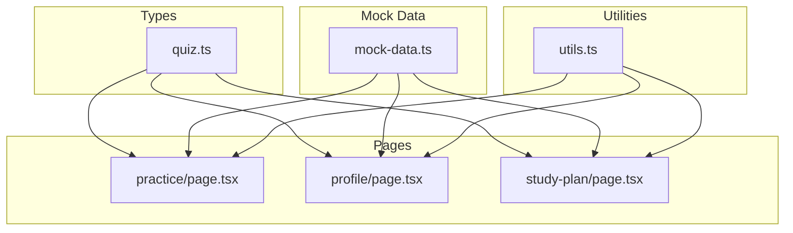
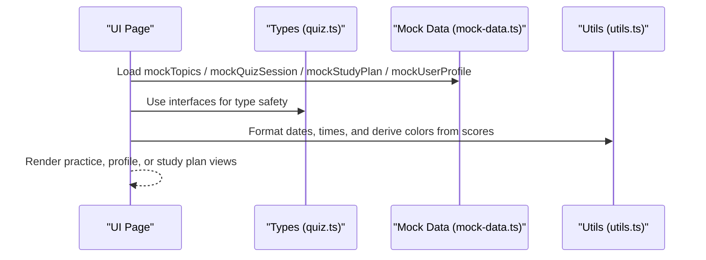
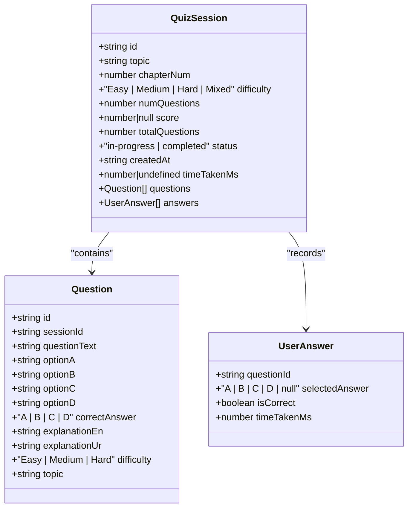
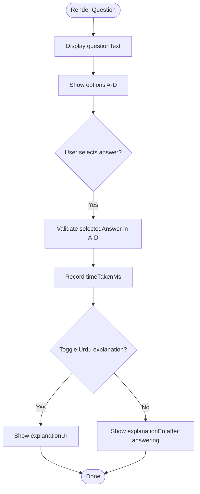
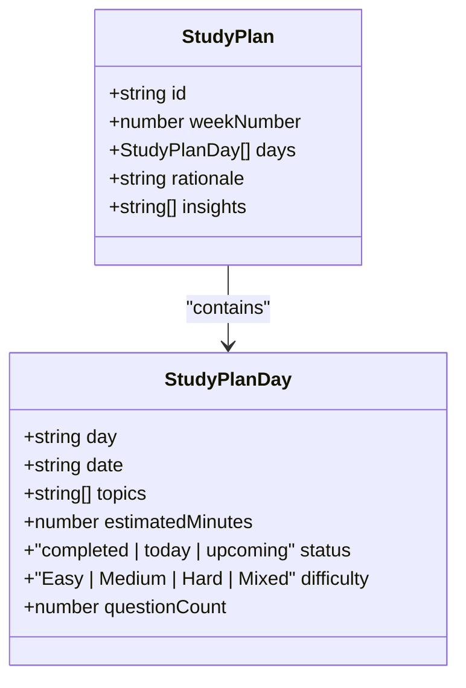
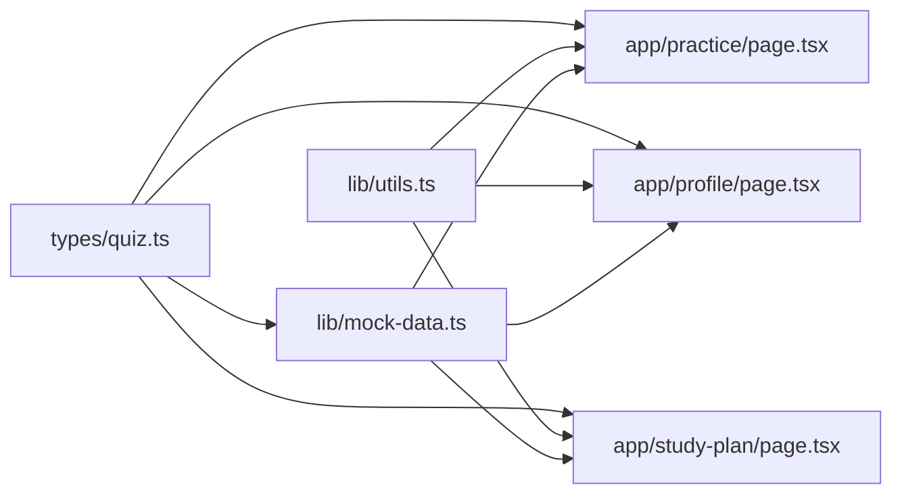

# Data Models & Types

<cite>
**Referenced Files in This Document**
- [quiz.ts](file://src/types/quiz.ts)
- [mock-data.ts](file://src/lib/mock-data.ts)
- [utils.ts](file://src/lib/utils.ts)
- [practice/page.tsx](file://src/app/practice/page.tsx)
- [profile/page.tsx](file://src/app/profile/page.tsx)
- [study-plan/page.tsx](file://src/app/study-plan/page.tsx)
</cite>

## Table of Contents
1. Introduction
2. Project Structure
3. Core Components
4. Architecture Overview
5. Detailed Component Analysis
6. Dependency Analysis
7. Performance Considerations
8. Troubleshooting Guide
9. Conclusion

## Introduction
This document provides comprehensive data model documentation for MedAce AI’s TypeScript interfaces and data structures. It focuses on:
- QuizSession for managing practice sessions with topic selection, difficulty levels, and progress tracking
- Question defining MCQ structure with bilingual explanations, options, and metadata
- UserProfile for storing student information, performance metrics, and learning preferences
- StudyPlan for personalized scheduling and weak spot tracking
- Mock data covering all 15 MDCAT biology chapters used for development and testing
- Examples of data validation, transformation, and persistence patterns across the application

## Project Structure
The data models are centralized under src/types and consumed by UI pages and utilities:
- Types: src/types/quiz.ts defines core domain interfaces
- Mock data: src/lib/mock-data.ts provides sample datasets for all chapters and features
- Utilities: src/lib/utils.ts offers formatting helpers and score-based styling logic
- Pages: src/app/practice, src/app/profile, src/app/study-plan consume types and mock data to render features



**Diagram sources**
- [quiz.ts:5-106](file://src/types/quiz.ts#L5-L106)
- [mock-data.ts:15-313](file://src/lib/mock-data.ts#L15-L313)
- [utils.ts:8-33](file://src/lib/utils.ts#L8-L33)
- [practice/page.tsx:1-196](file://src/app/practice/page.tsx#L1-L196)
- [profile/page.tsx:1-224](file://src/app/profile/page.tsx#L1-L224)
- [study-plan/page.tsx:1-192](file://src/app/study-plan/page.tsx#L1-L192)

**Section sources**
- [quiz.ts:5-106](file://src/types/quiz.ts#L5-L106)
- [mock-data.ts:15-313](file://src/lib/mock-data.ts#L15-L313)
- [utils.ts:8-33](file://src/lib/utils.ts#L8-L33)
- [practice/page.tsx:1-196](file://src/app/practice/page.tsx#L1-L196)
- [profile/page.tsx:1-224](file://src/app/profile/page.tsx#L1-L224)
- [study-plan/page.tsx:1-192](file://src/app/study-plan/page.tsx#L1-L192)

## Core Components
This section documents the primary data models and their roles in the application.

- Topic: Represents a chapter with category, subtopic count, optional accuracy, and weak flag
- Question: Defines an MCQ with four options, correct answer, bilingual explanations (English and Urdu), difficulty, and topic
- UserAnswer: Captures per-question user responses, correctness, and time taken
- QuizSession: Manages a practice session including topic, chapter number, difficulty, question count, score, total questions, status, timestamps, and arrays of questions and answers
- WeakTopic: Tracks weak areas with weakness score, error count, and attempt count
- StudyPlanDay and StudyPlan: Define weekly schedule, rationale, insights, and per-day tasks with topics, estimated minutes, difficulty, and question counts
- DashboardStats and RecentSession: Provide summary statistics and recent activity snapshots
- UserProfile: Stores identity, membership date, totals, overall accuracy, best/worst topics, longest streak, and per-chapter performance

These models enable consistent state management across practice, results, profile, and study plan features.

**Section sources**
- [quiz.ts:5-106](file://src/types/quiz.ts#L5-L106)

## Architecture Overview
The data flow connects UI pages to types and mock data, with utilities transforming values for display.



**Diagram sources**
- [practice/page.tsx:1-196](file://src/app/practice/page.tsx#L1-L196)
- [profile/page.tsx:1-224](file://src/app/profile/page.tsx#L1-L224)
- [study-plan/page.tsx:1-192](file://src/app/study-plan/page.tsx#L1-L192)
- [mock-data.ts:15-313](file://src/lib/mock-data.ts#L15-L313)
- [utils.ts:8-33](file://src/lib/utils.ts#L8-L33)
- [quiz.ts:5-106](file://src/types/quiz.ts#L5-L106)

## Detailed Component Analysis

### QuizSession
Purpose:
- Encapsulates a single practice session with topic, chapter, difficulty, and progress tracking
- Holds the list of questions and user answers to compute results and analytics

Key fields:
- id, topic, chapterNum, difficulty, numQuestions, score, totalQuestions, status, createdAt, timeTakenMs, questions, answers

Behavioral notes:
- Status transitions from in-progress to completed when all answers are recorded and score is computed
- timeTakenMs is optional and populated upon completion
- answers array stores per-question selections, correctness, and timing

Example usage:
- Practice page configures session parameters (difficulty, number of questions) and navigates to session view
- Results page consumes completed session data to show performance and explanations



**Diagram sources**
- [quiz.ts:15-50](file://src/types/quiz.ts#L15-L50)

**Section sources**
- [quiz.ts:15-50](file://src/types/quiz.ts#L15-L50)
- [mock-data.ts:215-256](file://src/lib/mock-data.ts#L215-L256)
- [practice/page.tsx:120-190](file://src/app/practice/page.tsx#L120-L190)

### Question
Purpose:
- Defines the MCQ structure with four options, correct answer, bilingual explanations, difficulty, and topic linkage

Key fields:
- id, sessionId, questionText, optionA-D, correctAnswer, explanationEn, explanationUr, difficulty, topic

Validation and transformation patterns:
- Correct answer must be one of A, B, C, D
- Difficulty must be Easy, Medium, or Hard
- Bilingual explanations ensure accessibility for English and Urdu speakers

Usage examples:
- Practice page renders question text and options, toggles Urdu explanation visibility
- Results page highlights correct vs user-selected options and shows explanations



**Diagram sources**
- [quiz.ts:15-28](file://src/types/quiz.ts#L15-L28)
- [practice/page.tsx:164-267](file://src/app/practice/page.tsx#L164-L267)

**Section sources**
- [quiz.ts:15-28](file://src/types/quiz.ts#L15-L28)
- [mock-data.ts:69-210](file://src/lib/mock-data.ts#L69-L210)
- [practice/page.tsx:164-267](file://src/app/practice/page.tsx#L164-L267)

### UserProfile
Purpose:
- Stores student identity, membership date, totals, overall accuracy, best/worst topics, longest streak, and per-chapter performance

Key fields:
- id, fullName, email, memberSince, totalQuestions, totalSessions, overallAccuracy, bestTopic, worstTopic, longestStreak, chapterPerformance

Transformation and presentation:
- Dates formatted via utility functions
- Score-based color classes applied using helper functions

Usage examples:
- Profile page displays stats, chapter performance bars, and settings

```mermaid
classDiagram
class UserProfile {
+string id
+string fullName
+string email
+string memberSince
+number totalQuestions
+number totalSessions
+number overallAccuracy
+string bestTopic
+string worstTopic
+number longestStreak
+{chapter : string; accuracy : number}[] chapterPerformance
}
```

**Diagram sources**
- [quiz.ts:94-106](file://src/types/quiz.ts#L94-L106)

**Section sources**
- [quiz.ts:94-106](file://src/types/quiz.ts#L94-L106)
- [mock-data.ts:286-313](file://src/lib/mock-data.ts#L286-L313)
- [profile/page.tsx:18-224](file://src/app/profile/page.tsx#L18-L224)
- [utils.ts:8-33](file://src/lib/utils.ts#L8-L33)

### StudyPlan
Purpose:
- Personalized weekly schedule with rationale, insights, and per-day tasks including topics, difficulty, and question counts

Key fields:
- StudyPlan: id, weekNumber, days[], rationale, insights
- StudyPlanDay: day, date, topics[], estimatedMinutes, status, difficulty, questionCount

Usage examples:
- Study plan page groups today’s tasks, completed tasks, and displays rationale and insights



**Diagram sources**
- [quiz.ts:60-76](file://src/types/quiz.ts#L60-L76)

**Section sources**
- [quiz.ts:60-76](file://src/types/quiz.ts#L60-L76)
- [mock-data.ts:261-281](file://src/lib/mock-data.ts#L261-L281)
- [study-plan/page.tsx:18-192](file://src/app/study-plan/page.tsx#L18-L192)

### Mock Data Structure (All 15 MDCAT Biology Chapters)
Purpose:
- Provides realistic sample data for development and testing across topics, weak topics, dashboard stats, recent sessions, questions, quiz sessions, study plans, and user profiles

Coverage:
- Topics: 15 chapters spanning Human Physiology, Modern Topics, and Pharmacology
- Questions: Example set focused on Nervous System with bilingual explanations
- Sessions: In-progress and completed sessions with answers and timing
- Study Plan: Weekly schedule with rationale and insights
- User Profile: Aggregated performance metrics and chapter-wise accuracy

Usage examples:
- Practice page filters topics by category and search
- Profile page visualizes chapter performance and stats
- Study plan page renders daily tasks and insights

**Section sources**
- [mock-data.ts:15-313](file://src/lib/mock-data.ts#L15-L313)
- [practice/page.tsx:25-112](file://src/app/practice/page.tsx#L25-L112)
- [profile/page.tsx:18-224](file://src/app/profile/page.tsx#L18-L224)
- [study-plan/page.tsx:18-192](file://src/app/study-plan/page.tsx#L18-L192)

## Dependency Analysis
Type definitions are imported by mock data and UI pages. Utilities provide formatting and styling helpers.



**Diagram sources**
- [quiz.ts:5-106](file://src/types/quiz.ts#L5-L106)
- [mock-data.ts:1-10](file://src/lib/mock-data.ts#L1-L10)
- [utils.ts:1-33](file://src/lib/utils.ts#L1-L33)
- [practice/page.tsx:1-196](file://src/app/practice/page.tsx#L1-L196)
- [profile/page.tsx:1-224](file://src/app/profile/page.tsx#L1-L224)
- [study-plan/page.tsx:1-192](file://src/app/study-plan/page.tsx#L1-L192)

**Section sources**
- [quiz.ts:5-106](file://src/types/quiz.ts#L5-L106)
- [mock-data.ts:1-10](file://src/lib/mock-data.ts#L1-L10)
- [utils.ts:1-33](file://src/lib/utils.ts#L1-L33)
- [practice/page.tsx:1-196](file://src/app/practice/page.tsx#L1-L196)
- [profile/page.tsx:1-224](file://src/app/profile/page.tsx#L1-L224)
- [study-plan/page.tsx:1-192](file://src/app/study-plan/page.tsx#L1-L192)

## Performance Considerations
- Keep QuizSession.answers aligned with Question ids to avoid mismatches during scoring
- Avoid re-rendering large lists by memoizing derived data (e.g., filtered topics, sorted chapter performance)
- Use efficient filtering on mockTopics for search and category tabs
- Format dates and times once and reuse transformed values to reduce redundant computations
- Prefer stable keys (ids) for list rendering to minimize DOM updates

[No sources needed since this section provides general guidance]

## Troubleshooting Guide
Common issues and resolutions:
- Incorrect answer format: Ensure selectedAnswer is one of A, B, C, D or null before submission
- Missing explanations: Validate that both explanationEn and explanationUr exist for each Question
- Session mismatch: Confirm sessionId links correctly between Question and QuizSession
- Score calculation: Verify answers length equals totalQuestions and score reflects correct count
- Date formatting errors: Pass valid Date objects or ISO strings to formatDate
- Color mapping: Use getScoreColor/getScoreBgColor consistently for thresholds (>=70 success, >=40 warning, else error)

**Section sources**
- [quiz.ts:15-50](file://src/types/quiz.ts#L15-L50)
- [utils.ts:8-33](file://src/lib/utils.ts#L8-L33)
- [mock-data.ts:215-256](file://src/lib/mock-data.ts#L215-L256)

## Conclusion
MedAce AI’s data models provide a robust foundation for practice sessions, user profiles, and personalized study planning. The clear separation of types, mock data, and utilities enables scalable feature development and consistent UI behavior. Adhering to these models ensures reliable validation, transformation, and persistence patterns throughout the application.

[No sources needed since this section summarizes without analyzing specific files]