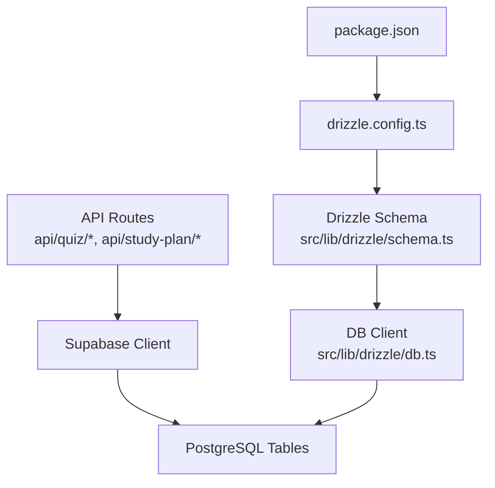
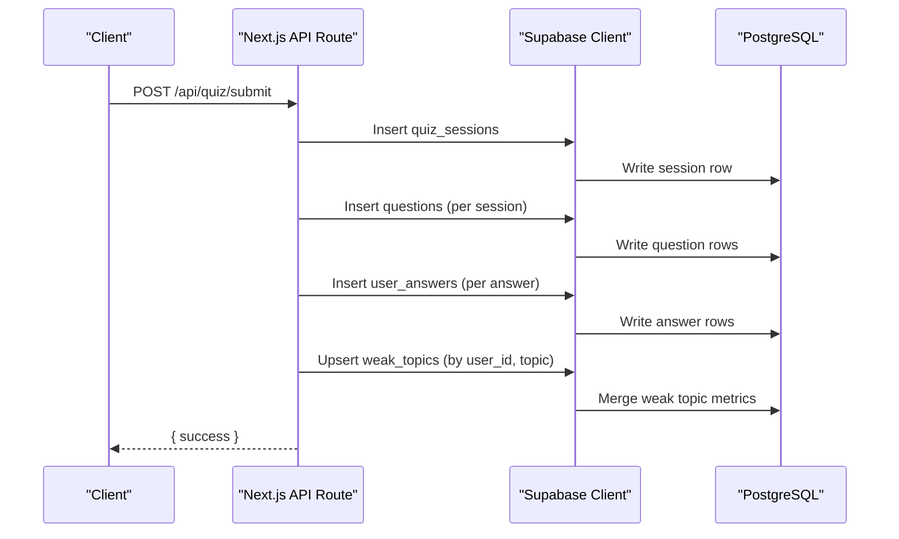
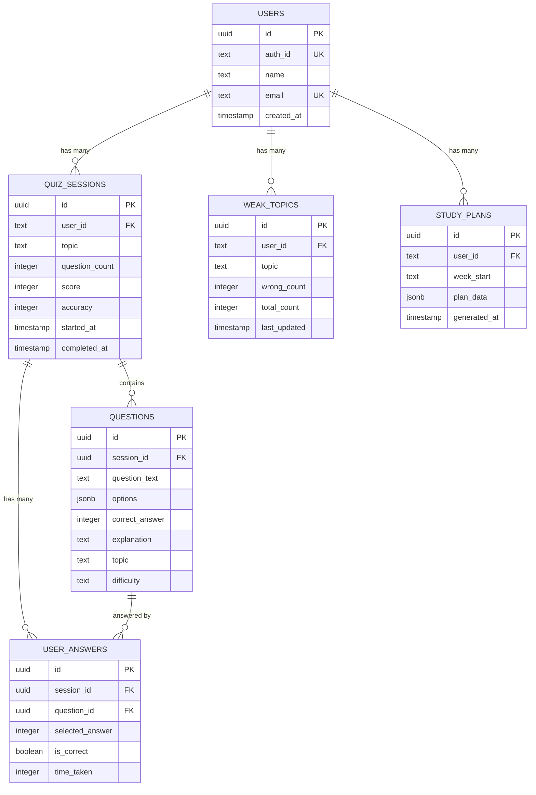
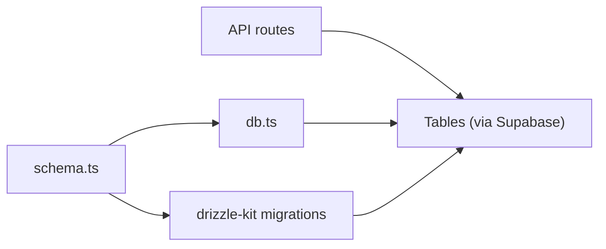

# Database Schema

<cite>
**Referenced Files in This Document**
- [schema.ts](file://Next-app/src/lib/drizzle/schema.ts)
- [db.ts](file://Next-app/src/lib/drizzle/db.ts)
- [drizzle.config.ts](file://Next-app/drizzle.config.ts)
- [package.json](file://Next-app/package.json)
- [submit route](file://Next-app/src/app/api/quiz/submit/route.ts)
- [history route](file://Next-app/src/app/api/quiz/history/route.ts)
- [weak-topics route](file://Next-app/src/app/api/quiz/weak-topics/route.ts)
- [study-plan route](file://Next-app/src/app/api/study-plan/route.ts)
- [quiz types](file://Next-app/src/types/quiz.ts)
- [user types](file://Next-app/src/types/user.ts)
</cite>

## Table of Contents
1. Introduction
2. Project Structure
3. Core Components
4. Architecture Overview
5. Detailed Component Analysis
6. Dependency Analysis
7. Performance Considerations
8. Troubleshooting Guide
9. Conclusion
10. Appendices

## Introduction
This document provides comprehensive data model documentation for the MedAce-AI database schema using Drizzle ORM and PostgreSQL. It details all entities, relationships, field definitions, data types, constraints, primary and foreign keys, indexes, and migration strategy. It also explains how users, quiz sessions, questions, answers, weak topics, and study plans relate to each other, with sample queries, data access patterns, validation rules enforced at the database level, performance considerations, backup/migration procedures, and schema evolution strategies.

## Project Structure
The database layer is defined in a single Drizzle schema file and connected via a database client configured for PostgreSQL. API routes use Supabase client to interact with the same tables that are modeled in Drizzle. The project uses drizzle-kit for migrations and schema management.

**Diagram sources**
- [schema.ts:1-78](file://Next-app/src/lib/drizzle/schema.ts#L1-L78)
- [db.ts:1-10](file://Next-app/src/lib/drizzle/db.ts#L1-L10)
- [drizzle.config.ts:1-11](file://Next-app/drizzle.config.ts#L1-L11)
- [package.json:11-35](file://Next-app/package.json#L11-L35)

**Section sources**
- [schema.ts:1-78](file://Next-app/src/lib/drizzle/schema.ts#L1-L78)
- [db.ts:1-10](file://Next-app/src/lib/drizzle/db.ts#L1-L10)
- [drizzle.config.ts:1-11](file://Next-app/drizzle.config.ts#L1-L11)
- [package.json:11-35](file://Next-app/package.json#L11-L35)

## Core Components
The data model consists of six core tables:

- users: Stores user identity and profile metadata.
- quiz_sessions: Tracks each quiz attempt including topic, question count, score, accuracy, and timestamps.
- questions: Stores generated or loaded questions per session with options, correct answer index, explanation, topic, and difficulty.
- user_answers: Records per-question responses, correctness, and time taken.
- weak_topics: Aggregates per-user topic-level weakness metrics (wrong and total counts) with last update timestamp.
- study_plans: Stores AI-generated weekly study plans keyed by week start date.

Key relationships:
- quiz_sessions.user_id references users.auth_id.
- questions.session_id references quiz_sessions.id.
- user_answers.session_id references quiz_sessions.id; user_answers.question_id references questions.id.
- weak_topics.user_id references users.auth_id.
- study_plans.user_id references users.auth_id.

Data types and constraints:
- IDs are UUIDs with default random generation.
- Timestamps default to now where applicable.
- JSONB fields store flexible structures (options, plan_data).
- Not-null constraints enforce required fields.
- Unique constraints on users.email and users.auth_id ensure identity uniqueness.

Indexes and keys:
- Primary keys on all tables.
- Foreign key constraints link related tables.
- No explicit secondary indexes are defined in the schema; query patterns suggest useful indexes (see Performance Considerations).

**Section sources**
- [schema.ts:11-77](file://Next-app/src/lib/drizzle/schema.ts#L11-L77)

## Architecture Overview
The application uses a hybrid approach:
- Drizzle ORM schema defines the canonical data model.
- API routes currently write/read via Supabase client against the same PostgreSQL tables.
- drizzle-kit config points to the schema and output directory for migrations.

**Diagram sources**
- [submit route:4-103](file://Next-app/src/app/api/quiz/submit/route.ts#L4-L103)

**Section sources**
- [submit route:4-103](file://Next-app/src/app/api/quiz/submit/route.ts#L4-L103)

## Detailed Component Analysis

### Entity Relationship Diagram

**Diagram sources**
- [schema.ts:11-77](file://Next-app/src/lib/drizzle/schema.ts#L11-L77)

### Data Validation Rules and Business Logic at Database Level
- Identity uniqueness: users.auth_id and users.email are unique, preventing duplicate accounts.
- Required fields: Most fields are not null, ensuring essential data integrity.
- Referential integrity: Foreign keys prevent orphaned records across sessions, questions, and answers.
- Defaults: Timestamps default to now; scores and accuracies default to zero when appropriate.
- JSONB flexibility: options and plan_data allow variable structures while remaining typed at the application layer.

Note: Some business logic (e.g., computing accuracy, upserting weak topics) is implemented in API routes rather than triggers or stored procedures.

**Section sources**
- [schema.ts:11-77](file://Next-app/src/lib/drizzle/schema.ts#L11-L77)
- [submit route:18-101](file://Next-app/src/app/api/quiz/submit/route.ts#L18-L101)

### Data Access Patterns and Sample Queries
- Create quiz session and persist results:
  - Insert into quiz_sessions, then insert questions and user_answers linked by session_id, and upsert weak_topics by user_id and topic.
  - Reference: [submit route:24-101](file://Next-app/src/app/api/quiz/submit/route.ts#L24-L101)

- Fetch recent quiz history for a user:
  - Select from quiz_sessions filtered by user_id, ordered by started_at descending, limited to 50.
  - Reference: [history route:15-20](file://Next-app/src/app/api/quiz/history/route.ts#L15-L20)

- Retrieve top weak topics for a user:
  - Select from weak_topics filtered by user_id, ordered by wrong_count descending, limited to 10.
  - Reference: [weak-topics route:15-20](file://Next-app/src/app/api/quiz/weak-topics/route.ts#L15-L20)

- Generate and save a weekly study plan:
  - Read weak_topics and recent quiz_sessions to compute context, generate plan via external service, then insert into study_plans with week_start and plan_data.
  - Reference: [study-plan route:16-68](file://Next-app/src/app/api/study-plan/route.ts#L16-L68)

- Load latest study plan:
  - Select from study_plans filtered by user_id, ordered by generated_at descending, limit 1.
  - Reference: [study-plan route:91-97](file://Next-app/src/app/api/study-plan/route.ts#L91-L97)

**Section sources**
- [submit route:24-101](file://Next-app/src/app/api/quiz/submit/route.ts#L24-L101)
- [history route:15-20](file://Next-app/src/app/api/quiz/history/route.ts#L15-L20)
- [weak-topics route:15-20](file://Next-app/src/app/api/quiz/weak-topics/route.ts#L15-L20)
- [study-plan route:16-68](file://Next-app/src/app/api/study-plan/route.ts#L16-L68)
- [study-plan route:91-97](file://Next-app/src/app/api/study-plan/route.ts#L91-L97)

### Type Definitions Alignment
Frontend TypeScript interfaces align closely with the database model:
- Question, UserAnswer, QuizSession map to questions, user_answers, and quiz_sessions.
- WeakTopic maps to weak_topics.
- StudyPlan maps to study_plans with tasks derived from plan_data.

These types guide client-side validation and UX but do not replace server-side checks.

**Section sources**
- [quiz types:1-47](file://Next-app/src/types/quiz.ts#L1-L47)
- [user types:8-32](file://Next-app/src/types/user.ts#L8-L32)

## Dependency Analysis
- Drizzle schema defines the canonical structure used by migrations and type generation.
- The database client connects to PostgreSQL using environment configuration.
- API routes depend on Supabase client to read/write tables; this coexists with the Drizzle schema definition.
- drizzle-kit orchestrates migrations based on the schema file.

**Diagram sources**
- [schema.ts:1-78](file://Next-app/src/lib/drizzle/schema.ts#L1-L78)
- [db.ts:1-10](file://Next-app/src/lib/drizzle/db.ts#L1-L10)
- [drizzle.config.ts:1-11](file://Next-app/drizzle.config.ts#L1-L11)

**Section sources**
- [schema.ts:1-78](file://Next-app/src/lib/drizzle/schema.ts#L1-L78)
- [db.ts:1-10](file://Next-app/src/lib/drizzle/db.ts#L1-L10)
- [drizzle.config.ts:1-11](file://Next-app/drizzle.config.ts#L1-L11)

## Performance Considerations
Recommended indexes to optimize common queries:
- quiz_sessions(user_id, started_at DESC): Speeds up history listing and recent activity queries.
- user_answers(session_id), user_answers(question_id): Improves joins and lookups for session detail views.
- questions(session_id): Optimizes fetching questions per session.
- weak_topics(user_id, wrong_count DESC): Enhances retrieval of top weak topics.
- study_plans(user_id, generated_at DESC): Accelerates latest plan fetches.

Query patterns observed:
- Filtering by user_id is pervasive; ensure proper indexing on user_id columns.
- Ordering by timestamps is common; include ordering columns in composite indexes where appropriate.
- JSONB fields (options, plan_data) can be large; avoid selecting entire rows if only specific fields are needed.

[No sources needed since this section provides general guidance]

## Troubleshooting Guide
Common issues and mitigations:
- Unauthorized access: API routes check authentication before querying; ensure valid session tokens and user context.
- Missing or inconsistent data: Enforce not-null and foreign key constraints at the database level; validate inputs in API routes.
- Duplicate weak topics: Use upsert semantics on (user_id, topic) to merge updates safely.
- Slow history or weak topics queries: Add composite indexes as recommended above.
- Migration conflicts: Use drizzle-kit to manage incremental migrations; back up before applying changes.

Operational tips:
- Log errors consistently in API routes for quick diagnosis.
- Validate payloads early to reduce unnecessary database writes.
- Use transactions for multi-step writes (e.g., session + questions + answers) to maintain consistency.

**Section sources**
- [submit route:105-111](file://Next-app/src/app/api/quiz/submit/route.ts#L105-L111)
- [history route:22-30](file://Next-app/src/app/api/quiz/history/route.ts#L22-L30)
- [weak-topics route:22-30](file://Next-app/src/app/api/quiz/weak-topics/route.ts#L22-L30)
- [study-plan route:71-77](file://Next-app/src/app/api/study-plan/route.ts#L71-L77)

## Conclusion
The MedAce-AI database schema models a cohesive learning system centered around users, quiz sessions, questions, answers, weak topics, and study plans. The Drizzle schema defines clear relationships and constraints, while API routes implement business logic such as scoring, weak topic aggregation, and plan generation. With recommended indexes and disciplined migration practices, the system can scale efficiently and remain maintainable as features evolve.

[No sources needed since this section summarizes without analyzing specific files]

## Appendices

### Migration Strategy
- Tooling: drizzle-kit configured to use PostgreSQL dialect and the schema file.
- Workflow:
  - Define schema changes in schema.ts.
  - Generate migrations with drizzle-kit.
  - Apply migrations to target environments.
  - Rollback by reverting migrations and reapplying as needed.
- Configuration:
  - Schema path and output directory are set in drizzle.config.ts.
  - Database URL is provided via environment variables.

**Section sources**
- [drizzle.config.ts:1-11](file://Next-app/drizzle.config.ts#L1-L11)
- [package.json:24-35](file://Next-app/package.json#L24-L35)

### Backup Procedures
- Use PostgreSQL-native tools (e.g., pg_dump) to schedule regular backups of the database.
- Back up both schema and data periodically; retain multiple versions for recovery.
- Store backups securely with encryption and restricted access.
- Test restore procedures regularly to ensure recoverability.

[No sources needed since this section provides general guidance]

### Schema Evolution Guidelines
- Prefer additive changes (new columns, new tables) over destructive changes.
- Use migrations to introduce new fields gradually; populate defaults where necessary.
- For JSONB fields, evolve structures carefully and maintain backward compatibility in API responses.
- Coordinate schema changes with API versioning to avoid breaking clients.

[No sources needed since this section provides general guidance]