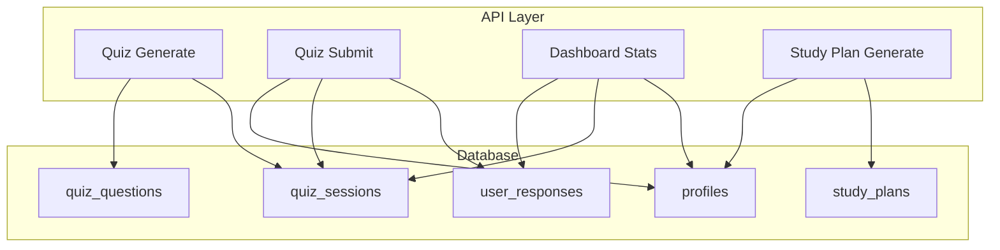
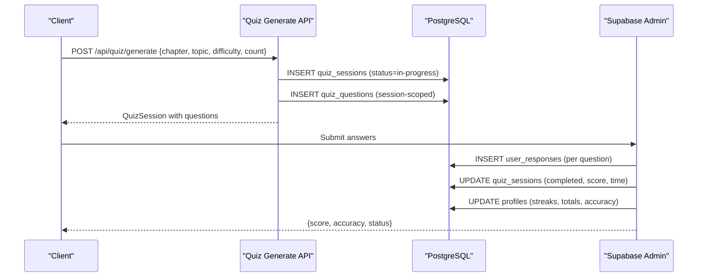
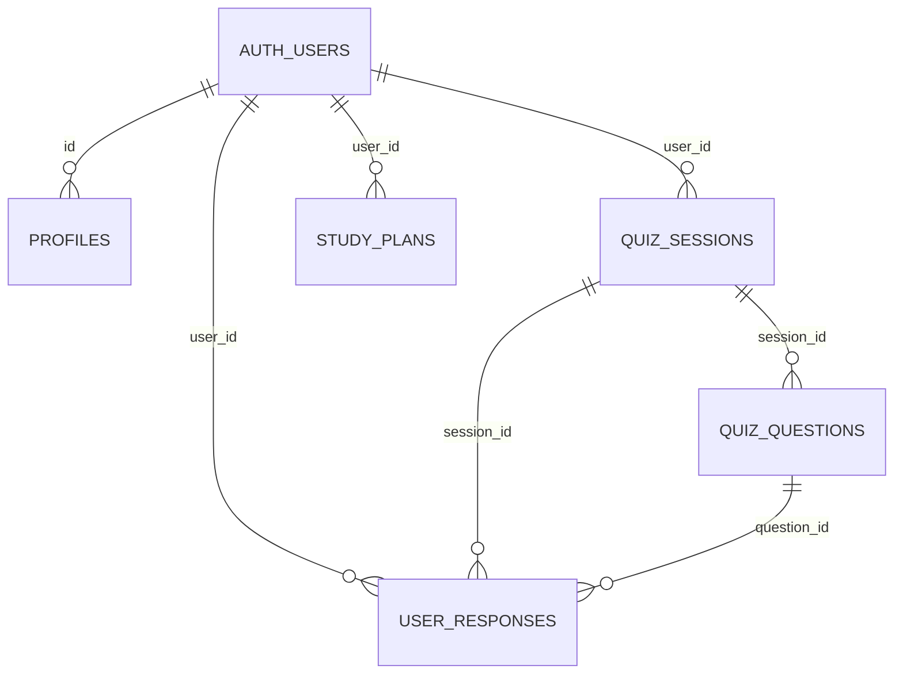

# Core Relational Tables

<cite>
**Referenced Files in This Document**
- [schema.sql](file://supabase/schema.sql)
- [route.ts](file://src/app/api/quiz/generate/route.ts)
- [route.ts](file://src/app/api/quiz/submit/route.ts)
- [route.ts](file://src/app/api/dashboard/stats/route.ts)
- [route.ts](file://src/app/api/study-plan/generate/route.ts)
- [quiz.ts](file://src/types/quiz.ts)
</cite>

## Table of Contents
1. Introduction
2. Project Structure
3. Core Components
4. Architecture Overview
5. Detailed Component Analysis
6. Dependency Analysis
7. Performance Considerations
8. Troubleshooting Guide
9. Conclusion

## Introduction
This document provides comprehensive documentation for MedAce-AI’s core relational database tables that underpin the application’s learning and assessment features. It focuses on:
- profiles: user metadata and performance tracking
- quiz_sessions: practice session management
- quiz_questions: generated questions with bilingual explanations
- user_responses: student answers and per-question performance
- study_plans: personalized learning schedules

It covers field definitions, data types, constraints, relationships (primary keys, foreign keys, referential integrity), validation rules enforced at the database level, and common query patterns used by the application.

## Project Structure
The database schema is defined in a single SQL file and is consumed by Next.js API routes that create sessions, record responses, compute scores, update profile statistics, and persist study plans. TypeScript interfaces define the client-side contracts for these entities.

**Diagram sources**
- [schema.sql:10-112](file://supabase/schema.sql#L10-L112)
- [route.ts:10-196](file://src/app/api/quiz/generate/route.ts#L10-L196)
- [route.ts:6-141](file://src/app/api/quiz/submit/route.ts#L6-L141)
- [route.ts:1-85](file://src/app/api/dashboard/stats/route.ts#L1-L85)
- [route.ts:8-122](file://src/app/api/study-plan/generate/route.ts#L8-L122)

**Section sources**
- [schema.sql:10-112](file://supabase/schema.sql#L10-L112)
- [quiz.ts:15-76](file://src/types/quiz.ts#L15-L76)

## Core Components
This section summarizes each core table’s purpose, fields, constraints, and usage within the app.

- profiles
  - Purpose: Stores user identity linkage and longitudinal performance metrics (streaks, totals, accuracy).
  - Key fields: id (PK, FK to auth.users), full_name, email, current_streak, longest_streak, last_active_date, target_exam_date, total_questions, total_sessions, overall_accuracy, created_at, updated_at.
  - Constraints: PK; FK to auth.users with CASCADE delete; default timestamps.
  - Usage: Updated on quiz submission to maintain streaks, totals, and accuracy; read by dashboard stats; updated when setting target exam date via study plan generation.

- quiz_sessions
  - Purpose: Represents a practice session scoped to a topic/chapter/difficulty with status and timing.
  - Key fields: id (PK), user_id (FK to auth.users), topic, chapter_num, difficulty (check enum), num_questions, score, total_questions, status (check enum), time_taken_ms, created_at, updated_at.
  - Constraints: PK; FK to auth.users with CASCADE; CHECK on difficulty/status; indexes on user_id.
  - Usage: Created on quiz generation; updated to completed with score/time on submit; queried for recent sessions and weekly counts.

- quiz_questions
  - Purpose: Stores generated multiple-choice questions with bilingual explanations and metadata.
  - Key fields: id (PK), session_id (FK to quiz_sessions), question_text, option_a/b/c/d, correct_answer (check enum), explanation_en, explanation_ur, difficulty (check enum), topic, chapter_num, chunk_ids (UUID[]), created_at.
  - Constraints: PK; FK to quiz_sessions with CASCADE; CHECK on correct_answer and difficulty; index on session_id.
  - Usage: Inserted alongside session creation; referenced during answer verification and retrieval.

- user_responses
  - Purpose: Records each student answer per question with correctness and timing.
  - Key fields: id (PK), session_id (FK to quiz_sessions), question_id (FK to quiz_questions), user_id (FK to auth.users), selected_answer (check enum or null), is_correct, time_taken_ms, created_at.
  - Constraints: PK; FKs with CASCADE; CHECK on selected_answer; indexes on user_id and session_id.
  - Usage: Bulk inserted on quiz submit; aggregated for weak topics and analytics.

- study_plans
  - Purpose: Persists AI-generated weekly study plans as JSONB with week number and target exam date.
  - Key fields: id (PK), user_id (FK to auth.users), target_exam_date, week_number, plan_data (JSONB), created_at, updated_at.
  - Constraints: PK; FK to auth.users with CASCADE; index on user_id.
  - Usage: Created by study plan generator; also updates user’s target_exam_date in profiles.

**Section sources**
- [schema.sql:10-112](file://supabase/schema.sql#L10-L112)
- [route.ts:10-196](file://src/app/api/quiz/generate/route.ts#L10-L196)
- [route.ts:6-141](file://src/app/api/quiz/submit/route.ts#L6-L141)
- [route.ts:1-85](file://src/app/api/dashboard/stats/route.ts#L1-L85)
- [route.ts:8-122](file://src/app/api/study-plan/generate/route.ts#L8-L122)
- [quiz.ts:15-76](file://src/types/quiz.ts#L15-L76)

## Architecture Overview
The data flow spans API endpoints that orchestrate database writes and reads across the core tables.

**Diagram sources**
- [route.ts:10-196](file://src/app/api/quiz/generate/route.ts#L10-L196)
- [route.ts:6-141](file://src/app/api/quiz/submit/route.ts#L6-L141)
- [schema.sql:46-112](file://supabase/schema.sql#L46-L112)

## Detailed Component Analysis

### Profiles Table
- Fields and types
  - id: UUID, PK, FK to auth.users(id) ON DELETE CASCADE
  - full_name: TEXT
  - email: TEXT
  - current_streak: INT DEFAULT 0
  - longest_streak: INT DEFAULT 0
  - last_active_date: DATE
  - target_exam_date: DATE
  - total_questions: INT DEFAULT 0
  - total_sessions: INT DEFAULT 0
  - overall_accuracy: FLOAT DEFAULT 0.0
  - created_at: TIMESTAMPTZ DEFAULT NOW()
  - updated_at: TIMESTAMPTZ DEFAULT NOW()
- Constraints and integrity
  - Referential integrity enforced via FK to auth.users; cascade deletes ensure orphan cleanup.
  - No explicit CHECK constraints on numeric fields; application logic ensures non-negative values and percentage bounds.
- Typical records
  - Example row: id=uuid, full_name="Ayesha Khan", email="ayesha@example.com", current_streak=5, longest_streak=12, last_active_date="2025-09-10", target_exam_date="2026-01-15", total_questions=340, total_sessions=28, overall_accuracy=78.5, created_at/updated_at timestamps.
- Common queries
  - Read own profile: SELECT * FROM profiles WHERE id = auth.uid();
  - Update streak and accuracy after session completion: UPDATE profiles SET current_streak=?, longest_streak=?, last_active_date=?, total_questions=?, total_sessions=?, overall_accuracy=?, updated_at=NOW() WHERE id=?;
  - Set target exam date: UPDATE profiles SET target_exam_date=?, updated_at=NOW() WHERE id=?;
- Validation rules
  - Row Level Security policies restrict access to the authenticated user’s own profile.
  - Automatic profile creation on new user signup via trigger.

**Section sources**
- [schema.sql:10-24](file://supabase/schema.sql#L10-L24)
- [schema.sql:155-173](file://supabase/schema.sql#L155-L173)
- [schema.sql:231-249](file://supabase/schema.sql#L231-L249)
- [route.ts:76-122](file://src/app/api/quiz/submit/route.ts#L76-L122)
- [route.ts:94-112](file://src/app/api/study-plan/generate/route.ts#L94-L112)

### Quiz Sessions Table
- Fields and types
  - id: UUID, PK, DEFAULT gen_random_uuid()
  - user_id: UUID, FK to auth.users(id) ON DELETE CASCADE NOT NULL
  - topic: TEXT NOT NULL
  - chapter_num: INT NOT NULL
  - difficulty: TEXT NOT NULL CHECK IN ('Easy','Medium','Hard','Mixed')
  - num_questions: INT NOT NULL
  - score: INT DEFAULT NULL
  - total_questions: INT NOT NULL
  - status: TEXT NOT NULL DEFAULT 'in-progress' CHECK IN ('in-progress','completed')
  - time_taken_ms: INT DEFAULT 0
  - created_at: TIMESTAMPTZ DEFAULT NOW()
  - updated_at: TIMESTAMPTZ DEFAULT NOW()
- Indexes
  - quiz_sessions_user_id_idx on user_id
- Typical records
  - Example row: id=uuid, user_id=uuid, topic="Nervous System of Man", chapter_num=5, difficulty="Mixed", num_questions=10, score=7, total_questions=10, status="completed", time_taken_ms=420000, created_at/updated_at timestamps.
- Common queries
  - Create session: INSERT INTO quiz_sessions (id,user_id,topic,chapter_num,difficulty,num_questions,total_questions,status) VALUES ...;
  - Mark completed: UPDATE quiz_sessions SET status='completed', score=?, time_taken_ms=?, updated_at=NOW() WHERE id=?;
  - Recent completed sessions: SELECT * FROM quiz_sessions WHERE user_id=? AND status='completed' ORDER BY created_at DESC LIMIT ?;
  - Weekly aggregation: SUM(total_questions) WHERE created_at >= now()-interval '7 days';
- Validation rules
  - CHECK constraints enforce allowed difficulty and status values.
  - RLS policies allow users to manage only their own sessions.

**Section sources**
- [schema.sql:46-63](file://supabase/schema.sql#L46-L63)
- [schema.sql:181-192](file://supabase/schema.sql#L181-L192)
- [route.ts:137-171](file://src/app/api/quiz/generate/route.ts#L137-L171)
- [route.ts:65-74](file://src/app/api/quiz/submit/route.ts#L65-L74)
- [route.ts:58-83](file://src/app/api/dashboard/stats/route.ts#L58-L83)

### Quiz Questions Table
- Fields and types
  - id: UUID, PK, DEFAULT gen_random_uuid()
  - session_id: UUID, FK to quiz_sessions(id) ON DELETE CASCADE NOT NULL
  - question_text: TEXT NOT NULL
  - option_a/b/c/d: TEXT NOT NULL
  - correct_answer: TEXT NOT NULL CHECK IN ('A','B','C','D')
  - explanation_en: TEXT NOT NULL
  - explanation_ur: TEXT NOT NULL
  - difficulty: TEXT NOT NULL CHECK IN ('Easy','Medium','Hard')
  - topic: TEXT NOT NULL
  - chapter_num: INT
  - chunk_ids: UUID[] DEFAULT ARRAY[]::UUID[]
  - created_at: TIMESTAMPTZ DEFAULT NOW()
- Indexes
  - quiz_questions_session_id_idx on session_id
- Typical records
  - Example row: id=uuid, session_id=uuid, question_text="...", option_a/b/c/d strings, correct_answer="B", explanation_en="...", explanation_ur="...", difficulty="Medium", topic="Endocrine System of Man", chapter_num=6, chunk_ids=[...], created_at timestamp.
- Common queries
  - Insert batch: INSERT INTO quiz_questions (session_id, question_text, option_a, option_b, option_c, option_d, correct_answer, explanation_en, explanation_ur, difficulty, topic, chapter_num, chunk_ids) VALUES ...;
  - Fetch by session: SELECT * FROM quiz_questions WHERE session_id=?;
  - Verify correct answer: SELECT correct_answer FROM quiz_questions WHERE id=?;
- Validation rules
  - CHECK constraints enforce valid options and difficulty levels.
  - RLS policies restrict visibility to questions belonging to the user’s sessions.

**Section sources**
- [schema.sql:64-84](file://supabase/schema.sql#L64-L84)
- [schema.sql:194-211](file://supabase/schema.sql#L194-L211)
- [route.ts:153-171](file://src/app/api/quiz/generate/route.ts#L153-L171)
- [route.ts:20-30](file://src/app/api/quiz/submit/route.ts#L20-L30)

### User Responses Table
- Fields and types
  - id: UUID, PK, DEFAULT gen_random_uuid()
  - session_id: UUID, FK to quiz_sessions(id) ON DELETE CASCADE NOT NULL
  - question_id: UUID, FK to quiz_questions(id) ON DELETE CASCADE NOT NULL
  - user_id: UUID, FK to auth.users(id) ON DELETE CASCADE NOT NULL
  - selected_answer: TEXT CHECK IN ('A','B','C','D') OR NULL
  - is_correct: BOOLEAN NOT NULL
  - time_taken_ms: INT DEFAULT 0
  - created_at: TIMESTAMPTZ DEFAULT NOW()
- Indexes
  - user_responses_user_id_idx on user_id
  - user_responses_session_id_idx on session_id
- Typical records
  - Example row: id=uuid, session_id=uuid, question_id=uuid, user_id=uuid, selected_answer="B", is_correct=true, time_taken_ms=15000, created_at timestamp.
- Common queries
  - Bulk insert: INSERT INTO user_responses (session_id, question_id, user_id, selected_answer, is_correct, time_taken_ms) VALUES ...;
  - Aggregate per topic: GROUP BY topic from joined quiz_questions to compute error counts and attempt counts.
  - Filter by session/user: SELECT * FROM user_responses WHERE session_id=? AND user_id=?;
- Validation rules
  - CHECK constraint allows only valid answer letters or NULL.
  - RLS policies allow users to view and insert only their own responses.

**Section sources**
- [schema.sql:85-99](file://supabase/schema.sql#L85-L99)
- [schema.sql:213-220](file://supabase/schema.sql#L213-L220)
- [route.ts:52-64](file://src/app/api/quiz/submit/route.ts#L52-L64)

### Study Plans Table
- Fields and types
  - id: UUID, PK, DEFAULT gen_random_uuid()
  - user_id: UUID, FK to auth.users(id) ON DELETE CASCADE NOT NULL
  - target_exam_date: DATE
  - week_number: INT DEFAULT 1
  - plan_data: JSONB NOT NULL
  - created_at: TIMESTAMPTZ DEFAULT NOW()
  - updated_at: TIMESTAMPTZ DEFAULT NOW()
- Indexes
  - study_plans_user_id_idx on user_id
- Typical records
  - Example row: id=uuid, user_id=uuid, target_exam_date="2026-01-15", week_number=4, plan_data={weekNumber, rationale, insights, days:[...]}, created_at/updated_at timestamps.
- Common queries
  - Create plan: INSERT INTO study_plans (id, user_id, target_exam_date, week_number, plan_data) VALUES ...;
  - Retrieve latest plan: SELECT * FROM study_plans WHERE user_id=? ORDER BY created_at DESC LIMIT 1;
- Validation rules
  - RLS policies allow users to view and manage only their own plans.
  - Application-level validation ensures required fields in plan_data before insertion.

**Section sources**
- [schema.sql:100-112](file://supabase/schema.sql#L100-L112)
- [schema.sql:222-229](file://supabase/schema.sql#L222-L229)
- [route.ts:94-112](file://src/app/api/study-plan/generate/route.ts#L94-L112)

## Dependency Analysis
Relationships between tables are central to MedAce-AI’s data model:

- Primary keys
  - All tables use UUID primary keys; profiles uses auth.users.id as PK.
- Foreign key relationships
  - quiz_sessions.user_id -> auth.users.id (CASCADE)
  - quiz_questions.session_id -> quiz_sessions.id (CASCADE)
  - user_responses.session_id -> quiz_sessions.id (CASCADE)
  - user_responses.question_id -> quiz_questions.id (CASCADE)
  - user_responses.user_id -> auth.users.id (CASCADE)
  - study_plans.user_id -> auth.users.id (CASCADE)
  - profiles.id -> auth.users.id (CASCADE)
- Referential integrity
  - CASCADE deletes ensure consistent cleanup when users or parent records are removed.
  - CHECK constraints enforce domain validity for enums like difficulty and status.
- Indexing strategy
  - Frequent lookups on user_id and session_id are indexed for performance.
  - Vector search support via textbook_chunks (not part of core relational scope) includes HNSW index for similarity queries.

**Diagram sources**
- [schema.sql:10-112](file://supabase/schema.sql#L10-L112)

**Section sources**
- [schema.sql:10-112](file://supabase/schema.sql#L10-L112)

## Performance Considerations
- Indexes
  - quiz_sessions.user_id, quiz_questions.session_id, user_responses.user_id/session_id accelerate common queries for dashboards and analytics.
- Batch operations
  - Question and response inserts are performed in batches to reduce round-trips.
- Data scoping
  - RLS policies limit result sets to the current user, reducing payload size and improving security.
- Optional vector search
  - Textbook chunks use an HNSW index for fast cosine similarity; this is optional and isolated from core relational paths.

[No sources needed since this section provides general guidance]

## Troubleshooting Guide
Common issues and resolutions tied to the database layer:

- Missing profile on first login
  - Ensure the trigger on auth.users creates a profile entry. If missing, manually insert into profiles or re-run migration.
  - Section sources
    - [schema.sql:231-249](file://supabase/schema.sql#L231-L249)

- Incorrect difficulty or status values
  - CHECK constraints will reject invalid values. Validate inputs before insertion.
  - Section sources
    - [schema.sql:46-63](file://supabase/schema.sql#L46-L63)
    - [schema.sql:64-84](file://supabase/schema.sql#L64-L84)

- Answer validation failures
  - selected_answer must be one of 'A','B','C','D' or NULL. Ensure frontend sends valid choices.
  - Section sources
    - [schema.sql:85-99](file://supabase/schema.sql#L85-L99)

- RLS policy violations
  - Users can only access their own data. Confirm auth context and policies.
  - Section sources
    - [schema.sql:155-229](file://supabase/schema.sql#L155-L229)

- Session not marked completed
  - Submit endpoint must update quiz_sessions status and score. Check API logs and DB updates.
  - Section sources
    - [route.ts:65-74](file://src/app/api/quiz/submit/route.ts#L65-L74)

- Profile stats not updating
  - After submission, profiles should update streaks, totals, and accuracy. Verify update statements and user context.
  - Section sources
    - [route.ts:76-122](file://src/app/api/quiz/submit/route.ts#L76-L122)

## Conclusion
MedAce-AI’s relational schema centers around five core tables that capture user identity and progress, practice sessions, generated questions with bilingual explanations, per-question responses, and personalized study plans. The design leverages strict constraints, robust indexing, and RLS policies to ensure data integrity, security, and performance. API routes implement end-to-end workflows that create sessions, record responses, compute scores, and update user metrics, while study plan generation persists structured plans and aligns them with user goals.