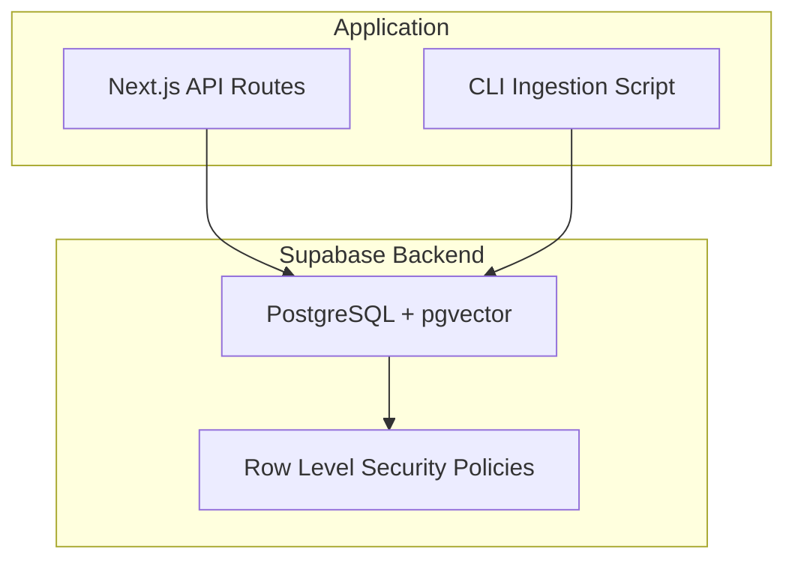
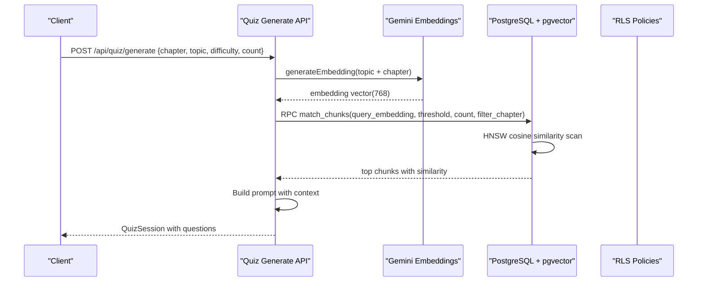
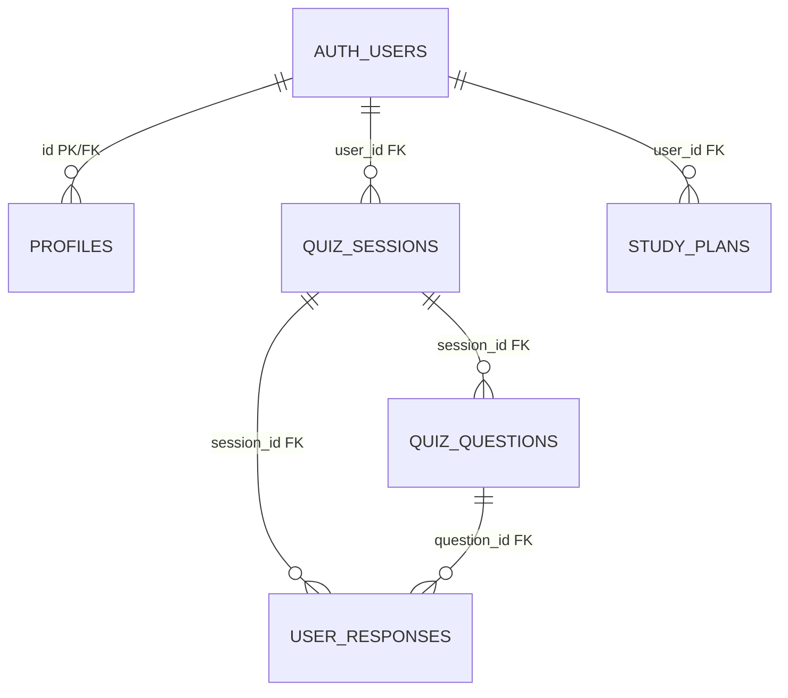
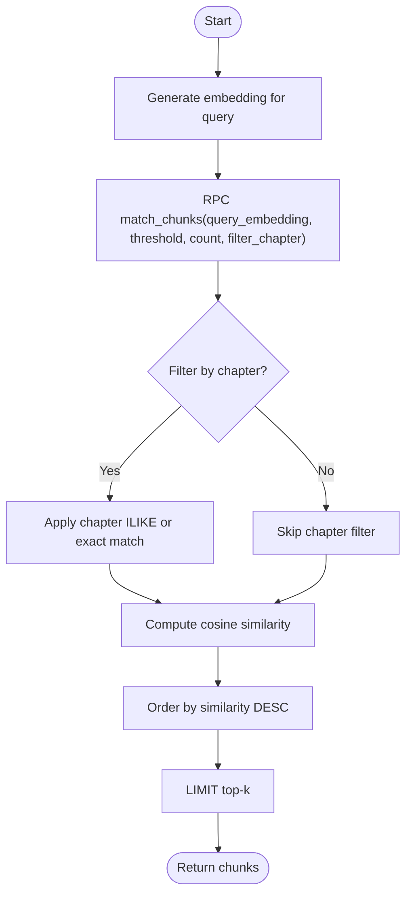
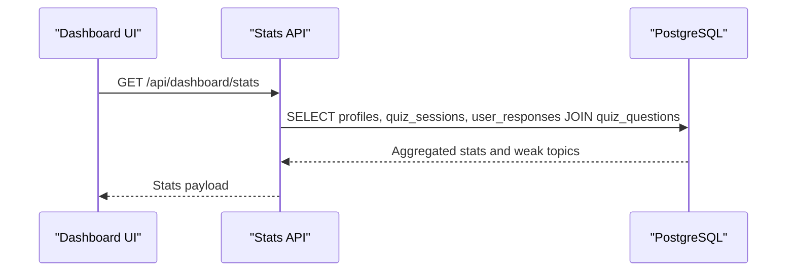
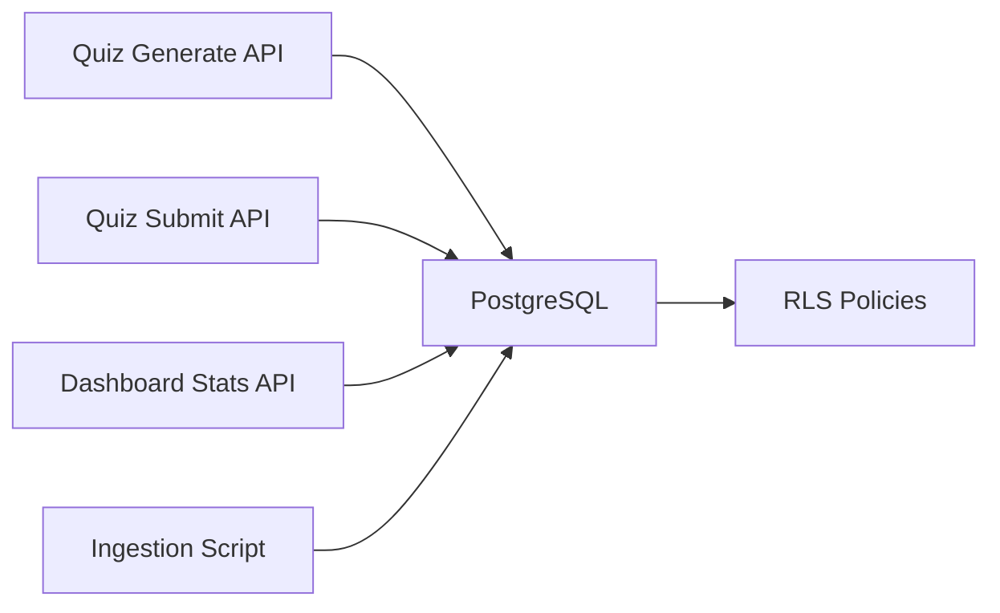
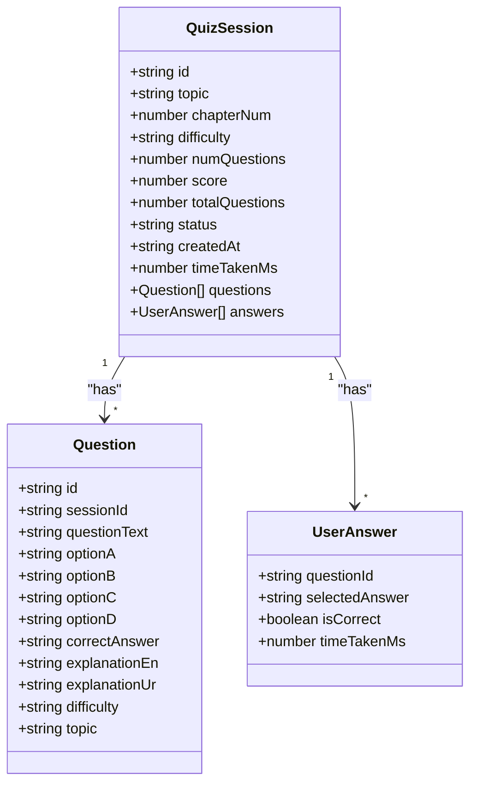

# Database Schema

<cite>
**Referenced Files in This Document**
- [schema.sql](file://supabase/schema.sql)
- [README.md](file://README.md)
- [route.ts (quiz generate)](file://src/app/api/quiz/generate/route.ts)
- [route.ts (quiz submit)](file://src/app/api/quiz/submit/route.ts)
- [route.ts (dashboard stats)](file://src/app/api/dashboard/stats/route.ts)
- [ingest-textbooks.ts](file://scripts/ingest-textbooks.ts)
- [gemini.ts](file://src/lib/ai/gemini.ts)
- [quiz.ts](file://src/types/quiz.ts)
</cite>

## Table of Contents
1. Introduction
2. Project Structure
3. Core Components
4. Architecture Overview
5. Detailed Component Analysis
6. Dependency Analysis
7. Performance Considerations
8. Troubleshooting Guide
9. Conclusion
10. Appendices

## Introduction
This document provides comprehensive data model documentation for MedAce-AI’s PostgreSQL database schema, focusing on entity relationships, field definitions, and data types across all tables. It explains the pgvector integration used to store textbook chunk embeddings and enable semantic similarity search, outlines database-level validation rules and business rules that ensure data integrity, and documents data access patterns, caching strategies, performance considerations for vector queries, lifecycle management, security measures, privacy requirements, and access control mechanisms.

## Project Structure
The database schema is defined in a single SQL file under the Supabase project directory. The application uses Next.js API routes to interact with the database via Supabase clients, and a CLI script to ingest textbook content into the vector store.

**Diagram sources**
- [schema.sql:1-250](file://supabase/schema.sql#L1-L250)
- [route.ts (quiz generate):1-196](file://src/app/api/quiz/generate/route.ts#L1-L196)
- [route.ts (quiz submit):1-141](file://src/app/api/quiz/submit/route.ts#L1-L141)
- [ingest-textbooks.ts:1-189](file://scripts/ingest-textbooks.ts#L1-L189)

**Section sources**
- [schema.sql:1-250](file://supabase/schema.sql#L1-L250)
- [README.md:27-83](file://README.md#L27-L83)

## Core Components
MedAce-AI’s database includes the following core entities:
- profiles (user metadata and performance stats)
- textbook_chunks (RAG knowledge base with vector embeddings)
- quiz_sessions (per-session metadata)
- quiz_questions (questions belonging to a session)
- user_responses (answers recorded per question)
- study_plans (adaptive weekly plans stored as JSONB)

Key characteristics:
- All identifiers are UUIDs generated by the database.
- Foreign keys reference auth.users(id) for users and enforce cascade deletes where appropriate.
- CHECK constraints enforce enumerated values for fields like difficulty, status, and correct_answer.
- Row Level Security (RLS) policies restrict data access to the authenticated user’s scope.
- A pgvector index accelerates cosine similarity searches over textbook chunk embeddings.

**Section sources**
- [schema.sql:10-111](file://supabase/schema.sql#L10-L111)
- [schema.sql:152-229](file://supabase/schema.sql#L152-L229)

## Architecture Overview
The system integrates a Retrieval-Augmented Generation (RAG) pipeline using pgvector to ground MCQ generation in textbook content.

**Diagram sources**
- [route.ts (quiz generate):10-49](file://src/app/api/quiz/generate/route.ts#L10-L49)
- [schema.sql:116-150](file://supabase/schema.sql#L116-L150)
- [schema.sql:38-44](file://supabase/schema.sql#L38-L44)

## Detailed Component Analysis

### Entity Relationship Model

**Diagram sources**
- [schema.sql:10-24](file://supabase/schema.sql#L10-L24)
- [schema.sql:46-60](file://supabase/schema.sql#L46-L60)
- [schema.sql:64-83](file://supabase/schema.sql#L64-L83)
- [schema.sql:85-98](file://supabase/schema.sql#L85-L98)
- [schema.sql:100-111](file://supabase/schema.sql#L100-L111)

### Table Definitions and Constraints

- profiles
  - Purpose: User metadata and aggregated performance statistics.
  - Primary key: id (UUID, references auth.users).
  - Key fields: full_name, email, streaks, last_active_date, target_exam_date, total_questions, total_sessions, overall_accuracy.
  - Timestamps: created_at, updated_at.
  - Notes: Auto-created on new user signup via trigger.

- textbook_chunks
  - Purpose: Knowledge base for RAG; stores cleaned text segments and their embeddings.
  - Primary key: id (UUID).
  - Key fields: chapter, chapter_num, chunk_index, content, token_count, embedding vector(768).
  - Indexes: HNSW index on embedding for cosine similarity; chapter_num index for filtering.
  - Access: Readable by authenticated and anonymous roles via RLS policy.

- quiz_sessions
  - Purpose: Tracks each practice session’s metadata.
  - Primary key: id (UUID).
  - Foreign keys: user_id references auth.users.
  - Key fields: topic, chapter_num, difficulty (CHECK), num_questions, score, total_questions, status (CHECK), time_taken_ms.
  - Indexes: user_id.

- quiz_questions
  - Purpose: Stores questions generated for a session.
  - Primary key: id (UUID).
  - Foreign keys: session_id references quiz_sessions.
  - Key fields: question_text, option_a/b/c/d, correct_answer (CHECK), explanation_en, explanation_ur, difficulty (CHECK), topic, chapter_num, chunk_ids (UUID[]).
  - Indexes: session_id.

- user_responses
  - Purpose: Records user answers per question within a session.
  - Primary key: id (UUID).
  - Foreign keys: session_id references quiz_sessions, question_id references quiz_questions, user_id references auth.users.
  - Key fields: selected_answer (CHECK or NULL), is_correct, time_taken_ms.
  - Indexes: user_id, session_id.

- study_plans
  - Purpose: Adaptive weekly study plans stored as flexible JSONB.
  - Primary key: id (UUID).
  - Foreign keys: user_id references auth.users.
  - Key fields: target_exam_date, week_number, plan_data (JSONB).
  - Indexes: user_id.

**Section sources**
- [schema.sql:10-24](file://supabase/schema.sql#L10-L24)
- [schema.sql:26-44](file://supabase/schema.sql#L26-L44)
- [schema.sql:46-60](file://supabase/schema.sql#L46-L60)
- [schema.sql:64-83](file://supabase/schema.sql#L64-L83)
- [schema.sql:85-98](file://supabase/schema.sql#L85-L98)
- [schema.sql:100-111](file://supabase/schema.sql#L100-L111)

### Data Validation Rules at Database Level
- Enumerated checks:
  - quiz_sessions.difficulty IN ('Easy', 'Medium', 'Hard', 'Mixed').
  - quiz_sessions.status IN ('in-progress', 'completed').
  - quiz_questions.correct_answer IN ('A', 'B', 'C', 'D').
  - quiz_questions.difficulty IN ('Easy', 'Medium', 'Hard').
  - user_responses.selected_answer IN ('A', 'B', 'C', 'D') OR NULL.
- Not-null constraints:
  - Many fields such as topic, chapter_num, num_questions, total_questions, question_text, options, explanations, and plan_data are NOT NULL.
- Referential integrity:
  - Foreign keys enforce relationships between sessions, questions, responses, and users with ON DELETE CASCADE where appropriate.

**Section sources**
- [schema.sql:46-60](file://supabase/schema.sql#L46-L60)
- [schema.sql:64-83](file://supabase/schema.sql#L64-L83)
- [schema.sql:85-98](file://supabase/schema.sql#L85-L98)

### Business Rules and Integrity
- Session lifecycle:
  - Sessions start as 'in-progress' and transition to 'completed' upon submission.
  - Score and time_taken_ms are updated when a session completes.
- Profile updates:
  - On completion, profile aggregates update current_streak, longest_streak, last_active_date, total_questions, total_sessions, and overall_accuracy.
- Weak topics computation:
  - Dashboard computes weakness scores from user_responses joined with quiz_questions to identify topics needing focus.

**Section sources**
- [route.ts (quiz submit):43-122](file://src/app/api/quiz/submit/route.ts#L43-L122)
- [route.ts (dashboard stats):83-125](file://src/app/api/dashboard/stats/route.ts#L83-L125)

### pgvector Integration and Semantic Similarity Search
- Embeddings:
  - Generated via Gemini embedding model to produce 768-dimensional vectors.
  - Stored in textbook_chunks.embedding.
- Indexing:
  - HNSW index on embedding using cosine operations enables fast approximate nearest neighbor search.
- Query function:
  - match_chunks RPC performs cosine similarity scoring and returns top-k relevant chunks filtered by chapter if provided.
- Usage in app:
  - Quiz generation embeds the query (topic + chapter), calls match_chunks, and augments context for LLM prompting.

**Diagram sources**
- [schema.sql:116-150](file://supabase/schema.sql#L116-L150)
- [schema.sql:38-44](file://supabase/schema.sql#L38-L44)
- [gemini.ts:21-43](file://src/lib/ai/gemini.ts#L21-L43)
- [route.ts (quiz generate):33-49](file://src/app/api/quiz/generate/route.ts#L33-L49)

**Section sources**
- [schema.sql:26-44](file://supabase/schema.sql#L26-L44)
- [schema.sql:116-150](file://supabase/schema.sql#L116-L150)
- [gemini.ts:21-43](file://src/lib/ai/gemini.ts#L21-L43)
- [route.ts (quiz generate):33-49](file://src/app/api/quiz/generate/route.ts#L33-L49)

### Data Access Patterns
- Quiz generation:
  - Validates input, generates embedding, retrieves relevant chunks via match_chunks, builds prompt, generates questions, persists session and questions.
- Quiz submission:
  - Validates answers, verifies correctness against stored questions, records responses, updates session status and profile metrics.
- Dashboard stats:
  - Aggregates user responses and joins with quiz_questions to compute weak topics and accuracy.

**Diagram sources**
- [route.ts (dashboard stats):83-125](file://src/app/api/dashboard/stats/route.ts#L83-L125)

**Section sources**
- [route.ts (quiz generate):10-196](file://src/app/api/quiz/generate/route.ts#L10-L196)
- [route.ts (quiz submit):6-141](file://src/app/api/quiz/submit/route.ts#L6-L141)
- [route.ts (dashboard stats):83-125](file://src/app/api/dashboard/stats/route.ts#L83-L125)

### Caching Strategies
- Application-level caching:
  - TanStack Query caches API responses for dashboard stats and other endpoints, reducing redundant network requests and improving perceived performance.
- Database-level acceleration:
  - HNSW index on embeddings speeds up vector similarity queries.
  - Standard indexes on user_id, session_id optimize common join and filter patterns.

[No sources needed since this section provides general guidance]

### Performance Considerations for Vector Queries
- Use appropriate match_threshold to balance recall and latency.
- Filter by chapter when possible to reduce search space.
- Tune HNSW parameters if customizing the index beyond defaults.
- Batch ingestion with rate limiting to avoid API throttling during indexing.

**Section sources**
- [schema.sql:38-44](file://supabase/schema.sql#L38-L44)
- [schema.sql:116-150](file://supabase/schema.sql#L116-L150)
- [ingest-textbooks.ts:135-165](file://scripts/ingest-textbooks.ts#L135-L165)

### Data Lifecycle Management
- Retention policies:
  - No explicit retention or archival policies are defined in the schema. Long-term storage of quiz history and study plans depends on operational decisions outside the schema.
- Archival rules:
  - No automated archival triggers or partitioning are present. Consider adding scheduled jobs or external processes to archive completed sessions or compress old data if volume grows.

[No sources needed since this section summarizes without analyzing specific files]

### Security Measures, Privacy, and Access Control
- Row Level Security (RLS):
  - Enabled on all application tables to enforce per-user access.
  - Profiles: Users can read/update only their own profile.
  - Textbook chunks: Readable by authenticated and anonymous users to support RAG retrieval.
  - Quiz sessions/questions/responses: Users can manage only their own data.
  - Study plans: Users can view/manage only their own plans.
- Authentication:
  - Supabase Auth integrates with the schema via foreign keys to auth.users.
- Privacy:
  - Sensitive user information (e.g., email, name) is protected by RLS policies ensuring users cannot access others’ data.
  - Ensure environment variables for service role keys are secured and not exposed to client-side code.

**Section sources**
- [schema.sql:152-229](file://supabase/schema.sql#L152-L229)

## Dependency Analysis
The database schema interacts with application components through API routes and scripts.

**Diagram sources**
- [route.ts (quiz generate):10-196](file://src/app/api/quiz/generate/route.ts#L10-L196)
- [route.ts (quiz submit):6-141](file://src/app/api/quiz/submit/route.ts#L6-L141)
- [route.ts (dashboard stats):83-125](file://src/app/api/dashboard/stats/route.ts#L83-L125)
- [ingest-textbooks.ts:97-183](file://scripts/ingest-textbooks.ts#L97-L183)
- [schema.sql:152-229](file://supabase/schema.sql#L152-L229)

**Section sources**
- [route.ts (quiz generate):10-196](file://src/app/api/quiz/generate/route.ts#L10-L196)
- [route.ts (quiz submit):6-141](file://src/app/api/quiz/submit/route.ts#L6-L141)
- [route.ts (dashboard stats):83-125](file://src/app/api/dashboard/stats/route.ts#L83-L125)
- [ingest-textbooks.ts:97-183](file://scripts/ingest-textbooks.ts#L97-L183)
- [schema.sql:152-229](file://supabase/schema.sql#L152-L229)

## Performance Considerations
- Vector similarity queries benefit from HNSW indexing; tune thresholds and filters to maintain low latency.
- Use batched inserts for ingestion and minimize round-trips by leveraging arrays (e.g., chunk_ids).
- Leverage indexes on frequently queried columns (user_id, session_id) to speed up joins and filters.
- Cache frequent reads at the application layer using TanStack Query to reduce database load.

[No sources needed since this section provides general guidance]

## Troubleshooting Guide
- Missing GEMINI_API_KEY:
  - Embedding generation will fail; ensure environment variables are configured before running ingestion or quiz generation.
- Rate limits during ingestion:
  - The ingestion script includes retry logic and delays to handle 429 errors; monitor logs and adjust delays if necessary.
- RLS policy violations:
  - If users cannot access expected data, verify RLS policies and ensure proper authentication context.
- Incorrect answer validation:
  - Submission validates against stored correct_answer; ensure quiz_questions have valid entries before submitting responses.

**Section sources**
- [gemini.ts:6-8](file://src/lib/ai/gemini.ts#L6-L8)
- [ingest-textbooks.ts:135-165](file://scripts/ingest-textbooks.ts#L135-L165)
- [schema.sql:152-229](file://supabase/schema.sql#L152-L229)
- [route.ts (quiz submit):20-41](file://src/app/api/quiz/submit/route.ts#L20-L41)

## Conclusion
MedAce-AI’s database schema provides a robust foundation for adaptive learning, combining relational integrity with vector similarity search to power RAG-based MCQ generation. Enforced constraints and RLS policies ensure data quality and security, while indexes and application caching optimize performance. Future enhancements may include explicit retention and archival policies to manage long-term data growth and further tuning of vector search parameters for optimal relevance and speed.

[No sources needed since this section summarizes without analyzing specific files]

## Appendices

### TypeScript Types Mapping
The frontend types align closely with database entities, aiding type safety and consistent data contracts.

**Diagram sources**
- [quiz.ts:15-50](file://src/types/quiz.ts#L15-L50)

**Section sources**
- [quiz.ts:1-107](file://src/types/quiz.ts#L1-L107)