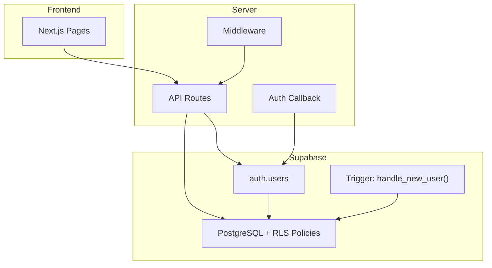
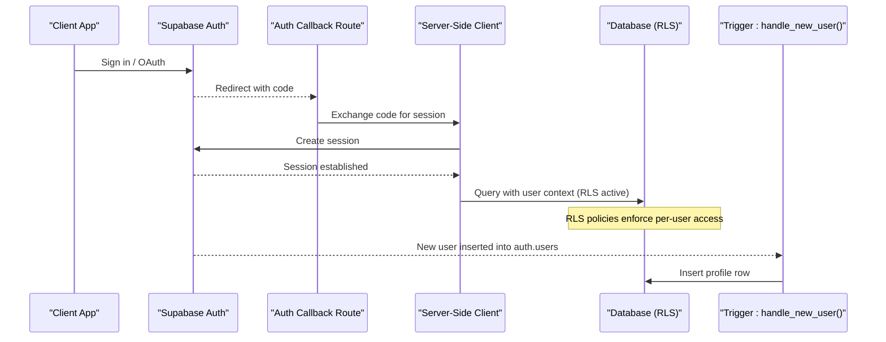
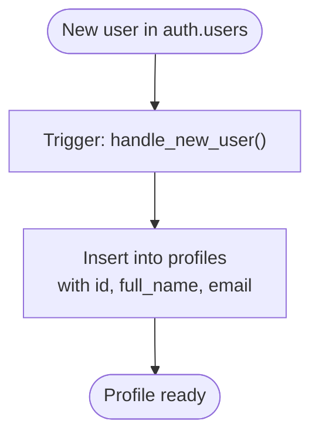
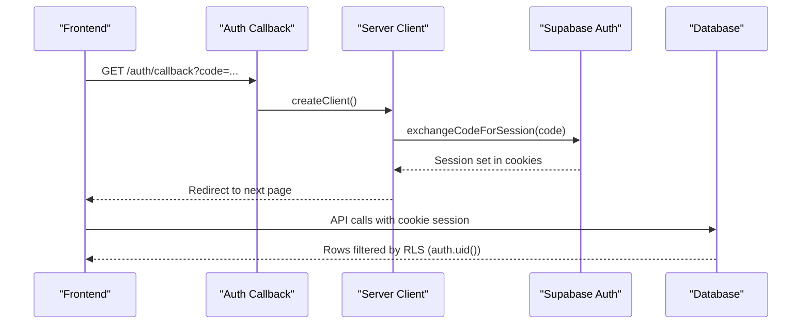
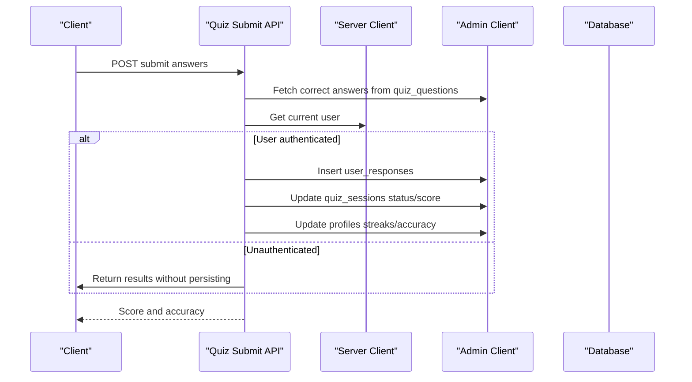
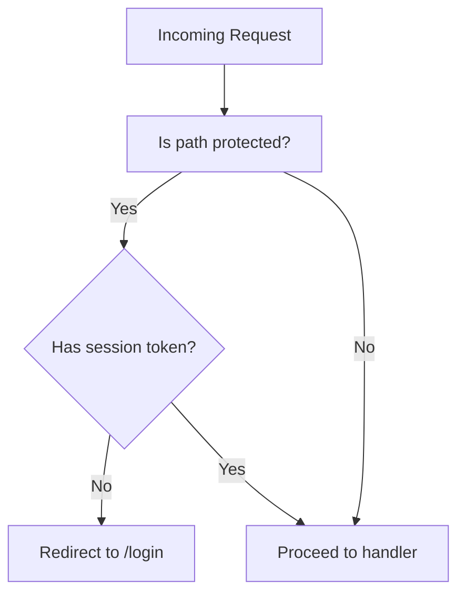
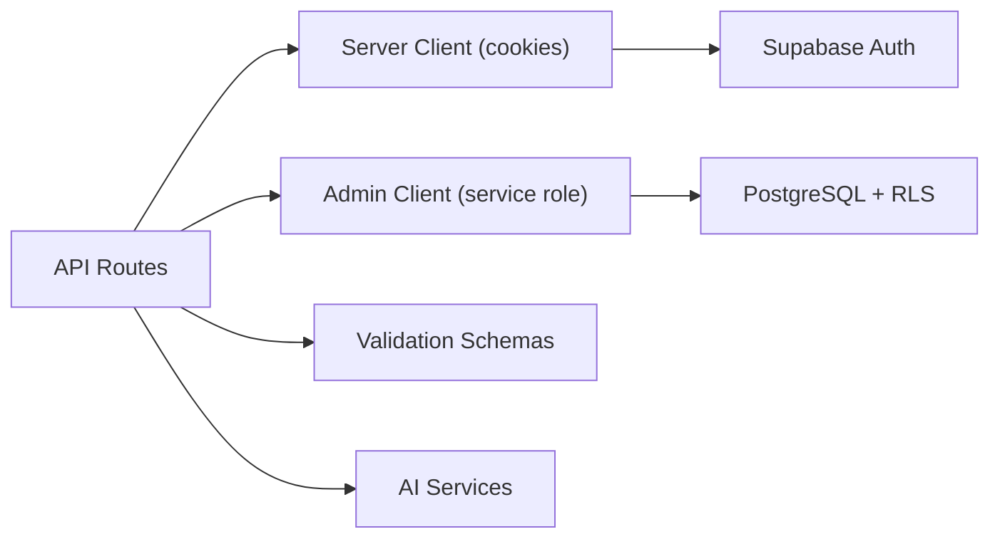

# Security & Access Control

<cite>
**Referenced Files in This Document**
- [schema.sql](file://supabase/schema.sql)
- [server.ts](file://src/lib/supabase/server.ts)
- [admin.ts](file://src/lib/supabase/admin.ts)
- [AuthProvider.tsx](file://src/components/auth/AuthProvider.tsx)
- [callback/route.ts](file://src/app/auth/callback/route.ts)
- [middleware.ts](file://src/middleware.ts)
- [dashboard/stats/route.ts](file://src/app/api/dashboard/stats/route.ts)
- [quiz/generate/route.ts](file://src/app/api/quiz/generate/route.ts)
- [quiz/submit/route.ts](file://src/app/api/quiz/submit/route.ts)
- [study-plan/generate/route.ts](file://src/app/api/study-plan/generate/route.ts)
</cite>

## Table of Contents
1. Introduction
2. Project Structure
3. Core Components
4. Architecture Overview
5. Detailed Component Analysis
6. Dependency Analysis
7. Performance Considerations
8. Troubleshooting Guide
9. Conclusion
10. Appendices

## Introduction
This document explains MedAce-AI’s database security model with a focus on Row Level Security (RLS) policies and access control mechanisms. It details how user identity is enforced at the database level, how RLS isolates data per user, and how triggers automate profile creation on signup. It also covers privacy considerations for student information and compliance guidance for educational data protection.

## Project Structure
The security model spans three layers:
- Database schema and RLS policies defined in SQL
- Server-side Supabase client configuration for authenticated requests
- API routes that enforce user context before performing data operations

**Diagram sources**
- [schema.sql:152-249](file://supabase/schema.sql#L152-L249)
- [server.ts:1-27](file://src/lib/supabase/server.ts#L1-L27)
- [callback/route.ts:1-32](file://src/app/auth/callback/route.ts#L1-L32)
- [middleware.ts:1-41](file://src/middleware.ts#L1-L41)

**Section sources**
- [schema.sql:10-112](file://supabase/schema.sql#L10-L112)
- [schema.sql:152-249](file://supabase/schema.sql#L152-L249)
- [server.ts:1-27](file://src/lib/supabase/server.ts#L1-L27)
- [callback/route.ts:1-32](file://src/app/auth/callback/route.ts#L1-L32)
- [middleware.ts:1-41](file://src/middleware.ts#L1-L41)

## Core Components
- RLS-enabled tables: profiles, textbook_chunks, quiz_sessions, quiz_questions, user_responses, study_plans
- Per-user isolation policies for sessions, responses, and study plans
- Public read policy for textbook chunks to support RAG retrieval
- Trigger-based profile creation on user signup
- Server-side Supabase clients for authenticated and admin contexts

Key responsibilities:
- Enforce row-level access using auth.uid() comparisons
- Isolate quiz sessions per user and restrict question visibility to session owners
- Protect response privacy by tying records to user_id
- Allow public read of textbook content for learning features
- Auto-create user profiles upon authentication events

**Section sources**
- [schema.sql:152-249](file://supabase/schema.sql#L152-L249)

## Architecture Overview
The system enforces identity and authorization across multiple touchpoints:
- Authentication flow via Supabase OAuth or email/password
- Session establishment through an auth callback route
- Server-side client usage to resolve current user context
- Database-level enforcement via RLS policies and triggers

**Diagram sources**
- [callback/route.ts:1-32](file://src/app/auth/callback/route.ts#L1-L32)
- [server.ts:1-27](file://src/lib/supabase/server.ts#L1-L27)
- [schema.sql:231-249](file://supabase/schema.sql#L231-L249)
- [schema.sql:152-249](file://supabase/schema.sql#L152-L249)

## Detailed Component Analysis

### Database Schema and RLS Policies
- Profiles: Users can view, insert, and update only their own profile rows.
- Textbook Chunks: Readable by both authenticated and anonymous users to enable RAG search.
- Quiz Sessions: Users can create, view, and update only their own sessions.
- Quiz Questions: Visibility and insertion are restricted to questions belonging to sessions owned by the current user.
- User Responses: Users can view and insert only their own responses.
- Study Plans: Users can view and manage only their own plans.

These policies ensure strict isolation of sensitive educational data while allowing necessary public reads for learning materials.

**Section sources**
- [schema.sql:152-249](file://supabase/schema.sql#L152-L249)

### Trigger-Based Profile Creation
On every new user created in auth.users, a trigger automatically inserts a corresponding profile row, copying name and email when available. This ensures every authenticated user has a profile record to link performance metrics and settings.

**Diagram sources**
- [schema.sql:231-249](file://supabase/schema.sql#L231-L249)

**Section sources**
- [schema.sql:231-249](file://supabase/schema.sql#L231-L249)

### Authentication Integration and Identity Enforcement
- Server-side client uses cookies to maintain session context and resolves the current user for each request.
- The auth callback exchanges OAuth codes for sessions and redirects appropriately.
- Frontend AuthProvider initializes sessions and listens for auth state changes, falling back to local storage when Supabase is not configured.

**Diagram sources**
- [callback/route.ts:1-32](file://src/app/auth/callback/route.ts#L1-L32)
- [server.ts:1-27](file://src/lib/supabase/server.ts#L1-L27)
- [schema.sql:152-249](file://supabase/schema.sql#L152-L249)

**Section sources**
- [callback/route.ts:1-32](file://src/app/auth/callback/route.ts#L1-L32)
- [server.ts:1-27](file://src/lib/supabase/server.ts#L1-L27)
- [AuthProvider.tsx:114-200](file://src/components/auth/AuthProvider.tsx#L114-L200)

### API-Level Access Control and Data Privacy
- Dashboard stats endpoint retrieves user-specific data using server-side client and admin client; returns demo data if unauthenticated.
- Quiz generation creates sessions and questions tied to the authenticated user; uses admin client for writes.
- Quiz submission validates input, computes correctness, persists responses, updates session status, and refreshes profile statistics.
- Study plan generation persists plans under the authenticated user’s ID and updates profile target exam date.

**Diagram sources**
- [quiz/submit/route.ts:1-141](file://src/app/api/quiz/submit/route.ts#L1-L141)
- [server.ts:1-27](file://src/lib/supabase/server.ts#L1-L27)
- [admin.ts:1-21](file://src/lib/supabase/admin.ts#L1-L21)
- [schema.sql:152-249](file://supabase/schema.sql#L152-L249)

**Section sources**
- [dashboard/stats/route.ts:1-181](file://src/app/api/dashboard/stats/route.ts#L1-L181)
- [quiz/generate/route.ts:1-196](file://src/app/api/quiz/generate/route.ts#L1-L196)
- [quiz/submit/route.ts:1-141](file://src/app/api/quiz/submit/route.ts#L1-L141)
- [study-plan/generate/route.ts:1-123](file://src/app/api/study-plan/generate/route.ts#L1-L123)

### Middleware and Route Protection
- Middleware defines protected routes and includes commented logic to enforce session checks via cookies in production.
- Currently allows all routes through during development; enabling the check will redirect unauthenticated users to login.

**Diagram sources**
- [middleware.ts:1-41](file://src/middleware.ts#L1-L41)

**Section sources**
- [middleware.ts:1-41](file://src/middleware.ts#L1-L41)

## Dependency Analysis
- Server-side client depends on environment variables for URL and anon key; it binds cookies to maintain session context.
- Admin client uses service role key to bypass RLS for internal operations where appropriate; however, most writes still rely on explicit user_id associations.
- API routes depend on validation schemas and AI services; they fall back to local data when external services are unavailable.

**Diagram sources**
- [server.ts:1-27](file://src/lib/supabase/server.ts#L1-L27)
- [admin.ts:1-21](file://src/lib/supabase/admin.ts#L1-L21)
- [quiz/generate/route.ts:1-196](file://src/app/api/quiz/generate/route.ts#L1-L196)
- [quiz/submit/route.ts:1-141](file://src/app/api/quiz/submit/route.ts#L1-L141)

**Section sources**
- [server.ts:1-27](file://src/lib/supabase/server.ts#L1-L27)
- [admin.ts:1-21](file://src/lib/supabase/admin.ts#L1-L21)

## Performance Considerations
- RLS policies add minimal overhead but provide strong isolation; ensure indexes exist on foreign keys and frequently filtered columns (already present for user_id, session_id).
- Vector similarity search uses HNSW index on embeddings; keep match thresholds and counts reasonable to balance latency and relevance.
- Avoid excessive joins in API queries; leverage pre-aggregated dashboard calculations and limit result sets.

[No sources needed since this section provides general guidance]

## Troubleshooting Guide
Common issues and resolutions:
- Policy denied errors on read/write:
  - Verify the current user is authenticated and that the request carries a valid session cookie.
  - Ensure the operation targets rows where user_id matches auth.uid().
  - For quiz questions, confirm the session belongs to the current user.
- Missing profile after signup:
  - Confirm the trigger exists and runs on INSERT into auth.users.
  - Check that raw_user_meta_data contains expected fields or defaults are applied.
- Unauthenticated fallback behavior:
  - Some endpoints return demo data when no user is detected; verify environment configuration to avoid unintended demo mode in production.
- Middleware not enforcing login:
  - Enable the commented session check in middleware for production to redirect unauthenticated users.

**Section sources**
- [schema.sql:152-249](file://supabase/schema.sql#L152-L249)
- [schema.sql:231-249](file://supabase/schema.sql#L231-L249)
- [dashboard/stats/route.ts:1-181](file://src/app/api/dashboard/stats/route.ts#L1-L181)
- [middleware.ts:1-41](file://src/middleware.ts#L1-L41)

## Conclusion
MedAce-AI implements a robust security model centered on Supabase RLS policies that enforce per-user isolation for sensitive educational data. Combined with trigger-based profile creation and server-side session management, the system ensures that students’ progress, responses, and study plans remain private and secure. Following the best practices and troubleshooting steps outlined here will help maintain compliance and reliability as the platform scales.

[No sources needed since this section summarizes without analyzing specific files]

## Appendices

### Security Best Practices
- Always operate with the principle of least privilege; prefer RLS over broad table grants.
- Use server-side clients to establish user context before any database write.
- Validate all inputs with schemas before processing or persisting data.
- Keep environment variables for URLs and keys secure; avoid exposing service role keys to the client.
- Regularly audit RLS policies and triggers for drift or overly permissive rules.

[No sources needed since this section provides general guidance]

### Compliance and Data Privacy Considerations
- Minimize collection of personally identifiable information; store only what is necessary for education outcomes.
- Encrypt sensitive data at rest and in transit; rely on Supabase’s managed infrastructure and HTTPS.
- Implement data retention policies to purge or anonymize old quiz responses and study plans as required.
- Provide user controls to view, export, and delete personal data in compliance with applicable regulations.
- Maintain audit logs for administrative actions and access patterns where feasible.

[No sources needed since this section provides general guidance]