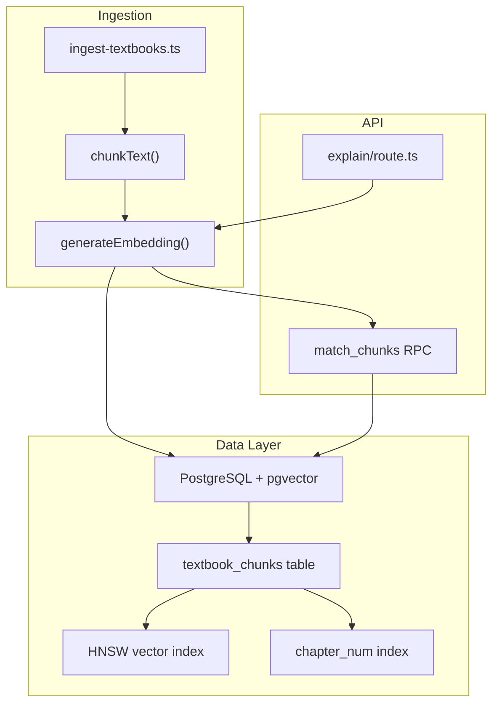
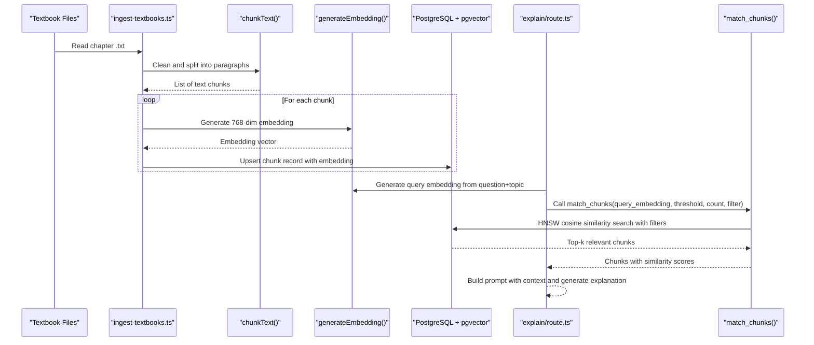
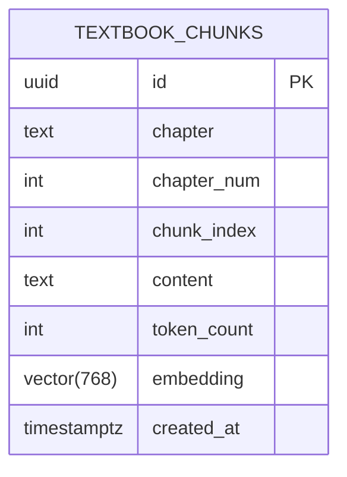
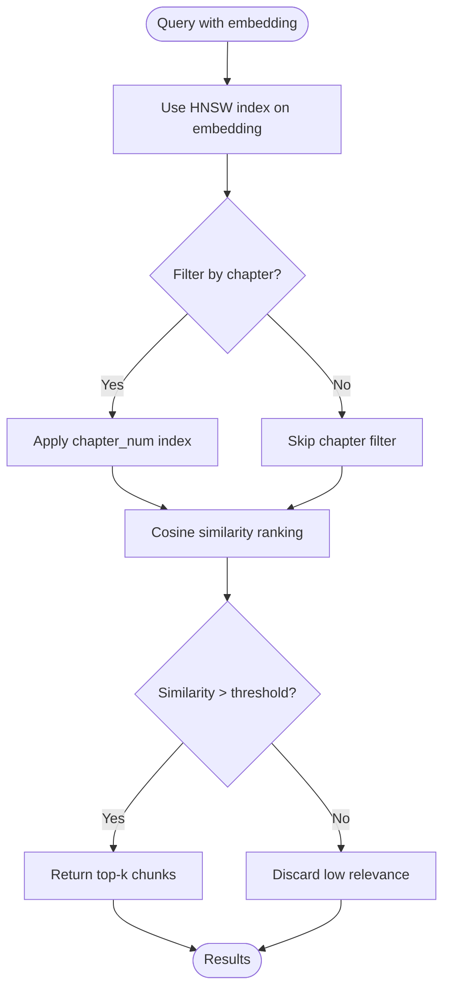
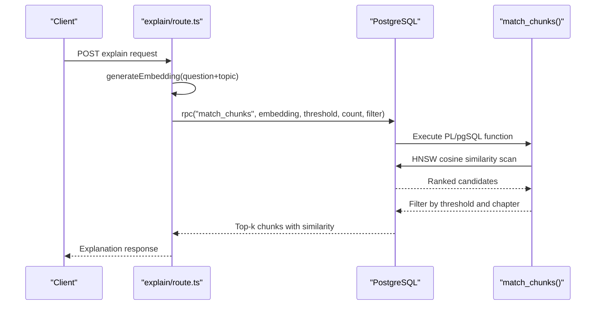
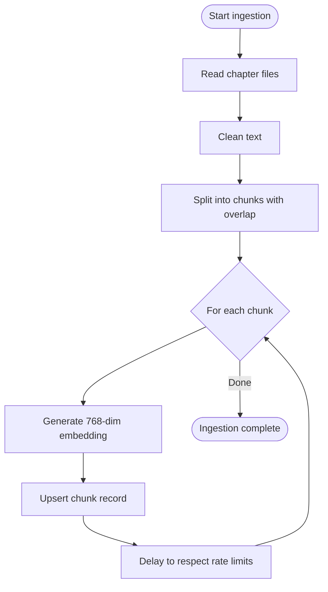
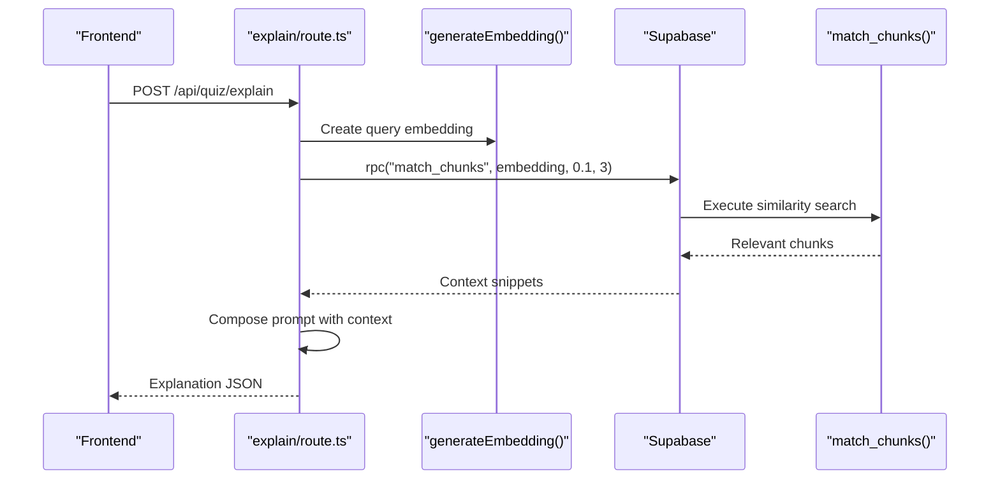
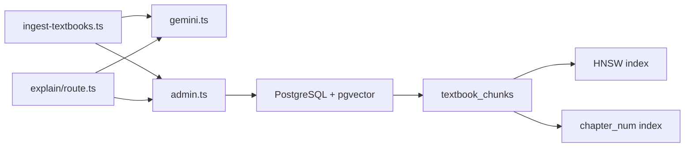

# Vector Database & RAG System

<cite>
**Referenced Files in This Document**
- [schema.sql](file://supabase/schema.sql)
- [ingest-textbooks.ts](file://scripts/ingest-textbooks.ts)
- [gemini.ts](file://src/lib/ai/gemini.ts)
- [explain/route.ts](file://src/app/api/quiz/explain/route.ts)
- [admin.ts](file://src/lib/supabase/admin.ts)
- [check-chunks.ts](file://scripts/check-chunks.ts)
- [textbook-reader.ts](file://src/lib/textbook-reader.ts)
</cite>

## Table of Contents
1. Introduction
2. Project Structure
3. Core Components
4. Architecture Overview
5. Detailed Component Analysis
6. Dependency Analysis
7. Performance Considerations
8. Troubleshooting Guide
9. Conclusion
10. Appendices

## Introduction
This document explains MedAce-AI’s vector database and Retrieval-Augmented Generation (RAG) system built on PostgreSQL with the pgvector extension. It focuses on:
- The textbook_chunks table storing 768-dimensional embeddings for textbook content chunks
- HNSW index configuration for fast cosine similarity search
- The match_chunks stored procedure for retrieving relevant textbook content
- The RAG pipeline that ingests textbook chapters, generates embeddings via Google Gemini API, stores them in PostgreSQL, and retrieves context for question explanations
- Indexing strategy combining HNSW vector index and a regular chapter_num index
- Query examples, threshold tuning, and performance optimization techniques for large-scale textbook processing

## Project Structure
The vector RAG system spans database schema, ingestion scripts, AI embedding utilities, and API routes:
- Database schema defines tables, indexes, and the match_chunks function
- Ingestion script reads textbook files, chunks text, generates embeddings, and upserts into PostgreSQL
- AI utility provides Gemini embedding generation
- API route uses embeddings to perform vector similarity search and generate explanations
- Admin client enables server-side Supabase RPC calls
- Utility scripts check chunk counts and read raw textbook files

**Diagram sources**
- [schema.sql:26-44](file://supabase/schema.sql#L26-L44)
- [schema.sql:116-150](file://supabase/schema.sql#L116-L150)
- [ingest-textbooks.ts:52-75](file://scripts/ingest-textbooks.ts#L52-L75)
- [ingest-textbooks.ts:129-165](file://scripts/ingest-textbooks.ts#L129-L165)
- [gemini.ts:29-43](file://src/lib/ai/gemini.ts#L29-L43)
- [explain/route.ts:20-35](file://src/app/api/quiz/explain/route.ts#L20-L35)

**Section sources**
- [schema.sql:26-44](file://supabase/schema.sql#L26-L44)
- [schema.sql:116-150](file://supabase/schema.sql#L116-L150)
- [ingest-textbooks.ts:52-75](file://scripts/ingest-textbooks.ts#L52-L75)
- [ingest-textbooks.ts:129-165](file://scripts/ingest-textbooks.ts#L129-L165)
- [gemini.ts:29-43](file://src/lib/ai/gemini.ts#L29-L43)
- [explain/route.ts:20-35](file://src/app/api/quiz/explain/route.ts#L20-L35)

## Core Components
- Textbook Chunks Table: Stores chunked textbook content along with metadata and 768-dim embeddings
- HNSW Vector Index: Optimizes cosine similarity searches over embeddings
- Chapter Number Index: Supports filtering by chapter for targeted retrieval
- match_chunks Stored Procedure: Encapsulates similarity search logic with threshold and chapter filtering
- Ingestion Pipeline: Reads textbook files, cleans and chunks text, generates embeddings, and persists records
- Gemini Embeddings: Uses Google Gemini embedding model to produce 768-dim vectors
- API Integration: Generates query embeddings and calls match_chunks to retrieve relevant context for explanations

**Section sources**
- [schema.sql:26-44](file://supabase/schema.sql#L26-L44)
- [schema.sql:116-150](file://supabase/schema.sql#L116-L150)
- [ingest-textbooks.ts:52-75](file://scripts/ingest-textbooks.ts#L52-L75)
- [gemini.ts:29-43](file://src/lib/ai/gemini.ts#L29-L43)
- [explain/route.ts:20-35](file://src/app/api/quiz/explain/route.ts#L20-L35)

## Architecture Overview
The RAG pipeline consists of two main flows: ingestion and retrieval.

**Diagram sources**
- [ingest-textbooks.ts:97-183](file://scripts/ingest-textbooks.ts#L97-L183)
- [gemini.ts:29-43](file://src/lib/ai/gemini.ts#L29-L43)
- [schema.sql:116-150](file://supabase/schema.sql#L116-L150)
- [explain/route.ts:20-35](file://src/app/api/quiz/explain/route.ts#L20-L35)

## Detailed Component Analysis

### Textbook Chunks Table and Indexing Strategy
- Fields include unique id, chapter name, chapter number, chunk index, content, approximate token count, and a 768-dim embedding
- HNSW index on embedding with cosine operations accelerates nearest neighbor search
- Regular index on chapter_num supports efficient filtering by chapter or topic when combined with vector search

**Diagram sources**
- [schema.sql:26-36](file://supabase/schema.sql#L26-L36)

**Section sources**
- [schema.sql:26-44](file://supabase/schema.sql#L26-L44)

### HNSW Vector Index Configuration
- Uses HNSW algorithm with cosine similarity operator for fast approximate nearest neighbor queries
- Index is created on the embedding column using vector_cosine_ops
- Combined with chapter_num index to optimize filtered queries

**Diagram sources**
- [schema.sql:38-44](file://supabase/schema.sql#L38-L44)
- [schema.sql:116-150](file://supabase/schema.sql#L116-L150)

**Section sources**
- [schema.sql:38-44](file://supabase/schema.sql#L38-L44)
- [schema.sql:116-150](file://supabase/schema.sql#L116-L150)

### match_chunks Stored Procedure
- Accepts query_embedding, match_threshold, match_count, and optional filter_chapter
- Computes similarity as 1 - cosine distance and filters by threshold
- Supports filtering by chapter name substring or exact chapter number
- Orders results by ascending cosine distance and limits to match_count

**Diagram sources**
- [schema.sql:116-150](file://supabase/schema.sql#L116-L150)
- [explain/route.ts:20-35](file://src/app/api/quiz/explain/route.ts#L20-L35)

**Section sources**
- [schema.sql:116-150](file://supabase/schema.sql#L116-L150)
- [explain/route.ts:20-35](file://src/app/api/quiz/explain/route.ts#L20-L35)

### Ingestion Pipeline: Chunking, Embedding, Storage
- Reads textbook files from rag/textbooks directory
- Cleans text by normalizing whitespace and removing artifacts
- Splits content into chunks based on paragraph boundaries with configurable target size and overlap
- Generates 768-dim embeddings via Gemini embedding model
- Upserts chunk records into textbook_chunks with metadata
- Implements rate-limit handling and delays to respect API quotas

**Diagram sources**
- [ingest-textbooks.ts:97-183](file://scripts/ingest-textbooks.ts#L97-L183)
- [gemini.ts:29-43](file://src/lib/ai/gemini.ts#L29-L43)

**Section sources**
- [ingest-textbooks.ts:52-75](file://scripts/ingest-textbooks.ts#L52-L75)
- [ingest-textbooks.ts:97-183](file://scripts/ingest-textbooks.ts#L97-L183)
- [gemini.ts:29-43](file://src/lib/ai/gemini.ts#L29-L43)

### API Integration: RAG for Question Explanations
- Receives question text, options, correct answer, and topic
- Generates an embedding for the question plus topic
- Calls match_chunks RPC with threshold and count parameters
- Builds a prompt with retrieved context and asks Gemini to produce bilingual explanations
- Returns structured JSON with English and Urdu explanations

**Diagram sources**
- [explain/route.ts:20-35](file://src/app/api/quiz/explain/route.ts#L20-L35)
- [schema.sql:116-150](file://supabase/schema.sql#L116-L150)
- [gemini.ts:29-43](file://src/lib/ai/gemini.ts#L29-L43)

**Section sources**
- [explain/route.ts:20-35](file://src/app/api/quiz/explain/route.ts#L20-L35)
- [schema.sql:116-150](file://supabase/schema.sql#L116-L150)
- [gemini.ts:29-43](file://src/lib/ai/gemini.ts#L29-L43)

## Dependency Analysis
- Ingestion depends on filesystem access, Gemini embedding API, and Supabase admin client
- API route depends on Gemini embedding API and Supabase admin client to call match_chunks
- Database schema defines dependencies on pgvector extension and indexes
- Admin client proxies Supabase methods for convenient RPC usage

**Diagram sources**
- [ingest-textbooks.ts:97-183](file://scripts/ingest-textbooks.ts#L97-L183)
- [gemini.ts:29-43](file://src/lib/ai/gemini.ts#L29-L43)
- [admin.ts:1-22](file://src/lib/supabase/admin.ts#L1-L22)
- [schema.sql:26-44](file://supabase/schema.sql#L26-L44)

**Section sources**
- [ingest-textbooks.ts:97-183](file://scripts/ingest-textbooks.ts#L97-L183)
- [gemini.ts:29-43](file://src/lib/ai/gemini.ts#L29-L43)
- [admin.ts:1-22](file://src/lib/supabase/admin.ts#L1-L22)
- [schema.sql:26-44](file://supabase/schema.sql#L26-L44)

## Performance Considerations
- HNSW Index Tuning: Adjust HNSW parameters (e.g., m, ef_construction, ef_search) if supported by your environment to balance recall and latency for large datasets
- Threshold Tuning: Increase match_threshold to reduce false positives; decrease it to increase recall at the cost of more noise
- Batch Upserts: Use batch inserts/upserts during ingestion to reduce round-trips and improve throughput
- Rate Limiting: Respect Gemini API rate limits with exponential backoff and delays; consider queuing and retry strategies
- Filtering Strategy: Prefer exact chapter_num filtering when possible to leverage the regular index; use chapter name substring matching only when necessary
- Chunk Size and Overlap: Tune target chunk size and overlap to balance context continuity and retrieval precision
- Query Optimization: Combine vector similarity with chapter/topic filters to reduce search space and improve performance
- Monitoring: Track chunk counts and ingestion metrics to identify bottlenecks and capacity needs

[No sources needed since this section provides general guidance]

## Troubleshooting Guide
- Missing Environment Variables: Ensure GEMINI_API_KEY and Supabase credentials are configured; errors will surface when generating embeddings or calling Supabase
- Rate Limits: Handle HTTP 429 responses with retries and delays; ingestion script includes retry logic and pauses between requests
- Empty Results: If match_chunks returns no results, lower match_threshold or adjust chunking/embedding quality; verify chapter filters
- Index Usage: Confirm HNSW index exists and is being used; rebuild or reindex if necessary after large data changes
- Data Integrity: Validate chunk metadata (chapter_num, chunk_index) and ensure consistent ordering for coherent retrieval

**Section sources**
- [gemini.ts:29-43](file://src/lib/ai/gemini.ts#L29-L43)
- [ingest-textbooks.ts:133-165](file://scripts/ingest-textbooks.ts#L133-L165)
- [schema.sql:38-44](file://supabase/schema.sql#L38-L44)
- [check-chunks.ts:24-27](file://scripts/check-chunks.ts#L24-L27)

## Conclusion
MedAce-AI’s vector database leverages PostgreSQL’s pgvector extension with an HNSW index to enable fast, scalable semantic search over textbook content. The ingestion pipeline processes chapters into meaningful chunks, generates 768-dim embeddings via Google Gemini, and stores them alongside metadata. The match_chunks stored procedure encapsulates similarity search logic with threshold and chapter filtering, enabling precise retrieval for RAG-driven question explanations. With careful tuning of thresholds, chunk sizes, and indexing strategies, the system can handle large-scale textbook content efficiently while maintaining high relevance and performance.

[No sources needed since this section summarizes without analyzing specific files]

## Appendices

### Example Queries and Usage Patterns
- Basic similarity search: Provide a query embedding and retrieve top-k chunks ordered by cosine similarity
- Chapter-filtered search: Pass filter_chapter as a chapter name substring or chapter number to narrow results
- Threshold tuning: Adjust match_threshold to control relevance strictness; higher values yield fewer but more relevant results

**Section sources**
- [schema.sql:116-150](file://supabase/schema.sql#L116-L150)
- [explain/route.ts:20-35](file://src/app/api/quiz/explain/route.ts#L20-L35)

### Chunking Strategies
- Paragraph-based splitting with overlap preserves context across chunk boundaries
- Target chunk size balances readability and embedding efficiency; overlap helps maintain continuity
- Cleaning removes OCR artifacts and normalizes whitespace for better embeddings

**Section sources**
- [ingest-textbooks.ts:52-75](file://scripts/ingest-textbooks.ts#L52-L75)

### Embedding Generation Workflow
- Uses Gemini embedding model configured for 768 output dimensions
- Handles API key validation and error propagation
- Integrates with ingestion and API flows to provide consistent embeddings

**Section sources**
- [gemini.ts:29-43](file://src/lib/ai/gemini.ts#L29-L43)

### Query Filtering by Chapter or Topic
- filter_chapter supports both substring matching on chapter names and exact matches on chapter numbers
- Combining filters with HNSW search reduces result sets and improves relevance

**Section sources**
- [schema.sql:116-150](file://supabase/schema.sql#L116-L150)