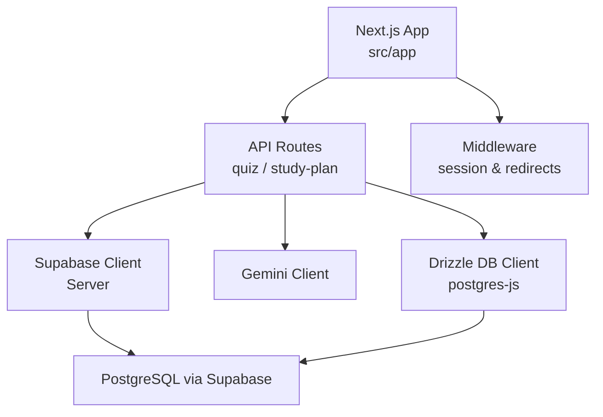
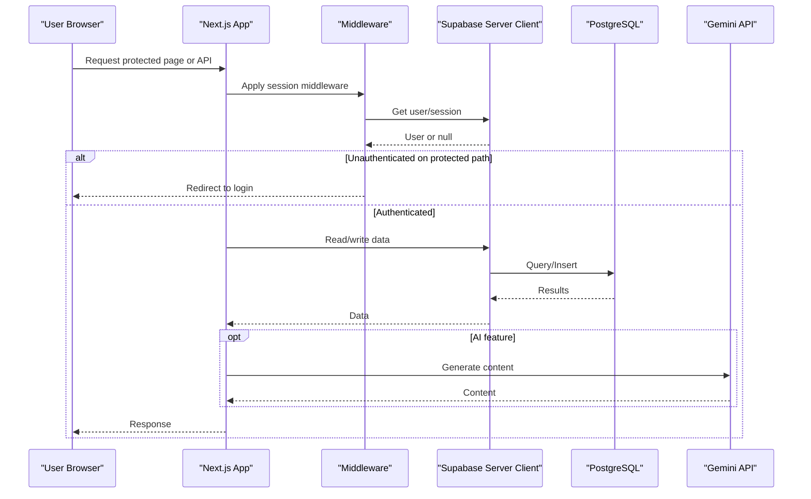
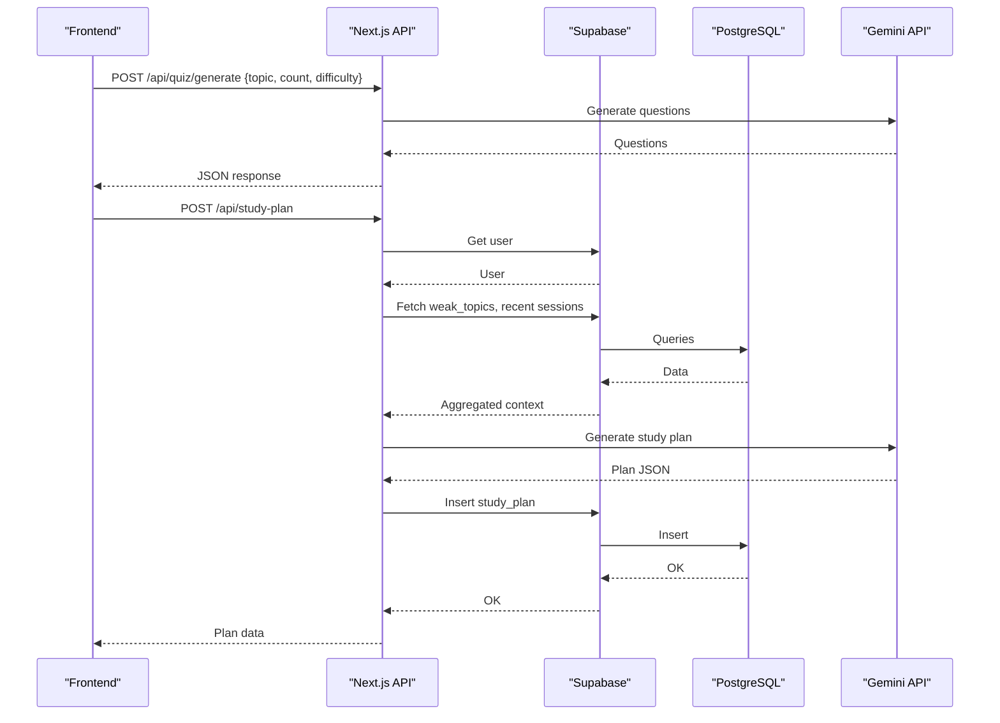
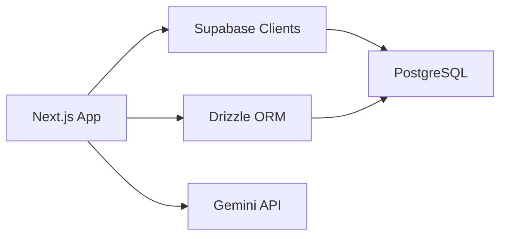

# Deployment Guide

<cite>
**Referenced Files in This Document**
- [package.json](file://Next-app/package.json)
- [next.config.ts](file://Next-app/next.config.ts)
- [tsconfig.json](file://Next-app/tsconfig.json)
- [drizzle.config.ts](file://Next-app/drizzle.config.ts)
- [middleware.ts](file://Next-app/src/middleware.ts)
- [client.ts](file://Next-app/src/lib/supabase/client.ts)
- [server.ts](file://Next-app/src/lib/supabase/server.ts)
- [db.ts](file://Next-app/src/lib/drizzle/db.ts)
- [schema.ts](file://Next-app/src/lib/drizzle/schema.ts)
- [route.ts (quiz generate)](file://Next-app/src/app/api/quiz/generate/route.ts)
- [route.ts (study-plan)](file://Next-app/src/app/api/study-plan/route.ts)
- [client.ts (gemini)](file://Next-app/src/lib/gemini/client.ts)
- [Project-Scope.md](file://Project-Scope.md)
</cite>

## Table of Contents
1. Introduction
2. Project Structure
3. Core Components
4. Architecture Overview
5. Detailed Component Analysis
6. Dependency Analysis
7. Performance Considerations
8. Troubleshooting Guide
9. Conclusion
10. Appendices

## Introduction
This guide provides production deployment instructions for MedAce-AI, a Next.js application that uses Supabase for authentication and database access, Drizzle ORM with PostgreSQL, and Google Gemini API for quiz and study plan generation. It covers environment configuration, database setup, SSL/domain considerations, monitoring/logging, CI/CD, automated testing, rollback strategies, security, backups, and scaling.

## Project Structure
MedAce-AI is a Next.js App Router project with:
- API routes under src/app/api for server-side logic
- Supabase client libraries for browser and server contexts
- Drizzle ORM schema and database client
- Middleware for session handling and route protection
- External integration to Google Gemini API

**Diagram sources**
- [middleware.ts:1-13](file://Next-app/src/middleware.ts#L1-L13)
- [route.ts (quiz generate):1-32](file://Next-app/src/app/api/quiz/generate/route.ts#L1-L32)
- [route.ts (study-plan):1-115](file://Next-app/src/app/api/study-plan/route.ts#L1-L115)
- [server.ts:1-30](file://Next-app/src/lib/supabase/server.ts#L1-L30)
- [client.ts (gemini):1-45](file://Next-app/src/lib/gemini/client.ts#L1-L45)
- [db.ts:1-9](file://Next-app/src/lib/drizzle/db.ts#L1-L9)

**Section sources**
- [package.json:1-38](file://Next-app/package.json#L1-L38)
- [next.config.ts:1-8](file://Next-app/next.config.ts#L1-L8)
- [tsconfig.json:1-35](file://Next-app/tsconfig.json#L1-L35)

## Core Components
- Build and runtime scripts are provided by Next.js; the project uses Node.js tooling and TypeScript.
- Database access uses Drizzle ORM with postgres driver against a PostgreSQL instance (via Supabase).
- Authentication and authorization use Supabase SSR clients in middleware and server components.
- AI features call Google Gemini API from server-side code.

Key operational notes:
- Environment variables are required for Supabase and Gemini.
- The Drizzle config expects a DATABASE_URL pointing to a PostgreSQL instance.
- Middleware enforces protected routes and redirects based on auth state.

**Section sources**
- [package.json:5-10](file://Next-app/package.json#L5-L10)
- [db.ts:1-9](file://Next-app/src/lib/drizzle/db.ts#L1-L9)
- [drizzle.config.ts:1-11](file://Next-app/drizzle.config.ts#L1-L11)
- [client.ts:1-14](file://Next-app/src/lib/supabase/client.ts#L1-L14)
- [server.ts:1-30](file://Next-app/src/lib/supabase/server.ts#L1-L30)
- [middleware.ts:1-13](file://Next-app/src/middleware.ts#L1-L13)
- [client.ts (gemini):1-45](file://Next-app/src/lib/gemini/client.ts#L1-L45)

## Architecture Overview
The application follows a standard Next.js architecture with serverless-friendly API routes and SSR/SSG capabilities. Data flows through Supabase for auth and persistence, while Gemini provides content generation.

**Diagram sources**
- [middleware.ts:1-13](file://Next-app/src/middleware.ts#L1-L13)
- [server.ts:1-30](file://Next-app/src/lib/supabase/server.ts#L1-L30)
- [route.ts (study-plan):1-115](file://Next-app/src/app/api/study-plan/route.ts#L1-L115)
- [client.ts (gemini):1-45](file://Next-app/src/lib/gemini/client.ts#L1-L45)

## Detailed Component Analysis

### Build and Runtime
- Use the provided scripts to build and start the app in production.
- Ensure all required environment variables are set before building/starting.

Operational steps:
- Install dependencies and build the app using the project’s scripts.
- Start the production server with the provided script.

**Section sources**
- [package.json:5-10](file://Next-app/package.json#L5-L10)

### Environment Variables
Required variables identified in code:
- NEXT_PUBLIC_SUPABASE_URL
- NEXT_PUBLIC_SUPABASE_ANON_KEY
- GOOGLE_GEMINI_API_KEY
- DATABASE_URL

Notes:
- Supabase client initialization validates presence of public keys and throws if missing.
- Server-side Supabase client also requires these variables.
- Gemini client reads the API key from an environment variable when calling the external API.
- Drizzle and Postgres client read DATABASE_URL to connect to the database.

**Section sources**
- [client.ts:1-14](file://Next-app/src/lib/supabase/client.ts#L1-L14)
- [server.ts:1-30](file://Next-app/src/lib/supabase/server.ts#L1-L30)
- [client.ts (gemini):1-45](file://Next-app/src/lib/gemini/client.ts#L1-L45)
- [db.ts:1-9](file://Next-app/src/lib/drizzle/db.ts#L1-L9)
- [drizzle.config.ts:1-11](file://Next-app/drizzle.config.ts#L1-L11)

### Database Setup (Production)
- The schema defines users, quiz_sessions, questions, user_answers, weak_topics, and study_plans tables.
- Drizzle ORM is configured to use PostgreSQL dialect and connects via DATABASE_URL.
- Use Drizzle migrations to apply schema changes in production.

Recommended steps:
- Provision a managed PostgreSQL instance (e.g., Supabase Database or external provider).
- Set DATABASE_URL to point to the production database.
- Run migrations to create/update schema.
- Verify connectivity from the deployment environment.

**Section sources**
- [schema.ts:1-78](file://Next-app/src/lib/drizzle/schema.ts#L1-L78)
- [drizzle.config.ts:1-11](file://Next-app/drizzle.config.ts#L1-L11)
- [db.ts:1-9](file://Next-app/src/lib/drizzle/db.ts#L1-L9)

### Authentication and Authorization
- Middleware checks for a valid session and protects specific routes.
- Protected paths include quiz, study-plan, history, and profile.
- Authenticated users are redirected away from login/signup pages.

Operational behavior:
- If Supabase is not configured, middleware bypasses auth and allows requests.
- On protected routes without a session, users are redirected to login.
- On auth pages with a session, users are redirected to the home page.

**Section sources**
- [middleware.ts:1-13](file://Next-app/src/middleware.ts#L1-L13)
- [server.ts:1-30](file://Next-app/src/lib/supabase/server.ts#L1-L30)

### API Endpoints and Data Flow
- Quiz generation endpoint accepts topic, question count, difficulty, and optional weak topics, then calls Gemini to generate questions.
- Study plan endpoints authenticate the user, fetch weak topics and recent accuracy, generate a plan via Gemini, and persist it to the database.

**Diagram sources**
- [route.ts (quiz generate):1-32](file://Next-app/src/app/api/quiz/generate/route.ts#L1-L32)
- [route.ts (study-plan):1-115](file://Next-app/src/app/api/study-plan/route.ts#L1-L115)
- [client.ts (gemini):1-45](file://Next-app/src/lib/gemini/client.ts#L1-L45)

**Section sources**
- [route.ts (quiz generate):1-32](file://Next-app/src/app/api/quiz/generate/route.ts#L1-L32)
- [route.ts (study-plan):1-115](file://Next-app/src/app/api/study-plan/route.ts#L1-L115)

### SSL and Domain Configuration
- For Vercel deployments, HTTPS is automatically enabled for custom domains and Vercel-provided subdomains.
- For traditional hosting, configure a reverse proxy (e.g., Nginx or Caddy) to terminate TLS and forward traffic to the Next.js process.
- Ensure environment variables and CORS settings align with your domain.

[No sources needed since this section provides general guidance]

### Monitoring and Logging
- Centralize logs from the runtime and external services (Supabase, Gemini).
- Capture request IDs and correlation IDs across API calls to trace issues.
- Monitor error rates, latency, and resource usage at the platform level.

[No sources needed since this section provides general guidance]

### CI/CD Pipeline
- Integrate linting and type checking into your pipeline.
- Run tests (if added later) before deploying.
- Build artifacts using the project’s build script and deploy to your chosen platform.

**Section sources**
- [package.json:5-10](file://Next-app/package.json#L5-L10)

### Automated Testing in Deployment Pipelines
- Add unit and integration tests for API routes and utilities.
- Fail the pipeline on test failures to prevent regressions.

[No sources needed since this section provides general guidance]

### Rollback Strategies
- Maintain previous deployment versions on your platform.
- Use environment-specific configurations to switch back quickly.
- Keep database migrations backward-compatible where possible.

[No sources needed since this section provides general guidance]

### Security Considerations
- Store secrets in platform-managed secret stores; never commit them to version control.
- Validate inputs in API routes and handle errors consistently.
- Restrict access to protected routes via middleware and server-side checks.
- Limit exposure of third-party keys to server-side only.

**Section sources**
- [client.ts:1-14](file://Next-app/src/lib/supabase/client.ts#L1-L14)
- [server.ts:1-30](file://Next-app/src/lib/supabase/server.ts#L1-L30)
- [middleware.ts:1-13](file://Next-app/src/middleware.ts#L1-L13)
- [client.ts (gemini):1-45](file://Next-app/src/lib/gemini/client.ts#L1-L45)

### Backup Procedures
- Schedule regular backups of the PostgreSQL database used by Supabase or your external provider.
- Test restore procedures periodically.
- Retain backups according to compliance requirements.

[No sources needed since this section provides general guidance]

### Scaling Strategies
- Leverage platform auto-scaling for serverless deployments.
- Optimize database queries and consider connection pooling.
- Cache frequently accessed data where appropriate.
- Monitor performance metrics and adjust resources accordingly.

[No sources needed since this section provides general guidance]

## Dependency Analysis
External dependencies relevant to deployment:
- Next.js runtime and scripts
- Supabase client libraries for browser and server
- Drizzle ORM and postgres driver
- Google Gemini API integration

**Diagram sources**
- [package.json:11-23](file://Next-app/package.json#L11-L23)
- [client.ts:1-14](file://Next-app/src/lib/supabase/client.ts#L1-L14)
- [server.ts:1-30](file://Next-app/src/lib/supabase/server.ts#L1-L30)
- [db.ts:1-9](file://Next-app/src/lib/drizzle/db.ts#L1-L9)
- [client.ts (gemini):1-45](file://Next-app/src/lib/gemini/client.ts#L1-L45)

**Section sources**
- [package.json:11-23](file://Next-app/package.json#L11-L23)

## Performance Considerations
- Use platform-native caching and edge capabilities where available.
- Minimize unnecessary network calls and batch operations.
- Tune database queries and indexes based on usage patterns.
- Profile API endpoints to identify bottlenecks.

[No sources needed since this section provides general guidance]

## Troubleshooting Guide
Common issues and resolutions:
- Missing environment variables: Ensure all required variables are set in the deployment environment.
- Database connectivity: Verify DATABASE_URL and firewall rules allow connections.
- Authentication redirects: Confirm Supabase URLs and keys are correct and middleware is active.
- API errors: Check error responses from Gemini and handle gracefully.

**Section sources**
- [client.ts:1-14](file://Next-app/src/lib/supabase/client.ts#L1-L14)
- [server.ts:1-30](file://Next-app/src/lib/supabase/server.ts#L1-L30)
- [middleware.ts:1-13](file://Next-app/src/middleware.ts#L1-L13)
- [client.ts (gemini):1-45](file://Next-app/src/lib/gemini/client.ts#L1-L45)

## Conclusion
MedAce-AI is a modern Next.js application with clear separation of concerns between UI, API routes, and external integrations. By configuring environment variables correctly, setting up the database, and following the deployment steps outlined here, you can reliably run the application in production on Vercel or traditional hosting. Adopt monitoring, logging, security best practices, and scalable infrastructure to support growth.

[No sources needed since this section summarizes without analyzing specific files]

## Appendices

### Production Build and Start Commands
- Build the application using the project’s build script.
- Start the production server using the provided start script.

**Section sources**
- [package.json:5-10](file://Next-app/package.json#L5-L10)

### Platform Notes
- The project scope indicates Vercel as the recommended deployment target for simplicity and cost-effectiveness.

**Section sources**
- [Project-Scope.md:31-42](file://Project-Scope.md#L31-L42)