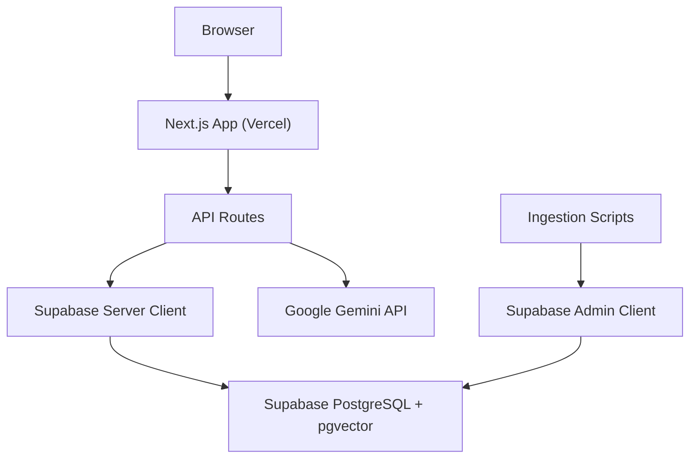
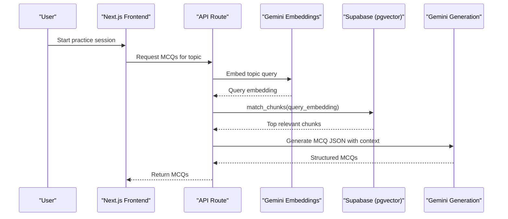
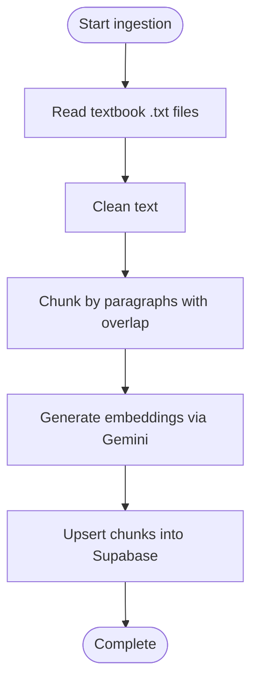
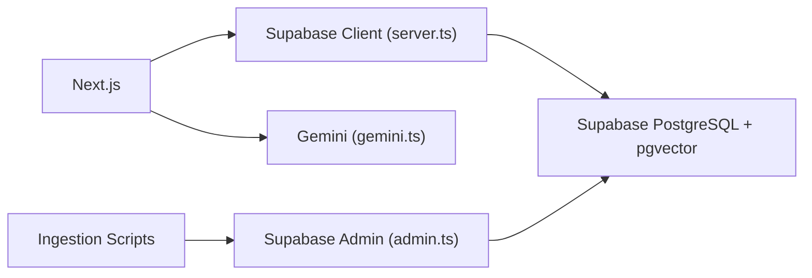

# Deployment Guide

<cite>
**Referenced Files in This Document**
- [README.md](file://README.md)
- [package.json](file://package.json)
- [next.config.ts](file://next.config.ts)
- [supabase/schema.sql](file://supabase/schema.sql)
- [scripts/ingest-textbooks.ts](file://scripts/ingest-textbooks.ts)
- [scripts/check-chunks.ts](file://scripts/check-chunks.ts)
- [src/lib/ai/gemini.ts](file://src/lib/ai/gemini.ts)
- [src/lib/supabase/admin.ts](file://src/lib/supabase/admin.ts)
- [src/lib/supabase/server.ts](file://src/lib/supabase/server.ts)
- [src/middleware.ts](file://src/middleware.ts)
</cite>

## Table of Contents
1. Introduction
2. Project Structure
3. Core Components
4. Architecture Overview
5. Detailed Component Analysis
6. Dependency Analysis
7. Performance Considerations
8. Troubleshooting Guide
9. Conclusion
10. Appendices

## Introduction
This guide provides production deployment instructions for MedAce-AI on Vercel, covering zero-config deployment, environment variables, build optimization, preview deployments, database migrations with Drizzle ORM, textbook ingestion via RAG, monitoring and logging, security hardening, scaling strategies, rollback and disaster recovery, cost optimization, and troubleshooting.

## Project Structure
MedAce-AI is a Next.js 15 application deployed to Vercel with Supabase as the backend (PostgreSQL + pgvector), Google Gemini for AI generation and embeddings, and Drizzle ORM for schema management. The repository includes:
- API routes under src/app/api for quiz generation, submission, dashboard stats, and study plan generation
- Server-side Supabase clients for authenticated requests
- Admin client for background scripts (textbook ingestion)
- Database schema and vector search functions in supabase/schema.sql
- Ingestion scripts under scripts for populating the vector store from textbook files
- Security headers and middleware configuration for Next.js

**Diagram sources**
- [next.config.ts:13-22](file://next.config.ts#L13-L22)
- [src/lib/supabase/server.ts:4-27](file://src/lib/supabase/server.ts#L4-L27)
- [src/lib/supabase/admin.ts:3-20](file://src/lib/supabase/admin.ts#L3-L20)
- [src/lib/ai/gemini.ts:1-61](file://src/lib/ai/gemini.ts#L1-L61)
- [scripts/ingest-textbooks.ts:97-183](file://scripts/ingest-textbooks.ts#L97-L183)

**Section sources**
- [README.md:27-83](file://README.md#L27-L83)
- [README.md:170-253](file://README.md#L170-L253)

## Core Components
- Next.js app with API routes for quiz operations and analytics endpoints
- Supabase integration:
  - Server client for authenticated server-side requests
  - Admin client for privileged operations (e.g., ingestion)
- Google Gemini integration for text generation and embeddings
- Database schema with RLS policies and vector similarity function
- Ingestion pipeline to populate textbook chunks into pgvector
- Security headers and middleware for route protection

Key responsibilities:
- API routes orchestrate retrieval-augmented generation using pgvector and Gemini
- Supabase server client handles session-aware queries
- Admin client performs bulk upserts during ingestion
- Schema defines tables, indexes, and RLS policies for secure access

**Section sources**
- [src/lib/supabase/server.ts:4-27](file://src/lib/supabase/server.ts#L4-L27)
- [src/lib/supabase/admin.ts:3-20](file://src/lib/supabase/admin.ts#L3-L20)
- [src/lib/ai/gemini.ts:1-61](file://src/lib/ai/gemini.ts#L1-L61)
- [supabase/schema.sql:11-166](file://supabase/schema.sql#L11-L166)
- [scripts/ingest-textbooks.ts:97-183](file://scripts/ingest-textbooks.ts#L97-L183)

## Architecture Overview
The system uses Retrieval-Augmented Generation (RAG) over textbook content stored in pgvector. During ingestion, textbook chapters are chunked, embedded via Gemini, and upserted into the database. At query time, user topics are embedded and matched against stored chunks to generate MCQs with Gemini.

**Diagram sources**
- [src/lib/ai/gemini.ts:21-43](file://src/lib/ai/gemini.ts#L21-L43)
- [supabase/schema.sql:116-150](file://supabase/schema.sql#L116-L150)
- [scripts/ingest-textbooks.ts:129-165](file://scripts/ingest-textbooks.ts#L129-L165)

## Detailed Component Analysis

### Zero-Config Vercel Deployment
- Deploy by connecting your repository to Vercel; Next.js is supported out-of-the-box.
- Configure all required environment variables in Vercel project settings before deploying.
- Use Preview Deployments for branch-based previews and staging validation.

Environment variables to set in Vercel:
- NEXT_PUBLIC_SUPABASE_URL
- NEXT_PUBLIC_SUPABASE_ANON_KEY
- SUPABASE_SERVICE_ROLE_KEY
- DATABASE_URL
- GEMINI_API_KEY
- NEXT_PUBLIC_APP_URL

Build and run commands:
- Build: npm run build
- Start: npm run start

Security headers are applied globally via Next.js config.

**Section sources**
- [README.md:448-452](file://README.md#L448-L452)
- [README.md:255-271](file://README.md#L255-L271)
- [package.json:5-9](file://package.json#L5-L9)
- [next.config.ts:3-22](file://next.config.ts#L3-L22)

### Environment Variables and Secrets Management
- Store secrets exclusively in Vercel environment variables; never commit secrets to code.
- Use NEXT_PUBLIC_* only for values intentionally exposed to the browser.
- Keep service role keys and database URLs server-only.

Operational notes:
- Verify variable presence at runtime where applicable (e.g., Gemini key checks).
- Rotate keys regularly and restrict access to Vercel project members.

**Section sources**
- [src/lib/ai/gemini.ts:6-8](file://src/lib/ai/gemini.ts#L6-L8)
- [src/lib/supabase/admin.ts:3-6](file://src/lib/supabase/admin.ts#L3-L6)
- [src/lib/supabase/server.ts:7-9](file://src/lib/supabase/server.ts#L7-L9)

### Database Migrations with Drizzle ORM
- Generate migration files and apply them to your Supabase database using Drizzle Kit.
- Ensure DATABASE_URL points to the correct Supabase instance.

Recommended steps:
- Generate: npx drizzle-kit generate
- Migrate: npx drizzle-kit migrate
- Validate schema changes locally before applying to production.

Schema highlights:
- Tables: profiles, textbook_chunks, quiz_sessions, quiz_questions, user_responses, study_plans
- Vector index: HNSW on textbook_chunks.embedding for fast cosine similarity
- RLS policies enforce per-user data isolation
- RPC function match_chunks supports filtered vector search

**Section sources**
- [README.md:424-429](file://README.md#L424-L429)
- [supabase/schema.sql:26-44](file://supabase/schema.sql#L26-L44)
- [supabase/schema.sql:116-150](file://supabase/schema.sql#L116-L150)
- [supabase/schema.sql:155-229](file://supabase/schema.sql#L155-L229)

### Textbook Content Ingestion (RAG Data Seeding)
- Run the ingestion script to process textbook files, generate embeddings, and upsert into Supabase.
- The script reads .txt files from rag/textbooks, cleans and chunks content, calls Gemini embeddings, and persists results.

Operational guidance:
- Set GEMINI_API_KEY and SUPABASE_SERVICE_ROLE_KEY for admin access.
- Expect rate limiting; the script includes retries and delays to respect quotas.
- After ingestion, verify counts using the check script.

**Diagram sources**
- [scripts/ingest-textbooks.ts:97-183](file://scripts/ingest-textbooks.ts#L97-L183)

**Section sources**
- [scripts/ingest-textbooks.ts:97-183](file://scripts/ingest-textbooks.ts#L97-L183)
- [scripts/check-chunks.ts:24-27](file://scripts/check-chunks.ts#L24-L27)

### Monitoring and Logging with Vercel Analytics
- Enable Vercel Analytics in your project to capture web vitals and usage metrics.
- Track key events such as quiz starts, completions, and errors in API routes.
- Use Vercel Logs to monitor API route performance and error rates.

Recommendations:
- Instrument custom events for user journeys (e.g., session creation, question submission).
- Set up alerts for high error rates or latency spikes in API routes.

[No sources needed since this section provides general guidance]

### Security Considerations
- Security Headers: Global headers are configured to mitigate common vulnerabilities.
- Middleware: Protect sensitive routes by validating sessions when integrating Supabase Auth.
- CORS: Restrict allowed origins if exposing public APIs beyond Vercel’s default behavior.
- Rate Limiting: Implement request throttling on API routes that call Gemini or write to the database.

Implementation references:
- Security headers via Next.js config
- Middleware matcher for protected routes

**Section sources**
- [next.config.ts:3-22](file://next.config.ts#L3-L22)
- [src/middleware.ts:4-12](file://src/middleware.ts#L4-L12)
- [src/middleware.ts:38-40](file://src/middleware.ts#L38-L40)

### Scaling Strategies
- Traffic Handling:
  - Vercel auto-scales serverless functions; ensure API routes are stateless and efficient.
  - Cache frequent responses using TanStack Query on the frontend and edge caching where possible.
- Database Connection Pooling:
  - Use Supabase connection pooling; avoid opening excessive connections per request.
  - Reuse clients via server.ts and admin.ts modules.
- Cache Optimization:
  - Leverage browser cache and CDN for static assets.
  - Minimize payload sizes and use pagination for large datasets.

[No sources needed since this section provides general guidance]

### Rollback Procedures
- Vercel retains previous deployments; revert to a known-good version via the dashboard.
- For database changes, maintain backward-compatible migrations and keep rollback scripts ready.
- Test migrations in staging before promoting to production.

[No sources needed since this section provides general guidance]

### Backup and Disaster Recovery
- Backups:
  - Use Supabase backups and point-in-time recovery features.
  - Periodically export critical data (e.g., user progress) for long-term retention.
- Disaster Recovery:
  - Document recovery steps for database restoration and environment reconfiguration.
  - Maintain an incident response checklist including communication templates.

[No sources needed since this section provides general guidance]

### Cost Optimization
- AI API Usage:
  - Prefer Gemini models optimized for speed and cost (as configured).
  - Batch operations and limit embedding dimensions to reduce costs.
- Database Storage:
  - Archive old quiz sessions and responses periodically.
  - Monitor vector table growth and prune stale chunks if necessary.
- Hosting Resources:
  - Use Vercel’s free tier limits wisely; optimize builds and dependencies.

[No sources needed since this section provides general guidance]

## Dependency Analysis
Key runtime dependencies and their roles:
- Next.js: Application framework and routing
- Supabase JS: Client libraries for authenticated and admin operations
- Google Generative AI: Models for text generation and embeddings
- Drizzle ORM: Type-safe database interactions and migrations
- TanStack Query: Caching and state management on the frontend

**Diagram sources**
- [package.json:11-27](file://package.json#L11-L27)
- [src/lib/supabase/server.ts:4-27](file://src/lib/supabase/server.ts#L4-L27)
- [src/lib/supabase/admin.ts:3-20](file://src/lib/supabase/admin.ts#L3-L20)
- [src/lib/ai/gemini.ts:1-61](file://src/lib/ai/gemini.ts#L1-L61)

**Section sources**
- [package.json:11-27](file://package.json#L11-L27)

## Performance Considerations
- Build Optimization:
  - Tree-shake unused dependencies; keep dependencies minimal.
  - Use Next.js built-in optimizations for images and fonts.
- Runtime Performance:
  - Reduce Gemini API calls via caching and batching.
  - Use vector similarity function for efficient retrieval.
- Database Performance:
  - Ensure HNSW index is maintained; monitor query plans for match_chunks.
  - Add appropriate indexes for frequently queried columns.

[No sources needed since this section provides general guidance]

## Troubleshooting Guide
Common issues and resolutions:
- Missing Environment Variables:
  - Ensure all required variables are set in Vercel project settings.
  - Verify runtime availability in API routes and scripts.
- Gemini API Errors:
  - Check rate limits and implement retries/backoff.
  - Validate model names and output dimensionality.
- Supabase Authentication:
  - Confirm anon and service role keys are correct.
  - Ensure RLS policies allow expected operations.
- Ingestion Failures:
  - Inspect logs for chunk processing errors and API rate limits.
  - Use check-chunks script to verify ingestion counts.

Operational tips:
- Enable detailed logging in Vercel for API routes.
- Use health checks to validate external integrations.

**Section sources**
- [src/lib/ai/gemini.ts:29-43](file://src/lib/ai/gemini.ts#L29-L43)
- [scripts/ingest-textbooks.ts:135-165](file://scripts/ingest-textbooks.ts#L135-L165)
- [scripts/check-chunks.ts:24-27](file://scripts/check-chunks.ts#L24-L27)

## Conclusion
MedAce-AI deploys seamlessly to Vercel with minimal configuration. Secure your environment, manage database migrations with Drizzle, and seed textbook content via the ingestion pipeline. Monitor performance with Vercel Analytics, harden security with headers and middleware, and scale thoughtfully using caching and efficient database queries. Follow rollback and disaster recovery practices to maintain reliability, and optimize costs across AI, database, and hosting resources.

## Appendices

### Environment Variables Reference
- NEXT_PUBLIC_SUPABASE_URL
- NEXT_PUBLIC_SUPABASE_ANON_KEY
- SUPABASE_SERVICE_ROLE_KEY
- DATABASE_URL
- GEMINI_API_KEY
- NEXT_PUBLIC_APP_URL

**Section sources**
- [README.md:255-271](file://README.md#L255-L271)

### Database Schema Summary
- Profiles: User metadata and performance stats
- Textbook Chunks: RAG vector store with HNSW index
- Quiz Sessions and Questions: Session tracking and generated MCQs
- User Responses: Per-question answers and timing
- Study Plans: Personalized weekly plans

**Section sources**
- [supabase/schema.sql:11-166](file://supabase/schema.sql#L11-L166)

### API Route Overview
- Quiz generation, submission, and history
- Dashboard statistics
- Study plan generation

[No sources needed since this section provides general guidance]