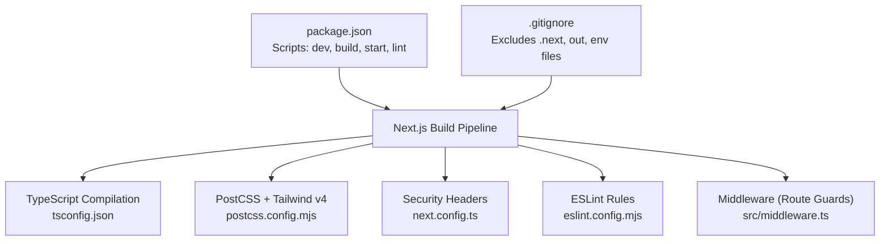
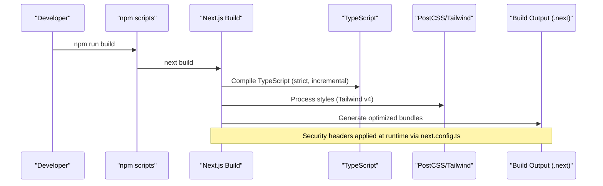
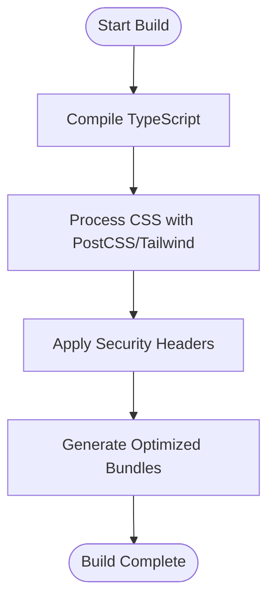
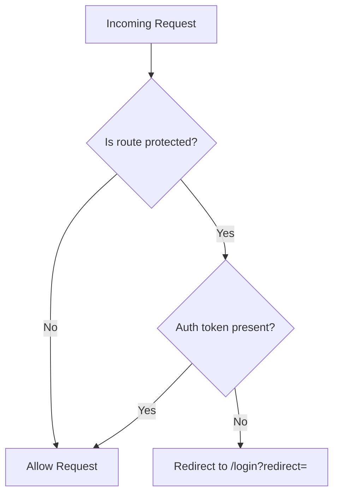
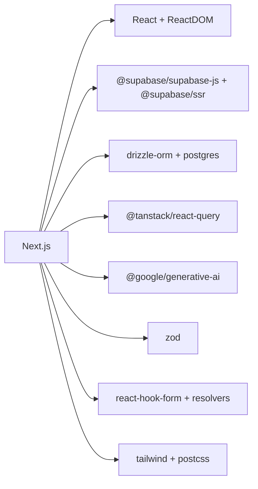

# Build Process & Deployment

<cite>
**Referenced Files in This Document**
- [package.json](file://package.json)
- [next.config.ts](file://next.config.ts)
- [tsconfig.json](file://tsconfig.json)
- [postcss.config.mjs](file://postcss.config.mjs)
- [eslint.config.mjs](file://eslint.config.mjs)
- [src/middleware.ts](file://src/middleware.ts)
- [README.md](file://README.md)
- [.gitignore](file://.gitignore)
</cite>

## Table of Contents
1. Introduction
2. Project Structure
3. Core Components
4. Architecture Overview
5. Detailed Component Analysis
6. Dependency Analysis
7. Performance Considerations
8. Troubleshooting Guide
9. Conclusion
10. Appendices

## Introduction
This document explains the complete build and deployment process for MedAce AI, a Next.js 15 application with TypeScript, Tailwind CSS v4, Supabase integration, and Google Gemini-powered RAG features. It covers the Next.js build pipeline, optimization settings, environment-specific configuration, and deployment strategies including Vercel, Docker containerization, and custom server deployment. It also outlines CI/CD considerations, automated testing integration points, and verification procedures to ensure reliable releases.

## Project Structure
MedAce AI follows a standard Next.js App Router layout under src/app with feature-based components and utilities. Configuration files define security headers, PostCSS/Tailwind processing, ESLint rules, and TypeScript behavior. The project includes scripts for development, building, linting, and starting the production server.

**Diagram sources**
- [package.json:5-9](file://package.json#L5-L9)
- [tsconfig.json:1-28](file://tsconfig.json#L1-L28)
- [postcss.config.mjs:1-9](file://postcss.config.mjs#L1-L9)
- [next.config.ts:1-25](file://next.config.ts#L1-L25)
- [eslint.config.mjs:1-15](file://eslint.config.mjs#L1-L15)
- [src/middleware.ts:1-41](file://src/middleware.ts#L1-L41)
- [.gitignore:14-39](file://.gitignore#L14-L39)

**Section sources**
- [package.json:5-9](file://package.json#L5-L9)
- [tsconfig.json:1-28](file://tsconfig.json#L1-L28)
- [postcss.config.mjs:1-9](file://postcss.config.mjs#L1-L9)
- [next.config.ts:1-25](file://next.config.ts#L1-L25)
- [eslint.config.mjs:1-15](file://eslint.config.mjs#L1-L15)
- [src/middleware.ts:1-41](file://src/middleware.ts#L1-L41)
- [.gitignore:14-39](file://.gitignore#L14-L39)

## Core Components
- Build scripts: Development, build, start, and lint commands are defined in package.json.
- TypeScript: Strict mode, incremental compilation, path aliases, and Next.js plugin are configured.
- Styling: PostCSS uses Tailwind v4 via @tailwindcss/postcss.
- Security: next.config.ts sets global security headers for all routes.
- Middleware: Route protection is scaffolded for protected pages; currently allows access during frontend-only development.
- Linting: ESLint extends Next’s core web vitals config.

**Section sources**
- [package.json:5-9](file://package.json#L5-L9)
- [tsconfig.json:1-28](file://tsconfig.json#L1-L28)
- [postcss.config.mjs:1-9](file://postcss.config.mjs#L1-L9)
- [next.config.ts:3-21](file://next.config.ts#L3-L21)
- [src/middleware.ts:4-35](file://src/middleware.ts#L4-L35)
- [eslint.config.mjs:12-14](file://eslint.config.mjs#L12-L14)

## Architecture Overview
The build pipeline compiles TypeScript, processes styles with PostCSS/Tailwind, applies security headers, and produces a production-ready Next.js app. At runtime, middleware can enforce route protection, while API routes and server-side logic interact with Supabase and Gemini as needed.

**Diagram sources**
- [package.json:5-9](file://package.json#L5-L9)
- [tsconfig.json:1-28](file://tsconfig.json#L1-L28)
- [postcss.config.mjs:1-9](file://postcss.config.mjs#L1-L9)
- [next.config.ts:13-21](file://next.config.ts#L13-L21)

## Detailed Component Analysis

### Next.js Build Pipeline and Optimization Settings
- Scripts:
  - Development: next dev
  - Production build: next build
  - Production server: next start
  - Linting: next lint
- TypeScript:
  - Target ES2017, strict mode enabled, incremental builds, path alias @/* -> ./src
- Styles:
  - PostCSS configured with @tailwindcss/postcss for Tailwind v4
- Security headers:
  - X-Frame-Options: DENY
  - X-Content-Type-Options: nosniff
  - Referrer-Policy: origin-when-cross-origin
  - Permissions-Policy: camera=(), microphone=(), geolocation()

**Diagram sources**
- [package.json:5-9](file://package.json#L5-L9)
- [tsconfig.json:1-28](file://tsconfig.json#L1-L28)
- [postcss.config.mjs:1-9](file://postcss.config.mjs#L1-L9)
- [next.config.ts:3-21](file://next.config.ts#L3-L21)

**Section sources**
- [package.json:5-9](file://package.json#L5-L9)
- [tsconfig.json:1-28](file://tsconfig.json#L1-L28)
- [postcss.config.mjs:1-9](file://postcss.config.mjs#L1-L9)
- [next.config.ts:3-21](file://next.config.ts#L3-L21)

### Environment-Specific Configuration
- Required environment variables include Supabase URLs and keys, service role key, database URL for Drizzle, Gemini API key, and app URL. These must be set per environment (development, staging, production).
- In development, use local .env.local; in CI/CD or hosting platforms, configure environment variables through platform settings.

**Section sources**
- [README.md:228-244](file://README.md#L228-L244)

### Middleware and Route Protection
- Protected routes list includes dashboard, practice, results, study-plan, profile.
- Public routes include root, login, signup.
- Currently, middleware allows all requests during frontend-only development; authentication checks are prepared for when Supabase auth is wired up.

**Diagram sources**
- [src/middleware.ts:4-35](file://src/middleware.ts#L4-L35)

**Section sources**
- [src/middleware.ts:4-35](file://src/middleware.ts#L4-L35)

### Asset Optimization and Styling
- Tailwind v4 is processed via PostCSS using @tailwindcss/postcss.
- Path aliases simplify imports and improve maintainability.
- Incremental TypeScript compilation speeds up rebuilds.

**Section sources**
- [postcss.config.mjs:1-9](file://postcss.config.mjs#L1-L9)
- [tsconfig.json:1-28](file://tsconfig.json#L1-L28)

### Monitoring and Analytics
- The README indicates Vercel Analytics for web vitals and usage tracking. Configure analytics within your Vercel project settings after deployment.

**Section sources**
- [README.md:76-77](file://README.md#L76-L77)

## Dependency Analysis
Key dependencies influence build and runtime behavior:
- Next.js 15 drives the build pipeline and server runtime.
- React 19 and ReactDOM provide UI runtime.
- Supabase SDKs enable client/server integrations.
- Drizzle ORM and postgres driver support database operations.
- TanStack Query manages server state caching and updates.
- Google Generative AI enables Gemini interactions.
- Zod provides schema validation.
- Form libraries streamline form handling.
- Tailwind and PostCSS handle styling.

**Diagram sources**
- [package.json:11-26](file://package.json#L11-L26)

**Section sources**
- [package.json:11-26](file://package.json#L11-L26)

## Performance Considerations
- Use Next.js incremental builds and strict TypeScript settings to optimize compile times.
- Leverage Tailwind v4 for efficient CSS processing.
- Apply security headers to harden the production build.
- Utilize Vercel Analytics to monitor performance metrics post-deployment.
- Keep environment variables minimal and scoped per environment to reduce overhead.

[No sources needed since this section provides general guidance]

## Troubleshooting Guide
Common issues and resolutions:
- Build failures due to missing environment variables:
  - Ensure all required variables (Supabase, Database, Gemini, App URL) are set in your environment or platform settings.
- TypeScript errors:
  - Verify tsconfig settings and that path aliases resolve correctly.
- Style build issues:
  - Confirm PostCSS configuration includes @tailwindcss/postcss.
- Middleware not enforcing auth:
  - Uncomment and implement session checks in middleware when Supabase auth is integrated.
- Excessive build artifacts:
  - Ensure .next and out directories are ignored in version control.

**Section sources**
- [README.md:228-244](file://README.md#L228-L244)
- [tsconfig.json:1-28](file://tsconfig.json#L1-L28)
- [postcss.config.mjs:1-9](file://postcss.config.mjs#L1-L9)
- [src/middleware.ts:22-35](file://src/middleware.ts#L22-L35)
- [.gitignore:14-39](file://.gitignore#L14-L39)

## Conclusion
MedAce AI uses a modern Next.js 15 build pipeline with TypeScript, Tailwind v4, and robust security headers. Environment variables drive external integrations like Supabase and Gemini. Deployment on Vercel is straightforward, with optional Docker and custom server options available. Middleware scaffolding supports future authentication enforcement. Monitoring via Vercel Analytics helps track performance. Following the outlined steps ensures consistent builds and reliable deployments across environments.

[No sources needed since this section summarizes without analyzing specific files]

## Appendices

### Deployment Strategies

#### Vercel Deployment
- Zero-config deployment for Next.js applications.
- Set environment variables in Vercel project settings before deploying.
- Use branch deployments for staging and main branch for production.

**Section sources**
- [README.md:318-324](file://README.md#L318-L324)

#### Docker Containerization
- Create a Dockerfile based on a Node.js image compatible with Next.js 15.
- Install dependencies, build the app, and expose port 3000.
- Run the production server using next start.

[No sources needed since this section provides general guidance]

#### Custom Server Deployment
- Use next start to serve the built application on a custom host.
- Configure reverse proxy (e.g., Nginx) if needed.
- Ensure environment variables are set on the host system.

[No sources needed since this section provides general guidance]

### CI/CD Pipeline Configuration
- Recommended stages:
  - Install dependencies
  - Lint code
  - Type check and build
  - Run tests (if added)
  - Deploy to target environment (Vercel, Docker registry, etc.)
- Cache node_modules and .next to speed up builds.
- Store secrets securely in CI/CD provider settings.

[No sources needed since this section provides general guidance]

### Automated Testing Integration
- Add unit and integration tests using frameworks compatible with Next.js and React.
- Integrate test execution into CI pipeline before deployment.
- Report coverage and fail builds on critical thresholds.

[No sources needed since this section provides general guidance]

### Deployment Verification Procedures
- Health checks:
  - Verify root page loads and assets render correctly.
  - Confirm API routes respond as expected.
- Environment validation:
  - Ensure environment variables are correctly set and accessible.
- Monitoring:
  - Review Vercel Analytics for performance metrics and errors.

[No sources needed since this section provides general guidance]