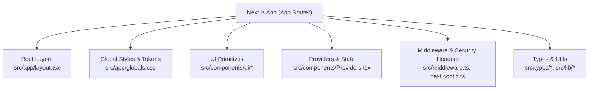
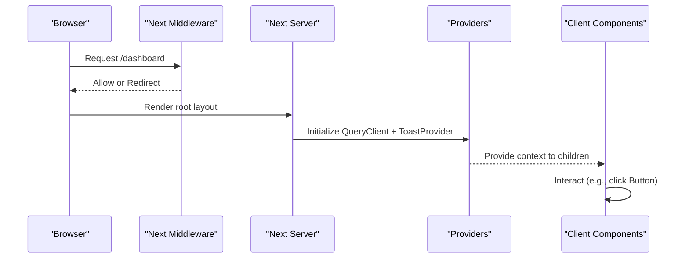
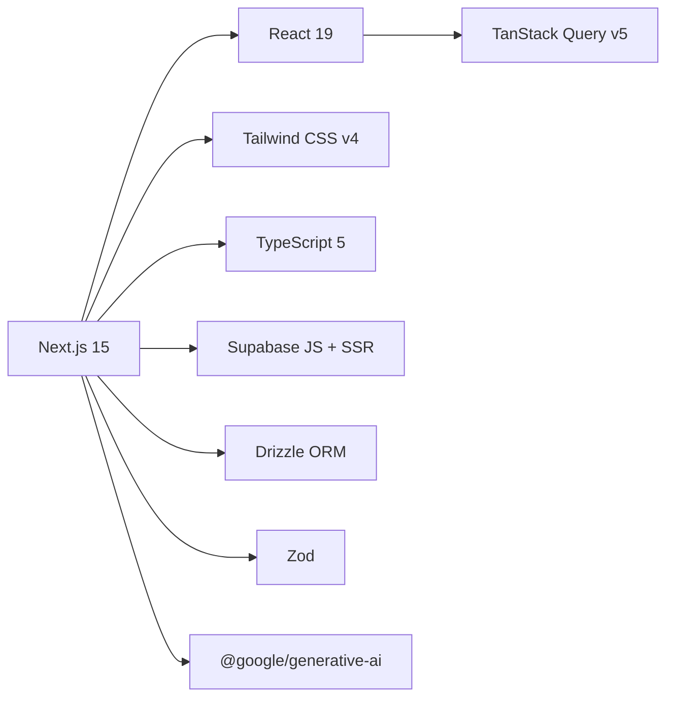

# Coding Standards & Conventions

<cite>
**Referenced Files in This Document**
- [tsconfig.json](file://tsconfig.json)
- [eslint.config.mjs](file://eslint.config.mjs)
- [next.config.ts](file://next.config.ts)
- [postcss.config.mjs](file://postcss.config.mjs)
- [package.json](file://package.json)
- [src/app/globals.css](file://src/app/globals.css)
- [src/components/ui/Button.tsx](file://src/components/ui/Button.tsx)
- [src/components/ui/index.ts](file://src/components/ui/index.ts)
- [src/types/quiz.ts](file://src/types/quiz.ts)
- [src/lib/utils.ts](file://src/lib/utils.ts)
- [src/app/layout.tsx](file://src/app/layout.tsx)
- [src/components/Providers.tsx](file://src/components/Providers.tsx)
- [src/middleware.ts](file://src/middleware.ts)
- [README.md](file://README.md)
</cite>

## Table of Contents
1. Introduction
2. Project Structure
3. Core Components
4. Architecture Overview
5. Detailed Component Analysis
6. Dependency Analysis
7. Performance Considerations
8. Troubleshooting Guide
9. Conclusion
10. Appendices

## Introduction
This document defines the coding standards and conventions for MedAce AI development. It covers TypeScript configuration, ESLint rules, CSS/Tailwind conventions, naming conventions, examples of good patterns and anti-patterns, and code review guidelines to ensure consistent, maintainable, and high-quality code across the project.

## Project Structure
MedAce AI is a Next.js 15 application with React 19, TypeScript 5, Tailwind CSS v4, TanStack Query, Supabase, Drizzle ORM, Zod validation, and Google Gemini integration. The app uses the App Router, client components where interactivity is required, and server-side capabilities via API routes and middleware.

**Diagram sources**
- [src/app/layout.tsx:1-57](file://src/app/layout.tsx#L1-L57)
- [src/app/globals.css:1-181](file://src/app/globals.css#L1-L181)
- [src/components/ui/index.ts:1-15](file://src/components/ui/index.ts#L1-L15)
- [src/components/Providers.tsx:1-23](file://src/components/Providers.tsx#L1-L23)
- [src/middleware.ts:1-41](file://src/middleware.ts#L1-L41)
- [next.config.ts:1-25](file://next.config.ts#L1-L25)

**Section sources**
- [README.md:23-78](file://README.md#L23-L78)
- [package.json:1-42](file://package.json#L1-L42)

## Core Components
- UI primitives are centralized under src/components/ui and re-exported from an index barrel for clean imports.
- Shared utilities live in src/lib/utils.ts, including a class-name merger helper and formatting helpers.
- Global design tokens and base styles are defined in src/app/globals.css using Tailwind v4’s @theme inline feature.
- Application-wide providers (TanStack Query, Toast) are composed in src/components/Providers.tsx.
- Root layout sets up fonts, metadata, and global classes.

Key implementation references:
- Button component demonstrates typed props, variant/size mapping, loading state, and accessible focus states.
- cn utility composes clsx and tailwind-merge to avoid conflicting utility classes.
- Design tokens define colors, fonts, and semantic variables used throughout the app.

**Section sources**
- [src/components/ui/Button.tsx:1-59](file://src/components/ui/Button.tsx#L1-L59)
- [src/components/ui/index.ts:1-15](file://src/components/ui/index.ts#L1-L15)
- [src/lib/utils.ts:1-34](file://src/lib/utils.ts#L1-L34)
- [src/app/globals.css:1-181](file://src/app/globals.css#L1-L181)
- [src/components/Providers.tsx:1-23](file://src/components/Providers.tsx#L1-L23)
- [src/app/layout.tsx:1-57](file://src/app/layout.tsx#L1-L57)

## Architecture Overview
The application enforces security headers at the framework level and uses middleware to gate protected routes. Client components are explicitly marked for interactivity. Data fetching and caching are handled by TanStack Query, while form handling and validation use React Hook Form and Zod.

**Diagram sources**
- [src/middleware.ts:1-41](file://src/middleware.ts#L1-L41)
- [next.config.ts:1-25](file://next.config.ts#L1-L25)
- [src/components/Providers.tsx:1-23](file://src/components/Providers.tsx#L1-L23)
- [src/app/layout.tsx:1-57](file://src/app/layout.tsx#L1-L57)

## Detailed Component Analysis

### TypeScript Configuration and Type Checking
- Strict mode is enabled to enforce null checks, strict function types, and other safety features.
- Module resolution uses bundler strategy compatible with Next.js and modern tooling.
- Path aliases map @/* to ./src/* for cleaner imports.
- JSX is preserved for Next.js processing; incremental builds are enabled.
- Include/exclude patterns target TS/TSX files and generated types.

Best practices derived from config:
- Use explicit types for props and data shapes (see src/types/quiz.ts).
- Prefer narrow union types for enums-like behavior (e.g., difficulty, status).
- Avoid any; leverage Zod for runtime validation aligned with static types.

**Section sources**
- [tsconfig.json:1-28](file://tsconfig.json#L1-L28)
- [src/types/quiz.ts:1-107](file://src/types/quiz.ts#L1-L107)

### ESLint Configuration and Code Quality
- ESLint extends next/core-web-vitals to align with Next.js best practices and performance-focused rules.
- Linting is run via npm script lint.

Recommended enhancements (optional):
- Add import ordering rules (e.g., relative before absolute, third-party before internal).
- Enforce consistent naming conventions and disallow unused variables.
- Integrate Prettier if desired for formatting consistency.

**Section sources**
- [eslint.config.mjs:1-15](file://eslint.config.mjs#L1-L15)
- [package.json:5-10](file://package.json#L5-L10)

### CSS and Tailwind Conventions
- Global design tokens are declared via Tailwind v4’s @theme inline block for colors, fonts, and semantic tokens.
- Base layer sets global typography, background, text color, and scrollbar styling.
- Utilities layer defines reusable custom classes like gradient-text, glass-card, and animations.
- Class merging uses the cn utility to compose variants and sizes without conflicts.

Guidelines:
- Use semantic token names (bg-bg, text-text, border-border) instead of hard-coded values.
- Keep component-specific styles within components; prefer utility classes for layout and spacing.
- For responsive design, rely on Tailwind’s responsive prefixes and breakpoints.

**Section sources**
- [src/app/globals.css:1-181](file://src/app/globals.css#L1-L181)
- [src/components/ui/Button.tsx:1-59](file://src/components/ui/Button.tsx#L1-L59)
- [src/lib/utils.ts:1-34](file://src/lib/utils.ts#L1-L34)

### Naming Conventions
- Files and directories:
  - Feature-based folders under src/app (e.g., dashboard, practice, results).
  - Group UI primitives under src/components/ui with PascalCase file names.
  - Types in src/types with descriptive singular nouns (e.g., quiz.ts).
  - Utilities in src/lib with lowercase kebab or camelCase filenames.
- Components:
  - PascalCase component names (e.g., Button, Card, Modal).
  - Export named components and their prop types together.
- Functions and variables:
  - camelCase for functions and variables (e.g., formatDate, getScoreColor).
  - Descriptive names that reflect intent (avoid generic names like data, result).
- Constants and enums:
  - Use uppercase snake_case for constants when appropriate.
  - Prefer union literal types for constrained sets (as seen in difficulty/status fields).

Examples in codebase:
- Utility functions: formatDate, formatTime, getScoreColor, getScoreBgColor.
- Component props: ButtonProps with variant and size unions.
- Domain types: Topic, Question, QuizSession, StudyPlan, UserProfile.

**Section sources**
- [src/lib/utils.ts:1-34](file://src/lib/utils.ts#L1-L34)
- [src/components/ui/Button.tsx:1-59](file://src/components/ui/Button.tsx#L1-L59)
- [src/types/quiz.ts:1-107](file://src/types/quiz.ts#L1-L107)

### Examples of Well-Structured Code
- Typed component with clear props, variants, and accessibility:
  - See Button component with forwardRef, disabled/loading states, and focus rings.
- Centralized class merging utility:
  - See cn helper combining clsx and tailwind-merge for conflict-free composition.
- Domain modeling with precise unions:
  - See types for difficulty, status, and answer options to prevent invalid states.

**Section sources**
- [src/components/ui/Button.tsx:1-59](file://src/components/ui/Button.tsx#L1-L59)
- [src/lib/utils.ts:1-34](file://src/lib/utils.ts#L1-L34)
- [src/types/quiz.ts:1-107](file://src/types/quiz.ts#L1-L107)

### Common Anti-Patterns to Avoid
- Using any instead of explicit types or Zod schemas.
- Hard-coding colors or spacing instead of design tokens.
- Mixing logic inside UI components; extract business logic into lib or hooks.
- Overusing global styles; prefer scoped utilities and component-level classes.
- Unprotected sensitive routes without proper auth checks in middleware.

[No sources needed since this section provides general guidance]

## Dependency Analysis
The project relies on a curated set of dependencies for UI, state management, database, and AI integrations.

**Diagram sources**
- [package.json:11-27](file://package.json#L11-L27)
- [package.json:28-40](file://package.json#L28-L40)

**Section sources**
- [package.json:1-42](file://package.json#L1-L42)

## Performance Considerations
- Enable strict mode and incremental compilation for faster type checking and builds.
- Use client components only where interactivity is necessary to minimize bundle size.
- Leverage TanStack Query caching and stale times to reduce redundant network requests.
- Utilize Tailwind’s utility-first approach to keep CSS minimal and tree-shakeable.
- Apply security headers to mitigate common web vulnerabilities.

[No sources needed since this section provides general guidance]

## Troubleshooting Guide
- If routes redirect unexpectedly, verify middleware matcher and protected/public route lists.
- If styles appear inconsistent, ensure design tokens are applied via Tailwind classes and that cn merges classes correctly.
- If forms fail validation, confirm Zod schemas match expected input shapes and that React Hook Form integrates properly.
- If API calls fail, check environment variables and provider initialization in Providers.

**Section sources**
- [src/middleware.ts:1-41](file://src/middleware.ts#L1-L41)
- [src/components/Providers.tsx:1-23](file://src/components/Providers.tsx#L1-L23)
- [src/app/globals.css:1-181](file://src/app/globals.css#L1-L181)

## Conclusion
Adhering to these coding standards ensures consistency, safety, and scalability across MedAce AI. By enforcing strict TypeScript, leveraging Tailwind design tokens, centralizing UI primitives, and following clear naming conventions, the team can deliver a robust, maintainable application aligned with Next.js best practices.

[No sources needed since this section summarizes without analyzing specific files]

## Appendices

### TypeScript Rules Summary
- Strict mode enabled for comprehensive type safety.
- Bundler module resolution for compatibility with Next.js.
- Path alias @/* mapped to src/* for readable imports.
- Preserve JSX for Next.js pipeline; include TS/TSX and generated types.

**Section sources**
- [tsconfig.json:1-28](file://tsconfig.json#L1-L28)

### ESLint Rules Summary
- Extends next/core-web-vitals for performance-oriented linting.
- Run lint via npm script.

**Section sources**
- [eslint.config.mjs:1-15](file://eslint.config.mjs#L1-L15)
- [package.json:5-10](file://package.json#L5-L10)

### CSS/Tailwind Conventions Summary
- Define tokens in @theme inline for consistent theming.
- Use base layer for global resets and typography.
- Create utility classes for repeated patterns and animations.
- Compose classes with cn to avoid conflicts.

**Section sources**
- [src/app/globals.css:1-181](file://src/app/globals.css#L1-L181)
- [src/lib/utils.ts:1-34](file://src/lib/utils.ts#L1-L34)

### PostCSS Configuration
- Uses @tailwindcss/postcss plugin for Tailwind v4 processing.

**Section sources**
- [postcss.config.mjs:1-9](file://postcss.config.mjs#L1-L9)

### Security Headers
- X-Frame-Options: DENY
- X-Content-Type-Options: nosniff
- Referrer-Policy: origin-when-cross-origin
- Permissions-Policy: restrict camera, microphone, geolocation

**Section sources**
- [next.config.ts:1-25](file://next.config.ts#L1-L25)