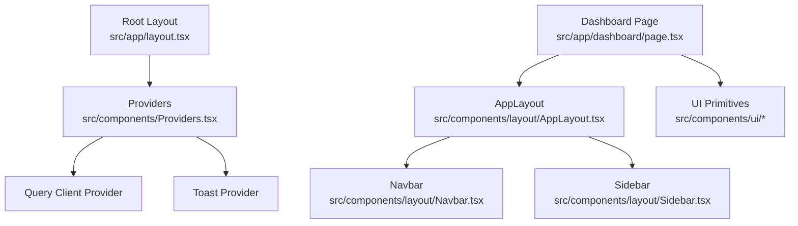
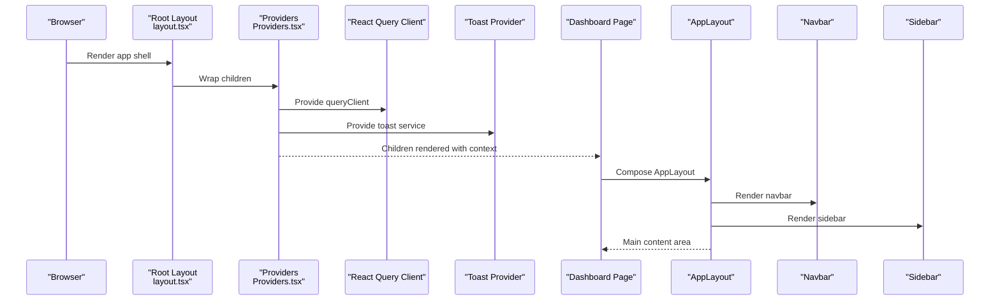
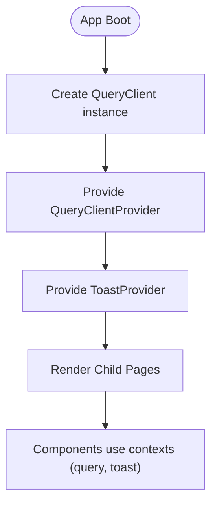
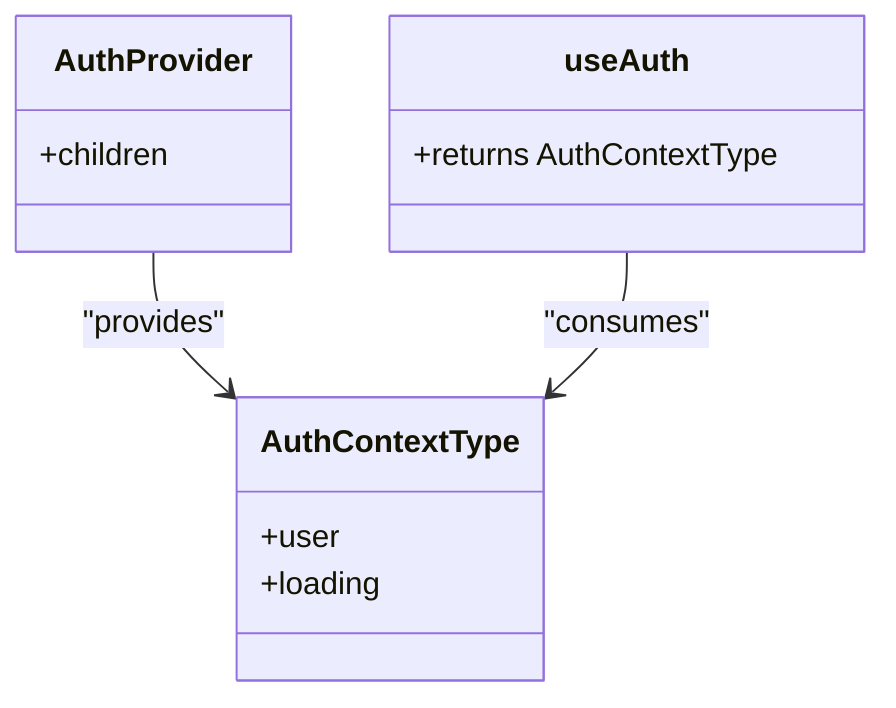
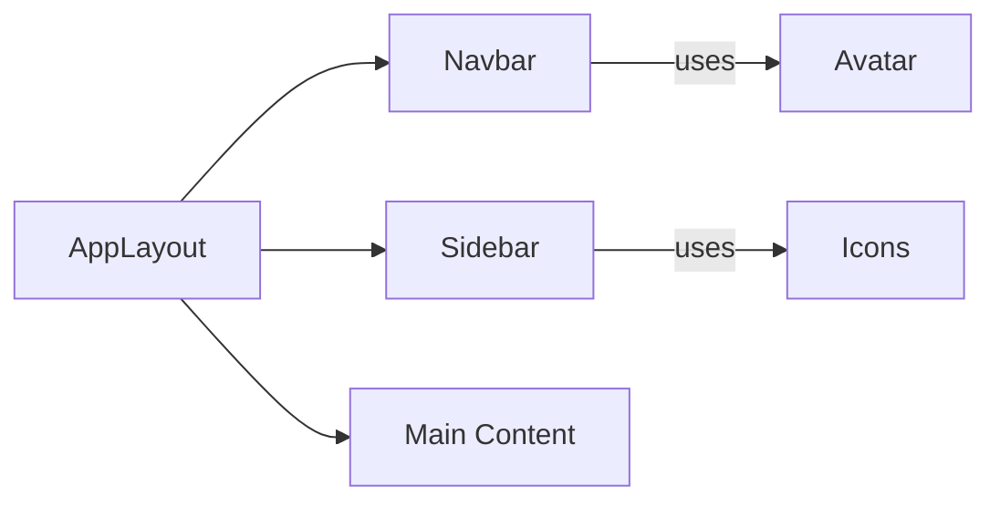
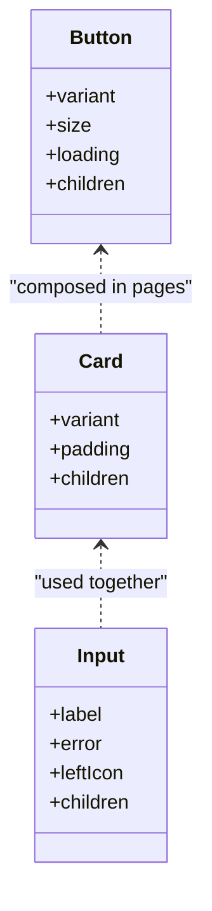
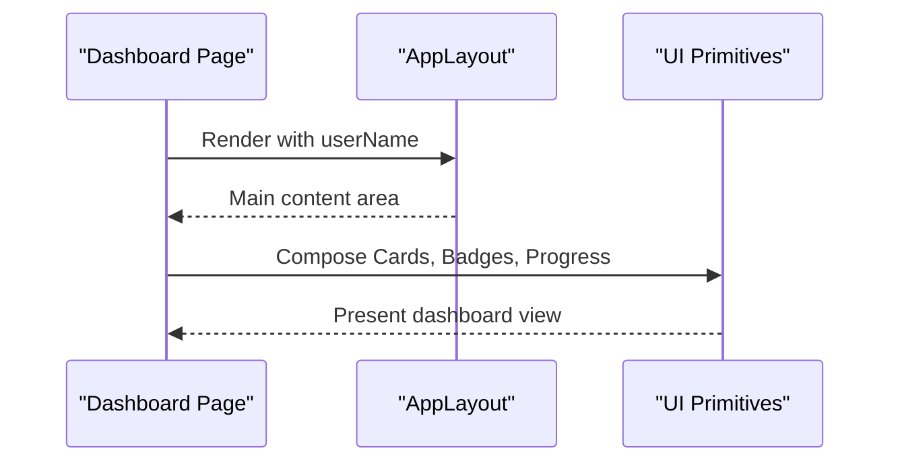
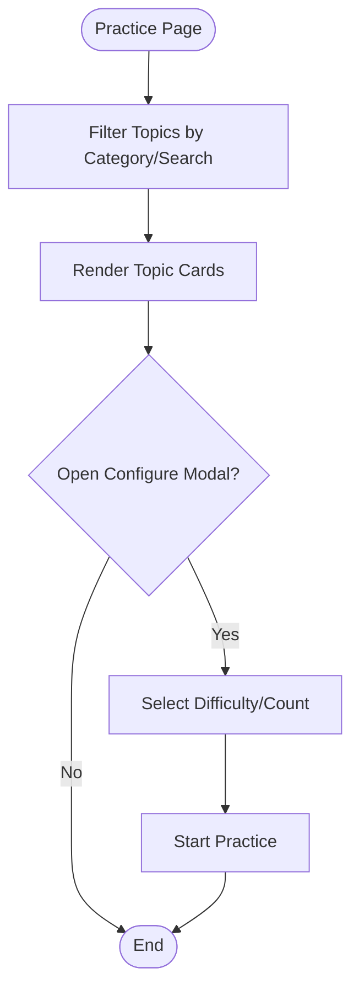
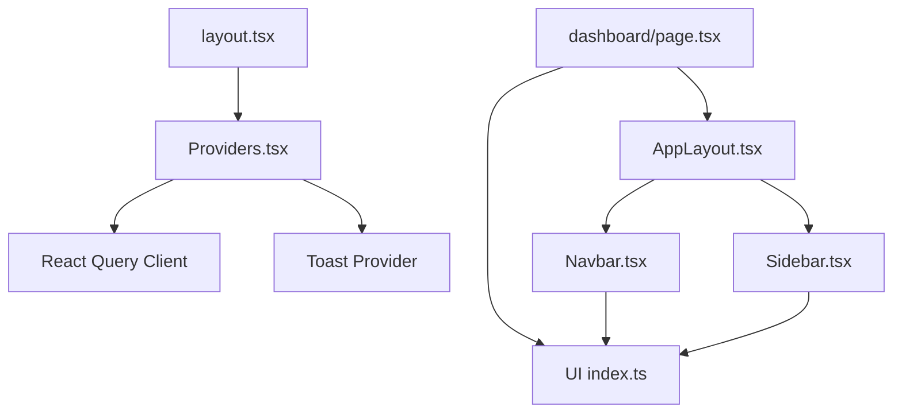

# Component Architecture & Patterns

<cite>
**Referenced Files in This Document**
- [Providers.tsx](file://src/components/Providers.tsx)
- [AppLayout.tsx](file://src/components/layout/AppLayout.tsx)
- [Navbar.tsx](file://src/components/layout/Navbar.tsx)
- [Sidebar.tsx](file://src/components/layout/Sidebar.tsx)
- [AuthProvider.tsx](file://src/components/auth/AuthProvider.tsx)
- [index.ts](file://src/components/ui/index.ts)
- [Button.tsx](file://src/components/ui/Button.tsx)
- [Card.tsx](file://src/components/ui/Card.tsx)
- [Input.tsx](file://src/components/ui/Input.tsx)
- [Toast.tsx](file://src/components/ui/Toast.tsx)
- [layout.tsx](file://src/app/layout.tsx)
- [dashboard/page.tsx](file://src/app/dashboard/page.tsx)
- [practice/page.tsx](file://src/app/practice/page.tsx)
- [utils.ts](file://src/lib/utils.ts)
</cite>

## Table of Contents
1. Introduction
2. Project Structure
3. Core Components
4. Architecture Overview
5. Detailed Component Analysis
6. Dependency Analysis
7. Performance Considerations
8. Troubleshooting Guide
9. Conclusion
10. Appendices

## Introduction
This document explains MedAce AI’s component architecture patterns with a focus on:
- Separation between UI components (src/components/ui/) and feature/layout components
- Composition hierarchy and design principles
- Provider pattern for global state management and context usage
- Layout orchestration via AppLayout.tsx
- Examples of composition patterns, prop drilling alternatives using context, and modular organization strategy
- Guidelines to maintain architectural consistency when adding new components

## Project Structure
MedAce AI follows a layered, feature-oriented structure within Next.js:
- Root layout sets up global providers and theme
- Providers encapsulate cross-cutting concerns (data fetching cache, toast system)
- Layout components compose the application chrome (navbar, sidebar, main content area)
- UI components are presentational primitives with consistent props and styling
- Feature pages compose layout and UI components to render domain screens

**Diagram sources**
- [layout.tsx:44-56](file://src/app/layout.tsx#L44-L56)
- [Providers.tsx:7-21](file://src/components/Providers.tsx#L7-L21)
- [AppLayout.tsx:10-24](file://src/components/layout/AppLayout.tsx#L10-L24)
- [Navbar.tsx:30-160](file://src/components/layout/Navbar.tsx#L30-L160)
- [Sidebar.tsx:21-73](file://src/components/layout/Sidebar.tsx#L21-L73)
- [dashboard/page.tsx:21-237](file://src/app/dashboard/page.tsx#L21-L237)

**Section sources**
- [layout.tsx:1-57](file://src/app/layout.tsx#L1-L57)
- [Providers.tsx:1-23](file://src/components/Providers.tsx#L1-L23)
- [AppLayout.tsx:1-25](file://src/components/layout/AppLayout.tsx#L1-L25)
- [index.ts:1-15](file://src/components/ui/index.ts#L1-L15)

## Core Components
- Providers: Centralizes React Query client and Toast provider to avoid prop drilling for global services.
- AppLayout: Orchestrates page chrome (navbar + sidebar + main) and provides a consistent content container.
- Navbar and Sidebar: Shared navigation components with active state detection and responsive behavior.
- UI Primitives: Reusable, composable building blocks (Button, Card, Input, Modal, Tabs, Progress, etc.) with consistent props and styling utilities.

Design principles observed:
- Separation of concerns: UI vs layout vs feature pages
- Composition over inheritance: Pages compose layout and UI primitives
- Context-driven global state: Providers expose services via context rather than prop drilling
- Consistent styling: Tailwind classes combined with a shared cn utility for class merging
- Accessibility and semantics: Proper labels, roles, and keyboard-friendly interactions where applicable

**Section sources**
- [Providers.tsx:7-21](file://src/components/Providers.tsx#L7-L21)
- [AppLayout.tsx:10-24](file://src/components/layout/AppLayout.tsx#L10-L24)
- [Button.tsx:33-58](file://src/components/ui/Button.tsx#L33-L58)
- [Card.tsx:25-45](file://src/components/ui/Card.tsx#L25-L45)
- [Input.tsx:10-52](file://src/components/ui/Input.tsx#L10-L52)
- [utils.ts:4-6](file://src/lib/utils.ts#L4-L6)

## Architecture Overview
The application uses a provider-based architecture at the root level, with layout components composing the shell for app pages. Feature pages consume UI primitives and optional contexts (e.g., auth, toast).

**Diagram sources**
- [layout.tsx:44-56](file://src/app/layout.tsx#L44-L56)
- [Providers.tsx:7-21](file://src/components/Providers.tsx#L7-L21)
- [AppLayout.tsx:10-24](file://src/components/layout/AppLayout.tsx#L10-L24)
- [Navbar.tsx:30-160](file://src/components/layout/Navbar.tsx#L30-L160)
- [Sidebar.tsx:21-73](file://src/components/layout/Sidebar.tsx#L21-L73)
- [dashboard/page.tsx:21-237](file://src/app/dashboard/page.tsx#L21-L237)

## Detailed Component Analysis

### Providers Pattern and Global State Management
- Purpose: Encapsulate cross-cutting services (data caching, notifications) so child components can access them without prop drilling.
- Implementation highlights:
  - React Query client is created once and provided via QueryClientProvider
  - Toast system is exposed via a custom provider and hook
  - Root layout wraps all pages with Providers to ensure availability throughout the app

**Diagram sources**
- [Providers.tsx:7-21](file://src/components/Providers.tsx#L7-L21)
- [Toast.tsx:45-86](file://src/components/ui/Toast.tsx#L45-L86)

**Section sources**
- [Providers.tsx:7-21](file://src/components/Providers.tsx#L7-L21)
- [Toast.tsx:21-31](file://src/components/ui/Toast.tsx#L21-L31)
- [Toast.tsx:45-86](file://src/components/ui/Toast.tsx#L45-L86)

### Auth Context (AuthProvider)
- Purpose: Provide user authentication state globally via context, enabling features like personalized greetings or protected routes.
- Current state: Mock user for frontend development; ready to be wired to a backend auth flow.
- Usage: Any descendant component can call the provided hook to read user and loading state.

**Diagram sources**
- [AuthProvider.tsx:17-29](file://src/components/auth/AuthProvider.tsx#L17-L29)
- [AuthProvider.tsx:43-57](file://src/components/auth/AuthProvider.tsx#L43-L57)

**Section sources**
- [AuthProvider.tsx:11-29](file://src/components/auth/AuthProvider.tsx#L11-L29)
- [AuthProvider.tsx:43-57](file://src/components/auth/AuthProvider.tsx#L43-L57)

### Layout Orchestration (AppLayout, Navbar, Sidebar)
- AppLayout:
  - Renders a sticky header (Navbar), a persistent sidebar (Sidebar), and a scrollable main content area
  - Accepts optional userName to personalize UI
- Navbar:
  - Provides top-level navigation with active state based on current pathname
  - Supports both landing and app variants
- Sidebar:
  - Displays app navigation with active highlighting and brand footer

**Diagram sources**
- [AppLayout.tsx:10-24](file://src/components/layout/AppLayout.tsx#L10-L24)
- [Navbar.tsx:30-160](file://src/components/layout/Navbar.tsx#L30-L160)
- [Sidebar.tsx:21-73](file://src/components/layout/Sidebar.tsx#L21-L73)

**Section sources**
- [AppLayout.tsx:10-24](file://src/components/layout/AppLayout.tsx#L10-L24)
- [Navbar.tsx:30-160](file://src/components/layout/Navbar.tsx#L30-L160)
- [Sidebar.tsx:21-73](file://src/components/layout/Sidebar.tsx#L21-L73)

### UI Components: Composition and Styling
- Button:
  - Variants and sizes controlled by props
  - Loading state integrates an inline spinner
  - Uses forwardRef and className merging for flexibility
- Card:
  - Variants and padding options
  - Clean wrapper for content with consistent spacing and borders
- Input:
  - Label, error message, and left icon support
  - Accessible id generation and focus states

**Diagram sources**
- [Button.tsx:33-58](file://src/components/ui/Button.tsx#L33-L58)
- [Card.tsx:25-45](file://src/components/ui/Card.tsx#L25-L45)
- [Input.tsx:10-52](file://src/components/ui/Input.tsx#L10-L52)

**Section sources**
- [Button.tsx:10-58](file://src/components/ui/Button.tsx#L10-L58)
- [Card.tsx:4-45](file://src/components/ui/Card.tsx#L4-L45)
- [Input.tsx:4-52](file://src/components/ui/Input.tsx#L4-L52)
- [utils.ts:4-6](file://src/lib/utils.ts#L4-L6)

### Example: Dashboard Page Composition
- Wraps content in AppLayout to inherit navbar/sidebar/main structure
- Composes multiple UI primitives (Card, Badge, Button, Progress) to display stats, weak topics, recent sessions, and quick-start cards
- Demonstrates data presentation patterns and consistent spacing

**Diagram sources**
- [dashboard/page.tsx:21-237](file://src/app/dashboard/page.tsx#L21-L237)
- [AppLayout.tsx:10-24](file://src/components/layout/AppLayout.tsx#L10-L24)

**Section sources**
- [dashboard/page.tsx:21-237](file://src/app/dashboard/page.tsx#L21-L237)

### Example: Practice Page Composition
- Uses tabs, search input, card grid, modal, select, and progress to configure and preview practice sessions
- Shows how feature pages combine layout and UI components to build complex interactions

**Diagram sources**
- [practice/page.tsx:18-196](file://src/app/practice/page.tsx#L18-L196)

**Section sources**
- [practice/page.tsx:18-196](file://src/app/practice/page.tsx#L18-L196)

## Dependency Analysis
- Root layout depends on Providers to inject global services
- Pages depend on layout components for chrome and UI primitives for presentation
- Layout components depend on UI primitives and routing/navigation hooks
- UI primitives depend on shared utilities for class merging and formatting

**Diagram sources**
- [layout.tsx:44-56](file://src/app/layout.tsx#L44-L56)
- [Providers.tsx:7-21](file://src/components/Providers.tsx#L7-L21)
- [dashboard/page.tsx:21-237](file://src/app/dashboard/page.tsx#L21-L237)
- [AppLayout.tsx:10-24](file://src/components/layout/AppLayout.tsx#L10-L24)
- [Navbar.tsx:30-160](file://src/components/layout/Navbar.tsx#L30-L160)
- [Sidebar.tsx:21-73](file://src/components/layout/Sidebar.tsx#L21-L73)
- [index.ts:1-15](file://src/components/ui/index.ts#L1-L15)

**Section sources**
- [layout.tsx:44-56](file://src/app/layout.tsx#L44-L56)
- [Providers.tsx:7-21](file://src/components/Providers.tsx#L7-L21)
- [index.ts:1-15](file://src/components/ui/index.ts#L1-L15)

## Performance Considerations
- Keep UI components pure and memoized where necessary to avoid unnecessary re-renders
- Prefer stable configuration objects (e.g., nav items) to minimize layout shifts
- Use React Query’s defaultOptions (staleTime, retry) to reduce network chatter
- Avoid deep nesting of providers; keep global state minimal and colocated near consumers when possible
- Defer heavy computations to server-side or web workers if needed

[No sources needed since this section provides general guidance]

## Troubleshooting Guide
- Toast errors:
  - If useToast is called outside ToastProvider, it throws an error indicating incorrect usage. Ensure the app is wrapped with Providers that include ToastProvider.
- Navigation issues:
  - Active link states rely on pathname; verify correct imports from next/navigation and consistent route paths.
- Styling conflicts:
  - Use the shared cn utility to merge classes safely and avoid Tailwind conflicts.

**Section sources**
- [Toast.tsx:27-31](file://src/components/ui/Toast.tsx#L27-L31)
- [Navbar.tsx:30-160](file://src/components/layout/Navbar.tsx#L30-L160)
- [utils.ts:4-6](file://src/lib/utils.ts#L4-L6)

## Conclusion
MedAce AI’s architecture emphasizes clear separation between UI primitives, layout orchestration, and feature pages, with providers centralizing global concerns. This approach enables scalable composition, reduces prop drilling through context, and maintains consistent styling and behavior across the application. Following the guidelines below will help preserve architectural consistency as the codebase grows.

[No sources needed since this section summarizes without analyzing specific files]

## Appendices

### Guidelines for Adding New Components
- Place presentational primitives under src/components/ui/ and export them via the barrel file (index.ts) to centralize imports.
- For feature-specific components, create a folder under src/components/<feature>/ to co-locate related logic and styles.
- Use the provider pattern for any cross-cutting state or services not suited for local component state; expose via a dedicated context and hook.
- Compose layouts using AppLayout for app pages; keep layout concerns separate from feature logic.
- Maintain consistent props:
  - Support variant and size enums where applicable
  - Always accept className and spread remaining props for flexibility
  - Use forwardRef for interactive elements to enable testing and accessibility
- Style consistently:
  - Use Tailwind classes and the cn utility for conditional class merging
  - Follow existing color tokens and spacing conventions
- Test accessibility:
  - Provide appropriate labels, roles, and keyboard interactions
  - Ensure focus management for modals and dynamic content

[No sources needed since this section provides general guidance]