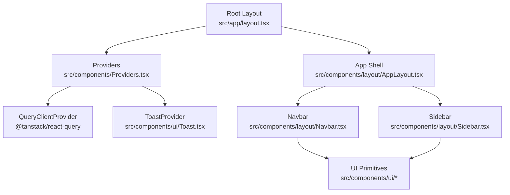
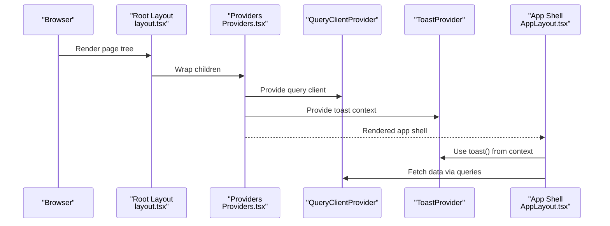
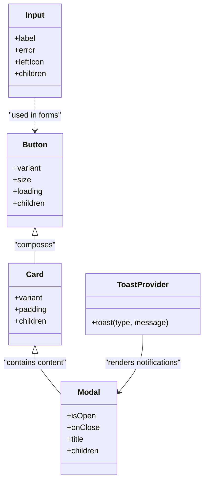
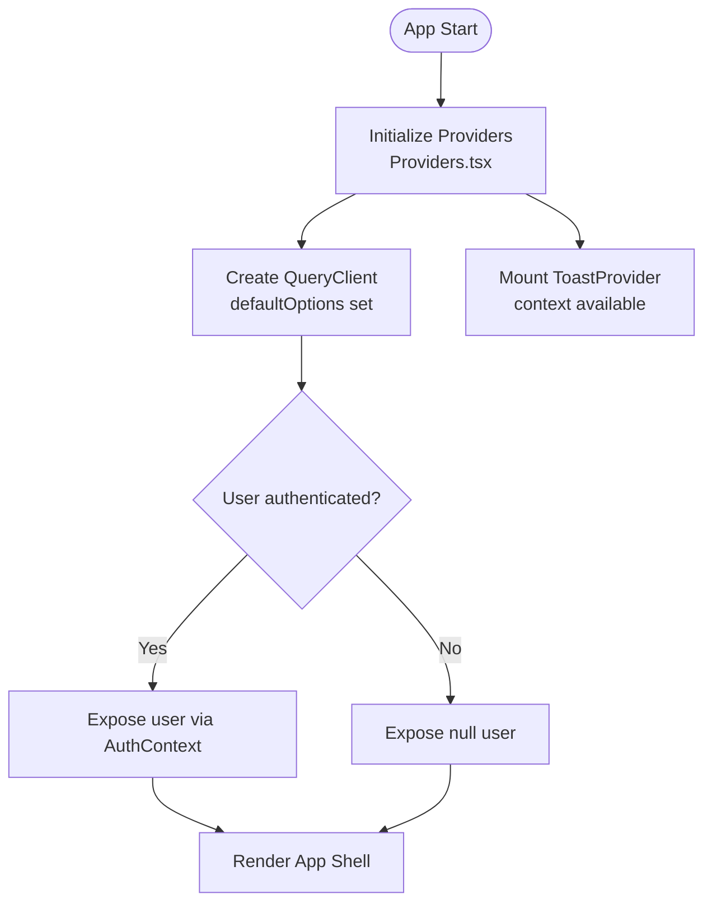
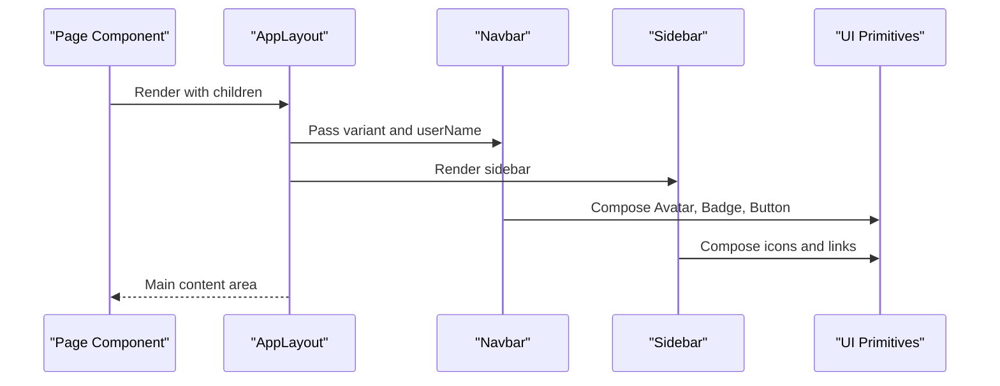
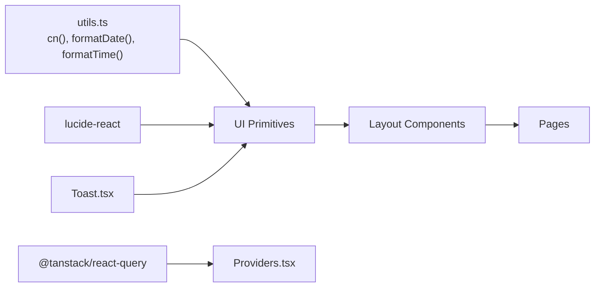

# Component Development Guide

<cite>
**Referenced Files in This Document**
- [Providers.tsx](file://src/components/Providers.tsx)
- [AuthProvider.tsx](file://src/components/auth/AuthProvider.tsx)
- [layout.tsx](file://src/app/layout.tsx)
- [index.ts](file://src/components/ui/index.ts)
- [Button.tsx](file://src/components/ui/Button.tsx)
- [Card.tsx](file://src/components/ui/Card.tsx)
- [Input.tsx](file://src/components/ui/Input.tsx)
- [Toast.tsx](file://src/components/ui/Toast.tsx)
- [Modal.tsx](file://src/components/ui/Modal.tsx)
- [AppLayout.tsx](file://src/components/layout/AppLayout.tsx)
- [Navbar.tsx](file://src/components/layout/Navbar.tsx)
- [Sidebar.tsx](file://src/components/layout/Sidebar.tsx)
- [utils.ts](file://src/lib/utils.ts)
- [page.tsx](file://src/app/page.tsx)
</cite>

## Table of Contents
1. Introduction
2. Project Structure
3. Core Components
4. Architecture Overview
5. Detailed Component Analysis
6. Dependency Analysis
7. Performance Considerations
8. Troubleshooting Guide
9. Conclusion
10. Appendices

## Introduction
This guide explains the component architecture used across MedAce AI, focusing on the separation between UI primitives and feature components, composition patterns, prop interfaces, state management via providers and contexts, and how to create new reusable components consistently. It also includes guidelines for testing, accessibility, and performance optimization, along with step-by-step examples for building and integrating new components into the existing system.

## Project Structure
MedAce AI organizes components into two primary layers:
- UI primitives under src/components/ui/: small, focused, accessible building blocks (Button, Card, Input, Modal, Toast, etc.) that are theme-aware and composable.
- Feature and layout components under src/components/layout/: higher-level components that compose UI primitives to build pages and application chrome (AppLayout, Navbar, Sidebar).

The root layout wraps the app with Providers to initialize global services (TanStack Query client and Toast context), ensuring consistent behavior across all routes.

**Diagram sources**
- [layout.tsx:44-56](file://src/app/layout.tsx#L44-L56)
- [Providers.tsx:7-22](file://src/components/Providers.tsx#L7-L22)
- [AppLayout.tsx:10-24](file://src/components/layout/AppLayout.tsx#L10-L24)
- [Navbar.tsx:30-162](file://src/components/layout/Navbar.tsx#L30-L162)
- [Sidebar.tsx:21-74](file://src/components/layout/Sidebar.tsx#L21-L74)
- [index.ts:1-15](file://src/components/ui/index.ts#L1-L15)

**Section sources**
- [layout.tsx:44-56](file://src/app/layout.tsx#L44-L56)
- [Providers.tsx:7-22](file://src/components/Providers.tsx#L7-L22)
- [AppLayout.tsx:10-24](file://src/components/layout/AppLayout.tsx#L10-L24)
- [index.ts:1-15](file://src/components/ui/index.ts#L1-L15)

## Core Components
- Button: A flexible, accessible button with variants, sizes, loading state, and focus styles. Uses forwardRef and a class merging utility for predictable styling.
- Card: A container with variant and padding options, designed for consistent spacing and elevation.
- Input: An accessible input with label association, optional left icon, and error messaging.
- Modal: A dialog with keyboard support (Escape to close), backdrop click-to-close, and proper ARIA attributes.
- Toast: A global notification system implemented via Context, providing toast() API and auto-dismiss behavior.

These primitives are exported from a single barrel file to simplify imports and maintain a stable public API surface.

**Section sources**
- [Button.tsx:10-58](file://src/components/ui/Button.tsx#L10-L58)
- [Card.tsx:7-45](file://src/components/ui/Card.tsx#L7-L45)
- [Input.tsx:4-52](file://src/components/ui/Input.tsx#L4-L52)
- [Modal.tsx:7-82](file://src/components/ui/Modal.tsx#L7-L82)
- [Toast.tsx:15-88](file://src/components/ui/Toast.tsx#L15-L88)
- [index.ts:1-15](file://src/components/ui/index.ts#L1-L15)

## Architecture Overview
The application uses a provider-based architecture for global state and services:
- Root layout mounts Providers which wrap children with QueryClientProvider and ToastProvider.
- AuthContext is provided by AuthProvider for user state and loading status.
- Feature and layout components consume these contexts to render UI and manage interactions.

**Diagram sources**
- [layout.tsx:44-56](file://src/app/layout.tsx#L44-L56)
- [Providers.tsx:7-22](file://src/components/Providers.tsx#L7-L22)
- [Toast.tsx:45-88](file://src/components/ui/Toast.tsx#L45-L88)
- [AppLayout.tsx:10-24](file://src/components/layout/AppLayout.tsx#L10-L24)

## Detailed Component Analysis

### UI Primitives Pattern
All UI primitives follow a consistent pattern:
- Props interface extends native HTML attributes where applicable, adding domain-specific options (e.g., variant, size, loading).
- Styling uses a class merging utility to combine base classes, variant classes, and user-provided className without conflicts.
- Accessibility is considered: labels, focus rings, ARIA roles, and keyboard behaviors are included where relevant.
- Ref forwarding enables direct DOM access and integration with form libraries.

**Diagram sources**
- [Button.tsx:10-58](file://src/components/ui/Button.tsx#L10-L58)
- [Card.tsx:7-45](file://src/components/ui/Card.tsx#L7-L45)
- [Input.tsx:4-52](file://src/components/ui/Input.tsx#L4-L52)
- [Modal.tsx:7-82](file://src/components/ui/Modal.tsx#L7-L82)
- [Toast.tsx:45-88](file://src/components/ui/Toast.tsx#L45-L88)

**Section sources**
- [Button.tsx:10-58](file://src/components/ui/Button.tsx#L10-L58)
- [Card.tsx:7-45](file://src/components/ui/Card.tsx#L7-L45)
- [Input.tsx:4-52](file://src/components/ui/Input.tsx#L4-L52)
- [Modal.tsx:7-82](file://src/components/ui/Modal.tsx#L7-L82)
- [Toast.tsx:45-88](file://src/components/ui/Toast.tsx#L45-L88)

### Provider Pattern and Global State
- Providers.tsx initializes TanStack Query with default caching options and provides it globally. It also mounts ToastProvider so any descendant can call toast().
- AuthProvider.tsx defines an AuthContext with user and loading state, exposing useAuth() for consumption throughout the app. The current implementation returns a mock user for frontend development; it is intended to be replaced with a real auth listener when backend integration is ready.

**Diagram sources**
- [Providers.tsx:7-22](file://src/components/Providers.tsx#L7-L22)
- [AuthProvider.tsx:11-57](file://src/components/auth/AuthProvider.tsx#L11-L57)

**Section sources**
- [Providers.tsx:7-22](file://src/components/Providers.tsx#L7-L22)
- [AuthProvider.tsx:11-57](file://src/components/auth/AuthProvider.tsx#L11-L57)

### Layout Composition
- AppLayout composes Navbar and Sidebar, providing a responsive main area for page content.
- Navbar supports different variants (landing vs app), renders navigation links, and integrates Avatar from UI primitives.
- Sidebar lists navigation items and highlights the active route based on pathname.

**Diagram sources**
- [AppLayout.tsx:10-24](file://src/components/layout/AppLayout.tsx#L10-L24)
- [Navbar.tsx:30-162](file://src/components/layout/Navbar.tsx#L30-L162)
- [Sidebar.tsx:21-74](file://src/components/layout/Sidebar.tsx#L21-L74)
- [index.ts:1-15](file://src/components/ui/index.ts#L1-L15)

**Section sources**
- [AppLayout.tsx:10-24](file://src/components/layout/AppLayout.tsx#L10-L24)
- [Navbar.tsx:30-162](file://src/components/layout/Navbar.tsx#L30-L162)
- [Sidebar.tsx:21-74](file://src/components/layout/Sidebar.tsx#L21-L74)

### Example: Creating a New Reusable UI Component
Follow this process to add a new primitive to src/components/ui/:
1. Define a TypeScript props interface extending appropriate HTML attributes or React types. Include variant and size enums if applicable.
2. Implement the component using forwardRef to expose the underlying DOM node.
3. Use the class merging utility to combine base styles, variant styles, and user-provided className.
4. Ensure accessibility: include labels, aria attributes, focus states, and keyboard handling where needed.
5. Export the component and its props type from the barrel file to keep imports consistent.
6. Add usage examples in feature components to validate behavior and appearance.

Reference paths for patterns:
- Props and ref forwarding: [Button.tsx:10-58](file://src/components/ui/Button.tsx#L10-L58)
- Class merging: [utils.ts:4-6](file://src/lib/utils.ts#L4-L6)
- Barrel export: [index.ts:1-15](file://src/components/ui/index.ts#L1-L15)

**Section sources**
- [Button.tsx:10-58](file://src/components/ui/Button.tsx#L10-L58)
- [utils.ts:4-6](file://src/lib/utils.ts#L4-L6)
- [index.ts:1-15](file://src/components/ui/index.ts#L1-L15)

### Example: Integrating with Existing Systems
To integrate a new component into the app:
- Import from the UI barrel to ensure consistency: [index.ts:1-15](file://src/components/ui/index.ts#L1-L15)
- Compose within layout or feature components: [AppLayout.tsx:10-24](file://src/components/layout/AppLayout.tsx#L10-L24)
- Consume global contexts (e.g., toast) where appropriate: [Toast.tsx:45-88](file://src/components/ui/Toast.tsx#L45-L88)
- Use layout wrappers to maintain consistent spacing and structure: [AppLayout.tsx:10-24](file://src/components/layout/AppLayout.tsx#L10-L24)

**Section sources**
- [index.ts:1-15](file://src/components/ui/index.ts#L1-L15)
- [AppLayout.tsx:10-24](file://src/components/layout/AppLayout.tsx#L10-L24)
- [Toast.tsx:45-88](file://src/components/ui/Toast.tsx#L45-L88)

### Example: Using Toast Notifications
A feature component can trigger notifications via the toast context:
- Call toast("success", "Message") after successful actions.
- Use error/info types for feedback on failures or informational updates.
- Toasts auto-dismiss after a fixed duration and can be dismissed manually.

Reference path: [Toast.tsx:45-88](file://src/components/ui/Toast.tsx#L45-L88)

**Section sources**
- [Toast.tsx:45-88](file://src/components/ui/Toast.tsx#L45-L88)

### Example: Building a Modal Dialog
Use Modal to present confirmations or detailed views:
- Control visibility with isOpen and onClose props.
- Leverage built-in Escape key handling and backdrop click-to-close.
- Set title and ARIA attributes for accessibility.

Reference path: [Modal.tsx:7-82](file://src/components/ui/Modal.tsx#L7-L82)

**Section sources**
- [Modal.tsx:7-82](file://src/components/ui/Modal.tsx#L7-L82)

### Example: Composing Pages with UI Primitives
Pages assemble sections using UI primitives and layout components:
- Hero, features, and stats sections demonstrate composition of Button, Card, Badge, and layout structures.
- Consistent typography and spacing are achieved through shared utilities and Tailwind tokens.

Reference path: [page.tsx:23-418](file://src/app/page.tsx#L23-L418)

**Section sources**
- [page.tsx:23-418](file://src/app/page.tsx#L23-L418)

## Dependency Analysis
The component layer depends on shared utilities and external libraries:
- Class merging via clsx and tailwind-merge ensures conflict-free styling.
- Icons come from lucide-react for lightweight, tree-shakeable assets.
- Data fetching and caching rely on TanStack Query, provided at the root level.
- Toast notifications are scoped via context and rendered globally.

**Diagram sources**
- [utils.ts:4-34](file://src/lib/utils.ts#L4-L34)
- [Providers.tsx:7-22](file://src/components/Providers.tsx#L7-L22)
- [Toast.tsx:45-88](file://src/components/ui/Toast.tsx#L45-L88)
- [Button.tsx:1-58](file://src/components/ui/Button.tsx#L1-L58)
- [AppLayout.tsx:10-24](file://src/components/layout/AppLayout.tsx#L10-L24)

**Section sources**
- [utils.ts:4-34](file://src/lib/utils.ts#L4-L34)
- [Providers.tsx:7-22](file://src/components/Providers.tsx#L7-L22)
- [Toast.tsx:45-88](file://src/components/ui/Toast.tsx#L45-L88)
- [Button.tsx:1-58](file://src/components/ui/Button.tsx#L1-L58)
- [AppLayout.tsx:10-24](file://src/components/layout/AppLayout.tsx#L10-L24)

## Performance Considerations
- Prefer memoization for expensive computations in feature components; avoid over-memoizing UI primitives unless profiling indicates benefit.
- Use lazy loading for heavy modules and images to reduce initial bundle size.
- Keep UI primitives pure and side-effect free to enable efficient re-renders.
- Leverage TanStack Query’s caching and stale-time defaults to minimize network requests.
- Avoid unnecessary re-renders by lifting minimal state and using stable references for callbacks.

[No sources needed since this section provides general guidance]

## Troubleshooting Guide
Common issues and resolutions:
- Toast not available: Ensure ToastProvider is mounted in Providers and the app is wrapped accordingly. If useToast is called outside the provider, it will throw an error indicating missing context.
- Modal not closing: Verify isOpen state is controlled and onClose is passed correctly. Confirm Escape key handler is attached when modal opens.
- Styling conflicts: Use the class merging utility to combine base, variant, and custom classes. Avoid hardcoding conflicting Tailwind classes.
- Form accessibility: Ensure inputs have associated labels via htmlFor/id pairs and provide error messages for screen readers.

**Section sources**
- [Toast.tsx:27-31](file://src/components/ui/Toast.tsx#L27-L31)
- [Modal.tsx:26-38](file://src/components/ui/Modal.tsx#L26-L38)
- [Input.tsx:11-46](file://src/components/ui/Input.tsx#L11-L46)
- [utils.ts:4-6](file://src/lib/utils.ts#L4-L6)

## Conclusion
MedAce AI’s component architecture separates UI primitives from feature and layout components, enabling reuse, consistency, and maintainability. Providers establish global state and services, while UI primitives offer accessible, theme-aware building blocks. By following the established patterns—typed props, class merging, accessibility considerations, and context-driven state—you can confidently extend the component library and integrate new features seamlessly.

[No sources needed since this section summarizes without analyzing specific files]

## Appendices

### Step-by-Step: Create a New Reusable UI Component
1. Define props interface and variants/sizes if applicable.
2. Implement component with forwardRef and class merging.
3. Add accessibility attributes and keyboard handling where needed.
4. Export from the UI barrel file.
5. Compose in layout or feature components to validate usage.
6. Write tests covering rendering, interactions, and accessibility.

Reference paths:
- Props and ref forwarding: [Button.tsx:10-58](file://src/components/ui/Button.tsx#L10-L58)
- Class merging: [utils.ts:4-6](file://src/lib/utils.ts#L4-L6)
- Barrel export: [index.ts:1-15](file://src/components/ui/index.ts#L1-L15)

**Section sources**
- [Button.tsx:10-58](file://src/components/ui/Button.tsx#L10-L58)
- [utils.ts:4-6](file://src/lib/utils.ts#L4-L6)
- [index.ts:1-15](file://src/components/ui/index.ts#L1-L15)

### Step-by-Step: Integrate with Existing Systems
1. Import from the UI barrel to ensure consistent API surface.
2. Compose within layout or feature components for consistent structure.
3. Consume global contexts (e.g., toast) for user feedback.
4. Use layout wrappers to maintain spacing and responsiveness.

Reference paths:
- Barrel import: [index.ts:1-15](file://src/components/ui/index.ts#L1-L15)
- Layout composition: [AppLayout.tsx:10-24](file://src/components/layout/AppLayout.tsx#L10-L24)
- Toast usage: [Toast.tsx:45-88](file://src/components/ui/Toast.tsx#L45-L88)

**Section sources**
- [index.ts:1-15](file://src/components/ui/index.ts#L1-L15)
- [AppLayout.tsx:10-24](file://src/components/layout/AppLayout.tsx#L10-L24)
- [Toast.tsx:45-88](file://src/components/ui/Toast.tsx#L45-L88)

### Testing Guidelines
- Unit test UI primitives for rendering, props handling, and accessibility attributes.
- Test provider integrations to ensure context availability and correct initialization.
- Use snapshot tests sparingly; prefer behavioral tests for interactions.
- Validate keyboard navigation and screen reader announcements for modals and forms.

[No sources needed since this section provides general guidance]

### Accessibility Compliance
- Ensure all interactive elements are keyboard accessible and have visible focus states.
- Associate labels with inputs using htmlFor/id pairs.
- Provide meaningful ARIA roles and labels for dialogs and notifications.
- Maintain sufficient color contrast and readable typography.

**Section sources**
- [Input.tsx:11-46](file://src/components/ui/Input.tsx#L11-L46)
- [Modal.tsx:54-77](file://src/components/ui/Modal.tsx#L54-L77)
- [Toast.tsx:60-83](file://src/components/ui/Toast.tsx#L60-L83)

### Performance Optimization Checklist
- Minimize re-renders by keeping components pure and avoiding unnecessary state updates.
- Use TanStack Query defaults for caching and retries to reduce network load.
- Defer non-critical logic and defer heavy imports where possible.
- Profile with browser tools to identify bottlenecks in large component trees.

[No sources needed since this section provides general guidance]