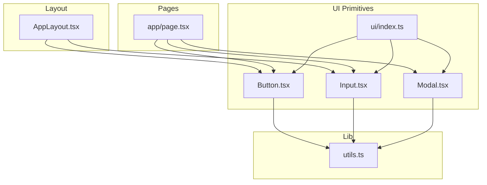
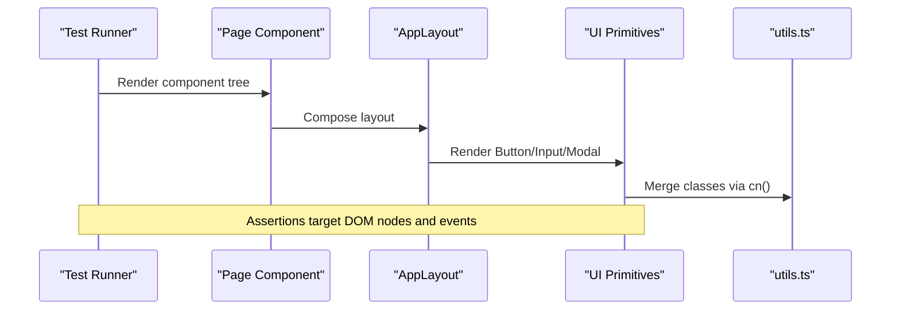
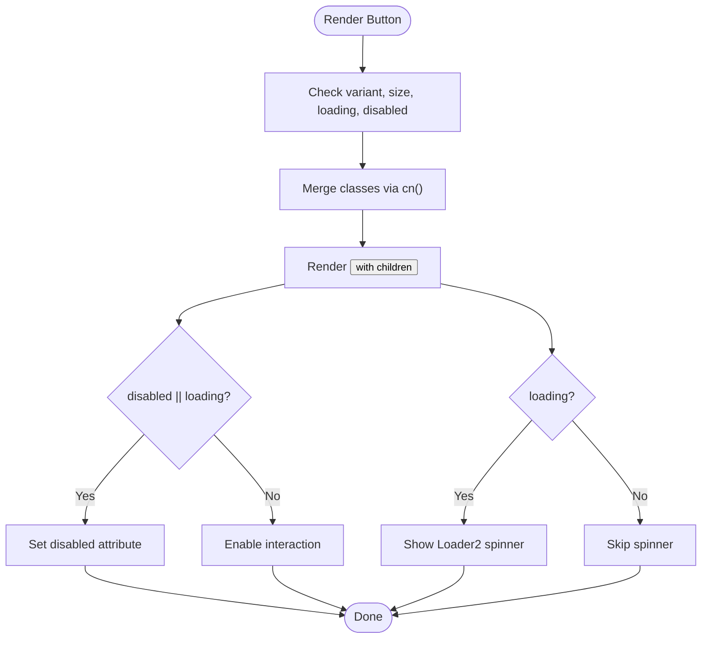
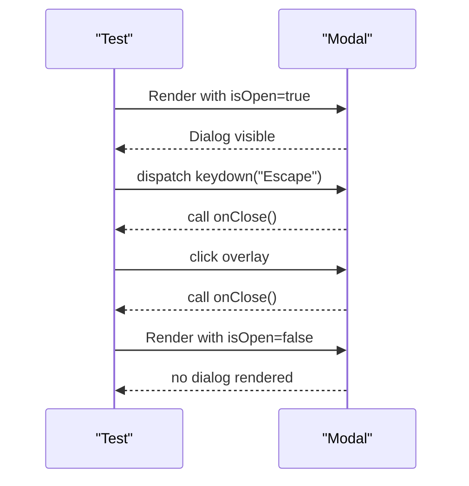
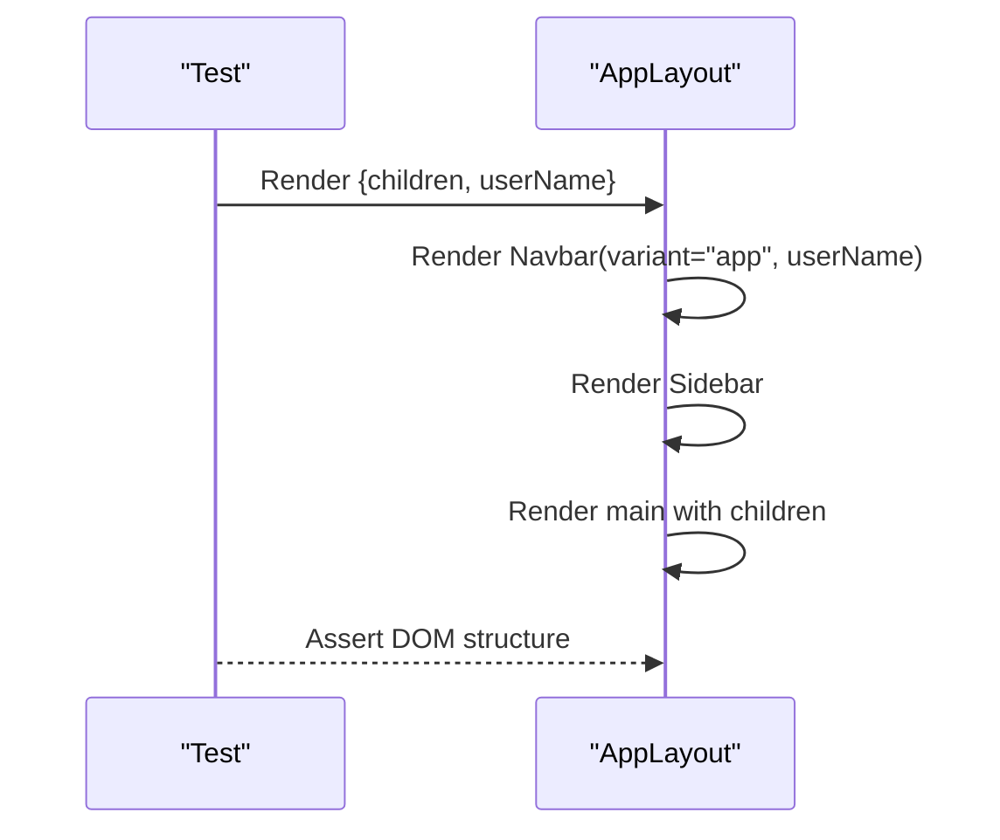

# Component Testing Strategies

<cite>
**Referenced Files in This Document**
- [package.json](file://package.json)
- [README.md](file://README.md)
- [Button.tsx](file://src/components/ui/Button.tsx)
- [Input.tsx](file://src/components/ui/Input.tsx)
- [Modal.tsx](file://src/components/ui/Modal.tsx)
- [AppLayout.tsx](file://src/components/layout/AppLayout.tsx)
- [index.ts](file://src/components/ui/index.ts)
- [utils.ts](file://src/lib/utils.ts)
- [page.tsx](file://src/app/page.tsx)
</cite>

## Table of Contents
1. Introduction
2. Project Structure
3. Core Components
4. Architecture Overview
5. Detailed Component Analysis
6. Dependency Analysis
7. Performance Considerations
8. Troubleshooting Guide
9. Conclusion
10. Appendices

## Introduction
This document provides comprehensive testing strategies for MedAce AI components using React Testing Library. It covers unit testing UI primitives and layout components, mocking external dependencies (Supabase, Gemini), simulating user interactions, validating props, handling stateful behavior, API calls, and side effects. It also includes guidelines for integration testing component compositions, end-to-end scenarios, performance testing considerations, debugging techniques, and best practices for test organization and maintenance as the codebase evolves.

## Project Structure
MedAce AI is a Next.js 15 application with React 19 and Tailwind CSS v4. The UI layer consists of reusable primitives under src/components/ui, layout components under src/components/layout, and page-level components under src/app. Utilities such as class merging and formatting helpers live in src/lib/utils.

**Diagram sources**
- [Button.tsx:1-59](file://src/components/ui/Button.tsx#L1-L59)
- [Input.tsx:1-53](file://src/components/ui/Input.tsx#L1-L53)
- [Modal.tsx:1-83](file://src/components/ui/Modal.tsx#L1-L83)
- [AppLayout.tsx:1-25](file://src/components/layout/AppLayout.tsx#L1-L25)
- [page.tsx:1-418](file://src/app/page.tsx#L1-L418)
- [index.ts:1-15](file://src/components/ui/index.ts#L1-L15)
- [utils.ts:1-34](file://src/lib/utils.ts#L1-L34)

**Section sources**
- [package.json:1-42](file://package.json#L1-L42)
- [README.md:23-78](file://README.md#L23-L78)

## Core Components
The core UI primitives are designed to be small, composable, and testable:
- Button: supports variants, sizes, loading state, disabled state, and forwards refs.
- Input: supports label, error message, left icon, and accessible id generation.
- Modal: manages open/close state via props, keyboard escape, backdrop click, and focus management.
- AppLayout: composes Navbar and Sidebar and renders children within a responsive shell.

Testing priorities:
- Verify rendered output based on props (variants, sizes, labels).
- Assert accessibility attributes (roles, aria-*).
- Simulate user interactions (clicks, keydown, input changes).
- Validate conditional rendering (loading spinner, error messages, modal visibility).
- Ensure event handlers are called with expected arguments.

**Section sources**
- [Button.tsx:10-58](file://src/components/ui/Button.tsx#L10-L58)
- [Input.tsx:4-52](file://src/components/ui/Input.tsx#L4-L52)
- [Modal.tsx:7-82](file://src/components/ui/Modal.tsx#L7-L82)
- [AppLayout.tsx:5-24](file://src/components/layout/AppLayout.tsx#L5-L24)

## Architecture Overview
At runtime, pages compose UI primitives and layout components. Utilities like cn() merge classes deterministically, enabling stable assertions on className. For data fetching and state, TanStack Query is used; for authentication and database operations, Supabase is integrated; for AI features, Google Gemini is invoked. Tests should isolate UI logic from these external services by mocking them at appropriate boundaries.

**Diagram sources**
- [page.tsx:1-418](file://src/app/page.tsx#L1-L418)
- [AppLayout.tsx:1-25](file://src/components/layout/AppLayout.tsx#L1-L25)
- [Button.tsx:1-59](file://src/components/ui/Button.tsx#L1-L59)
- [Input.tsx:1-53](file://src/components/ui/Input.tsx#L1-L53)
- [Modal.tsx:1-83](file://src/components/ui/Modal.tsx#L1-L83)
- [utils.ts:1-34](file://src/lib/utils.ts#L1-L34)

## Detailed Component Analysis

### Button Component Testing
Key behaviors to test:
- Renders correct variant and size classes.
- Disables when loading or disabled prop is true.
- Shows a spinner when loading is true.
- Forwards ref and spreads additional props.
- Calls onClick handler when clicked.

Recommended patterns:
- Use React Testing Library’s getByRole("button") to find the button.
- Assert className contains expected tokens for variant and size.
- Assert disabled attribute presence when loading/disabled.
- Assert spinner element visibility when loading.
- Fire click events and assert handler invocation.

**Diagram sources**
- [Button.tsx:16-58](file://src/components/ui/Button.tsx#L16-L58)
- [utils.ts:4-6](file://src/lib/utils.ts#L4-L6)

**Section sources**
- [Button.tsx:10-58](file://src/components/ui/Button.tsx#L10-L58)
- [utils.ts:1-34](file://src/lib/utils.ts#L1-L34)

### Input Component Testing
Key behaviors to test:
- Renders label and associates it with input via htmlFor/id.
- Displays error text when error prop is provided.
- Renders leftIcon when present.
- Applies error styles when error is set.
- Accepts and updates value through controlled props.

Recommended patterns:
- Find input by role="textbox" or by placeholder/id.
- Assert label text and htmlFor linkage.
- Assert error paragraph visibility and content.
- Simulate typing and assert onChange behavior if wrapped in a form.

```mermaid
flowchart TD
Start(["Render Input"]) --> Props["Read label, error, leftIcon, id"]
Props --> BuildId["Generate id if missing"]
BuildId --> RenderLabel{"label?"}
RenderLabel --> |Yes| Label["Render <label> with htmlFor"]
RenderLabel --> |No| SkipLabel["Skip label"]
Label --> RenderInput["Render <input> with classes"]
SkipLabel --> RenderInput
RenderInput --> Icon{"leftIcon?"}
Icon --> |Yes| ShowIcon["Render leftIcon wrapper"]
Icon --> |No| SkipIcon["Skip icon"]
RenderInput --> Error{"error?"}
Error --> |Yes| ShowError["Render error text + error styles"]
Error --> |No| SkipError["Skip error"]
ShowIcon --> End(["Done"])
SkipIcon --> End
ShowError --> End
SkipError --> End
```

**Diagram sources**
- [Input.tsx:10-52](file://src/components/ui/Input.tsx#L10-L52)

**Section sources**
- [Input.tsx:4-52](file://src/components/ui/Input.tsx#L4-L52)

### Modal Component Testing
Key behaviors to test:
- Renders nothing when isOpen is false.
- Renders overlay and dialog when isOpen is true.
- Closes on Escape key press.
- Closes when clicking the backdrop.
- Sets proper ARIA attributes (role="dialog", aria-modal, aria-label).

Recommended patterns:
- Render with isOpen true/false and assert presence/absence of dialog.
- Dispatch keydown events with key "Escape" and assert onClose called.
- Click the overlay and assert onClose called.
- Assert ARIA attributes for accessibility.

**Diagram sources**
- [Modal.tsx:16-82](file://src/components/ui/Modal.tsx#L16-L82)

**Section sources**
- [Modal.tsx:7-82](file://src/components/ui/Modal.tsx#L7-L82)

### AppLayout Integration Testing
Key behaviors to test:
- Renders Navbar with correct variant and userName.
- Renders Sidebar.
- Renders children inside main content area.

Recommended patterns:
- Render AppLayout with children and assert presence of Navbar, Sidebar, and main content.
- Assert that userName is passed down to Navbar if needed.

**Diagram sources**
- [AppLayout.tsx:10-24](file://src/components/layout/AppLayout.tsx#L10-L24)

**Section sources**
- [AppLayout.tsx:5-24](file://src/components/layout/AppLayout.tsx#L5-L24)

### Page-Level Composition Testing
The landing page composes multiple sections and UI primitives. Tests can assert:
- Presence of key sections (hero, problem, features, how-it-works, stats, CTA).
- Correct rendering of Buttons, Cards, Badges.
- Navigation links exist where expected.

Recommended patterns:
- Render HomePage and query for section headings or landmarks.
- Assert link hrefs for sign-up and other navigations.
- Mock any client-side hooks or providers if necessary.

**Section sources**
- [page.tsx:23-418](file://src/app/page.tsx#L23-L418)

## Dependency Analysis
External dependencies relevant to testing:
- Supabase (Auth, Database): mock client methods to avoid network calls.
- Google Gemini (AI generation): mock API calls to return deterministic responses.
- TanStack Query: use QueryClient provider and mock queries/mutations.
- React Hook Form: wrap forms in tests and simulate submissions.

Coupling and cohesion:
- UI primitives depend only on utils.ts for class merging, keeping them highly cohesive and easy to test.
- Pages and layouts compose primitives, reducing coupling to business logic.

Potential circular dependencies:
- None observed in UI layer; ensure mocks do not introduce cycles.

Integration points:
- API routes and server components should be isolated in integration tests using MSW or custom fetch mocks.

**Section sources**
- [package.json:11-27](file://package.json#L11-L27)
- [README.md:23-78](file://README.md#L23-L78)
- [utils.ts:1-34](file://src/lib/utils.ts#L1-L34)

## Performance Considerations
- Keep unit tests fast by avoiding real network calls; mock Supabase and Gemini.
- Use React Testing Library’s default render which batches updates; prefer minimal re-renders.
- Avoid heavy snapshots for frequently changing UI; prefer semantic assertions (queries by role/text).
- For large lists or complex pages, consider virtualization and test only visible slices.
- Measure test execution time and optimize slow tests by isolating expensive setup.

[No sources needed since this section provides general guidance]

## Troubleshooting Guide
Common issues and resolutions:
- Flaky modal close tests: ensure the document body exists and keydown listeners are attached; trigger events on the document.
- Class assertion failures: rely on semantic queries rather than exact className strings due to dynamic merging.
- Async state updates: wait for async updates using waitFor or screen.findBy* to avoid timing issues.
- Provider context errors: wrap components with necessary providers (e.g., QueryClientProvider, ToastProvider) in tests.
- Event handler not firing: verify event propagation and that the correct element is targeted.

Debugging techniques:
- Use console logs sparingly; prefer assertions to fail fast.
- Inspect rendered output with debug() to understand DOM structure.
- Isolate failing tests by rendering minimal trees to pinpoint issues.

**Section sources**
- [Modal.tsx:26-38](file://src/components/ui/Modal.tsx#L26-L38)
- [utils.ts:4-6](file://src/lib/utils.ts#L4-L6)

## Conclusion
Adopting robust testing strategies for MedAce AI components ensures reliability, accessibility, and maintainability. Focus on unit tests for UI primitives, integration tests for compositions, and end-to-end tests for critical user flows. Mock external dependencies, validate props and interactions, and follow consistent naming and organization practices to keep tests aligned with evolving components.

[No sources needed since this section summarizes without analyzing specific files]

## Appendices

### Unit Testing Patterns and Examples
- Props validation:
  - Button: assert variant and size classes; assert disabled when loading/disabled; assert spinner visibility.
  - Input: assert label association, error text, leftIcon presence.
  - Modal: assert dialog visibility based on isOpen; assert ARIA attributes.
- Event handlers:
  - Button: fire click and assert handler invocation.
  - Modal: dispatch keydown("Escape") and click overlay to assert onClose.
- Conditional rendering:
  - Input: show/hide error text based on error prop.
  - Button: show/hide spinner based on loading prop.
  - Modal: render/no-render based on isOpen.

**Section sources**
- [Button.tsx:10-58](file://src/components/ui/Button.tsx#L10-L58)
- [Input.tsx:4-52](file://src/components/ui/Input.tsx#L4-L52)
- [Modal.tsx:7-82](file://src/components/ui/Modal.tsx#L7-L82)

### Integration Testing Guidelines
- Compose pages with providers (QueryClient, Toast) and assert multi-component interactions.
- Mock API responses using MSW or fetch mocks; assert UI updates after data resolves.
- Validate navigation links and route transitions where applicable.

**Section sources**
- [page.tsx:23-418](file://src/app/page.tsx#L23-L418)
- [index.ts:1-15](file://src/components/ui/index.ts#L1-L15)

### End-to-End Testing Scenarios
- User signs up/logs in via Supabase Auth (mocked or test environment).
- Starts a practice session, answers MCQs, views results and explanations.
- Verifies weak-spot tracking and study plan generation flows.

[No sources needed since this section provides general guidance]

### Performance Testing Considerations
- Use lightweight mocks to avoid real network latency.
- Prefer functional assertions over snapshots for stability.
- Profile test suites to identify bottlenecks and optimize setup/teardown.

[No sources needed since this section provides general guidance]

### Best Practices for Test Organization and Maintenance
- Naming conventions:
  - Group tests by feature/component (e.g., Button.test.tsx, Modal.test.tsx).
  - Describe blocks reflect user-facing behavior (e.g., "renders loading spinner").
- File structure:
  - Co-locate tests near source files or group by feature folders.
  - Use shared fixtures and factories for complex data.
- Maintenance:
  - Update tests alongside component changes.
  - Refactor brittle selectors into semantic queries.
  - Regularly review and prune obsolete tests.

[No sources needed since this section provides general guidance]