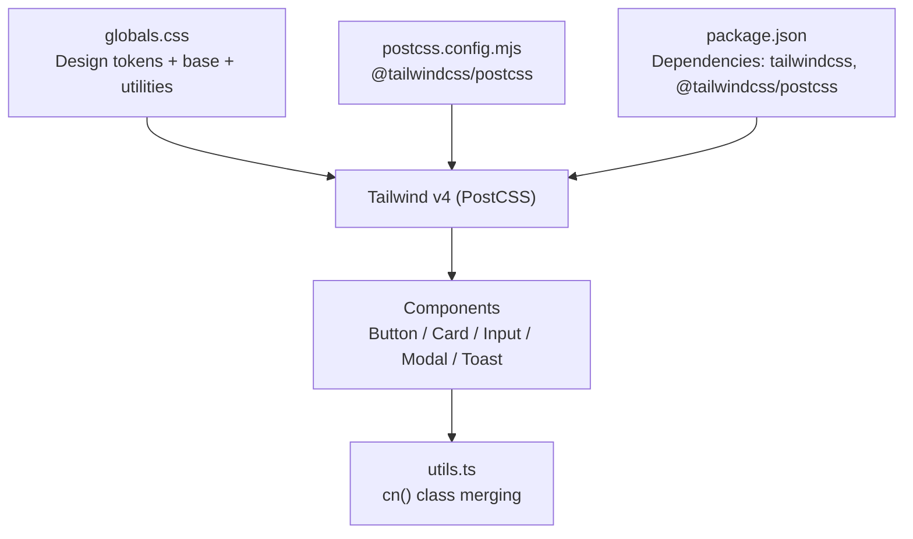
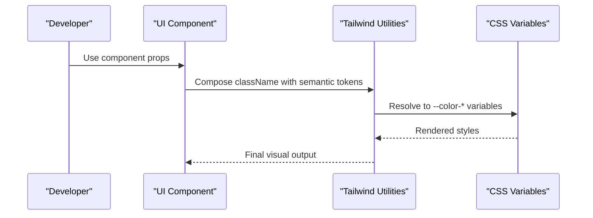
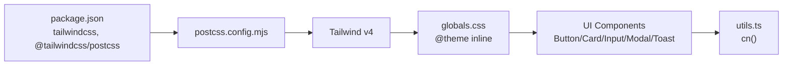

# Styling & Theming System

<cite>
**Referenced Files in This Document**
- [globals.css](file://src/app/globals.css)
- [postcss.config.mjs](file://postcss.config.mjs)
- [package.json](file://package.json)
- [Button.tsx](file://src/components/ui/Button.tsx)
- [Card.tsx](file://src/components/ui/Card.tsx)
- [Input.tsx](file://src/components/ui/Input.tsx)
- [Modal.tsx](file://src/components/ui/Modal.tsx)
- [Toast.tsx](file://src/components/ui/Toast.tsx)
- [utils.ts](file://src/lib/utils.ts)
</cite>

## Table of Contents
1. Introduction
2. Project Structure
3. Core Components
4. Architecture Overview
5. Detailed Component Analysis
6. Dependency Analysis
7. Performance Considerations
8. Troubleshooting Guide
9. Conclusion
10. Appendices

## Introduction
This document explains the styling and theming system used across MedAce AI components. It covers Tailwind CSS configuration, custom theme tokens, design token usage in UI components, responsive patterns, accessibility considerations, and guidelines for creating new themed components. It also documents how to implement dark mode support, manage color schemes, and maintain consistency using CSS-in-JS patterns and component-specific styling approaches.

## Project Structure
The styling system is centered around a global stylesheet that defines design tokens and base styles, with PostCSS configured to process Tailwind v4. UI components consume these tokens via Tailwind utility classes and semantic color names. A small utility module merges class names safely to avoid conflicts and enable dynamic styling.

**Diagram sources**
- [globals.css:1-36](file://src/app/globals.css#L1-L36)
- [postcss.config.mjs:1-9](file://postcss.config.mjs#L1-L9)
- [package.json:11-33](file://package.json#L11-L33)
- [utils.ts:1-6](file://src/lib/utils.ts#L1-L6)

**Section sources**
- [globals.css:1-181](file://src/app/globals.css#L1-L181)
- [postcss.config.mjs:1-9](file://postcss.config.mjs#L1-L9)
- [package.json:11-33](file://package.json#L11-L33)

## Core Components
The UI library exposes reusable primitives that consistently apply the design tokens:

- Button: Uses semantic colors (primary, surface, error), focus rings, and size variants.
- Card: Applies surface backgrounds, borders, and elevation options.
- Input: Leverages surface background, border states, focus ring, and error state styling.
- Modal: Uses surface background, borders, backdrop blur, and animations.
- Toast: Displays contextual messages with semantic borders and icons.

These components rely on Tailwind utilities mapped to CSS variables defined in the global stylesheet. The cn utility ensures deterministic class composition.

**Section sources**
- [Button.tsx:16-31](file://src/components/ui/Button.tsx#L16-L31)
- [Card.tsx:12-23](file://src/components/ui/Card.tsx#L12-L23)
- [Input.tsx:33-40](file://src/components/ui/Input.tsx#L33-L40)
- [Modal.tsx:54-58](file://src/components/ui/Modal.tsx#L54-L58)
- [Toast.tsx:63-70](file://src/components/ui/Toast.tsx#L63-L70)
- [utils.ts:1-6](file://src/lib/utils.ts#L1-L6)

## Architecture Overview
The theming architecture uses CSS custom properties as the single source of truth for colors, fonts, and surfaces. Tailwind v4 reads these variables through its inline theme mechanism, making them available as utilities like bg-primary or text-text. Components compose these utilities to achieve consistent visuals without hard-coded values.

**Diagram sources**
- [globals.css:7-36](file://src/app/globals.css#L7-L36)
- [Button.tsx:16-31](file://src/components/ui/Button.tsx#L16-L31)
- [Card.tsx:12-23](file://src/components/ui/Card.tsx#L12-L23)
- [Input.tsx:33-40](file://src/components/ui/Input.tsx#L33-L40)

## Detailed Component Analysis

### Design Tokens and Theme Configuration
- Token categories:
  - Backgrounds and surfaces: root background, card-like surfaces, hover states
  - Primary palette: main primary color plus light/dark variants
  - Accent palette: accent color and light variant for AI features
  - Semantic colors: success, error, warning, info
  - Text and borders: text, muted, border
  - Fonts: sans-serif stack and Urdu font stack
- Base layer applies default border color and body styles using tokens.
- Utility layer provides reusable classes such as gradient text, glass card, and animation helpers.

Guidelines:
- Always use semantic tokens (e.g., bg-surface, text-muted) instead of raw hex values.
- Extend tokens by adding new CSS variables under the same theme block.
- Keep animations and transitions minimal and consistent across components.

**Section sources**
- [globals.css:7-36](file://src/app/globals.css#L7-L36)
- [globals.css:71-114](file://src/app/globals.css#L71-L114)
- [globals.css:119-149](file://src/app/globals.css#L119-L149)

### Button Component
- Variants: primary, secondary, ghost, danger
- Sizes: sm, md, lg
- Focus and disabled states are standardized
- Uses semantic colors and borders from tokens

Implementation highlights:
- Variant and size maps define reusable class sets
- cn merges base, variant, size, and user-provided classes
- Loading state integrates an icon spinner

Accessibility notes:
- Focus ring uses token-based color for visibility
- Disabled state reduces opacity and pointer events

**Section sources**
- [Button.tsx:7-31](file://src/components/ui/Button.tsx#L7-L31)
- [Button.tsx:33-58](file://src/components/ui/Button.tsx#L33-L58)

### Card Component
- Variants: default, elevated, bordered
- Padding scale: none, sm, md, lg
- Consistent rounded corners and transition effects

Usage pattern:
- Combine variant and padding with optional className overrides
- Rely on surface and border tokens for consistent look

**Section sources**
- [Card.tsx:4-23](file://src/components/ui/Card.tsx#L4-L23)
- [Card.tsx:25-45](file://src/components/ui/Card.tsx#L25-L45)

### Input Component
- Supports label, left icon, and error message
- Focus ring uses primary token; error state switches to error token
- Padding adjusts when left icon is present

Accessibility notes:
- Label associates with input via htmlFor/id
- Error message is visually distinct using semantic color

**Section sources**
- [Input.tsx:4-8](file://src/components/ui/Input.tsx#L4-L8)
- [Input.tsx:10-48](file://src/components/ui/Input.tsx#L10-L48)

### Modal Component
- Backdrop with blur and fade animation
- Dialog container uses surface background and border tokens
- Keyboard handling for Escape key
- ARIA attributes for screen readers

Accessibility notes:
- role="dialog", aria-modal="true", aria-label for title
- Focus trap not implemented here; consider adding if needed

**Section sources**
- [Modal.tsx:7-23](file://src/components/ui/Modal.tsx#L7-L23)
- [Modal.tsx:26-38](file://src/components/ui/Modal.tsx#L26-L38)
- [Modal.tsx:42-79](file://src/components/ui/Modal.tsx#L42-L79)

### Toast Component
- Context-based toast API with provider
- Types: success, error, info with corresponding icons and borders
- Auto-dismiss after a fixed duration

Accessibility notes:
- Dismiss button includes aria-label
- Messages are readable by screen readers

**Section sources**
- [Toast.tsx:13-23](file://src/components/ui/Toast.tsx#L13-L23)
- [Toast.tsx:33-43](file://src/components/ui/Toast.tsx#L33-L43)
- [Toast.tsx:45-89](file://src/components/ui/Toast.tsx#L45-L89)

### Class Name Merging Utility
- Provides a safe way to merge multiple class inputs
- Prevents duplicate or conflicting Tailwind classes
- Enables dynamic styling based on props and state

**Section sources**
- [utils.ts:1-6](file://src/lib/utils.ts#L1-L6)

## Dependency Analysis
Styling dependencies flow from configuration to runtime:

**Diagram sources**
- [package.json:11-33](file://package.json#L11-L33)
- [postcss.config.mjs:1-9](file://postcss.config.mjs#L1-L9)
- [globals.css:1-36](file://src/app/globals.css#L1-L36)
- [utils.ts:1-6](file://src/lib/utils.ts#L1-L6)

**Section sources**
- [package.json:11-33](file://package.json#L11-L33)
- [postcss.config.mjs:1-9](file://postcss.config.mjs#L1-L9)
- [globals.css:1-36](file://src/app/globals.css#L1-L36)

## Performance Considerations
- Prefer semantic tokens over ad-hoc colors to reduce style duplication and improve caching.
- Keep component classNames minimal; leverage Tailwind’s utility composition.
- Avoid heavy per-component CSS; centralize shared styles in globals.css layers.
- Use animations sparingly; prefer subtle transitions for better performance.

[No sources needed since this section provides general guidance]

## Troubleshooting Guide
Common issues and resolutions:
- Tokens not applied: Ensure the global stylesheet is imported and Tailwind processes it via PostCSS.
- Conflicting classes: Use the cn utility to merge classes deterministically.
- Focus visibility: Verify focus ring colors contrast against backgrounds; adjust tokens if needed.
- Dark mode inconsistencies: If extending themes, ensure all related tokens (background, text, border) are updated together.

**Section sources**
- [globals.css:1-36](file://src/app/globals.css#L1-L36)
- [utils.ts:1-6](file://src/lib/utils.ts#L1-L6)

## Conclusion
MedAce AI’s styling system centers on a cohesive set of design tokens exposed via Tailwind v4’s inline theme. Components consistently apply these tokens through utility classes, ensuring visual harmony and ease of maintenance. By following the guidelines in this document—using semantic tokens, leveraging the cn utility, and adhering to accessibility best practices—you can extend the system confidently and keep the application’s design consistent.

[No sources needed since this section summarizes without analyzing specific files]

## Appendices

### How to Create a New Themed Component
Steps:
- Define props for variant and size if applicable.
- Map variants and sizes to class strings using semantic tokens.
- Compose classes with cn to merge base, variant, size, and user overrides.
- Apply focus and disabled states using tokens for consistency.
- Add ARIA attributes where appropriate (e.g., role, aria-label).

Example references:
- Variant mapping pattern: [Button.tsx:16-31](file://src/components/ui/Button.tsx#L16-L31)
- Class composition: [Button.tsx:33-58](file://src/components/ui/Button.tsx#L33-L58)

**Section sources**
- [Button.tsx:16-58](file://src/components/ui/Button.tsx#L16-L58)

### Managing Color Schemes and Extending Tokens
- Add new tokens under the theme block in the global stylesheet.
- Reference tokens via Tailwind utilities (e.g., bg-new-token, text-new-token).
- Update semantic mappings in components to use new tokens consistently.

References:
- Theme block: [globals.css:7-36](file://src/app/globals.css#L7-L36)

**Section sources**
- [globals.css:7-36](file://src/app/globals.css#L7-L36)

### Implementing Dark Mode Support
Current setup:
- The project defines a dark-themed palette via CSS variables.
- Components consume semantic tokens, which inherently reflect the dark theme.

To add alternative themes:
- Create additional theme blocks or media queries to swap variable values.
- Ensure all semantic tokens have matching values for each theme.
- Test contrast and accessibility across themes.

References:
- Global tokens and base styles: [globals.css:7-114](file://src/app/globals.css#L7-L114)

**Section sources**
- [globals.css:7-114](file://src/app/globals.css#L7-L114)

### Responsive Design Guidelines
- Use Tailwind’s responsive prefixes to adapt spacing, typography, and layout.
- Keep token values consistent across breakpoints; adjust only layout-related utilities.
- Validate readability and touch targets at smaller screen sizes.

[No sources needed since this section provides general guidance]

### Accessibility Standards
- Ensure sufficient color contrast between text and backgrounds.
- Provide visible focus indicators using tokens.
- Include ARIA roles and labels for interactive elements (e.g., modal dialog, dismiss buttons).
- Associate labels with form controls via htmlFor/id.

References:
- Modal ARIA attributes: [Modal.tsx:54-79](file://src/components/ui/Modal.tsx#L54-L79)
- Input label association: [Input.tsx:16-23](file://src/components/ui/Input.tsx#L16-L23)
- Toast dismiss accessibility: [Toast.tsx:74-80](file://src/components/ui/Toast.tsx#L74-L80)

**Section sources**
- [Modal.tsx:54-79](file://src/components/ui/Modal.tsx#L54-L79)
- [Input.tsx:16-23](file://src/components/ui/Input.tsx#L16-L23)
- [Toast.tsx:74-80](file://src/components/ui/Toast.tsx#L74-L80)

### CSS-in-JS Patterns and Global Overrides
- Pattern: Use cn to merge static and dynamic classes within components.
- Global overrides: Centralize shared styles in globals.css layers (base, utilities).
- Animations: Define once in the utilities layer and reuse via classes.

References:
- cn utility: [utils.ts:1-6](file://src/lib/utils.ts#L1-L6)
- Utilities layer: [globals.css:119-149](file://src/app/globals.css#L119-L149)

**Section sources**
- [utils.ts:1-6](file://src/lib/utils.ts#L1-L6)
- [globals.css:119-149](file://src/app/globals.css#L119-L149)

### Example: Extending an Existing Component with Custom Themes
Approach:
- Add new variant entries in the component’s variant map using semantic tokens.
- Optionally introduce a prop to switch themes or palettes.
- Ensure focus and disabled states remain accessible.

References:
- Variant maps: [Button.tsx:16-31](file://src/components/ui/Button.tsx#L16-L31)
- Token definitions: [globals.css:7-36](file://src/app/globals.css#L7-L36)

**Section sources**
- [Button.tsx:16-31](file://src/components/ui/Button.tsx#L16-L31)
- [globals.css:7-36](file://src/app/globals.css#L7-L36)