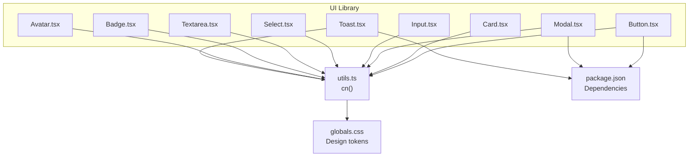
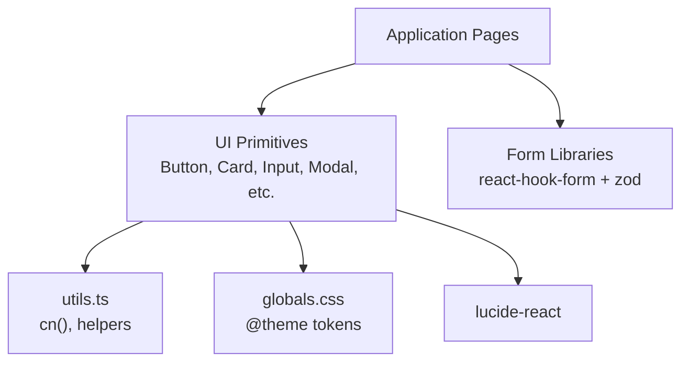
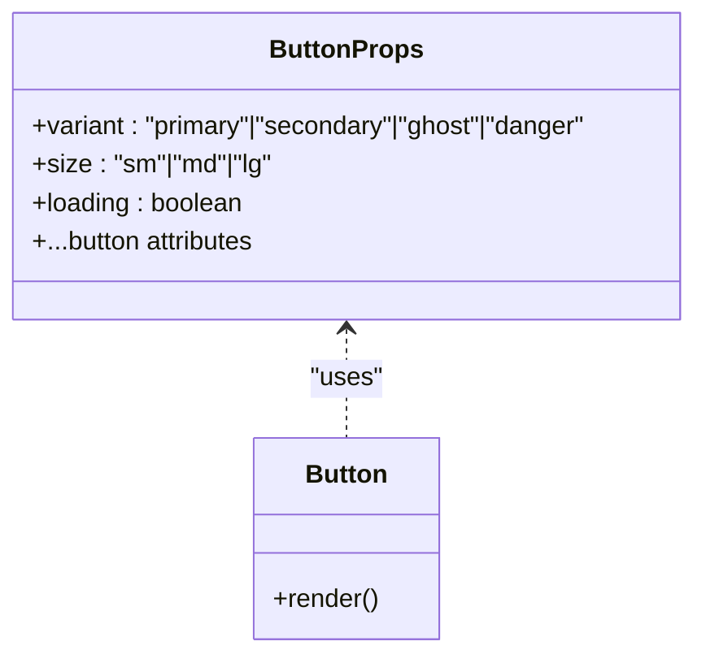
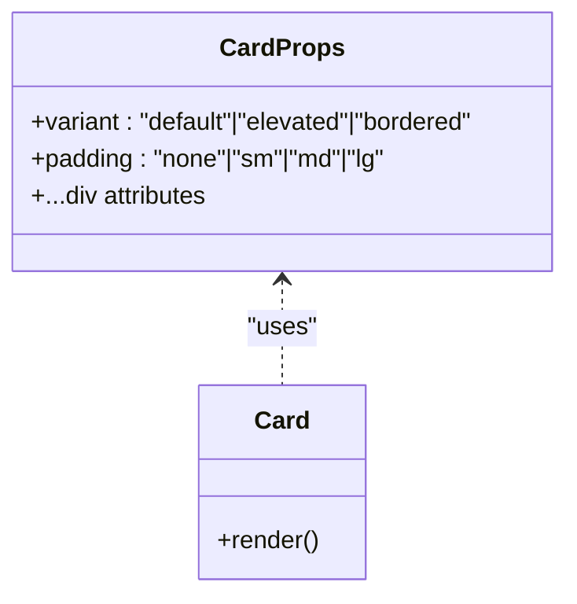
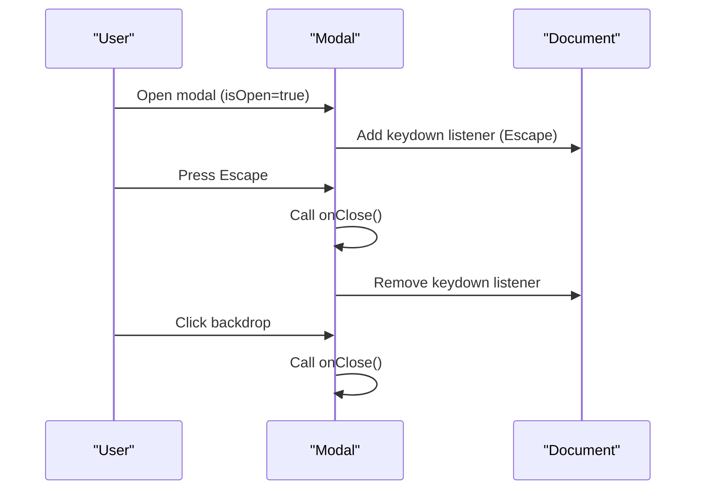
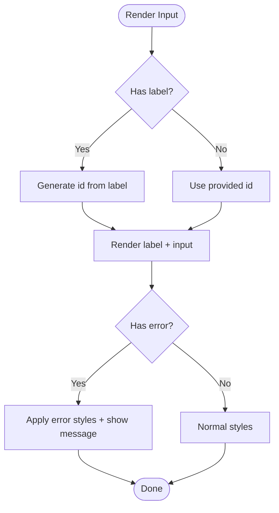
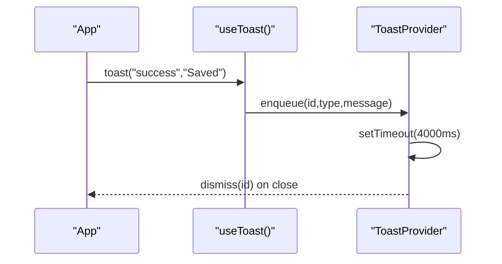
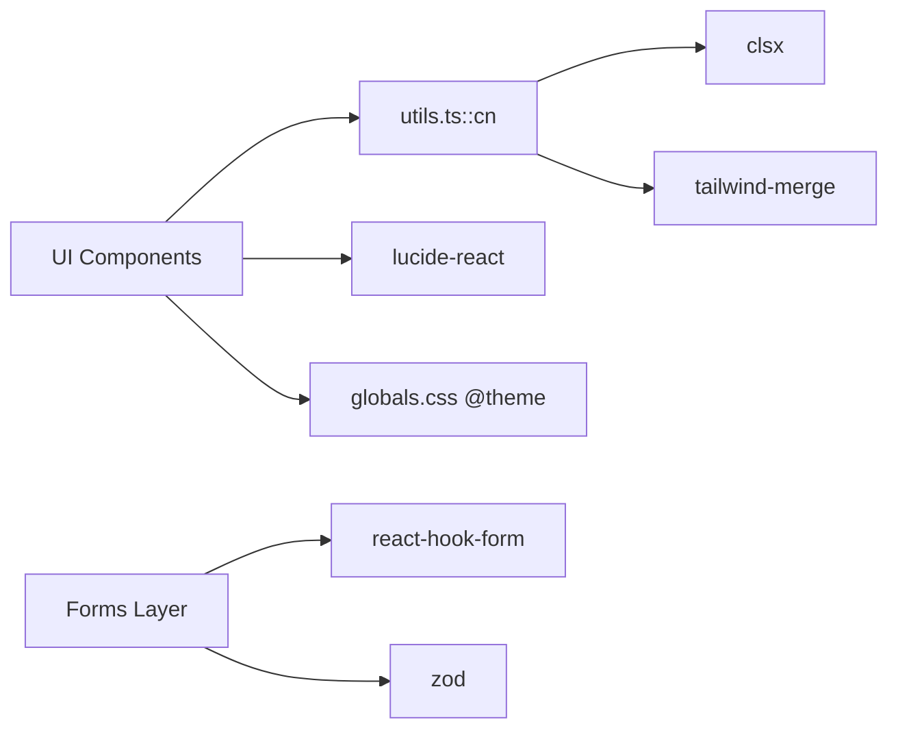

# UI Component Development

<cite>
**Referenced Files in This Document**
- [Button.tsx](file://src/components/ui/Button.tsx)
- [Card.tsx](file://src/components/ui/Card.tsx)
- [Modal.tsx](file://src/components/ui/Modal.tsx)
- [Input.tsx](file://src/components/ui/Input.tsx)
- [Select.tsx](file://src/components/ui/Select.tsx)
- [Textarea.tsx](file://src/components/ui/Textarea.tsx)
- [Badge.tsx](file://src/components/ui/Badge.tsx)
- [Avatar.tsx](file://src/components/ui/Avatar.tsx)
- [Toast.tsx](file://src/components/ui/Toast.tsx)
- [index.ts](file://src/components/ui/index.ts)
- [utils.ts](file://src/lib/utils.ts)
- [globals.css](file://src/app/globals.css)
- [package.json](file://package.json)
</cite>

## Table of Contents
1. [Introduction](#introduction)
2. [Project Structure](#project-structure)
3. [Core Components](#core-components)
4. [Architecture Overview](#architecture-overview)
5. [Detailed Component Analysis](#detailed-component-analysis)
6. [Dependency Analysis](#dependency-analysis)
7. [Performance Considerations](#performance-considerations)
8. [Troubleshooting Guide](#troubleshooting-guide)
9. [Conclusion](#conclusion)
10. [Appendices](#appendices)

## Introduction
This document explains how to create reusable UI components that follow MedAce AI’s established patterns. It covers component structure, TypeScript interfaces and props, styling with Tailwind CSS v4, responsive design, accessibility requirements, controlled/uncontrolled patterns, form integration, and performance techniques such as memoization and lazy loading. The guidance is grounded in the existing primitives: Button, Card, Modal, Input, Select, Textarea, Badge, Avatar, and Toast.

## Project Structure
The UI library lives under src/components/ui and is re-exported via a barrel file. Each primitive is a single-file React component with:
- A typed props interface extending native HTML attributes where appropriate
- Variant and size enums for consistent theming
- A class composition helper (cn) for conflict-free Tailwind merging
- Optional client-side behavior using "use client" when needed

**Diagram sources**
- [Button.tsx:1-59](file://src/components/ui/Button.tsx#L1-L59)
- [Card.tsx:1-46](file://src/components/ui/Card.tsx#L1-L46)
- [Modal.tsx:1-83](file://src/components/ui/Modal.tsx#L1-L83)
- [Input.tsx:1-53](file://src/components/ui/Input.tsx#L1-L53)
- [Select.tsx:1-63](file://src/components/ui/Select.tsx#L1-L63)
- [Textarea.tsx:1-44](file://src/components/ui/Textarea.tsx#L1-L44)
- [Badge.tsx:1-35](file://src/components/ui/Badge.tsx#L1-L35)
- [Avatar.tsx:1-57](file://src/components/ui/Avatar.tsx#L1-L57)
- [Toast.tsx:1-89](file://src/components/ui/Toast.tsx#L1-L89)
- [utils.ts:1-34](file://src/lib/utils.ts#L1-L34)
- [globals.css:1-181](file://src/app/globals.css#L1-L181)
- [package.json:1-42](file://package.json#L1-L42)

**Section sources**
- [index.ts:1-15](file://src/components/ui/index.ts#L1-L15)
- [utils.ts:1-34](file://src/lib/utils.ts#L1-L34)
- [globals.css:1-181](file://src/app/globals.css#L1-L181)
- [package.json:1-42](file://package.json#L1-L42)

## Core Components
This section summarizes the core primitives and their shared patterns.

- Shared styling approach
  - All components use cn from utils.ts to merge base classes, variant classes, and user-provided className without conflicts.
  - Design tokens are defined inline via Tailwind v4 @theme in globals.css and referenced through semantic color names (e.g., bg-surface, text-text, border-border).

- Props and typing
  - Components extend native HTML attributes where applicable (e.g., ButtonHTMLAttributes, InputHTMLAttributes) to preserve full type safety and IDE support.
  - Variants and sizes are modeled as string literal unions for compile-time safety.

- Accessibility
  - Inputs and Textareas include label associations via htmlFor and auto-generated ids when none provided.
  - Modal sets role="dialog", aria-modal="true", and an accessible title via aria-label.
  - Buttons and interactive elements expose focus rings and disabled states consistently.

- Client vs server
  - Components that manage DOM events or side effects (e.g., Modal, Toast) are marked "use client".
  - Presentational components (e.g., Button, Card, Badge) remain server-compatible unless they need client features.

**Section sources**
- [Button.tsx:1-59](file://src/components/ui/Button.tsx#L1-L59)
- [Card.tsx:1-46](file://src/components/ui/Card.tsx#L1-L46)
- [Modal.tsx:1-83](file://src/components/ui/Modal.tsx#L1-L83)
- [Input.tsx:1-53](file://src/components/ui/Input.tsx#L1-L53)
- [Select.tsx:1-63](file://src/components/ui/Select.tsx#L1-L63)
- [Textarea.tsx:1-44](file://src/components/ui/Textarea.tsx#L1-L44)
- [Badge.tsx:1-35](file://src/components/ui/Badge.tsx#L1-L35)
- [Avatar.tsx:1-57](file://src/components/ui/Avatar.tsx#L1-L57)
- [Toast.tsx:1-89](file://src/components/ui/Toast.tsx#L1-L89)
- [utils.ts:1-34](file://src/lib/utils.ts#L1-L34)
- [globals.css:1-181](file://src/app/globals.css#L1-L181)

## Architecture Overview
The UI layer composes small, focused primitives into higher-level screens. Styling is centralized via Tailwind v4 tokens and utilities; interactivity is encapsulated per component. Global state (e.g., Toast) uses React Context.

**Diagram sources**
- [Button.tsx:1-59](file://src/components/ui/Button.tsx#L1-L59)
- [Modal.tsx:1-83](file://src/components/ui/Modal.tsx#L1-L83)
- [Input.tsx:1-53](file://src/components/ui/Input.tsx#L1-L53)
- [utils.ts:1-34](file://src/lib/utils.ts#L1-L34)
- [globals.css:1-181](file://src/app/globals.css#L1-L181)
- [package.json:1-42](file://package.json#L1-L42)

## Detailed Component Analysis

### Button
- Purpose: Primary action button with variants, sizes, and loading state.
- Props:
  - variant: "primary" | "secondary" | "ghost" | "danger"
  - size: "sm" | "md" | "lg"
  - loading: boolean
  - Extends all standard button attributes
- Styling:
  - Base classes provide layout, transitions, focus ring, and disabled state
  - Variant and size maps compose additional classes via cn
- Accessibility:
  - Focus ring and disabled state ensure keyboard usability
  - Loading state disables interaction and shows spinner
- Performance:
  - Lightweight presentational component; no memoization required by default

**Diagram sources**
- [Button.tsx:7-14](file://src/components/ui/Button.tsx#L7-L14)
- [Button.tsx:16-31](file://src/components/ui/Button.tsx#L16-L31)
- [Button.tsx:33-58](file://src/components/ui/Button.tsx#L33-L58)

**Section sources**
- [Button.tsx:1-59](file://src/components/ui/Button.tsx#L1-L59)

### Card
- Purpose: Content container with visual variants and padding options.
- Props:
  - variant: "default" | "elevated" | "bordered"
  - padding: "none" | "sm" | "md" | "lg"
  - Extends div attributes
- Styling:
  - Uses semantic colors and borders from tokens
  - Padding maps to spacing utilities
- Accessibility:
  - Semantic div usage; add roles like role="region" at the application level if needed

**Diagram sources**
- [Card.tsx:4-10](file://src/components/ui/Card.tsx#L4-L10)
- [Card.tsx:12-23](file://src/components/ui/Card.tsx#L12-L23)
- [Card.tsx:25-45](file://src/components/ui/Card.tsx#L25-L45)

**Section sources**
- [Card.tsx:1-46](file://src/components/ui/Card.tsx#L1-L46)

### Modal
- Purpose: Accessible dialog overlay with keyboard handling and backdrop click-to-close.
- Props:
  - isOpen: boolean
  - onClose: () => void
  - title?: string
  - children: ReactNode
  - className?: string
  - maxWidth?: string
- Behavior:
  - Esc key closes modal
  - Prevents body scroll while open
  - Backdrop click closes modal
- Accessibility:
  - role="dialog", aria-modal="true", aria-label set from title
  - Close button has aria-label
- Styling:
  - Fixed overlay with backdrop blur and slide-up animation
  - Uses tokens for surface, border, and text colors

**Diagram sources**
- [Modal.tsx:16-38](file://src/components/ui/Modal.tsx#L16-L38)
- [Modal.tsx:42-79](file://src/components/ui/Modal.tsx#L42-L79)

**Section sources**
- [Modal.tsx:1-83](file://src/components/ui/Modal.tsx#L1-L83)

### Input
- Purpose: Form input with label, optional left icon, and error display.
- Props:
  - label?: string
  - error?: string
  - leftIcon?: ReactNode
  - Extends input attributes
- Behavior:
  - Auto-generates id from label if not provided
  - Applies error styles and message when error is present
- Accessibility:
  - Label linked via htmlFor
  - Error text provides context for assistive technologies
- Styling:
  - Focus ring and border changes on focus/error
  - Left icon indents content appropriately

**Diagram sources**
- [Input.tsx:10-48](file://src/components/ui/Input.tsx#L10-L48)

**Section sources**
- [Input.tsx:1-53](file://src/components/ui/Input.tsx#L1-L53)

### Select
- Purpose: Styled select dropdown with options and placeholder.
- Props:
  - options: array of { value, label }
  - placeholder?: string
  - label?: string
  - error?: string
  - Extends select attributes
- Behavior:
  - Renders placeholder option when provided
  - Maps options to <option> elements
- Accessibility:
  - Label association via htmlFor/id
  - Error message for validation feedback
- Styling:
  - Custom chevron background and focus states
  - Error styling consistent with Input

**Section sources**
- [Select.tsx:1-63](file://src/components/ui/Select.tsx#L1-L63)

### Textarea
- Purpose: Multi-line text input with label and error display.
- Props:
  - label?: string
  - error?: string
  - Extends textarea attributes
- Behavior:
  - Auto-generates id from label if not provided
  - Shows error message and applies error styles
- Accessibility:
  - Label association via htmlFor/id
  - Error message for assistive tech
- Styling:
  - Consistent focus and border states with Input

**Section sources**
- [Textarea.tsx:1-44](file://src/components/ui/Textarea.tsx#L1-L44)

### Badge
- Purpose: Small status or category indicator with semantic variants.
- Props:
  - variant: "default" | "success" | "error" | "warning" | "info" | "ai"
  - Extends span attributes
- Styling:
  - Semantic color backgrounds and text via tokens

**Section sources**
- [Badge.tsx:1-35](file://src/components/ui/Badge.tsx#L1-L35)

### Avatar
- Purpose: User avatar with image fallback to initials.
- Props:
  - src?: string | null
  - name: string
  - size: "sm" | "md" | "lg"
  - className?: string
- Behavior:
  - Computes initials from name
  - Renders img when src provided; otherwise renders initials block
- Accessibility:
  - alt text for images
  - aria-label for initials fallback

**Section sources**
- [Avatar.tsx:1-57](file://src/components/ui/Avatar.tsx#L1-L57)

### Toast
- Purpose: Global notification system with types and auto-dismiss.
- Props:
  - Provider wraps app to supply toast function
  - useToast hook returns toast(type, message)
- Behavior:
  - Adds toast to queue with unique id
  - Auto-dismiss after timeout
  - Dismissible via close button
- Accessibility:
  - Dismiss button has aria-label
- Styling:
  - Type-specific icons and border colors
  - Slide-up animation

**Diagram sources**
- [Toast.tsx:27-31](file://src/components/ui/Toast.tsx#L27-L31)
- [Toast.tsx:45-58](file://src/components/ui/Toast.tsx#L45-L58)
- [Toast.tsx:60-85](file://src/components/ui/Toast.tsx#L60-L85)

**Section sources**
- [Toast.tsx:1-89](file://src/components/ui/Toast.tsx#L1-L89)

## Dependency Analysis
- Internal dependencies
  - All UI components depend on cn from utils.ts for class merging
  - Visual tokens come from globals.css @theme definitions
- External dependencies
  - lucide-react for icons used across components
  - react-hook-form and zod are available for form integration at the application layer
  - clsx and tailwind-merge power the cn utility

**Diagram sources**
- [utils.ts:1-6](file://src/lib/utils.ts#L1-L6)
- [globals.css:1-36](file://src/app/globals.css#L1-L36)
- [package.json:11-27](file://package.json#L11-L27)

**Section sources**
- [utils.ts:1-34](file://src/lib/utils.ts#L1-L34)
- [package.json:1-42](file://package.json#L1-L42)

## Performance Considerations
- Memoization
  - For heavy components, wrap with React.memo to prevent unnecessary re-renders when props are stable
  - For event handlers passed to primitives, use useCallback to keep referential stability
- Lazy loading
  - Defer non-critical UI (e.g., complex modals or charts) with dynamic imports or Suspense boundaries
- Rendering efficiency
  - Keep variant and size maps static (already done in primitives)
  - Avoid creating objects/arrays inside render; hoist to module scope or useMemo
- Class merging
  - Rely on cn to avoid redundant style recalculations and ensure deterministic output
- Bundle size
  - Prefer tree-shakeable icons (lucide-react) and only import what you use

[No sources needed since this section provides general guidance]

## Troubleshooting Guide
- Modal does not close on Escape
  - Ensure the component is mounted in a client component ("use client") and that the effect attaches/removes listeners correctly
- Input label not associated
  - Verify that id is either provided or generated from label; confirm htmlFor matches the input id
- Styles not applying
  - Confirm Tailwind v4 tokens are present in globals.css and that cn is used to merge classes
  - Check for conflicting className overrides
- Toast not visible
  - Ensure ToastProvider wraps the app tree and that useToast is called within its context
- Form validation errors not showing
  - Pass error prop to Input/Select/Textarea; ensure the field’s value is bound to your form state

**Section sources**
- [Modal.tsx:26-38](file://src/components/ui/Modal.tsx#L26-L38)
- [Input.tsx:10-48](file://src/components/ui/Input.tsx#L10-L48)
- [Select.tsx:16-56](file://src/components/ui/Select.tsx#L16-L56)
- [Textarea.tsx:9-37](file://src/components/ui/Textarea.tsx#L9-L37)
- [Toast.tsx:27-31](file://src/components/ui/Toast.tsx#L27-L31)
- [globals.css:1-36](file://src/app/globals.css#L1-L36)

## Conclusion
MedAce AI’s UI primitives follow a consistent, type-safe, and accessible pattern built on Tailwind v4 tokens and a robust class-composition utility. By adhering to these patterns—typed props, variant maps, semantic styling, and careful accessibility—you can create new components that integrate seamlessly with the existing system. Use the step-by-step guide below to build new primitives that match the codebase’s standards.

[No sources needed since this section summarizes without analyzing specific files]

## Appendices

### Step-by-Step: Creating a New UI Component
1. Define the component file
   - Place it in src/components/ui with a descriptive name (e.g., MyComponent.tsx)
2. Declare TypeScript interfaces
   - Extend native HTML attributes when applicable
   - Model variants/sizes as string literal unions
3. Implement styling
   - Use cn to merge base, variant, and user className
   - Reference semantic tokens from globals.css
4. Handle interactions
   - If managing DOM events or side effects, mark the file "use client"
   - Provide refs via forwardRef when necessary
5. Ensure accessibility
   - Add labels, roles, and aria attributes as needed
   - Provide focus states and keyboard support
6. Export via barrel
   - Add export to src/components/ui/index.ts
7. Test
   - Verify rendering, variants, sizes, and edge cases
   - Validate accessibility with keyboard and screen readers

**Section sources**
- [Button.tsx:1-59](file://src/components/ui/Button.tsx#L1-L59)
- [Card.tsx:1-46](file://src/components/ui/Card.tsx#L1-L46)
- [index.ts:1-15](file://src/components/ui/index.ts#L1-L15)

### Controlled vs Uncontrolled Patterns
- Controlled inputs
  - Bind value and onChange to parent state; pass ref via forwardRef if needed
  - Example: Input, Select, Textarea accept standard value/onChange attributes
- Uncontrolled inputs
  - Use defaultValue and let the browser manage state; access via ref when needed
- Modals
  - Controlled by isOpen and onClose; parent manages visibility state

**Section sources**
- [Input.tsx:1-53](file://src/components/ui/Input.tsx#L1-L53)
- [Select.tsx:1-63](file://src/components/ui/Select.tsx#L1-L63)
- [Textarea.tsx:1-44](file://src/components/ui/Textarea.tsx#L1-L44)
- [Modal.tsx:1-83](file://src/components/ui/Modal.tsx#L1-L83)

### Integration with Form Libraries
- React Hook Form
  - Register fields using register or Controller
  - Pass error messages to Input/Select/Textarea via error prop
  - Use zod resolver for schema validation
- Validation flow
  - On submit, validate with zod and display errors via component props

**Section sources**
- [Input.tsx:1-53](file://src/components/ui/Input.tsx#L1-L53)
- [Select.tsx:1-63](file://src/components/ui/Select.tsx#L1-L63)
- [Textarea.tsx:1-44](file://src/components/ui/Textarea.tsx#L1-L44)
- [package.json:11-27](file://package.json#L11-L27)

### Styling and Responsive Design
- Design tokens
  - Colors, fonts, and surfaces are defined in globals.css @theme
- Utilities
  - Use Tailwind spacing, typography, and layout utilities
  - Leverage cn for safe class composition
- Animations
  - Reuse global animations (fade-in, slide-up/down) for consistent motion

**Section sources**
- [globals.css:1-181](file://src/app/globals.css#L1-L181)
- [utils.ts:1-6](file://src/lib/utils.ts#L1-L6)

### Accessibility Checklist
- Keyboard navigation and focus management
- ARIA roles and labels for dialogs and controls
- Color contrast using semantic tokens
- Error messaging for form fields
- Screen reader-friendly alternatives for icons/images

**Section sources**
- [Modal.tsx:54-73](file://src/components/ui/Modal.tsx#L54-L73)
- [Input.tsx:14-46](file://src/components/ui/Input.tsx#L14-L46)
- [Avatar.tsx:28-52](file://src/components/ui/Avatar.tsx#L28-L52)