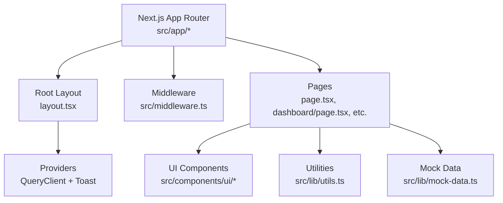
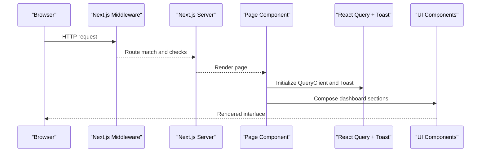
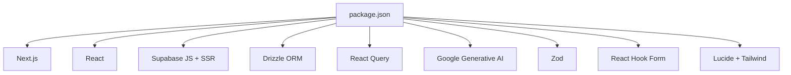

# Debugging & Performance Optimization

<cite>
**Referenced Files in This Document**
- [package.json](file://package.json)
- [next.config.ts](file://next.config.ts)
- [src/middleware.ts](file://src/middleware.ts)
- [src/app/layout.tsx](file://src/app/layout.tsx)
- [src/components/Providers.tsx](file://src/components/Providers.tsx)
- [src/app/page.tsx](file://src/app/page.tsx)
- [src/app/dashboard/page.tsx](file://src/app/dashboard/page.tsx)
- [src/components/layout/AppLayout.tsx](file://src/components/layout/AppLayout.tsx)
- [src/lib/utils.ts](file://src/lib/utils.ts)
- [src/lib/mock-data.ts](file://src/lib/mock-data.ts)
- [src/components/ui/index.ts](file://src/components/ui/index.ts)
- [README.md](file://README.md)
</cite>

## Table of Contents
1. Introduction
2. Project Structure
3. Core Components
4. Architecture Overview
5. Detailed Component Analysis
6. Dependency Analysis
7. Performance Considerations
8. Troubleshooting Guide
9. Conclusion
10. Appendices

## Introduction
This guide provides a comprehensive debugging and performance optimization strategy for MedAce AI, a Next.js application with React components, Supabase integration, Drizzle ORM, and Google Gemini AI. It covers:
- Browser developer tools and React DevTools usage
- Next.js debugging features
- Performance profiling, bundle analysis, and bottleneck identification
- Optimization strategies: code splitting, lazy loading, image optimization, database query optimization
- Middleware debugging, API request tracing, error tracking setup
- Production monitoring, logging, and user experience metrics
- Common performance issues specific to this architecture and their solutions

## Project Structure
MedAce AI follows a Next.js App Router structure with client-side providers and UI components. Key areas include:
- Application layout and metadata configuration
- Global providers (React Query, Toast)
- Middleware for route protection
- Pages for landing, dashboard, practice, results, profile, study plan
- Shared UI components and utilities
- Mock data and types for development

**Diagram sources**
- [src/app/layout.tsx:1-57](file://src/app/layout.tsx#L1-L57)
- [src/components/Providers.tsx:1-23](file://src/components/Providers.tsx#L1-L23)
- [src/middleware.ts:1-41](file://src/middleware.ts#L1-L41)
- [src/app/page.tsx:1-418](file://src/app/page.tsx#L1-L418)
- [src/app/dashboard/page.tsx:1-239](file://src/app/dashboard/page.tsx#L1-L239)
- [src/components/ui/index.ts:1-15](file://src/components/ui/index.ts#L1-L15)
- [src/lib/utils.ts:1-34](file://src/lib/utils.ts#L1-L34)
- [src/lib/mock-data.ts:1-313](file://src/lib/mock-data.ts#L1-L313)

**Section sources**
- [src/app/layout.tsx:1-57](file://src/app/layout.tsx#L1-L57)
- [src/components/Providers.tsx:1-23](file://src/components/Providers.tsx#L1-L23)
- [src/middleware.ts:1-41](file://src/middleware.ts#L1-L41)
- [src/app/page.tsx:1-418](file://src/app/page.tsx#L1-L418)
- [src/app/dashboard/page.tsx:1-239](file://src/app/dashboard/page.tsx#L1-L239)
- [src/components/ui/index.ts:1-15](file://src/components/ui/index.ts#L1-L15)
- [src/lib/utils.ts:1-34](file://src/lib/utils.ts#L1-L34)
- [src/lib/mock-data.ts:1-313](file://src/lib/mock-data.ts#L1-L313)

## Core Components
- Root layout sets global fonts, metadata, and wraps content with Providers.
- Providers initialize React Query with default options and wrap the app with ToastProvider.
- Middleware defines protected routes and prepares for authentication checks.
- Dashboard page uses mock data and utility functions to display stats and weak topics.
- UI components are centralized and exported via an index file for consistent usage.

Key implementation references:
- Providers configure React Query with staleTime and retry settings.
- Middleware matcher excludes static assets and API routes from processing.
- Dashboard composes multiple UI components and displays progress indicators.

**Section sources**
- [src/app/layout.tsx:1-57](file://src/app/layout.tsx#L1-L57)
- [src/components/Providers.tsx:1-23](file://src/components/Providers.tsx#L1-L23)
- [src/middleware.ts:1-41](file://src/middleware.ts#L1-L41)
- [src/app/dashboard/page.tsx:1-239](file://src/app/dashboard/page.tsx#L1-L239)
- [src/components/ui/index.ts:1-15](file://src/components/ui/index.ts#L1-L15)

## Architecture Overview
The application uses Next.js App Router with server-rendered pages and client-side interactivity. The flow includes:
- Request enters middleware for route protection
- Next.js renders the appropriate page component
- Client-side providers manage state and notifications
- UI components render dashboards and interactive elements
- Utilities format dates, times, and scores

**Diagram sources**
- [src/middleware.ts:1-41](file://src/middleware.ts#L1-L41)
- [src/app/layout.tsx:1-57](file://src/app/layout.tsx#L1-L57)
- [src/components/Providers.tsx:1-23](file://src/components/Providers.tsx#L1-L23)
- [src/app/dashboard/page.tsx:1-239](file://src/app/dashboard/page.tsx#L1-L239)

## Detailed Component Analysis

### Middleware Debugging
- Protected routes list is defined and checked against incoming pathnames.
- Authentication check is prepared for production by reading cookies; currently allows all routes during frontend-only development.
- Matcher excludes static files, images, favicon, and API routes.

Debugging tips:
- Log pathname and matched route status in development to verify routing logic.
- Temporarily enable auth checks to validate redirect behavior when tokens are missing.
- Use browser Network tab to confirm requests bypassing middleware for excluded paths.

**Section sources**
- [src/middleware.ts:1-41](file://src/middleware.ts#L1-L41)

### Providers and State Management
- React Query client is created once per app with default options for caching and retries.
- ToastProvider wraps children to provide global notifications.

Debugging tips:
- Inspect React Query cache and network requests using React DevTools or browser Network tab.
- Trigger queries and observe staleness and retry behavior to validate configuration.
- Use toast messages to surface errors and success states consistently.

**Section sources**
- [src/components/Providers.tsx:1-23](file://src/components/Providers.tsx#L1-L23)

### Dashboard Page and Data Flow
- Dashboard composes cards, badges, progress bars, and links to practice and results.
- Uses mock data for stats, weak topics, recent sessions, and topics.
- Utility functions format dates and compute score colors.

Debugging tips:
- Verify mock data shapes and values to ensure correct rendering and calculations.
- Check link navigation to practice and results pages.
- Validate progress bar variants based on weakness scores and accuracy thresholds.

**Section sources**
- [src/app/dashboard/page.tsx:1-239](file://src/app/dashboard/page.tsx#L1-L239)
- [src/lib/mock-data.ts:1-313](file://src/lib/mock-data.ts#L1-L313)
- [src/lib/utils.ts:1-34](file://src/lib/utils.ts#L1-L34)

### UI Components Index
- Centralized exports for Button, Card, Input, Textarea, Badge, Select, Progress, Spinner, Skeleton, ToastProvider/useToast, Modal, Avatar, Tabs, Tooltip.

Debugging tips:
- Ensure consistent usage across pages to maintain design system coherence.
- Test each component’s props and variants to avoid unexpected styles or behaviors.

**Section sources**
- [src/components/ui/index.ts:1-15](file://src/components/ui/index.ts#L1-L15)

### Root Layout and Metadata
- Sets Inter font with variable injection and swap display for performance.
- Configures metadata including title, description, keywords, Open Graph, Twitter card, and robots directives.

Debugging tips:
- Validate SEO tags in browser DevTools Elements panel.
- Confirm font loading and CSS variables are applied correctly.

**Section sources**
- [src/app/layout.tsx:1-57](file://src/app/layout.tsx#L1-L57)

## Dependency Analysis
MedAce AI integrates several key libraries:
- Next.js and React for framework and UI
- Supabase JS and SSR for authentication and data
- Drizzle ORM and Postgres for database access
- React Query for data fetching and caching
- Google Generative AI for question generation
- Zod for validation
- React Hook Form for form handling
- Lucide icons and Tailwind utilities for styling

**Diagram sources**
- [package.json:1-42](file://package.json#L1-L42)

**Section sources**
- [package.json:1-42](file://package.json#L1-L42)

## Performance Considerations

### Profiling Methods
- Use Chrome DevTools Performance tab to record interactions and identify long tasks, layout thrashing, and excessive re-renders.
- Use React DevTools Profiler to analyze component render times and identify unnecessary updates.
- Use Next.js built-in performance insights and logs to understand server-side rendering and hydration costs.

### Bundle Analysis
- Run Next.js build with bundle analysis to inspect chunk sizes and dependencies.
- Identify large third-party libraries and consider alternatives or dynamic imports.
- Remove unused dependencies and tree-shake where possible.

### Bottleneck Identification
- Network tab: measure TTFB, resource load times, and request counts.
- Memory tab: detect leaks and high memory usage patterns.
- Lighthouse: assess Core Web Vitals (LCP, FID, CLS) and get actionable recommendations.

### Optimization Strategies
- Code Splitting:
  - Use dynamic imports for heavy components or features not needed on initial load.
  - Keep pages modular and avoid monolithic components.
- Lazy Loading:
  - Defer non-critical resources like charts, maps, or heavy UI widgets.
  - Use Suspense boundaries to show skeletons while loading.
- Image Optimization:
  - Prefer Next.js Image component for automatic optimization and responsive formats.
  - Set appropriate sizes and use modern formats (WebP/AVIF).
- Database Query Optimization:
  - Use Drizzle ORM to write efficient queries and select only necessary fields.
  - Add indexes and avoid N+1 queries; batch operations where possible.
  - Cache frequent reads with React Query and consider server-side caching layers.

[No sources needed since this section provides general guidance]

## Troubleshooting Guide

### Middleware Issues
- Symptom: Protected routes not redirecting or allowing access unexpectedly.
- Actions:
  - Log pathname and matched route status in middleware.
  - Temporarily enable authentication checks to validate token presence and redirect logic.
  - Confirm matcher excludes expected paths.

**Section sources**
- [src/middleware.ts:1-41](file://src/middleware.ts#L1-L41)

### React Query Problems
- Symptom: Stale data or excessive retries causing UI flicker.
- Actions:
  - Adjust staleTime and retry settings in QueryClient defaults.
  - Inspect cache and network requests to validate query keys and responses.
  - Use React DevTools to monitor query states and errors.

**Section sources**
- [src/components/Providers.tsx:1-23](file://src/components/Providers.tsx#L1-L23)

### Dashboard Rendering Issues
- Symptom: Incorrect progress bar colors or misformatted dates.
- Actions:
  - Verify utility functions for date formatting and score color computation.
  - Check mock data values and ensure they align with UI expectations.
  - Use console logs to trace computed values before rendering.

**Section sources**
- [src/app/dashboard/page.tsx:1-239](file://src/app/dashboard/page.tsx#L1-L239)
- [src/lib/utils.ts:1-34](file://src/lib/utils.ts#L1-L34)
- [src/lib/mock-data.ts:1-313](file://src/lib/mock-data.ts#L1-L313)

### Environment Variables and Integrations
- Symptom: Supabase or Gemini APIs failing due to missing keys.
- Actions:
  - Ensure environment variables are set as documented.
  - Validate keys in runtime and log errors safely without exposing secrets.
  - Use local .env files for development and secure secret management in production.

**Section sources**
- [README.md:228-244](file://README.md#L228-L244)

## Conclusion
MedAce AI benefits from a clear Next.js structure, robust client-side providers, and well-defined middleware. By leveraging browser developer tools, React DevTools, and Next.js debugging features, you can efficiently diagnose issues and optimize performance. Focus on code splitting, lazy loading, image optimization, and database query efficiency to improve user experience. Establish middleware debugging, API request tracing, and error tracking to maintain reliability in production. Monitor Core Web Vitals and user metrics to continuously refine performance.

[No sources needed since this section summarizes without analyzing specific files]

## Appendices

### Security Headers Configuration
- Next.js config adds security headers such as X-Frame-Options, X-Content-Type-Options, Referrer-Policy, and Permissions-Policy.

**Section sources**
- [next.config.ts:1-25](file://next.config.ts#L1-L25)

### Application Scripts and Dependencies
- Scripts for development, build, start, and linting.
- Dependencies include Next.js, React, Supabase, Drizzle ORM, Postgres, React Query, Google Generative AI, Zod, React Hook Form, and styling utilities.

**Section sources**
- [package.json:1-42](file://package.json#L1-L42)