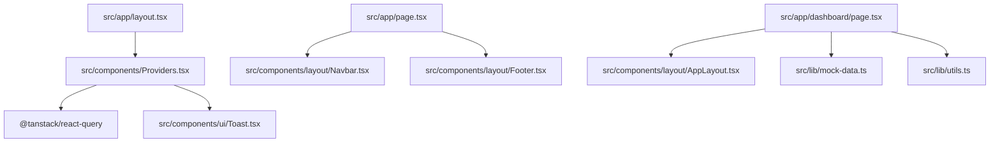
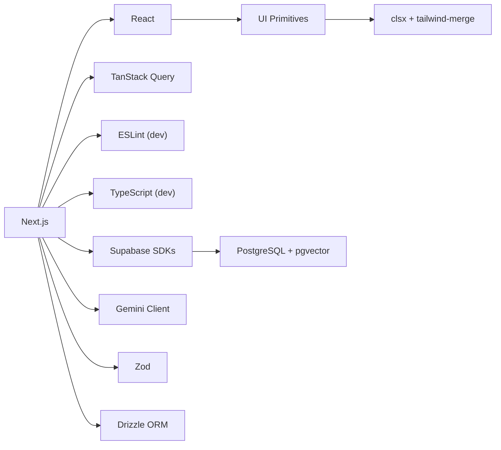

# Development Guide

<cite>
**Referenced Files in This Document**
- [package.json](file://package.json)
- [README.md](file://README.md)
- [tsconfig.json](file://tsconfig.json)
- [eslint.config.mjs](file://eslint.config.mjs)
- [next.config.ts](file://next.config.ts)
- [postcss.config.mjs](file://postcss.config.mjs)
- [src/app/layout.tsx](file://src/app/layout.tsx)
- [src/components/Providers.tsx](file://src/components/Providers.tsx)
- [src/middleware.ts](file://src/middleware.ts)
- [src/types/quiz.ts](file://src/types/quiz.ts)
- [src/lib/utils.ts](file://src/lib/utils.ts)
- [src/components/ui/index.ts](file://src/components/ui/index.ts)
- [src/components/ui/Button.tsx](file://src/components/ui/Button.tsx)
- [src/app/page.tsx](file://src/app/page.tsx)
- [src/app/dashboard/page.tsx](file://src/app/dashboard/page.tsx)
</cite>

## Table of Contents
1. Introduction
2. Project Structure
3. Core Components
4. Architecture Overview
5. Detailed Component Analysis
6. Dependency Analysis
7. Performance Considerations
8. Troubleshooting Guide
9. Conclusion
10. Appendices

## Introduction
This guide explains how to set up the development environment, understand code organization and conventions, follow quality standards, and extend MedAce AI with new features. It covers Node.js requirements, package manager configuration, local server setup, TypeScript rules enforced by the project, ESLint and formatting, build and deployment processes, testing strategies, debugging techniques, and performance tips.

## Project Structure
MedAce AI is a Next.js 15 application using React 19, Tailwind CSS v4, Supabase for auth and database, Drizzle ORM, TanStack Query for data fetching, and Google Gemini for AI-powered MCQ generation and explanations. The app uses the App Router with route groups (e.g., (auth)), shared UI primitives under src/components/ui, and feature pages under src/app.

Key directories:
- src/app: Pages and layouts (App Router). Includes landing page, dashboard, practice, results, study-plan, and auth routes.
- src/components: Shared UI components and layout wrappers.
- src/lib: Utilities and mock data used across the app.
- src/types: Shared TypeScript types for quiz-related entities.
- rag/textbooks: Raw textbook content used by the RAG pipeline.



**Diagram sources**
- [src/app/layout.tsx:1-57](file://src/app/layout.tsx#L1-L57)
- [src/components/Providers.tsx:1-23](file://src/components/Providers.tsx#L1-L23)
- [src/app/page.tsx:1-418](file://src/app/page.tsx#L1-L418)
- [src/app/dashboard/page.tsx:1-239](file://src/app/dashboard/page.tsx#L1-L239)

**Section sources**
- [README.md:23-78](file://README.md#L23-L78)
- [README.md:163-226](file://README.md#L163-L226)

## Core Components
- Root layout sets metadata, fonts, and global providers.
- Providers wraps the app with TanStack Query client and Toast context.
- Middleware defines protected/public routes and includes placeholder logic for future Supabase session checks.
- Types define domain models for questions, sessions, topics, and user profiles.
- UI primitives are exported via a barrel file and composed into pages.

Highlights:
- Global styles and theme tokens are applied at the root layout level.
- Data fetching and caching are centralized through TanStack Query.
- Utility functions provide class merging helpers and formatting utilities.

**Section sources**
- [src/app/layout.tsx:1-57](file://src/app/layout.tsx#L1-L57)
- [src/components/Providers.tsx:1-23](file://src/components/Providers.tsx#L1-L23)
- [src/middleware.ts:1-41](file://src/middleware.ts#L1-L41)
- [src/types/quiz.ts:1-107](file://src/types/quiz.ts#L1-L107)
- [src/components/ui/index.ts:1-15](file://src/components/ui/index.ts#L1-L15)
- [src/lib/utils.ts:1-34](file://src/lib/utils.ts#L1-L34)

## Architecture Overview
The application follows a layered architecture:
- Presentation layer: Next.js pages and React components.
- State/data layer: TanStack Query for caching and synchronization.
- Services/integrations: Supabase (Auth, DB), Gemini API (generation/embeddings), Drizzle ORM.
- Infrastructure: Security headers, PostCSS/Tailwind processing, and environment variables.

```mermaid
graph TB
subgraph "Frontend"
L["Root Layout"]
P["Providers (QueryClient + Toast)"]
UI["UI Primitives"]
Pages["Pages (Home, Dashboard, Practice, Results)"]
end
subgraph "Backend / Services"
S["Supabase (Auth, PostgreSQL, pgvector)"]
G["Google Gemini API"]
D["Drizzle ORM"]
end
L --> P
P --> UI
Pages --> UI
Pages --> S
Pages --> G
S < --> D
```

**Diagram sources**
- [src/app/layout.tsx:1-57](file://src/app/layout.tsx#L1-L57)
- [src/components/Providers.tsx:1-23](file://src/components/Providers.tsx#L1-L23)
- [README.md:23-78](file://README.md#L23-L78)

## Detailed Component Analysis

### Environment Setup and Local Development
- Node.js: Use a recent LTS version compatible with Next.js 15 and TypeScript 5.
- Package manager: npm is used; scripts are defined in package.json.
- Install dependencies and start the dev server using the provided scripts.
- Configure environment variables for Supabase, Gemini, and database access as documented.

Recommended workflow:
1. Install dependencies.
2. Create .env.local with required keys.
3. Run database migrations if applicable.
4. Start the development server and open localhost.

**Section sources**
- [package.json:5-10](file://package.json#L5-L10)
- [README.md:292-316](file://README.md#L292-L316)
- [README.md:228-244](file://README.md#L228-L244)

### Code Organization Principles and Naming Conventions
- Feature-based routing: Each major area has its own folder under src/app (e.g., dashboard, practice, results).
- Shared UI components live under src/components/ui and are re-exported from a central index.
- Domain types are grouped under src/types.
- Utilities and shared logic go under src/lib.
- Use absolute imports with path aliasing configured in tsconfig.

Naming conventions:
- PascalCase for components and types.
- kebab-case not used for files; folders use lowercase with descriptive names.
- Props interfaces are co-located with components and exported alongside them.

**Section sources**
- [tsconfig.json:21-23](file://tsconfig.json#L21-L23)
- [src/components/ui/index.ts:1-15](file://src/components/ui/index.ts#L1-L15)
- [src/types/quiz.ts:1-107](file://src/types/quiz.ts#L1-L107)

### TypeScript Best Practices Enforced by Configuration
- Strict mode enabled for type safety.
- Module resolution set to bundler for modern tooling compatibility.
- JSX preservation delegated to Next.js plugin.
- Path aliases enable clean imports from @/*.

Best practices:
- Prefer explicit types for props and function parameters.
- Use union types for constrained values (e.g., difficulty levels).
- Leverage utility types and generics where appropriate.

**Section sources**
- [tsconfig.json:1-27](file://tsconfig.json#L1-L27)

### ESLint Rules and Quality Checks
- ESLint is configured using Next’s recommended core web vitals ruleset via Flat Config compatibility.
- Linting script is available to run checks locally.

Guidelines:
- Follow Next.js best practices for performance and accessibility.
- Keep components small and focused; extract reusable logic.
- Ensure consistent import ordering and avoid unused variables.

**Section sources**
- [eslint.config.mjs:1-15](file://eslint.config.mjs#L1-L15)
- [package.json:5-10](file://package.json#L5-L10)

### Code Formatting Standards
- Styling is handled by Tailwind CSS v4 with PostCSS integration.
- Class composition uses clsx and tailwind-merge via a shared cn helper.
- Consistent spacing, colors, and typography are achieved through theme tokens and utility classes.

Practices:
- Use the cn helper to merge conditional classes safely.
- Prefer semantic color tokens over hardcoded values.
- Keep component classNames readable and modular.

**Section sources**
- [postcss.config.mjs:1-9](file://postcss.config.mjs#L1-L9)
- [src/lib/utils.ts:1-34](file://src/lib/utils.ts#L1-L34)
- [src/components/ui/Button.tsx:1-59](file://src/components/ui/Button.tsx#L1-L59)

### Build Process and Deployment
- Build command compiles the Next.js app for production.
- Start command runs the optimized production server.
- Deployment targets Vercel with zero-config support for Next.js.

Recommendations:
- Run lint before building to catch issues early.
- Ensure all environment variables are set in your deployment platform.
- Monitor performance metrics via Vercel Analytics.

**Section sources**
- [package.json:5-10](file://package.json#L5-L10)
- [README.md:318-325](file://README.md#L318-L325)

### Testing Strategies
- The repository does not include a dedicated test framework or scripts in package.json.
- Recommended approach:
  - Add a unit testing library (e.g., Vitest or Jest) for components and utilities.
  - Add integration tests for critical flows (e.g., quiz session lifecycle).
  - Use React Testing Library for component behavior validation.
  - Mock external services (Supabase, Gemini) during tests.

[No sources needed since this section provides general guidance]

### Debugging Techniques
- Use browser developer tools to inspect network requests and state.
- Enable logging in development and leverage console outputs strategically.
- For middleware issues, verify route matching and cookie handling when integrating authentication.
- Validate environment variables and service connectivity (Supabase, Gemini).

**Section sources**
- [src/middleware.ts:1-41](file://src/middleware.ts#L1-L41)

### Performance Optimization Tips
- Leverage TanStack Query caching and retry settings to reduce redundant requests.
- Use static assets and optimize images for faster load times.
- Apply security headers to improve performance and protection posture.
- Minimize client-side bundle size by tree-shaking and avoiding heavy dependencies.

**Section sources**
- [src/components/Providers.tsx:1-23](file://src/components/Providers.tsx#L1-L23)
- [next.config.ts:1-25](file://next.config.ts#L1-L25)

## Dependency Analysis
Core runtime dependencies include Next.js, React, Supabase SDKs, Drizzle ORM, TanStack Query, Gemini client, Zod, form libraries, icons, and styling utilities. Dev dependencies cover TypeScript, Drizzle Kit, Tailwind tooling, PostCSS, and ESLint.



**Diagram sources**
- [package.json:11-40](file://package.json#L11-L40)
- [README.md:23-78](file://README.md#L23-L78)

**Section sources**
- [package.json:11-40](file://package.json#L11-L40)

## Performance Considerations
- Caching: Configure stale times and retries in QueryClient to balance freshness and performance.
- Rendering: Prefer server components where possible; keep client components minimal and focused on interactivity.
- Styling: Use Tailwind utilities and theme tokens to avoid custom CSS bloat.
- Network: Batch requests and debounce inputs to reduce unnecessary calls.
- Security headers: Enforce strict policies to mitigate risks and improve trust signals.

**Section sources**
- [src/components/Providers.tsx:1-23](file://src/components/Providers.tsx#L1-L23)
- [next.config.ts:1-25](file://next.config.ts#L1-L25)

## Troubleshooting Guide
Common issues and resolutions:
- Missing environment variables: Ensure NEXT_PUBLIC_SUPABASE_URL, NEXT_PUBLIC_SUPABASE_ANON_KEY, SUPABASE_SERVICE_ROLE_KEY, DATABASE_URL, and GEMINI_API_KEY are set.
- Auth flow not working: Verify middleware route protection and cookie handling once Supabase Auth is integrated.
- Build failures: Confirm all dependencies are installed and TypeScript/ESLint configurations are valid.
- Styling conflicts: Use the cn helper to resolve overlapping Tailwind classes.

Steps:
1. Validate environment variables and service credentials.
2. Run lint and fix reported issues.
3. Rebuild and test locally before deploying.
4. Check logs for errors related to external services.

**Section sources**
- [README.md:228-244](file://README.md#L228-L244)
- [src/middleware.ts:1-41](file://src/middleware.ts#L1-L41)

## Conclusion
MedAce AI provides a robust foundation for building an adaptive MDCAT prep platform. By following the development guidelines, adhering to TypeScript and ESLint standards, leveraging Tailwind CSS for consistent styling, and utilizing TanStack Query for efficient data management, contributors can confidently extend functionality. The modular structure and clear separation of concerns make it straightforward to add new features, integrate additional services, and maintain high-quality code.

## Appendices

### Creating New Components
- Place reusable UI elements under src/components/ui and export them via the barrel index.
- Define props interfaces with precise types and default values.
- Use the cn helper for flexible class composition and ensure accessibility attributes are present.

**Section sources**
- [src/components/ui/index.ts:1-15](file://src/components/ui/index.ts#L1-L15)
- [src/components/ui/Button.tsx:1-59](file://src/components/ui/Button.tsx#L1-L59)
- [src/lib/utils.ts:1-34](file://src/lib/utils.ts#L1-L34)

### Adding Features
- Create new pages under src/app with appropriate route groups (e.g., (auth)).
- Wrap client-side state and data fetching with TanStack Query in Providers.
- Integrate services (Supabase, Gemini) via environment variables and secure server-side calls.
- Update middleware to protect new routes if necessary.

**Section sources**
- [src/app/layout.tsx:1-57](file://src/app/layout.tsx#L1-L57)
- [src/components/Providers.tsx:1-23](file://src/components/Providers.tsx#L1-L23)
- [src/middleware.ts:1-41](file://src/middleware.ts#L1-L41)

### Common Workflows
- Local development: Install deps, configure env, run dev server, iterate on components/pages.
- Code quality: Lint, format, and review changes before committing.
- Build and deploy: Build locally, verify environment variables, deploy to Vercel.

**Section sources**
- [package.json:5-10](file://package.json#L5-L10)
- [README.md:292-325](file://README.md#L292-L325)