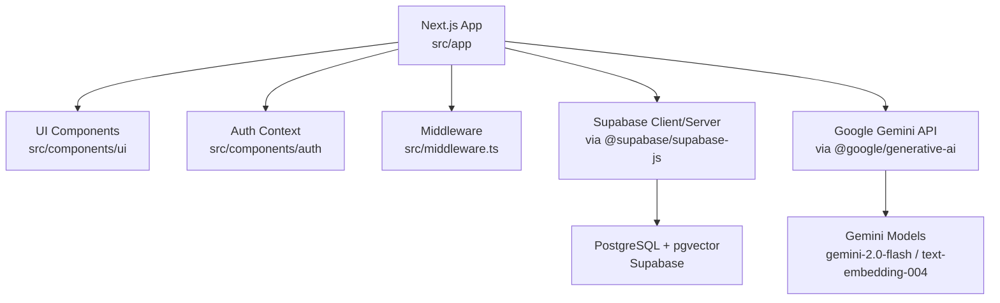
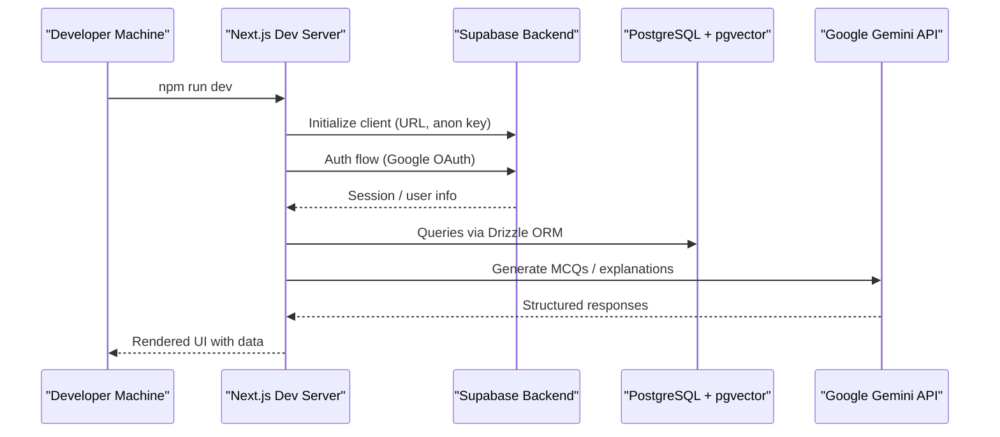
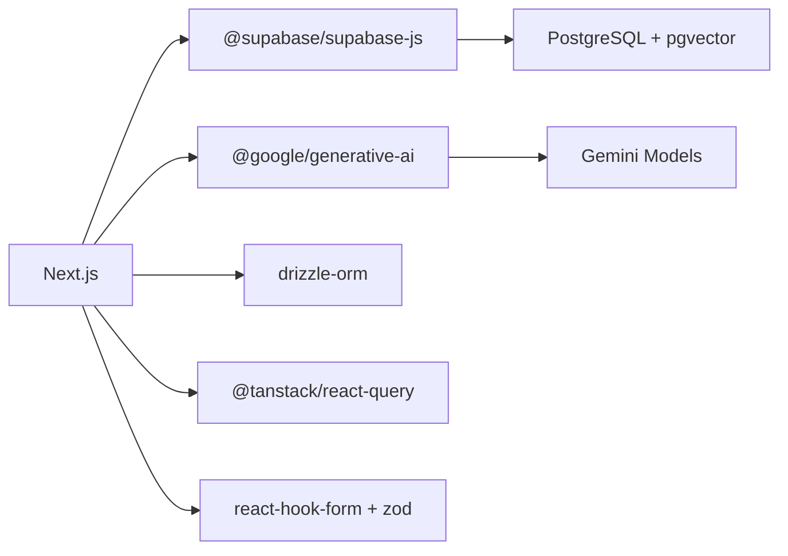

# Environment Setup

<cite>
**Referenced Files in This Document**
- [package.json](file://package.json)
- [README.md](file://README.md)
- [.env.example](file://.env.example)
- [next.config.ts](file://next.config.ts)
- [tsconfig.json](file://tsconfig.json)
- [src/components/auth/AuthProvider.tsx](file://src/components/auth/AuthProvider.tsx)
- [src/middleware.ts](file://src/middleware.ts)
</cite>

## Table of Contents
1. [Introduction](#introduction)
2. [Project Structure](#project-structure)
3. [Core Components](#core-components)
4. [Architecture Overview](#architecture-overview)
5. [Detailed Component Analysis](#detailed-component-analysis)
6. [Dependency Analysis](#dependency-analysis)
7. [Performance Considerations](#performance-considerations)
8. [Troubleshooting Guide](#troubleshooting-guide)
9. [Conclusion](#conclusion)
10. [Appendices](#appendices)

## Introduction
This document provides a complete environment setup guide for MedAce AI development. It covers required Node.js version, package manager usage, initial installation steps, development server configuration, environment variables, local database setup with Supabase, Google Gemini API integration, authentication configuration, and verification steps to ensure your environment is ready for development.

## Project Structure
MedAce AI is a Next.js 15 application using React 19, TypeScript, Tailwind CSS v4, Supabase (PostgreSQL + pgvector), Drizzle ORM, TanStack Query, and Google Gemini for AI features. The project includes:
- Frontend pages under src/app
- UI components under src/components/ui
- Authentication context under src/components/auth
- Middleware for route protection under src/middleware.ts
- RAG textbook content under rag/textbooks
- Configuration files at the root (Next.js, PostCSS, ESLint, TypeScript)

**Diagram sources**
- [package.json:11-26](file://package.json#L11-L26)
- [README.md:23-78](file://README.md#L23-L78)

**Section sources**
- [package.json:1-41](file://package.json#L1-L41)
- [README.md:23-78](file://README.md#L23-L78)

## Core Components
- Framework and runtime: Next.js 15, React 19, TypeScript 5
- Styling: Tailwind CSS v4 with PostCSS
- Database and auth: Supabase (PostgreSQL + pgvector), Supabase Auth (Google OAuth)
- ORM: Drizzle ORM with Drizzle Kit for migrations
- State/data fetching: TanStack Query v5
- AI: Google Gemini (generation and embeddings)
- Validation and forms: Zod, React Hook Form with resolvers
- Utilities: clsx and tailwind-merge for class composition

These dependencies define the environment requirements and integrations you will configure during setup.

**Section sources**
- [package.json:11-40](file://package.json#L11-L40)
- [README.md:23-78](file://README.md#L23-L78)

## Architecture Overview
The app runs on Next.js with client and server capabilities. Authentication flows through Supabase Auth (Google OAuth). Data persistence uses Supabase PostgreSQL with pgvector for vector storage. AI generation and embeddings are handled by Google Gemini via the official SDK.

**Diagram sources**
- [package.json:11-26](file://package.json#L11-L26)
- [README.md:23-78](file://README.md#L23-L78)

## Detailed Component Analysis

### Node.js Version and Package Manager
- Required Node.js version: 18+ (recommended 18.x or newer; some packages require Node >= 22)
- Supported package managers: npm, yarn, pnpm
- Use the package manager you prefer consistently across the project

Notes:
- The project scripts use npm commands by default (dev, build, start, lint)
- Ensure your Node.js version satisfies dependency engine requirements

**Section sources**
- [package.json:5-9](file://package.json#L5-L9)
- [package-lock.json:1116-1123](file://package-lock.json#L1116-L1123)
- [package-lock.json:2039-2049](file://package-lock.json#L2039-L2049)

### Initial Installation Steps
1. Install dependencies
   - npm install
   - Or use yarn install / pnpm install if configured
2. Set up environment variables
   - Copy .env.example to .env.local and fill values
3. Run database migrations
   - npx drizzle-kit generate
   - npx drizzle-kit migrate
4. Build RAG index (one-time)
   - npx tsx rag/scripts/clean.ts
   - npx tsx rag/scripts/chunk.ts
   - npx tsx rag/scripts/embed.ts
   - npx tsx rag/scripts/upload.ts
5. Start development server
   - npm run dev

Open http://localhost:3000 after starting the dev server.

**Section sources**
- [README.md:292-316](file://README.md#L292-L316)

### Environment Variables Configuration
Create a .env.local file based on .env.example and set:
- NEXT_PUBLIC_SUPABASE_URL
- NEXT_PUBLIC_SUPABASE_ANON_KEY
- SUPABASE_SERVICE_ROLE_KEY
- DATABASE_URL (for Drizzle ORM)
- GEMINI_API_KEY
- NEXT_PUBLIC_APP_URL (default http://localhost:3000)

Ensure these values are also configured in your deployment platform (e.g., Vercel) before deploying.

**Section sources**
- [.env.example:1-14](file://.env.example#L1-L14)
- [README.md:228-244](file://README.md#L228-L244)

### Local Database Setup Using Supabase
1. Create a Supabase project and obtain:
   - Project URL
   - Anon key
   - Service role key
2. Configure the DATABASE_URL for Drizzle ORM to connect to your Supabase PostgreSQL instance
3. Enable pgvector extension in your Supabase project to store embeddings
4. Run migrations to create tables:
   - npx drizzle-kit generate
   - npx drizzle-kit migrate
5. Build the RAG index once to populate textbook chunks and vectors

Verification:
- Confirm that migrations succeed without errors
- Verify that the RAG scripts complete successfully and insert vectors into pgvector

**Section sources**
- [README.md:228-244](file://README.md#L228-L244)
- [README.md:292-316](file://README.md#L292-L316)

### Google Gemini API Integration
1. Obtain a Google Gemini API key from Google AI Studio
2. Set GEMINI_API_KEY in .env.local
3. The app uses @google/generative-ai for:
   - MCQ generation and Urdu explanations via gemini-2.0-flash
   - Embeddings via text-embedding-004 for RAG retrieval

Verification:
- Ensure the RAG embedding step completes and stores vectors
- Test an MCQ generation endpoint or feature to confirm successful calls

**Section sources**
- [README.md:228-244](file://README.md#L228-L244)
- [README.md:23-78](file://README.md#L23-L78)

### Authentication with Supabase
- The frontend currently uses a mock user for development
- To enable real authentication:
  - Configure Supabase Auth with Google OAuth in your Supabase dashboard
  - Provide NEXT_PUBLIC_SUPABASE_URL and NEXT_PUBLIC_SUPABASE_ANON_KEY
  - Update the auth provider to listen to Supabase auth state changes
  - Optionally enforce protected routes via middleware when sessions are available

Current behavior:
- Protected routes are allowed by default during development
- When wired, middleware can check for Supabase session cookies and redirect unauthenticated users

**Section sources**
- [src/components/auth/AuthProvider.tsx:31-42](file://src/components/auth/AuthProvider.tsx#L31-L42)
- [src/middleware.ts:14-35](file://src/middleware.ts#L14-L35)

### System Dependencies and Tooling
- Node.js: 18+ (some packages require Node >= 22)
- Package manager: npm (yarn/pnpm supported)
- TypeScript compiler options include strict mode and path aliases (@/* -> ./src/*)
- Security headers are configured in Next.js config

No additional system-level dependencies are required beyond Node.js and a compatible package manager.

**Section sources**
- [package-lock.json:1116-1123](file://package-lock.json#L1116-L1123)
- [package-lock.json:2039-2049](file://package-lock.json#L2039-L2049)
- [tsconfig.json:1-27](file://tsconfig.json#L1-L27)
- [next.config.ts:1-24](file://next.config.ts#L1-L24)

## Dependency Analysis
Key runtime dependencies and their roles:
- next: Application framework
- react/react-dom: UI runtime
- @supabase/supabase-js/@supabase/ssr: Supabase client and SSR utilities
- drizzle-orm/postgres: Type-safe database access
- @tanstack/react-query: Data fetching and caching
- @google/generative-ai: Google Gemini integration
- zod: Runtime validation
- react-hook-form/@hookform/resolvers: Forms handling
- lucide-react: Icons
- clsx/tailwind-merge: Class composition

**Diagram sources**
- [package.json:11-26](file://package.json#L11-L26)

**Section sources**
- [package.json:11-40](file://package.json#L11-L40)

## Performance Considerations
- Use the latest stable Node.js version recommended by your package manager
- Keep dependencies updated to benefit from performance improvements
- Leverage Drizzle ORM for efficient queries and cold starts
- Use pgvector for fast similarity searches within Supabase
- Cache API responses with TanStack Query to reduce redundant requests

[No sources needed since this section provides general guidance]

## Troubleshooting Guide
Common issues and resolutions:
- Node.js version mismatch
  - Symptom: Installation or runtime errors due to unsupported Node versions
  - Resolution: Use Node.js 18+; some packages require Node >= 22
- Missing environment variables
  - Symptom: Supabase or Gemini calls fail
  - Resolution: Ensure all variables in .env.local are set correctly
- Database migration failures
  - Symptom: drizzle-kit errors
  - Resolution: Verify DATABASE_URL points to a valid Supabase instance and pgvector is enabled
- RAG indexing fails
  - Symptom: Embedding or upload scripts error out
  - Resolution: Check GEMINI_API_KEY and network connectivity; verify pgvector table exists
- Authentication not working
  - Symptom: Login does not persist or routes not protected
  - Resolution: Configure Supabase Auth with Google OAuth and update AuthProvider to listen to auth state changes; enable middleware checks when ready

Verification steps:
- Run npm run dev and open http://localhost:3000
- Confirm no console errors related to missing environment variables
- Execute migrations and RAG scripts without errors
- Test login flow and protected routes after enabling Supabase Auth

**Section sources**
- [package-lock.json:1116-1123](file://package-lock.json#L1116-L1123)
- [package-lock.json:2039-2049](file://package-lock.json#L2039-L2049)
- [README.md:228-244](file://README.md#L228-L244)
- [README.md:292-316](file://README.md#L292-L316)
- [src/components/auth/AuthProvider.tsx:31-42](file://src/components/auth/AuthProvider.tsx#L31-L42)
- [src/middleware.ts:14-35](file://src/middleware.ts#L14-L35)

## Conclusion
You now have the essential steps to set up MedAce AI locally: install dependencies, configure environment variables, set up Supabase and Gemini, run migrations, build the RAG index, and start the development server. Follow the troubleshooting tips to resolve common issues and verify your environment is fully functional.

[No sources needed since this section summarizes without analyzing specific files]

## Appendices

### Quick Start Checklist
- Install Node.js 18+ (preferably matching package engine requirements)
- Install dependencies with your chosen package manager
- Copy .env.example to .env.local and fill credentials
- Run drizzle-kit generate and migrate
- Build RAG index once
- Start the dev server and open http://localhost:3000

**Section sources**
- [README.md:292-316](file://README.md#L292-L316)