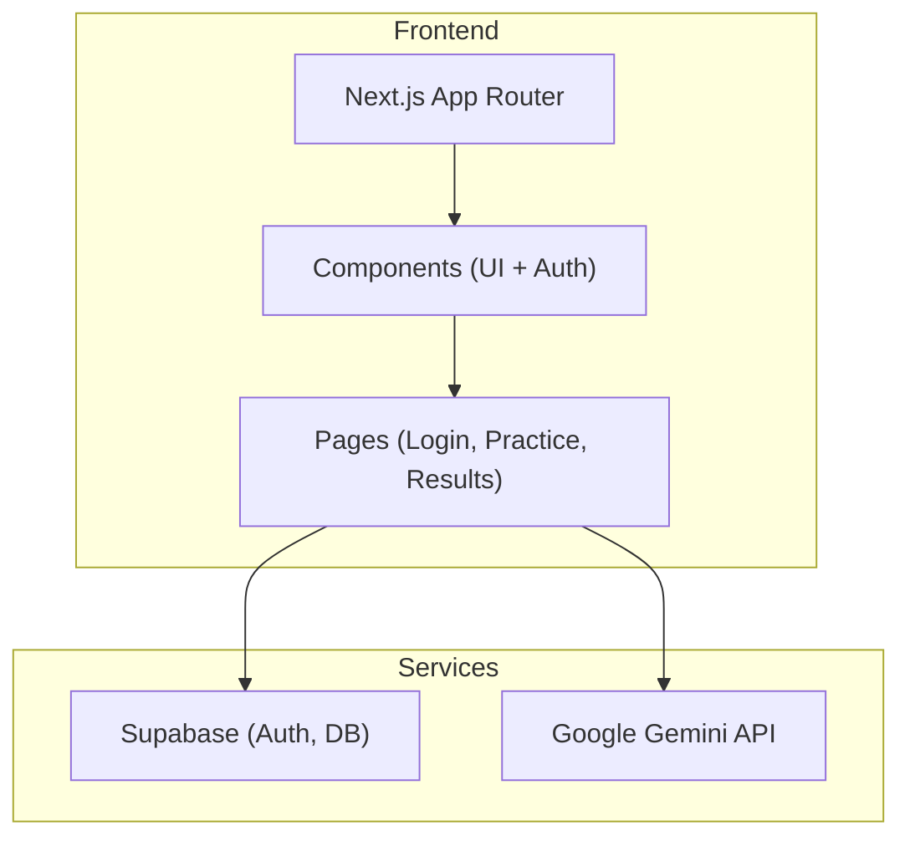
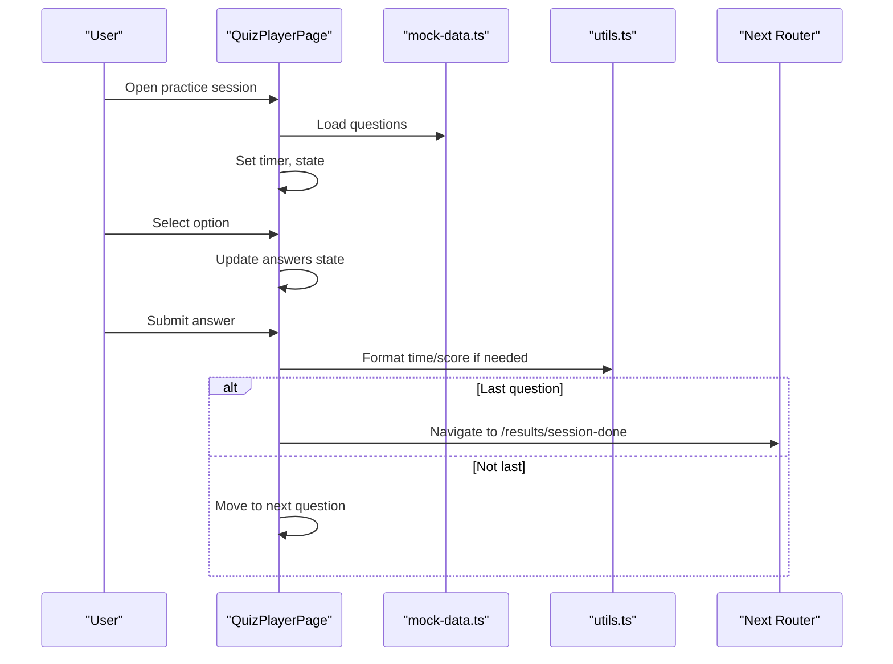
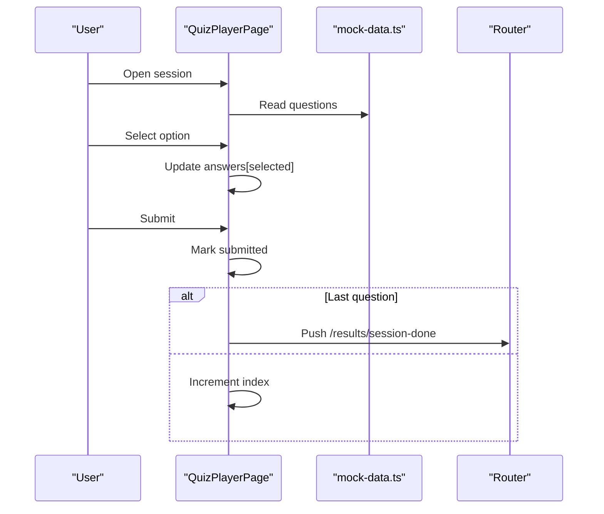
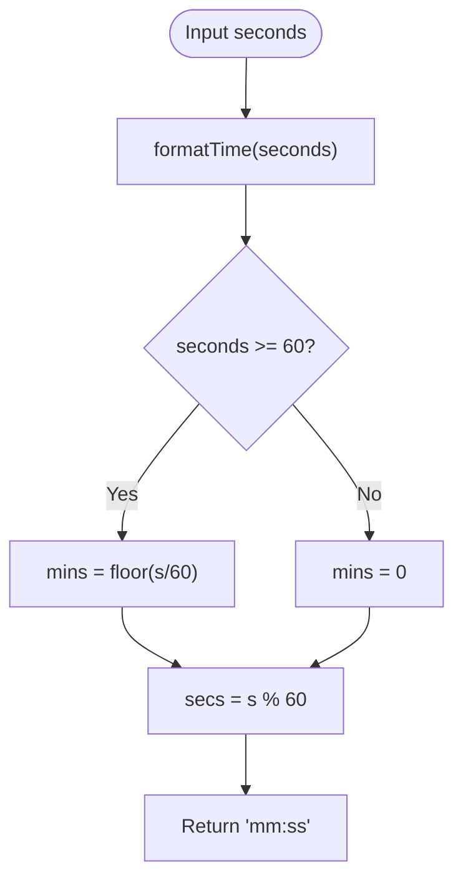
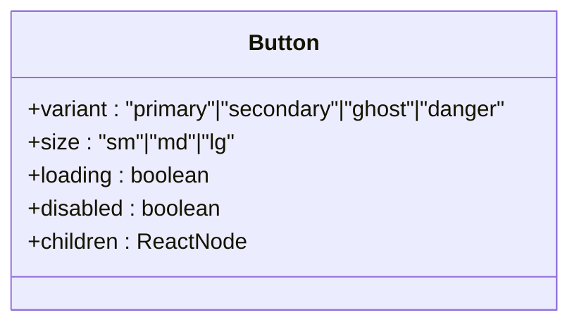
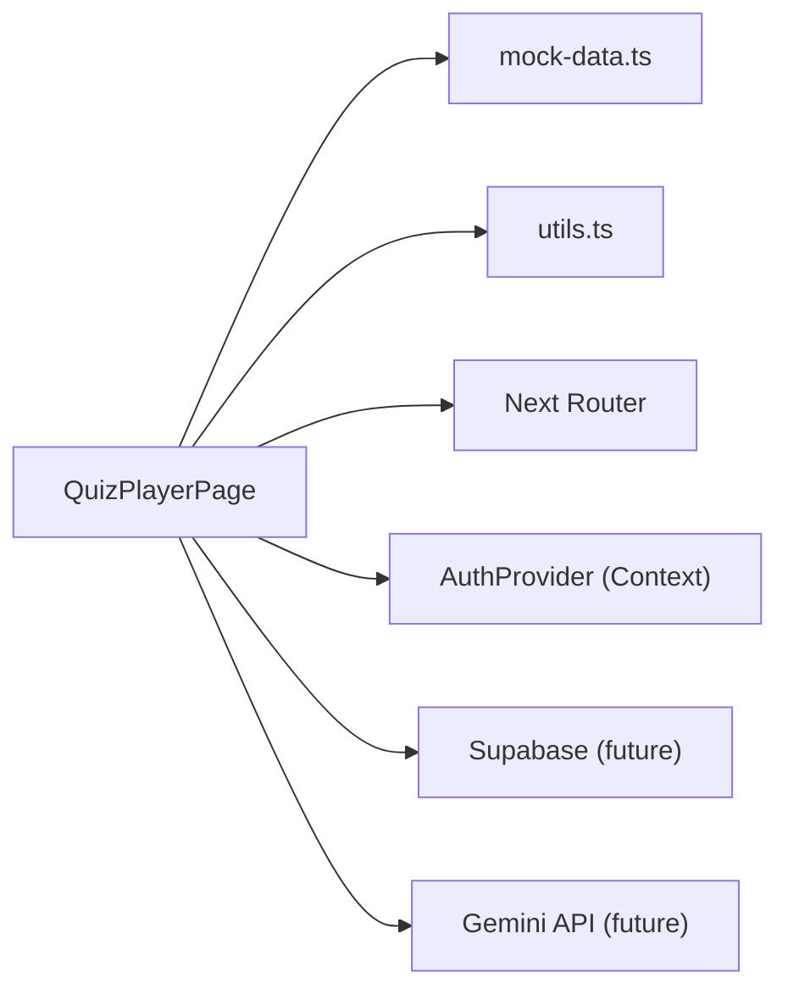

# Testing Strategy & Implementation

<cite>
**Referenced Files in This Document**
- [package.json](file://package.json)
- [README.md](file://README.md)
- [src/middleware.ts](file://src/middleware.ts)
- [src/lib/mock-data.ts](file://src/lib/mock-data.ts)
- [src/lib/utils.ts](file://src/lib/utils.ts)
- [src/types/quiz.ts](file://src/types/quiz.ts)
- [src/components/auth/AuthProvider.tsx](file://src/components/auth/AuthProvider.tsx)
- [src/app/(auth)/login/page.tsx](file://src/app/(auth)/login/page.tsx)
- [src/app/practice/[session]/page.tsx](file://src/app/practice/[session]/page.tsx)
- [src/components/ui/Button.tsx](file://src/components/ui/Button.tsx)
- [src/components/ui/index.ts](file://src/components/ui/index.ts)
</cite>

## Table of Contents
1. Introduction
2. Project Structure
3. Core Components
4. Architecture Overview
5. Detailed Component Analysis
6. Dependency Analysis
7. Performance Considerations
8. Troubleshooting Guide
9. Conclusion
10. Appendices

## Introduction
This document defines the testing strategy and implementation plan for MedAce AI. It covers unit, integration, and end-to-end testing across components, utilities, authentication flows, practice sessions, and analytics calculations. It also documents how to set up testing tools, organize test files, mock external services (Google Gemini API and Supabase), manage test data with mock-data.ts, and establish assertion patterns. Finally, it outlines coverage requirements and continuous integration setup guidance.

## Project Structure
MedAce AI is a Next.js 15 application using React 19, Tailwind CSS v4, Supabase for auth/database, Google Gemini for MCQ generation and explanations, and Drizzle ORM for database access. The current codebase includes UI primitives, an auth provider with a mock user, login page, quiz player page, middleware for route protection, shared utilities, and comprehensive mock data for topics, questions, sessions, study plans, and user profiles.



**Diagram sources**
- [README.md:23-78](file://README.md#L23-L78)

**Section sources**
- [README.md:23-78](file://README.md#L23-L78)
- [package.json:1-42](file://package.json#L1-L42)

## Core Components
Key areas that require testing:
- Authentication flow and protected routes
- Quiz session lifecycle (start, answer, submit, navigate)
- Analytics and scoring logic
- UI primitives behavior and accessibility
- Utilities formatting and helpers
- External service integrations (Gemini, Supabase)

Testing priorities:
- Unit tests for pure functions and small components
- Integration tests for pages and workflows
- End-to-end tests for critical user journeys
- Mocking strategies for Gemini and Supabase
- Test data management via mock-data.ts

**Section sources**
- [src/components/auth/AuthProvider.tsx:1-58](file://src/components/auth/AuthProvider.tsx#L1-L58)
- [src/app/(auth)/login/page.tsx:1-91](file://src/app/(auth)/login/page.tsx#L1-L91)
- [src/app/practice/[session]/page.tsx:1-352](file://src/app/practice/[session]/page.tsx#L1-L352)
- [src/lib/utils.ts:1-34](file://src/lib/utils.ts#L1-L34)
- [src/lib/mock-data.ts:1-313](file://src/lib/mock-data.ts#L1-L313)
- [src/types/quiz.ts:1-107](file://src/types/quiz.ts#L1-L107)

## Architecture Overview
The app uses a client-side quiz player that renders questions from mock data, tracks answers, manages timers, and navigates to results. Middleware gates protected routes. Auth provider currently returns a mock user. External integrations are planned for Supabase and Gemini; tests should isolate these dependencies via mocks.



**Diagram sources**
- [src/app/practice/[session]/page.tsx:25-86](file://src/app/practice/[session]/page.tsx#L25-L86)
- [src/lib/mock-data.ts:69-210](file://src/lib/mock-data.ts#L69-L210)
- [src/lib/utils.ts:17-21](file://src/lib/utils.ts#L17-L21)

**Section sources**
- [src/app/practice/[session]/page.tsx:1-352](file://src/app/practice/[session]/page.tsx#L1-L352)
- [src/lib/mock-data.ts:1-313](file://src/lib/mock-data.ts#L1-L313)
- [src/lib/utils.ts:1-34](file://src/lib/utils.ts#L1-L34)

## Detailed Component Analysis

### Authentication Flow
- Current state: AuthProvider provides a mock user; middleware allows all routes during development.
- Tests should cover:
  - Rendering of login page and form fields
  - Navigation to protected routes when authenticated
  - Behavior when no token is present (future Supabase integration)
  - Context values exposed by useAuth

```mermaid
flowchart TD
Start(["Visit Protected Route"]) --> CheckMiddleware["Check middleware"]
CheckMiddleware --> |No token (future)| Redirect["Redirect to /login?redirect=..."]
CheckMiddleware --> |Token present or dev mode| Allow["Allow access"]
Allow --> RenderDashboard["Render Dashboard"]
Redirect --> Login["Render Login Page"]
```

**Diagram sources**
- [src/middleware.ts:4-35](file://src/middleware.ts#L4-L35)
- [src/components/auth/AuthProvider.tsx:43-56](file://src/components/auth/AuthProvider.tsx#L43-L56)
- [src/app/(auth)/login/page.tsx:5-89](file://src/app/(auth)/login/page.tsx#L5-L89)

**Section sources**
- [src/middleware.ts:1-41](file://src/middleware.ts#L1-L41)
- [src/components/auth/AuthProvider.tsx:1-58](file://src/components/auth/AuthProvider.tsx#L1-L58)
- [src/app/(auth)/login/page.tsx:1-91](file://src/app/(auth)/login/page.tsx#L1-L91)

### Quiz Session Lifecycle
- Covers selection, submission, navigation, timer countdown, and exit modal.
- Tests should assert:
  - Initial state and question rendering
  - Option selection updates state correctly
  - Submission marks answer as submitted and enables next
  - Timer resets per question and counts down
  - Final navigation to results on last question
  - Exit modal prevents accidental loss of progress



**Diagram sources**
- [src/app/practice/[session]/page.tsx:57-86](file://src/app/practice/[session]/page.tsx#L57-L86)
- [src/lib/mock-data.ts:69-210](file://src/lib/mock-data.ts#L69-L210)

**Section sources**
- [src/app/practice/[session]/page.tsx:1-352](file://src/app/practice/[session]/page.tsx#L1-L352)
- [src/lib/mock-data.ts:69-210](file://src/lib/mock-data.ts#L69-L210)

### Analytics and Scoring Utilities
- Focus on utils.ts helpers like formatTime and score color getters.
- Tests should validate:
  - Correct formatting of seconds to mm:ss
  - Score thresholds mapping to colors
  - Edge cases (zero, negative, large numbers)



**Diagram sources**
- [src/lib/utils.ts:17-21](file://src/lib/utils.ts#L17-L21)

**Section sources**
- [src/lib/utils.ts:1-34](file://src/lib/utils.ts#L1-L34)

### UI Primitives
- Button component supports variants, sizes, loading state, and disabled states.
- Tests should verify:
  - Correct class composition via cn()
  - Loading spinner visibility
  - Disabled propagation
  - Accessibility attributes



**Diagram sources**
- [src/components/ui/Button.tsx:10-58](file://src/components/ui/Button.tsx#L10-L58)

**Section sources**
- [src/components/ui/Button.tsx:1-59](file://src/components/ui/Button.tsx#L1-L59)
- [src/components/ui/index.ts:1-15](file://src/components/ui/index.ts#L1-L15)

## Dependency Analysis
External dependencies relevant to testing:
- Supabase (auth, database): mock via module mocking or environment overrides
- Google Gemini API: mock fetch or SDK calls to avoid network requests
- Next.js router/navigation: mock for page transitions
- React hooks: timers, context, state



**Diagram sources**
- [src/app/practice/[session]/page.tsx:1-352](file://src/app/practice/[session]/page.tsx#L1-L352)
- [src/lib/mock-data.ts:1-313](file://src/lib/mock-data.ts#L1-L313)
- [src/lib/utils.ts:1-34](file://src/lib/utils.ts#L1-L34)
- [src/components/auth/AuthProvider.tsx:1-58](file://src/components/auth/AuthProvider.tsx#L1-L58)

**Section sources**
- [src/app/practice/[session]/page.tsx:1-352](file://src/app/practice/[session]/page.tsx#L1-L352)
- [src/lib/mock-data.ts:1-313](file://src/lib/mock-data.ts#L1-L313)
- [src/lib/utils.ts:1-34](file://src/lib/utils.ts#L1-L34)
- [src/components/auth/AuthProvider.tsx:1-58](file://src/components/auth/AuthProvider.tsx#L1-L58)

## Performance Considerations
- Keep unit tests fast and isolated; avoid real network calls.
- Use Jest/Vitest timers mocking for interval-based logic (e.g., quiz timer).
- Batch assertions and minimize re-renders in component tests.
- Prefer shallow or focused renders for UI primitives.
- For integration tests, mock Supabase/Gemini responses to reduce latency.

[No sources needed since this section provides general guidance]

## Troubleshooting Guide
Common issues and resolutions:
- Timer not resetting between questions: ensure effect dependencies include currentIdx and isAnswered.
- Incorrect answer highlighting: verify correctAnswer comparison and selectedAnswer state.
- Navigation not triggering: confirm isLast condition and router.push call path.
- Middleware redirect loops: check protectedRoutes list and cookie/token handling.
- Mock data mismatches: align types in quiz.ts with mock-data.ts structures.

**Section sources**
- [src/app/practice/[session]/page.tsx:42-55](file://src/app/practice/[session]/page.tsx#L42-L55)
- [src/app/practice/[session]/page.tsx:76-86](file://src/app/practice/[session]/page.tsx#L76-L86)
- [src/middleware.ts:4-35](file://src/middleware.ts#L4-L35)
- [src/types/quiz.ts:15-50](file://src/types/quiz.ts#L15-L50)
- [src/lib/mock-data.ts:69-210](file://src/lib/mock-data.ts#L69-L210)

## Conclusion
Adopt a layered testing approach: unit tests for utilities and small components, integration tests for pages and workflows, and end-to-end tests for critical user journeys. Isolate external dependencies through robust mocking, leverage mock-data.ts for consistent test fixtures, and enforce coverage thresholds in CI. This ensures reliability as MedAce AI evolves with Supabase and Gemini integrations.

[No sources needed since this section summarizes without analyzing specific files]

## Appendices

### Testing Tools and Frameworks Setup
Recommended stack:
- Jest or Vitest for unit and integration tests
- React Testing Library for component tests
- MSW (Mock Service Worker) or manual module mocks for Supabase and Gemini
- Cypress or Playwright for end-to-end tests
- jest-canvas-mock or jsdom configuration for browser APIs if needed

Add scripts to package.json:
- "test": run unit/integration suite
- "test:e2e": run end-to-end suite
- "coverage": generate coverage report

**Section sources**
- [package.json:1-42](file://package.json#L1-L42)

### Test File Organization
Suggested structure:
- src/__tests__/unit/ — utility functions and pure logic
- src/__tests__/components/ — UI primitives and composite components
- src/__tests__/pages/ — page-level integration tests
- src/__tests__/e2e/ — end-to-end scenarios
- src/__tests__/fixtures/ — reusable test data (extend mock-data.ts patterns)

Guidelines:
- Mirror source structure where applicable
- Name files with .test.ts or .spec.ts
- Group related tests in describe blocks
- Use beforeEach/afterEach for setup/teardown

[No sources needed since this section provides general guidance]

### Mocking Strategies
- Supabase:
  - Mock createBrowserClient and server client methods
  - Stub auth state changes and queries
  - Provide deterministic responses for users, sessions, and answers
- Google Gemini:
  - Mock SDK calls or fetch to return structured MCQ JSON
  - Validate prompt construction and response parsing
- Next.js Router:
  - Mock useRouter push and replace for navigation tests
- Timers:
  - Use fake timers to control intervals and timeouts

[No sources needed since this section provides general guidance]

### Test Data Management with mock-data.ts
- Extend existing exports for new scenarios (e.g., different difficulties, topics)
- Create subsets for targeted tests (e.g., only Easy questions)
- Ensure type consistency with quiz.ts interfaces
- Add edge-case entries (null scores, empty answers, high error counts)

**Section sources**
- [src/lib/mock-data.ts:1-313](file://src/lib/mock-data.ts#L1-L313)
- [src/types/quiz.ts:1-107](file://src/types/quiz.ts#L1-L107)

### Assertion Patterns
- State changes: assert updated state after interactions
- UI feedback: verify classes, icons, and text content
- Navigation: assert router.push called with expected paths
- Error handling: assert fallback UI and messages
- Accessibility: check aria attributes and focus management

[No sources needed since this section provides general guidance]

### Examples: Complex Scenarios
- Authentication flow:
  - Unauthenticated user attempts protected route → redirected to login
  - After login, user accesses dashboard
  - Token expiry redirects back to login
- Practice session:
  - Start session → select options → submit → see explanation → navigate to results
  - Timer countdown and reset per question
  - Exit modal prevents accidental progress loss
- Analytics calculations:
  - Compute accuracy rate from answers
  - Generate weak topics based on error counts
  - Format time and score colors consistently

**Section sources**
- [src/app/practice/[session]/page.tsx:42-86](file://src/app/practice/[session]/page.tsx#L42-L86)
- [src/lib/mock-data.ts:215-256](file://src/lib/mock-data.ts#L215-L256)
- [src/lib/utils.ts:23-33](file://src/lib/utils.ts#L23-L33)

### Coverage Requirements
- Minimum line and branch coverage thresholds (e.g., 80% lines, 70% branches)
- Enforce coverage in CI pipeline
- Exclude generated or third-party code
- Report coverage per directory for maintainability

[No sources needed since this section provides general guidance]

### Continuous Integration Testing Setup
- Configure CI to install dependencies, run lint, build, and tests
- Cache node_modules for faster runs
- Run unit/integration tests in parallel
- Run e2e tests against a dev server or test instance
- Upload coverage reports and fail builds below thresholds

[No sources needed since this section provides general guidance]