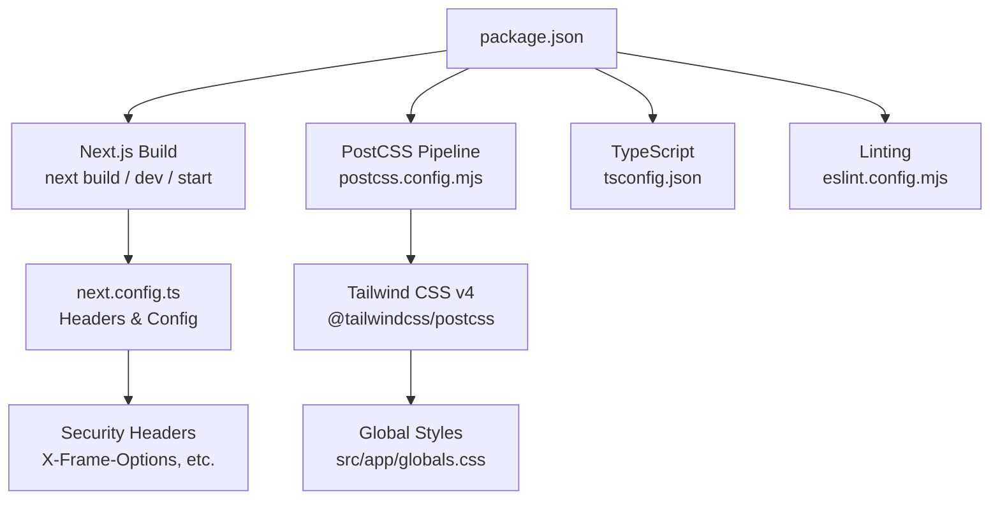
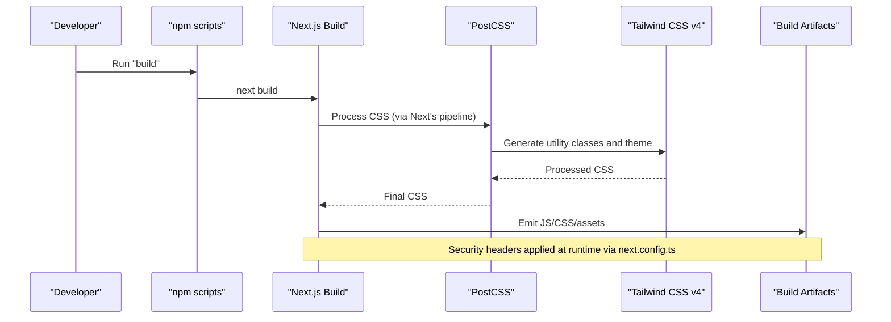
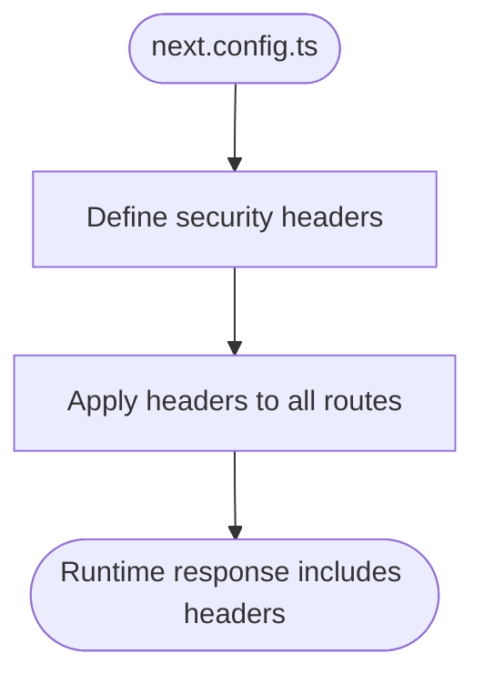
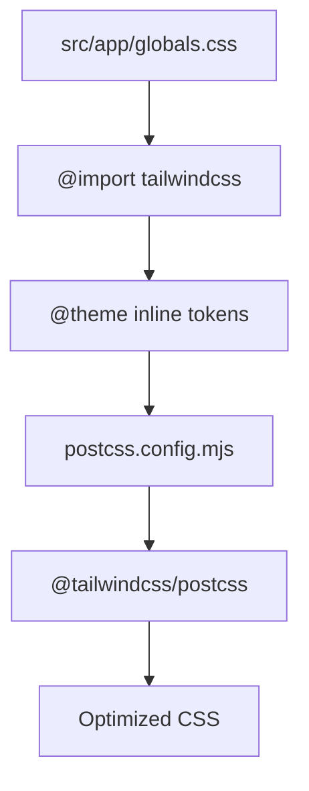
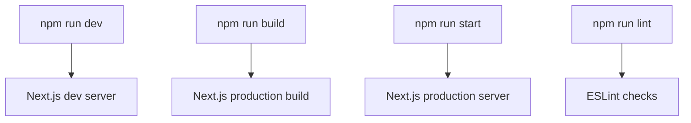
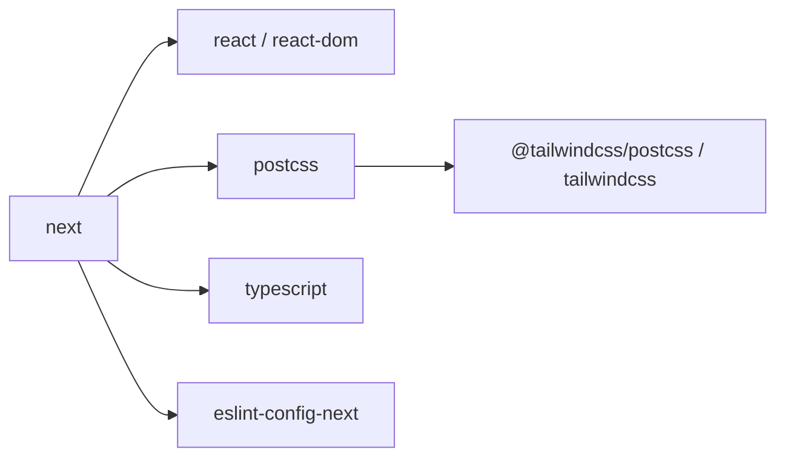

# Build Configuration

<cite>
**Referenced Files in This Document**
- [package.json](file://package.json)
- [next.config.ts](file://next.config.ts)
- [postcss.config.mjs](file://postcss.config.mjs)
- [tsconfig.json](file://tsconfig.json)
- [eslint.config.mjs](file://eslint.config.mjs)
- [globals.css](file://src/app/globals.css)
- [README.md](file://README.md)
</cite>

## Table of Contents
1. [Introduction](#introduction)
2. [Project Structure](#project-structure)
3. [Core Components](#core-components)
4. [Architecture Overview](#architecture-overview)
5. [Detailed Component Analysis](#detailed-component-analysis)
6. [Dependency Analysis](#dependency-analysis)
7. [Performance Considerations](#performance-considerations)
8. [Troubleshooting Guide](#troubleshooting-guide)
9. [Conclusion](#conclusion)
10. [Appendices](#appendices)

## Introduction
This document explains the build configuration for MedAce-AI with a focus on the Next.js build process and PostCSS pipeline. It covers:
- Next.js configuration, including security headers and how to extend it for webpack customization, image optimization, experimental features, and environment-specific settings
- PostCSS configuration with Tailwind CSS v4 integration and the CSS processing pipeline
- Package scripts for development, building, linting, and deployment workflows
- Performance strategies such as code splitting, tree shaking, bundle analysis, and asset optimization
- Environment variable management and validation approaches
- Troubleshooting common build issues and debugging production builds

## Project Structure
The project uses a modern Next.js 15 setup with TypeScript, Tailwind CSS v4 via PostCSS, and ESLint configured for Next core web vitals. The root-level configuration files define the build behavior and toolchain:
- next.config.ts: Next.js runtime configuration (headers)
- postcss.config.mjs: PostCSS plugin configuration for Tailwind
- tsconfig.json: TypeScript compiler options and path aliases
- eslint.config.mjs: Linting rules based on Next’s recommended set
- package.json: Scripts and dependencies
- src/app/globals.css: Global styles and Tailwind theme tokens



**Diagram sources**
- [package.json:5-9](file://package.json#L5-L9)
- [next.config.ts:13-22](file://next.config.ts#L13-L22)
- [postcss.config.mjs:2-6](file://postcss.config.mjs#L2-L6)
- [tsconfig.json:1-27](file://tsconfig.json#L1-L27)
- [eslint.config.mjs:12-14](file://eslint.config.mjs#L12-L14)
- [globals.css:1-41](file://src/app/globals.css#L1-L41)

**Section sources**
- [package.json:1-43](file://package.json#L1-L43)
- [next.config.ts:1-25](file://next.config.ts#L1-L25)
- [postcss.config.mjs:1-9](file://postcss.config.mjs#L1-L9)
- [tsconfig.json:1-28](file://tsconfig.json#L1-L28)
- [eslint.config.mjs:1-15](file://eslint.config.mjs#L1-L15)
- [globals.css:1-300](file://src/app/globals.css#L1-L300)
- [README.md:255-271](file://README.md#L255-L271)

## Core Components
- Next.js configuration: Adds security headers globally for all routes. Extendable for webpack customization, image optimization, and experimental flags.
- PostCSS + Tailwind: Uses @tailwindcss/postcss to process CSS; global styles import Tailwind and define design tokens.
- TypeScript: Strict mode, bundler module resolution, path aliasing (@/*), incremental compilation.
- ESLint: Extends Next’s core-web-vitals config for performance-oriented linting.
- Scripts: Standard Next.js lifecycle commands for dev, build, start, and lint.

**Section sources**
- [next.config.ts:3-22](file://next.config.ts#L3-L22)
- [postcss.config.mjs:2-6](file://postcss.config.mjs#L2-L6)
- [tsconfig.json:2-23](file://tsconfig.json#L2-L23)
- [eslint.config.mjs:12-14](file://eslint.config.mjs#L12-L14)
- [package.json:5-9](file://package.json#L5-L9)

## Architecture Overview
The build pipeline integrates Next.js with PostCSS and Tailwind to produce optimized assets while enforcing security headers at runtime.



**Diagram sources**
- [package.json:7-7](file://package.json#L7-L7)
- [next.config.ts:13-22](file://next.config.ts#L13-L22)
- [postcss.config.mjs:2-6](file://postcss.config.mjs#L2-L6)
- [globals.css:1-41](file://src/app/globals.css#L1-L41)

## Detailed Component Analysis

### Next.js Configuration
- Security headers are applied to all routes using the headers API.
- The configuration is minimal and can be extended with:
  - Webpack customization via webpack function
  - Image optimization via images configuration (domains, formats, sizes)
  - Experimental features via experimental object (e.g., serverActions, optimizePackageImports)
  - Environment-specific settings by reading process.env or using Next’s env loader



**Diagram sources**
- [next.config.ts:3-22](file://next.config.ts#L3-L22)

**Section sources**
- [next.config.ts:1-25](file://next.config.ts#L1-L25)

### PostCSS and Tailwind Integration
- PostCSS is configured with @tailwindcss/postcss to enable Tailwind v4 processing.
- Global CSS imports Tailwind and defines inline theme tokens for colors, fonts, and utilities.
- The CSS pipeline transforms source styles into optimized CSS during build.



**Diagram sources**
- [globals.css:1-41](file://src/app/globals.css#L1-L41)
- [postcss.config.mjs:2-6](file://postcss.config.mjs#L2-L6)

**Section sources**
- [postcss.config.mjs:1-9](file://postcss.config.mjs#L1-L9)
- [globals.css:1-300](file://src/app/globals.css#L1-L300)

### TypeScript Configuration
- Strict mode enabled for type safety.
- Module resolution set to bundler for compatibility with modern toolchains.
- Path alias @/* maps to ./src/* for cleaner imports.
- Incremental compilation enabled for faster rebuilds.

```mermaid
classDiagram
class TSConfig {
+target : ES2017
+module : esnext
+moduleResolution : bundler
+strict : true
+paths : {"@/*" : "./src/*"}
+incremental : true
}
```

**Diagram sources**
- [tsconfig.json:2-23](file://tsconfig.json#L2-L23)

**Section sources**
- [tsconfig.json:1-28](file://tsconfig.json#L1-L28)

### ESLint Configuration
- Uses Next’s recommended core-web-vitals rules to enforce performance best practices.

**Section sources**
- [eslint.config.mjs:12-14](file://eslint.config.mjs#L12-L14)

### Package Scripts and Workflows
- Development: npm run dev starts the Next.js dev server with hot reloading.
- Build: npm run build produces optimized production assets.
- Start: npm run start runs the production server.
- Lint: npm run lint checks code quality using Next’s ESLint rules.



**Diagram sources**
- [package.json:5-9](file://package.json#L5-L9)

**Section sources**
- [package.json:5-9](file://package.json#L5-L9)
- [README.md:437-445](file://README.md#L437-L445)

## Dependency Analysis
Key build-time dependencies and their roles:
- next: Framework providing build, routing, and server capabilities
- react/react-dom: UI runtime
- tailwindcss/@tailwindcss/postcss: Utility-first styling and PostCSS integration
- postcss: CSS transformation engine
- typescript: Type checking and compilation support
- eslint/eslint-config-next: Linting aligned with Next.js best practices



**Diagram sources**
- [package.json:11-41](file://package.json#L11-L41)

**Section sources**
- [package.json:11-41](file://package.json#L11-L41)

## Performance Considerations
- Code Splitting: Next.js automatically splits code per route and component boundaries. Use dynamic imports for heavy libraries to reduce initial bundle size.
- Tree Shaking: Ensure side-effect-free modules and avoid importing entire libraries when only parts are needed.
- Bundle Analysis: Integrate a bundle analyzer (e.g., next-bundle-analyzer) to inspect chunk sizes and identify large dependencies.
- Asset Optimization:
  - Images: Configure next/image domains and preferred formats; consider lazy loading and responsive sizing.
  - Fonts: Prefer system fonts or self-hosted fonts with font-display swap; use preload where appropriate.
  - CSS: Tailwind v4 generates only used utilities; keep globals.css minimal and rely on utility classes.
- Runtime Optimizations:
  - Server Components: Leverage Next.js Server Components to minimize client-side JavaScript.
  - Data Fetching: Use TanStack Query for caching and efficient revalidation; prefer server-side data fetching where possible.
  - Security Headers: Already configured in next.config.ts to improve security posture.

[No sources needed since this section provides general guidance]

## Troubleshooting Guide
Common build issues and debugging techniques:
- Missing Environment Variables:
  - Ensure NEXT_PUBLIC_* variables are defined for client-side access; server-only secrets should not be prefixed.
  - Validate required variables before build/start to fail fast.
- Tailwind Not Applying:
  - Confirm @tailwindcss/postcss is present in postcss.config.mjs and that Tailwind is imported in globals.css.
  - Check that content paths include your components if using custom scanning patterns.
- TypeScript Errors Blocking Build:
  - Run tsc --noEmit locally to catch errors early; ensure strict mode aligns with team standards.
- Linting Failures:
  - Use npm run lint to identify issues; follow Next’s core-web-vitals recommendations.
- Large Bundles:
  - Add a bundle analyzer to identify oversized dependencies; refactor to dynamic imports or lighter alternatives.
- Production Build Issues:
  - Inspect .next folder for artifacts; review console logs for warnings; verify environment variables in deployment platform.

**Section sources**
- [README.md:255-271](file://README.md#L255-L271)
- [postcss.config.mjs:2-6](file://postcss.config.mjs#L2-L6)
- [globals.css:1-41](file://src/app/globals.css#L1-L41)
- [eslint.config.mjs:12-14](file://eslint.config.mjs#L12-L14)
- [package.json:5-9](file://package.json#L5-L9)

## Conclusion
MedAce-AI’s build configuration centers on a clean Next.js setup with robust security headers, a streamlined PostCSS pipeline powered by Tailwind v4, and strong TypeScript and ESLint foundations. The current configuration is intentionally minimal to leverage Next.js defaults while remaining extensible for advanced optimizations like webpack customization, image optimization, and experimental features. Adopting bundle analysis and disciplined dependency usage will further improve performance and maintainability.

[No sources needed since this section summarizes without analyzing specific files]

## Appendices

### Environment Variables Management
- Client-facing variables must be prefixed with NEXT_PUBLIC_ to be exposed to the browser.
- Server-only secrets should remain unprefixed and configured in the deployment environment.
- Recommended practice: validate required variables at startup to prevent runtime failures.

**Section sources**
- [README.md:255-271](file://README.md#L255-L271)

### Extending Next.js Configuration
- Webpack Customization: Add a webpack function to modify loaders/plugins as needed.
- Image Optimization: Configure domains, formats, and sizes to match asset strategy.
- Experimental Features: Enable features like server actions or package imports optimization via the experimental object.
- Environment-Specific Settings: Use process.env or Next’s env loader to branch configuration per environment.

[No sources needed since this section provides general guidance]