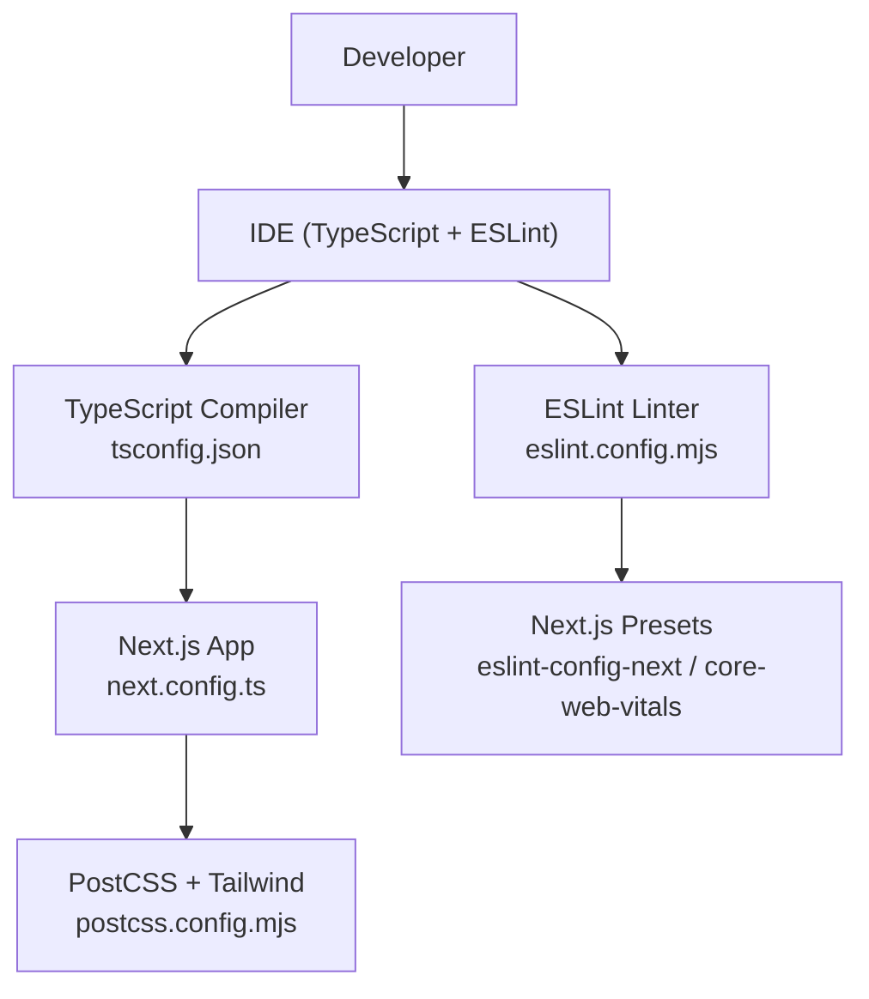
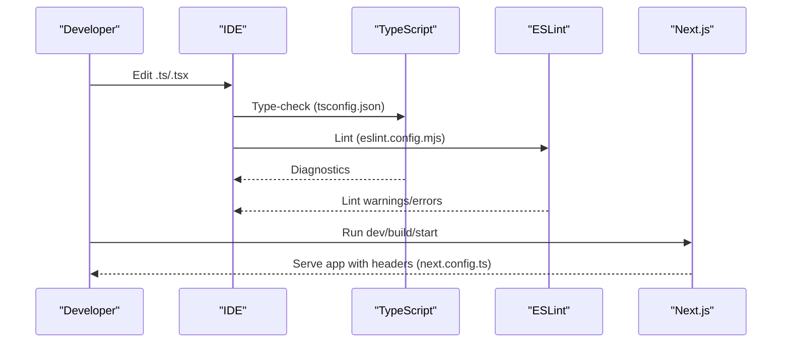
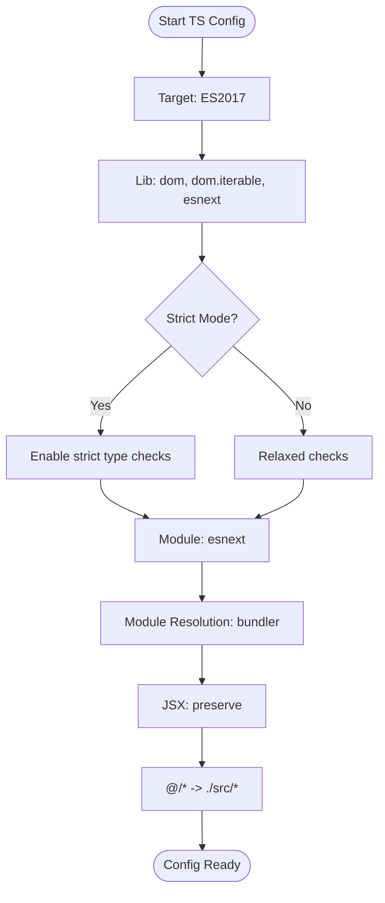
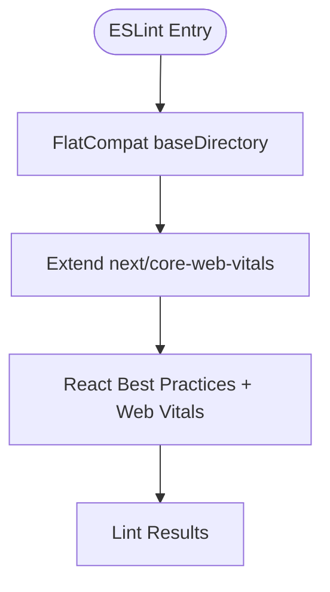
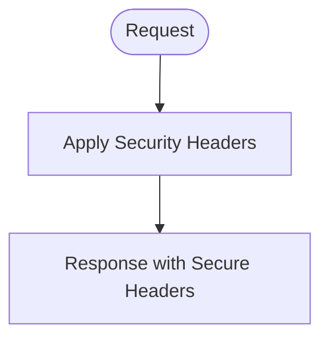
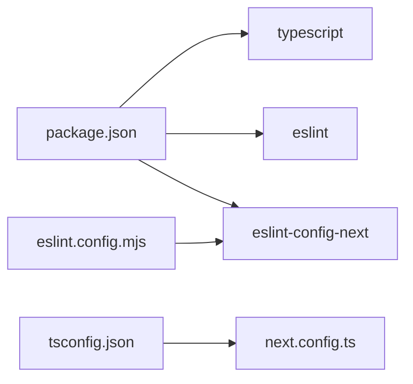

# Code Quality Tools

<cite>
**Referenced Files in This Document**
- [tsconfig.json](file://tsconfig.json)
- [eslint.config.mjs](file://eslint.config.mjs)
- [package.json](file://package.json)
- [next.config.ts](file://next.config.ts)
- [postcss.config.mjs](file://postcss.config.mjs)
- [README.md](file://README.md)
</cite>

## Table of Contents
1. [Introduction](#introduction)
2. [Project Structure](#project-structure)
3. [Core Components](#core-components)
4. [Architecture Overview](#architecture-overview)
5. [Detailed Component Analysis](#detailed-component-analysis)
6. [Dependency Analysis](#dependency-analysis)
7. [Performance Considerations](#performance-considerations)
8. [Troubleshooting Guide](#troubleshooting-guide)
9. [Conclusion](#conclusion)
10. [Appendices](#appendices)

## Introduction
This document explains MedAce-AI’s code quality tooling with a focus on TypeScript configuration and ESLint setup. It covers compiler options, module resolution, target versions, path mappings, ESLint rules for React best practices, type checking, security scanning, and style enforcement. It also provides guidance for IDE integration, pre-commit automation, and extending or modifying rules to match team preferences while preserving consistency.

## Project Structure
At the root of the project are the key configuration files that define how TypeScript compiles your code and how ESLint checks it:
- TypeScript configuration is defined in tsconfig.json.
- ESLint configuration is defined in eslint.config.mjs using the modern flat config format.
- Next.js integration is provided via eslint-config-next and next/core-web-vitals presets.
- PostCSS and Tailwind CSS are configured in postcss.config.mjs.
- Security headers are set in next.config.ts.

**Diagram sources**
- [tsconfig.json:1-28](file://tsconfig.json#L1-L28)
- [eslint.config.mjs:1-15](file://eslint.config.mjs#L1-L15)
- [next.config.ts:1-25](file://next.config.ts#L1-L25)
- [postcss.config.mjs:1-9](file://postcss.config.mjs#L1-L9)

**Section sources**
- [tsconfig.json:1-28](file://tsconfig.json#L1-L28)
- [eslint.config.mjs:1-15](file://eslint.config.mjs#L1-L15)
- [next.config.ts:1-25](file://next.config.ts#L1-L25)
- [postcss.config.mjs:1-9](file://postcss.config.mjs#L1-L9)

## Core Components
- TypeScript compiler options: strict mode enabled, ES2017 target, esnext module and moduleResolution bundler, JSX preserve, isolatedModules, incremental builds, JSON imports, and path aliases.
- ESLint: Flat config using @eslint/eslintrc compatibility layer to extend next/core-web-vitals, which brings Next.js-specific React and performance rules.
- Scripts: npm run lint executes Next.js-integrated ESLint checks.

Key highlights:
- Strict mode ensures strong type safety across the codebase.
- Path mapping @/* resolves to ./src/* for clean imports.
- Module resolution uses bundler strategy suitable for Next.js and modern toolchains.
- ESLint leverages Next.js recommended rules for React best practices and web vitals.

**Section sources**
- [tsconfig.json:1-28](file://tsconfig.json#L1-L28)
- [eslint.config.mjs:1-15](file://eslint.config.mjs#L1-L15)
- [package.json:5-10](file://package.json#L5-L10)

## Architecture Overview
The code quality pipeline integrates TypeScript and ESLint into development workflows:
- TypeScript validates types and compiles according to tsconfig.json.
- ESLint enforces style, correctness, and React/Next.js best practices.
- Next.js configuration adds runtime security headers and integrates with the build process.
- PostCSS processes styles with Tailwind CSS.

**Diagram sources**
- [tsconfig.json:1-28](file://tsconfig.json#L1-L28)
- [eslint.config.mjs:1-15](file://eslint.config.mjs#L1-L15)
- [next.config.ts:1-25](file://next.config.ts#L1-L25)

## Detailed Component Analysis

### TypeScript Configuration
- Target and libraries:
  - Target: ES2017 for broad compatibility.
  - Lib includes DOM APIs and modern features.
- Strictness and safety:
  - Strict mode enabled for comprehensive type checking.
  - noEmit true since Next.js handles compilation output.
  - isolatedModules ensures modules can be transformed independently.
- Module system:
  - module set to esnext with moduleResolution bundler for modern bundlers like Next.js.
  - allowJs enables mixed JS/TS projects.
  - resolveJsonModule allows importing JSON.
- JSX handling:
  - jsx preserve delegates JSX transformation to Next.js/Bundler.
- Incremental builds:
  - incremental enabled for faster rebuilds.
- Path aliases:
  - @/* maps to ./src/* for cleaner imports.

**Diagram sources**
- [tsconfig.json:1-28](file://tsconfig.json#L1-L28)

**Section sources**
- [tsconfig.json:1-28](file://tsconfig.json#L1-L28)

### ESLint Configuration
- Flat config with compatibility layer:
  - Uses @eslint/eslintrc FlatCompat to bridge legacy configs.
- Extends Next.js core-web-vitals:
  - Brings Next.js-specific React rules and performance-focused checks.
- Integration:
  - npm run lint runs Next.js-integrated ESLint.

**Diagram sources**
- [eslint.config.mjs:1-15](file://eslint.config.mjs#L1-L15)

**Section sources**
- [eslint.config.mjs:1-15](file://eslint.config.mjs#L1-L15)
- [package.json:5-10](file://package.json#L5-L10)

### Next.js Security Headers
- Adds important security headers globally:
  - X-Frame-Options DENY
  - X-Content-Type-Options nosniff
  - Referrer-Policy origin-when-cross-origin
  - Permissions-Policy restricting camera, microphone, geolocation

**Diagram sources**
- [next.config.ts:1-25](file://next.config.ts#L1-L25)

**Section sources**
- [next.config.ts:1-25](file://next.config.ts#L1-L25)

### PostCSS and Tailwind CSS
- PostCSS plugin configuration for Tailwind CSS v4 processing.

**Section sources**
- [postcss.config.mjs:1-9](file://postcss.config.mjs#L1-L9)

## Dependency Analysis
- TypeScript and ESLint are installed as devDependencies.
- Next.js integration relies on eslint-config-next and next/core-web-vitals.
- The scripts section exposes npm run lint to execute checks.

**Diagram sources**
- [package.json:29-41](file://package.json#L29-L41)
- [eslint.config.mjs:1-15](file://eslint.config.mjs#L1-L15)
- [tsconfig.json:1-28](file://tsconfig.json#L1-L28)
- [next.config.ts:1-25](file://next.config.ts#L1-L25)

**Section sources**
- [package.json:29-41](file://package.json#L29-L41)
- [eslint.config.mjs:1-15](file://eslint.config.mjs#L1-L15)

## Performance Considerations
- Use incremental TypeScript builds to speed up repeated checks.
- Keep strict mode enabled to catch issues early and reduce runtime errors.
- Rely on Next.js presets for efficient rule sets tailored to React and web performance.
- Avoid heavy custom rules unless necessary; prefer established presets and plugins.

[No sources needed since this section provides general guidance]

## Troubleshooting Guide
Common issues and resolutions:
- TypeScript errors under strict mode:
  - Fix undefined/null handling, ensure proper typing for props and API responses.
  - Resolve module import paths using @/* alias consistently.
- ESLint warnings from Next.js presets:
  - Follow React best practices (e.g., keys in lists, prop validation).
  - Address performance-related lint rules from core-web-vitals.
- Build-time vs compile-time:
  - Since noEmit is true, rely on IDE diagnostics and npm run lint for feedback.

Typical fixes:
- Add explicit types where missing to satisfy strict checks.
- Use consistent import paths via @/* to avoid resolution issues.
- Update dependencies to latest compatible versions if encountering known issues.

**Section sources**
- [tsconfig.json:1-28](file://tsconfig.json#L1-L28)
- [eslint.config.mjs:1-15](file://eslint.config.mjs#L1-L15)
- [package.json:5-10](file://package.json#L5-L10)

## Conclusion
MedAce-AI employs a robust code quality setup:
- TypeScript with strict mode and modern module settings ensures type safety and compatibility.
- ESLint built on Next.js presets enforces React best practices and performance-oriented rules.
- Security headers in Next.js configuration harden the application at the server level.
- The configuration is minimal yet effective, allowing teams to extend rules thoughtfully while maintaining consistency.

[No sources needed since this section summarizes without analyzing specific files]

## Appendices

### IDE Integration Guidelines
- Enable TypeScript language service:
  - Ensure your IDE uses the project’s tsconfig.json for accurate diagnostics.
- Enable ESLint integration:
  - Configure your IDE to use the project’s eslint.config.mjs.
  - Turn on “Run ESLint on save” for real-time feedback.
- Path aliases:
  - Make sure your IDE recognizes @/* mapping to ./src/* for correct navigation and auto-imports.

[No sources needed since this section provides general guidance]

### Pre-commit Hooks for Automated Checks
- Recommended workflow:
  - Install a pre-commit hook runner (e.g., Husky).
  - On commit, run npm run lint to enforce ESLint rules.
  - Optionally run TypeScript checks (tsc --noEmit) to validate types before committing.
- Benefits:
  - Prevents low-quality code from entering the repository.
  - Encourages consistent coding standards across the team.

[No sources needed since this section provides general guidance]

### Extending or Modifying Rules
- Adding custom ESLint rules:
  - Extend the existing flat config by adding additional rule objects after the preset extension.
  - Use shared configurations or plugins to introduce new checks (e.g., security scanning, stricter style rules).
- Aligning with team preferences:
  - Create a local override file or extend an internal shared config.
  - Document any deviations from the base presets to maintain clarity.
- Maintaining consistency:
  - Prefer established presets and plugins over ad-hoc rules.
  - Review and update rules periodically to keep them relevant and effective.

[No sources needed since this section provides general guidance]