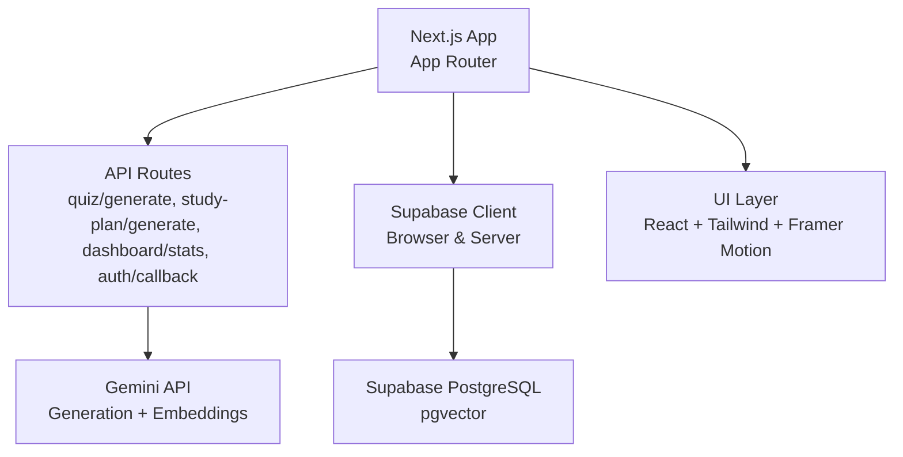
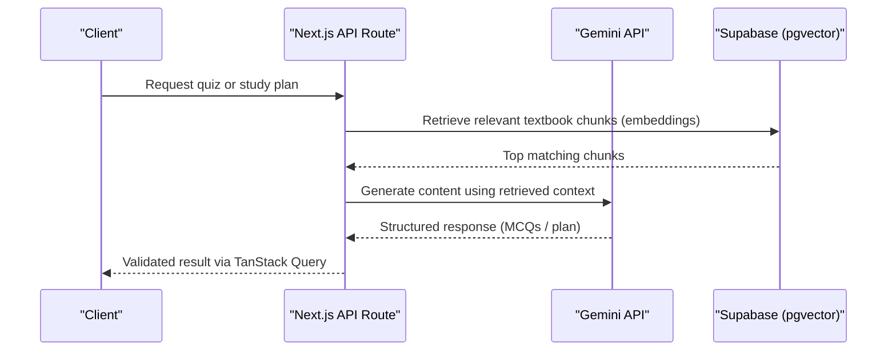
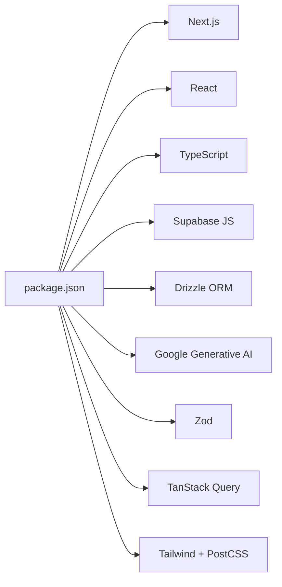

# Contribution Guidelines

<cite>
**Referenced Files in This Document**
- [README.md](file://README.md)
- [package.json](file://package.json)
- [.gitignore](file://.gitignore)
- [next.config.ts](file://next.config.ts)
- [tsconfig.json](file://tsconfig.json)
- [eslint.config.mjs](file://eslint.config.mjs)
- [postcss.config.mjs](file://postcss.config.mjs)
- [supabase/schema.sql](file://supabase/schema.sql)
- [src/middleware.ts](file://src/middleware.ts)
- [src/lib/utils.ts](file://src/lib/utils.ts)
</cite>

## Table of Contents
1. Introduction
2. Project Structure
3. Core Components
4. Architecture Overview
5. Detailed Component Analysis
6. Dependency Analysis
7. Performance Considerations
8. Troubleshooting Guide
9. Conclusion
10. Appendices

## Introduction
This document establishes clear development standards and collaboration processes for contributing to MedAce-AI. It covers environment setup, Git workflow conventions, code review standards, feature/bug/documentation contribution guidelines, release procedures, troubleshooting, and community interaction practices. The goal is to ensure consistent, high-quality contributions that align with the project’s architecture and design principles.

## Project Structure
MedAce-AI is a Next.js 15 application using React 19, TypeScript, Tailwind CSS v4, Supabase (PostgreSQL + pgvector), Drizzle ORM, TanStack Query, Google Gemini for AI generation and embeddings, and Framer Motion for animations. The app includes API routes for quiz generation, study plan generation, dashboard stats, and an auth callback. RAG-based question generation uses textbook chapters ingested into a vector store.

**Diagram sources**
- [README.md:27-83](file://README.md#L27-L83)
- [README.md:170-253](file://README.md#L170-L253)

**Section sources**
- [README.md:27-83](file://README.md#L27-L83)
- [README.md:170-253](file://README.md#L170-L253)

## Core Components
- Frontend: Next.js pages and components under src/app and src/components.
- Backend: API routes under src/app/api for quiz generation, study plans, dashboard stats, and auth callback.
- Data: Supabase schema defines users/profiles, textbook chunks (RAG), quiz sessions/questions/responses, and study plans.
- Utilities: Shared helpers like cn() for class merging and formatting utilities.
- Middleware: Route protection logic placeholder for future Supabase session checks.

Key responsibilities:
- Quiz generation pipeline integrates Gemini and pgvector retrieval.
- Study plan generator produces weekly plans based on user goals.
- Dashboard stats aggregate performance metrics.
- Auth callback handles OAuth flow via Supabase.

**Section sources**
- [README.md:170-253](file://README.md#L170-L253)
- [supabase/schema.sql:11-109](file://supabase/schema.sql#L11-L109)
- [src/lib/utils.ts:1-34](file://src/lib/utils.ts#L1-L34)
- [src/middleware.ts:1-41](file://src/middleware.ts#L1-L41)

## Architecture Overview
The system follows a layered architecture:
- Presentation layer: Next.js App Router with React components and Tailwind styling.
- API layer: Server-side route handlers orchestrate business logic and external calls.
- Data layer: Supabase PostgreSQL with pgvector for semantic search; Drizzle ORM for type-safe queries.
- AI layer: Google Gemini provides MCQ generation and embeddings for RAG.

**Diagram sources**
- [README.md:84-127](file://README.md#L84-L127)
- [README.md:170-253](file://README.md#L170-L253)

## Detailed Component Analysis

### Development Environment Setup
- Node.js version: Use a recent LTS compatible with Next.js 15 and TypeScript 5. Verify your local Node version matches the toolchain used by the project dependencies.
- Install dependencies: Run the package manager install command defined in scripts.
- Environment variables: Copy the example env file and fill in Supabase, Gemini, and database credentials as documented.
- Database migrations: Apply Drizzle migrations before running locally.
- Ingest textbooks: Run the ingestion script once to populate the vector store with textbook chunks.
- Start server: Launch the development server and open the local URL.

Environment variables are required for Supabase, Gemini, and the database connection. Security headers are configured at the framework level.

**Section sources**
- [README.md:255-271](file://README.md#L255-L271)
- [README.md:414-445](file://README.md#L414-L445)
- [next.config.ts:1-25](file://next.config.ts#L1-L25)

### Git Workflow Conventions
- Branch naming: Use descriptive prefixes such as feature/, bugfix/, refactor/, docs/ followed by a short slug (e.g., feature/quiz-range).
- Commit messages: Follow a conventional format (type: description) to keep history readable and automatable.
- Pull requests: Create PRs from feature branches to main, include a clear description, link issues, and attach screenshots or logs when applicable. Ensure CI passes and all reviewers approve before merge.

[No sources needed since this section doesn't analyze specific files]

### Code Review Standards
- Code style: Enforce ESLint rules configured for Next.js core web vitals. Run linting locally before pushing changes.
- Type safety: Maintain strict TypeScript settings; avoid any types and ensure interfaces are explicit.
- Architecture patterns: Keep API routes focused on orchestration; move business logic to lib modules; use Zod schemas for validation; prefer server-side data fetching where appropriate.
- Performance considerations: Minimize unnecessary re-renders, leverage TanStack Query caching, and optimize vector retrieval thresholds and chunk sizes for RAG.

**Section sources**
- [eslint.config.mjs:1-15](file://eslint.config.mjs#L1-L15)
- [tsconfig.json:1-28](file://tsconfig.json#L1-L28)
- [README.md:27-83](file://README.md#L27-L83)

### Adding New Features
- Plan: Define scope, user flows, and data model changes. Update schema if needed and provide migration steps.
- Implement: Add API routes and components following existing patterns. Validate inputs with Zod and return structured responses.
- Test: Verify end-to-end flows locally, including RAG retrieval and AI generation.
- Document: Update README sections describing new features and usage.

**Section sources**
- [README.md:170-253](file://README.md#L170-L253)
- [README.md:255-271](file://README.md#L255-L271)

### Fixing Bugs
- Reproduce: Isolate the issue and add minimal reproduction steps.
- Root cause: Identify whether it lies in UI, API, DB, or AI integration.
- Fix: Apply targeted changes with tests or manual verification. Avoid broad refactors unless necessary.
- Validate: Confirm fixes across devices and scenarios; update documentation if behavior changed.

[No sources needed since this section doesn't analyze specific files]

### Updating Documentation
- Keep README current with environment setup, scripts, and deployment notes.
- Reflect architectural changes, new endpoints, and updated dependencies.
- Include examples for common tasks like ingestion and migrations.

**Section sources**
- [README.md:414-453](file://README.md#L414-L453)

### Release Process
- Versioning: Increment version in package.json according to semantic versioning principles.
- Changelog: Maintain a changelog summarizing notable changes per release.
- Deployment: Deploy to Vercel with environment variables configured. Ensure migrations and ingestion are applied in production.

**Section sources**
- [package.json:1-43](file://package.json#L1-L43)
- [README.md:448-453](file://README.md#L448-L453)

## Dependency Analysis
MedAce-AI depends on Next.js, React, TypeScript, Supabase clients, Drizzle ORM, Gemini SDK, Zod, TanStack Query, and UI libraries. Dev dependencies include tooling for linting, PostCSS/Tailwind, and type definitions.

**Diagram sources**
- [package.json:1-43](file://package.json#L1-L43)

**Section sources**
- [package.json:1-43](file://package.json#L1-L43)

## Performance Considerations
- Vector retrieval: Tune match thresholds and counts to balance relevance and latency.
- AI generation: Batch prompts and minimize token usage; cache repeated results where safe.
- UI rendering: Use TanStack Query for caching and optimistic updates; avoid heavy computations on the main thread.
- Build optimizations: Leverage Next.js incremental builds and tree-shaking; keep dependencies minimal.

[No sources needed since this section provides general guidance]

## Troubleshooting Guide
Common issues and resolutions:
- Missing environment variables: Ensure Supabase URLs/keys, Gemini API key, and DATABASE_URL are set.
- Migration failures: Re-run Drizzle generate and migrate commands against the correct database.
- Vector store empty: Re-run the textbook ingestion script after verifying credentials and permissions.
- Lint/type errors: Run linter and TypeScript checks; fix strict mode violations.
- Route protection: If enabling middleware authentication, configure Supabase cookie checks accordingly.

Security headers are enforced globally; verify they do not interfere with third-party integrations.

**Section sources**
- [README.md:255-271](file://README.md#L255-L271)
- [README.md:414-445](file://README.md#L414-L445)
- [next.config.ts:1-25](file://next.config.ts#L1-L25)
- [src/middleware.ts:1-41](file://src/middleware.ts#L1-L41)

## Conclusion
By adhering to these contribution guidelines—environment setup, Git workflows, code review standards, and release procedures—you help maintain MedAce-AI’s quality, performance, and reliability. Consistent practices ensure smooth collaboration and a better experience for students preparing for MDCAT.

[No sources needed since this section summarizes without analyzing specific files]

## Appendices

### Appendix A: Local Development Checklist
- Install dependencies and set environment variables.
- Apply database migrations and ingest textbook content.
- Start the dev server and verify core flows (auth, quiz generation, study plan).
- Run linter and type checks before committing.

**Section sources**
- [README.md:414-445](file://README.md#L414-L445)

### Appendix B: Database Schema Reference
Key tables include profiles, textbook_chunks (with HNSW index), quiz_sessions, quiz_questions, user_responses, and study_plans. Row-level security policies restrict access to user-owned data.

**Section sources**
- [supabase/schema.sql:11-109](file://supabase/schema.sql#L11-L109)
- [supabase/schema.sql:153-229](file://supabase/schema.sql#L153-L229)

### Appendix C: Utility Helpers
Shared helpers include class name merging and formatting functions used across components.

**Section sources**
- [src/lib/utils.ts:1-34](file://src/lib/utils.ts#L1-L34)