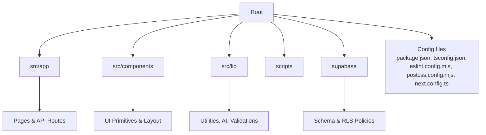
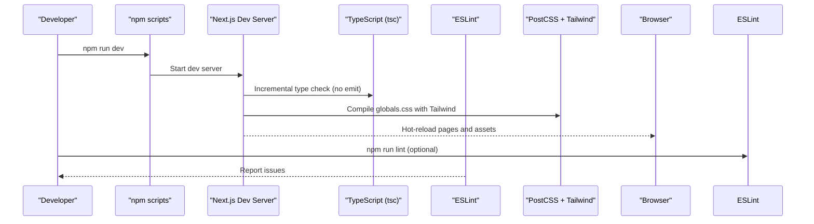
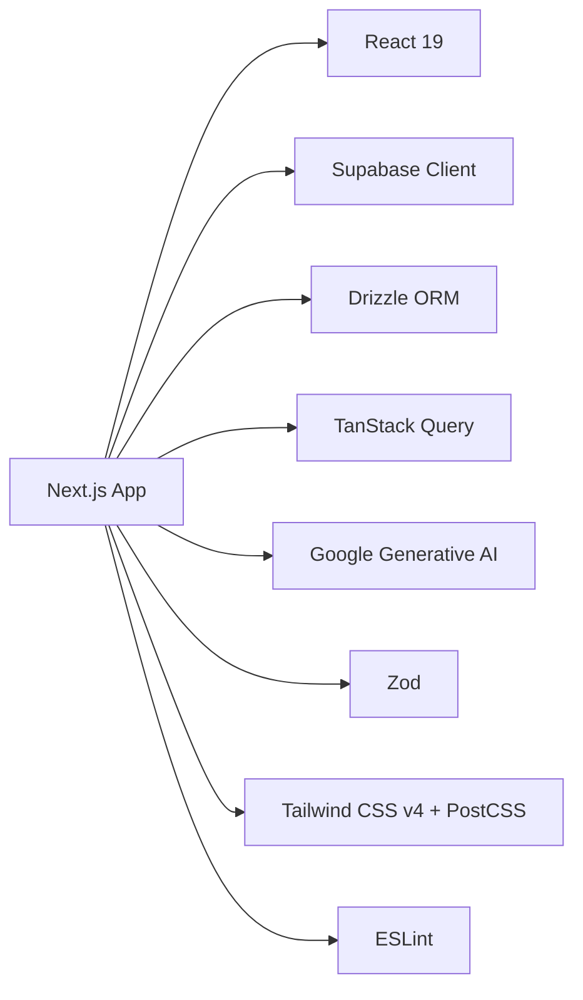

# Development Workflow

<cite>
**Referenced Files in This Document**
- [package.json](file://package.json)
- [tsconfig.json](file://tsconfig.json)
- [eslint.config.mjs](file://eslint.config.mjs)
- [postcss.config.mjs](file://postcss.config.mjs)
- [next.config.ts](file://next.config.ts)
- [README.md](file://README.md)
- [src/app/layout.tsx](file://src/app/layout.tsx)
- [src/app/globals.css](file://src/app/globals.css)
- [src/middleware.ts](file://src/middleware.ts)
- [supabase/schema.sql](file://supabase/schema.sql)
</cite>

## Table of Contents
1. Introduction
2. Project Structure
3. Core Components
4. Architecture Overview
5. Detailed Component Analysis
6. Dependency Analysis
7. Performance Considerations
8. Troubleshooting Guide
9. Conclusion
10. Appendices

## Introduction
This document defines the development workflow and code quality standards for MedAce-AI, a Next.js 15 application built with TypeScript, Tailwind CSS v4, Supabase, and Google Gemini. It covers environment setup, configuration (TypeScript, ESLint, PostCSS/Tailwind), development server usage, build pipeline, contribution guidelines, testing strategy, and performance monitoring/profiling. The goal is to ensure consistent practices across the team and maintain high code quality from local development through production deployment.

## Project Structure
MedAce-AI follows a Next.js App Router layout:
- src/app: Pages, API routes, global styles, and root layout
- src/components: UI primitives and layout components
- src/lib: Utilities, AI integrations, validations, data helpers
- supabase: Database schema and vector search functions
- scripts: Data ingestion and verification utilities
- Configuration files at repository root: package.json, tsconfig.json, eslint.config.mjs, postcss.config.mjs, next.config.ts

**Section sources**
- [README.md:170-253](file://README.md#L170-L253)

## Core Components
- Framework and runtime: Next.js 15 with React 19, TypeScript 5
- Styling: Tailwind CSS v4 via PostCSS with custom design tokens and utilities
- Linting: ESLint using Next’s core-web-vitals preset
- Type safety: Strict TypeScript compiler options with path aliases
- Security headers: Centralized security headers via Next config
- Middleware: Route protection scaffolding for future auth integration

Key responsibilities:
- Build and dev scripts orchestrate the development lifecycle
- TypeScript enforces strict typing and module resolution
- ESLint ensures consistent style and best practices
- PostCSS/Tailwind compile utility-first CSS with responsive patterns
- Next config secures responses and integrates with app metadata

**Section sources**
- [package.json:5-10](file://package.json#L5-L10)
- [tsconfig.json:1-27](file://tsconfig.json#L1-L27)
- [eslint.config.mjs:1-15](file://eslint.config.mjs#L1-L15)
- [postcss.config.mjs:1-9](file://postcss.config.mjs#L1-L9)
- [next.config.ts:1-25](file://next.config.ts#L1-L25)
- [src/app/layout.tsx:1-57](file://src/app/layout.tsx#L1-L57)
- [src/middleware.ts:1-41](file://src/middleware.ts#L1-L41)

## Architecture Overview
The development workflow spans configuration, tooling, and runtime:

**Diagram sources**
- [package.json:5-10](file://package.json#L5-L10)
- [tsconfig.json:1-27](file://tsconfig.json#L1-L27)
- [postcss.config.mjs:1-9](file://postcss.config.mjs#L1-L9)
- [next.config.ts:1-25](file://next.config.ts#L1-L25)

**Section sources**
- [package.json:5-10](file://package.json#L5-L10)
- [tsconfig.json:1-27](file://tsconfig.json#L1-L27)
- [postcss.config.mjs:1-9](file://postcss.config.mjs#L1-L9)
- [next.config.ts:1-25](file://next.config.ts#L1-L25)

## Detailed Component Analysis

### TypeScript Configuration
- Target and modules: ES2017 target, esnext module, bundler module resolution
- Strict mode enabled for robust type checking; isolatedModules for faster builds
- Path alias @/* mapped to src/* for clean imports
- JSX preserved for Next.js processing; incremental compilation enabled
- Includes generated types and excludes node_modules

Best practices:
- Keep strict mode on to catch errors early
- Use path aliases consistently to avoid deep relative imports
- Leverage incremental builds for faster feedback loops

**Section sources**
- [tsconfig.json:1-27](file://tsconfig.json#L1-L27)

### ESLint Configuration
- Uses Next’s core-web-vitals preset for performance-focused rules
- Flat config format with compatibility layer for ecosystem tools

Guidelines:
- Run linting locally before committing
- Fix warnings promptly to maintain code health
- Extend or customize rules if needed for project-specific needs

**Section sources**
- [eslint.config.mjs:1-15](file://eslint.config.mjs#L1-L15)

### PostCSS and Tailwind CSS Setup
- PostCSS configured with @tailwindcss/postcss plugin
- Global styles define design tokens, base styles, utilities, and keyframes
- Utility-first CSS enables rapid UI composition and responsive layouts

Patterns:
- Use design tokens for colors, fonts, and effects
- Apply utility classes for spacing, typography, and layout
- Compose complex styles with layered utilities and custom animations

**Section sources**
- [postcss.config.mjs:1-9](file://postcss.config.mjs#L1-L9)
- [src/app/globals.css:1-300](file://src/app/globals.css#L1-L300)

### Next.js Configuration and Security Headers
- Centralized security headers applied to all routes
- Metadata defined in root layout for SEO and social sharing

Recommendations:
- Review and extend headers based on compliance needs
- Keep metadata updated per page to improve discoverability

**Section sources**
- [next.config.ts:1-25](file://next.config.ts#L1-L25)
- [src/app/layout.tsx:1-57](file://src/app/layout.tsx#L1-L57)

### Middleware and Protected Routes
- Middleware scaffolds route protection logic for authenticated areas
- Public vs protected routes are declared for future auth enforcement

Workflow:
- Add new protected routes to the list
- Implement session checks when integrating Supabase Auth fully

**Section sources**
- [src/middleware.ts:1-41](file://src/middleware.ts#L1-L41)

### Database Schema and Vector Search
- PostgreSQL schema includes profiles, textbook chunks, quiz sessions/questions/responses, study plans
- pgvector extension used for embeddings with HNSW index for fast similarity search
- Row-level security policies enforce user-scoped access
- RPC function match_chunks performs cosine similarity queries

Development notes:
- Use Drizzle migrations to keep schema in sync
- Validate vector dimensions and indexes after updates

**Section sources**
- [supabase/schema.sql:1-250](file://supabase/schema.sql#L1-L250)

## Dependency Analysis
Core dependencies and their roles:
- Next.js, React, ReactDOM: Application framework and UI runtime
- Supabase JS/SSR: Authentication and database client
- Drizzle ORM: Type-safe database operations
- TanStack Query: Server state caching and synchronization
- Google Generative AI: MCQ generation and explanations
- Zod: Runtime validation for inputs and outputs
- Tailwind CSS v4 + PostCSS: Utility-first styling pipeline
- ESLint: Code quality and performance rules

**Diagram sources**
- [package.json:11-41](file://package.json#L11-L41)

**Section sources**
- [package.json:11-41](file://package.json#L11-L41)

## Performance Considerations
- TypeScript incremental builds reduce compile times during development
- Tailwind CSS v4 compiles efficiently with PostCSS; use utility classes to minimize custom CSS
- Next.js handles code splitting automatically; leverage dynamic imports for heavy features
- Security headers mitigate common vulnerabilities without runtime overhead
- Database indexing (HNSW) optimizes vector similarity queries for RAG workflows

[No sources needed since this section provides general guidance]

## Troubleshooting Guide
Common issues and resolutions:
- Environment variables missing: Ensure .env.local contains Supabase, Gemini, and database credentials
- Database migrations out of sync: Regenerate and apply Drizzle migrations
- Vector store not populated: Run textbook ingestion script once to populate embeddings
- Linting failures: Run npm run lint and fix reported issues before committing
- Middleware blocking routes: Verify protected routes list and implement session checks when enabling auth

Debugging techniques:
- Use browser DevTools for frontend debugging and network inspection
- Inspect Next.js dev server logs for build and runtime errors
- Validate Zod schemas around API routes to catch invalid payloads early
- Check Supabase dashboard for query performance and RLS policy behavior

**Section sources**
- [README.md:414-433](file://README.md#L414-L433)
- [supabase/schema.sql:153-229](file://supabase/schema.sql#L153-L229)

## Conclusion
MedAce-AI’s development workflow emphasizes strict type safety, modern styling, secure defaults, and efficient tooling. By following the configuration guidelines, adhering to linting rules, and leveraging Next.js and Tailwind CSS capabilities, teams can maintain high code quality and deliver performant features. Adopt the suggested contribution and testing practices to streamline collaboration and ensure reliable releases.

[No sources needed since this section summarizes without analyzing specific files]

## Appendices

### Development Environment Setup
- Install dependencies and configure environment variables
- Run database migrations and ingest textbook content
- Start the development server with hot reloading

Steps:
- npm install
- Copy .env.example to .env.local and fill credentials
- Generate and apply Drizzle migrations
- Ingest textbooks into vector store
- Start dev server

**Section sources**
- [README.md:414-433](file://README.md#L414-L433)

### Build Process and Production Optimization
- Build command produces optimized assets with Next.js
- Tree shaking and code splitting handled by the framework
- Asset optimization occurs during build; review bundle size if needed

Commands:
- npm run build
- npm run start

**Section sources**
- [package.json:5-10](file://package.json#L5-L10)
- [README.md:437-444](file://README.md#L437-L444)

### Contribution Guidelines
- Commit conventions: Use clear, descriptive messages referencing feature or fix scope
- Pull requests: Include description, related issues, and screenshots where applicable
- Code review standards: Ensure TypeScript compiles, ESLint passes, and changes align with architecture
- Testing: Add unit/integration tests for critical paths; validate API contracts with Zod

[No sources needed since this section provides general guidance]

### Testing Strategy
- Unit tests: Validate utility functions and component logic
- Integration tests: Test API routes and database interactions
- End-to-end tests: Simulate user flows across pages and features
- Tools: Integrate a test runner compatible with Next.js and TypeScript

[No sources needed since this section provides general guidance]

### Performance Monitoring and Profiling
- Frontend: Use browser performance profiler and React DevTools
- Backend: Monitor API route latency and database query performance
- Analytics: Enable Vercel Analytics for web vitals and usage tracking
- RAG performance: Tune vector search thresholds and chunk sizes

**Section sources**
- [README.md:27-83](file://README.md#L27-L83)