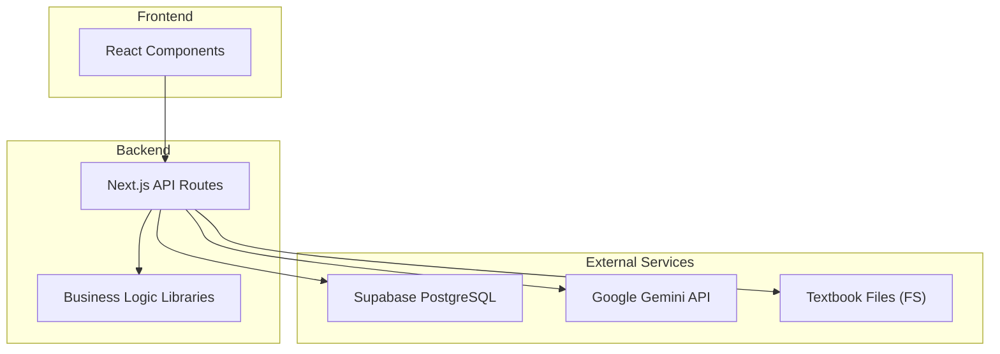
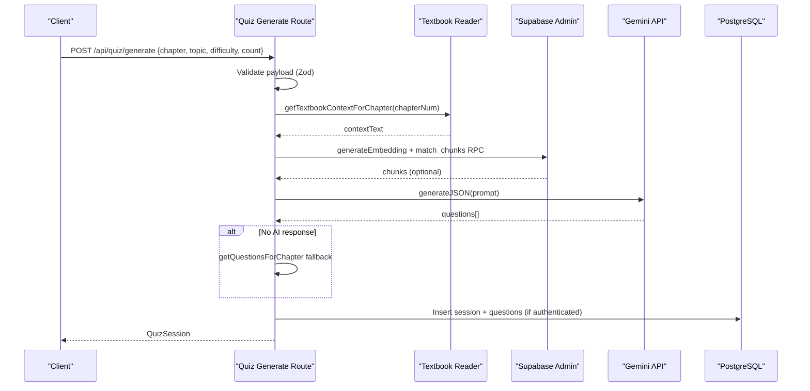
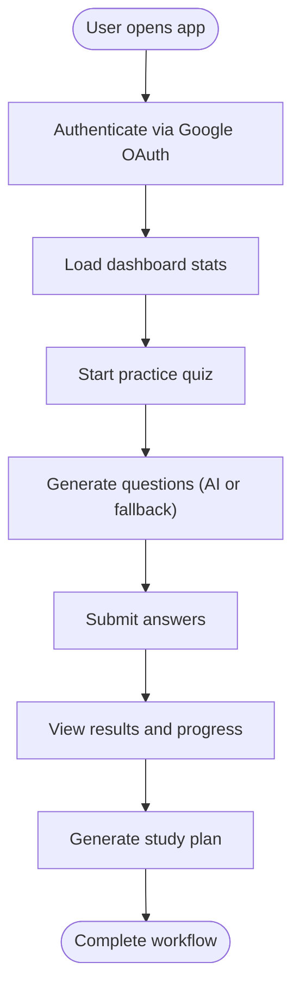
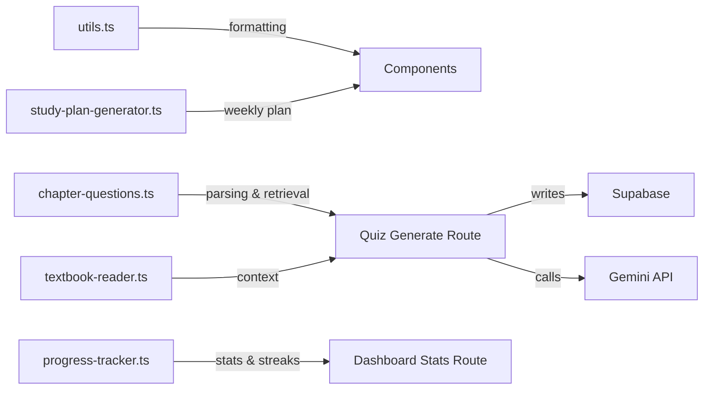

# Testing Strategy

<cite>
**Referenced Files in This Document**
- [package.json](file://package.json)
- [README.md](file://README.md)
- [src/lib/utils.ts](file://src/lib/utils.ts)
- [src/lib/mock-data.ts](file://src/lib/mock-data.ts)
- [src/lib/chapter-questions.ts](file://src/lib/chapter-questions.ts)
- [src/lib/progress-tracker.ts](file://src/lib/progress-tracker.ts)
- [src/lib/study-plan-generator.ts](file://src/lib/study-plan-generator.ts)
- [src/lib/textbook-reader.ts](file://src/lib/textbook-reader.ts)
- [src/app/api/quiz/generate/route.ts](file://src/app/api/quiz/generate/route.ts)
- [src/app/api/dashboard/stats/route.ts](file://src/app/api/dashboard/stats/route.ts)
</cite>

## Table of Contents
1. Introduction
2. Project Structure
3. Core Components
4. Architecture Overview
5. Detailed Component Analysis
6. Dependency Analysis
7. Performance Considerations
8. Troubleshooting Guide
9. Conclusion
10. Appendices

## Introduction
This document defines a comprehensive testing strategy for MedAce-AI to ensure reliability across unit, integration, and end-to-end layers. It focuses on:
- Unit tests for utility functions, business logic, and data processing modules
- Integration tests for API routes, database operations, AI service integrations, and external APIs
- End-to-end tests for user workflows including authentication, quiz generation, and progress tracking
- Mocking strategies for AI services, database connections, and third-party APIs
- Test data management using existing mock utilities and fixtures
- Guidelines for maintainable tests, file organization, and coverage measurement
- Performance testing considerations and continuous integration setup

The goal is to provide clear, actionable guidance that scales with the application’s complexity while keeping tests fast, deterministic, and easy to maintain.

## Project Structure
MedAce-AI is a Next.js 15 application with server-side API routes, client components, and libraries for AI, Supabase, and domain logic. The testing strategy aligns with this structure:
- Library modules (pure or side-effect-light) are ideal for unit tests
- API routes require integration tests with mocked external dependencies
- UI components can be tested with component-level tests and E2E flows
- Data and fixtures live under lib/mock-data.ts and types

[No sources needed since this diagram shows conceptual workflow, not actual code structure]

## Core Components
Key areas requiring robust test coverage:
- Utility functions for formatting and class merging
- Chapter question parsing and retrieval
- Progress calculation and streak computation
- Study plan generation based on weak topics
- Textbook reader for RAG context
- API routes for quiz generation and dashboard stats

Testing priorities:
- Pure functions: utils, chapter-questions parsing, progress calculations
- Side-effect-heavy modules: textbook reader, study plan generator
- API routes: validation, error handling, fallback behavior, DB writes
- External integrations: Gemini calls, Supabase queries

**Section sources**
- [src/lib/utils.ts:1-34](file://src/lib/utils.ts#L1-L34)
- [src/lib/chapter-questions.ts:1-800](file://src/lib/chapter-questions.ts#L1-L800)
- [src/lib/progress-tracker.ts:1-192](file://src/lib/progress-tracker.ts#L1-L192)
- [src/lib/study-plan-generator.ts:1-102](file://src/lib/study-plan-generator.ts#L1-L102)
- [src/lib/textbook-reader.ts:1-46](file://src/lib/textbook-reader.ts#L1-L46)
- [src/app/api/quiz/generate/route.ts:1-196](file://src/app/api/quiz/generate/route.ts#L1-L196)
- [src/app/api/dashboard/stats/route.ts:1-181](file://src/app/api/dashboard/stats/route.ts#L1-L181)

## Architecture Overview
The quiz generation flow integrates multiple systems:
- Input validation via Zod schemas
- Textbook content retrieval from local files
- Optional vector search via Supabase RPC
- AI question generation via Gemini
- Fallback to built-in chapter questions
- Session persistence to Supabase

**Diagram sources**
- [src/app/api/quiz/generate/route.ts:1-196](file://src/app/api/quiz/generate/route.ts#L1-L196)
- [src/lib/textbook-reader.ts:1-46](file://src/lib/textbook-reader.ts#L1-L46)

**Section sources**
- [src/app/api/quiz/generate/route.ts:1-196](file://src/app/api/quiz/generate/route.ts#L1-L196)
- [src/lib/textbook-reader.ts:1-46](file://src/lib/textbook-reader.ts#L1-L46)

## Detailed Component Analysis

### Unit Testing Strategy
Focus on pure functions and deterministic logic:
- Formatting utilities: date/time formatting, score color mapping
- Chapter number parsing and question selection
- Progress tracker calculations: accuracy, streak, weak topics, chapter performance
- Study plan generator logic: week boundaries, topic assignment, status determination

Recommended approach:
- Use Jest for unit tests
- Isolate side effects by mocking filesystem, localStorage, and network calls
- Assert function outputs against expected values

Example targets:
- Format helpers in utils
- parseChapterNumber and related logic in chapter-questions
- calculateProgressStats and streak computation in progress-tracker
- generateCurrentWeekStudyPlan logic in study-plan-generator

**Section sources**
- [src/lib/utils.ts:1-34](file://src/lib/utils.ts#L1-L34)
- [src/lib/chapter-questions.ts:1-800](file://src/lib/chapter-questions.ts#L1-L800)
- [src/lib/progress-tracker.ts:1-192](file://src/lib/progress-tracker.ts#L1-L192)
- [src/lib/study-plan-generator.ts:1-102](file://src/lib/study-plan-generator.ts#L1-L102)

### Integration Testing Strategy
Target modules with external dependencies:
- API routes: validate inputs, handle errors, interact with Supabase and Gemini
- Database operations: insert sessions/questions, fetch dashboard stats
- AI service integration: embedding generation, JSON generation, fallback behavior
- Filesystem access: reading textbook chapters for RAG context

Recommended approach:
- Use an HTTP testing library to call API endpoints
- Mock Supabase admin/client methods and RPC calls
- Mock Gemini calls to return deterministic responses
- Mock filesystem reads for textbook content
- Verify status codes, response shapes, and DB interactions

Key scenarios:
- Valid request returns a QuizSession with generated or fallback questions
- Invalid payload returns 400 with details
- Unauthenticated requests skip DB writes but still return session
- Vector search optional path handled gracefully
- Dashboard stats route returns demo data when unauthenticated

**Section sources**
- [src/app/api/quiz/generate/route.ts:1-196](file://src/app/api/quiz/generate/route.ts#L1-L196)
- [src/app/api/dashboard/stats/route.ts:1-181](file://src/app/api/dashboard/stats/route.ts#L1-L181)
- [src/lib/textbook-reader.ts:1-46](file://src/lib/textbook-reader.ts#L1-L46)

### End-to-End Testing Procedures
Cover critical user journeys:
- Authentication: login/signup flows, OAuth callback handling
- Quiz generation: selecting topic/difficulty/count, receiving questions, saving session
- Progress tracking: viewing dashboard stats, recent sessions, weak topics
- Study plan: generating current week plan, updating statuses

Recommended approach:
- Use Playwright or Cypress for browser automation
- Seed test users and data in Supabase before runs
- Mock external services at the network layer where possible
- Assert UI states, navigation, and data updates

Flow example:

[No sources needed since this diagram shows conceptual workflow, not actual code structure]

### Mocking Strategies
- AI services:
  - Mock generateEmbedding and generateJSON to return fixed vectors and structured questions
  - Simulate failures to test fallback paths
- Database connections:
  - Mock supabaseAdmin and createClient methods for inserts, selects, and RPC calls
  - Verify correct queries and payloads without hitting real DB
- Filesystem:
  - Mock fs.existsSync, readdirSync, readFileSync for textbook-reader
  - Provide controlled chapter content for tests
- Local storage:
  - Mock localStorage for progress-tracker and study-plan-generator
  - Ensure deterministic history and plan state

**Section sources**
- [src/lib/textbook-reader.ts:1-46](file://src/lib/textbook-reader.ts#L1-L46)
- [src/lib/progress-tracker.ts:1-192](file://src/lib/progress-tracker.ts#L1-L192)
- [src/lib/study-plan-generator.ts:1-102](file://src/lib/study-plan-generator.ts#L1-L102)
- [src/app/api/quiz/generate/route.ts:1-196](file://src/app/api/quiz/generate/route.ts#L1-L196)
- [src/app/api/dashboard/stats/route.ts:1-181](file://src/app/api/dashboard/stats/route.ts#L1-L181)

### Test Data Management
Use existing mock utilities and fixtures:
- Topics, questions, sessions, study plans, and user profiles in mock-data.ts
- Chapter-specific question sets in chapter-questions.ts
- Extend fixtures to cover edge cases (empty histories, large datasets, malformed inputs)

Guidelines:
- Keep fixtures small and focused per test scenario
- Derive derived data from base fixtures to reduce duplication
- Version fixtures alongside schema changes

**Section sources**
- [src/lib/mock-data.ts:1-313](file://src/lib/mock-data.ts#L1-L313)
- [src/lib/chapter-questions.ts:1-800](file://src/lib/chapter-questions.ts#L1-L800)

### Guidelines for Writing Maintainable Tests
- Organize tests by feature/module:
  - Unit tests under src/__tests__/lib
  - Integration tests under src/__tests__/api
  - E2E tests under e2e/ or tests/e2e
- Name conventions:
  - describe blocks reflect module responsibilities
  - it blocks assert specific behaviors with clear expectations
- Avoid flakiness:
  - Mock time-sensitive logic deterministically
  - Use stable IDs and controlled randomness in tests
- Coverage goals:
  - Aim for high branch coverage on business logic
  - Focus on critical paths: validation, AI fallback, DB writes
- Refactor test helpers:
  - Centralize mocks and assertions
  - Create builders for complex objects like QuizSession

[No sources needed since this section provides general guidance]

### Measuring Test Coverage
- Use Jest coverage reports for unit and integration tests
- Track line, branch, function, and statement coverage
- Set thresholds in CI to prevent regressions
- Report coverage per module to identify gaps

[No sources needed since this section provides general guidance]

## Dependency Analysis
Dependencies relevant to testing:
- Next.js API routes depend on Supabase, Gemini, and filesystem
- Business logic depends on mock data and types
- Utilities are pure and easily testable

**Diagram sources**
- [src/lib/utils.ts:1-34](file://src/lib/utils.ts#L1-L34)
- [src/lib/chapter-questions.ts:1-800](file://src/lib/chapter-questions.ts#L1-L800)
- [src/lib/progress-tracker.ts:1-192](file://src/lib/progress-tracker.ts#L1-L192)
- [src/lib/study-plan-generator.ts:1-102](file://src/lib/study-plan-generator.ts#L1-L102)
- [src/lib/textbook-reader.ts:1-46](file://src/lib/textbook-reader.ts#L1-L46)
- [src/app/api/quiz/generate/route.ts:1-196](file://src/app/api/quiz/generate/route.ts#L1-L196)
- [src/app/api/dashboard/stats/route.ts:1-181](file://src/app/api/dashboard/stats/route.ts#L1-L181)

**Section sources**
- [package.json:1-43](file://package.json#L1-L43)
- [README.md:27-83](file://README.md#L27-L83)

## Performance Considerations
- Keep unit tests fast and isolated; avoid heavy I/O
- Batch DB operations in integration tests; use transactions where supported
- Limit AI mock payloads to realistic sizes; test streaming or large responses if applicable
- Profile E2E tests to minimize network latency; use local services or mocks
- Monitor test execution time in CI; optimize slow suites

[No sources needed since this section provides general guidance]

## Troubleshooting Guide
Common issues and resolutions:
- Validation failures:
  - Ensure Zod schemas match API payloads; assert 400 responses with details
- AI service errors:
  - Verify fallback to chapter questions triggers correctly
- Database write failures:
  - Confirm unauthenticated paths skip DB writes; authenticated paths insert records
- Filesystem reads:
  - Mock missing directories and files; assert empty context handling
- LocalStorage errors:
  - Handle parse exceptions; assert safe defaults

**Section sources**
- [src/app/api/quiz/generate/route.ts:1-196](file://src/app/api/quiz/generate/route.ts#L1-L196)
- [src/app/api/dashboard/stats/route.ts:1-181](file://src/app/api/dashboard/stats/route.ts#L1-L181)
- [src/lib/textbook-reader.ts:1-46](file://src/lib/textbook-reader.ts#L1-L46)
- [src/lib/progress-tracker.ts:1-192](file://src/lib/progress-tracker.ts#L1-L192)

## Conclusion
Adopting this testing strategy will ensure MedAce-AI remains reliable as features evolve. Prioritize unit tests for core logic, integrate robust API tests with thorough mocking, and automate critical user workflows with E2E tests. Maintain clean fixtures, measure coverage, and enforce quality gates in CI to sustain long-term stability.

[No sources needed since this section summarizes without analyzing specific files]

## Appendices

### Continuous Integration Setup
- Add test scripts to package.json:
  - Unit: jest
  - Integration: next-api-test runner or custom script invoking API endpoints
  - E2E: playwright/cypress commands
- Configure CI pipeline:
  - Install dependencies
  - Run lint and type checks
  - Execute unit and integration tests with coverage
  - Run E2E suite against a test environment
- Enforce coverage thresholds and fail builds on regressions

[No sources needed since this section provides general guidance]