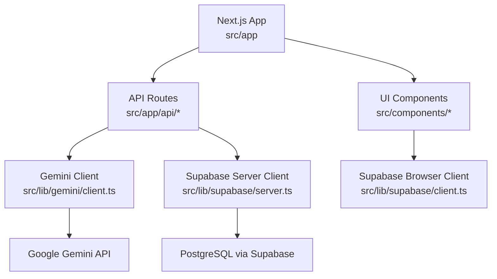
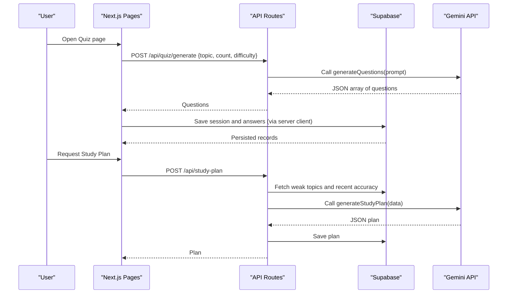
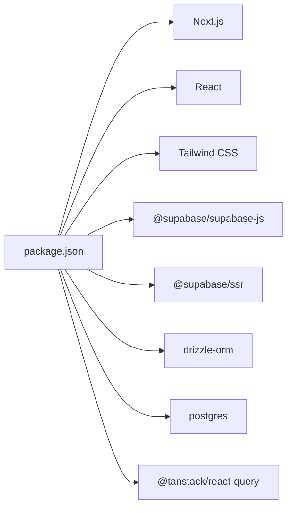
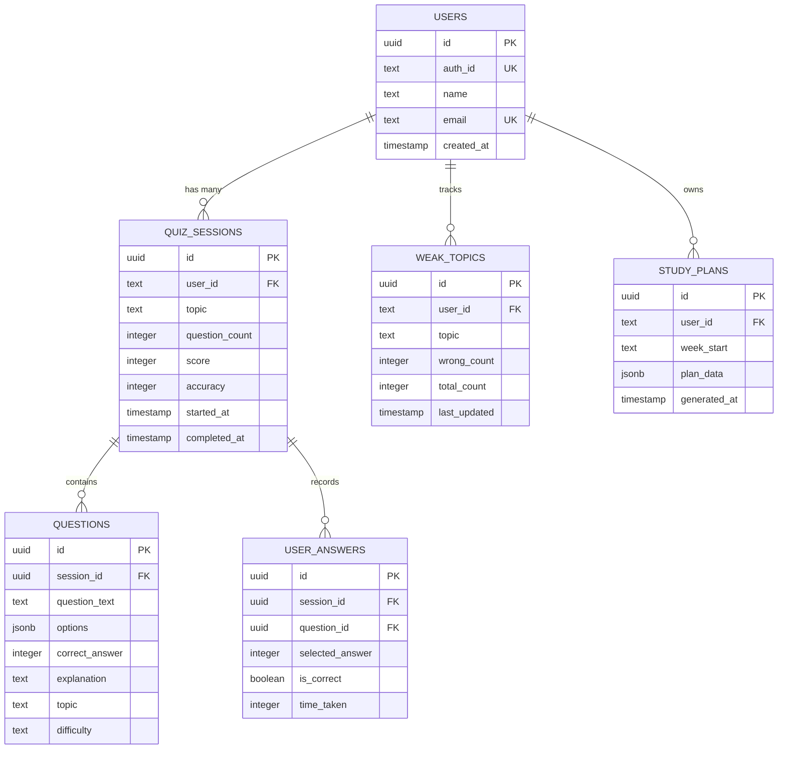

# Getting Started

<cite>
**Referenced Files in This Document**
- [package.json](file://Next-app/package.json)
- [README.md](file://Next-app/README.md)
- [drizzle.config.ts](file://Next-app/drizzle.config.ts)
- [next.config.ts](file://Next-app/next.config.ts)
- [.gitignore](file://Next-app/.gitignore)
- [schema.ts](file://Next-app/src/lib/drizzle/schema.ts)
- [db.ts](file://Next-app/src/lib/drizzle/db.ts)
- [client.ts (Supabase client)](file://Next-app/src/lib/supabase/client.ts)
- [server.ts (Supabase server)](file://Next-app/src/lib/supabase/server.ts)
- [OAuthButtons.tsx](file://Next-app/src/components/auth/OAuthButtons.tsx)
- [route.ts (Quiz Generate API)](file://Next-app/src/app/api/quiz/generate/route.ts)
- [route.ts (Study Plan API)](file://Next-app/src/app/api/study-plan/route.ts)
- [client.ts (Gemini client)](file://Next-app/src/lib/gemini/client.ts)
- [Project-Scope.md](file://Project-Scope.md)
</cite>

## Table of Contents
1. Introduction
2. Project Structure
3. Core Components
4. Architecture Overview
5. Detailed Component Analysis
6. Dependency Analysis
7. Performance Considerations
8. Troubleshooting Guide
9. Conclusion
10. Appendices

## Introduction
This guide helps you set up MedAce-AI from scratch. You will install dependencies, configure Supabase and Google Gemini, initialize the database with Drizzle ORM, and run the development server. It also includes verification steps and troubleshooting tips for common setup issues.

## Project Structure
MedAce-AI is a Next.js application using:
- Supabase for authentication and Postgres database
- Drizzle ORM for schema and migrations
- Google Gemini API for quiz generation and study plans
- Tailwind CSS for styling

**Diagram sources**
- [route.ts (Quiz Generate API):1-31](file://Next-app/src/app/api/quiz/generate/route.ts#L1-L31)
- [route.ts (Study Plan API):1-90](file://Next-app/src/app/api/study-plan/route.ts#L1-L90)
- [client.ts (Gemini client):1-135](file://Next-app/src/lib/gemini/client.ts#L1-L135)
- [server.ts (Supabase server):1-30](file://Next-app/src/lib/supabase/server.ts#L1-L30)
- [client.ts (Supabase client):1-14](file://Next-app/src/lib/supabase/client.ts#L1-L14)

**Section sources**
- [package.json:1-38](file://Next-app/package.json#L1-L38)
- [README.md:1-37](file://Next-app/README.md#L1-L37)

## Core Components
- Database schema defines users, quiz sessions, questions, user answers, weak topics, and study plans.
- Supabase clients are used for authentication and data access on both client and server sides.
- Gemini client calls the Google Gemini API to generate quiz questions, explanations, and study plans.
- API routes orchestrate requests, call Gemini, interact with Supabase, and return results.

Key files:
- Schema: [schema.ts](file://Next-app/src/lib/drizzle/schema.ts)
- DB connection: [db.ts](file://Next-app/src/lib/drizzle/db.ts)
- Supabase browser client: [client.ts (Supabase client)](file://Next-app/src/lib/supabase/client.ts)
- Supabase server client: [server.ts (Supabase server)](file://Next-app/src/lib/supabase/server.ts)
- Gemini client: [client.ts (Gemini client)](file://Next-app/src/lib/gemini/client.ts)
- API routes: [route.ts (Quiz Generate API)](file://Next-app/src/app/api/quiz/generate/route.ts), [route.ts (Study Plan API)](file://Next-app/src/app/api/study-plan/route.ts)

**Section sources**
- [schema.ts:1-78](file://Next-app/src/lib/drizzle/schema.ts#L1-L78)
- [db.ts:1-9](file://Next-app/src/lib/drizzle/db.ts#L1-L9)
- [client.ts (Supabase client):1-14](file://Next-app/src/lib/supabase/client.ts#L1-L14)
- [server.ts (Supabase server):1-30](file://Next-app/src/lib/supabase/server.ts#L1-L30)
- [client.ts (Gemini client):1-135](file://Next-app/src/lib/gemini/client.ts#L1-L135)
- [route.ts (Quiz Generate API):1-31](file://Next-app/src/app/api/quiz/generate/route.ts#L1-L31)
- [route.ts (Study Plan API):1-90](file://Next-app/src/app/api/study-plan/route.ts#L1-L90)

## Architecture Overview
High-level flow for generating quizzes and study plans:

**Diagram sources**
- [route.ts (Quiz Generate API):1-31](file://Next-app/src/app/api/quiz/generate/route.ts#L1-L31)
- [route.ts (Study Plan API):1-90](file://Next-app/src/app/api/study-plan/route.ts#L1-L90)
- [client.ts (Gemini client):1-135](file://Next-app/src/lib/gemini/client.ts#L1-L135)
- [server.ts (Supabase server):1-30](file://Next-app/src/lib/supabase/server.ts#L1-L30)

## Detailed Component Analysis

### Environment Configuration
Set up environment variables in a file named .env.local at the project root (Next-app). The repository ignores .env* files by default.

Required variables:
- NEXT_PUBLIC_SUPABASE_URL
- NEXT_PUBLIC_SUPABASE_ANON_KEY
- DATABASE_URL
- GOOGLE_GEMINI_API_KEY

Notes:
- Supabase browser and server clients validate these variables and throw errors if missing or placeholder values are used.
- Drizzle uses DATABASE_URL for migrations and queries.
- Gemini client uses GOOGLE_GEMINI_API_KEY for API calls.

**Section sources**
- [.gitignore:33-35](file://Next-app/.gitignore#L33-L35)
- [client.ts (Supabase client):1-14](file://Next-app/src/lib/supabase/client.ts#L1-L14)
- [server.ts (Supabase server):1-30](file://Next-app/src/lib/supabase/server.ts#L1-L30)
- [db.ts:1-9](file://Next-app/src/lib/drizzle/db.ts#L1-L9)
- [client.ts (Gemini client):1-135](file://Next-app/src/lib/gemini/client.ts#L1-L135)

### Prerequisites
- Node.js: Use a version compatible with Next.js 16.x. Check your package manager’s documentation for supported versions.
- PostgreSQL: Provided by Supabase; ensure your project has a Supabase project and credentials.
- Google Gemini API key: Create an API key in Google AI Studio and enable the Gemini API.

External setup links:
- Supabase project setup and keys: https://supabase.com/dashboard/project
- Google Gemini API setup and keys: https://aistudio.google.com/

**Section sources**
- [package.json:1-38](file://Next-app/package.json#L1-L38)
- [Project-Scope.md:31-48](file://Project-Scope.md#L31-L48)

### Installation Steps
1. Install dependencies:
   - npm install
2. Start the development server:
   - npm run dev
3. Build for production:
   - npm run build
4. Start production server:
   - npm start

Verification:
- Open http://localhost:3000 in your browser after starting the dev server.

**Section sources**
- [package.json:5-9](file://Next-app/package.json#L5-L9)
- [README.md:3-17](file://Next-app/README.md#L3-L17)

### Database Initialization with Drizzle ORM
Drizzle configuration points to the schema file and expects a PostgreSQL URL.

Steps:
1. Ensure DATABASE_URL is set in .env.local.
2. Run Drizzle migrations to create tables based on the schema:
   - npx drizzle-kit push
   - Or use migrate/seed commands as per your workflow.
3. Verify tables exist in your Supabase dashboard.

Schema overview:
- users, quiz_sessions, questions, user_answers, weak_topics, study_plans

**Section sources**
- [drizzle.config.ts:1-11](file://Next-app/drizzle.config.ts#L1-L11)
- [schema.ts:1-78](file://Next-app/src/lib/drizzle/schema.ts#L1-L78)

### First-Time Setup Procedures
1. Configure Supabase:
   - Create a project and copy NEXT_PUBLIC_SUPABASE_URL and NEXT_PUBLIC_SUPABASE_ANON_KEY into .env.local.
   - Enable Google OAuth provider in Supabase Auth settings and set redirect URLs to your app origin.
2. Configure Google Gemini:
   - Obtain GOOGLE_GEMINI_API_KEY and add it to .env.local.
3. Initialize the database:
   - Run Drizzle push/migrate to create tables.
4. Test authentication:
   - Use the Google sign-in button to verify OAuth flow.

**Section sources**
- [client.ts (Supabase client):1-14](file://Next-app/src/lib/supabase/client.ts#L1-L14)
- [server.ts (Supabase server):1-30](file://Next-app/src/lib/supabase/server.ts#L1-L30)
- [OAuthButtons.tsx:1-39](file://Next-app/src/components/auth/OAuthButtons.tsx#L1-L39)
- [drizzle.config.ts:1-11](file://Next-app/drizzle.config.ts#L1-L11)

### Development Server Startup
- Start dev server: npm run dev
- Expected behavior: Application serves on http://localhost:3000 with hot reload enabled.

**Section sources**
- [package.json:5-9](file://Next-app/package.json#L5-L9)
- [README.md:3-17](file://Next-app/README.md#L3-L17)

### Build Process
- Build: npm run build
- Start production: npm start

**Section sources**
- [package.json:5-9](file://Next-app/package.json#L5-L9)

### Basic Verification Steps
- Confirm Supabase connection:
  - Try signing in via Google OAuth; ensure no environment variable errors appear.
- Confirm database tables:
  - Check Supabase SQL editor for users, quiz_sessions, questions, user_answers, weak_topics, study_plans.
- Confirm Gemini integration:
  - Trigger quiz generation and verify responses are returned without API errors.

**Section sources**
- [client.ts (Supabase client):1-14](file://Next-app/src/lib/supabase/client.ts#L1-L14)
- [server.ts (Supabase server):1-30](file://Next-app/src/lib/supabase/server.ts#L1-L30)
- [route.ts (Quiz Generate API):1-31](file://Next-app/src/app/api/quiz/generate/route.ts#L1-L31)
- [client.ts (Gemini client):1-135](file://Next-app/src/lib/gemini/client.ts#L1-L135)

## Dependency Analysis
Core runtime and tooling dependencies:
- Next.js, React, Tailwind CSS
- Supabase JS SDKs for browser and SSR
- Drizzle ORM and postgres driver
- TanStack Query for data fetching/caching
- dotenv for environment loading during development

**Diagram sources**
- [package.json:11-35](file://Next-app/package.json#L11-L35)

**Section sources**
- [package.json:11-35](file://Next-app/package.json#L11-L35)

## Performance Considerations
- Avoid unnecessary re-renders by leveraging React Query caching and proper component boundaries.
- Use Drizzle’s type-safe queries to minimize overhead.
- Keep Gemini prompts concise and structured to reduce token usage and latency.
- For high traffic, consider caching generated content and rate-limiting API calls.

[No sources needed since this section provides general guidance]

## Troubleshooting Guide
Common issues and resolutions:
- Missing or invalid Supabase environment variables:
  - Ensure NEXT_PUBLIC_SUPABASE_URL and NEXT_PUBLIC_SUPABASE_ANON_KEY are set and not placeholders.
  - Errors are thrown explicitly when variables are missing or invalid.
- Database connection failures:
  - Verify DATABASE_URL is correct and accessible.
  - Ensure Drizzle schema matches your database state; run push/migrate to align.
- Gemini API errors:
  - Check GOOGLE_GEMINI_API_KEY validity and quota.
  - Inspect error messages from the API route logs.
- OAuth redirect misconfiguration:
  - Set the redirect URL in Supabase to match your app origin.
  - Ensure the Google OAuth provider is enabled in Supabase.

Helpful references:
- Supabase docs: https://supabase.com/docs
- Gemini API docs: https://ai.google.dev/docs

**Section sources**
- [client.ts (Supabase client):1-14](file://Next-app/src/lib/supabase/client.ts#L1-L14)
- [server.ts (Supabase server):1-30](file://Next-app/src/lib/supabase/server.ts#L1-L30)
- [client.ts (Gemini client):1-135](file://Next-app/src/lib/gemini/client.ts#L1-L135)
- [route.ts (Quiz Generate API):1-31](file://Next-app/src/app/api/quiz/generate/route.ts#L1-L31)
- [route.ts (Study Plan API):1-90](file://Next-app/src/app/api/study-plan/route.ts#L1-L90)

## Conclusion
You now have the essentials to set up MedAce-AI locally, configure Supabase and Gemini, initialize the database, and run the app. Follow the verification steps to confirm everything works, and refer to the troubleshooting guide if you encounter issues.

[No sources needed since this section summarizes without analyzing specific files]

## Appendices

### Data Model Overview

**Diagram sources**
- [schema.ts:1-78](file://Next-app/src/lib/drizzle/schema.ts#L1-L78)