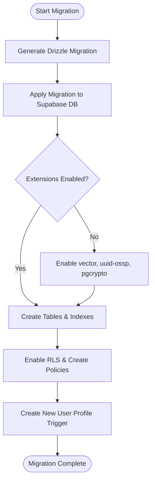
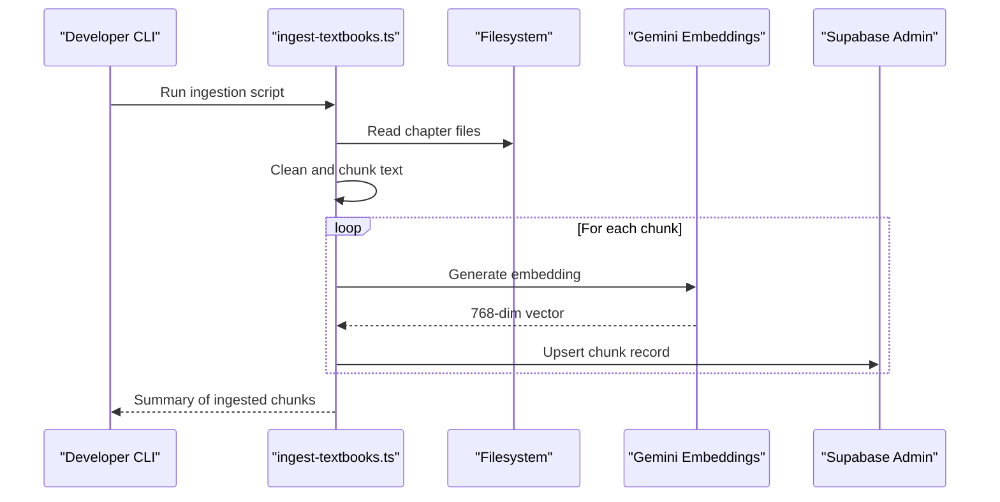
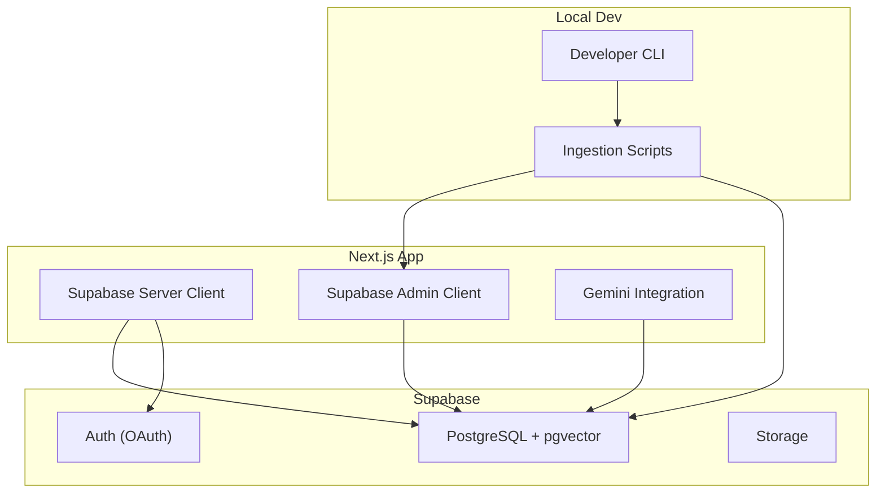

# Getting Started

<cite>
**Referenced Files in This Document**
- [README.md](file://README.md)
- [package.json](file://package.json)
- [next.config.ts](file://next.config.ts)
- [supabase/schema.sql](file://supabase/schema.sql)
- [scripts/ingest-textbooks.ts](file://scripts/ingest-textbooks.ts)
- [scripts/check-chunks.ts](file://scripts/check-chunks.ts)
- [src/lib/supabase/admin.ts](file://src/lib/supabase/admin.ts)
- [src/lib/supabase/server.ts](file://src/lib/supabase/server.ts)
- [src/lib/ai/gemini.ts](file://src/lib/ai/gemini.ts)
</cite>

## Table of Contents
1. Introduction
2. Prerequisites
3. Installation and Setup
4. Environment Variables
5. Database Migrations with Drizzle ORM
6. Textbook Content Ingestion (RAG Vector Store)
7. Development Workflow
8. Architecture Overview
9. Troubleshooting Guide
10. Conclusion

## Introduction
MedAce AI is a full-stack Next.js application that generates adaptive, syllabus-grounded MCQs using Retrieval-Augmented Generation (RAG). It integrates Supabase for authentication, database, and vector storage, and Google Gemini for text generation and embeddings. This guide helps you set up the environment, configure services, run migrations, ingest textbook content into the vector store, and start development or production builds.

## Prerequisites
- Node.js and npm (or yarn) installed on your machine
- A Supabase project with PostgreSQL enabled
- A Google account to create a Gemini API key
- Git (optional, for version control)

Notes:
- The app uses Supabase Auth (Google OAuth), Supabase PostgreSQL with pgvector, and Google Gemini models for both generation and embeddings.
- Ensure your Supabase project has the required extensions enabled by running the provided schema script.

**Section sources**
- [README.md:27-83](file://README.md#L27-L83)

## Installation and Setup
Follow these steps to install dependencies and prepare the project locally:

1. Clone the repository and navigate to the project root.
2. Install dependencies:
   - npm install
3. Copy the environment template and fill in values:
   - cp .env.example .env.local
4. Run database migrations:
   - npx drizzle-kit generate
   - npx drizzle-kit migrate
5. Ingest textbook content into the vector store (one-time):
   - npx tsx scripts/ingest-textbooks.ts
6. Start the development server:
   - npm run dev

Open http://localhost:3000 in your browser.

**Section sources**
- [README.md:414-435](file://README.md#L414-L435)
- [package.json:5-9](file://package.json#L5-L9)

## Environment Variables
Configure the following variables in your .env.local file:

- NEXT_PUBLIC_SUPABASE_URL
- NEXT_PUBLIC_SUPABASE_ANON_KEY
- SUPABASE_SERVICE_ROLE_KEY
- DATABASE_URL
- GEMINI_API_KEY
- NEXT_PUBLIC_APP_URL

Details:
- Supabase URL and keys are used by both client and server clients.
- DATABASE_URL is required for Drizzle ORM migrations.
- GEMINI_API_KEY is required for generating embeddings and MCQs.
- NEXT_PUBLIC_APP_URL is used for redirects and callbacks.

Where these are used:
- Server-side Supabase client reads NEXT_PUBLIC_SUPABASE_URL and NEXT_PUBLIC_SUPABASE_ANON_KEY.
- Admin Supabase client reads NEXT_PUBLIC_SUPABASE_URL and SUPABASE_SERVICE_ROLE_KEY.
- Gemini integration reads GEMINI_API_KEY.

**Section sources**
- [README.md:255-271](file://README.md#L255-L271)
- [src/lib/supabase/server.ts:7-9](file://src/lib/supabase/server.ts#L7-L9)
- [src/lib/supabase/admin.ts:4-6](file://src/lib/supabase/admin.ts#L4-L6)
- [src/lib/ai/gemini.ts:6-8](file://src/lib/ai/gemini.ts#L6-L8)

## Database Migrations with Drizzle ORM
The project uses Drizzle ORM for type-safe queries and migrations. Before running the app, apply the schema to your Supabase PostgreSQL instance:

1. Generate migration files:
   - npx drizzle-kit generate
2. Apply migrations:
   - npx drizzle-kit migrate

Schema highlights:
- Enables PostgreSQL extensions: vector, uuid-ossp, pgcrypto.
- Creates tables for profiles, textbook_chunks (with 768-dim vectors), quiz_sessions, quiz_questions, user_responses, study_plans.
- Defines an HNSW index on textbook_chunks.embedding for fast cosine similarity search.
- Provides an RPC function match_chunks(query_embedding, threshold, count, filter_chapter) for RAG retrieval.
- Sets Row Level Security policies for all tables.
- Adds a trigger to auto-create profiles on new user signup.

**Diagram sources**
- [supabase/schema.sql:5-8](file://supabase/schema.sql#L5-L8)
- [supabase/schema.sql:10-111](file://supabase/schema.sql#L10-L111)
- [supabase/schema.sql:113-150](file://supabase/schema.sql#L113-L150)
- [supabase/schema.sql:152-250](file://supabase/schema.sql#L152-L250)

**Section sources**
- [supabase/schema.sql:5-250](file://supabase/schema.sql#L5-L250)

## Textbook Content Ingestion (RAG Vector Store)
This step ingests textbook chapters from rag/textbooks/*.txt into the vector store for RAG-based question generation.

Process overview:
- Reads chapter files, cleans text, chunks content, generates embeddings via Gemini, and upserts records into textbook_chunks.
- Includes rate-limit handling and delays to respect free-tier constraints.
- Uses the admin Supabase client for writes.

Key behaviors:
- Chunking strategy preserves paragraph boundaries with overlap to maintain context.
- Embedding model outputs 768-dimensional vectors stored in the vector column.
- Upserts use conflict resolution to avoid duplicates.
- Rate limit retries with backoff when encountering 429 responses.

**Diagram sources**
- [scripts/ingest-textbooks.ts:49-75](file://scripts/ingest-textbooks.ts#L49-L75)
- [scripts/ingest-textbooks.ts:97-183](file://scripts/ingest-textbooks.ts#L97-L183)
- [src/lib/ai/gemini.ts:21-43](file://src/lib/ai/gemini.ts#L21-L43)
- [src/lib/supabase/admin.ts:3-20](file://src/lib/supabase/admin.ts#L3-L20)

Verification:
- Use the check-chunks script to verify the number of ingested chunks in the database.

**Section sources**
- [scripts/ingest-textbooks.ts:1-189](file://scripts/ingest-textbooks.ts#L1-L189)
- [scripts/check-chunks.ts:1-30](file://scripts/check-chunks.ts#L1-L30)
- [src/lib/ai/gemini.ts:21-43](file://src/lib/ai/gemini.ts#L21-L43)
- [src/lib/supabase/admin.ts:3-20](file://src/lib/supabase/admin.ts#L3-L20)

## Development Workflow
Useful commands for daily development and production:

- Start development server (hot-reload):
  - npm run dev
- Build for production:
  - npm run build
- Start production server:
  - npm run start
- Lint code:
  - npm run lint

Security headers are configured at the framework level for all routes.

**Section sources**
- [package.json:5-9](file://package.json#L5-L9)
- [next.config.ts:3-21](file://next.config.ts#L3-L21)

## Architecture Overview
High-level components involved during setup and runtime:

- Supabase Client (Server): Used in server components and API routes for authenticated operations.
- Supabase Admin Client: Used by ingestion scripts for privileged writes.
- Gemini Integration: Provides text generation and embeddings via API key.
- Database Schema: Defines tables, indexes, functions, and policies for RAG and user data.

**Diagram sources**
- [src/lib/supabase/server.ts:1-28](file://src/lib/supabase/server.ts#L1-L28)
- [src/lib/supabase/admin.ts:1-22](file://src/lib/supabase/admin.ts#L1-L22)
- [src/lib/ai/gemini.ts:1-61](file://src/lib/ai/gemini.ts#L1-L61)
- [supabase/schema.sql:1-250](file://supabase/schema.sql#L1-L250)

## Troubleshooting Guide
Common issues and how to resolve them:

- Database connection problems
  - Ensure DATABASE_URL points to your Supabase PostgreSQL instance.
  - Confirm Drizzle migrations have been applied successfully.
  - Verify extensions (vector, uuid-ossp, pgcrypto) are enabled; re-run schema if needed.

- API key configuration
  - GEMINI_API_KEY must be set in .env.local for embeddings and generation.
  - If missing, Gemini calls will throw an error indicating the key is not configured.

- Vector database initialization
  - Ensure textbook_chunks table exists and has the vector(768) column and HNSW index.
  - After ingestion, verify chunk count using the check-chunks script.
  - If ingestion fails due to rate limits, the script includes retry logic with delays.

- Supabase client misconfiguration
  - NEXT_PUBLIC_SUPABASE_URL and NEXT_PUBLIC_SUPABASE_ANON_KEY must be correct for server client usage.
  - SUPABASE_SERVICE_ROLE_KEY must be correct for admin client usage.

- Authentication callback issues
  - NEXT_PUBLIC_APP_URL should match your local or deployed domain for OAuth callbacks.

- Security headers and CORS
  - Review next.config.ts security headers if experiencing blocked requests or mixed content warnings.

**Section sources**
- [src/lib/ai/gemini.ts:6-8](file://src/lib/ai/gemini.ts#L6-L8)
- [src/lib/ai/gemini.ts:29-43](file://src/lib/ai/gemini.ts#L29-L43)
- [scripts/ingest-textbooks.ts:133-165](file://scripts/ingest-textbooks.ts#L133-L165)
- [scripts/check-chunks.ts:20-27](file://scripts/check-chunks.ts#L20-L27)
- [src/lib/supabase/server.ts:7-9](file://src/lib/supabase/server.ts#L7-L9)
- [src/lib/supabase/admin.ts:4-6](file://src/lib/supabase/admin.ts#L4-L6)
- [next.config.ts:3-21](file://next.config.ts#L3-L21)

## Conclusion
You now have the essential steps to set up MedAce AI locally: install dependencies, configure environment variables, apply database migrations, ingest textbook content into the vector store, and run development or production workflows. Refer to the troubleshooting section if you encounter common setup issues. For advanced customization, explore the schema, ingestion pipeline, and Gemini integration modules.