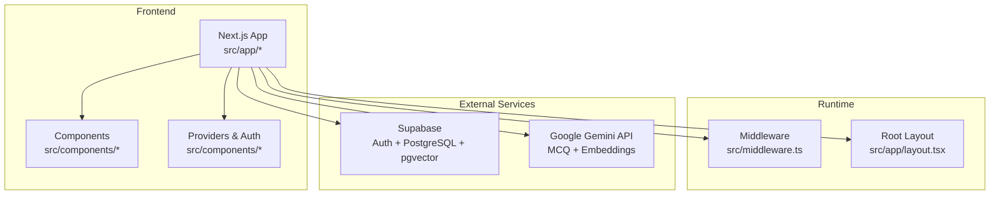
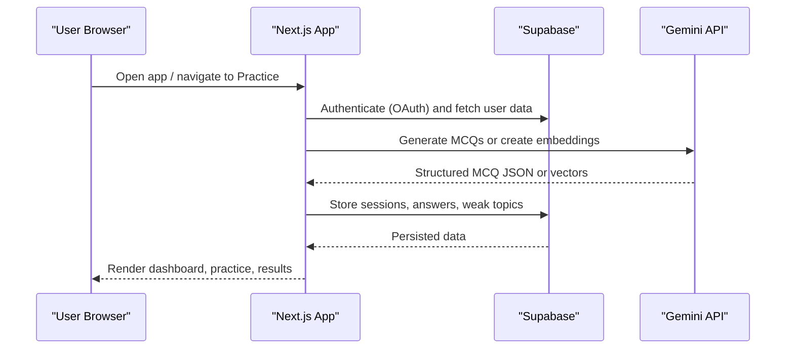
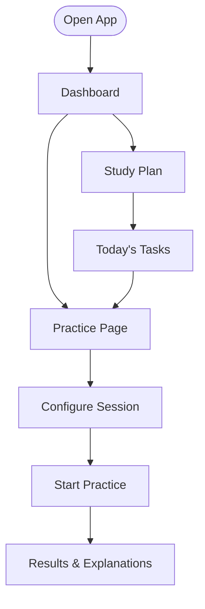
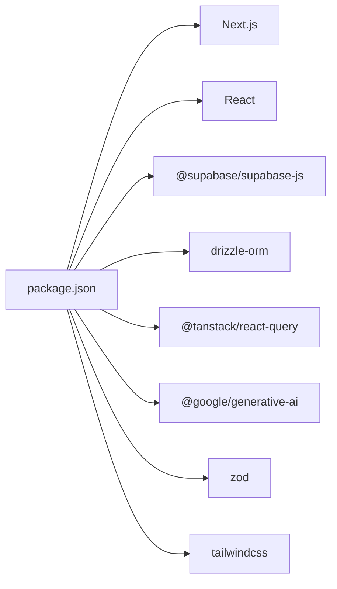

# Getting Started

<cite>
**Referenced Files in This Document**
- [README.md](file://README.md)
- [package.json](file://package.json)
- [next.config.ts](file://next.config.ts)
- [src/app/layout.tsx](file://src/app/layout.tsx)
- [src/middleware.ts](file://src/middleware.ts)
- [src/components/Providers.tsx](file://src/components/Providers.tsx)
- [src/components/auth/AuthProvider.tsx](file://src/components/auth/AuthProvider.tsx)
- [src/app/page.tsx](file://src/app/page.tsx)
- [src/app/dashboard/page.tsx](file://src/app/dashboard/page.tsx)
- [src/app/practice/page.tsx](file://src/app/practice/page.tsx)
- [src/app/study-plan/page.tsx](file://src/app/study-plan/page.tsx)
</cite>

## Table of Contents
1. Introduction
2. Project Structure
3. Core Components
4. Architecture Overview
5. Detailed Component Analysis
6. Dependency Analysis
7. Performance Considerations
8. Troubleshooting Guide
9. Conclusion

## Introduction
MedAce AI is an adaptive MDCAT preparation platform designed as an AI-powered study coach for Pakistani medical students. It delivers English MCQs with on-demand Urdu explanations, tracks weak spots adaptively, and generates personalized study plans. The app mirrors the real exam experience while adding a high-leverage understanding layer to help students learn more effectively.

Key goals:
- Authentic exam language (English interface and questions)
- On-demand Urdu explanations when concepts are unclear
- Adaptive practice that targets weak areas
- RAG-powered question generation grounded in textbook content

## Project Structure
The project follows a Next.js App Router layout with feature-based directories under src/app, shared UI components under src/components, utilities under src/lib, and TypeScript types under src/types. A RAG pipeline lives under rag/textbooks with supporting scripts referenced in documentation.

**Diagram sources**
- [src/middleware.ts:1-40](file://src/middleware.ts#L1-L40)
- [src/app/layout.tsx:1-57](file://src/app/layout.tsx#L1-L57)
- [README.md:25-78](file://README.md#L25-L78)

**Section sources**
- [README.md:163-226](file://README.md#L163-L226)
- [package.json:1-42](file://package.json#L1-L42)

## Core Components
- Root layout and metadata: Sets up fonts, providers, and SEO metadata for the app.
- Providers: Initializes TanStack Query client and toast provider for global state and notifications.
- Authentication context: Provides a mock user during development; ready to be wired to Supabase Auth.
- Middleware: Defines protected routes and includes commented logic to enforce authentication via cookies when Supabase is integrated.
- Feature pages: Landing page, dashboard analytics, practice session selector, and study plan viewer.

**Section sources**
- [src/app/layout.tsx:1-57](file://src/app/layout.tsx#L1-L57)
- [src/components/Providers.tsx:1-23](file://src/components/Providers.tsx#L1-L23)
- [src/components/auth/AuthProvider.tsx:1-58](file://src/components/auth/AuthProvider.tsx#L1-L58)
- [src/middleware.ts:1-40](file://src/middleware.ts#L1-L40)

## Architecture Overview
MedAce AI uses a Next.js frontend with server-side API routes, Supabase for auth and database (PostgreSQL with pgvector), and Google Gemini for MCQ generation and embeddings. The RAG pipeline indexes textbook chapters into vector embeddings for retrieval-augmented question generation.

**Diagram sources**
- [README.md:25-78](file://README.md#L25-L78)
- [README.md:79-122](file://README.md#L79-L122)
- [src/middleware.ts:1-40](file://src/middleware.ts#L1-L40)

## Detailed Component Analysis

### Installation and Environment Setup
Follow these steps to set up MedAce AI locally:

1. Install dependencies
   - Run npm install using the project’s package manager.

2. Configure environment variables
   - Create .env.local with the following keys:
     - NEXT_PUBLIC_SUPABASE_URL
     - NEXT_PUBLIC_SUPABASE_ANON_KEY
     - SUPABASE_SERVICE_ROLE_KEY
     - DATABASE_URL
     - GEMINI_API_KEY
     - NEXT_PUBLIC_APP_URL

3. Database migrations
   - Use Drizzle Kit to generate and apply migrations to your PostgreSQL database.

4. Build the RAG index (one-time)
   - Run the cleaning, chunking, embedding, and upload scripts to populate pgvector with textbook chunks.

5. Start the development server
   - Launch the Next.js dev server and open http://localhost:3000.

Notes:
- Security headers are configured at the framework level.
- The root layout sets up fonts and global providers.

**Section sources**
- [README.md:292-316](file://README.md#L292-L316)
- [README.md:228-244](file://README.md#L228-L244)
- [next.config.ts:1-25](file://next.config.ts#L1-L25)
- [src/app/layout.tsx:1-57](file://src/app/layout.tsx#L1-L57)

### Supabase Authentication Setup
- Create a Supabase project and enable Google OAuth in the Authentication settings.
- Add your Supabase URL and anon key to environment variables.
- The middleware contains commented logic to protect routes by checking the Supabase access token cookie; uncomment and integrate when ready.
- The current AuthProvider returns a mock user for frontend-only development; replace it with a Supabase auth state listener to connect to your backend.

**Section sources**
- [src/middleware.ts:1-40](file://src/middleware.ts#L1-L40)
- [src/components/auth/AuthProvider.tsx:1-58](file://src/components/auth/AuthProvider.tsx#L1-L58)

### Google Gemini API Integration
- Obtain a Google Gemini API key and set GEMINI_API_KEY in your environment.
- The README documents the RAG pipeline that uses Gemini embeddings and MCQ generation.
- Ensure your service account has appropriate permissions and quotas enabled.

**Section sources**
- [README.md:228-244](file://README.md#L228-L244)
- [README.md:79-122](file://README.md#L79-L122)

### PostgreSQL Database Configuration
- Provide DATABASE_URL pointing to your PostgreSQL instance.
- Enable pgvector extension in your database to store and query embeddings.
- Run Drizzle migrations to create required tables (users, quiz_sessions, questions, user_answers, weak_topics, textbook_chunks, study_plans).

**Section sources**
- [README.md:228-244](file://README.md#L228-L244)
- [README.md:124-161](file://README.md#L124-L161)

### Quick Start for First-Time Users
After setup, explore these core features:

- Dashboard Analytics
  - View total questions, accuracy rate, sessions completed, and study streak.
  - See weak topics with progress indicators and recent session history.

- Practice Sessions
  - Choose a topic from the chapter list.
  - Configure difficulty, number of questions, and optional timer.
  - Start an AI-generated practice session grounded in textbook content.

- Study Plan Generation
  - View a weekly plan tailored to your performance.
  - See today’s tasks, completed items, and rationale behind the plan.

[No diagram sources needed since this diagram shows conceptual workflow]

**Section sources**
- [src/app/dashboard/page.tsx:1-239](file://src/app/dashboard/page.tsx#L1-L239)
- [src/app/practice/page.tsx:1-196](file://src/app/practice/page.tsx#L1-L196)
- [src/app/study-plan/page.tsx:1-192](file://src/app/study-plan/page.tsx#L1-L192)

## Dependency Analysis
Core runtime and tooling dependencies include Next.js, React, Supabase SDKs, Drizzle ORM, TanStack Query, Google Generative AI, Zod, and Tailwind CSS. Development tools include TypeScript, Drizzle Kit, PostCSS, ESLint, and tsx for running scripts.

**Diagram sources**
- [package.json:1-42](file://package.json#L1-L42)

**Section sources**
- [package.json:1-42](file://package.json#L1-L42)

## Performance Considerations
- Use TanStack Query caching and retries to reduce redundant network calls.
- Keep RAG retrieval focused by limiting top-k chunks and reusing embeddings.
- Prefer server-side rendering where possible to minimize client payload.
- Monitor cold starts on Vercel; Drizzle and minimal dependencies help.

[No sources needed since this section provides general guidance]

## Troubleshooting Guide
Common issues and resolutions:

- Missing environment variables
  - Ensure all required keys are present in .env.local and match the expected names.

- Supabase OAuth not working
  - Verify Google OAuth is enabled in Supabase and that redirect URLs are configured.
  - Uncomment route protection in middleware and ensure cookies are handled correctly.

- Database migration errors
  - Confirm DATABASE_URL points to a valid PostgreSQL instance with pgvector enabled.
  - Re-run drizzle-kit generate and migrate if schema drift occurs.

- RAG index build failures
  - Check Gemini API key and quota limits.
  - Validate textbook text files exist and are readable before running clean/chunk/embed/upload scripts.

- Development server issues
  - Clear node_modules and reinstall dependencies if dependency conflicts arise.
  - Ensure Node version meets requirements for installed packages.

**Section sources**
- [README.md:228-244](file://README.md#L228-L244)
- [README.md:292-316](file://README.md#L292-L316)
- [src/middleware.ts:1-40](file://src/middleware.ts#L1-L40)

## Conclusion
You now have the essentials to set up MedAce AI, configure Supabase and Gemini, run database migrations, build the RAG index, and explore the core features: practice sessions, dashboard analytics, and study plan generation. Use the troubleshooting tips to resolve common setup issues and iterate confidently as you integrate full authentication and backend services.