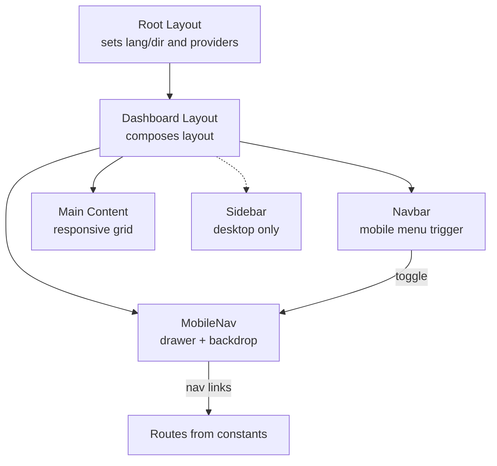
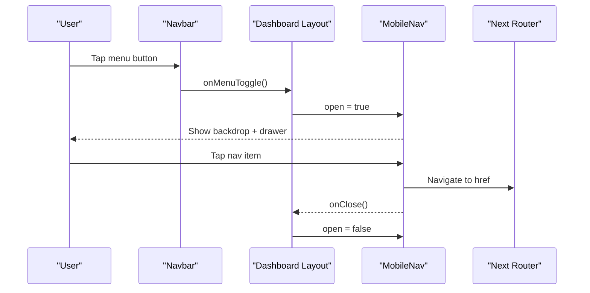
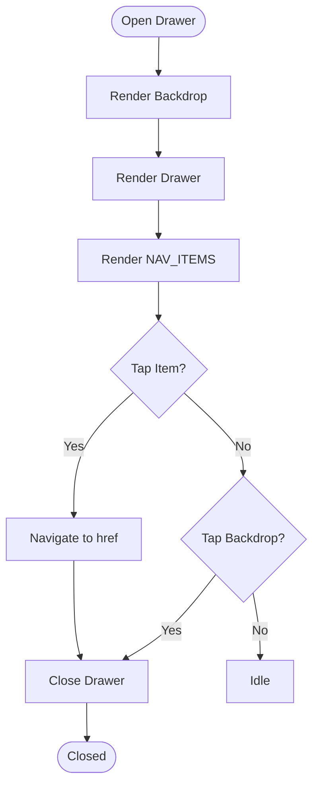
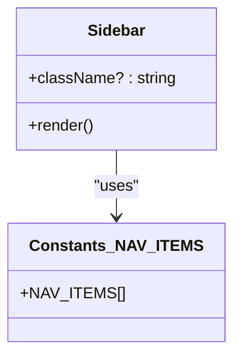
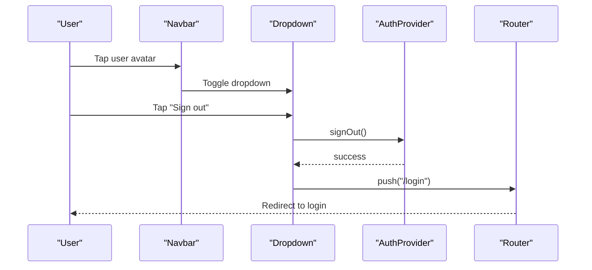
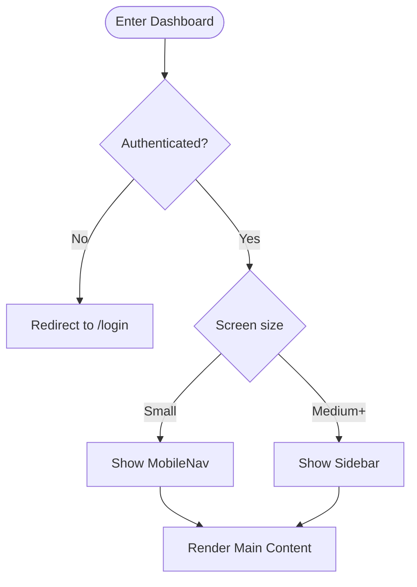
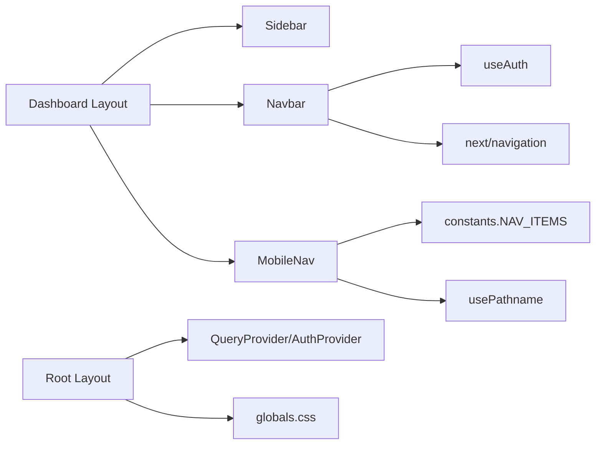

# Mobile Responsiveness

<cite>
**Referenced Files in This Document**
- [MobileNav.tsx](file://Next-app/src/components/layout/MobileNav.tsx)
- [Sidebar.tsx](file://Next-app/src/components/layout/Sidebar.tsx)
- [Navbar.tsx](file://Next-app/src/components/layout/Navbar.tsx)
- [Dashboard Layout](file://Next-app/src/app/(dashboard)/layout.tsx)
- [Root Layout](file://Next-app/src/app/layout.tsx)
- [Global Styles](file://Next-app/src/app/globals.css)
- [Constants](file://Next-app/src/lib/constants.ts)
- [Utils](file://Next-app/src/lib/utils.ts)
- [Dashboard Home](file://Next-app/src/components/DashboardHome.tsx)
- [StatsGrid](file://Next-app/src/components/dashboard/StatsGrid.tsx)
</cite>

## Table of Contents
1. [Introduction](#introduction)
2. [Project Structure](#project-structure)
3. [Core Components](#core-components)
4. [Architecture Overview](#architecture-overview)
5. [Detailed Component Analysis](#detailed-component-analysis)
6. [Dependency Analysis](#dependency-analysis)
7. [Performance Considerations](#performance-considerations)
8. [Troubleshooting Guide](#troubleshooting-guide)
9. [Conclusion](#conclusion)
10. [Appendices](#appendices)

## Introduction
This document explains how the application implements mobile responsiveness and touch interactions, focusing on:
- Mobile navigation via a slide-out drawer
- Sidebar behavior across screen sizes
- Responsive layout patterns using Tailwind CSS utilities
- Viewport handling and RTL support
- Touch-friendly UI behaviors
- Accessibility considerations for mobile users
- Testing strategies for different screen sizes
- Progressive enhancement approaches

The implementation leverages React components, Next.js routing, Tailwind responsive utilities, and a consistent design system to deliver a smooth experience on small screens while maintaining a rich desktop layout.

## Project Structure
At a high level, the responsive layout is composed of:
- A root layout that sets language and direction (RTL) and global styles
- A dashboard layout that composes the sidebar, navbar, and main content
- A mobile-only drawer for navigation on small screens
- A persistent desktop sidebar for larger screens
- Utility functions and constants for shared logic and navigation items

**Diagram sources**
- [Root Layout:1-22](file://Next-app/src/app/layout.tsx#L1-L22)
- [Dashboard Layout:1-62](file://Next-app/src/app/(dashboard)/layout.tsx#L1-L62)
- [Navbar:1-106](file://Next-app/src/components/layout/Navbar.tsx#L1-L106)
- [MobileNav:1-85](file://Next-app/src/components/layout/MobileNav.tsx#L1-L85)
- [Sidebar:1-81](file://Next-app/src/components/layout/Sidebar.tsx#L1-L81)
- [Constants:1-51](file://Next-app/src/lib/constants.ts#L1-L51)

**Section sources**
- [Root Layout:1-22](file://Next-app/src/app/layout.tsx#L1-L22)
- [Dashboard Layout:1-62](file://Next-app/src/app/(dashboard)/layout.tsx#L1-L62)

## Core Components
- Dashboard Layout orchestrates the responsive shell:
  - Shows a desktop sidebar at medium breakpoints and above
  - Renders a mobile drawer below medium breakpoints
  - Provides a sticky header with a hamburger button to open the drawer
  - Wraps page content in a responsive container with padding that scales by breakpoint
- Navbar provides:
  - A visible title on mobile when the sidebar is hidden
  - A user dropdown with profile and sign-out actions
  - A click-outside handler to close the dropdown
- MobileNav renders:
  - A full-screen backdrop that closes the drawer on tap
  - A right-aligned drawer containing navigation links
  - Active state based on current pathname
- Sidebar renders:
  - Persistent navigation for desktop with active link highlighting
  - Branding and footer text

These components collectively implement a responsive pattern where:
- Small screens use a drawer-based navigation
- Larger screens show a persistent sidebar
- The main content area adapts its spacing and grid layout

**Section sources**
- [Dashboard Layout:1-62](file://Next-app/src/app/(dashboard)/layout.tsx#L1-L62)
- [Navbar:1-106](file://Next-app/src/components/layout/Navbar.tsx#L1-L106)
- [MobileNav:1-85](file://Next-app/src/components/layout/MobileNav.tsx#L1-L85)
- [Sidebar:1-81](file://Next-app/src/components/layout/Sidebar.tsx#L1-L81)

## Architecture Overview
The responsive architecture separates concerns between layout orchestration and component rendering:
- Root layout configures global language and direction, ensuring proper RTL rendering for Urdu
- Dashboard layout manages state for the mobile drawer and conditionally renders desktop vs. mobile navigation
- Navbar exposes a toggle callback to control the drawer
- MobileNav encapsulates drawer UX including backdrop and accessible close controls
- Sidebar remains always visible on desktop for quick access

**Diagram sources**
- [Navbar:13-51](file://Next-app/src/components/layout/Navbar.tsx#L13-L51)
- [Dashboard Layout:19-55](file://Next-app/src/app/(dashboard)/layout.tsx#L19-L55)
- [MobileNav:29-83](file://Next-app/src/components/layout/MobileNav.tsx#L29-L83)

## Detailed Component Analysis

### Mobile Navigation Drawer
- Behavior:
  - Hidden by default; rendered only when open
  - Backdrop covers the viewport and closes the drawer when tapped
  - Drawer slides from the right side (RTL-aware due to dir="rtl")
  - Navigation items highlight based on current path
- Touch interactions:
  - Tapping the backdrop closes the drawer
  - Tapping a navigation item navigates and closes the drawer
- Accessibility:
  - Close button includes an aria-label
  - Focus management can be enhanced by trapping focus within the drawer and restoring focus on close

**Diagram sources**
- [MobileNav:29-83](file://Next-app/src/components/layout/MobileNav.tsx#L29-L83)
- [Constants:16-22](file://Next-app/src/lib/constants.ts#L16-L22)

**Section sources**
- [MobileNav:1-85](file://Next-app/src/components/layout/MobileNav.tsx#L1-L85)
- [Constants:16-22](file://Next-app/src/lib/constants.ts#L16-L22)

### Sidebar (Desktop)
- Behavior:
  - Visible at medium breakpoints and above
  - Displays branding, navigation, and footer
  - Highlights active link based on current path
- Responsive behavior:
  - Hidden on small screens via utility classes
  - Fixed width and scrollable content if needed

**Diagram sources**
- [Sidebar:1-81](file://Next-app/src/components/layout/Sidebar.tsx#L1-L81)
- [Constants:16-22](file://Next-app/src/lib/constants.ts#L16-L22)

**Section sources**
- [Sidebar:1-81](file://Next-app/src/components/layout/Sidebar.tsx#L1-L81)

### Navbar and Dropdown
- Behavior:
  - Sticky header with blur effect
  - Hamburger button visible on small screens to open the drawer
  - User dropdown with profile and sign-out actions
  - Click-outside detection to close the dropdown
- Touch interactions:
  - Tapping outside the dropdown closes it
  - Sign-out triggers authentication flow and redirects

**Diagram sources**
- [Navbar:13-106](file://Next-app/src/components/layout/Navbar.tsx#L13-L106)

**Section sources**
- [Navbar:1-106](file://Next-app/src/components/layout/Navbar.tsx#L1-L106)

### Dashboard Layout Shell
- Behavior:
  - Conditionally shows desktop sidebar or mobile drawer based on breakpoint
  - Manages drawer open state and passes callbacks
  - Wraps content in a responsive container with adaptive padding
- Routing guard:
  - Redirects unauthenticated users to login

**Diagram sources**
- [Dashboard Layout:17-59](file://Next-app/src/app/(dashboard)/layout.tsx#L17-L59)

**Section sources**
- [Dashboard Layout:1-62](file://Next-app/src/app/(dashboard)/layout.tsx#L1-L62)

### Responsive Grids and Spacing
- Patterns used:
  - Two-column grids on small screens scaling to four columns on large screens
  - Adaptive padding: smaller on mobile, larger on desktop and large screens
  - Max-width containers to keep content readable on wide screens

Examples:
- Stats grid uses a two-column layout on small screens and four columns on large screens
- Page-level containers scale padding and maintain readability

**Section sources**
- [Dashboard Home:44-88](file://Next-app/src/components/DashboardHome.tsx#L44-L88)
- [StatsGrid:47-70](file://Next-app/src/components/dashboard/StatsGrid.tsx#L47-L70)

## Dependency Analysis
Key dependencies and relationships:
- Dashboard Layout depends on:
  - Sidebar (desktop)
  - Navbar (header)
  - MobileNav (mobile drawer)
  - Auth provider for user state
- Navbar depends on:
  - Auth provider for user data and sign-out
  - Router for navigation
- MobileNav depends on:
  - Navigation constants for menu items
  - Pathname hook for active state
- Global styles define theme tokens and fonts

**Diagram sources**
- [Dashboard Layout:1-62](file://Next-app/src/app/(dashboard)/layout.tsx#L1-L62)
- [Navbar:1-106](file://Next-app/src/components/layout/Navbar.tsx#L1-L106)
- [MobileNav:1-85](file://Next-app/src/components/layout/MobileNav.tsx#L1-L85)
- [Root Layout:1-22](file://Next-app/src/app/layout.tsx#L1-L22)
- [Global Styles:1-81](file://Next-app/src/app/globals.css#L1-L81)
- [Constants:1-51](file://Next-app/src/lib/constants.ts#L1-L51)

**Section sources**
- [Dashboard Layout:1-62](file://Next-app/src/app/(dashboard)/layout.tsx#L1-L62)
- [Navbar:1-106](file://Next-app/src/components/layout/Navbar.tsx#L1-L106)
- [MobileNav:1-85](file://Next-app/src/components/layout/MobileNav.tsx#L1-L85)
- [Root Layout:1-22](file://Next-app/src/app/layout.tsx#L1-L22)
- [Global Styles:1-81](file://Next-app/src/app/globals.css#L1-L81)
- [Constants:1-51](file://Next-app/src/lib/constants.ts#L1-L51)

## Performance Considerations
- Conditional rendering:
  - Drawer is only rendered when open, reducing unnecessary DOM
  - Desktop sidebar is hidden via utility classes rather than conditional logic
- Sticky header:
  - Uses backdrop-blur and fixed positioning for performance-friendly sticky behavior
- Font loading:
  - Fonts are declared with display swap to avoid FOIT and improve perceived performance
- State management:
  - Drawer state is local to the dashboard layout, minimizing re-renders
- Navigation:
  - Active link calculation uses simple path checks to avoid heavy computations

[No sources needed since this section provides general guidance]

## Troubleshooting Guide
Common issues and resolutions:
- Drawer does not close on backdrop tap:
  - Ensure the backdrop element has an onClick handler that calls the close function
  - Verify z-index layering so backdrop is above content but below drawer
- Drawer opens but cannot be dismissed:
  - Confirm the close button’s onClick is wired correctly
  - Check that no overlay prevents pointer events
- Dropdown not closing on outside click:
  - Ensure the ref is attached to the dropdown container
  - Verify event listener is added and removed properly
- RTL alignment issues:
  - Confirm html dir="rtl" is set in the root layout
  - Use logical properties or ensure margins/padding align with RTL context
- Active link not highlighting:
  - Validate pathname matching logic for root and nested routes
  - Ensure navigation items have correct href values

**Section sources**
- [MobileNav:34-83](file://Next-app/src/components/layout/MobileNav.tsx#L34-L83)
- [Navbar:19-30](file://Next-app/src/components/layout/Navbar.tsx#L19-L30)
- [Root Layout:12-20](file://Next-app/src/app/layout.tsx#L12-L20)

## Conclusion
The application implements a robust responsive layout using:
- A drawer-based mobile navigation with backdrop and accessible controls
- A persistent desktop sidebar for efficient navigation
- Tailwind responsive utilities for adaptive spacing and grids
- RTL support for Urdu content
- Clean separation of concerns between layout, navigation, and content

To extend mobile experiences:
- Add swipe-to-dismiss gestures for the drawer
- Implement focus trapping and restore focus on close
- Optimize images and charts for mobile bandwidth
- Test across device orientations and screen densities

[No sources needed since this section summarizes without analyzing specific files]

## Appendices

### Making Components Responsive
- Use responsive grid classes to adjust column counts based on screen size
- Apply adaptive padding to containers for better readability on small screens
- Hide non-essential elements on small screens to reduce clutter
- Ensure touch targets are appropriately sized for mobile interaction

**Section sources**
- [Dashboard Home:44-88](file://Next-app/src/components/DashboardHome.tsx#L44-L88)
- [StatsGrid:47-70](file://Next-app/src/components/dashboard/StatsGrid.tsx#L47-L70)

### Handling Orientation Changes
- Rely on CSS media queries and responsive utilities to adapt layouts automatically
- Avoid storing orientation-dependent state unless necessary
- Test both portrait and landscape modes for critical flows

[No sources needed since this section provides general guidance]

### Optimizing Performance on Mobile
- Prefer conditional rendering for heavy components like drawers
- Use lazy loading for non-critical assets
- Minimize reflows by avoiding frequent style changes
- Leverage font-display swap for faster text rendering

[No sources needed since this section provides general guidance]

### Accessibility Considerations for Mobile Users
- Provide clear labels for interactive elements (e.g., close button)
- Ensure keyboard navigation works for essential flows
- Maintain sufficient color contrast and readable font sizes
- Support RTL semantics and text direction

**Section sources**
- [MobileNav:46-52](file://Next-app/src/components/layout/MobileNav.tsx#L46-L52)
- [Root Layout:12-20](file://Next-app/src/app/layout.tsx#L12-L20)

### Testing Strategies for Different Screen Sizes
- Use browser dev tools to simulate various devices and orientations
- Test drawer open/close interactions on real devices
- Validate dropdown behavior on touch screens
- Check active link states across nested routes

[No sources needed since this section provides general guidance]

### Progressive Enhancement Approaches
- Ensure core navigation works without JavaScript by relying on server-rendered links
- Enhance interactivity with client-side features like drawer toggles and dropdowns
- Gracefully degrade complex interactions on older devices

[No sources needed since this section provides general guidance]