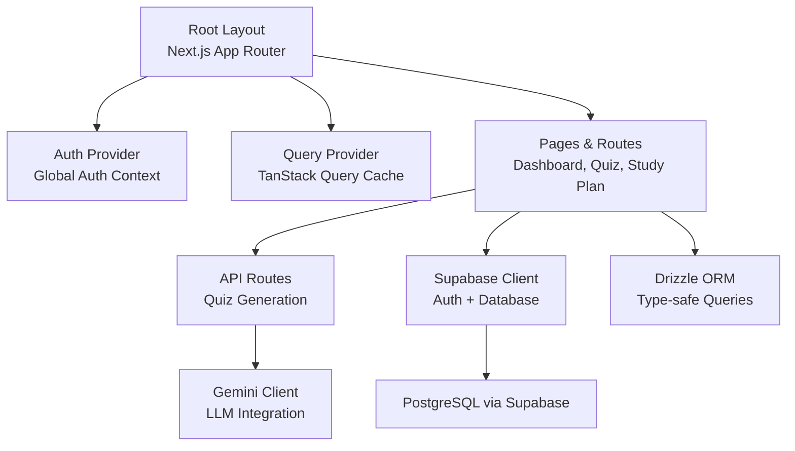
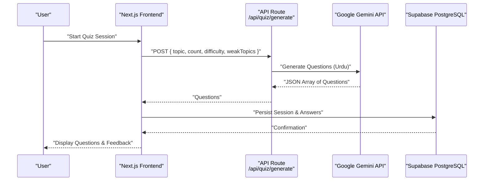
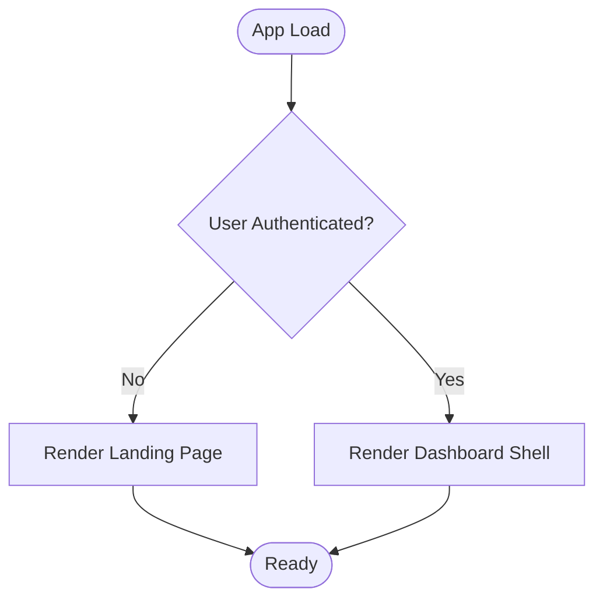
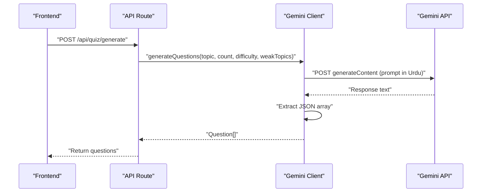
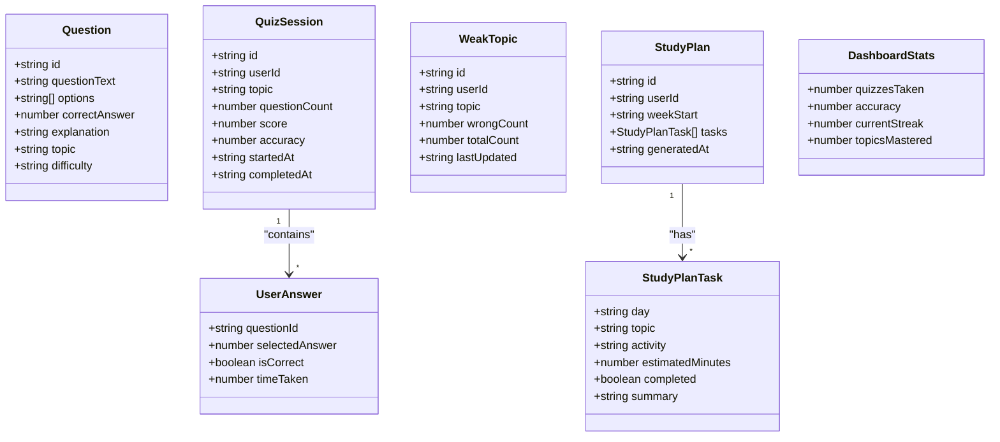
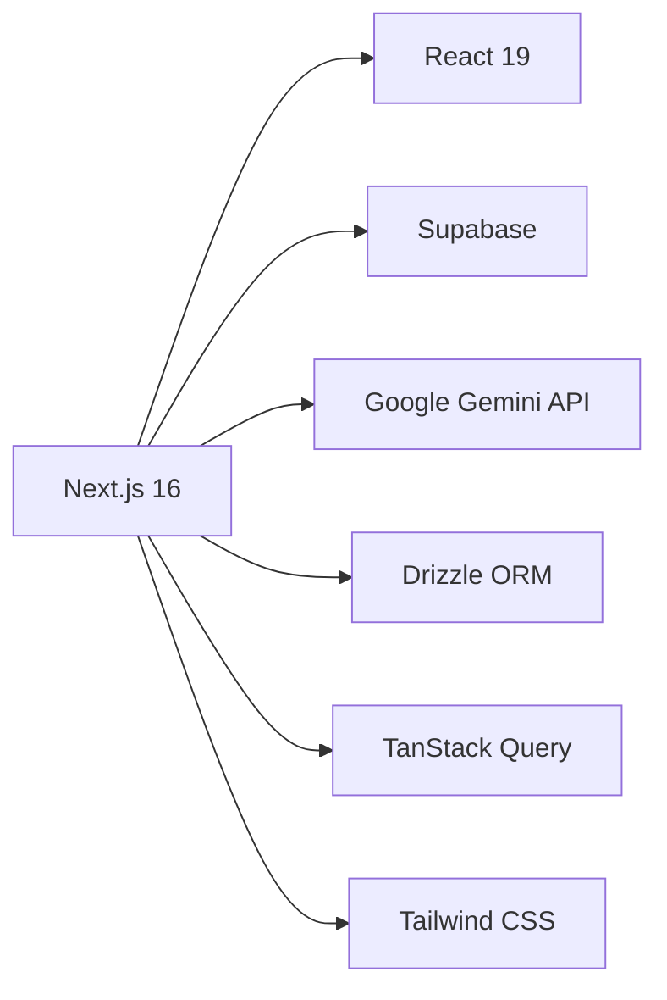

# Project Overview

<cite>
**Referenced Files in This Document**
- [Project-Scope.md](file://Project-Scope.md)
- [package.json](file://Next-app/package.json)
- [layout.tsx](file://Next-app/src/app/layout.tsx)
- [page.tsx](file://Next-app/src/app/page.tsx)
- [LandingPage.tsx](file://Next-app/src/components/LandingPage.tsx)
- [constants.ts](file://Next-app/src/lib/constants.ts)
- [client.ts (Gemini)](file://Next-app/src/lib/gemini/client.ts)
- [prompts.ts](file://Next-app/src/lib/gemini/prompts.ts)
- [route.ts (quiz generate)](file://Next-app/src/app/api/quiz/generate/route.ts)
- [AuthProvider.tsx](file://Next-app/src/providers/AuthProvider.tsx)
- [client.ts (Supabase client)](file://Next-app/src/lib/supabase/client.ts)
- [server.ts (Supabase server)](file://Next-app/src/lib/supabase/server.ts)
- [middleware.ts (Supabase middleware)](file://Next-app/src/lib/supabase/middleware.ts)
- [db.ts (Drizzle DB)](file://Next-app/src/lib/drizzle/db.ts)
- [quiz.ts (types)](file://Next-app/src/types/quiz.ts)
- [user.ts (types)](file://Next-app/src/types/user.ts)
</cite>

## Table of Contents
1. Introduction
2. Project Structure
3. Core Components
4. Architecture Overview
5. Detailed Component Analysis
6. Dependency Analysis
7. Performance Considerations
8. Troubleshooting Guide
9. Conclusion

## Introduction
MedAce AI is an AI-powered MDCAT preparation platform designed specifically for Pakistani students. It provides personalized, Urdu-language tutoring and adaptive quiz sessions that identify weak topics and generate weekly study plans tailored to each learner’s performance. The platform addresses a critical educational gap: affordable, high-quality, localized preparation tools for the Medical and Dental College Admission Test (MDCAT). Most existing resources are English-only or lack personalization; MedAce AI bridges this by delivering concept explanations, practice questions, and adaptive learning paths entirely in Urdu.

Key value propositions:
- Urdu-first learning experience with conversational explanations
- Syllabus-aligned question generation with accuracy verification
- Persistent tracking of weak topics and targeted re-drilling
- Adaptive weekly study plans based on real-time performance
- Accessible, free-to-start experience for millions of aspirants

Target audience:
- Pakistani MDCAT candidates who prefer learning in Urdu
- Students seeking affordable, personalized coaching beyond classroom limits
- Parents and tutors looking for measurable progress insights

Conceptual overview for newcomers:
- Sign up, take quizzes in your preferred subject, receive instant feedback in Urdu, and get a weekly plan that adapts as you improve.

Technical highlights for experienced developers:
- Next.js 16 App Router with React 19
- Supabase for authentication, database, and storage
- Google Gemini API for multilingual content generation and explanations
- Drizzle ORM for type-safe Postgres access
- TanStack Query for data fetching and caching
- Tailwind CSS with RTL support for Urdu

**Section sources**
- [Project-Scope.md:1-48](file://Project-SScope.md#L1-L48)
- [layout.tsx:6-20](file://Next-app/src/app/layout.tsx#L6-L20)
- [LandingPage.tsx:42-76](file://Next-app/src/components/LandingPage.tsx#L42-L76)

## Project Structure
The application follows a feature-oriented structure within the Next.js App Router:
- app/: Routes and API endpoints (e.g., quiz generation routes)
- components/: Reusable UI components grouped by feature (auth, dashboard, quiz, layout, ui)
- lib/: Shared libraries (gemini integration, supabase clients, drizzle db, hooks, constants)
- providers/: Global providers (authentication, query cache)
- types/: TypeScript interfaces for domain models (quiz, user)

**Diagram sources**
- [layout.tsx:12-20](file://Next-app/src/app/layout.tsx#L12-L20)
- [AuthProvider.tsx:27-78](file://Next-app/src/providers/AuthProvider.tsx#L27-L78)
- [route.ts (quiz generate):4-31](file://Next-app/src/app/api/quiz/generate/route.ts#L4-L31)
- [client.ts (Gemini):6-75](file://Next-app/src/lib/gemini/client.ts#L6-L75)
- [client.ts (Supabase client):3-14](file://Next-app/src/lib/supabase/client.ts#L3-L14)
- [db.ts (Drizzle DB):1-9](file://Next-app/src/lib/drizzle/db.ts#L1-L9)

**Section sources**
- [page.tsx:12-52](file://Next-app/src/app/page.tsx#L12-L52)
- [constants.ts:24-50](file://Next-app/src/lib/constants.ts#L24-L50)

## Core Components
- Authentication and Routing:
  - Root page renders either a landing page for unauthenticated users or a dashboard shell for authenticated users.
  - Auth provider manages session state and sign-out flows using Supabase.
- Landing Page:
  - Urdu-focused messaging, features overview, and calls to action.
- Quiz Generation:
  - API route validates inputs and delegates to Gemini client to produce syllabus-aligned questions in Urdu.
- Data Models:
  - Types define Question, UserAnswer, QuizSession, WeakTopic, StudyPlan, and DashboardStats to ensure type safety across the stack.

How it addresses educational challenges:
- Personalized learning: Tracks weak topics and adjusts quiz difficulty and study plans accordingly.
- Language accessibility: All content generated and presented in Urdu, improving comprehension and retention.
- Scalable tutoring: AI-driven question generation and explanations reduce dependency on expensive human tutors.

**Section sources**
- [page.tsx:12-52](file://Next-app/src/app/page.tsx#L12-L52)
- [AuthProvider.tsx:27-78](file://Next-app/src/providers/AuthProvider.tsx#L27-L78)
- [LandingPage.tsx:42-76](file://Next-app/src/components/LandingPage.tsx#L42-L76)
- [route.ts (quiz generate):4-31](file://Next-app/src/app/api/quiz/generate/route.ts#L4-L31)
- [quiz.ts:1-47](file://Next-app/src/types/quiz.ts#L1-L47)
- [user.ts:1-40](file://Next-app/src/types/user.ts#L1-L40)

## Architecture Overview
MedAce AI uses a modern full-stack architecture centered around Next.js 16 with React 19, Supabase for backend services, and Google Gemini for AI capabilities.

**Diagram sources**
- [route.ts (quiz generate):4-31](file://Next-app/src/app/api/quiz/generate/route.ts#L4-L31)
- [client.ts (Gemini):30-75](file://Next-app/src/lib/gemini/client.ts#L30-L75)
- [client.ts (Supabase client):3-14](file://Next-app/src/lib/supabase/client.ts#L3-L14)

**Section sources**
- [package.json:11-23](file://Next-app/package.json#L11-L23)
- [layout.tsx:6-20](file://Next-app/src/app/layout.tsx#L6-L20)

## Detailed Component Analysis

### Authentication and Routing Flow
- Root page checks authentication status and renders either the landing page or the dashboard shell.
- Auth provider initializes Supabase client, retrieves session, and subscribes to auth state changes.
- Middleware protects routes and redirects appropriately based on user state.

**Diagram sources**
- [page.tsx:12-52](file://Next-app/src/app/page.tsx#L12-L52)
- [AuthProvider.tsx:27-78](file://Next-app/src/providers/AuthProvider.tsx#L27-L78)
- [middleware.ts (Supabase middleware):42-67](file://Next-app/src/lib/supabase/middleware.ts#L42-L67)

**Section sources**
- [page.tsx:12-52](file://Next-app/src/app/page.tsx#L12-L52)
- [AuthProvider.tsx:27-78](file://Next-app/src/providers/AuthProvider.tsx#L27-L78)
- [middleware.ts (Supabase middleware):42-67](file://Next-app/src/lib/supabase/middleware.ts#L42-L67)

### Quiz Generation with Gemini
- API route validates request body and calls Gemini client to generate questions in Urdu aligned to the MDCAT syllabus.
- Gemini client constructs prompts with system instructions and parses JSON responses robustly.
- Prompts enforce language, format, and pedagogical quality.

**Diagram sources**
- [route.ts (quiz generate):4-31](file://Next-app/src/app/api/quiz/generate/route.ts#L4-L31)
- [client.ts (Gemini):30-75](file://Next-app/src/lib/gemini/client.ts#L30-L75)
- [prompts.ts:1-24](file://Next-app/src/lib/gemini/prompts.ts#L1-L24)

**Section sources**
- [route.ts (quiz generate):4-31](file://Next-app/src/app/api/quiz/generate/route.ts#L4-L31)
- [client.ts (Gemini):6-75](file://Next-app/src/lib/gemini/client.ts#L6-L75)
- [prompts.ts:1-24](file://Next-app/src/lib/gemini/prompts.ts#L1-L24)

### Data Models and Domain Types
- Question, UserAnswer, QuizSession, SessionResult define quiz lifecycle and scoring.
- WeakTopic, StudyPlan, StudyPlanTask model adaptive learning and planning.
- DashboardStats aggregates key metrics for the dashboard.

**Diagram sources**
- [quiz.ts:1-47](file://Next-app/src/types/quiz.ts#L1-L47)
- [user.ts:1-40](file://Next-app/src/types/user.ts#L1-L40)

**Section sources**
- [quiz.ts:1-47](file://Next-app/src/types/quiz.ts#L1-L47)
- [user.ts:1-40](file://Next-app/src/types/user.ts#L1-L40)

### Conceptual Overview
MedAce AI transforms MDCAT preparation by combining AI-generated content with adaptive learning. Students engage with Urdu explanations and quizzes, while the system continuously learns from their mistakes to refine future content and study plans. This approach reduces cognitive load, improves retention, and increases exam readiness through focused practice.

[No sources needed since this section doesn't analyze specific files]

## Dependency Analysis
Core dependencies and roles:
- Next.js 16 and React 19: Framework and UI runtime
- Supabase: Authentication, database, storage
- Google Gemini API: Multilingual content generation
- Drizzle ORM: Type-safe database queries
- TanStack Query: Data fetching and caching
- Tailwind CSS: Styling with RTL support for Urdu

**Diagram sources**
- [package.json:11-23](file://Next-app/package.json#L11-L23)

**Section sources**
- [package.json:11-23](file://Next-app/package.json#L11-L23)

## Performance Considerations
- Minimize unnecessary re-renders by leveraging React 19 optimizations and component composition.
- Use TanStack Query to cache quiz sessions and dashboard data, reducing redundant network calls.
- Streamline Gemini prompts to reduce token usage and latency while maintaining quality.
- Implement pagination or chunking for large datasets (e.g., history, weak topics).
- Prefer server-side rendering where appropriate to improve initial load times.
- Optimize images and assets; use Next.js built-in optimizations.

[No sources needed since this section provides general guidance]

## Troubleshooting Guide
Common issues and resolutions:
- Supabase configuration missing:
  - Ensure NEXT_PUBLIC_SUPABASE_URL and NEXT_PUBLIC_SUPABASE_ANON_KEY are set in environment variables.
  - If not configured, the app treats users as unauthenticated and shows the landing page.
- Gemini API errors:
  - Validate API key and network connectivity.
  - Handle malformed responses by extracting JSON safely and logging errors.
- Protected route redirection:
  - Middleware redirects unauthenticated users to login and authenticated users away from auth pages.
- Database connection:
  - Verify DATABASE_URL is correctly set for Drizzle ORM.

**Section sources**
- [client.ts (Supabase client):3-14](file://Next-app/src/lib/supabase/client.ts#L3-L14)
- [client.ts (Gemini):6-28](file://Next-app/src/lib/gemini/client.ts#L6-L28)
- [middleware.ts (Supabase middleware):42-67](file://Next-app/src/lib/supabase/middleware.ts#L42-L67)
- [db.ts (Drizzle DB):1-9](file://Next-app/src/lib/drizzle/db.ts#L1-L9)

## Conclusion
MedAce AI delivers a transformative MDCAT preparation experience for Pakistani students by combining AI-powered content generation with adaptive learning in Urdu. Its architecture leverages Next.js 16, React 19, Supabase, and Google Gemini to provide scalable, personalized, and accessible education. By focusing on one exam and one subject initially, the platform ensures accuracy and depth before expanding. The result is a practical, effective tool that empowers students to overcome educational barriers and achieve their medical career goals.

[No sources needed since this section summarizes without analyzing specific files]