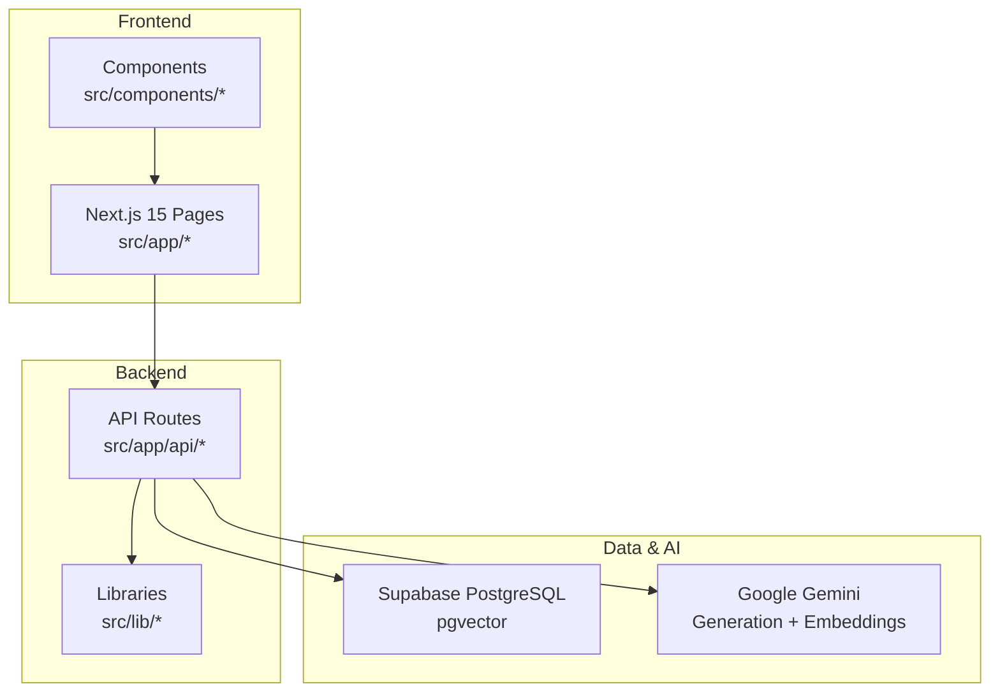
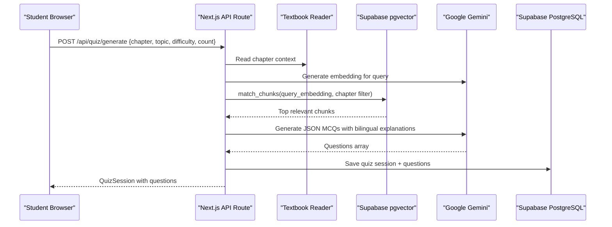
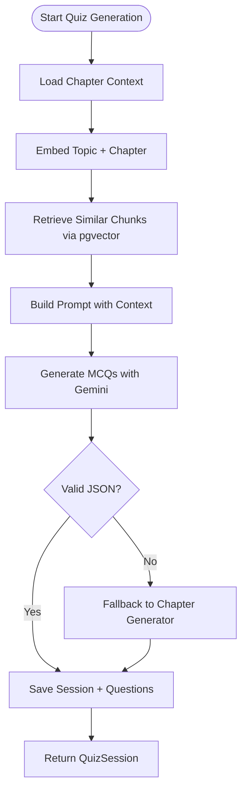
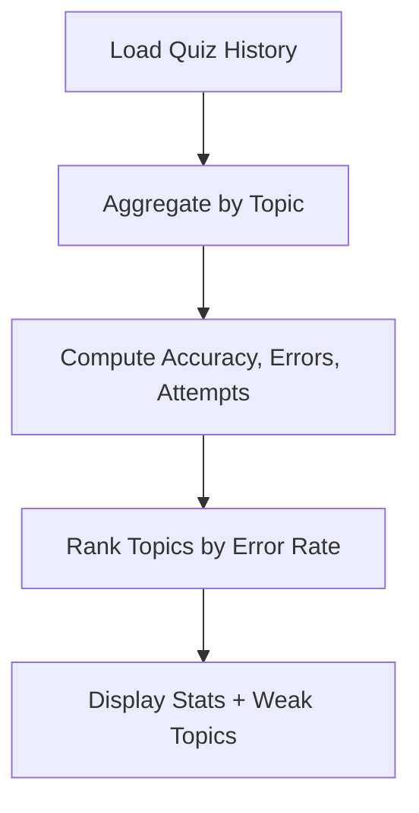
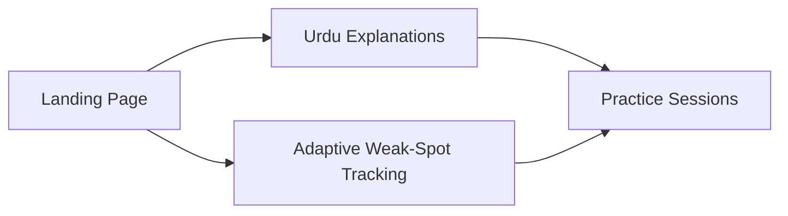
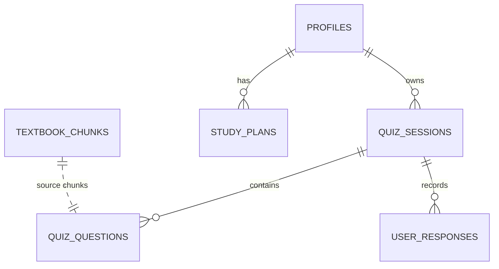
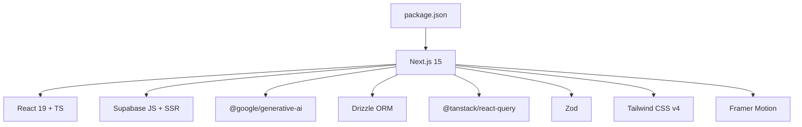

# Project Overview

<cite>
**Referenced Files in This Document**
- [README.md](file://README.md)
- [package.json](file://package.json)
- [src/app/page.tsx](file://src/app/page.tsx)
- [src/app/layout.tsx](file://src/app/layout.tsx)
- [supabase/schema.sql](file://supabase/schema.sql)
- [src/lib/textbook-reader.ts](file://src/lib/textbook-reader.ts)
- [src/lib/progress-tracker.ts](file://src/lib/progress-tracker.ts)
- [src/app/api/quiz/generate/route.ts](file://src/app/api/quiz/generate/route.ts)
- [scripts/ingest-textbooks.ts](file://scripts/ingest-textbooks.ts)
</cite>

## Table of Contents
1. Introduction
2. Project Structure
3. Core Components
4. Architecture Overview
5. Detailed Component Analysis
6. Dependency Analysis
7. Performance Considerations
8. Troubleshooting Guide
9. Conclusion

## Introduction
MedAce AI is an adaptive MDCAT preparation coach built for Pakistani students preparing for the Medical and Dental College Admission Test. It mirrors the real exam experience with English MCQs while providing on-demand Urdu explanations to bridge concept gaps, especially for students from Urdu-medium backgrounds. The platform solves three core problems:
- Expensive, urban-concentrated tutoring that leaves many students without equal access
- Lack of personalization in existing tools that do not adapt to individual weak areas
- A language gap where dense academic English explanations hinder understanding even when students can read MCQs

Target audience: Pakistani students (FSc 12th-grade) preparing for MDCAT, particularly those who benefit from bilingual support and personalized, adaptive practice.

Key differentiators:
- Adaptive weak-spot tracking that focuses future practice on topics where a student struggles
- RAG pipeline grounded in actual FSc Biology textbook content to ensure syllabus-aligned questions
- Multilingual support with English MCQs and Urdu explanations generated by Google Gemini

Technology stack summary:
- Next.js 15 App Router with React 19 and TypeScript
- Supabase (PostgreSQL + pgvector) for auth, database, vector store, and storage
- Google Gemini AI for MCQ generation, Urdu explanations, and embeddings
- TanStack Query for server state management; Zod for validation; Tailwind CSS v4 and Framer Motion for UI

Practical example: A student repeatedly misses questions on “Nervous System.” MedAce AI detects this pattern via adaptive weak-spot tracking and serves targeted follow-up questions plus an Urdu explanation to reinforce the concept before moving forward.

**Section sources**
- [README.md:7-24](file://README.md#L7-L24)
- [README.md:27-83](file://README.md#L27-L83)
- [README.md:84-127](file://README.md#L84-L127)
- [src/app/layout.tsx:12-41](file://src/app/layout.tsx#L12-L41)

## Project Structure
High-level organization:
- Frontend pages under src/app (landing, dashboard, practice, results, study-plan, profile)
- API routes under src/app/api for quiz generation, submission, stats, and study plan creation
- Shared components under src/components (UI primitives, layout, providers)
- Library modules under src/lib (textbook reader, progress tracker, study plan generator, validations, AI integration)
- Data ingestion scripts under scripts for ingesting textbook chapters into the vector store
- Database schema under supabase/schema.sql defining users, sessions, questions, responses, plans, and vector chunks

**Diagram sources**
- [src/app/page.tsx:1-584](file://src/app/page.tsx#L1-L584)
- [src/app/layout.tsx:1-57](file://src/app/layout.tsx#L1-L57)
- [src/app/api/quiz/generate/route.ts:1-196](file://src/app/api/quiz/generate/route.ts#L1-L196)
- [src/lib/textbook-reader.ts:1-46](file://src/lib/textbook-reader.ts#L1-L46)
- [scripts/ingest-textbooks.ts:1-189](file://scripts/ingest-textbooks.ts#L1-L189)
- [supabase/schema.sql:1-250](file://supabase/schema.sql#L1-L250)

**Section sources**
- [README.md:170-253](file://README.md#L170-L253)
- [package.json:1-43](file://package.json#L1-L43)

## Core Components
- Adaptive weak-spot tracking: Aggregates session history to compute accuracy per topic, identifies weakest areas, and informs next practice focus. Implemented in the progress tracker and surfaced across dashboard and practice flows.
- RAG pipeline: Retrieves relevant textbook chunks using embeddings and cosine similarity, then prompts Gemini to generate syllabus-grounded MCQs with bilingual explanations.
- Multilingual support: Generates English MCQs and Urdu explanations, preserving technical terms while explaining reasoning in Urdu for better comprehension.
- Study plan generation: Produces week-by-week plans aligned to target exam dates and daily goals, integrating weak-topic focus.

How these components address real challenges:
- Personalized learning path: Instead of generic question banks, MedAce AI adapts to each student’s performance, reducing wasted practice time.
- Language accessibility: Urdu explanations reduce cognitive load and improve conceptual clarity without compromising exam readiness.
- Syllabus alignment: RAG ensures questions map to actual FSc Biology content, avoiding hallucinated or off-syllabus items.

**Section sources**
- [src/lib/progress-tracker.ts:37-191](file://src/lib/progress-tracker.ts#L37-L191)
- [src/app/api/quiz/generate/route.ts:29-135](file://src/app/api/quiz/generate/route.ts#L29-L135)
- [README.md:84-127](file://README.md#L84-L127)
- [README.md:358-411](file://README.md#L358-L411)

## Architecture Overview
The system combines a modern Next.js frontend with server-side API routes that orchestrate retrieval-augmented generation and data persistence.

**Diagram sources**
- [src/app/api/quiz/generate/route.ts:10-187](file://src/app/api/quiz/generate/route.ts#L10-L187)
- [src/lib/textbook-reader.ts:9-45](file://src/lib/textbook-reader.ts#L9-L45)
- [scripts/ingest-textbooks.ts:97-183](file://scripts/ingest-textbooks.ts#L97-L183)
- [supabase/schema.sql:26-44](file://supabase/schema.sql#L26-L44)
- [supabase/schema.sql:116-150](file://supabase/schema.sql#L116-L150)

## Detailed Component Analysis

### RAG Pipeline and Question Generation
- Build-time indexing: Ingests 15 FSc Biology chapters, cleans text, chunks with overlap, generates embeddings, and stores vectors in Supabase pgvector with HNSW index for fast cosine similarity search.
- Query-time generation: On demand, embeds the user’s topic/chapter request, retrieves top chunks, constructs a prompt with textbook context, and asks Gemini to return structured MCQs with English and Urdu explanations.
- Fallback behavior: If AI generation fails or keys are missing, falls back to a deterministic chapter question generator to keep the app functional.

**Diagram sources**
- [scripts/ingest-textbooks.ts:52-75](file://scripts/ingest-textbooks.ts#L52-L75)
- [scripts/ingest-textbooks.ts:97-183](file://scripts/ingest-textbooks.ts#L97-L183)
- [src/app/api/quiz/generate/route.ts:29-135](file://src/app/api/quiz/generate/route.ts#L29-L135)
- [supabase/schema.sql:38-44](file://supabase/schema.sql#L38-L44)

**Section sources**
- [README.md:84-127](file://README.md#L84-L127)
- [scripts/ingest-textbooks.ts:1-189](file://scripts/ingest-textbooks.ts#L1-L189)
- [src/app/api/quiz/generate/route.ts:1-196](file://src/app/api/quiz/generate/route.ts#L1-L196)

### Adaptive Weak-Spot Tracking
- Computes per-topic error rates and attempt counts from local or backend session history
- Ranks weak topics to guide next practice recommendations
- Surfaces best/worst topics and weekly activity metrics on the dashboard

**Diagram sources**
- [src/lib/progress-tracker.ts:37-191](file://src/lib/progress-tracker.ts#L37-L191)

**Section sources**
- [src/lib/progress-tracker.ts:1-192](file://src/lib/progress-tracker.ts#L1-L192)

### Multilingual Support and UX
- Landing page highlights bilingual explanations and adaptive coaching
- MCQs include both English and Urdu explanations to aid concept mastery
- UI uses accessible design patterns and animations to enhance engagement

**Diagram sources**
- [src/app/page.tsx:220-338](file://src/app/page.tsx#L220-L338)

**Section sources**
- [src/app/page.tsx:1-584](file://src/app/page.tsx#L1-L584)

### Data Model and Security
- Profiles store user metadata and streaks
- Quiz sessions and questions persist per user with bilingual explanations
- User responses track correctness and timing
- Study plans store JSONB weekly plans
- Row Level Security policies restrict access to user-owned data
- Vector table supports fast similarity search for RAG

**Diagram sources**
- [supabase/schema.sql:11-109](file://supabase/schema.sql#L11-L109)
- [supabase/schema.sql:155-229](file://supabase/schema.sql#L155-L229)

**Section sources**
- [supabase/schema.sql:1-250](file://supabase/schema.sql#L1-L250)

## Dependency Analysis
Core runtime dependencies and their roles:
- Next.js 15: Full-stack framework powering pages and API routes
- React 19 + TypeScript: UI runtime with type safety
- Supabase JS + SSR: Auth, database, vector store, and storage client
- Drizzle ORM: Type-safe queries and migrations
- TanStack Query: Server state caching and optimistic updates
- Google Generative AI: Gemini models for generation and embeddings
- Zod: Runtime validation for API inputs/outputs
- Tailwind CSS v4 + Framer Motion: Styling and animations

**Diagram sources**
- [package.json:11-40](file://package.json#L11-L40)

**Section sources**
- [package.json:1-43](file://package.json#L1-L43)
- [README.md:61-83](file://README.md#L61-L83)

## Performance Considerations
- Vector search efficiency: HNSW index on embeddings enables fast cosine similarity queries for RAG retrieval
- Chunking strategy: Paragraph-based chunking with overlap preserves context continuity and improves retrieval quality
- Rate limiting: Ingestion script includes retries and delays to respect free-tier limits and avoid throttling
- Client-side caching: TanStack Query reduces redundant network calls and improves perceived performance
- Fallback mechanisms: Graceful degradation to deterministic question generators if AI services are unavailable

[No sources needed since this section provides general guidance]

## Troubleshooting Guide
Common issues and resolutions:
- Missing environment variables: Ensure Supabase URL, keys, and Gemini API key are set before running dev or ingestion scripts
- Ingestion failures: Check directory structure for rag/textbooks/*.txt and verify embeddings succeed; handle rate-limit errors with retries
- RAG retrieval empty: Confirm vector index exists and match_chunks RPC is available; validate chapter filters and thresholds
- Auth/session errors: Verify Supabase Auth callback route configuration and OAuth settings

**Section sources**
- [README.md:255-271](file://README.md#L255-L271)
- [scripts/ingest-textbooks.ts:135-165](file://scripts/ingest-textbooks.ts#L135-L165)
- [supabase/schema.sql:116-150](file://supabase/schema.sql#L116-L150)

## Conclusion
MedAce AI delivers a focused, adaptive, and multilingual MDCAT prep experience tailored to Pakistani students. By combining authentic exam simulation, RAG-powered question generation from real textbooks, and adaptive weak-spot tracking, it addresses the critical gaps in accessibility, personalization, and language support. The modern tech stack ensures scalability, reliability, and a smooth developer experience, while the architecture keeps the student at the center of every interaction.

[No sources needed since this section summarizes without analyzing specific files]